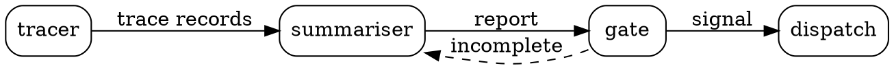

<picture>
  <source media="(prefers-color-scheme: dark)" srcset="darkprint-brand/on-black/readme-banner-1600x400.png">
  
</picture>

<p align="center">
  <a href="https://www.darkprint.io"><b>www.darkprint.io</b></a>
  &nbsp;·&nbsp;
  <a href="https://www.darkprint.io/blueprints">Browse the registry</a>
  &nbsp;·&nbsp;
  <a href="https://www.darkprint.io/what-a-blueprint-is">What a blueprint is</a>
  &nbsp;·&nbsp;
  <a href="docs/ARCHITECTURE.md">Architecture</a>
</p>

---

## The idea

Agent pipelines are usually described in prose, or in a diagram nobody can check. DarkPrint
writes one down as a typed graph and then reads it back.

A blueprint is a folder. One `topology.dot` says which nodes exist and what flows between
them. One YAML card per node says what that node does, what it accepts, what it emits, and
what it will never do. A README explains the folder to whoever opens it.

Nothing in that folder is prose the machine ignores. The engine resolves the pair statically
and reports what the shape implies: where a person has to act, what the risk surface is, and
whether the node producing the work can see the criteria the work is judged against.

## What that looks like

`content/blueprints/pipeline-observability/topology.dot`, entire:



Each node pins a card at an exact version. Here is part of the one `gate` pins:

```yaml
id: anomaly-gate
type: validation
phase: testing

inputs:
  - name: report
    type: report
outputs:
  - name: signal
    type: event
  - name: rejected
    type: status

will_not:
  - edit the report it judges
  - move a threshold to make a run pass

params:
  max_retries: 2
```

From those two files alone the engine knows the edge from `gate` back to `summariser` is a
loop, that `max_retries` bounds it, and that an unbounded version would score differently.
It knows `signal` is an `event` and the port it lands on accepts one. And `will_not` is a
refusal the author declared, which the resolver enforces against incoming edges rather than
leaving as a sentence.

A coding agent fetches that folder and instantiates it on its own machine. **Nothing here
runs a blueprint.**

## This repository

`www.darkprint.io`: the site, the engine, the Postgres-backed registry, the MCP server, the
`darkprint` CLI and the blueprint-writing skill.

| Surface | What it is |
| --- | --- |
| The site | Browse and search the registry, validate a folder in the browser, publish |
| MCP server | Seven read tools at `/api/mcp`, remote, nothing to install |
| `darkprint` CLI | `clone`, `validate`, `export`, `import`, `bump`, `report`, `skill` |
| The skill | Interviews an author in their agent and writes the folder |

## What is real and what is not

Real: the registry in Postgres, with accounts (GitHub and Google), publishing, forks,
drafts, per-bundle visibility, saves, stars, notes, API keys and run-report ingestion. The
autonomy class, security level and phase coverage of every release, computed by `lib/core`
at publish and stored on the release row. Search that ranks by a sentence-encoder vector
plus word coverage, with the model vendored under `models/`. Seven MCP tools served over
HTTP at `/api/mcp`, which Claude Code, Codex, Cursor, VS Code and Gemini CLI connect to with
nothing installed. The DarkPrint skill's tree, served file by file with a manifest of hashes.

Not real yet: **the `darkprint` package is not published to npm**, so every `npx -y darkprint`
line answers 404. The package is ready to publish from `packages/mcp`, and every install line
on the site carries that limit beside it until it is. Nothing here runs a blueprint, runs a
node, or calls a model on anyone's behalf. The seeded community numbers that remain are
labelled as seeded where they render. No mail is sent.

## Getting started

```bash
docker compose up -d          # Postgres with pgvector on 5432, MinIO on 9000
cp .env.example .env.local
npm install
npm run db:migrate
npm run seed:import           # publishes the ten content/ blueprints into the registry
npm run dev                   # http://localhost:3000
```

`models/all-MiniLM-L6-v2` is vendored (23 MB). Without it, search falls back to word matching.

## The four gates

All four must pass before work is done. Run them yourself.

```bash
npm run typecheck   # tsc --noEmit; run a build (or npx next typegen) once first
npm run lint        # eslint
npm test            # vitest; needs the compose stack and .env.local loaded in the shell
npm run build       # prebuild regenerates public/bundles, public/cards and public/skill
```

`npm test` creates and drops scratch databases beside the one `DATABASE_URL` names. Never
point it at production. `npm run build` rewrites generated files under `public/`; commit that
diff with the change that caused it.

## Project structure

```
app/                 pages and API route files (the tables are in docs/ARCHITECTURE.md §4)
components/          UI, one folder per surface plus site, ui and viz
lib/core/            the engine: DOT, cards, ontology, bundle resolution, analysis, digests,
                     versioning, Attractor emit and import. Isomorphic; it runs on /upload too.
lib/content/         reads content/ at build time; exports a bundle as files
lib/db/              drizzle schema, the pool, object storage, migrations
lib/server/          accounts, archive, auth, cards, engine, export, http, lifecycle, limits,
                     lineage, mcp, naming, notes, notifications, ontology, policy, profiles,
                     publish, registry, runs, saves, search, seed, terms, versioning
packages/cli/        the darkprint verbs
packages/mcp/        the darkprint package: the bin, the stdio MCP server, the tool table
skills/darkprint/    the blueprint-writing skill: SKILL.md, references, templates
content/             10 blueprints, 61 card versions, ontology/extensions.yaml
models/              all-MiniLM-L6-v2, quantised ONNX (23 MB)
scripts/             prebuild, seed import, re-embed, retrieval eval, production preflight
tests/               the backend suites, tree-wide guards, scratch-database support
docs/                ARCHITECTURE.md, the appendix, the source notes
darkprint-brand/     the mark and the wordmark, rendered on both grounds
```

## Where to read next

- [`docs/ARCHITECTURE.md`](docs/ARCHITECTURE.md): routes, data model, the engine pipeline,
  publishing, search, MCP, CLI, skill, auth, environment, local development, deploy, known gaps.
- `docs/appendix/`: how a blueprint, a node card, the ontology and the engine are defined,
  each with what breaks if you change it.
- [`AGENTS.md`](AGENTS.md) and [`CLAUDE.md`](CLAUDE.md): the rules an agent working in this
  repository follows.
- [`/spec/topology`](https://www.darkprint.io/spec/topology),
  [`/spec/card`](https://www.darkprint.io/spec/card) and
  [`/spec/attractor`](https://www.darkprint.io/spec/attractor): the same material for a reader.
