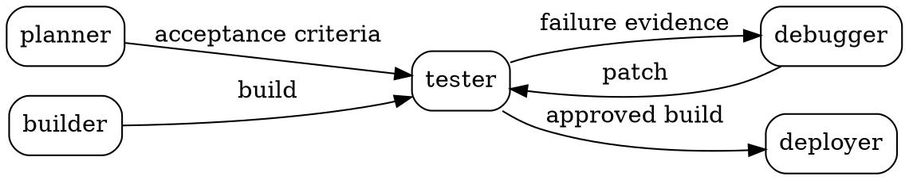

# How a blueprint is defined

A blueprint is a **graph plus the cards its nodes are pinned to**. It is stored as a folder of
text and it is handed back as a folder of text.

**Source of truth:** `lib/core/bundle/types.ts`, `lib/core/bundle/resolve.ts`,
`lib/core/dot/{lexer,parser,graph}.ts`, `lib/content/bundle-export.ts`.
**Examples:** `content/blueprints/<slug>/` — 9 of them.
**Generated:** `public/bundles/<slug>/` by `scripts/generate-bundles.ts` via `prebuild`.

---

## Source layout

```
content/blueprints/starter-software-factory/
  blueprint.yaml     the manifest: identity, prose, tags, author, ontology version
  topology.dot       the topology: which nodes exist, what flows between them
```

Cards are **not** copied in. They live once in `content/cards/` and the DOT pins them by
`id@version`, which is what lets one card serve many blueprints.

### `blueprint.yaml`

```yaml
slug: starter-software-factory
title: Starter Software Factory
summary: >-
  The canonical five-node factory ... and the one edge it deliberately does not have.
description: |-
  ...longer prose, markdown...
category: Software
tags: [starter, tutorial, isolation, software]
author: orin
ontologyVersion: "0.1.0"
createdAt: "2026-07-28"
updatedAt: "2026-07-28"
```

### `topology.dot`

A strict DOT subset. Nodes carry `card="id@version"`; edges carry `label` naming what they
carry.



**Nothing runs `planner -> builder`.** The acceptance criteria reach the node that judges the
work and never the node that produces it. That absence is the point of the blueprint, and it
is enforced twice — see [`engine.md`](./engine.md).

The parser is hand-written (lexer → recursive descent) and lives in `lib/core/dot/`. It is a
subset, not full Graphviz: no subgraph mutation, no HTML labels.

---

## What a reader downloads

`public/bundles/<slug>/`, regenerated from source at every build:

```
topology.dot           the topology as authored, with card pins
factory.dot            the same graph, RUNNABLE BY ATTRACTOR
cards/*.yaml           every card the graph pins, at the pinned version
ontology/extensions.yaml   only when the bundle uses local terms
README.md              digest, command, scores, and what each file is
```

### `topology.dot` vs `factory.dot`

They are the same graph for two different readers.

| | `topology.dot` | `factory.dot` |
|---|---|---|
| for | a person, and DarkPrint | Attractor |
| nodes | `card="id@version"` | `label`, `shape`, `prompt`, `llm_model`, `max_retries`, and `card` |
| entry/exit | implicit | explicit `__start` (`Mdiamond`) and `__exit` (`Msquare`) |
| the spec | in the card file | **inlined** as `prompt` |

`factory.dot` runs as it stands. A runner handed that folder and nothing else has the whole
instruction for every node, which is why no skill document needs to travel with it.

Attractor **silently ignores unreserved attributes**, which is why `card="id@version"` can
ride along in a file Attractor executes without confusing it. Reserved attributes DarkPrint
emits: `prompt`, `llm_model`, `max_retries`, `label`, `shape`, `goal`.
`lib/core/attractor/{reserved,lint,emit}.ts` owns this.

---

## Resolution

`resolveBundle` (`lib/core/bundle/resolve.ts`) turns a folder into a `ResolvedBlueprint`, or
into diagnostics. In order, it:

1. parses the DOT;
2. loads and validates every card the graph pins;
3. matches each edge to a port on both ends, and checks the data types against the ontology
   lattice;
4. checks declared prohibitions — **`cannot`** — against what each incoming edge carries;
5. checks declared dependencies are present;
6. checks reachability, entry and exit;
7. checks the version chain when a bundle carries two versions of one card;
8. computes a content-addressed digest over the canonical JSON.

Any **error**-severity diagnostic means the bundle does not resolve. `lib/content/read.ts`
throws on one, so a broken bundle fails the build rather than shipping.

A resolved bundle is then analysed — autonomy, security, phase coverage — which is
[`engine.md`](./engine.md).

---

## The digest

`sha256` over canonical JSON, computed by a **pure-TypeScript** implementation
(`lib/core/hash/`) because the engine must run in the browser. The digest is printed in the
bundle README so a reader can verify that what they downloaded is what was scored.

---

## What breaks if you change this

| change | what goes stale |
|---|---|
| **edit a `topology.dot`** | that bundle's digest, its README, its scores, and any figure drawn from it — `components/home/roles.ts` reparses the starter's DOT and `roles.test.ts` fails on drift |
| **bump a card a blueprint pins** | the pin in `topology.dot`; the version-chain check fails the build until both agree |
| **add a reserved Attractor attribute** | `attractor/reserved.ts`, `emit.ts`, `lint.ts`, and the interop claim on `/spec/topology` |
| **change the export layout** | `bundle-export.ts`, the README generator, `/blueprints` download copy, and the `/upload` validator, which must still accept the folder DarkPrint generates |
| **change canonical JSON or the hash** | every digest in every README and every archive key |

That last one has bitten before in spirit: an earlier export omitted a bundle's local ontology
extensions, so DarkPrint's own upload rejected a folder DarkPrint had generated. **The test
that matters is the round trip** — export a bundle, feed it back through `/upload`, and it
must resolve with the same scores.
