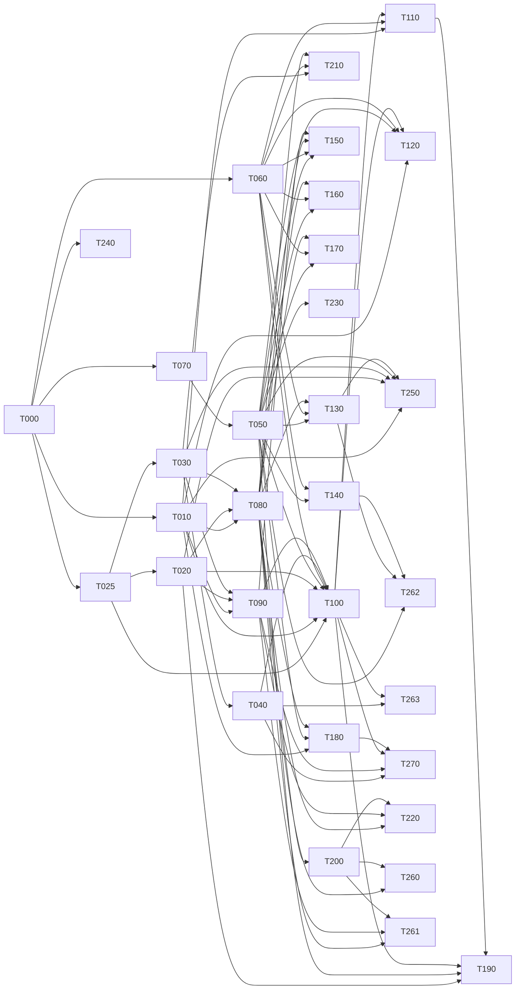

# Backend implementation state

Single source of truth for task partition, dependency graph, worktree assignment and task state.
Every agent updates only its own task row and its own task section. Never edit another task's rows.

Partitioned from `docs/BACKEND_SPEC.md` (31 aspects) under `docs/ORCHESTRATION.md` Phase 0, against
commit `8a9801e`, and revised on 2026-08-13 against the owner's twenty answers recorded below.
One deliberate addition to the format: task sections carry an **Open** line when a sub-question
inside the task is still unsettled. A task with no Open line has a contract derivable in full.

## Live slots

**Base branch is `backend`, not `main`.** The protocol says `main` throughout; `main` and `backend`
were identical at `8a9801e` when this run started, the work and these three documents live on
`backend`, and worktrees branched from `main` would not contain this file. Substitute `backend`
wherever `docs/ORCHESTRATION.md` says `main`. Recorded here rather than assumed.

| Slot | Task | Worktree | State |
|---|---|---|---|
| 1 | T000 | `../darkprint-wt-t000-foundation` | reverted |
| 2 | — | — | empty (T000 runs alone) |
| 3 | — | — | empty (T000 runs alone) |

## The contract must name the interface, not only the behaviour

Learned the expensive way in T000, and it binds every task in this file from here on.

Three separate defects — D-01 (no barrel at `lib/db`), D-09 (the guard's shape), D-08 (a
migration function with no database parameter) — turned out to have one cause. The contract
stated what each capability must *do* and never what it must *look like*, so the implementer
and the blind test author each chose a reasonable interface, chose differently, and neither
was wrong. Two agents who cannot see each other cannot converge on a name, an arity or a
call shape by reasoning about behaviour. They can only converge on something written down.

**So every task's Contract section states the exact exported signatures of its public
surface**, not just its semantics: the module each name is published from, the parameter
list, and what it returns. A capability reachable only by a deep path is not public. Where a
signature is left open, the test author reports it rather than resolving it — a candidate
list papers over the gap and then resolves to whichever name happens to exist first, which is
precisely how D-08 selected the one function that could not be isolated.

## Decisions

Owner-stated, 2026-08-13, in the session that produced this partition. These are the premises every
task contract below is written against. An agent that finds one of them wrong stops and reports;
it does not decide differently inside a worktree.

| ID | Decision |
|---|---|
| B-01 | Bytes live in S3-compatible object storage keyed by digest; the index lives in scale-to-zero Postgres. Both standard interfaces, so the host is a connection string. Frontend stays on Vercel, backend may live elsewhere (Scaleway under evaluation). |
| B-02 | Sign-in is GitHub OAuth. **Supersedes `docs/DECISIONS.md` D-81** (`AGENT-PROPOSED`, unowned), which ruled GitHub OAuth out as a product constraint. |
| B-03 | Responses carry data plus diagnostics at 200 — a bundle resolving with errors is an answer, not a failure. Transport and auth failures use RFC 9457 `problem+json`. A private resource the caller may not see returns 404, never 403, so existence does not leak. |
| B-04 | Versioning is server-authoritative and covers all three primitives: blueprints, cards and ontology. Every release carries an author-declared semver **and** the engine-computed digest. Bump inference and chain checking apply to all three, where today only cards have them. Deprecation carries a successor pointer. The `darkprint` CLI drives it. |
| B-05 | A handle is chosen at sign-up and is independent of the GitHub login; GitHub supplies credentials only. Handles are unique, reserved permanently once used, and renameable with the old handle staying reserved. |
| B-06 | A bundle first exists at its first publish. One record per `(owner, slug)`, releases appended. The wizard, the bundle page and the CLI all write the same thing: create if the slug is free, append a release if it is not. |
| B-07 | Node cards may be private, and a private card is validated identically to a public one. Ontology terms stay public. |
| B-08 | The two engine axes are computed when a release is cut and stored beside the ontology version they were computed under. An ontology release triggers a re-score. |
| B-09 | Slugs are unique **per owner**. The public blueprint route becomes `/blueprints/{owner}/{slug}`, with a permanent redirect from the old single-segment shape. |
| B-10 | One polymorphic target `(kind, id)` carries stars, downloads and notes for both blueprints and cards. Card counters aggregate per card id, not per version. |
| B-11 | The ballot is 0–100 per metric, one ballot per account per blueprint carried across releases, with validator weight applied at read so a later grant applies retroactively. Below five votes the response is a sample, not a figure. |
| B-12 | Search is semantic from day one, over the manifest and card specs. The ordering must be explainable or results come back unordered with evidence — the constraint `/mcp` already states. MCP ships as the advertised stdio server over the same API. |
| B-13 | The only subjects are the owner of a resource and a break-glass operator. No moderator tier, no organisations, no team ownership. |
| B-14 | Every state change writes an audit row (actor, action, target, time). Request logs are operational and short-lived (~90 days). Downloads are counted by an explicit event at the serving edge, never derived from logs. Nothing records a blueprint run. |
| B-15 | The frontend cutover is in scope, re-partitioned by route group so the groups can run in parallel. Public reads stay static with tag-based revalidation; owner surfaces go per-request. |
| B-16 | Run reports are submitted by the CLI, keyed by release digest, accepted on well-formedness alone. The word stays `reported`, never `measured`. |
| B-17 | Rate limits apply to reads and writes, with API keys issued for high-volume consumers. **Supersedes `docs/DECISIONS.md` D-83** (`AGENT-PROPOSED`, unowned), which asked for no anti-scraping measures; the cost is discoverability by the MCP and LLM audience, accepted knowingly. |
| B-18 | An author may edit and delete their own notes; the operator may remove any. Deletion is a tombstone so counts and cursors stay honest. No report queue, no appeals. |
| B-19 | Notifications are email only, through a usage-billed provider, using the four events and preferences already modelled. No in-app inbox. |
| B-20 | All seed content is re-attributed to one registry-owned handle; the six invented authors do not become accounts. **Assumption pending confirmation:** seeded downloads, stars and votes import as zero, since a real registry printing counts nothing ever measured is the failure this codebase's whole design guards against. |

## Task index

| ID | Title | Deps | Owns (paths) | Worktree | Branch | State | Evidence |
|------|-------|------|--------------|----------|--------|-------|----------|
| T000 | Foundation: schema, client, envelope, GitHub session, harness | — | `lib/db/**`, `lib/server/http/**`, `lib/server/auth/**`, `lib/server/types.ts`, `tests/support/**`, `compose.yaml`, `.env.example`, `package.json`, `package-lock.json` | `../darkprint-wt-t000-foundation` | `feat/t000-foundation` | tests-written | 64 tests in `tests/server/**`, all red |
| T010 | Archive persistence: bundles, releases, bytes | T000 | `lib/server/archive/**` | — | — | todo | — |
| T025 | Versioning service: semver, digest, bump, chains | T000 | `lib/server/versioning/**` | — | — | todo | — |
| T060 | Authorization policy: owner and operator | T000 | `lib/server/policy/**` | — | — | todo | — |
| T070 | Namespace: handles, slugs, reservation | T000 | `lib/server/naming/**`, `app/api/names/**` | — | — | todo | — |
| T240 | Observability and audit log | T000 | `lib/server/observability/**` | — | — | todo | — |
| T020 | Card library: versions, digests, private cards | T000, T025 | `lib/server/cards/**` | — | — | todo | — |
| T030 | Ontology store, merged view, versioned releases | T000, T025 | `lib/server/ontology/**` | — | — | todo | — |
| T050 | Accounts and sessions | T000, T070 | `lib/server/accounts/**`, `app/api/auth/**`, `app/api/account/{route,profile,handle,email,default-visibility}` | — | — | todo | — |
| T040 | Engine service: validate and analyze | T000, T030 | `lib/server/engine/**`, `app/api/validate/**` | — | — | todo | — |
| T080 | Registry read model and read API | T010, T020, T030 | `lib/server/registry/**`, `app/api/blueprints/**`, `app/api/cards/**`, `app/api/ontology/**` | — | — | todo | — |
| T090 | Distribution and export artefacts | T010, T020, T030 | `lib/server/export/**`, `app/api/files/**` | — | — | todo | — |
| T140 | Saves (private bookmarks) | T050, T060 | `lib/server/saves/**`, `app/api/account/saves/**` | — | — | todo | — |
| T230 | Rate limiting and API keys | T000, T050 | `lib/server/limits/**`, `app/api/account/keys/**` | — | — | todo | — |
| T100 | Publishing and releases | T010, T020, T025, T040, T050, T060, T070, T090 | `lib/server/publish/**`, `app/api/bundles/**` | — | — | todo | — |
| T130 | Profiles and the public author surface | T050, T060, T080 | `lib/server/profiles/**`, `app/api/authors/**` | — | — | todo | — |
| T150 | Counters: stars and downloads | T050, T060, T080, T090 | `lib/server/counters/**`, `app/api/signals/**` | — | — | todo | — |
| T160 | Community ballot and vote weighting | T050, T060, T080 | `lib/server/ballot/**`, `app/api/votes/**` | — | — | todo | — |
| T170 | Notes and note votes | T050, T060, T080 | `lib/server/notes/**`, `app/api/notes/**` | — | — | todo | — |
| T180 | Run-report ingestion and cost aggregation | T010, T050, T080 | `lib/server/runs/**`, `app/api/runs/**` | — | — | todo | — |
| T200 | Semantic search and ranking | T080 | `lib/server/search/**`, `app/api/search/**` | — | — | todo | — |
| T210 | Term-usage index and promotion | T030, T060, T080 | `lib/server/terms/**`, `app/api/ontology-usage/**` | — | — | todo | — |
| T110 | Fork, lineage and drift | T010, T060, T100 | `lib/server/lineage/**`, `app/api/lineage/**` | — | — | todo | — |
| T120 | Ownership transfer and account deletion | T010, T050, T060, T100 | `lib/server/lifecycle/**`, `app/api/transfer/**`, `app/api/account/delete/**` | — | — | todo | — |
| T220 | MCP server surface | T080, T090, T200 | `lib/server/mcp/**`, `packages/mcp/**` | — | — | todo | — |
| T250 | Seed import and re-attribution | T010, T020, T030, T050, T130 | `scripts/import-seed.ts`, `lib/server/seed/**`, `content/**` | — | — | todo | — |
| T270 | The `darkprint` CLI | T040, T090, T100, T180 | `packages/cli/**` | — | — | todo | — |
| T260 | Cutover: browse routes | T080, T200 | `app/blueprints/page.tsx`, `app/nodes/page.tsx`, `app/ontology/page.tsx`, `components/{gallery,nodes,ontology}/**` | — | — | todo | — |
| T261 | Cutover: detail routes and the URL migration | T080, T090, T200 | `app/blueprints/[owner]/**`, `app/nodes/[...id]/**`, `app/ontology/[...term]/**`, `lib/href.ts`, `next.config.ts`, `components/{blueprint,bundle,panes}/**` | — | — | todo | — |
| T262 | Cutover: profile and settings routes | T050, T130, T140 | `app/u/**`, `app/settings/**`, `components/{profile,settings}/**` | — | — | todo | — |
| T263 | Cutover: upload and publish routes | T040, T100 | `app/upload/**`, `components/upload/**` | — | — | todo | — |
| T190 | Notifications and email fan-out | T020, T050, T100, T110 | `lib/server/notifications/**`, `app/api/account/notifications/**`, `app/api/internal/events/**` | — | — | todo | — |

## Dependency graph

## Waves

- Wave 1: T000
- Wave 2: T010, T025, T060, T070, T240
- Wave 3: T020, T030, T050
- Wave 4: T040, T080, T090, T140, T230
- Wave 5: T100, T130, T150, T160, T170, T180, T200, T210
- Wave 6: T110, T120, T220, T250, T260, T261, T262, T263, T270
- Wave 7: T190

Waves are advisory. `T000` runs alone. Every wave after it offers at least three mutually
independent tasks with disjoint `Owns` sets, so no slot idles for want of ready work.

## Tasks

### T000, Foundation: schema, client, envelope, GitHub session, harness

- **State:** tests-written
- **Worktree:** `../darkprint-wt-t000-foundation` on `feat/t000-foundation`
- **Test worktree:** `../darkprint-wt-t000-foundation-tests` on `test/t000-foundation`
- **Depends on:** —
- **Blocks:** every task
- **Owns:** `lib/db/**`, `lib/server/http/**`, `lib/server/auth/**`, `lib/server/types.ts`, `tests/support/**`, `compose.yaml`, `.env.example`, `package.json`, `package-lock.json`
- **Published signatures** (amendment, 2026-08-13, after the second adversarial pass). Behaviour was not enough to converge on; these are the shapes, and they are the contract:
  - `withSession(request: Request, handler: (session: SessionPayload) => Response | Promise<Response>): Promise<Response>` — the guard **wraps**, it does not return a union. AC3 requires that the handler never runs for an unauthenticated request, and only a wrapping guard makes that structurally true: a guard that returns `payload | Response` depends on every caller checking the union, and a caller who forgets runs the handler anyway. The round-2 implementation was `requireSession(request, secret?)`, which put the handler into the secret's position and passed a function to `createHmac` as an HMAC key. Keep `requireSession` internally if useful; it is not the published guard.
  - `migrateUp(target, dir?)` and `migrateDown(target, steps?, dir?)`, where `target` is a pool or a connection string. **No zero-argument migration function is published from the barrel.** A variant that reads `DATABASE_URL` implicitly is what made D-08 possible: the blind suite's candidate list resolved `migrate` first, both suites then drove the shared database, and rollback dropped the other suite's tables mid-run — three identical invocations gave 6, 6 and 3 failures. Convenience wrappers may exist behind `npm run db:migrate`; they are not part of the public surface.
  - `createDbClient(config?: string | PoolConfig)`, and `getSharedDbClient()` for route handlers only.
  - `createObjectStorage(config?)`, `keyForDigest(digest)`, and put, get and delete on `ObjectStorage`.
  - `tests/support/db.ts` creates and drops its own database rather than targeting `DATABASE_URL`, per the isolation rule it currently violates. It is the harness nine downstream tasks inherit, so the assumption baked into it propagates.
- **Public import surface** (amendment, 2026-08-13, after the first adversarial pass): every owned directory publishes a barrel and downstream code imports only through it — `@/lib/db`, `@/lib/server/http`, `@/lib/server/auth`, `@/lib/server/types`. This is the rule `lib/core/index.ts` already states for this repository: "Deep paths are internal and may be rearranged, so nothing outside `lib/core` should reach for one." A capability reachable only by a deep path is not part of the public interface. The object-storage client is published from `@/lib/db`, since B-01 treats Postgres and object storage as one connection concern and `lib/db/**` is the only owned path that can hold it.
- **Forbidden:** `lib/core/**`, `lib/content/**`, `lib/data/**`, `app/**` outside `app/api/auth/**`, `components/**`, `tests/server/**` (the test branch owns it)
- **Goal:** the scaffolding every other task derives from — Postgres schema and migrations, the client factory, the object-storage client, the response envelope, GitHub OAuth session handling, and the local infrastructure both branches run against. Contracts and schema only, no feature logic.
- **Environment contract** (published here so the implementer and the blind test author agree without seeing each other): local infrastructure is `compose.yaml` bringing up Postgres with `pgvector` available (wave 5 needs it and a later image swap would be a migration) and a MinIO bucket for object storage. Both sides read the same variables: `DATABASE_URL`, `S3_ENDPOINT`, `S3_BUCKET`, `S3_ACCESS_KEY_ID`, `S3_SECRET_ACCESS_KEY`, `GITHUB_CLIENT_ID`, `GITHUB_CLIENT_SECRET`, `SESSION_SECRET`. **Agent B's tests must be self-sufficient**: they read those variables directly and must not import anything under `tests/support/**`, which does not exist on the test branch and whose absence would produce a broken test rather than a red one. Tests live in `tests/server/**`, which the implementation branch never touches.
- **Test isolation** (amendment, 2026-08-13, after the first adversarial pass): the contract said nothing about who guarantees a clean database, and the first round proved the cost — the adversary's probes left seven scratch databases and several dozen objects in the shared bucket, and because D-04 is an empty-digest *bucket listing*, the defect's own reproduction had become a function of that residue. **No test may assume the shared `darkprint` database or bucket is empty**, and none may leave state behind that another test can observe. The rule differs by how each store is addressed, and the difference is not cosmetic:

  - **The database is addressed by name.** A test needing a clean one creates and drops its own. AC1's "empty database" means one the test itself created, never the shared development database.
  - **Object storage is addressed by content, so isolation comes from unique bytes and never from a chosen key.** A test may **not** prefix or namespace its keys: the key *is* the digest the engine computes over the bytes, so prefixing it stops the test exercising content addressing at all — which is precisely what AC5 asserts. Distinct fixture content yields a distinct digest and isolation therefore comes free from the addressing itself. The test then deletes what it wrote.

  **A digest is validated where it becomes a key**, once, so every verb inherits it rather than each guarding itself. The first pass had `keyForDigest` split a string with no notion of its own input, so an empty digest passed straight through to S3 — which answers a GET on an empty key with a bucket listing (D-04), a PUT with MalformedXML, and a DELETE with *success*. That last one is the reason this is stated at contract level rather than left as an implementation detail: an unvalidated delete reports removing what it never touched, and silent success is the failure mode this codebase is built against. Binds T010 onward, which all handle digests.

  That last clause needs a capability the first pass did not publish: `ObjectStorage` exposed only put and get, so cleanup through the public interface was impossible and every storage test would have had to reach past the client to the S3 SDK — D-01 in a different hat. **T000 therefore also publishes a delete from `@/lib/db`.** It does not publish a list: enumerating a bucket is the whole of D-04, and nothing in this contract needs it.

  This binds every task from T010 on, all of which share the same stack. Corrected 2026-08-13 after the adversary caught both defects in the amendment's first wording, within the hour it was written.
- **Contract:** domain types are re-exported from `lib/core/**` and `lib/types.ts`, never restated (B-01). Storage is split: an S3-compatible client keyed by digest for bytes, Postgres for the index. The envelope is B-03 — a handler returns its payload at 200, including payloads that carry `diagnostics: Diagnostic[]` describing failure of the *content*; transport, auth and shape failures return `application/problem+json` per RFC 9457 with `type`, `title`, `status`, `detail`, `instance`; a resource the caller may not see returns 404. Session is a GitHub OAuth cookie (B-02) exposing `{ accountId, handle }` or nothing. Schema covers the tables every later task extends: `account`, `handle_reservation`, `bundle`, `release`, `card_version`, `ontology_version`, `ontology_term`, `target`, `target_actor`, `audit`. **`target_actor` is an amendment (2026-08-13)**, raised by the implementer and accepted: `target` carries aggregate counters but nothing records *who* acted, so T150's "starring twice yields 1" and T170's "a vote from one account counts once" would have had no idempotency storage to reach for — and every downstream task's `Owns` excludes `lib/db/**`, so they could not have added it themselves. One row per `(target, account, kind)`, where kind distinguishes a star from a note vote.
- **Acceptance criteria:** (1) migrations apply to an empty database and are idempotent on re-run; (2) rollback returns the schema to the prior state; (3) a request with no session reaching a guarded handler receives a `problem+json` 401 and no body from the handler; (4) a handler returning diagnostics returns 200 and the diagnostics survive serialisation intact, including `location`; (5) an object written to storage under a digest reads back byte-identical; (6) every type exported from `lib/server/types.ts` is the engine's own, verified by identity not by shape.
- **Out of scope:** any route serving a domain object, any feature logic, any read model.
- **Log:**
  - 2026-08-13 orchestrator: created. Unblocked by B-01, B-02, B-03.
  - 2026-08-13 orchestrator: partition amendment before claim. `tests/server/**` moved to the test branch's sole ownership and an environment contract published in this section, because Agent B's worktree branches before Agent A commits and any test importing `tests/support/**` would fail on a bad import, which the protocol calls a broken test rather than a red one. `compose.yaml` and `.env.example` added to Owns.
  - 2026-08-13 orchestrator: claimed. Worktrees created from `backend` at `e29f64a`; slot 1 occupied, slots 2 and 3 left empty because T000 runs alone.
  - 2026-08-13 orchestrator: **round 2 FAIL, verified**. Adversary `990c1bb`, merge `2270148`. All seven round-1 defects confirmed fixed by invocation, and typecheck, lint and build are now all green. Two findings stop it, and I verified the cause of each from source rather than reproducing a flaky count. D-08: `migrate(dir?)`/`rollback(steps?, dir?)` take no database and use `DATABASE_URL` implicitly, while `migrateUp(pool, ...)` does take one; the blind candidate list resolves `migrate` first, so both suites drove the shared database and rollback dropped the other's tables mid-run. D-09: `requireSession(request, secret?)` against a harness calling `guard(request, handler)`, so the handler reached `createHmac` as an HMAC key. Neither is an implementation defect in the ordinary sense — both are the contract naming behaviour and not shape, which is now fixed at the top of this file and in Published signatures above. Amendment 7.
  - 2026-08-13 orchestrator: **gate run and triage after the adversary's FAIL** (`c7debfd`). Verdict verified independently rather than accepted: typecheck reproduced with exactly one error, `tests/server/contract.ts(65,23) TS2307 Cannot find module '@/lib/db'`; suite reproduced red (37 failed here against the adversary's 32, the five extra being env-dependent tests failing without the compose stack up, which is a difference in my run and not in its report); D-02 and D-07 confirmed from source. Triage of the seven defects: **D-01 is a contract defect and mine, not the implementer's** — the contract named `lib/db/**` in `Owns` and never stated the import surface, so the implementer published no barrel and the test author, which had resolved the ambiguity in its own favour rather than reporting it, imported one. Amended above under *Public import surface*. D-02 through D-07 are genuine implementation defects and go back to Agent A. T-01 (raw NUL bytes) and T-02 (the session-writer candidate list omitting `sessionCookieHeader`, so five reds claim a broken round trip that direct invocation shows works) are test-branch defects and go back to Agent B.
  - 2026-08-13 orchestrator: **third partition fix**. `package.json` and `package-lock.json` were in no task's `Owns`, and the implementer had to modify both — a Postgres client cannot be added without them. Added to this task's `Owns`. The structural consequence is larger than the fix and is recorded here because it lands on every later wave: **dependency addition is a serialisation point across the whole plan.** Waves 2 to 6 run three tasks at once and any two that add a package collide in the lockfile, which is exactly the merge collision `T000` exists to prevent. Proposed remedy, for the wave-2 boundary: the orchestrator batches a wave's dependency additions onto the base branch before any task in it is claimed.
  - 2026-08-13 orchestrator: second partition fix on the base branch, before either session starts. `vitest.config.ts` collected `lib/**`, `components/**` and `scripts/**` only, so tests under `tests/server/**` would not have been collected at all and the test worktree would have reported zero tests as a pass. The glob now includes `tests/**/*.test.ts`. It is shared scaffolding that has to pre-exist both branches, so it belongs to neither task's `Owns` set and neither agent may edit it. Full suite re-run after the change: 92 files, 3625 tests, green. **Both worktrees must rebase on `backend` before starting.**
  - 2026-08-13 test author: `tests-written`. 64 tests in six files under `tests/server/**`, plus `tests/server/contract.ts`, which is a helper and not collected. Every acceptance criterion is named in its own test: AC1 four tests, AC2 three, AC3 eight, AC4 ten, AC5 thirteen, AC6 six, with the rest covering the contract clauses no criterion states (RFC 9457 members, 404 rather than 403, the session surface, the environment contract). Full suite: 64 failed, 3625 passed. Every red is a missing module, a missing file or an unset contract variable; none is a syntax error or a bad path.
  - 2026-08-13 test author, **contract amendment, naming**. The contract pins behaviour and never pins an identifier, so the tests resolve each capability from a candidate list rather than declaring one name and reporting a naming difference as a defect. The first entry in each list is the name the tests treat as canonical. From `@/lib/db`: migrate (`migrate`, `applyMigrations`, `runMigrations`, `migrateUp`, `up`), rollback (`rollback`, `rollbackMigration`, `migrateDown`, `revert`, `down`), query (`query`, `sql`, `dbQuery`, or a client factory named `createDbClient`, `createClient`, `createPool`, `getDb`, `db`, `pool`, `client` exposing `.query`), object storage (`createObjectStore`, `objectStore`, `createBlobStore`, `blobStore`, `createContentStore`, `contentStore`, `createStorage`, `storage`, `objects`, `bytes`, with `put`/`putObject`/`write`/`upload`/`store` and `get`/`getObject`/`read`/`download`/`fetch`). From `@/lib/server/http`: `ok`, `okJson`, `jsonOk`, `respond`, `payload`, `envelope`, `data`, `json`; and `notFound`, `notFoundProblem`, `problemNotFound`, `hidden`, `missing`. From `@/lib/server/auth`: `requireSession`, `withSession`, `requireAuth`, `withAuth`, `guard`, `protect`, `authenticated`; `readSession`, `getSession`, `sessionFromRequest`, `currentSession`; `createSessionCookie`, `sessionCookie`, `sealSession`, `issueSession`, `signSession`, `writeSession`, `setSession`, `encodeSession`. A name outside its list is not a failed implementation, it is a contract that never said: add the name to the list in `tests/server/contract.ts` and amend this entry. Argument order is resolved the same way, by trying each plausible call and reporting all of them when none produces a `Response`.
  - 2026-08-13 test author, **contract amendment, module paths**. Every import goes through the barrel of an owned directory (`@/lib/db`, `@/lib/server/http`, `@/lib/server/auth`, `@/lib/server/types`) and never a deep path, following the rule `lib/core/index.ts` already states for this repository. Two consequences worth stating before the merge rather than after it. First, the object-storage client is looked up in `@/lib/db`: the goal lists it as a deliverable and `lib/db/**` is the only entry in `Owns` that can hold it, so a client that turned up under `lib/server/storage/**` would be a write outside the task's own partition. Second, a capability that exists behind a deep path but is not re-exported from its barrel reds here, which is the intended reading of "public interface" and not a test defect.
  - 2026-08-13 test author, **environment policy**. The eight variables are read directly from `process.env` and an unset one fails loudly rather than skipping the suite. A test that stands down when the infrastructure is absent reports the same green as one that checked something, and `compose.yaml` is in this task's `Owns` set precisely so that "the infrastructure is not up" is an instruction rather than an excuse. `tests/server/environment.test.ts` also asserts that `compose.yaml` exists and that `.env.example` names all eight; pgvector availability is asserted for real against the running database, not by grepping the compose file.
  - 2026-08-13 test author, **evidence that the tests discriminate**. Written blind, they cannot be run against the implementation, so they were run against a throwaway correct implementation in a scratch directory, aliased in through a temporary config, and never written into this worktree: 64 passed. Each guard was then falsified against a deliberately broken variant. A guard that runs the handler and replaces its answer with the 401 fails five AC3 tests while still returning 401. An envelope that re-sorts diagnostics or pads absent optionals to `null` fails AC4. A store that normalises unicode fails AC5, and one that invents its own key fails the addressing test. A migration runner that throws on re-run fails all ten, and one without an advisory lock fails only the cold-boot race. A `lib/server/types.ts` that restates `Diagnostic` with the engine's exact shape fails three AC6 tests, which is the case that no structural or `expectTypeOf` comparison can see. One gap was found and closed this way: flipping a single character mid-cookie is passed by a reader that never verifies the signature, because the edit lands in the payload and breaks the parse instead. The test now sweeps every character position and fails on any edit that reads back as an account nobody issued.

### T010, Archive persistence: bundles, releases, bytes

- **State:** todo
- **Depends on:** T000 (contract: schema, storage client, envelope)
- **Blocks:** T080, T090, T100, T110, T120, T180, T250
- **Owns:** `lib/server/archive/**`
- **Forbidden:** `lib/db/schema.ts`, `app/**`, `lib/core/**`
- **Goal:** store and read a bundle record and its append-only releases, with each release's bytes addressed by the digest the engine computes.
- **Contract:** one record per `(owner, slug)` (B-06, B-09); releases are append-only, each carrying the author's semver, the engine's digest, the DOT source, the pinned card refs and the local vocabulary the bundle uses. Identity is `bundleDigest(dot, sortedCardDigests)` (`lib/core/hash/digest.ts:61`), computed server-side and never accepted from a client; card digests are sorted and **not** deduplicated. Bytes return verbatim. A release carrying an error-severity diagnostic is refused, never stored (`lib/content/read.ts:281-291`). Visibility is a column on the bundle record, defaulting from the account (B-07 for cards is `T020`'s).
- **Acceptance criteria:** (1) storing a release and reading it back yields byte-identical DOT and card text; (2) the stored digest equals what `lib/core` computes over the same inputs; (3) a bundle pinning one card twice stores a different digest from one pinning it once; (4) appending a release leaves every earlier release readable at its own digest; (5) a store carrying an error diagnostic persists nothing, including bytes; (6) two owners may hold the same slug and their records never collide.
- **Out of scope:** the publish workflow (T100), the query index (T080), file serving (T090).
- **Log:**
  - 2026-08-13 orchestrator: created.

### T025, Versioning service: semver, digest, bump, chains

- **State:** todo
- **Depends on:** T000 (contract: types)
- **Blocks:** T020, T030, T100
- **Owns:** `lib/server/versioning/**`
- **Forbidden:** `lib/core/**` (consume, never edit), `lib/db/**`, `app/**`
- **Goal:** one versioning authority for all three primitives (B-04) — declare a semver, compute a digest, infer the bump the content actually implies, hold a chain to it, and carry deprecation forward.
- **Contract:** the card half exists and is consumed, not reimplemented: `inferBump(previous, next)` returns `{ level, reasons[] }` comparing everything except `version`, `author` and `provenance` (`lib/core/version/bump.ts`), `checkVersionChain` holds a sorted chain to it (`lib/core/card/validate.ts:847`), and `parseSemver`/`compareSemver` order versions. This task extends the same three operations to **blueprints** (whose diff is the DOT plus the set of pinned card refs) and to **ontology versions** (whose diff is the term set, where removing a term or narrowing a `broader` chain is major and adding a term is minor). Every release therefore carries both a declared semver and a computed digest, and a declared bump smaller than the inferred one is refused with the engine's own reasons.
- **Acceptance criteria:** (1) a card chain the engine calls major and the author declared minor is refused, naming the reasons; (2) a blueprint release repinning a card to a new major is itself inferred major; (3) a blueprint release changing only the manifest prose is inferred patch; (4) an ontology version removing a term is inferred major; (5) the same two inputs always infer the same level; (6) a deprecated term's successor pointer survives a version bump and a dangling successor is refused.
- **Out of scope:** storing anything; this is a pure service the three stores call. What version a *forked* bundle starts at is fork behaviour and belongs to T110, not here — this service only infers the bump between two given versions.
- **Log:**
  - 2026-08-13 orchestrator: created from B-04.

### T060, Authorization policy: owner and operator

- **State:** todo
- **Depends on:** T000 (contract: identity type)
- **Blocks:** T100, T110, T120, T130, T140, T150, T160, T170, T210
- **Owns:** `lib/server/policy/**`
- **Forbidden:** every route file, `lib/db/**`
- **Goal:** one pure module answering whether an actor may perform an action on a resource, so no route re-implements a visibility rule.
- **Contract:** two subjects only (B-13): the owner of a resource, and a break-glass operator. Four promises are the core cases, each stated on the surface that makes it — a private fork is never announced on its upstream, in fork counts, fork lists or the upstream author's notifications (`lib/data/bundles.ts:508-526`); a save is private and so is its count; an owner's blueprint and card counts include the private half and a visitor's never do (`components/profile/load.ts:192-200`); a private bundle has no resolved graph and therefore no reading. Three read contexts are distinguishable: anonymous, signed-in visitor, owner. A denied read resolves to 404, never 403 (B-03).
- **Acceptance criteria:** (1) a visitor's fork list over a fixture holding a private fork is empty and the count agrees; (2) owner and visitor counts over one handle differ by exactly the private rows; (3) every action is decided by an exhaustive case list with no default-allow branch; (4) the operator subject can reach any resource and every such decision is auditable; (5) decisions are pure — same actor, action and resource, same answer, no I/O.
- **Out of scope:** enforcement inside routes (each feature task calls this), session establishment.
- **Log:**
  - 2026-08-13 orchestrator: created. Unblocked by B-13.

### T070, Namespace: handles, slugs, reservation

- **State:** todo
- **Depends on:** T000 (contract: schema)
- **Blocks:** T050, T100
- **Owns:** `lib/server/naming/**`, `app/api/names/**`
- **Forbidden:** `lib/server/accounts/**`, `lib/db/schema.ts`
- **Goal:** allocate and check every user-chosen identifier — handles, bundle slugs, card ids, term namespaces — and keep reservations permanent.
- **Contract:** a handle is chosen at sign-up, independent of the GitHub login (B-05); it is unique across the registry, permanently reserved once used, and a rename keeps the old one reserved because every published card carries the handle inside its own bytes (`app/settings/page.tsx:258-265`). A slug is unique **per owner** (B-09). Four slugs stay permanently reserved as bundle names because the profile tabs occupy them: `blueprints`, `cards`, `saved`, `terms` (`components/profile/tabs.ts`). Ids must satisfy the engine's grammars (`CARD_ID`, `REF_VERSION`, `lib/core/card/schema.ts:167,174`) so a stored id is one a DOT node can pin. Availability answers `{ available, suggestion? }`.
- **Acceptance criteria:** (1) each reserved slug is refused as a bundle name; (2) two owners may both hold `frontline-triage`; (3) one owner may not hold it twice; (4) a released handle cannot be claimed by a second account, ever; (5) two concurrent allocations of one name yield exactly one success; (6) a suggestion returned for a taken name is itself free at the moment it is returned.
- **Out of scope:** creating the account (T050) or the bundle (T100) the name is for.
- **Log:**
  - 2026-08-13 orchestrator: created. Unblocked by B-05, B-09.

### T240, Observability and audit log

- **State:** todo
- **Depends on:** T000 (contract: request context)
- **Blocks:** —
- **Owns:** `lib/server/observability/**`
- **Forbidden:** every route file, `lib/server/limits/**`
- **Goal:** record what the registry did, without ever observing a blueprint run.
- **Contract:** B-14 — every state change writes an audit row of actor, action, target and time; request logs are operational and expire at about 90 days; downloads are counted by an explicit event at the serving edge and never derived from logs, so logs never become product data. One constraint is absolute and comes from the product's own copy: the registry holds the bundle and who owns it, and not "a run, a key, or any telemetry about either" (`components/bundle/Aside.tsx:33-36`). Error responses carry no stack, no query and no internal path (B-03).
- **Acceptance criteria:** (1) each state-changing operation writes exactly one audit row naming actor, action, target and time; (2) an operator action is audited and distinguishable from an owner's; (3) no log field carries run content or a credential; (4) a `problem+json` body contains no internal path or stack; (5) a refused-by-policy operation is distinguishable in the log from one that errored.
- **Out of scope:** an operator UI, alerting, rate limiting (T230).
- **Log:**
  - 2026-08-13 orchestrator: created. Unblocked by B-14.

### T020, Card library: versions, digests, private cards

- **State:** todo
- **Depends on:** T000 (contract), T025 (contract: bump and chain)
- **Blocks:** T080, T090, T100, T190, T250
- **Owns:** `lib/server/cards/**`
- **Forbidden:** `lib/server/versioning/**`, `lib/db/schema.ts`, `app/**`
- **Goal:** store one immutable document per `(id, version)` with its digest and its owner, public or private, and refuse a version that breaks its chain.
- **Contract:** `CardRef` is `id@version`; ids match `CARD_ID` and versions `REF_VERSION`, so an unversioned or `@latest` reference is refused at the write site (`lib/core/card/schema.ts:187`). `cardDigest` is sha256 over canonical JSON minus `author` and `provenance` (`hash/digest.ts:47`), which is what lets two authors' identical cards dedup. A published version is never edited in place. Private cards exist and are validated identically to public ones (B-07) — a card carries `owner` and `visibility`, and the same schema applies either way. Chain checking is delegated to `T025`. The wire schema is `CARD_KNOWN_KEYS` with unknown keys accepted at `info` and ignored (`card/validate.ts:69-100,251-258`).
- **Acceptance criteria:** (1) storing `x@1.0.0` twice with different bytes is refused, not overwritten; (2) two cards differing only in `author` or `provenance` share a digest; (3) a private card failing the version grammar is refused exactly as a public one is; (4) a private card is unreadable by anyone but its owner and the operator; (5) a bare id resolves to the newest version, an exact ref to that version; (6) publishing a version whose declared bump is too small is refused with the engine's reasons.
- **Out of scope:** the bundle that pins a card (T010), HTTP routes (T080), duplicate-group queries (T080).
- **Log:**
  - 2026-08-13 orchestrator: created. Unblocked by B-07.

### T030, Ontology store, merged view, versioned releases

- **State:** todo
- **Depends on:** T000 (contract), T025 (contract: version chains)
- **Blocks:** T040, T080, T090, T210, T250
- **Owns:** `lib/server/ontology/**`
- **Forbidden:** `lib/server/versioning/**`, `lib/db/schema.ts`, `app/**`
- **Goal:** hold the curated core and every local overlay as versioned artefacts, serve one merged view per version, and validate a vocabulary before anything resolves against it.
- **Contract:** a merged view keeps the **base** version; an overlay term sharing an id replaces the base term in place and the shadowing is reported (`lib/core/ontology/resolve.ts:125-127`). `validate()` returns `ontology/phase-not-extensible` and `ontology/local-term-unrooted` as errors, the two local-marker weight defects as warnings, and `dangling-pointer`/`cyclic-broader` as errors. `broader` is at most one parent, acyclic. Deprecation is a redirect followed at most one hop, never across kinds. One view instance is shared per resolution batch, because `isA` memoizes per instance and that is what makes two bundles' scores comparable (`lib/content/read.ts:104-154`). Ontology versions are now first-class artefacts with chains (B-04), and a release triggers a re-score of every affected bundle (B-08). Terms stay public (B-07).
- **Acceptance criteria:** (1) a merged view of core plus overlay reports the base version; (2) a shadowing overlay term is reported and keeps the shadowed term's position; (3) an unrooted local term fails as an error; (4) a local marker with a negative or non-finite weight counts zero and warns; (5) `isA` answers identically for one view across consecutive resolutions; (6) publishing an ontology version that removes a term is inferred major and refused if declared minor.
- **Out of scope:** usage counting and promotion (T210), the re-score job's scheduling (T080 owns the projection).
- **Log:**
  - 2026-08-13 orchestrator: created. Unblocked by B-04, B-07, B-08.

### T050, Accounts and sessions

- **State:** todo
- **Depends on:** T000 (contract: session), T070 (contract: handle allocation)
- **Blocks:** T100, T120, T130, T140, T150, T160, T170, T180, T190, T230, T250, T262
- **Owns:** `lib/server/accounts/**`, `app/api/auth/**`, `app/api/account/route.ts`, `app/api/account/profile/route.ts`, `app/api/account/handle/route.ts`, `app/api/account/email/route.ts`, `app/api/account/default-visibility/route.ts`
- **Forbidden:** `app/api/account/{notifications,saves,delete,keys}/**`, `lib/server/naming/**`, `lib/db/schema.ts`
- **Goal:** sign in through GitHub, hold one account per handle, and serve and mutate the account's own fields.
- **Contract:** GitHub OAuth establishes credentials; the handle is chosen at sign-up and stored independently (B-02, B-05), so the OAuth subject and the handle are separate columns and a GitHub rename moves neither. The record is `Account { author: Author, email, joinedAt, validatorSince?, validatorWeight, defaultVisibility, notifications[] }` (`lib/data/account.ts:51-73`) with `Author { username, displayName, avatarHue, validator, bio? }`. `email` never appears on a public surface. The three profile fields the settings form edits live are `displayName`, `bio`, `avatarHue`. A handle change reserves the old one through `T070`.
- **Acceptance criteria:** (1) a first sign-in with no handle cannot complete until one is chosen and allocated; (2) `email` is absent from every response a non-owner can obtain; (3) a GitHub rename leaves the handle and every attribution untouched; (4) a handle change makes the old handle permanently unclaimable; (5) reading the account without a session returns `problem+json` 401, never a fixture; (6) two GitHub identities cannot map to one account.
- **Out of scope:** notification preferences (T190), saves (T140), deletion (T120), API keys (T230), the validator grant workflow.
- **Log:**
  - 2026-08-13 orchestrator: created. Unblocked by B-02, B-05.

### T040, Engine service: validate and analyze

- **State:** todo
- **Depends on:** T000 (contract: envelope), T030 (data: the vocabulary to resolve against)
- **Blocks:** T100, T263, T270
- **Owns:** `lib/server/engine/**`, `app/api/validate/**`
- **Forbidden:** `lib/core/**` (consume, never edit), `lib/db/**`, `components/**`
- **Goal:** run the engine's parse-resolve-analyze pass authoritatively over submitted bytes, returning the same diagnostics and readings the browser already produces.
- **Contract:** accepts `{ manifest, dot, cardFiles: Record<string,string>, vocabulary? }`, returns `LoadBundleResult` — `{ blueprint?, analysis?, diagnostics: Diagnostic[] }` — at 200 (B-03), because a bundle that resolves with errors is an answer. Resolution **degrades**: a bundle whose DOT parsed returns an analysis over the nodes that resolved, and the three verdicts stay distinct — `resolves`, `unfinished` (n of m nodes carded), `rejected` (`components/upload/progress.ts`). Vocabulary defects are reported separately from bundle defects. Sibling endpoints validate a lone DOT buffer, a lone card and a lone vocabulary. Nothing is persisted. Limits are enforced here and stated in the refusal (T230 owns the numbers).
- **Acceptance criteria:** (1) the nine archive bundles return the diagnostics, autonomy class and security level the build computes today; (2) a bundle with three of eight nodes carded returns `unfinished` with an analysis over the three, not an error; (3) a DOT that fails to parse returns a diagnostic carrying line and column; (4) an oversized submission is refused before parsing, with the limit named; (5) identical bytes return identical output including diagnostic order; (6) a card naming a term the supplied vocabulary lacks returns `card/unknown-term`, never silence.
- **Out of scope:** persistence, publishing, the archive's own re-validation sweep.
- **Log:**
  - 2026-08-13 orchestrator: created. Contract was already derivable; unchanged by the decisions.

### T080, Registry read model and read API

- **State:** todo
- **Depends on:** T010, T020, T030 (data)
- **Blocks:** T130, T150, T160, T170, T180, T200, T210, T220, T260, T261
- **Owns:** `lib/server/registry/**`, `app/api/blueprints/**`, `app/api/cards/**`, `app/api/ontology/**`
- **Forbidden:** `app/api/bundles/**`, `app/api/search/**`, `lib/server/archive/**`
- **Goal:** answer every list, join and reverse-index question the browsing pages ask, and hold the stored scorecard projection.
- **Contract:** the query surface is the one the engine already states — `blueprints()`, `blueprint(owner, slug)`, `cards()`, `versionsOf(id)`, `latestCards()`, `card(ref)`, `usersOf(id)`, `duplicates()`, `phases()`, `cardsByPhase(phase)`, `tags()`, `categories()` (`lib/core/archive/registry.ts:49-92`), with the blueprint key now two-part (B-09). Only cards a DOT node instantiates are indexed. Phase buckets cover without partitioning: a card in two phases is in both, a card in none is in no bucket, and an undeclared phase returns an empty bucket, which is a fact about the index and not an error. The two engine axes are read from stored columns written at publish and stamped with their ontology version (B-08); an ontology release re-scores and rewrites them. Private content is absent from every response here.
- **Acceptance criteria:** (1) the nine blueprints and fifty-three cards return the fields and order the build produces today; (2) `usersOf` for a card pinned by two blueprints returns both, sorted and distinct; (3) a phase no card declares returns an empty list, not a 404; (4) bucket sizes do not sum to the card count, and a test asserts that as intended; (5) an unknown owner/slug pair returns 404; (6) no private bundle or private card appears in any response; (7) after an ontology release the stored scores carry the new version and the old values are gone.
- **Out of scope:** semantic search (T200), term usage (T210), writes.
- **Log:**
  - 2026-08-13 orchestrator: created. Unblocked by B-08, B-09.

### T090, Distribution and export artefacts

- **State:** todo
- **Depends on:** T010, T020, T030 (data)
- **Blocks:** T100, T150, T220, T261, T270
- **Owns:** `lib/server/export/**`, `app/api/files/**`
- **Forbidden:** `lib/content/bundle-export.ts` (consume, never edit), `scripts/generate-bundles.ts`
- **Goal:** serve the downloadable form of a release — the folder, its generated files, and each card at its own address — at stable, digest-addressable URLs.
- **Contract:** the file set is decided by `lib/content/bundle-export.ts` and consumed, not restated: `blueprint.dot` as authored, `factory.dot` compiled for Attractor, `cards/<ref>.yaml` per pinned card, `README.md`, `AGENTS.md`, and `ontology/extensions.yaml` when and only when the bundle's cards declare a local term. Generation is pure and sorted, so two exports of one release are byte-identical. An emitted `factory.dot` must lex, parse and lint as Attractor input before it is served. Paths carry the owner (B-09), and a release is addressable by digest as well as by version, which is the distinction `/mcp` calls load-bearing. Each served file emits one download event (B-14, counted by T150).
- **Acceptance criteria:** (1) the file list for each of the nine bundles equals what `public/bundles/<slug>/` holds today, name for name; (2) two exports of one release are byte-identical; (3) a bundle with no local term is served without `extensions.yaml`, one with a local term is served with it; (4) every served `factory.dot` passes `parseDot` and `lintAttractor`; (5) a card URL resolves naming no blueprint; (6) fetching by digest returns the bytes of that release even after a newer one exists; (7) a path outside the release is refused, not traversed.
- **Out of scope:** who may download (T060), counting (T150), publishing (T100).
- **Log:**
  - 2026-08-13 orchestrator: created. Unblocked by B-09.

### T140, Saves (private bookmarks)

- **State:** todo
- **Depends on:** T050, T060
- **Blocks:** T262
- **Owns:** `lib/server/saves/**`, `app/api/account/saves/**`
- **Forbidden:** `lib/server/accounts/**`, `components/ui/FavoriteStar.tsx`
- **Goal:** one bookmarks store keyed on `(account, target)`, replacing the two disjoint save sets that exist today.
- **Contract:** a save is private and so is its count — a visitor sees neither the list nor its size, and the `saved` tab is owner-only (`app/u/[username]/saved/page.tsx`). A save is not a star and the two never merge (`lib/data/bundles.ts:528-534`). The target is the polymorphic `(kind, id)` of B-10, over blueprint, card and term. Browser-local favourites migrate into the account on first sign-in.
- **Acceptance criteria:** (1) a save is invisible to every caller but its owner and the operator, including its count; (2) saving one target twice is idempotent; (3) a save whose target went private or was deleted is handled by a stated rule and does not break the list; (4) the three kinds round-trip distinguishably; (5) migration of a browser-local set is idempotent across repeated sign-ins.
- **Out of scope:** stars (T150), the `FavoriteStar` cutover (T262).
- **Log:**
  - 2026-08-13 orchestrator: created. Unblocked by B-10.

### T230, Rate limiting and API keys

- **State:** todo
- **Depends on:** T000 (contract: middleware), T050 (data: identity)
- **Blocks:** —
- **Owns:** `lib/server/limits/**`, `app/api/account/keys/**`
- **Forbidden:** every other route file, `lib/server/auth/**`
- **Goal:** bound reads and writes, and issue API keys to high-volume consumers.
- **Contract:** B-17 — limits apply to reads as well as writes, with keys issued per account for volume. Two limits already exist in the code and are the starting numbers: 512 KB per uploaded file (`components/upload/BundleDropzone.tsx:91`) and a card `params` nesting depth of 100 (`lib/core/card/validate.ts:108`). A refusal names the limit and when it resets, as `problem+json` 429. This reverses D-83, so the cost is explicit: an unkeyed MCP or crawler client hits a ceiling, and the product's discoverability by agents depends on that ceiling being generous.
- **Acceptance criteria:** (1) an over-limit request returns 429 naming the limit and the reset; (2) limits are enforced server-side regardless of any client cap; (3) a valid API key raises the ceiling and is attributable in the audit log; (4) a revoked key is refused immediately; (5) an anonymous read below the ceiling is never delayed or challenged.
- **Open:** the actual numbers per tier, and what constitutes a malicious bundle given that the registry distributes instructions an agent will execute.
- **Out of scope:** content moderation (T170), abuse takedown (T060's operator).
- **Log:**
  - 2026-08-13 orchestrator: created. Unblocked by B-17; numbers still open.

### T100, Publishing and releases

- **State:** todo
- **Depends on:** T010, T020, T025, T040, T050, T060, T070, T090
- **Blocks:** T110, T120, T190, T263, T270
- **Owns:** `lib/server/publish/**`, `app/api/bundles/**`
- **Forbidden:** `app/api/blueprints/**`, `lib/server/archive/**`, `lib/server/versioning/**`
- **Goal:** turn validated bytes into a bundle and its first release, or append a release to one that exists.
- **Contract:** B-06 — one endpoint serves the wizard, the bundle page and the CLI: create if the slug is free for that owner, append a release if it is not. Publishing runs the validator, computes the digest, stores the scorecard with its ontology version, and generates the export artefacts. It does not touch the upstream and the lineage line stays (`components/bundle/Aside.tsx:92-95`). A bundle that does not resolve cannot be published, and the refusal distinguishes *unfinished* from *in error*, because the UI writes three different sentences (`components/upload/UploadFlow.tsx:1176-1201`). Every pinned card version must exist or be published in the same act, each passing its chain check through `T025`. A release carries the author's semver and the computed digest (B-04).
- **Acceptance criteria:** (1) publishing a bundle with an unresolved node is refused with the unfinished reason and its counts, not an error count; (2) publishing with an error diagnostic is refused with the error count; (3) the stored digest equals the engine's over the submitted bytes; (4) publishing a fork leaves the upstream's bytes, digest and releases untouched; (5) a card version whose bump is too small aborts the whole publish, bundle included; (6) republishing identical bytes is refused as a conflict naming the existing release; (7) a non-owner publishing to an existing `(owner, slug)` is refused; (8) a declared semver lower than the previous release is refused.
- **Out of scope:** forking (T110), transfer (T120), notification fan-out (T190).
- **Log:**
  - 2026-08-13 orchestrator: created. Unblocked by B-04, B-06.

### T130, Profiles and the public author surface

- **State:** todo
- **Depends on:** T050, T060, T080
- **Blocks:** T250, T262
- **Owns:** `lib/server/profiles/**`, `app/api/authors/**`
- **Forbidden:** `lib/server/accounts/**`, `app/api/account/**`
- **Goal:** serve the page at one handle — identity, published work, pins, follows, and the summary figures.
- **Contract:** the profile record holds only what the archive cannot count: `{ joinedAt, watchers, support, validated, pinned }` (`lib/data/profiles.ts:33-60`); anything countable is counted, never stored as a counter. A pin is at most two, a blueprint or a card ref, and a pin whose target no longer resolves is omitted rather than returned null (`components/profile/load.ts:182-190`). Owner and visitor counts differ by exactly the private rows (B-13, T060).
- **Acceptance criteria:** (1) blueprints, cards and namespaced terms are counted from the stores, not stored; (2) an owner's card count includes private rows and a visitor's does not; (3) a pin at a deleted target is omitted; (4) a follow toggles and the watcher count equals the follower count; (5) an unknown handle returns 404.
- **Open:** pinning has no control anywhere in the UI — is there a write path, or is the pinned pair operator-curated?
- **Out of scope:** the account's own fields (T050), signal arithmetic (T150, T160, T180).
- **Log:**
  - 2026-08-13 orchestrator: created.

### T150, Counters: stars and downloads

- **State:** todo
- **Depends on:** T050, T060, T080, T090
- **Blocks:** —
- **Owns:** `lib/server/counters/**`, `app/api/signals/**`
- **Forbidden:** `lib/server/saves/**`, `lib/server/ballot/**`
- **Goal:** count public support and downloads against one polymorphic target, and let a signed-in reader toggle their star.
- **Contract:** B-10 — one target table keyed `(kind, id)`; card counters aggregate per card **id**, not per version, which is the grain the UI already prints. A star is public and counted; a save is private and separate. The toggle response carries the aggregate and the caller's own state (`components/ui/FavoriteStar.tsx:152-183`). A download is counted from the explicit event `T090` emits at the serving edge, never derived from logs (B-14).
- **Acceptance criteria:** (1) starring twice from one account yields 1; (2) unstarring restores the prior count; (3) an anonymous star is refused and moves nothing; (4) the response carries both aggregate and caller state; (5) concurrent stars from many accounts produce an exact count with no lost update; (6) a download of a private bundle by its owner follows a stated rule, asserted by a test; (7) two versions of one card share a download total.
- **Out of scope:** the ballot (T160), run reports (T180).
- **Log:**
  - 2026-08-13 orchestrator: created. Unblocked by B-10, B-14.

### T160, Community ballot and vote weighting

- **State:** todo
- **Depends on:** T050, T060, T080
- **Blocks:** —
- **Owns:** `lib/server/ballot/**`, `app/api/votes/**`
- **Forbidden:** `lib/server/counters/**`
- **Goal:** collect and aggregate efficacy, reliability and transparency, with validator votes weighted.
- **Contract:** B-11 — 0–100 per metric, one ballot per account per blueprint carried across releases; the aggregate is recomputed from stored votes and *current* validator weights, so a badge granted later applies retroactively; below five votes the response says sample rather than figure, mirroring the threshold already configured for run reports (`lib/core/config.ts:171-174`). A ballot may write only these three: autonomy and static risk are `source: "auto"` and the engine's alone, and cost is `reported` (`lib/types.ts:36`). An aggregate never returns without its sample size, because the UI refuses to close the radar with a placeholder.
- **Acceptance criteria:** (1) a ballot cannot write `autonomy` or `security`; (2) one account voting twice on one metric replaces rather than accumulates; (3) every aggregate response carries the sample size; (4) below five votes the response is marked a sample; (5) granting a validator badge changes an existing aggregate without any vote being recast; (6) an anonymous ballot is refused.
- **Open:** who grants the validator badge, and on what basis — nothing in the code proposes a process.
- **Out of scope:** stars (T150), the validator grant workflow itself.
- **Log:**
  - 2026-08-13 orchestrator: created. Unblocked by B-11.

### T170, Notes and note votes

- **State:** todo
- **Depends on:** T050, T060, T080
- **Blocks:** —
- **Owns:** `lib/server/notes/**`, `app/api/notes/**`
- **Forbidden:** `lib/server/ballot/**`, `components/blueprint/Comments.tsx`
- **Goal:** let readers post notes on a blueprint or a card, list them with a cursor, vote on them, and remove them.
- **Contract:** one polymorphic table over the `(kind, id)` target (B-10); the row is `{ id, author, body, createdAt, votes }` keyed `(target, id)` (`lib/types.ts:182`), with the author returned as an object the client renders as a chip. Page size is 10 with a cursor (`VISIBLE_NOTES`). B-18 — an author may edit and delete their own note, the operator may remove any, and deletion is a tombstone so counts and cursors stay honest. No report queue, no appeals.
- **Acceptance criteria:** (1) a note posted on a blueprint never appears on a card; (2) the list returns at most 10 with a cursor stable across a concurrent insert; (3) an anonymous post is refused; (4) a vote from one account counts once; (5) a body over the length limit or empty is refused with the limit stated; (6) a deleted note leaves the cursor and the count consistent, and its body is unreadable; (7) an author cannot edit another author's note and the operator can remove one, audited.
- **Out of scope:** the posting UI (T261), notification on reply.
- **Log:**
  - 2026-08-13 orchestrator: created. Unblocked by B-10, B-18.

### T180, Run-report ingestion and cost aggregation

- **State:** todo
- **Depends on:** T010, T050, T080
- **Blocks:** T270
- **Owns:** `lib/server/runs/**`, `app/api/runs/**`
- **Forbidden:** `lib/server/ballot/**`, `lib/server/counters/**`
- **Goal:** accept a CLI-submitted report about a run that happened on somebody else's machine, and aggregate accepted reports into the `reported` cost axis.
- **Contract:** B-16 — the CLI submits, keyed by the release digest, carrying model, provider, hardware, input size, harness version, cost units, duration and timestamp; a report is accepted on well-formedness and the digest existing, with **no verification claimed**. The aggregate is `ReportedCost { runs, median, spread { p10, p90 }, model }` (`lib/data/community.ts:34-43`), with outliers beyond `telemetry.outlierZScore` (3) dropped and an aggregate below `minRuns` (5) presented as a sample. The architectural constraint is absolute: the platform never observes a run, the word is `reported` and never `measured` (`lib/types.ts:27-36`), and no field may be named or documented otherwise. `Profile.validated` counts a handle's accepted reports for *other* accounts' blueprints and never adds a run to any blueprint's own evidence layer.
- **Acceptance criteria:** (1) a report against an unknown digest is refused; (2) an aggregate below five runs is marked a sample; (3) no aggregate returns without its run count and model; (4) an outlier beyond 3σ is excluded and the exclusion is visible in the count; (5) a report for one's own blueprint does not increment `validated`; (6) no response field is named as a measurement.
- **Open:** how cost is normalised across models, hardware and currencies before landing on the 0–100 axis.
- **Out of scope:** the CLI command itself (T270), the evidence-layer UI.
- **Log:**
  - 2026-08-13 orchestrator: created. Unblocked by B-16.

### T200, Semantic search and ranking

- **State:** todo
- **Depends on:** T080
- **Blocks:** T220, T260, T261
- **Owns:** `lib/server/search/**`, `app/api/search/**`
- **Forbidden:** `lib/server/registry/**`, `app/api/blueprints/**`
- **Goal:** answer "which blueprints or cards fit this task, described in prose" and serve the three shelves' filters.
- **Contract:** B-12 — embeddings over the manifest and card specs, re-embedded on every release, stored in a vector column. The parameter sets are fixed by the live URLs and may not change or shared links break: `/blueprints` takes `q`, `tag`, `cat`, `phase`, `autonomy`, `df=1`, `forks`, `sort`; `/nodes` takes `q`, `type`, `phase`, `human=1`, `risk=1`, `sort`; `/ontology` takes `q`, `kind`, `origin`. Two prohibitions hold: autonomy is a filter and never a sort key, and popularity sorting stays out until event semantics are defined (D-31, D-57, pinned by `components/ui/autonomy-surfaces.test.ts`). The ranking obligation is `/mcp`'s own and binds here: the ordering is explainable from the archive, or results return unordered with their evidence. Private content is excluded (D-82).
- **Acceptance criteria:** (1) every listed query key filters, and an unknown key is ignored rather than erroring; (2) no ordering by autonomy or popularity is offered; (3) an empty result returns the facet vocabularies, not a 404; (4) private content never appears for any caller, including the operator's own search; (5) each hit carries the evidence for its rank, or the response declares itself unordered; (6) re-embedding is triggered by a release and is idempotent for unchanged content.
- **Open:** the embedding provider, and whether the ranking derivation is published in the docs or the ordering is dropped.
- **Out of scope:** the MCP wrapper (T220).
- **Log:**
  - 2026-08-13 orchestrator: created. Unblocked by B-12.

### T210, Term-usage index and promotion

- **State:** todo
- **Depends on:** T030, T060, T080
- **Blocks:** —
- **Owns:** `lib/server/terms/**`, `app/api/ontology-usage/**`
- **Forbidden:** `lib/server/ontology/**`, `app/api/ontology/**`
- **Goal:** count who uses each term and serve promotion candidates against the configured thresholds.
- **Contract:** usage accumulates over six reference sites per card — `phases`, `type`, `riskMarkers`, `tools`, and each port's `type` (`components/ontology/TermTable.tsx:190-215`) — yielding distinct cards, blueprints and authors per term. Thresholds are `distinctAuthors: 3`, `distinctBlueprints: 5` (`lib/core/config.ts:165-168`). Private blueprints and private cards are excluded, or the shared vocabulary can be steered with content nobody can see (`lib/core/config.ts:74-79`, D-82). A term nothing names counts zero, and an abstract root counting zero is not a defect. The index is a stored projection refreshed on publish and on ontology release (B-08).
- **Acceptance criteria:** (1) a term named by one card in two blueprints reports one card and two blueprints; (2) a card naming a term twice counts it once; (3) private content contributes to no count; (4) a term nothing names returns zero, not 404; (5) the candidate list is exactly the terms meeting both thresholds; (6) the projection is consistent after a publish without a full rebuild.
- **Out of scope:** performing a promotion, editing the core vocabulary.
- **Log:**
  - 2026-08-13 orchestrator: created. Unblocked by B-08.

### T110, Fork, lineage and drift

- **State:** todo
- **Depends on:** T010, T060, T100
- **Blocks:** T190
- **Owns:** `lib/server/lineage/**`, `app/api/lineage/**`
- **Forbidden:** `lib/server/publish/**`, `lib/server/archive/**`
- **Goal:** let an account copy somebody else's bundle, record where it came from, and report when the upstream moved past it.
- **Contract:** lineage is one optional field on the ordinary bundle record, `{ owner, slug, version }`, not an entity: there is no `Fork` type and no second list (`lib/data/bundles.ts:1-28`). Fork counts and lists are computed over public rows only, and a private fork is never announced on its upstream nor to its author (`:508-526`, `components/bundle/Aside.tsx:262-265`). Drift is one of three tones, `ok`, `moved`, `blocked`, where `blocked` describes this bundle's own problem and never frames it as falling behind, and `moved` names the exact repin `{ card, from, to, at }`. A fork copies the upstream release's bytes and records the release taken.
- **Acceptance criteria:** (1) forking a public bundle produces one owned by the forker with lineage naming owner, slug and release; (2) the upstream's fork count is unchanged while the fork is private and increases when it is published public; (3) the upstream author gets no notification for a private fork; (4) drift over a copy pinning an older card reports `moved` and names both versions; (5) drift over a copy with an unresolvable node reports `blocked` without mentioning the upstream; (6) forking a bundle the caller cannot read returns 404.
- **Open:** does a fork's semver continue the upstream's numbering or reset (shared with T025)?
- **Out of scope:** the notification itself (T190), publishing the fork (T100).
- **Log:**
  - 2026-08-13 orchestrator: created.

### T120, Ownership transfer and account deletion

- **State:** todo
- **Depends on:** T010, T050, T060, T100
- **Blocks:** —
- **Owns:** `lib/server/lifecycle/**`, `app/api/transfer/**`, `app/api/account/delete/**`
- **Forbidden:** `lib/server/accounts/**`, `lib/server/publish/**`
- **Goal:** move a bundle to another handle, and delete an account, without breaking anything that pins their content.
- **Contract:** both cascades are written on the page that offers them — transfer: "the digest does not change, because the bundle is the same bytes. Only the author line moves"; deletion: the handle is reserved, private bundles are destroyed, everything published stays, and a pinned card cannot be withdrawn (`app/settings/page.tsx:433-449`). Re-attribution is digest-safe by construction: `author` is excluded from a card's digest and the manifest is not part of a bundle's. A transfer moves the bundle's slug into the recipient's namespace, which may collide (B-09).
- **Acceptance criteria:** (1) after a transfer the digest is unchanged and the bundle resolves identically; (2) after a transfer the old owner has no write access and the new owner does; (3) a transfer into a namespace where the slug is taken is refused before anything moves; (4) after a deletion the handle cannot be claimed; (5) after a deletion every published bundle pinning the deleted account's cards still resolves; (6) after a deletion the account's private bundles and private cards are unreadable by anyone.
- **Open:** does a transfer need the recipient's acceptance, and what happens to the bundle's stars, downloads, notes and run reports?
- **Out of scope:** the settings UI (T262), session invalidation (T050).
- **Log:**
  - 2026-08-13 orchestrator: created.

### T220, MCP server surface

- **State:** todo
- **Depends on:** T080, T090, T200
- **Blocks:** —
- **Owns:** `lib/server/mcp/**`, `packages/mcp/**`
- **Forbidden:** `app/mcp/page.tsx`, `components/mcp/**`, `lib/server/search/**`
- **Goal:** let an agent read the registry from inside its own session, over MCP.
- **Contract:** four operations, named on `/mcp` (`app/mcp/page.tsx:85-110`): `search` (the task in the agent's own words → blueprints and cards with kind, author and digest); `read a card` (a card id → the YAML as published); `inspect provenance` (a bundle → who published it, what it was forked from, every release digest); `fetch a release` (owner, slug and digest → `blueprint.dot`, `cards/*.yaml`, `README.md`, `AGENTS.md`). Scope is read access and nothing else. The slug/digest distinction is load-bearing: by slug you get what the registry holds today, by digest the bytes you tested against. Ships as the advertised stdio server over the same HTTP API (B-12). Rate limits apply and a key raises them (B-17).
- **Acceptance criteria:** (1) no operation writes; (2) `fetch a release` by digest returns bytes identical to the stored release, including after a newer release exists; (3) private content is unreachable through every operation; (4) returned file names match what the exporter writes; (5) results carry evidence or declare themselves unordered; (6) an unkeyed client is limited and told so in a form an agent can act on.
- **Out of scope:** publishing the npm package, the `/mcp` page's copy.
- **Log:**
  - 2026-08-13 orchestrator: created. Unblocked by B-12, B-17.

### T250, Seed import and re-attribution

- **State:** todo
- **Depends on:** T010, T020, T030, T050, T130
- **Blocks:** —
- **Owns:** `scripts/import-seed.ts`, `lib/server/seed/**`, `content/**`
- **Forbidden:** `lib/data/**`, `lib/content/**`
- **Goal:** import the archive into the stores under one registry-owned handle, deterministically, without importing a number nobody measured.
- **Contract:** B-20 — the nine bundles, 57 card files and the ontology overlay import re-attributed to a single registry handle; the six invented authors do not become accounts. Re-attribution is digest-safe: `author` is excluded from a card's digest and the manifest is not part of a bundle's, so the identities do not move. Seeded downloads, stars and votes import as **zero** (assumption, pending confirmation), because a registry printing 8,940 downloads nothing counted is the failure the codebase's whole design guards against. The import is idempotent and preserves every digest exactly, or every pinned reference and every printed version string changes.
- **Acceptance criteria:** (1) after import each of the nine bundles hashes to the digest the site prints today; (2) re-running is idempotent; (3) no counted figure is written as a stored counter; (4) every imported bundle is owned by the registry handle and no fictional account exists; (5) all imported counters read zero; (6) the two private cards import as private and are not published into the library.
- **Open:** the twelve seeded community notes are written in six invented voices — are they imported under the registry handle, rewritten, or dropped? And the six profiles are the only demonstration of the social surface; `/u/{handle}` has one page after this.
- **Out of scope:** deleting `lib/data/**` (T262), production data operations.
- **Log:**
  - 2026-08-13 orchestrator: created. Unblocked by B-20, with two consequences left open.

### T270, The `darkprint` CLI

- **State:** todo
- **Depends on:** T040, T090, T100, T180
- **Blocks:** —
- **Owns:** `packages/cli/**`
- **Forbidden:** `lib/server/**`, `app/**`, `components/**`
- **Goal:** the command the site already advertises: fetch a bundle, validate it, bump it, publish it, and report a run.
- **Contract:** B-04 and B-16 — `clone <owner>/<slug>` fetches a release by version or digest; `validate` runs the same engine locally that `T040` runs on the server, so a local pass and a server pass cannot disagree; `bump` proposes the version the engine infers and refuses a smaller declaration; `publish` writes through the same endpoint the wizard uses; `report` submits a run keyed by digest. Authentication is an API key from `T230`. The CLI must ship the engine rather than reimplement bump or digest rules, which is the drift `lib/skill.ts` already warns about for the authoring skill.
- **Acceptance criteria:** (1) `validate` on the nine archive bundles produces byte-identical diagnostics to the server; (2) `bump` refuses a declared level below the inferred one, naming the reasons; (3) `publish` of an unchanged bundle is refused as a conflict; (4) `clone` by digest yields bytes identical to the server's export; (5) an expired or revoked key fails with an actionable message; (6) every command works with no network for the local-only paths.
- **Out of scope:** the authoring skill (unchanged), the MCP server (T220).
- **Log:**
  - 2026-08-13 orchestrator: created from B-04, B-16.

### T260, Cutover: browse routes

- **State:** todo
- **Depends on:** T080, T200
- **Blocks:** —
- **Owns:** `app/blueprints/page.tsx`, `app/nodes/page.tsx`, `app/ontology/page.tsx`, `components/gallery/**`, `components/nodes/NodeBrowser.tsx`, `components/ontology/**`
- **Forbidden:** every detail route, `app/u/**`, `app/upload/**`, `lib/server/**`, `app/api/**`
- **Goal:** move the three index shelves off build-time archive reads onto the read API and search.
- **Contract:** the query keys and their `Clear filters` sets are unchanged (`components/ui/useQueryState.ts`, B-12), so existing shared links keep working. Public reads stay static with tag-based revalidation (B-15). Every honesty marker over a figure that has become real comes off in the same change, and every marker over a figure still seeded stays (D-78, and the rule `app/settings/page.tsx:41-58` states).
- **Acceptance criteria:** (1) a blueprint published after the last deploy appears on `/blueprints` without a rebuild; (2) every filter and the clear control behave as they do today; (3) `honesty.test.ts` and `autonomy-surfaces.test.ts` pass unchanged; (4) no seeded marker remains over a figure now served by the backend; (5) the shelves render without JavaScript for their first paint.
- **Out of scope:** detail pages (T261), profiles (T262), upload (T263).
- **Log:**
  - 2026-08-13 orchestrator: created from B-15.

### T261, Cutover: detail routes and the URL migration

- **State:** todo
- **Depends on:** T080, T090, T200
- **Blocks:** —
- **Owns:** `app/blueprints/[owner]/**`, `app/nodes/[...id]/**`, `app/ontology/[...term]/**`, `lib/href.ts`, `next.config.ts`, `components/blueprint/**`, `components/bundle/**`, `components/panes/**`
- **Forbidden:** `app/blueprints/page.tsx`, `app/u/**`, `app/upload/**`, `lib/server/**`
- **Goal:** move the three detail pages onto the API and carry out the `/blueprints/{owner}/{slug}` migration.
- **Contract:** B-09 moves the public blueprint URL, so this task owns the route move, `contentHref`/`bundleHref` (`lib/href.ts`), the download-command URL list, and a fourteenth permanent redirect from `/blueprints/{slug}` to the owner path alongside the thirteen already in `next.config.ts` (checked by `nav.test.ts`). `dynamicParams = false` and `generateStaticParams` over the archive cannot serve a registry that grows between deploys, so both go, replaced by revalidation (B-15). Owner-visible surfaces on a bundle page go per-request.
- **Acceptance criteria:** (1) `/blueprints/{slug}` 308s to the owner path with the query string intact; (2) every one of the thirteen existing redirects still resolves; (3) a blueprint published after the last deploy is reachable at its URL; (4) the download command's URLs fetch the files the page lists; (5) `severity-word.test.ts` and `archive-labels.test.ts` pass unchanged; (6) a private bundle's URL returns the 404 page for a non-owner.
- **Out of scope:** the browse shelves (T260), publishing (T263).
- **Log:**
  - 2026-08-13 orchestrator: created from B-09, B-15.

### T262, Cutover: profile and settings routes

- **State:** todo
- **Depends on:** T050, T130, T140
- **Blocks:** —
- **Owns:** `app/u/**`, `app/settings/**`, `components/profile/**`, `components/settings/**`, `components/ui/FavoriteStar.tsx`, `lib/data/**`
- **Forbidden:** `app/blueprints/**`, `app/nodes/**`, `app/upload/**`, `lib/server/**`
- **Goal:** put a real session behind the profile and settings surfaces, and delete the fixtures they stood on.
- **Contract:** the owner view is currently a *page*, not a state, and both variants ship in the build (`components/profile/load.ts:34-41`) — that is the assumption a session breaks, so these routes go per-request. `/settings`' honesty strip and every `disabled` attribute come off in the same change that makes them false, and not before (`app/settings/page.tsx:41-58`, D-78). `FavoriteStar` moves from `localStorage` to the saves API with a one-time migration (T140). `lib/data/**` is deleted here, which is why this task owns it.
- **Acceptance criteria:** (1) a signed-out visitor sees the visitor view and a signed-in owner sees the owner view at the same URL; (2) no control on `/settings` is both enabled and inert, or disabled and functional; (3) the honesty strip is gone exactly where persistence now works; (4) starring on a card page appears in the owner's Saved tab, which is the disjointness the code currently apologises for three times; (5) `nav.test.ts` and `tabs.test.ts` pass unchanged; (6) no import of `lib/data/**` remains anywhere.
- **Out of scope:** detail pages (T261), the seed import (T250).
- **Log:**
  - 2026-08-13 orchestrator: created from B-15.

### T263, Cutover: upload and publish routes

- **State:** todo
- **Depends on:** T040, T100
- **Blocks:** —
- **Owns:** `app/upload/**`, `components/upload/**`
- **Forbidden:** `app/blueprints/**`, `app/u/**`, `lib/server/**`
- **Goal:** wire the wizard's validation to the server and make its Publish button do what it says.
- **Contract:** the client-side validation stays and the server adds its authoritative pass at publish (`docs/ARCHITECTURE.md` §7). The three disabled reasons already written — `still being written`, `blocked` with an error count, `not wired up` — collapse to two, and the third is deleted rather than reworded (`components/upload/UploadFlow.tsx:1176-1201`). The success screen currently states that nothing was sent and nothing was saved, pinned verbatim by `honesty.test.ts`; it now states what was published, and the pin moves with it. The core-versus-overlay divergence the route discloses three times (`app/upload/page.tsx:195-200`) is resolved once the server resolves against published overlays, so those three disclosures come off together.
- **Acceptance criteria:** (1) a clean bundle publishes and the response names the owner, slug, release and digest; (2) an unfinished bundle is refused with the unfinished wording, not an error count; (3) the success screen states what was stored, and `honesty.test.ts` pins the new sentence; (4) `REPORT.md` still downloads for a bundle that cannot publish; (5) no copy anywhere on the route still says nothing is sent.
- **Out of scope:** the bundle page's own publish control (T261).
- **Log:**
  - 2026-08-13 orchestrator: created from B-15.

### T190, Notifications and email fan-out

- **State:** todo
- **Depends on:** T020, T050, T100, T110
- **Blocks:** —
- **Owns:** `lib/server/notifications/**`, `app/api/account/notifications/**`, `app/api/internal/events/**`
- **Forbidden:** `lib/server/accounts/**`, `app/api/account/route.ts`
- **Goal:** email an account when something happens to its content, according to the four preferences already modelled.
- **Contract:** B-19 — email only, no inbox. The four events and their rules are stated in the fixture that seeds them (`lib/data/account.ts:92-117`): `repin`, a card you pinned published a new version, "the one notification a version-pinned registry genuinely needs"; `fork`, **public forks only, a private fork is never announced to the upstream author**; `deprecation`, a term you authored was deprecated, carrying the successor pointer; `digest`, weekly, off by default. Preferences are four booleans keyed by those ids. `repin` needs a per-account list of pinned refs, derived from the account's own published bundles.
- **Acceptance criteria:** (1) a private fork produces no email under any preference; (2) a public fork produces exactly one, only when the preference is on; (3) a deprecation email carries the successor id when one exists; (4) the weekly digest is off for a new account; (5) a fan-out failure retries without delivering twice; (6) every email carries a working unsubscribe that flips the matching preference.
- **Out of scope:** an inbox UI, follow-based feeds.
- **Log:**
  - 2026-08-13 orchestrator: created. Unblocked by B-19.

---

## Questions still open

None blocks a task's start. Each is recorded on the task that will hit it and is due **before that
task's wave is scheduled**, not while it runs: the protocol treats a mid-task ambiguity as a
stop-and-amend event, since the blind test author writes from the contract and a vague clause
produces wrong tests.

| Question | Task | Due before |
|---|---|---|
| Does a fork's semver continue the upstream's numbering or reset? | T110 | wave 6 |
| What are the actual rate-limit numbers, and what constitutes a malicious bundle? | T230 | wave 4 |
| Is there a write path for profile pins, or is the pinned pair operator-curated? | T130 | wave 5 |
| Who grants the validator badge, and on what basis? | T160 | wave 5 |
| How is reported cost normalised across models, hardware and currencies? | T180 | wave 5 |
| Which embedding provider, and is the ranking derivation published or the ordering dropped? | T200 | wave 5 |
| Does a transfer need the recipient's acceptance, and what moves with the bundle? | T120 | wave 6 |
| Are the twelve seeded notes, written in six invented voices, imported, rewritten or dropped? | T250 | wave 6 |
| Confirm: seeded downloads, stars and votes import as zero. | T250 | wave 6, but see B-20 |

## Follow-ups outside this file

- `docs/DECISIONS.md` needs two reversals recorded as `OWNER-STATED`: D-81 (GitHub OAuth, superseded by B-02) and D-83 (rate limiting posture, superseded by B-17). Leaving the ledger contradicting this file is the exact divergence it exists to prevent.
- `docs/BACKEND_SPEC.md` lists these twenty decisions as open questions. Its gate list should point here rather than restate them.
