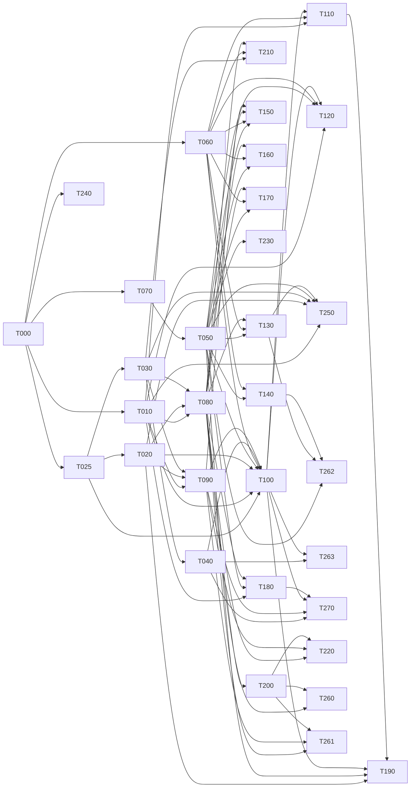

# Backend implementation state

Single source of truth for task partition, dependency graph, worktree assignment and task state.
Every agent updates only its own task row and its own task section. Never edit another task's rows.

Partitioned from `docs/BACKEND_SPEC.md` (31 aspects) under `docs/ORCHESTRATION.md` Phase 0, against
commit `8a9801e`, and revised on 2026-08-13 against the owner's twenty answers recorded below.
One deliberate addition to the format: task sections carry an **Open** line when a sub-question
inside the task is still unsettled. A task with no Open line has a contract derivable in full.

## Live slots

**Base branch is `backend`, not `main`.** The protocol says `main` throughout; `main` and `backend`
were identical at `8a9801e` when this run started, the work and these three documents live on
`backend`, and worktrees branched from `main` would not contain this file. Substitute `backend`
wherever `docs/ORCHESTRATION.md` says `main`. Recorded here rather than assumed.

Five slots, not three: the owner left six sessions running and the gate removal took the
serialisation point out, so the cap is now sessions rather than review capacity.

| Slot | Task | Worktree | State | Session |
|---|---|---|---|---|
| 1 | T000 | *(merged)* | **verified**, tag `t000-verified` at `ec516fa` | — |
| 2 | T060 | *(merged)* | **verified**, tag `t060-verified` at `eef7cce` | — |
| 3 | T010 | `../darkprint-wt-t010-archive` | round 4, implementer | `…archive-c2`, adversary `…archive-28` idle |
| 4 | T025 | `../darkprint-wt-t025-versioning` | round 5, implementer | `…versioning-3a`, adversary `…versioning-f2` idle |
| 5 | T020 | `../darkprint-wt-t020-cards` | round 1, implementer + blind tests | `…policy-d0`, tests `…archive-tests-67` |
| 6 | T030 | `../darkprint-wt-t030-ontology` | round 1, implementer + blind tests | `…policy-c9`, tests `…versioning-tests-eb` |

`…policy-tests-9f` is held free as the next adversary. T060's and T000's worktrees stay on
disk while sessions live in them, per the deferred-removal rule.

**T000 is merged and tagged `t000-verified` (`ec516fa`). Wave 2 is open**: T010, T025, T060,
T070 and T240 are all ready, with disjoint `Owns` sets, and three of the five may run at once.

**Before claiming anything in wave 2, read this.** The post-merge gate on `backend` failed
first time, and not because of the code: `package.json` and the lockfile merged while this
checkout's `node_modules` still predated them, so `pg`, `drizzle-orm`, `@aws-sdk/client-s3`
and `drizzle-kit` were absent and typecheck reported 23 phantom errors. `npm ci` fixed it and
all four gates then passed. Two operational rules follow, and they are the practical half of
the lockfile serialisation point recorded under T000's log:

- **After every merge that touches the lockfile, run `npm ci` on the base before the gates.**
  A red suite there is an uninstalled dependency until proven otherwise.
- **Every new worktree runs `npm ci` before its first gate.** A worktree gets its own
  `node_modules`; branching does not carry one.

## One writer per worktree at a time

The implementer and the adversary share a task's implementation worktree, and the protocol
never says which of them may write when. T025's adversary discovered mid-verdict that the
implementer was editing `blueprint-bump.ts` while it ran: run 1 measured one tree, run 2
straddled an edit, run 3 measured a third. The totals never moved, so nothing looked wrong —
but three runs of three different trees is not a determinism guard, and it retracted the claim
itself rather than let it stand. It also had to commit `backend.md` **by path**, because
`git add -A` would have swept the implementer's uncommitted work into the adversary's commit.

**The rule.** A task's implementation worktree has exactly one writer at a time, **and a
handover states the commit the tree is expected to be at, not only who holds it.** The second
half is the adversary's own correction to this rule: a one-writer rule alone would have left
round 3's contamination silent had the implementer edited *before* the pass began rather than
during it. So a pass stamps `git rev-parse HEAD` and `git status --porcelain`
**before and after** its runs and reports both, and a handover is not complete until the
receiving agent has the sha *and* confirmation that `git status --porcelain` is empty at it.

That stamp is deliberately whole-tree rather than scoped to the files under test, which is the
adversary's own correction to its first version of this guard — the same error class one level
up. `npm test` runs the whole repository, so an edit to `lib/core/**` or `tests/support/**`
contaminates a task's run exactly as thoroughly as an edit to its own module and would appear
in no scoped stamp. In round 3 the contaminating edit happened to land inside the task's own
`Owns`, which was luck rather than coverage. Mtimes are then a diagnostic for *which* file
moved, never the detector for whether anything did. While an
adversarial pass is running the implementer does not touch the tree, and while an implementer
is working the adversary does not start. The orchestrator hands the tree over explicitly in
both directions, as it already does for the merge. Any agent committing in a shared worktree
commits **by path**, never `git add -A`.

Same class as the repo-global stash: a shared mutable resource with no stated owner.

## Worktree removal is deferred while sessions live in them

`docs/ORCHESTRATION.md` Phase 3 removes a worktree on merge. That is deferred here for a
reason the protocol did not anticipate: a session's working directory is fixed when it is
launched, and the orchestrator can resume a session but cannot start one. Removing a merged
task's worktree therefore strands the two or three sessions living in it, which are the only
sessions available to staff the next wave. T060's worktrees stay on disk after merge until
their sessions have somewhere to go. The branches are deleted; the directories are not.

## How this run is governed

Owner-stated, 2026-08-13, amending `docs/ORCHESTRATION.md`'s human gate. The protocol says
`adversarial-pass → verified` is a human review step and that no task may self-promote. That
is replaced by the following, and the replacement is recorded here because it is a change to
the protocol rather than a decision inside it.

- **An adversarial PASS is `verified`.** The orchestrator merges to `backend` and tags,
  without asking.
- **Every merge is an annotated tag** — `t000-verified`, `t010-verified` — whose message
  carries the adversary's verdict commit, the four gate results and the suite count. Rolling
  one task back is `git reset --hard <previous tag>`; rolling one back with history intact is
  `git revert -m 1 <merge>`. The merge SHA and tag go in the task's row, so the tags and this
  file cannot drift apart.
- **Nothing is pushed.** `backend` tracks `origin/backend`; a local merge is reversible in a
  way that publishing is not. `git push` waits for the owner, every time.
- **The first PASS is still shown to the owner, once.** Not as a standing gate: as
  calibration. Across four rounds this adversary has returned FAIL every time, so there is
  strong evidence about its bar for *broken* and none at all about its bar for *done*, and
  those are different judgements. After one PASS has been reviewed, the loop runs unattended.
- **Contract amendments that change product behaviour are surfaced at each wave boundary.**
  The adversary checks code against the contract, and the contract is the orchestrator's. A
  name it specifies wrongly gets caught (D-10, D-11); something coherent and wrong *as
  product* passes, correctly, and nothing downstream ever asks. The expiry requirement is the
  live example — invented by the orchestrator, reviewed by nobody. Amendments that fix a name,
  a shape or a path are not surfaced; ones that decide what the product does are.
- **A task that stops converging is escalated rather than retried.** Convergence means the
  defect count falling round on round. T000 ran 7 defects → 2 → 1 → 1, with the last three
  being contract defects rather than code, which is convergence. Cycling without that fall is
  reported, not burned through.

## Measure the claim, not something adjacent to it

Stated by T025's adversary after correcting the orchestrator twice in one session, and it is
a better diagnosis than "checking a proxy": **both times the tool answered exactly the question
it was asked, and the question was narrower than the claim drawn from it.** `grep` found a
string in a file, which is what `grep` does — reading that as "the clause is live" was the
error, when the string sat in a Log entry quoting it. Three green totals were three green
totals — reading that as "the tree held still" was the error, when three runs measured three
different trees.

The one-line form, from the same adversary after it caught this rule's own first version:
**never let a claim be wider than the question its evidence answers.** The gap opens in two
places, and it is one rule with two checks rather than two kinds of error — what the evidence
**measures**, and what it **covers**. The split is worth refusing explicitly, because calling a
coverage gap a second kind of error invites reading it as tidiness. It is not. A stamp scoped
to `lib/server/versioning/**` returns clean while `lib/core/version/semver.ts` moves underneath
the run, and that clean gets reported as the answer to "did the tree hold still" — a green
light on a false statement, exactly what the grep and the three totals produced. An
under-scoped gate is a passing gate on an unverified property, and those are the ones trusted
longest.

Three cheap guards, all now in force:
- Before charging a **document** defect, diff the section against `backend` rather than
  grepping for the string.
- Before claiming a **determinism** result, stamp `git rev-parse HEAD` and
  `git status --porcelain` before and after, and report both. Whole-tree, never scoped to the
  files thought to be under test: `npm test` runs the whole repository, so an edit anywhere
  contaminates equally. Mtimes are a diagnostic for *which* file moved, never the detector for
  whether anything did.
- Before trusting a **probe**, check that only the state being tested for could produce the
  answer. Asked whether `/clear` sent over `SendMessage` resets a peer, the orchestrator probed
  with "can you still recall why `assertNever` was chosen in `can.ts`" — a question the subject,
  a *blind* test author, could never answer because it had never read that file, and which an
  uncleared session could still answer plausibly by reconstructing it from its own notes. Both
  states fail it and one can also fake passing it. The probe that works asks for something only
  that session did: "what two over-assertions did you catch against the throwaway, and what did
  you change them to?" (For the record: `/clear`, `/model` and `/effort` sent as messages arrive
  as literal text and do nothing. Sessions carry their context across reassignment.)
- Before carrying a **finding** forward into a later round, re-read the thing it is about.
  T010's adversary re-ran all six criteria rather than carrying them forward, then carried its
  AC1-contradiction claim into two further rounds without re-reading AC1, which had been
  corrected at `070025c`. A finding is a measurement too, and it goes stale the same way.

## A ruling is implemented as narrowly as its worked example

Three times in wave 2 a ruling stated a principle, gave an instruction narrower than the
principle, and got implemented to the instruction. T010's typed-error rule said "no rejection
carries the statement" and its example was duplicates, so duplicates were fixed and five other
SQLSTATEs kept leaking. T060's never-inherit rule said "`Actor` **and** `Resource` are plain
data" and its example named the actor's two fields, so the actor was hardened and every
resource field stayed a prototype-chain read — one of which fails **open** with no pollution
at all. In both cases the adversary charged the gap against the ruling rather than the
implementer, which is the correct attribution: an agent that implements exactly what it was
told has not erred.

So: **state the principle, then enumerate every site it reaches, or say explicitly that the
list is not exhaustive and the principle governs.** A worked example is read as the scope,
not as an illustration of it.

## Resolving `backend.md`: Log entries merge, contract text does not

A hand-resolution in T025's worktree silently reverted a corrected acceptance criterion. The
Log entries were preserved and independently verified as intact; nobody checked the contract
prose, and both that task's worktrees carried a withdrawn clause its own blind test author then
reported as an outstanding bug — twice.

**The rule.** When resolving a `backend.md` conflict in any worktree: **keep both sides' Log
entries in date order, and take `backend`'s version of everything else.** Contract text,
acceptance criteria, signature blocks and rulings change on the base branch only. A worktree
that appears to disagree with base about what the contract says is stale by definition, never
authoritative, and resolving it "carefully by hand" is how a ruling gets undone by someone
being careful.

This is also why an amendment is announced to both sides rather than left to be discovered on
the next rebase: the file they read may not be the file that was amended.

## Never use `git stash` in a worktree

**The stash is repo-global, not per-worktree.** T025's implementer stashed to check whether
some typecheck errors predated its work, then popped on reflex and landed a stash belonging to
`feat/core-engine-ontology-v0.1` — thirteen conflicted files in paths it did not own. It
recovered without dropping the entry (a conflicted `pop` does not drop), and `stash@{0}` is
verified intact, but the next session to do this may not be as careful.

With six to nine worktrees on one repository, `git stash` is a shared mutable global with no
owner. To check whether something predates your work, use `git diff HEAD`, a scratch clone, or
`git worktree add` a throwaway — never the stash.

**Someone owns that stash.** `stash@{0}: WIP on feat/core-engine-ontology-v0.1` is still there
and is not ours; leave it for its owner to pop.

## The contract must name the interface, not only the behaviour

Learned the expensive way in T000, and it binds every task in this file from here on.

Three separate defects — D-01 (no barrel at `lib/db`), D-09 (the guard's shape), D-08 (a
migration function with no database parameter) — turned out to have one cause. The contract
stated what each capability must *do* and never what it must *look like*, so the implementer
and the blind test author each chose a reasonable interface, chose differently, and neither
was wrong. Two agents who cannot see each other cannot converge on a name, an arity or a
call shape by reasoning about behaviour. They can only converge on something written down.

**When a ruling withdraws or changes part of an acceptance criterion, the criterion itself is
edited in the same commit.** Twice in wave 2 a ruling was added above a criteria line that still
demanded the withdrawn thing — T025's dangling successor and T060's auditability — and both times
a blind test author had to report the contradiction rather than a reader silently binding to the
wrong half. A ruling that leaves its own criterion standing has not been made, only argued.

**So every task's Contract section states the exact exported signatures of its public
surface**, not just its semantics: the module each name is published from, the parameter
list, and what it returns. Two conditions on that, both learned by breaking them in T000:
a signature block is **checked against the tree at the moment it is written**, since the
first one shipped a name that had not existed for a round (D-10a); and every entry is
written **as a signature**, never as prose, since the one entry that said "put, get and
delete" instead of naming three identifiers produced two honest readings and cost a round
(D-10b). A capability reachable only by a deep path is not public. Where a
signature is left open, the test author reports it rather than resolving it — a candidate
list papers over the gap and then resolves to whichever name happens to exist first, which is
precisely how D-08 selected the one function that could not be isolated.

## Decisions

Owner-stated, 2026-08-13, in the session that produced this partition. These are the premises every
task contract below is written against. An agent that finds one of them wrong stops and reports;
it does not decide differently inside a worktree.

| ID | Decision |
|---|---|
| B-01 | Bytes live in S3-compatible object storage keyed by digest; the index lives in scale-to-zero Postgres. Both standard interfaces, so the host is a connection string. Frontend stays on Vercel, backend may live elsewhere (Scaleway under evaluation). |
| B-02 | Sign-in is GitHub OAuth. **Supersedes `docs/DECISIONS.md` D-81** (`AGENT-PROPOSED`, unowned), which ruled GitHub OAuth out as a product constraint. |
| B-03 | Responses carry data plus diagnostics at 200 — a bundle resolving with errors is an answer, not a failure. Transport and auth failures use RFC 9457 `problem+json`. A private resource the caller may not see returns 404, never 403, so existence does not leak. |
| B-04 | Versioning is server-authoritative and covers all three primitives: blueprints, cards and ontology. Every release carries an author-declared semver **and** the engine-computed digest. Bump inference and chain checking apply to all three, where today only cards have them. Deprecation carries a successor pointer. The `darkprint` CLI drives it. |
| B-05 | A handle is chosen at sign-up and is independent of the GitHub login; GitHub supplies credentials only. Handles are unique, reserved permanently once used, and renameable with the old handle staying reserved. |
| B-06 | A bundle first exists at its first publish. One record per `(owner, slug)`, releases appended. The wizard, the bundle page and the CLI all write the same thing: create if the slug is free, append a release if it is not. |
| B-07 | Node cards may be private, and a private card is validated identically to a public one. Ontology terms stay public. |
| B-08 | The two engine axes are computed when a release is cut and stored beside the ontology version they were computed under. An ontology release triggers a re-score. |
| B-09 | Slugs are unique **per owner**. The public blueprint route becomes `/blueprints/{owner}/{slug}`, with a permanent redirect from the old single-segment shape. |
| B-10 | One polymorphic target `(kind, id)` carries stars, downloads and notes for both blueprints and cards. Card counters aggregate per card id, not per version. |
| B-11 | The ballot is 0–100 per metric, one ballot per account per blueprint carried across releases, with validator weight applied at read so a later grant applies retroactively. Below five votes the response is a sample, not a figure. |
| B-12 | Search is semantic from day one, over the manifest and card specs. The ordering must be explainable or results come back unordered with evidence — the constraint `/mcp` already states. MCP ships as the advertised stdio server over the same API. |
| B-13 | The only subjects are the owner of a resource and a break-glass operator. No moderator tier, no organisations, no team ownership. |
| B-14 | Every state change writes an audit row (actor, action, target, time). Request logs are operational and short-lived (~90 days). Downloads are counted by an explicit event at the serving edge, never derived from logs. Nothing records a blueprint run. |
| B-15 | The frontend cutover is in scope, re-partitioned by route group so the groups can run in parallel. Public reads stay static with tag-based revalidation; owner surfaces go per-request. |
| B-16 | Run reports are submitted by the CLI, keyed by release digest, accepted on well-formedness alone. The word stays `reported`, never `measured`. |
| B-17 | Rate limits apply to reads and writes, with API keys issued for high-volume consumers. **Supersedes `docs/DECISIONS.md` D-83** (`AGENT-PROPOSED`, unowned), which asked for no anti-scraping measures; the cost is discoverability by the MCP and LLM audience, accepted knowingly. |
| B-18 | An author may edit and delete their own notes; the operator may remove any. Deletion is a tombstone so counts and cursors stay honest. No report queue, no appeals. |
| B-19 | Notifications are email only, through a usage-billed provider, using the four events and preferences already modelled. No in-app inbox. |
| B-20 | All seed content is re-attributed to one registry-owned handle; the six invented authors do not become accounts. **Assumption pending confirmation:** seeded downloads, stars and votes import as zero, since a real registry printing counts nothing ever measured is the failure this codebase's whole design guards against. |

## Task index

| ID | Title | Deps | Owns (paths) | Worktree | Branch | State | Evidence |
|------|-------|------|--------------|----------|--------|-------|----------|
| T000 | Foundation: schema, client, envelope, GitHub session, harness | — | `lib/db/**`, `lib/server/http/**`, `lib/server/auth/**`, `lib/server/types.ts`, `tests/support/**`, `compose.yaml`, `.env.example`, `package.json`, `package-lock.json` | `../darkprint-wt-t000-foundation` (removed) | `feat/t000-foundation` (deleted) | **merged** | `ec516fa`, tag `t000-verified`; typecheck/lint/build clean; 3762/3762 on eight runs, 0 database residue; all six criteria executed; eleven prior defects re-verified closed; four falsifications confirm the suite discriminates |
| T010 | Archive persistence: bundles, releases, bytes | T000 | `lib/server/archive/**` | `../darkprint-wt-t010-archive` | `feat/t010-archive` | claimed | — |
| T025 | Versioning service: semver, digest, bump, chains | T000 | `lib/server/versioning/**` | `../darkprint-wt-t025-versioning` | `feat/t025-versioning` | claimed | — |
| T060 | Authorization policy: owner and operator | T000 | `lib/server/policy/**` | `../darkprint-wt-t060-policy` | `feat/t060-policy` | adversarial-pass | round-4 adversary PASS: all five criteria pass, AC3 by invocation for all five actor shapes; 88/88, 7410-combination sweep 0 throws 0 non-booleans; awaiting the human gate, not self-promoted |
| T070 | Namespace: handles, slugs, reservation | T000 | `lib/server/naming/**`, `app/api/names/**` | — | — | todo | — |
| T240 | Observability and audit log | T000 | `lib/server/observability/**` | — | — | todo | — |
| T020 | Card library: versions, digests, private cards | T000, T025 | `lib/server/cards/**` | — | — | todo | — |
| T030 | Ontology store, merged view, versioned releases | T000, T025 | `lib/server/ontology/**` | — | — | todo | — |
| T050 | Accounts and sessions | T000, T070 | `lib/server/accounts/**`, `app/api/auth/**`, `app/api/account/{route,profile,handle,email,default-visibility}` | — | — | todo | — |
| T040 | Engine service: validate and analyze | T000, T030 | `lib/server/engine/**`, `app/api/validate/**` | — | — | todo | — |
| T080 | Registry read model and read API | T010, T020, T030 | `lib/server/registry/**`, `app/api/blueprints/**`, `app/api/cards/**`, `app/api/ontology/**` | — | — | todo | — |
| T090 | Distribution and export artefacts | T010, T020, T030 | `lib/server/export/**`, `app/api/files/**` | — | — | todo | — |
| T140 | Saves (private bookmarks) | T050, T060 | `lib/server/saves/**`, `app/api/account/saves/**` | — | — | todo | — |
| T230 | Rate limiting and API keys | T000, T050 | `lib/server/limits/**`, `app/api/account/keys/**` | — | — | todo | — |
| T100 | Publishing and releases | T010, T020, T025, T040, T050, T060, T070, T090 | `lib/server/publish/**`, `app/api/bundles/**` | — | — | todo | — |
| T130 | Profiles and the public author surface | T050, T060, T080 | `lib/server/profiles/**`, `app/api/authors/**` | — | — | todo | — |
| T150 | Counters: stars and downloads | T050, T060, T080, T090 | `lib/server/counters/**`, `app/api/signals/**` | — | — | todo | — |
| T160 | Community ballot and vote weighting | T050, T060, T080 | `lib/server/ballot/**`, `app/api/votes/**` | — | — | todo | — |
| T170 | Notes and note votes | T050, T060, T080 | `lib/server/notes/**`, `app/api/notes/**` | — | — | todo | — |
| T180 | Run-report ingestion and cost aggregation | T010, T050, T080 | `lib/server/runs/**`, `app/api/runs/**` | — | — | todo | — |
| T200 | Semantic search and ranking | T080 | `lib/server/search/**`, `app/api/search/**` | — | — | todo | — |
| T210 | Term-usage index and promotion | T030, T060, T080 | `lib/server/terms/**`, `app/api/ontology-usage/**` | — | — | todo | — |
| T110 | Fork, lineage and drift | T010, T060, T100 | `lib/server/lineage/**`, `app/api/lineage/**` | — | — | todo | — |
| T120 | Ownership transfer and account deletion | T010, T050, T060, T100 | `lib/server/lifecycle/**`, `app/api/transfer/**`, `app/api/account/delete/**` | — | — | todo | — |
| T220 | MCP server surface | T080, T090, T200 | `lib/server/mcp/**`, `packages/mcp/**` | — | — | todo | — |
| T250 | Seed import and re-attribution | T010, T020, T030, T050, T130 | `scripts/import-seed.ts`, `lib/server/seed/**`, `content/**` | — | — | todo | — |
| T270 | The `darkprint` CLI | T040, T090, T100, T180 | `packages/cli/**` | — | — | todo | — |
| T260 | Cutover: browse routes | T080, T200 | `app/blueprints/page.tsx`, `app/nodes/page.tsx`, `app/ontology/page.tsx`, `components/{gallery,nodes,ontology}/**` | — | — | todo | — |
| T261 | Cutover: detail routes and the URL migration | T080, T090, T200 | `app/blueprints/[owner]/**`, `app/nodes/[...id]/**`, `app/ontology/[...term]/**`, `lib/href.ts`, `next.config.ts`, `components/{blueprint,bundle,panes}/**` | — | — | todo | — |
| T262 | Cutover: profile and settings routes | T050, T130, T140 | `app/u/**`, `app/settings/**`, `components/{profile,settings}/**` | — | — | todo | — |
| T263 | Cutover: upload and publish routes | T040, T100 | `app/upload/**`, `components/upload/**` | — | — | todo | — |
| T190 | Notifications and email fan-out | T020, T050, T100, T110 | `lib/server/notifications/**`, `app/api/account/notifications/**`, `app/api/internal/events/**` | — | — | todo | — |

## Dependency graph

## Waves

- Wave 1: T000
- Wave 2: T010, T025, T060, T070, T240
- Wave 3: T020, T030, T050
- Wave 4: T040, T080, T090, T140, T230
- Wave 5: T100, T130, T150, T160, T170, T180, T200, T210
- Wave 6: T110, T120, T220, T250, T260, T261, T262, T263, T270
- Wave 7: T190

Waves are advisory. `T000` runs alone. Every wave after it offers at least three mutually
independent tasks with disjoint `Owns` sets, so no slot idles for want of ready work.

## Tasks

### T000, Foundation: schema, client, envelope, GitHub session, harness

- **State:** merged
- **Worktree:** `../darkprint-wt-t000-foundation` on `feat/t000-foundation`
- **Test worktree:** `../darkprint-wt-t000-foundation-tests` on `test/t000-foundation`
- **Depends on:** —
- **Blocks:** every task
- **Owns:** `lib/db/**`, `lib/server/http/**`, `lib/server/auth/**`, `lib/server/types.ts`, `tests/support/**`, `compose.yaml`, `.env.example`, `package.json`, `package-lock.json`
- **Published signatures** (amendment, 2026-08-13, after the second adversarial pass). Behaviour was not enough to converge on; these are the shapes, and they are the contract:
  - `withSession(request: Request, handler: (session: SessionPayload) => Response | Promise<Response>): Promise<Response>` — the guard **wraps**, it does not return a union. AC3 requires that the handler never runs for an unauthenticated request, and only a wrapping guard makes that structurally true: a guard that returns `payload | Response` depends on every caller checking the union, and a caller who forgets runs the handler anyway. The round-2 implementation was `requireSession(request, secret?)`, which put the handler into the secret's position and passed a function to `createHmac` as an HMAC key. Keep `requireSession` internally if useful; it is not the published guard.
  - `migrateUp(target, dir?)` and `migrateDown(target, steps?, dir?)`, where `target` is a pool or a connection string. **No zero-argument migration function is published from the barrel.** A variant that reads `DATABASE_URL` implicitly is what made D-08 possible: the blind suite's candidate list resolved `migrate` first, both suites then drove the shared database, and rollback dropped the other suite's tables mid-run — three identical invocations gave 6, 6 and 3 failures. Convenience wrappers may exist behind `npm run db:migrate`; they are not part of the public surface.
  - `createDbClient(config?: string | PoolConfig)`, and `getSharedDbClient()` for route handlers only.
  - `createObjectStorage(config?: ObjectStorageConfig): ObjectStorage` — named for the type it returns. The round-2 code renamed this to `createObjectStore` because the blind candidate list led with that name, and this block, written afterwards at `3e9f51e`, named the round-1 spelling from memory without checking the tree. **That is D-10a and it is the orchestrator's defect, not the implementer's** — a contract cannot claim authority over an interface and then transcribe it from memory. The code moves to the contract because `createObjectStorage` returning `ObjectStorage` is the consistent pair, not because the contract was right by seniority.
  - `keyForDigest(digest: string): string`
  - On `ObjectStorage`, as signatures rather than as prose, which is the whole of D-10b — every other entry in this block was a signature and this one was three English verbs, so the implementer read three verbs and the test author read three identifiers, both honestly:

        put(digest: string, body: Uint8Array | string): Promise<void>
        get(digest: string): Promise<Uint8Array | undefined>   // undefined on a missing key; absence is a value, not a throw
        delete(digest: string): Promise<void>

  - **The token and the session are two types, and conflating them was D-11 — also the orchestrator's defect.** The contract already said the session exposes `{ accountId, handle }` or nothing; the expiry amendment then said "`SessionPayload` carries an expiry claim", and `SessionPayload` *is* the exposed type, so the amendment contradicted a clause two lines above it in its own block. `exp` is a claim the decoder verifies, not something a handler needs or should be able to key off:

        interface SessionToken   { accountId: string; handle: string | null; exp: number }  // signed, verified, never exposed
        interface SessionPayload { accountId: string; handle: string | null }                // what withSession hands the handler

    `withSession`'s published signature is unchanged, because `SessionPayload` keeps its meaning as the thing a handler receives. Four of the implementation's own colocated tests currently assert the opposite — that `getSession` returns `exp` — so the two suites assert contradictory things about one object and the blind one is the one matching the contract. Those four are the implementer's own files and move with the fix.
  - `exp` is bounded for plausibility, not merely present. An `exp` in milliseconds is accepted today because a millisecond value is simply a very distant second value, so `Date.now()` written where `Math.floor(Date.now() / 1000)` was meant mints a token good for roughly fifty thousand years and nothing says a word. It is not attacker-reachable — minting needs the key — but it is a silent failure of exactly the kind this codebase is built against, and a bound turns it into a red the day it is written.
  - `withSession` rejects an expired token as it rejects a forged one. The round-3 token had none: `Max-Age` bound the browser only, so a captured cookie stayed valid forever and signing out cleared the browser's copy rather than the token's validity. That sits outside every acceptance criterion, which is why three adversarial passes did not catch it — it is a gap in the contract, not a defect against it. Paid here rather than in T050, which would otherwise inherit a token format it has to change. **Open, and the owner's to settle: this gives expiry, not revocation.** A stolen cookie stays valid until it expires, and true sign-out invalidation needs server-side session state — a storage and scale decision nobody has taken.
  - `tests/support/db.ts` creates and drops its own database rather than targeting `DATABASE_URL`, per the isolation rule it currently violates. It is the harness nine downstream tasks inherit, so the assumption baked into it propagates.
- **Public import surface** (amendment, 2026-08-13, after the first adversarial pass): every owned directory publishes a barrel and downstream code imports only through it — `@/lib/db`, `@/lib/server/http`, `@/lib/server/auth`, `@/lib/server/types`. This is the rule `lib/core/index.ts` already states for this repository: "Deep paths are internal and may be rearranged, so nothing outside `lib/core` should reach for one." A capability reachable only by a deep path is not part of the public interface. The object-storage client is published from `@/lib/db`, since B-01 treats Postgres and object storage as one connection concern and `lib/db/**` is the only owned path that can hold it.
- **Forbidden:** `lib/core/**`, `lib/content/**`, `lib/data/**`, `app/**` outside `app/api/auth/**`, `components/**`, `tests/server/**` (the test branch owns it)
- **Goal:** the scaffolding every other task derives from — Postgres schema and migrations, the client factory, the object-storage client, the response envelope, GitHub OAuth session handling, and the local infrastructure both branches run against. Contracts and schema only, no feature logic.
- **Environment contract** (published here so the implementer and the blind test author agree without seeing each other): local infrastructure is `compose.yaml` bringing up Postgres with `pgvector` available (wave 5 needs it and a later image swap would be a migration) and a MinIO bucket for object storage. Both sides read the same variables: `DATABASE_URL`, `S3_ENDPOINT`, `S3_BUCKET`, `S3_ACCESS_KEY_ID`, `S3_SECRET_ACCESS_KEY`, `GITHUB_CLIENT_ID`, `GITHUB_CLIENT_SECRET`, `SESSION_SECRET`. **Agent B's tests must be self-sufficient**: they read those variables directly and must not import anything under `tests/support/**`, which does not exist on the test branch and whose absence would produce a broken test rather than a red one. Tests live in `tests/server/**`, which the implementation branch never touches.
- **Test isolation** (amendment, 2026-08-13, after the first adversarial pass): the contract said nothing about who guarantees a clean database, and the first round proved the cost — the adversary's probes left seven scratch databases and several dozen objects in the shared bucket, and because D-04 is an empty-digest *bucket listing*, the defect's own reproduction had become a function of that residue. **No test may assume the shared `darkprint` database or bucket is empty**, and none may leave state behind that another test can observe. The rule differs by how each store is addressed, and the difference is not cosmetic:

  - **The database is addressed by name.** A test needing a clean one creates and drops its own. AC1's "empty database" means one the test itself created, never the shared development database.
  - **Object storage is addressed by content, so isolation comes from unique bytes and never from a chosen key.** A test may **not** prefix or namespace its keys: the key *is* the digest the engine computes over the bytes, so prefixing it stops the test exercising content addressing at all — which is precisely what AC5 asserts. Distinct fixture content yields a distinct digest and isolation therefore comes free from the addressing itself. The test then deletes what it wrote.

  **A digest is validated where it becomes a key**, once, so every verb inherits it rather than each guarding itself. The first pass had `keyForDigest` split a string with no notion of its own input, so an empty digest passed straight through to S3 — which answers a GET on an empty key with a bucket listing (D-04), a PUT with MalformedXML, and a DELETE with *success*. That last one is the reason this is stated at contract level rather than left as an implementation detail: an unvalidated delete reports removing what it never touched, and silent success is the failure mode this codebase is built against. Binds T010 onward, which all handle digests.

  That last clause needs a capability the first pass did not publish: `ObjectStorage` exposed only put and get, so cleanup through the public interface was impossible and every storage test would have had to reach past the client to the S3 SDK — D-01 in a different hat. **T000 therefore also publishes a delete from `@/lib/db`.** It does not publish a list: enumerating a bucket is the whole of D-04, and nothing in this contract needs it.

  This binds every task from T010 on, all of which share the same stack. Corrected 2026-08-13 after the adversary caught both defects in the amendment's first wording, within the hour it was written.
- **Contract:** domain types are re-exported from `lib/core/**` and `lib/types.ts`, never restated (B-01). Storage is split: an S3-compatible client keyed by digest for bytes, Postgres for the index. The envelope is B-03 — a handler returns its payload at 200, including payloads that carry `diagnostics: Diagnostic[]` describing failure of the *content*; transport, auth and shape failures return `application/problem+json` per RFC 9457 with `type`, `title`, `status`, `detail`, `instance`; a resource the caller may not see returns 404. Session is a GitHub OAuth cookie (B-02) exposing `{ accountId, handle }` or nothing. Schema covers the tables every later task extends: `account`, `handle_reservation`, `bundle`, `release`, `card_version`, `ontology_version`, `ontology_term`, `target`, `target_actor`, `audit`. **`target_actor` is an amendment (2026-08-13)**, raised by the implementer and accepted: `target` carries aggregate counters but nothing records *who* acted, so T150's "starring twice yields 1" and T170's "a vote from one account counts once" would have had no idempotency storage to reach for — and every downstream task's `Owns` excludes `lib/db/**`, so they could not have added it themselves. One row per `(target, account, kind)`, where kind distinguishes a star from a note vote.
- **Acceptance criteria:** (1) migrations apply to an empty database and are idempotent on re-run; (2) rollback returns the schema to the prior state; (3) a request with no session reaching a guarded handler receives a `problem+json` 401 and no body from the handler; (4) a handler returning diagnostics returns 200 and the diagnostics survive serialisation intact, including `location`; (5) an object written to storage under a digest reads back byte-identical; (6) every type exported from `lib/server/types.ts` is the engine's own, verified by identity not by shape.
- **Open** (rewritten by the test author 2026-08-13, round 3). Both questions the last round raised are
  answered, and one narrower one takes their place.

  *Closed.* The database-isolation question (the three candidate answers it listed are in the log entry
  that raised them) went the way of the first candidate: `createDbClient(config?)` takes a connection
  string and `migrateUp(target, dir?)` takes a pool or one, so `tests/server/migrations.test.ts` now
  creates `darkprint_t000_<pid>`, drives it and drops it. Reporting it rather than resolving it was the
  right call — the answer lived in code the test branch could not see, and the candidate list would have
  resolved to `migrate`, the one function that could not be pointed anywhere. The delete question is
  answered too: the contract publishes put, get **and** delete, so a store without one is now a red.

  *Still open, and reported rather than resolved.* Four capabilities these tests need are not in the
  Published signatures block, so they are still bound by candidate list, and a list is a guess that has
  twice resolved to the wrong export. Naming them would retire the last of them:
  1. the session **reader** — `readSession`, `getSession`, `sessionFromRequest`, `currentSession`;
  2. the session **writer** — `createSessionCookie`, `sessionCookie`, `sessionCookieHeader`,
     `setSessionCookie`, then the encoder names, read first-match-wins because a cookie writer that
     exists must be reached before an encoder that also exists (this is T-02, and the order is the fix);
  3. the **200 payload helper** on `@/lib/server/http` — `ok`, `okJson`, `jsonOk`, `respond`, `payload`,
     `envelope`, `data`, `json`; and the **404 helper** — `notFound`, `notFoundProblem`,
     `problemNotFound`, `hidden`, `missing`. AC4 rests entirely on the first of these;
  4. the client's **teardown**, which is optional here and never asserted on.

  A fifth is a parameter list rather than a name. The contract publishes `keyForDigest(digest)` beside
  put, get and delete and does not say which of the two supplies the key, so three readings are live:
  `put(keyForDigest(digest), content)`, `put(digest, content)`, and `put(content) -> address`. The tests
  resolve it once against a probe, in that order, and report the resolution; key-first because
  `keyForDigest` is published beside the verbs, and bytes-only last because handing a two-megabyte string
  to a `put(key, content)` store would try to write it *as a key*.
- **Out of scope:** any route serving a domain object, any feature logic, any read model.
- **Log:**
  - 2026-08-13 orchestrator: created. Unblocked by B-01, B-02, B-03.
  - 2026-08-13 orchestrator: partition amendment before claim. `tests/server/**` moved to the test branch's sole ownership and an environment contract published in this section, because Agent B's worktree branches before Agent A commits and any test importing `tests/support/**` would fail on a bad import, which the protocol calls a broken test rather than a red one. `compose.yaml` and `.env.example` added to Owns.
  - 2026-08-13 orchestrator: claimed. Worktrees created from `backend` at `e29f64a`; slot 1 occupied, slots 2 and 3 left empty because T000 runs alone.
  - 2026-08-13 orchestrator: **round 2 FAIL, verified**. Adversary `990c1bb`, merge `2270148`. All seven round-1 defects confirmed fixed by invocation, and typecheck, lint and build are now all green. Two findings stop it, and I verified the cause of each from source rather than reproducing a flaky count. D-08: `migrate(dir?)`/`rollback(steps?, dir?)` take no database and use `DATABASE_URL` implicitly, while `migrateUp(pool, ...)` does take one; the blind candidate list resolves `migrate` first, so both suites drove the shared database and rollback dropped the other's tables mid-run. D-09: `requireSession(request, secret?)` against a harness calling `guard(request, handler)`, so the handler reached `createHmac` as an HMAC key. Neither is an implementation defect in the ordinary sense — both are the contract naming behaviour and not shape, which is now fixed at the top of this file and in Published signatures above. Amendment 7.
  - 2026-08-13 orchestrator: **gate run and triage after the adversary's FAIL** (`c7debfd`). Verdict verified independently rather than accepted: typecheck reproduced with exactly one error, `tests/server/contract.ts(65,23) TS2307 Cannot find module '@/lib/db'`; suite reproduced red (37 failed here against the adversary's 32, the five extra being env-dependent tests failing without the compose stack up, which is a difference in my run and not in its report); D-02 and D-07 confirmed from source. Triage of the seven defects: **D-01 is a contract defect and mine, not the implementer's** — the contract named `lib/db/**` in `Owns` and never stated the import surface, so the implementer published no barrel and the test author, which had resolved the ambiguity in its own favour rather than reporting it, imported one. Amended above under *Public import surface*. D-02 through D-07 are genuine implementation defects and go back to Agent A. T-01 (raw NUL bytes) and T-02 (the session-writer candidate list omitting `sessionCookieHeader`, so five reds claim a broken round trip that direct invocation shows works) are test-branch defects and go back to Agent B.
  - 2026-08-13 orchestrator: **third partition fix**. `package.json` and `package-lock.json` were in no task's `Owns`, and the implementer had to modify both — a Postgres client cannot be added without them. Added to this task's `Owns`. The structural consequence is larger than the fix and is recorded here because it lands on every later wave: **dependency addition is a serialisation point across the whole plan.** Waves 2 to 6 run three tasks at once and any two that add a package collide in the lockfile, which is exactly the merge collision `T000` exists to prevent. Proposed remedy, for the wave-2 boundary: the orchestrator batches a wave's dependency additions onto the base branch before any task in it is claimed.
  - 2026-08-13 orchestrator: second partition fix on the base branch, before either session starts. `vitest.config.ts` collected `lib/**`, `components/**` and `scripts/**` only, so tests under `tests/server/**` would not have been collected at all and the test worktree would have reported zero tests as a pass. The glob now includes `tests/**/*.test.ts`. It is shared scaffolding that has to pre-exist both branches, so it belongs to neither task's `Owns` set and neither agent may edit it. Full suite re-run after the change: 92 files, 3625 tests, green. **Both worktrees must rebase on `backend` before starting.**
  - 2026-08-13 test author: `tests-written`. 64 tests in six files under `tests/server/**`, plus `tests/server/contract.ts`, which is a helper and not collected. Every acceptance criterion is named in its own test: AC1 four tests, AC2 three, AC3 eight, AC4 ten, AC5 thirteen, AC6 six, with the rest covering the contract clauses no criterion states (RFC 9457 members, 404 rather than 403, the session surface, the environment contract). Full suite: 64 failed, 3625 passed. Every red is a missing module, a missing file or an unset contract variable; none is a syntax error or a bad path.
  - 2026-08-13 test author, **contract amendment, naming**. The contract pins behaviour and never pins an identifier, so the tests resolve each capability from a candidate list rather than declaring one name and reporting a naming difference as a defect. The first entry in each list is the name the tests treat as canonical. From `@/lib/db`: migrate (`migrate`, `applyMigrations`, `runMigrations`, `migrateUp`, `up`), rollback (`rollback`, `rollbackMigration`, `migrateDown`, `revert`, `down`), query (`query`, `sql`, `dbQuery`, or a client factory named `createDbClient`, `createClient`, `createPool`, `getDb`, `db`, `pool`, `client` exposing `.query`), object storage (`createObjectStore`, `objectStore`, `createBlobStore`, `blobStore`, `createContentStore`, `contentStore`, `createStorage`, `storage`, `objects`, `bytes`, with `put`/`putObject`/`write`/`upload`/`store`, `get`/`getObject`/`read`/`download`/`fetch`, and, since the test-isolation amendment, `remove`/`delete`/`deleteObject`/`del`/`erase`/`unlink` for the delete, which is the one entry whose absence is tolerated rather than reported). From `@/lib/server/http`: `ok`, `okJson`, `jsonOk`, `respond`, `payload`, `envelope`, `data`, `json`; and `notFound`, `notFoundProblem`, `problemNotFound`, `hidden`, `missing`. From `@/lib/server/auth`: `requireSession`, `withSession`, `requireAuth`, `withAuth`, `guard`, `protect`, `authenticated`; `readSession`, `getSession`, `sessionFromRequest`, `currentSession`; `createSessionCookie`, `sessionCookie`, `sessionCookieHeader`, `setSessionCookie`, `sealSession`, `issueSession`, `signSession`, `writeSession`, `setSession`, `encodeSession` (the first four write a cookie and the rest encode what goes inside one, and the list is read in that order for exactly that reason; see T-02 below). A name outside its list is not a failed implementation, it is a contract that never said: add the name to the list that carries it (`tests/server/contract.ts` for the storage and client lists, the test file itself for the auth and http ones) and amend this entry. Argument order is resolved the same way, by trying each plausible call and reporting all of them when none produces a `Response`.
  - 2026-08-13 test author, **contract amendment, module paths**. Every import goes through the barrel of an owned directory (`@/lib/db`, `@/lib/server/http`, `@/lib/server/auth`, `@/lib/server/types`) and never a deep path, following the rule `lib/core/index.ts` already states for this repository. Two consequences worth stating before the merge rather than after it. First, the object-storage client is looked up in `@/lib/db`: the goal lists it as a deliverable and `lib/db/**` is the only entry in `Owns` that can hold it, so a client that turned up under `lib/server/storage/**` would be a write outside the task's own partition. Second, a capability that exists behind a deep path but is not re-exported from its barrel reds here, which is the intended reading of "public interface" and not a test defect.
  - 2026-08-13 test author, **environment policy**. The eight variables are read directly from `process.env` and an unset one fails loudly rather than skipping the suite. A test that stands down when the infrastructure is absent reports the same green as one that checked something, and `compose.yaml` is in this task's `Owns` set precisely so that "the infrastructure is not up" is an instruction rather than an excuse. `tests/server/environment.test.ts` also asserts that `compose.yaml` exists and that `.env.example` names all eight; pgvector availability is asserted for real against the running database, not by grepping the compose file.
  - 2026-08-13 test author, **evidence that the tests discriminate**. Written blind, they cannot be run against the implementation, so they were run against a throwaway correct implementation in a scratch directory, aliased in through a temporary config, and never written into this worktree: 64 passed. Each guard was then falsified against a deliberately broken variant. A guard that runs the handler and replaces its answer with the 401 fails five AC3 tests while still returning 401. An envelope that re-sorts diagnostics or pads absent optionals to `null` fails AC4. A store that normalises unicode fails AC5, and one that invents its own key fails the addressing test. A migration runner that throws on re-run fails all ten, and one without an advisory lock fails only the cold-boot race. A `lib/server/types.ts` that restates `Diagnostic` with the engine's exact shape fails three AC6 tests, which is the case that no structural or `expectTypeOf` comparison can see. One gap was found and closed this way: flipping a single character mid-cookie is passed by a reader that never verifies the signature, because the edit lands in the payload and breaks the parse instead. The test now sweeps every character position and fails on any edit that reads back as an account nobody issued.
  - 2026-08-13 implementer: impl-done, second pass. Rebased on `backend` at `4d5556a`
    before starting; the three-way rebase conflicted only in this file's own Log and
    State lines (my old `impl-done` entry against the orchestrator's amendments), kept
    the orchestrator's side throughout since it was already the authoritative,
    up-to-date account. All seven defects addressed; D-01 was triaged as the
    contract's fault, not fixed differently for that.
    **D-01**: published `lib/db/index.ts`, re-exporting `createDbClient`,
    `getSharedDbClient`, `schema`, `migrate`/`migrateUp`, `rollback`/`migrateDown`,
    `createObjectStore`, `keyForDigest`, `objectStorageConfigFromEnv`. Renamed the
    object-storage factory `createObjectStorage` → `createObjectStore` to land on the
    test contract's own first-choice candidate name. Fixing the barrel surfaced two
    problems the missing file had been hiding: `queryFor`'s client-factory fallback
    calls `createDbClient()` and then looks for `.query` on the result, which `DbClient`
    (`{db, pool, close}`) never had — added a `query` method delegating to `pool.query`.
    And `migrate`/`rollback` are resolved from the barrel and called with **zero**
    arguments, no retry with other arg shapes the way the guard/notFound probes get —
    so `migrateUp`/`migrateDown` stay pool-based internally (still what
    `tests/support/db.ts` and `lib/db/migrate.test.ts` call directly) and the barrel
    additionally exports self-contained `migrate()`/`rollback()` wrappers that open a
    connection against `DATABASE_URL`, run, and close it. Also fixed a deep import this
    barrel rule itself now forbids: `app/api/auth/github/callback/route.ts` imported
    `@/lib/db/client` directly.
    **D-02**: `problem()`, `notFound()`, `unauthorized()`, `badRequest()`, `conflict()`
    now take the `Request` as their first argument and derive `instance` from
    `new URL(request.url).pathname` inside `problem()` itself — every caller gets it
    for free rather than being asked to remember a fifth argument. `notFound()`'s
    `detail` now defaults to `"Not found."` so it is never dropped either.
    `guard.ts` and both OAuth routes updated to the new signature.
    **D-03**: `parseCookieHeader` wraps `decodeURIComponent` per cookie in try/catch;
    a malformed one is dropped, not thrown, and does not take the others with it.
    Falsified: reverted the guard, watched `cookie.test.ts` fail with the exact
    `URIError` two ways, restored it.
    **D-04**: validated in `keyForDigest` against `/^sha256:[0-9a-f]{64}$/`, matching
    `lib/core/archive/store.ts`'s own digest shape — empty, malformed and
    traversal-shaped digests are refused before ever reaching S3. `putObject`,
    `getObject` and the new `deleteObject` all take the digest directly (not a
    pre-derived key) and call `keyForDigest` internally, so every verb inherits the
    guard from one place. Matches the blind contract's own calling convention
    (`objectStoreFor` calls `put(digest, content)` / `get(digest)` on the client
    directly, never pre-transforming).
    **D-05**: `createDbClient` attaches `pool.on("error", ...)` so a terminated idle
    connection logs instead of taking the process down.
    **D-06**: `migrateUp`/`migrateDown` now hold one client for their whole run and
    wrap it in `pg_advisory_lock`/`unlock` on a fixed key, so concurrent callers —
    including from separate pools, the way separate app instances would — serialise
    instead of racing the tracking table and the DDL that reads it. Added a
    same-key lock to `migrateDown` too: an up and a down racing each other is the
    identical hazard, and D-06 named the runner, not one direction of it. Added a
    4-pool concurrent `migrateUp` test (`migrate.test.ts`) alongside the existing AC1
    concurrency case.
    **D-07**: the callback's 502 detail is now a fixed string; `err.message` (which
    can be `"GITHUB_CLIENT_SECRET is not set"`, straight from `requiredEnv`) never
    reaches the response body.
    **`target_actor`** (contract amendment): added to `schema.ts` and both migration
    directions — one row per `(target_id, account_id, kind)`, `kind` a new
    `target_actor_kind` enum (`star` | `note_vote`), unique index doubling as the
    idempotency guarantee. `tests/support/db.ts`'s truncate order and
    `lib/db/migrate.test.ts`'s `EXPECTED_TABLES` updated; `schema.test.ts` gained a
    round-trip test asserting the duplicate insert is refused.
    `package.json`/`package-lock.json`: no dependency changes were needed for any of
    the above (`@aws-sdk/client-s3` already carries `DeleteObjectCommand`), so nothing
    to touch there this round beyond them being correctly in `Owns` now.
    Gates on this tree, stack up (`docker compose up -d`): `typecheck` and `lint`
    clean; `build` green; `test` 3738/3744 passed, 109/111 files. The 6 reds are
    exactly T-01 (`components/build/source-hygiene.test.ts`, the raw NUL bytes in
    `tests/server/{envelope,object-store}.test.ts`) and T-02 (5 reds in
    `tests/server/session.test.ts`, all tracing to `validCookie()`: `WRITE_NAMES`
    resolves to `encodeSession`, which returns a bare signed token with no `name=`
    prefix and no `;`, so `cookieHeaderFrom` passes it through unprefixed and
    `parseCookieHeader` — correctly — never sees an `=` to parse) — both already
    triaged to the test branch in the entry above this one, neither touched here.
    No ambiguity encountered that wasn't already resolved by this section's own
    amendments; nothing to report as newly open.
  - 2026-08-13 test author, **T-01 fixed**. The raw NUL in `tests/server/envelope.test.ts:175` and `tests/server/object-store.test.ts:82` is now the six-character escape `\u0000`. Identical strings at runtime, verified by evaluating both literals straight out of the files: no NUL byte on disk, U+0000 at index 18 in each. `file(1)` now reports both as UTF-8 text where it reported `data`. The edge case is untouched and still discriminates: an envelope that strips `\u0000` out of the serialised payload fails `unicode in a message survives byte-for-byte` and fails nothing else. One caveat for whoever reads this commit's diff. Git decides text or binary per blob and calls a *pair* binary when either side is, so the diff of the fix itself still prints `Bin`; the pre-image is the binary half. Every diff from this commit forward is text, which is what the hygiene guard is protecting.
  - 2026-08-13 test author, **T-02 fixed**, and the general lesson taken with it. `WRITE_NAMES` in `tests/server/session.test.ts` gains `sessionCookieHeader` and `setSessionCookie` ahead of the encoder names, and the list's order is now load-bearing and documented as such: it is read first-match-wins, so a cookie writer that exists has to be reached before an encoder that also exists. The list alone is not the fix. Every candidate list is now checked for *kind* before its binding is used, because a list that resolves to nothing throws a message naming what it looked for, while a list that resolves to the wrong thing reports a defect that does not exist. Most bindings already had such a check by accident: the guard has to return a `Response` or resolution fails, the client has to expose `.query`, the store has to expose put and get. The session writer only had to return a string, and both the cookie writer and the token inside it do, which is the whole of T-02. It now goes through `BindingError`, a failure type distinct from a red, whose message names the export it bound to, says the answer is a bare token rather than a `name=value` cookie, and says to fix the list rather than the implementation. Two tests state the invariant on its own, ahead of everything that consumes a cookie: the writer's output is shaped like a cookie, and it is a cookie the session reader accepts.
  - 2026-08-13 test author, **the fixes falsified, both ways**. Re-run against a throwaway implementation in a scratch directory, aliased in through a temporary config, never written into this worktree. Correct implementation, publishing `sessionCookieHeader` *and* `encodeSession` so the list has to choose: 44 of 44 pass. Then broken on purpose. An auth module publishing only the token encoder fails as `BindingError: The session writer resolved to encodeSession, which returned "eyJhY2NvdW50SWQi... (126 chars)". That is a bare token, not a name=value cookie`, on every test that needs a cookie, where the first pass reported five silent round-trip failures instead. A writer producing a well-formed cookie under a name the reader never looks for passes the shape half and fails the reader half, so the two halves discriminate independently. An envelope that strips NUL fails the unicode test alone. A store publishing no delete leaves teardown silent: 13 of 13 still pass, no `afterAll` error. With the delete published, the ledger reads `deleted 24, left behind 0`.
  - 2026-08-13 test author, **contract tracked, not amended**: `target_actor`. The schema clause named nine tables when these tests were written and names ten now, so `CONTRACT_TABLES` in `tests/server/migrations.test.ts` gains `target_actor` and the two test titles that counted to nine count to ten. It is asserted exactly as the other nine are: present after migrate, absent after a full rollback, carrying a primary key. Nothing is decided here. The contract says ten and the tests now say ten.
  - 2026-08-13 test author, **an ambiguity reported instead of resolved**, which is the process correction from the last round. The test-isolation amendment binds these tests and cannot be satisfied from this branch without knowing whether the published Postgres client can be pointed at a database other than `DATABASE_URL`. Written up as the **Open** line above, with the three candidate answers, rather than decided here: the last two ambiguities this author resolved alone were both resolved soundly and one of them still cost an adversarial cycle, because the import surface was settled in the tests' favour, the implementer published no barrel at `lib/db`, and neither side was wrong where the contract had never said. The storage half of the same amendment is implemented rather than reported, since taking back what a test wrote needs no decision, only a name, and an unpinned name is what candidate lists already exist for.
  - 2026-08-13 adversary, round 2: **FAIL**, `State: reverted`. Merged `test/t000-foundation` at `e3b6378` into `d9251ff`. Six conflicts, none a partition error: the test branch changed only `tests/server/**` and `backend.md`, verified with `git diff --name-status 4d5556a test/t000-foundation`. The add/add pairs are history duplication, as predicted. Resolved `tests/server/**` to the test branch's copy in full and verified it rather than assuming: byte-identical to `test/t000-foundation` for all seven files, and `cat tests/server/*.test.ts | tr -dc '\0' | wc -c` prints `0`. Merge `2270148`.

    **Gates.** `npm run typecheck` exit 0. `npm run lint` exit 0. `npm run build` exit 0. `npm test` exit 1, and **not the same failure twice**: three consecutive runs of the identical tree gave 6, 6 and 3 failures out of 3746. That instability is itself the headline finding.

    **All seven round-1 defects are fixed. Each re-tested by invocation, not by reading the diff.**
    - D-01 closed. `lib/db/index.ts` exists and exports the client, the four migration functions and the store. `typecheck` and `build` both pass, where both failed last round.
    - D-02 closed. All five RFC 9457 members on every constructor: `unauthorized`, `notFound`, `badRequest`, `conflict` and raw `problem` each carry `type`, `title`, `status`, `detail` and `instance`, all of the right type. `instance` is derived from the request path rather than asked of each caller, which is why it is now impossible to forget — `notFound(req)` gives `"instance":"/api/guarded"`, and a URL with an escape and a fragment yields `/a/b%20c` without throwing. The 404 prose still avoids naming permission.
    - D-03 closed. Eight hostile cookie headers (`theme=100%`, `ajs_anonymous_id=%D0`, `%E0%A4%A`, `x=%FF%FE`, `=novalue`, `; ; ;`, a malformed session cookie, and a malformed cookie sitting beside a valid session) all return `undefined` and none throws. A valid session still parses when a malformed sibling cookie precedes it, which is the case a naive fix breaks.
    - D-04 closed, and closed at the root as asked. `keyForDigest` validates against `/^sha256:[0-9a-f]{64}$/`, so all three verbs inherit it: 19 malformed digests — empty, prefix-only, traversal, traversal-in-body, uppercase hex, leading and trailing space, off-by-one length, non-hex, percent escapes, unicode, newline, embedded NUL, slash-in-body, wrong algorithm, double prefix — were each tried against `putObject`, `getObject` and `deleteObject`, 57 calls, and every one threw. `getObject("")` now throws instead of returning the 11 KB `ListBucketResult` it returned last round.
    - D-05 closed. `pg_terminate_backend` on an idle pooled connection now produces `uncaught exceptions: 0` where it produced one last round; `pool.listenerCount("error")` is 1, the error is logged, and the pool still answers `SELECT 1` afterwards, so the fix does not merely swallow the event.
    - D-06 closed. Four concurrent `migrateUp` on a cold database: 0 rejections, and **exactly one** runner reports applying `0001_init` — the advisory lock serialises rather than letting three crash. An up racing a full down also settles with 0 rejections and a consistent schema.
    - D-07 closed. With `GITHUB_CLIENT_SECRET` unset the callback now returns `detail: "GitHub sign-in failed. Try again."` instead of naming the variable. Scanned the 400, 401, 404 and 502 bodies for stack frames, internal paths, environment variable names, DSNs and SQL: none present.

    **Acceptance criteria.** All six pass on behaviour. The verdict is FAIL on a new defect, not on a criterion.

    - **AC1 — migrations apply to an empty database and are idempotent on re-run: PASS.** On `adv2_lifecycle`, a database the probe created: `tables before []`, `migrateUp` → `["0001_init"]`, all ten contract tables present including `target_actor`, then three further `migrateUp` calls each returning `[]` with a byte-identical catalogue snapshot (columns, types, nullability, defaults, indexes, constraints, enums). The blind AC1 suite corroborates it this round — it imports now — 10 passed.
    - **AC2 — rollback returns the schema to the prior state: PASS.** `migrateDown(pool, 99)` → `["0001_init"]`, leaving `["_migrations"]` and none of the ten. Re-applying reproduced the snapshot exactly (`round trip identical: true`).
    - **AC3 — a request with no session reaching a guarded handler receives a problem+json 401 and no body from the handler: PASS on behaviour, but two tests named AC3 are red.** The real route, `GET /api/auth/session`, cookieless: `401`, `application/problem+json`, all five members, `instance: "/api/auth/session"`, no leak, and the handler never runs because `requireSession` returns before `ok()` is reached. With a hostile cookie it now answers 401 instead of throwing. A tampered cookie is refused: every single-character edit of a valid cookie — the full sweep — reads back as `undefined`. The two reds are D-09 below and are a shape disagreement, not a behavioural failure.
    - **AC4 — a handler returning diagnostics returns 200 and the diagnostics survive serialisation intact, including `location`: PASS.** 13 blind tests green. `ok()` still reshapes nothing: `false`, `0`, `""`, `[]`, `{}`, `null` and nested structures all survive.
    - **AC5 — an object written to storage under a digest reads back byte-identical: PASS.** 13 blind tests green, and 29 probes of my own against MinIO. Plain text, unicode with an astral character and a ZWJ sequence, the empty object, edge whitespace and a 3 MB body all compared byte-for-byte and matched. Content addressing intact: same content one key, one byte different a different key, a valid-but-absent digest reads `undefined` rather than throwing. Round trip then delete then read gives `undefined`.
    - **AC6 — every type exported from `lib/server/types.ts` is the engine's own, verified by identity not by shape: PASS.** 6 passed, and falsified again: restating `Diagnostic` with the engine's exact shape turns two of the six red. Restored, `git diff` empty.

    **Two defects. The first is new and is why this is a FAIL.**

    - **D-08, blocker: the test suite is nondeterministic, because two suites fight over one database.** `lib/db/schema.test.ts` reaches Postgres through `tests/support/db.ts`, which points `createTestDbClient` at the shared `DATABASE_URL` and cleans up with row deletes. `tests/server/migrations.test.ts` reaches the same database through the barrel's `migrate()`/`rollback()`, which take no target and so operate on `DATABASE_URL` unconditionally — and rollback **drops every table**. Run in the same suite, on separate threads, the second pulls the schema out from under the first. Reproducible both ways: `npm test -- lib/db/schema.test.ts` alone passes 4/4; `npm test -- lib/db/schema.test.ts tests/server/migrations.test.ts` gave 3, then 4, then 1 failures on three identical invocations, with errors `relation "account" does not exist` and `relation "target_actor" does not exist` (SQLSTATE 42P01). Full-suite runs gave 6, 6, 3. This is amendment 4 violated on both sides at once — the blind test leaves observable state behind, and `tests/support/db.ts` assumes a database it does not own. It matters past this task: `tests/support/db.ts` is the harness T000 hands to nine downstream tasks, so every one of them inherits the assumption. The test author raised precisely this as an open question before the round rather than resolving it alone, and the answer is available in the code they could not see: `createDbClient` accepts a connection string and `migrateUp`/`migrateDown` accept a pool, so both sides *can* create and drop their own. Only the barrel's zero-argument `migrate()`/`rollback()` cannot, and those are what the candidate list resolves to first.
    - **D-09: the guard's shape is still unpinned, and it is the third instance of the D-01 pattern.** The two AC3 reds both end in `TypeError: The "key" argument must be of type string ... Received function handler` at `sign()` in `lib/server/auth/session.ts:31`. Cause: the blind harness probes for a guard that wraps a handler, settles on `guard(request, handler)`, and the implementation's second parameter is `secret`, so the handler is handed to `createHmac` as an HMAC key. Last round this was masked — the cookieless path returns before the secret is read — and fixing the cookie writer (T-02) is what exposed it. Neither side is wrong: AC3 is satisfiable by a guard that wraps and invokes, or by one that returns `SessionPayload | Response` and lets the route call the handler, and the contract never chose. Worth stating that a one-argument guard would not fix it either — the harness expects `guard(request, handler)` to *return a Response*, which a returning guard never does for a valid session. This needs the contract to name the shape, exactly as it eventually named the import surface. Verified by direct invocation that the implementation is correct at its real call site: `requireSession(req())` gives a 401 `Response`, `requireSession(req(validCookie))` gives `{accountId, handle}` and never a `Response`.

    **Recorded, not charged.** `keyForDigest` throws a plain `Error` whose message quotes the caller's input verbatim (`"sha256:" is not a digest — …`); no route consumes it yet, but D-07 was exactly this shape of message reaching a response body, and the error carries no type a route could branch on to choose 400 over 500. `deleteObject` on a well-formed digest that was never written resolves successfully — standard S3 idempotency and probably right, but `storage.ts` justifies it with "safe here only because `digest` is validated below, so there is no key this can silently no-op on", and that reasoning does not hold: validation proves the key is well-formed, never that it existed. `getObject` now throws where a malformed digest previously returned data, so a route passing an unvalidated path parameter straight through will 500 rather than 404; T010 should validate at the edge. The session token still carries no expiry claim, so a captured cookie stays valid indefinitely and sign-out clears only the browser's copy — unchanged from round 1 and still not in any criterion.

    **What a fix has to clear.** `npm test` green three times running, not once. D-08 needs a decision about who owns a database in this suite, and the cheapest one that satisfies amendment 4 for both sides is a target-taking migrate/rollback on the barrel plus a `tests/support/db.ts` that creates and drops its own. D-09 needs the contract to state the guard's shape, after which one of the two sides changes and neither is at fault for having guessed. My probes complied with amendment 4: four scratch databases created and dropped, ten storage objects written and deleted, verified by the cleanup line in each run.
  - 2026-08-13 implementer: impl-done, third pass. Rebased on `backend` at `3e9f51e`
    before starting; the six-commit rebase conflicted only in this file's own table
    row, State line and Log section (my round-2 history replaying against the
    orchestrator's condensed one), resolved by keeping the most advanced state at
    each step and folding in every Log entry from both sides rather than dropping
    either — the test author's blind-test and T-01/T-02 entries now sit ahead of my
    round-2 entry, in the order the work actually happened. Both **Published
    signatures** items addressed; neither left ambiguous.
    **D-09**: published `withSession(request, handler)` from `lib/server/auth/guard.ts`
    — wraps, does not return a union, so AC3 is structurally true rather than
    caller-enforced. The fix is not only the new function: `requireSession` is no
    longer re-exported from the barrel (`lib/server/auth/index.ts`), kept only as an
    internal helper `withSession` calls, imported directly from `./guard` by the one
    file that still wants the union (`guard.test.ts`). This matters beyond style —
    the blind harness's own `GUARD_NAMES` list tries `requireSession` before
    `withSession`, and a still-published `requireSession` keeps winning that
    resolution and reproducing the exact D-09 crash regardless of `withSession`
    existing beside it. Verified by removing only the barrel export and re-running
    `tests/server/session.test.ts` unmodified: 2 reds (the two AC3 cases described in
    the FAIL above) went green, nothing else moved. `app/api/auth/session/route.ts`,
    the goal's own guarded-route example, now calls `withSession` rather than
    branching on the union itself. Falsified per this repo's definition of done: made
    `withSession` run the handler unconditionally and only swap a 401 in afterward,
    watched `guard.test.ts`'s new AC3 test fail with
    `expected "vi.fn()" to not be called at all, but actually been called 1 times`,
    restored it.
    **D-08**: `migrateUp`/`migrateDown` now take `target: Pool | string` — a pool the
    caller owns, or a connection string this run opens and closes itself
    (`withTargetPool` in `migrate.ts`) — and the barrel no longer exports the
    zero-argument `migrate`/`rollback`; they read `DATABASE_URL` implicitly with no
    way to point elsewhere, which is exactly what let two suites drive the same
    database. Nothing referenced them outside the barrel (`lib/db/cli.ts` already
    passes its own `Pool` to `migrateUp`/`migrateDown` directly), so they are deleted
    rather than kept as unreachable dead code; `npm run db:migrate`/`db:rollback`
    still work unchanged through the CLI. `tests/support/db.ts` no longer opens a
    client against `DATABASE_URL` directly: `createTestDb()` creates a uniquely named
    scratch database (`CREATE DATABASE`, admin connection against the base URL,
    `randomUUID()` suffix), migrates it, and returns `{ client, drop() }`, where
    `drop()` closes the client and drops the database. `lib/db/schema.test.ts`
    updated to the new shape (`testDb.drop()` in `afterAll`, not `client.close()`);
    nothing else in `Owns` called the old `createTestDbClient`. Added a
    `migrateUp`/`migrateDown` test against a bare connection-string target, no `Pool`
    in sight, alongside the existing pool-based ones in `migrate.test.ts`.
    `tests/server/migrations.test.ts` is Forbidden and untouched; its own
    `migrate: () => pickFn(...)()` still calls whatever it resolves with zero
    arguments, which now throws on `migrateUp`'s required `target` — the 9 reds this
    leaves are exactly that test branch's own half of D-08, confirmed from source
    (`tests/server/contract.ts`'s `MIGRATE_NAMES` resolves `migrate` first, absent
    now, next `migrateUp`, called with nothing) and left for the test author, per this
    round's brief.
    No signature in the Published signatures block was ambiguous; nothing to report
    as newly open. Gates on this tree, stack up (`docker compose up -d`): `typecheck`
    and `lint` clean; `build` green; `test` run three times consecutively, identical
    every time — 3740/3749 passed, 110/111 files, the 9 reds all
    `tests/server/migrations.test.ts` as above.
  - 2026-08-13 test author, round 3, **the named signatures bound exactly, and the lists retired with them**. Seven names are settled by the Published signatures block and are now bound by `required`/`requiredFn`, whose red quotes the clause that names the export and says in as many words that this is a failed acceptance criterion and not a naming difference: `withSession`, `migrateUp`, `migrateDown`, `createDbClient`, `getSharedDbClient`, `createObjectStorage`, `keyForDigest`, and put, get and delete on `ObjectStorage`. The guard's argument-shape probe went with them, because `withSession(request, handler)` is stated and there is nothing left to discover. Four capabilities are still unnamed and still bound by list; they are under **Open** above, reported rather than settled. The reason for the split, written down once so it does not have to be relearned: a list that resolves to *nothing* throws a message naming what it looked for, and a list that resolves to the *wrong thing* reports a defect that does not exist and sends somebody looking for it. That cost a cycle on `encodeSession` in round 1 and a cycle on `migrate` in round 2. Suite is now 71 tests in six files.
  - 2026-08-13 test author, round 3, **`tests/server/migrations.test.ts` creates and drops its own database**, which is this branch's half of D-08. It creates `darkprint_t000_<pid>` from the maintenance database, points a client at it with `createDbClient(<connection string>)`, drives `migrateUp`/`migrateDown` against it, and drops it with `FORCE` in `afterAll`. One database for the file rather than one per test: the rule's purpose is that nothing outside this suite can observe or disturb what it does, and the tests inside run in declaration order in one worker with every empty-schema case rolling itself down first. Nothing sweeps other names, because dropping a database another process might be driving is the exact failure the rule exists to prevent, and a leaked scratch database is inert. Two things are new rather than moved. **The premise is checked, not assumed**: the harness asks `select current_database()` and refuses to continue unless the answer is the database it just created, since a `createDbClient` that takes a connection string and connects to `DATABASE_URL` anyway would leave this file on the shared database with every assertion still passing. And **one test drives the string form on purpose**, into a database of its own, and asserts that a second database created beside it stays empty. That is the D-08 shape stated as an assertion: a migrate that accepts a target and then reads `DATABASE_URL` anyway passes everything else in the file.
  - 2026-08-13 test author, round 3, **evidence that the isolation actually isolates**. Run against a throwaway correct implementation in a scratch directory, aliased in through a temporary config, against Postgres and MinIO containers of this author's own on spare ports, and never written into this worktree. 71 of 71 pass. Three consecutive runs: 71, 71, 71, where round 2's shared-database design gave 6, 6 and 3 failures. Two copies of the migration suite started at the same time: 12 of 12 each, both green, which is the collision itself and not a proxy for it. After the run, 0 scratch databases left, 0 objects left in the bucket, and 0 tables in the shared `darkprint` — the suite never touched it.
  - 2026-08-13 test author, round 3, **the guards falsified again, the four new ones included**. Sixteen deliberately broken variants, each run against the same blind suite. The four that are new to this round: a `migrateUp` that ignores its target and reads `DATABASE_URL` fails 6 of 12 including the target test; a module publishing `migrate`/`rollback` instead fails 11 of 12, each naming `exports no migrateUp`, where round 2's list bound it silently; an auth module publishing `requireSession` fails 9 naming `exports no withSession`, where round 2 passed the handler into the secret's position and it reached `createHmac` as an HMAC key; an `ObjectStorage` with no delete fails 14 of 15 naming the missing verb, where the first pass had 13 of 13 pass and teardown stay silent. The rest still discriminate, and the ones that should be narrow are narrow: a guard that runs the handler and then replaces its answer with the 401 fails 5 AC3 tests while still returning 401; an envelope that pads absent optionals to `null` fails 7 and one that re-sorts diagnostics fails exactly 1; a store that normalises unicode fails exactly 1; a `keyForDigest` that maps every digest onto one key fails 6; a guard that hands the handler the `Request` instead of the session fails exactly 1; a runner that re-applies on every run fails 9 and one that merely drops the advisory lock fails exactly 1, the cold-boot race; a `lib/server/types.ts` that restates `Diagnostic` with the engine's exact shape fails 3; an auth module publishing only the token encoder fails 11 as `BindingError`; a reader that never verifies the signature fails exactly 1, the single-character sweep.
  - 2026-08-13 test author, round 3, **one gap found this way and closed, and one test defect found and fixed**. The gap: a `createDbClient` that ignores the connection string it is handed produced a single red, because the whole file then ran consistently against the shared database and eleven tests passed there. That is D-08 reproduced with the fix in place, so the `current_database()` premise check above was added; the same variant now fails 11 of 12 with a sentence naming what happened. The defect: the storage facade's `get` and `delete` were arrows returning `Promise.resolve(fn(...))`, and mapping an address through `keyForDigest` can throw — the contract says it validates — so a malformed digest threw *synchronously*, past the caller's `.catch`, and the correct implementation reported 70 of 71 instead of 71. Both are now `async`, so the throw is a rejection the caller can handle. It was the throwaway run that caught it, before the merge rather than after, which is what that run is for.
  - 2026-08-13 adversary, round 3: **FAIL**, `State: reverted`. Merged `test/t000-foundation` at `4e71963` into `a0f7d19`. Five conflicts, none a partition error — the test branch changed only `tests/server/**` and `backend.md`, verified with `git diff --name-status 3e9f51e test/t000-foundation`. `tests/server/**` resolved to the test branch's copy in full, then verified rather than assumed: all seven files byte-identical to `test/t000-foundation`, NUL count 0. Merge `10ff213`.

    **Gates.** `npm run typecheck` exit 0, `npm run lint` exit 0, `npm run build` exit 0. `npm test` exit 1: **14 failed / 3740 passed of 3754**, and this time the number does not move — five consecutive runs gave the identical 14, in the identical file, with 0 scratch databases left behind each time.

    **D-08 is closed, and closed properly rather than by one lucky run.** Five full-suite runs, identical results, and `SELECT count(*) FROM pg_database WHERE datname LIKE 'darkprint\_%' OR datname LIKE 'adv%'` returned `0` after every one, so nothing creates a database and dies without dropping it. The barrel no longer exports `migrate`/`rollback` at all — `Object.keys` on `@/lib/db` is `createDbClient, createObjectStore, getSharedDbClient, keyForDigest, migrateDown, migrateUp, objectStorageConfigFromEnv, schema` — so the implicit-`DATABASE_URL` form that made the race possible cannot be reached. A connection-string target migrates, re-migrates as a no-op, rolls back and re-applies to a byte-identical catalogue snapshot, and opens and closes its own connections: `pg_stat_activity` for the target database reads 0 before and 0 after.

    **D-09 is closed, and I attacked it the way the criterion means rather than the way a status code check would.** `withSession(request, handler)` is published; `requireSession` is not exported from `@/lib/server/auth` (the barrel's 18 names were enumerated at runtime) and `git grep` finds no reference to it under `app/`. The handler carries an observable side effect and the call count is the assertion: across **twelve** unauthenticated shapes — absent cookie, empty header, wrong cookie name, malformed percent, stray percent beside a valid session, garbage value, no signature, forged signature, foreign-secret cookie, empty value, a lone dot, and a 400 KB cookie — the handler ran **0 times**, every response was 401 `application/problem+json` carrying all five members, and the sentinel never appeared in a body. The full single-character tamper sweep of a valid cookie: 0 handler invocations, 0 non-401 responses. A valid session runs the handler exactly once, receives `{accountId, handle}` and nothing else, an async handler is awaited, and a throwing handler propagates rather than being laundered into a 401.

    **Everything fixed in earlier rounds is still fixed**, re-checked by invocation rather than assumed from the diff: all five problem constructors carry `type`, `title`, `status`, `detail`, `instance`; the cookie reader cannot throw; `keyForDigest` validation holds and all three verbs reject a malformed digest; a killed idle connection produces 0 uncaught exceptions and the pool still answers afterwards; four racing migration runners give 0 rejections with exactly one applying; the OAuth 502 does not name an environment variable, and a string target naming a missing database fails without leaking the DSN.

    **Acceptance criteria.**

    - **AC1 — migrations apply to an empty database and are idempotent on re-run: PASS.** On `adv3_string`, a database the probe created: `migrateUp(url)` → `["0001_init"]`, all ten contract tables present; re-run → `[]` with an identical catalogue snapshot. Blind suite `tests/server/migrations.test.ts` 12 passed.
    - **AC2 — rollback returns the schema to the prior state: PASS.** `migrateDown(url, 99)` → `["0001_init"]`, none of the ten remaining, and re-applying reproduced the snapshot exactly (`round trip identical: true`).
    - **AC3 — a request with no session reaching a guarded handler receives a problem+json 401 and no body from the handler: PASS.** Evidence above; the "no body from the handler" half is now structurally true rather than incidentally true, which is what the wrapper bought. Blind suite `tests/server/session.test.ts` 19 passed. `GET /api/auth/session` cookieless: `401`, `application/problem+json`, `instance: "/api/auth/session"`, no leak.
    - **AC4 — a handler returning diagnostics returns 200 and the diagnostics survive serialisation intact, including `location`: PASS.** `tests/server/envelope.test.ts` 13 passed.
    - **AC5 — an object written to storage under a digest reads back byte-identical: PASS on behaviour, and its own 14 tests cannot run.** Verified through the export that exists: five shapes (plain, unicode with an astral character and a ZWJ sequence, empty, edge whitespace, 2 MB) all byte-identical; content addressing intact; delete removes its own object and leaves its neighbour; 15 malformed verb calls all rejected. The blind AC5 suite never constructs the store — that is D-10.
    - **AC6 — every type exported from `lib/server/types.ts` is the engine's own, verified by identity not by shape: PASS.** 6 passed, and falsified again: restating `Diagnostic` with the engine's exact shape turns two of the six red. Restored, `git diff` empty.

    **D-10, the only finding, in two halves — and both are the contract and the implementation disagreeing about a name the contract now pins.**

    - **D-10a: the contract publishes `createObjectStorage(config?)`; the implementation exports `createObjectStore`.** Worth the history before anyone is blamed, because it is not what it looks like. `git show` on each round: `41f23a4` (round 1) had `createObjectStorage`; `d9251ff` (round 2) renamed it to `createObjectStore`; `a0f7d19` (round 3) still has `createObjectStore`. The Published signatures block was written at `3e9f51e`, *after* round 2 — so it names a function that had already not existed for a round when the block was written. The round-2 rename was itself reasonable: the blind candidate list led with `createObjectStore` and the round-2 AC5 suite passed on it. The contract is authoritative now by its own new rule, so the rename should go back, but the block transcribed a stale name rather than the implementer ignoring a fresh one.
    - **D-10b: the contract says "put, get and delete on `ObjectStorage`"; the implementation has `putObject`, `getObject`, `deleteObject`.** The test binds those three as literal method names and reds with `The ObjectStorage createObjectStorage produced is missing put, get, delete. found: deleteObject, getObject, putObject`. This is the fourth instance of the pattern that produced D-01, D-09 and D-10a, and the tell is visible in the block itself: every other entry is written as a signature — `withSession(request: Request, handler: …): Promise<Response>`, `migrateUp(target, dir?)`, `createDbClient(config?: string | PoolConfig)` — and this one entry is written as prose. "put, get and delete on `ObjectStorage`" reads as three verbs to an implementer and as three identifiers to a test author, and both readings are honest. The method names have been `putObject`/`getObject`/`deleteObject` since round 1 and passed round 2's AC5 suite through the candidate list, so nothing regressed here either; the contract simply never said which reading it meant.

    **D-10 is the whole of the remaining gap, and I measured that rather than assuming it.** With `createObjectStore` aliased as `createObjectStorage` and `put`/`get`/`delete` added alongside the `*Object` methods — a deliberately throwaway edit, reverted immediately after — the full suite went **3754 passed / 3754, 111 files, zero failures**. Both edits restored; `git status` clean; the 14 failures confirmed to return. So the fix is one rename plus three method names, and there is nothing else hiding behind it.

    **Recorded, not charged.** The session token still carries no expiry claim: `{accountId, handle}` and nothing else, so `Max-Age` binds the browser only, a captured cookie is valid indefinitely, and sign-out clears the browser's copy rather than the token's validity. Unchanged since round 1, still outside every criterion, and it is the one thing in this task I would want stated in the contract before T050 builds sessions on top of it. `keyForDigest` still throws a plain `Error` quoting the caller's input verbatim, which no route consumes yet.

    **What a fix has to clear.** `npm test` green, and green on three consecutive runs rather than one. Concretely that is: rename the factory to the contract's `createObjectStorage`, or amend the block to `createObjectStore` — either is fine and the contract should be the one that ends up matching reality; and settle whether the storage verbs are `put`/`get`/`delete` or `putObject`/`getObject`/`deleteObject`, writing the chosen one into the block as a signature rather than as prose, since that is the shape of every other entry that has not caused a round. My probes complied with amendment 4: three scratch databases created and dropped, seven objects written and deleted, cleanup line confirmed in each run, and `pg_database` shows 0 leftovers.
  - 2026-08-13 implementer: impl-done, fourth pass. Rebased on `backend` at `3a44fa3`
    before starting; the eleven-commit rebase (my round-3 lineage replaying twice, once
    against my own prior rewrite and once against the round-3 test-authoring lineage)
    conflicted repeatedly in this file's own table row, State line and Log section, and
    twice more in `tests/server/**` itself as add/add pairs against an older, already-
    superseded copy of the same files. Resolved every `backend.md` conflict by keeping
    the most advanced state and folding in Log entries that were actually new rather
    than re-adding content already present in a newer form; resolved every
    `tests/server/**` add/add conflict by taking the side already checked out; the
    superseded side (`e0440ab`, a round-1-era copy, predating `BindingError`) was byte-
    for-byte older, verified by diff before discarding rather than assumed.
    **D-10a**: `createObjectStore` → `createObjectStorage` in `lib/db/storage.ts`,
    `lib/db/index.ts`'s barrel, `lib/db/storage.test.ts` and
    `tests/support/storage.ts`. Not aliased — the round-2 name is gone, matching the
    contract's own instruction that this is a rename and not a co-existence.
    **D-10b**: `ObjectStorage.putObject`/`getObject`/`deleteObject` → `put`/`get`/
    `delete`, same four call sites. Behaviour untouched: `get` still answers
    `undefined` on a missing key rather than throwing, and `keyForDigest`'s validation
    — the comment explaining why an unvalidated `delete` cannot silently no-op —
    carried over the rename unchanged, still guarding all three verbs from one place.
    Both were pure renames; nothing in the implementation itself was wrong, exactly as
    the contract said.
    **Expiry** (new scope, not a defect): `SessionPayload` gained `exp: number`
    (unix seconds). A new `SessionClaims = Omit<SessionPayload, "exp">` is what a
    caller mints from — `sessionCookieHeader`'s first parameter is now typed to it,
    so the OAuth callback route (unchanged) never has to think about expiry.
    `encodeSession(claims, secret?, exp?)` defaults `exp` to
    `now + the existing 30-day cookie lifetime`; the third argument exists only so a
    test can mint an already-expired token without waiting on the clock. `decodeSession`
    checks `exp` after the signature and shape checks and returns `undefined` — not a
    throw — on an expired token, which is what lets the existing `getSession` →
    `requireSession`/`withSession` → 401 path reject it with zero changes to
    `guard.ts` itself: an expired token now reads exactly like a forged one, all the
    way up. Falsified: replaced the expiry check with `if (false)`, watched four tests
    across `session.test.ts` and `guard.test.ts` fail (one showing the decoded payload
    where `undefined` was expected, one a 200 where 401 was expected, one a called
    handler that should never have run), restored it. **Precisely what this gives**:
    expiry, not revocation. A stolen cookie stays valid until `exp`, and this task does
    not add server-side session state to close that — it is a storage and scale
    decision the owner has not taken, and the contract already records it as open;
    building it here would have been scope no one asked for.
    `tests/server/session.test.ts` (Forbidden) has one now-stale assertion, unrelated
    to D-10: `"the session exposes those two fields and nothing else"` still checks
    `Object.keys(session).sort()` against exactly `["accountId", "handle"]`, written
    before this round's contract amendment added `exp`. Confirmed from source rather
    than assumed — the contract text I was handed this round states in as many words
    that `SessionPayload` carries the claim, so the object now has three keys by
    design, and updating that assertion is the test branch's own half of this round's
    scope change, the same shape as D-08's `migrations.test.ts` in round 3. Left
    untouched.
    No signature in the Published signatures block was ambiguous; nothing to report
    as newly open. Gates on this tree, stack up (`docker compose up -d`): `typecheck`
    and `lint` clean; `build` green; `test` run three times consecutively, identical
    every time — 3759/3760 passed, 110/111 files, the 1 red exactly the stale
    assertion above. Zero leftover scratch databases after any run.
  - 2026-08-13 adversary, round 4: **FAIL**, `State: reverted`. Merged `test/t000-foundation` at `4e71963` into `5c8418c`. One conflict, `backend.md` only, both sides appending to this Log; the test branch did not move, so `tests/server/**` merged clean and was verified byte-identical to `test/t000-foundation` anyway, NUL count 0. Merge `83e72e8`.

    **Gates.** `npm run typecheck` exit 0, `npm run lint` exit 0, `npm run build` exit 0. `npm test` exit 1: **1 failed / 3759 passed of 3760**, and the same single failure on all five consecutive runs, with 0 leftover scratch databases after every one.

    **D-10 is closed, and it is a rename rather than an alias.** `git grep -nE "putObject|getObject|deleteObject" -- lib app tests scripts components` returns nothing: no `*Object` spelling survives anywhere in the repository. The `ObjectStorage` interface declares `put`, `get`, `delete` and the barrel publishes `createObjectStorage`; `Object.keys(@/lib/db)` at runtime is `createDbClient, createObjectStorage, getSharedDbClient, keyForDigest, migrateDown, migrateUp, objectStorageConfigFromEnv, schema` — `createObjectStore`, `migrate` and `rollback` are all absent. Exactly one way to call each verb.

    **Expiry: the mechanism is sound, and I attacked it rather than reading it.** Nineteen `exp` shapes through the real decoder, each signed with the real secret so only the claim varies. Rejected: absent, `null`, a numeric string, a non-numeric string, `true`, an object, an array, negative, zero, **exactly now**, one second ago, and a fractional value just past. `NaN`, `Infinity` and `-Infinity` are rejected too — JSON turns them into `null` in transit, so they cannot even be expressed, and the type guard catches the result. Accepted: one second ahead, and far-future values. The failure mode that would have mattered — a missing or malformed `exp` treated as valid, which looks like a check and is not one — does not occur: `isSessionPayload` requires `typeof exp === "number"` before the comparison, so an absent claim is refused as forged rather than waved through.
    Rejection goes through exactly the same path as a forged signature, which was the third thing to confirm. An expired token: `getSession` returns `undefined` without throwing; `withSession` gives 401 `application/problem+json` with all five members, the handler runs **0 times** and the sentinel never reaches the body. Expired and forged produce **byte-identical** response bodies, so the two are not distinguishable from outside. A token minted to expire in one second decodes before and returns `undefined` after. Extending `exp` while keeping the original signature — the obvious downgrade — is refused.

    **The one failure, D-11: `exp` leaks into the exposed session surface, which the contract pins.**
    The contract clause is "Session is a GitHub OAuth cookie (B-02) exposing `{ accountId, handle }` or nothing", and `lib/server/auth/session.ts` restates it verbatim in its own file header — then adds a third field to the object callers receive. Observed: `Object.keys` on what a `withSession` handler receives is `accountId, exp, handle`, and the same for `getSession`. The blind suite reds on it deterministically: `expected [ 'accountId', 'exp', 'handle' ] to deeply equal [ 'accountId', 'handle' ]`, and its comment gives the reason this clause exists — every later task reads this object, so anything extra on it is a wider blast radius than the session needs.
    The distinction being missed is between the *token* and the *session*. `exp` is a claim the decoder must verify; it is not something the handler needs, and nothing downstream should be able to read or key off it. The mechanism can stay exactly as it is with the exposed object narrowed to the two fields.
    **I measured the fix and it is not a one-liner, which is worth knowing before it is attempted.** Stripping `exp` in `getSession` alone takes the blind suite green but turns four of the implementation's own tests red — `guard.test.ts` ×3 and `session.test.ts` ×1 — because they assert `getSession` returns `{ ...payload, exp: expect.any(Number) }`. So the implementation's own suite currently asserts the opposite of the contract clause, and that is the more interesting half of this finding: the two suites disagree, and the blind one is the one aligned with the contract. A real fix separates the token payload type (with `exp`) from the exposed session type (`accountId`, `handle`) and updates those four tests to the narrower shape. Experiment reverted; `git diff` clean; the single failure confirmed to return.

    **Acceptance criteria.**

    - **AC1 — migrations apply to an empty database and are idempotent on re-run: PASS.** `adv4_life`, created by the probe: empty before, `migrateUp` → `["0001_init"]`, all ten contract tables, two further runs each `[]` with an identical catalogue snapshot. Four racing runners: 0 errors, exactly 1 applied.
    - **AC2 — rollback returns the schema to the prior state: PASS.** `migrateDown(url, 99)` → `["0001_init"]`, none of the ten left, re-apply reproduces the snapshot exactly (`round trip identical: true`).
    - **AC3 — a request with no session reaching a guarded handler receives a problem+json 401 and no body from the handler: PASS.** Four unauthenticated shapes plus the twelve from round 3 and the expired-token case: handler invocations 0, every response 401 `application/problem+json` with all five members, sentinel never in a body. A valid session runs the handler exactly once. The real route: `401`, `instance: "/api/auth/session"`, no leak.
    - **AC4 — a handler returning diagnostics returns 200 and the diagnostics survive serialisation intact, including `location`: PASS.** `tests/server/envelope.test.ts` 13 passed; all five problem constructors carry the five members; `ok()` reshapes nothing.
    - **AC5 — an object written to storage under a digest reads back byte-identical: PASS.** Blind suite 14 passed under the renamed verbs. Independently: five shapes byte-identical including 2 MB and the empty object, delete removes only its own object, addressing stable across repeat writes, and 15 malformed verb calls rejected across put/get/delete.
    - **AC6 — every type exported from `lib/server/types.ts` is the engine's own, verified by identity not by shape: PASS.** 6 passed, falsified again (restating `Diagnostic` with the engine's exact shape reds two of six), restored, `git diff` empty.

    **Recorded, not charged.** `exp` expressed in milliseconds is accepted, because a millisecond value is simply a very distant second value. Not reachable by an attacker — minting needs the signing key — but it is the shape of an ordinary implementer mistake at a future call site: `Date.now()` where `Math.floor(Date.now() / 1000)` was meant yields a token good for roughly fifty thousand years and fails silently rather than loudly. A plausibility bound on `exp` would turn that into a red the day it is written. `encodeSession`'s third parameter is reachable through the barrel, so any server-side caller can mint an arbitrary expiry; it is documented as a test seam and is server-side only, but it is public surface rather than a private one. `keyForDigest` still throws a plain `Error` quoting the caller's input verbatim, which no route consumes yet.

    **What a fix has to clear.** `npm test` green on three consecutive runs. Concretely: narrow the exposed session to `{ accountId, handle }` while keeping `exp` as a verified token claim, and update the four implementation tests that currently assert the wider shape. Nothing else in this round failed. My probes complied with amendment 4: two scratch databases created and dropped, nine objects written and deleted, `pg_database` shows 0 leftovers.
  - 2026-08-13 implementer: impl-done, fifth pass. Rebased on `backend` at `c727a01`
    before starting; the fourteen-commit rebase conflicted repeatedly in this file's
    own table row, State line and Log section, and twice more in `tests/server/**`
    (once as add/add, once as content conflicts) against copies that turned out to be
    older, already-superseded drafts from earlier rounds — verified by diff before
    discarding rather than assumed, same as the last two rounds. Every conflict this
    round resolved to content already present; nothing new arrived from the replay
    that this file did not already have.
    **D-11**: split the token from the exposed session in `lib/server/auth/session.ts`.
    `SessionToken { accountId, handle, exp }` is what gets signed, decoded and
    verified, module-internal, never exported. `SessionPayload { accountId, handle }`
    is what `withSession`/`getSession` hand back, and also what a caller mints from —
    `sessionCookieHeader`'s and `encodeSession`'s first parameter is `SessionPayload`,
    so the `SessionClaims` alias from last round is retired rather than kept beside a
    type it is now identical to. `decodeSession` verifies `exp` against the clock and
    then constructs the return value as `{ accountId, handle }` explicitly, dropping
    `exp` on the way out rather than returning the parsed token as-is — that
    explicit reconstruction, not a type annotation, is what keeps the claim from
    leaking, and `withSession`'s published signature is untouched, exactly as the
    contract said it would be. `lib/server/auth/guard.test.ts` (3 assertions) and
    `session.test.ts` (round-4 had 3 there too, not 1, all now fixed) reverted from
    asserting `{ ...payload, exp: expect.any(Number) }` back to asserting the bare
    two-field payload — the blind suite's shape was correct all along, per the
    contract text I was handed this round. Falsified: had `decodeSession` return the
    parsed token unstripped, watched 7 tests across both files fail showing `exp`
    present where the assertion expected exactly two keys, restored it.
    **exp plausibility bound**: `encodeSession` now throws if `exp` is more than
    `MAX_SESSION_LIFETIME_SECONDS` (1 year, a constant with its own comment) beyond
    the moment it is called — generous enough that no real 30-day session ever nears
    it, tight enough that `Date.now()` written where `Math.floor(Date.now() / 1000)`
    was meant (~1000x too large) throws immediately rather than minting a ~50,000-year
    token silently. The bound lives at the mint site, not the decode site: the failure
    mode is a units bug in this module, not an attacker input — forging a token needs
    the secret regardless of what `exp` says — so checking where `exp` is accepted as
    input catches the mistake the day it is written, per this round's brief, rather
    than only if and when the badly-minted cookie is later decoded. No lower bound: a
    past `exp` is an ordinary, intentionally-testable expired token, not an implausible
    one. Falsified: disabled the bound, watched the two new tests exercising it fail
    (one expecting a throw on a millisecond-mistake `exp`, one on the boundary case),
    restored it.
    No signature in the Published signatures block was ambiguous; nothing to report
    as newly open. Gates on this tree, stack up (`docker compose up -d`): `typecheck`
    and `lint` clean; `build` green; `test` run three times consecutively, identical
    every time — **3762/3762 passed, 111/111 files, zero failures**. Zero leftover
    scratch databases after any run.
  - 2026-08-13 adversary, round 5: **PASS**, `State: adversarial-pass`. Merged `test/t000-foundation` at `4e71963` into `042d9bd`. One conflict, `backend.md` only, both sides appending to this Log; `tests/server/**` verified byte-identical to the test branch, NUL count 0. Merge `55a7f8f`.

    **Gates, with `DATABASE_URL`, `S3_*`, `GITHUB_*` and `SESSION_SECRET` exported and `docker compose` up (both services healthy).** `npm run typecheck` exit 0. `npm run lint` exit 0. `npm run build` exit 0, working tree unchanged afterwards. `npm test` exit 0 at **3762 passed / 3762, 111 files**, on **eight** separate runs across this session — five before the falsification work and three after — with 0 leftover scratch databases after every one.

    **A green suite is the state in which a defect is least likely to be noticed, so the first thing I did was establish the green means something.** Four deliberate breaks, each reverted immediately, each confirming the suite discriminates on the thing it claims to:
    - restating `Diagnostic` in `lib/server/types.ts` with the engine's exact shape → 2 of 6 AC6 tests red;
    - making `withSession` invoke the handler before returning the 401 → 7 of 19 session tests red;
    - making the store normalise unicode on write → 1 of 15 object-store tests red;
    - putting `exp` back on the object `decodeSession` returns → 1 of 19 session tests red, which is D-11 reproducing on demand.
    `git diff` empty afterwards, and the suite green again.

    **`exp` is unreachable from a handler by every runtime path I could construct**, which is the check the type system cannot make because the type is erased. For the object a handler receives, and separately for `getSession` and `decodeSession`, all of `Object.keys`, `Reflect.ownKeys`, `for...in`, `Object.entries`, spread, `Object.getOwnPropertyDescriptors`, `JSON.stringify` and `hasOwnProperty("exp")` agree: `accountId` and `handle`, nothing else, prototype `Object.prototype`. The 200 body of the real `/api/auth/session` route is `{"accountId":…,"handle":…}` with no `exp` anywhere in the text, and no 401 body mentions `exp`, the token, or an account id. `decodeSession` reconstructs the object field by field rather than passing the parsed token through, which is why this holds: a validly-signed token carrying `role: "admin"`, `scopes: ["*"]` and a `secretNote` reaches the handler as exactly the two fields, and a `__proto__` key in a signed body neither survives nor pollutes `Object.prototype`.

    **The mint bound, attacked rather than accepted.** The boundary is exact: `exp = now + 1 year` mints and decodes; `now + 1 year + 60s` throws; `Date.now()` in the `exp` position — the units bug the bound exists for — throws with a message that names the likely cause. There is no second mint path: `git grep createHmac` over `lib` and `app` returns only `lib/server/auth/session.ts`, so every token in the system is minted through `encodeSession`, and minting needs `SESSION_SECRET`. The bound is therefore mint-only by design, and the consequence is real but not a defect: a token signed outside `encodeSession` with a century-long `exp` **does** still decode, which I confirmed. Since producing one requires the signing key, the implementer's reasoning — that this guards a units bug in this module rather than attacker input — holds, and I record the trade-off rather than charging it. **The absence of a lower bound costs nothing at verify**, which was the third thing to check: `exp` of one second ago, exactly now, zero, `-1`, `-MAX_SAFE_INTEGER` and a century past all reject at decode, as do absent, `null`, `"123"`, `"soon"`, `true`, `{}`, `[]`, and `NaN`/`±Infinity` (JSON renders those as `null` in transit, and the type guard refuses the result). A missing or malformed `exp` is refused as forged rather than waved through, which was the failure mode that would have mattered.

    **Acceptance criteria, each executed.**

    - **AC1 — migrations apply to an empty database and are idempotent on re-run: PASS.** `adv5_life`, created by the probe: empty before, `migrateUp` → `["0001_init"]`, all ten contract tables, three further runs each `[]` with a byte-identical catalogue snapshot (columns, types, nullability, defaults, indexes, constraints).
    - **AC2 — rollback returns the schema to the prior state: PASS.** `migrateDown(url, 99)` → `["0001_init"]`, none of the ten left, re-apply reproduces the snapshot exactly (`AC1/AC2 identical: true`).
    - **AC3 — a request with no session reaching a guarded handler receives a problem+json 401 and no body from the handler: PASS.** Six unauthenticated shapes including an expired token and a forged signature: handler invocations **0**, every response 401 `application/problem+json` carrying all five members, the sentinel never in a body, and no stack, path, environment variable or query in any of them. A valid session runs the handler exactly once and hands it two fields.
    - **AC4 — a handler returning diagnostics returns 200 and the diagnostics survive serialisation intact, including `location`: PASS.** The fullest `location` the engine emits round-trips deep-equal; a deliberately reversed list keeps its order; a diagnostic built with no options comes back with exactly `code`, `message`, `severity` and no padded nulls.
    - **AC5 — an object written to storage under a digest reads back byte-identical: PASS.** Five shapes — plain, unicode with an astral character and a ZWJ sequence, empty, edge whitespace, 2 MB — all byte-for-byte. Addressing stable across repeat writes, delete removes its own object and leaves its neighbour, and **42 malformed-digest verb calls** (14 digests × put/get/delete) all rejected, so D-04's bucket listing is unreachable.
    - **AC6 — every type exported from `lib/server/types.ts` is the engine's own, verified by identity not by shape: PASS.** 6 passed, and falsified above.

    **All eleven defects from rounds 1 to 4 are closed, re-verified this round rather than assumed.** D-01 the barrel (typecheck and build green); D-02 all five RFC 9457 members on every constructor with no permission prose on the 404; D-03 seven hostile cookie headers, none throwing, and a valid session still parsed beside a malformed sibling; D-04 above; D-05 a killed idle connection giving 0 uncaught exceptions with the pool still answering; D-06 four racing runners with 0 errors and exactly one applying, plus an up racing a down; D-07 the OAuth 502 reading "GitHub sign-in failed. Try again."; D-08 eight green runs with 0 database residue; D-09 `withSession` published and `requireSession` absent from the barrel; D-10 a true rename with no `*Object` spelling anywhere; D-11 above.

    **Recorded, not charged — the standing trade-offs a later task inherits.** There is still no revocation: a stolen cookie is valid until it expires and sign-out clears only the browser's copy. That is now stated in the code and open in this contract, and it is a storage and scale decision rather than a T000 defect, but T050 builds sessions on this and should meet it deliberately. The mint bound is mint-only, per above. `keyForDigest` throws a plain `Error` quoting the caller's input verbatim; no route consumes it yet, and T010 should validate a digest at the edge so a bad path parameter becomes a 404 rather than a 500.

    **Verdict.** Every acceptance criterion passes, every earlier defect stays closed, the suite is green and deterministic across eight runs, and the guards that produce that green are demonstrably load-bearing. I found no new defect. **PASS.** My probes complied with amendment 4: three scratch databases created and dropped, nine objects written and deleted, `pg_database` clean, working tree clean.

### T010, Archive persistence: bundles, releases, bytes

- **State:** claimed
- **Worktree:** `../darkprint-wt-t010-archive` on `feat/t010-archive`
- **Test worktree:** `../darkprint-wt-t010-archive-tests` on `test/t010-archive`
- **Depends on:** T000 (contract: schema, storage client, envelope)
- **Blocks:** T080, T090, T100, T110, T120, T180, T250
- **Owns:** `lib/server/archive/**`
- **Forbidden:** `lib/db/schema.ts`, `app/**`, `lib/core/**`
- **Inherited from T000, and mis-assigned here — moved to T090.** `keyForDigest` throws a plain `Error` quoting its caller's input, so a bad path parameter could become a 500 echoing it. That bites wherever `keyForDigest` is actually reached, which is object storage, and two amendments later it was settled that **T010 never touches object storage**. Its implementer falsified the check it had written and reported that it cannot fail: a malformed digest already returns zero rows at the Postgres layer, so disabling the guard broke no test. Keep the call as a cheap way to skip a round trip that cannot match, but say so in the comment rather than calling it edge validation — an unfalsifiable guard described as a guard is how a future reader comes to rely on nothing.
- **Published signatures** (checked against `backend` at `8b489a2`; the `bundle`, `release` and `card_version` tables already exist in `lib/db/schema.ts`, and `bundle` already carries a unique index on `(owner_id, slug)`, which is B-09 enforced by the schema rather than by code).

        interface BundleRecord  { id: string; ownerId: string; slug: string; visibility: "public" | "private";
                                  lineage?: { ownerId: string; slug: string; version: string };
                                  createdAt: Date; updatedAt: Date }
        interface ReleaseRecord {
          id: string; bundleId: string; version: string; digest: string; createdAt: Date;
          dot: string; manifest: BundleManifest;
          cardRefs: readonly string[]; cardDigests: readonly string[];
          vocabulary?: unknown;
          analysis?: { autonomy: AutonomyResult; security: SecurityResult; phaseCoverage: PhaseCoverage };
        }

        createBundle(db: Db, input: { ownerId; slug; visibility; lineage? }): Promise<BundleRecord>
        // A rejection is a TYPED result, never a raw driver error. DrizzleQueryError.message
        // opens with the whole INSERT and every bound parameter -- on the release side that is
        // each losing writer's entire DOT source -- and problem.ts publishes conflict(request,
        // detail), so the natural conflict(request, err.message) puts the statement in a
        // response body. It is also unactionable: err.code is undefined, and only
        // err.cause.code === "23505" separates "slug taken" from "database down", which is
        // exactly the reaching-through a barrel exists to prevent. Translate at this boundary.
        getBundle(db: Db, ownerId: string, slug: string): Promise<BundleRecord | undefined>
        // createBundle on an existing (owner, slug) REJECTS rather than returning the existing row:
        // deciding that a second publish is a new release is T100's, and a silent upsert here
        // would let it skip that decision without noticing.
        addRelease(db: Db, input: {
          bundleId: string; version: string;
          dot: string; manifest: BundleManifest;
          cardRefs: readonly string[]; cardDigests: readonly string[];
          vocabulary?: unknown;
          analysis?: { autonomy: AutonomyResult; security: SecurityResult; phaseCoverage: PhaseCoverage };
        }): Promise<ReleaseRecord>   // digest is COMPUTED here, never supplied
        getRelease(db: Db, bundleId: string, digest: string): Promise<ReleaseRecord | undefined>
        listReleases(db: Db, bundleId: string): Promise<ReleaseRecord[]>

  **No rejection carries the statement or its parameters, whatever its SQLSTATE.** The typed-conflict rule above was written about duplicates and read as being about duplicates, which is a scoping error its adversary charged against itself rather than against the implementer. It applies to every error leaving this module: a NUL byte in `dot` (22021), a foreign-key violation (23503), a malformed uuid (22P02) each currently escape as a `DrizzleQueryError` opening with the full INSERT and carrying the caller's DOT in `params`. The re-throw must stay — a database-down must not be swallowed as a conflict — but it carries a safe `message` with the driver error as `cause`, since nothing between here and a response body sanitises anything.

  **A typed error names the constraint it matched.** `isUniqueViolation` testing only `cause.code === "23505"` makes either writer claim any unique violation as its own, so a second unique index added by a later migration produces an `ArchiveConflictError` asserting a slug collision that did not happen. Unreachable on today's schema and `kind` is exactly what downstream is being asked to branch on: a typed error that lies is worse than a raw one that does not. `pg` already carries `constraint`.

  **Refusal, not a stack overflow.** `vocabulary` is typed `unknown`, so it is the one input that takes arbitrary shapes, and a cyclic or 200k-deep value makes the well-formedness walk die with `RangeError`, which reaches a route as a 500. Same invariant T060 carries: a module whose job is to decide cannot answer by crashing. A seen-set closes it.

  **Amendment, round 4: "a seen-set closes it" was wrong, and it is a contract defect of the exact class this file already names.** The sentence above names two hazards — cyclic **and 200k-deep** — and then prescribes a remedy that closes only the first. The seen-set was implemented correctly and completely; acyclic depth still exhausts the stack, measured at 1 000 accepted and 20 000 and 200 000 both `RangeError`. It is reachable rather than theoretical: `JSON.parse` is iterative in V8 and parses 100 000 deep without complaint, so a **120 KB request body yields a 20 000-deep object**, and `vocabulary` is `unknown`, which is exactly what a T100 route forwards. No corruption and no leak, but an uncaught `RangeError` and a 500 on a cheap payload. The adversary recorded this rather than charging it, on the correct-in-itself ground that its round-2 clear-list had not asked for it; the Contract asked for it three rounds earlier, so it is charged here against this sentence. **The walk becomes iterative** — an explicit stack, cycle detection preserved exactly as it is, including the path-scoped `finally` that keeps shared substructure from false-positiving. `well-formed.ts`'s comment currently promises the module refuses "rather than recursing until the call stack overflows and the whole request dies as an uncaught `RangeError`", which is true of cycles and false of depth; the fix makes the comment true rather than the comment being trimmed to match the gap.

  **The constraint literals are tied to the schema, not restated beside it.** `ArchiveConflictError`'s `kind` is the value downstream branches on, and the index names it matches are declared in three places — `lib/db/schema.ts`, the migration SQL, and this module — with nothing checking them against each other. The drift degrades safely for integrity (renaming the index in a scratch database returned the generic sanitized error, no leak, still exactly one row) and unsafely for the contract: the typed `kind` silently stops arriving and nothing goes red. `getTableConfig(schema.bundle).indexes` exposes `["bundle_owner_slug_key"]` at runtime today and `bundle.ts` already imports `schema`, so this needs no change to a Forbidden file — reading `schema.ts` is not editing it. Falsify it from inside `Owns` by changing the literal in this module rather than the name in the schema, which is the same assertion from the other side.

  **Second amendment, same session.** `ReleaseRecord` carried only five fields and none of the content — so AC1 ("stored bytes read back byte-identical") had no function that could return the DOT to compare, and T080, T090 and T100 would have had no way to read a release's content at all, since they do not own `lib/db/schema.ts` and the layering rule forbids deep paths. It now mirrors what `addRelease` stores. The write side was fixed in the first amendment and the read side was left inconsistent with it, which is the same defect twice in one block.

  **Where bytes actually live, settled here so T090 does not rediscover it.** B-01 says bytes live in object storage keyed by digest, and `release.dot` is a `NOT NULL` Postgres text column — those look contradictory and are not. The **canonical release record** (DOT, manifest, refs, digests) is Postgres: it is small, it is queried, and it is what identity is computed over. **Object storage holds the generated distribution artefacts** — the exported folder, `factory.dot`, `README.md`, `AGENTS.md`, `cards/*.yaml` — written at publish by T090 and addressed by digest. **T010 does not write to object storage.** Its implementer read it this way and asked rather than assuming; the reading is correct.

  `getRelease` validating its `digest` parameter through `keyForDigest` as a shape check, and translating a throw into `undefined`, is correct and is the T000-inherited note applied properly: a bad path parameter becomes a 404 rather than a 500 echoing caller input.

  **Amendment, 2026-08-13, before a line of T010 was written.** The first signature block was wrong in three ways and its implementer stopped and reported rather than guessing, which is the behaviour the T000 rounds were meant to buy.

  - `cardDigests` was missing. `release.card_digests` is a `NOT NULL` array column distinct from `card_refs`, and `bundleDigest({ dot, cardDigests })` needs actual sha256 digests — a `id@version` ref cannot produce one without reading card bodies, which live in T020 and are Forbidden here.
  - `manifest` was missing, and `release.manifest` is `jsonb NOT NULL`. The implementer did not catch this one; the first insert would have failed on it. `autonomy`, `security` and `phaseCoverage` are nullable and are now an optional `analysis` block, matching B-08's "computed when a release is cut".
  - **`digest` was an input and is now computed.** The contract said in prose that identity is "computed server-side and never accepted from a client" and then published a signature accepting it from the caller. Computing it inside `addRelease` makes that structurally true at the storage boundary rather than conventionally true in whatever calls it, and it makes AC2 and AC3 testable, which they were not.

  The lesson is the same one T000 charged four times over, and I repeated it: I checked the *names* in this block against the tree and did not check them against the **schema they have to write into**. A signature block is verified against every surface it touches, not just the one it is copied from.

  Every function takes an explicit `Db` as its first parameter — no module-scope client, no implicit `DATABASE_URL`. That is D-08's lesson applied before it can recur: a function that reaches for a shared connection cannot be pointed at a test's own database, and the blind suite will need to do exactly that.
- **Goal:** store and read a bundle record and its append-only releases, with each release's bytes addressed by the digest the engine computes.
- **Contract:** one record per `(owner, slug)` (B-06, B-09); releases are append-only, each carrying the author's semver, the engine's digest, the DOT source, the pinned card refs and the local vocabulary the bundle uses. Identity is `bundleDigest(dot, sortedCardDigests)` (`lib/core/hash/digest.ts:61`), computed server-side and never accepted from a client; card digests are sorted and **not** deduplicated. Bytes return verbatim. Refusing a bundle whose diagnostics carry an error is **T100's**, not this task's: deciding it needs full card bodies and an `OntologyView`, which live in T020 and T030 and are Forbidden here. T010 is persistence and validates only what it can see: the parallel-array integrity of `cardRefs` against `cardDigests`, **and that the content it is asked to store survives storage unchanged.** The second clause is an amendment, and it exists because its adversary found the store silently rewriting content: `pg` encodes parameters as UTF-8, an unpaired surrogate is not encodable, and it is replaced with U+FFFD without an error. Three releases whose DOT differs only by which unpaired surrogate it carries therefore store **three distinct digests over one identical stored byte-string** — three identities addressing the same content, none of which hashes to it. That is the one failure a content-addressed store cannot have, so content that cannot round-trip is **refused**, not repaired and not stored. This does not widen T010 into validation: it is the layer checking that its own promise holds, which is the narrowest reading of its job. Visibility is a column on the bundle record, defaulting from the account (B-07 for cards is `T020`'s).
- **Acceptance criteria:** (1) storing a release and reading it back **through the published reader** yields DOT and both arrays **byte-identical**, and the manifest **value-identical**. The distinction is forced by T000's schema rather than chosen: `release.manifest` is `jsonb`, which preserves neither key order nor number spelling, so byte-identity for the manifest is unsatisfiable by any implementation using the declared column, while `text` and `text[]` hold it exactly. Not "card text": no verb here takes card bytes, those are T020's, and the criterion said so for a round after the amendment that made it untrue; (2) the stored digest equals what `lib/core` computes over the same inputs; (3) a bundle pinning one card twice stores a different digest from one pinning it once; (4) appending a release leaves every earlier release readable at its own digest; (5) a release whose `cardRefs` and `cardDigests` differ in length is refused, and one pinning a card twice stores both digests **in the order supplied, with `cardRefs` and `cardDigests` kept pairwise aligned** and nothing collapsed, so its bundle digest differs from the single-pin case. The Contract's "sorted" describes what `bundleDigest` does internally when computing identity, not how the columns are stored — sorting one array alone would unpair it from the other; (6) two owners may hold the same slug and their records never collide.
- **Out of scope:** the publish workflow (T100), the query index (T080), file serving (T090).
- **Log:**
  - 2026-08-13 orchestrator: created.

### T025, Versioning service: semver, digest, bump, chains

- **State:** claimed
- **Worktree:** `../darkprint-wt-t025-versioning` on `feat/t025-versioning`
- **Test worktree:** `../darkprint-wt-t025-versioning-tests` on `test/t025-versioning`
- **Depends on:** T000 (contract: types)
- **Blocks:** T020, T030, T100
- **Owns:** `lib/server/versioning/**`
- **Forbidden:** `lib/core/**` (consume, never edit), `lib/db/**`, `app/**`
- **Published signatures** (checked against `backend` at `8b489a2`). `BumpLevel`, `BumpAnalysis`, `inferBump`, `checkVersionChain`, `parseSemver` and `compareSemver` already exist in `lib/core` for cards and are **consumed, never reimplemented**. This task adds the other two primitives:

        interface BlueprintSnapshot { dot: string; cardRefs: readonly string[] }

        inferBlueprintBump(previous: BlueprintSnapshot, next: BlueprintSnapshot): BumpAnalysis
        inferOntologyBump(previous: readonly OntologyTerm[], next: readonly OntologyTerm[]): BumpAnalysis
        checkDeclaredBump(
          subject: "card" | "bundle" | "ontology",
          previous: string, declared: string, inferred: BumpAnalysis,
        ): Diagnostic[]

  All four are published from the barrel **`@/lib/server/versioning`**. Deep paths are not the public interface, per the rule `lib/core/index.ts` states and the two barrels T000 merged.

  `checkDeclaredBump` returns `[]` when the declared version is at least the inferred level, and otherwise one diagnostic at **`error`** severity carrying the engine's own `reasons`, with the code mapped from `subject`: `card/`, `bundle/` or `ontology/version-bump-too-small`.

  **`subject` is an amendment, and it corrects a ruling I got wrong.** T025's implementer proposed passing the diagnostic code in as a parameter and I rejected it, on the grounds that it moves the choice to every caller and invites two callers labelling one refusal differently. That objection was sound and my conclusion was not: the published signature took two version strings and an analysis, so the function had **no way to know what it was judging** and could not pick a code at all. A closed `subject` union answers both — the caller states what it is, the function still owns the mapping, and no caller can invent a label. Rejecting a proposal without checking whether the alternative was implementable is the same failure as writing a signature without checking it against the schema. A blueprint's diff is its DOT plus the set of card refs it pins; nothing else moves a blueprint's version.

  **The pin collection is a MULTISET, compared order-independently.** This is not a preference; it is forced by what identity is computed over. `bundleDigest` does `cardDigests.slice().sort(byCodeUnit)` — it **sorts**, so order can never matter, and it does **not deduplicate**, so multiplicity always does. T000's schema says the same in its own words: "pinning one card twice is a different digest from pinning it once, and deduplicating here would erase that." And `cardRefs` is `blueprint.nodes.map(n => n.ref)`, one entry per node in node order, so two nodes pinning different versions of one card is an ordinary graph rather than a degenerate input.

  Round 2 compared a deduplicated set and paired by first-occurrence-per-id, which produced two defects its adversary demonstrated: a second node repinned across a major inferred `patch`, so a major repin could ship as a patch release and `checkDeclaredBump` returned `[]`; and **order alone flipped the level**, since `[a@1] → [a@1, a@2]` inferred patch while `[a@1] → [a@2, a@1]` inferred major over the same DOT and the same set.

  So: group refs by id, sort each id's version list, and compare pairwise. An id losing all its occurrences is major; a new id is minor; a version that moved is priced by the **magnitude** of the move and never its direction — order the pair with `compareSemver` and call `declaredBump(lower, higher)`, so a rollback across a major is major. `declaredBump` returns `none` for a downgrade (`bump.ts:460`, `compareSemver(after, before) <= 0`), which is right for *declaring* a version and wrong for *pricing a change*: an author repinning back to a known-good older card moves `cardDigests` and therefore the bundle digest, and under the literal reading that release would not be required to move its version at all. Same invariant as the multiset ruling above — if identity distinguishes two releases, inference must too; a pure multiplicity change with identical versions is at least `patch`, because the bytes and the digest both moved. **Sorting before comparing is what makes order irrelevant, and it is required.**

  **The blind test asserting "reads a repeated pin as the same set" is wrong and is to be rewritten.** That is the protocol's own path: a test that changes to match the code is a failed task, but a test that changes because the *contract* was ambiguous is the contract being amended, which is what this is. Every task in T025's `Blocks` — T020, T030, T100 — inherits the multiset reading.

  **A ref the parser rejects is still a member of the set.** Pair by id where the id parses, so a repin is priced by semver — and count membership over the raw refs as well, so nothing can vanish before the comparison. Round 1 built only the pairing half and dropped every unparseable ref, so `["café-solver@1.0.0"] → ["café-solver@2.0.0"]` inferred `none`, as did a pin disappearing entirely and a repeated pin added at a *conflicting* version. An identical repeat collapsing is correct set semantics; a conflicting one is a set member being dropped. The contract had never said what an unreadable ref is worth, and its implementer and test author read that silence in opposite directions, so it is said here: **never answer `none` for input you could not read.** Deferring to the validator is a defensible policy; silently accepting is not, and the difference between them is invisible until somebody executes it.

  **A diagnostic always carries a classifiable `code`.** An out-of-union `subject` is unreachable from a typed caller, but T020, T030 and T100 will filter by code, and a diagnostic whose code is `undefined` cannot be filtered by anything.

  For an ontology, removing a term or narrowing a `broader` chain is major and adding one is minor. A **dangling successor is not this task's** to refuse: `ontology/dangling-pointer` is already emitted by `OntologyView.validate()` in `lib/core/ontology/resolve.ts`, so AC-6's second half was asking T025 to reimplement core. T030 surfaces it.
- **Goal:** one versioning authority for all three primitives (B-04) — declare a semver, compute a digest, infer the bump the content actually implies, hold a chain to it, and carry deprecation forward.
- **Contract:** the card half exists and is consumed, not reimplemented: `inferBump(previous, next)` returns `{ level, reasons[] }` comparing everything except `version`, `author` and `provenance` (`lib/core/version/bump.ts`), `checkVersionChain` holds a sorted chain to it (`lib/core/card/validate.ts:847`), and `parseSemver`/`compareSemver` order versions. This task extends the same three operations to **blueprints** (whose diff is the DOT plus the set of pinned card refs) and to **ontology versions** (whose diff is the term set, where removing a term or narrowing a `broader` chain is major and adding a term is minor). Every release therefore carries both a declared semver and a computed digest, and a declared bump smaller than the inferred one is refused with the engine's own reasons.
- **Acceptance criteria:** (1) a card chain the engine calls major and the author declared minor is refused, naming the reasons; (2) a blueprint release repinning a card to a new major is itself inferred major; (3) two identical snapshots infer `none`, not `patch` — a `BlueprintSnapshot` is exactly what identity is computed over, so a change it cannot see is a change that does not move the version, and prose lives in the manifest which the snapshot deliberately excludes; (4) an ontology version removing a term is inferred major; (5) the same two inputs always infer the same level; (6) a deprecated term's successor pointer survives a version bump. **A dangling successor is not refused here** — `ontology/dangling-pointer` is `OntologyView.validate()`'s, per the block above; a second authority on one question is what B-04 exists to prevent.
- **Out of scope:** storing anything; this is a pure service the three stores call. What version a *forked* bundle starts at is fork behaviour and belongs to T110, not here — this service only infers the bump between two given versions.
- **Log:**
  - 2026-08-13 orchestrator: created from B-04.

  **Ruling, round 5: an ambiguous pairing infers the *most* expensive plausible reading, never the cheapest.** `cardRefs` carries no node identity, so when one card id both loses and gains versions there is no fact about which pin moved where — some policy must be chosen and the contract named none. The choice is settled by B-04's purpose and by round 1's sibling ruling, which already went this way: never answer less than you can justify for input you could not read. Refusing an under-declared bump is the whole reason this check exists, so of the readings the data permits, the inference takes the one that demands the largest declared bump. Over-answering costs an author a version number they did not strictly need; under-answering ships a breaking change as a patch, and nothing downstream re-checks it.

  This also **subsumes the monotonicity defect rather than merely coexisting with it**, which is the reason to prefer it over any tie-break rule that happens to fix the reported case. Adding a pin to `next` enlarges the set of plausible pairings, and a maximum over a superset cannot be smaller than a maximum over the subset — so `after` gaining a pin can never lower the level, structurally, for every input rather than for the two the adversary exhibited. A fix that made `[solver@1.0.0] → [solver@1.0.1, solver@9.0.0]` answer `major` by special-casing it would leave the property untested everywhere else.

  **Do not enumerate pairings.** The level is a maximum, not an assignment: for leftover versions of one id, it is the largest `inferBump`-level over every `(before, after)` pair the leftovers permit, combined with the at-least-minor contribution of a genuinely added pin and the contribution of a genuinely removed one. That is O(n·m) per id and needs no permutation search. The by-value cancellation from round 4 stays exactly as it is and runs first; this ruling governs only the leftover tail it produces.

  **Scope, stated because a ruling gets implemented as narrowly as its example:** this governs every place an ambiguous multiplicity change is priced, not only the same-id-loses-and-gains case worked above. If another site prices a change from an ambiguous reading, it takes the most expensive plausible one too.

  **Recorded, not charged:** `blueprint-bump.ts:190`'s `if (beforeLeftover[i] === afterLeftover[i]) continue;` is unreachable — by-value cancellation makes the two lists disjoint by construction. Harmless, and the comment above it is correct about why. Remove it or keep it, but do not let it survive as a guard a later reader trusts.

### T060, Authorization policy: owner and operator

- **State:** merged
- **Worktree:** `../darkprint-wt-t060-policy` on `feat/t060-policy`
- **Test worktree:** `../darkprint-wt-t060-policy-tests` on `test/t060-policy`
- **Depends on:** T000 (contract: identity type)
- **Blocks:** T100, T110, T120, T130, T140, T150, T160, T170, T210
- **Owns:** `lib/server/policy/**`
- **Forbidden:** every route file, `lib/db/**`
- **Published signatures** (checked against `backend` at `8b489a2`). Pure: no I/O, no imports from `lib/db` or `lib/server/http`.

        type Actor =
          | { kind: "anonymous" }
          | { kind: "account"; accountId: string; handle: string | null }
          | { kind: "operator"; accountId: string }

        type Resource =
          | { kind: "bundle";  ownerId: string; visibility: "public" | "private" }
          | { kind: "card";    ownerId: string; visibility: "public" | "private" }
          | { kind: "save";    ownerId: string }
          | { kind: "note";    authorId: string;
                                parent: { ownerId: string; visibility: "public" | "private" } }
          | { kind: "account"; accountId: string }

        type Action = "read" | "write" | "delete" | "publish" | "transfer"

        can(actor: Actor, action: Action, resource: Resource): boolean
        visibleTo(actor: Actor, ownerId: string): "all" | "public"

  **Amendment, 2026-08-14.** `Resource.note` carried only `authorId`, so its implementer modelled note reads as open to everyone and flagged that T170 might expect notes to inherit their parent's privacy. It does, and the gap was a leak: a note on a **private** bundle would have been world-readable, because the shape gave the policy nothing to check privacy against. `note` now carries its parent's owner and visibility. Raising it rather than picking a reading was right — the same judgement its two siblings made this session.

  One consequence of that shape, recorded as deliberate rather than left to be found: read follows the **parent**, not the author, so if a public bundle is later made private, someone who commented on it loses read access to their own note. That is the safe direction — the alternative leaks the existence of activity on a private bundle to whoever once wrote there — and it is a decision, not an oversight.

  `can` returns a boolean and never a `Response`: mapping a denied read to 404 rather than 403 belongs to the caller, and this module may not import the envelope. `visibleTo` is how the counting rule is honoured without every query reinventing it — an owner sees `"all"`, everyone else `"public"`, which is exactly the difference the profile tab strip states in words.
- **Three rulings, 2026-08-14, all reported by the blind test author rather than resolved by it.**
  - **AC4's "and every such decision is auditable" is withdrawn from this task.** `can` returns a boolean and this module may not import `lib/server/observability`, so an implementation can satisfy every test and keep no trail — the criterion was unfalsifiable here. Auditing an operator decision belongs to the **call site**, which is where B-14's audit row is written, and to T240 which owns the sink. The criterion moves there.
  - **`visibleTo` returns `"all"` for the operator**, matching AC4's "the operator can reach any resource". The prose said only "an owner sees all, everyone else public" and left it open.
  - **Possession of a discriminant is not authority.** An actor whose `kind` is `"operator"` must carry a non-empty `accountId` to be one; without it, it is not an operator and gets an anonymous caller's answer. The round-1 implementation was `if (actor.kind === "operator") return true`, reading the tag and never the id, so a half-built session row that had its kind before its identity was a break-glass operator over the entire registry — from `can` and from `visibleTo` alike. **This is an extension of the empty-string rule below, and it is stated separately because that rule did not reach here:** it is phrased as a rule about *matching*, every owner path matches, and the operator path matches nothing at all. A ruling that only constrains comparisons leaves untouched the one route that skips comparison, which is the route that grants the most. Its adversary found the defect and diagnosed why the existing ruling had not prevented it.
  - **A validated value is the value used. Read each field once.** Round 2 validated `parent.ownerId` and `parent.visibility` and then re-read both on the grant path, so a getter answering `"private"` to the guard and `"public"` to the grant let a stranger read a note on a private parent. Validate-then-reread is a defect whatever the odds of reaching it: the code's own comment claimed the grant path trusts the validated value, and it did not.
  - **`Actor` and `Resource` are plain data, and authority is never inherited.** `isOperator` read `actor.kind` and `actor.accountId` without an own-property check, so `Object.create({ kind: "operator", accountId: "x" })` was a full operator — and with `Object.prototype` polluted, `can({}, "read", someonesPrivateBundle)` became `true`, where `{}` is exactly the missing-session shape. Use `Object.hasOwn` for **every field either function reads to decide** — on the actor, `kind` and `accountId`; and on the resource, `kind`, `ownerId`, `visibility`, `accountId`, `authorId`, and `parent.ownerId` and `parent.visibility`. The ruling named both types and the first instruction named only the actor's two, so the resource half went unimplemented: `Object.prototype.visibility = "public"` then makes a bundle row carrying no own `visibility` readable by anyone, which is a column that failed to load failing **open**. One variant needs no pollution at all — `Object.create({ kind: "save", ownerId: X })` grants X a read. This is defence in depth rather than a reachable bypass, and it is required anyway: an authorization module is the wrong place to hold a bar of "needs another defect first".
  - **The operator grant consults `action`.** `isOperator(actor) || canOnX(...)` short-circuits before the action switch, so a valid operator is granted `"frobnicate"`, `""`, `null`, `0` and `["read"]`, while the owner path denies all of them — two subjects disagreeing about what an action is. It grants no data, since an operator holds all five real actions anyway, so this is a contract violation rather than a hole; AC3's "every action is decided by an exhaustive case list" is simply not true of one actor shape out of five.
  - **A malformed resource is a denial for everyone, including the operator.** The operator short-circuit returned before the resource guard, so `can(validOperator, "read", null)` was `true`. It grants nothing an operator lacks and there is no data behind `null`, so it is cosmetic — but "fail closed" is easier to keep when it has no exceptions, and the fix is a reorder.
  - **`can` and `visibleTo` fail closed and never throw.** Every path returns a value: `false` and `"public"` respectively. `const exhaustive: never = action; return exhaustive` satisfies `tsc` and **returns its own input at runtime** — observed answers included `1`, `"READ"`, `{}` and, for an unhandled resource, the resource object, all truthy. Compile-time exhaustiveness and a runtime fail-closed are not alternatives and not in tension: keep the `never` assignment and `return false` after it, which its adversary demonstrated leaves `tsc` at exit 0. Malformed input — a `note.parent` missing its `ownerId`, a `parent` that is `null` or absent, an action outside the union — is a denial, not an exception. A `TypeError` escaping this module reaches a route as a 500, and B-03 requires a 404; more simply, a module whose entire job is to decide cannot answer by crashing.
  - **An empty-string id never matches an empty-string id.** `""` is what an unset column and a half-built session row both look like, so treating them as equal is a default-allow wearing a disguise. The test author derived this and flagged it as derived; it is now stated.
- **Goal:** one pure module answering whether an actor may perform an action on a resource, so no route re-implements a visibility rule.
- **Contract:** two subjects only (B-13): the owner of a resource, and a break-glass operator. Four promises are the core cases, each stated on the surface that makes it — a private fork is never announced on its upstream, in fork counts, fork lists or the upstream author's notifications (`lib/data/bundles.ts:508-526`); a save is private and so is its count; an owner's blueprint and card counts include the private half and a visitor's never do (`components/profile/load.ts:192-200`); a private bundle has no resolved graph and therefore no reading. Three read contexts are distinguishable: anonymous, signed-in visitor, owner. A denied read resolves to 404, never 403 (B-03).
- **Acceptance criteria:** (1) a visitor's fork list over a fixture holding a private fork is empty and the count agrees; (2) owner and visitor counts over one handle differ by exactly the private rows; (3) every action is decided by an exhaustive case list with no default-allow branch, **verified by invocation and not by the type checker** — a criterion is not its own test file, and round 1 passed all 17 of AC3's tests while failing AC3, because `return exhaustive` typechecks and returns its input; (4) the operator subject can reach any resource, and `visibleTo` answers `"all"` for it over any handle — auditability is **withdrawn from this task** by the ruling above and belongs to the call site and T240; (5) decisions are pure — same actor, action and resource, same answer, no I/O.
- **Out of scope:** enforcement inside routes (each feature task calls this), session establishment.
- **Log:**
  - 2026-08-13 orchestrator: created. Unblocked by B-13.
  - 2026-08-13 implementer: `impl-done`. Implemented `lib/server/policy/{types,can,visible-to,index}.ts` exactly to the published signature: `Actor`/`Resource`/`Action` restated (not imported — the module has zero imports, so purity is structural, not just tested), `can()` short-circuits `operator` to always-true first, then dispatches per `Resource.kind` to a handler whose `switch (action)` has no `default: return`-style catch-all — every `default` is `const exhaustive: never = action; return exhaustive;`, so a case left unhandled is a `tsc` failure, not a runtime default-allow (AC3). `visibleTo` returns `"all"` for the owner and the operator, `"public"` otherwise (AC1, AC2). `note` has no `visibility` field in the published `Resource` union, unlike `bundle`/`card`, so it is modelled as always-readable with author-only write/delete; nothing in the contract's four promises constrains note privacy, and this is the only signature-shape judgment call made — flagging it here rather than in the code, since a route wiring this differently than assumed would be silent otherwise. Gates: `typecheck`, `lint`, `build` all clean. `npm test`: 111 files / 3762 tests pass; run 5 times as required, one test failed twice out of five runs — always the same single test, `lib/core/dot/graph.test.ts:159` (`expect(Date.now() - started).toBeLessThan(600)`), never anything under `lib/server/policy`. `lib/core/**` is Forbidden to this task and untouched. Host was at load average ~20 on 10 cores (many concurrent worktree agents), which is the likely cause of a hard-coded wall-clock budget assertion tripping; reported to the orchestrator rather than touched.
  - 2026-08-14 test author: `tests-written`. 86 tests in seven files under `tests/server/t060/**`, plus `tests/server/t060/contract.ts`, which is a helper and not collected. Rebased on `backend` at `2ed6e53`, so the `note.parent` amendment is in and the fixtures carry a parent at every call site. Each acceptance criterion is named in its own tests: AC1 five, AC2 five, AC3 seventeen, AC4 six, AC5 fourteen. The rest cover what no criterion states — the published surface itself (six), the note amendment (twelve), and the failure and edge cases the contract implies (twenty-one: absent and malformed actors and resources, wrong types, missing and surplus arguments, empty strings, unicode normalisation, zero-width characters, ten-thousand-character ids, concurrent callers, duplicate calls). Full suite: 86 failed here, 3700 passed, 137 red in total, the other 51 being T000's env-dependent suites failing without the compose stack up. Every T060 red is the absent module: 83 are `Cannot find package '@/lib/server/policy'` and 3 name `lib/server/policy` as a directory that is not there. None is a syntax error or a bad path. No database, no bucket and no environment variable is touched by any of them — the module is pure, so there is nothing to isolate and nothing left behind.
  - 2026-08-14 test author, **binding, and no candidate list anywhere**. `can` and `visibleTo` are bound by name from the barrel `@/lib/server/policy`, and an absence is a red whose message quotes the clause that publishes it. `Actor`, `Resource` and `Action` are bound at compile time by an `Exact<>` identity check in `tests/server/t060/surface.test.ts`; `npm run typecheck` is what evaluates it, and it was falsified three ways — a `handle` of `string` rather than `string | null`, a `save` that gains a `visibility`, an `Action` that loses `"transfer"` — each lighting up its own slot. One thing is resolved rather than reported: the block names two functions and no file, and `lib/core/index.ts`'s rule ("Deep paths are internal and may be rearranged, so nothing outside should reach for one") plus T000's precedent make `@/lib/server/policy` the only public reading. It is a single specifier, not a list, so it cannot resolve to the wrong thing.
  - 2026-08-14 test author, **four things the contract leaves open, reported rather than resolved**. (a) **AC4's "auditable" half is not covered, because it is not observable through the published surface.** `can` returns a boolean; no hook, no sink, no reason and no audit parameter is published, and B-14's audit row lives in `lib/server/observability/**`, which belongs to T240 and which this module may not import because it is pure. No test here binds an invented name for it. It needs either a published signature or reassignment to whichever task owns the call site. (b) **`visibleTo` for an operator.** The prose says "an owner sees `all`, everyone else `public`"; AC4 says the operator reaches any resource. Both readings are live, so no test asserts either — only that the answer is one of the two published values. (c) **Which `(action, resource)` pairs the owner is allowed, beyond what the contract states.** Asserted: read, write and delete on all five of the owner's own kinds, and publish and transfer on their own bundle (B-06, T120). Not asserted: publish or transfer on a card, a save, a note or an account, and whether a stranger may read an `account` row at all. AC4 is written as a relation — whatever the owner may do, the operator may do — so it does not depend on the answer. (d) **Note reads after the amendment.** Read is taken to be the parent's decision alone, so a note's own author cannot read their note on somebody else's private blueprint; write and delete stay with the author whatever the parent is. That is the strongest reading of the amendment and of the sentence that accompanied it; if the intended rule is that an author always reads their own note, one test changes.
  - 2026-08-14 test author, **one assertion derived rather than quoted**, flagged so it can be struck rather than argued about: an account whose `accountId` is `""` does not own a row whose owner id is `""`. It follows from AC3's "no default-allow branch" — `""` is what a half-built session row and an unset column both look like, and an equality test that accepts it hands a caller with no identity every row whose owner failed to load — but the contract does not say it. One test carries it: *an empty string is not an identity > does not match an empty id against an empty owner*.
  - 2026-08-14 test author, **evidence that the tests discriminate**. Written blind, so they were run against a throwaway correct implementation in a scratch directory, aliased in through a temporary config and never written into this worktree: 86 passed. That run caught two of my own over-assertions before hand-off, both of which would have reported a defect that does not exist — a malformed actor denied a *public* read, and an account carrying the operator's id denied one. Both are now measured against what an anonymous caller and an ordinary stranger get. Twenty deliberate defects were then falsified against the same implementation, each caught by the guard that names it: a private bundle readable by anyone (21 red), a `visibleTo` that widens for everybody (10) and one that never widens (7), an owner short-circuit placed before the action check (6, including the unpublished-action test that exists for it), a note that ignores its parent (5), a note read decided by its author (3), an operator that cannot write (1), a prefix match on the owner id (1), an unhandled case answering `undefined` (9), "not private" read as public (2), an account claiming operator powers with a flag (1), a memo keyed on the owner alone (22), a decision that draws a random number (1), one that writes to the argument it was handed (2), an empty id owning an empty owner (2), an import of `lib/db` that still resolves (1 — the source scan alone, since the module still loads), and a save readable by anyone (4). Control run on the pristine implementation: 0 red.
  - 2026-08-14 test author, **adjusted to the three rulings**, rebased on `backend` at `0267e52`. 88 tests now, all red on the absent module: 85 `Cannot find package '@/lib/server/policy'`, 3 naming the directory. (a) AC4's audit half: no test written and no hook invented, and `tests/server/t060/operator.test.ts` says in its header that the criterion moved to the call site and T240 rather than going missing, so a later reader does not go looking for it here. (b) `visibleTo` for the operator: two new tests, one asserting `"all"` over four different handles including one nobody owns, one asserting the operator's *count* over a half-private fixture is the owner's and not the visitor's, cross-checked against `can` per row. Falsified both ways — an operator read as "everyone else" reds 3, an operator given `"all"` only over its own handle reds 5. The operator is also in the concurrent `visibleTo` case list now. (d) The note rule is quoted from the contract instead of read off the amendment, consequence included. The empty-string test quotes the ruling instead of flagging itself as derived. (c) left exactly as reported: nothing asserts publish or transfer on a card, save, note or account, and nothing asserts whether a stranger may read an `account` row. Full re-run against the throwaway implementation: 88 passed, control 0 red.
  - 2026-08-14 test author, **operational**. `npm run typecheck` reports five errors from `tests/server/t060/**` while the module is absent — two `TS2307` on `@/lib/server/policy` and three `TS2322` where `Exact<>` collapses against the error type — and all five disappear once the barrel exists and publishes the block's shapes, verified by typechecking the suite against the throwaway. They sit on top of eighteen pre-existing `PageProps` errors in `app/**` that a fresh worktree carries until something has run `npm run build` once. `npm run lint` is clean.
  - 2026-08-14 implementer: `claimed` → fixing the note leak the orchestrator flagged after amending `Resource.note` (2ed6e53) to carry `parent: { ownerId, visibility }`. Updated `canOnNote` in `lib/server/policy/can.ts`: `read` now returns `parentOwner || resource.parent.visibility === "public"` instead of unconditional `true`; `write`/`delete` unchanged (still gated on the note's own `authorId`, since editing your own comment doesn't depend on who owns the thing it's attached to). Rebased onto `backend` at `2ed6e53` first (clean, no conflicts) — also picked up the graph-lookup test fix (ratio-based, no longer a wall-clock budget) and the `.next/types`-before-`typecheck` setup note. `impl-done`. Gates: `typecheck`, `lint`, `build` all clean; `npm test` run three times, 111/111 files and 3762/3762 tests identical on every run, no flakes observed this time.
  - 2026-08-14 adversary: **`FAIL`, `State: reverted`.** Merged `test/t060-policy` (`cb7668f`) after rebasing onto `backend` at `d0c05ef`. The merge went exactly as predicted: one conflict, `backend.md`, content, both sides' Log entries kept. The test branch touched `backend.md` and `tests/server/t060/**` and nothing else, so the partition holds. Gates: `typecheck` exit 0, `lint` exit 0, `build` exit 0 — and the five `TS2307`/`TS2322` errors the test author predicted for the absent module are gone, so `surface.test.ts`'s `Exact<>` identity check confirms the published `Actor`/`Resource`/`Action` shapes are implemented exactly. `npm test` run three times, byte-identical every run: 55 failed / 3784 passed / 11 skipped of 3850. Nothing flaky; the pure module gave the same answer every time. 48 of the 55 are T000's env-dependent suites with no compose stack up (`session` 19, `object-store` 14, `migrations` 12, `environment` 3). **The remaining 7 are T060's own**: `robustness.test.ts` 6, `notes.test.ts` 1. Per file: `decisions` 17/17, `operator` 8/8, `purity` 14/14, `surface` 6/6, `visibility` 10/10, `notes` 11/12, `robustness` 15/21.
  - 2026-08-14 adversary, **four defects, each reproduced by direct invocation and not by reading**. (1) **The operator grant reads the discriminant and never the id, so an unidentified caller is a superuser.** `can.ts:132` is `if (actor.kind === "operator") return true;` and `visible-to.ts:18` is `if (actor.kind === "operator") return "all";`; neither ever looks at `actor.accountId`. Observed: `can({kind:"operator"}, "read", {kind:"bundle",ownerId:ALICE,visibility:"private"})` → `true`, `can({kind:"operator"}, "delete", …)` → `true`, `can({kind:"operator",accountId:""}, "read", …)` → `true`, `visibleTo({kind:"operator"}, ALICE)` → `"all"`. A session row that names a kind before its id has loaded is a break-glass operator over every row in the registry. This is the highest-severity finding and it is the same class the empty-string ruling was written to close, on the one path where that ruling's wording does not reach. (2) **The empty-string ruling is not implemented at all.** `isOwner` is a bare `actor.accountId === ownerId`. Observed: `can({kind:"account",accountId:"",handle:null}, "write", {kind:"bundle",ownerId:"",visibility:"private"})` → `true`, likewise `read` on a `save` and `delete` on an `account` with `""` on both sides, and `visibleTo(idless, "")` → `"all"`. The 2026-08-14 ruling states this in its own words; nothing in `lib/server/policy/**` implements it. (3) **AC3 fails at runtime: the exhaustiveness guard is a default-allow.** `const exhaustive: never = action; return exhaustive;` type-checks as unreachable and *returns its own input* when reached. Observed: `can(alice, true as never, herOwnPrivateBundle)` → `true`, and `can(stranger, true as never, {kind:"save",ownerId:ALICE})` → `true` — a stranger granted a save. An unhandled `Resource` is worse than falsy too: `can(alice, "read", {kind:"ontology",…} as never)` returns the resource object itself, truthy. This also breaks the contract's "`can` returns a boolean": observed returns of `1`, `"READ"`, `{}`, `['read']`, `undefined` and `null` for the corresponding actions. The implementer's log claims "a case left unhandled is a `tsc` failure, not a runtime default-allow (AC3)" — the first half is true, the second is false, and only the second is what AC3 asks. (4) **The note leak returns through a half-loaded parent.** `canOnNote` reads `resource.parent.visibility` without establishing that `parent` is a parent. Observed: a stranger reading `{kind:"note",authorId:ALICE,parent:{visibility:"public"}}` — a parent row whose `ownerId` did not load — → `true`; and `parent: null`/`undefined` throws `TypeError` out of the module, which a route turns into a 500 rather than B-03's 404. The amendment closed the leak for well-formed rows and left it open for the shape a caller written against the old union actually produces.
  - 2026-08-14 adversary, **what is not charged, and what is confirmed sound**. Auditability is withdrawn and I did not look for it; `operator.test.ts` says in its header where it went. The unruled pairs are left alone: nothing here charges publish or transfer on a card, save, note or account, nor whether a stranger may read an `account` row. **Purity holds and holds structurally**: the only imports are `import type` within the module, which erase — emitted JS carries no runtime import beyond the barrel's own re-exports, so no `lib/db`, no `lib/server/http`, no I/O. 1000 identical calls gave one distinct answer; interleaving `alice`/`bertrand`/`alice` over one private bundle gave `true`/`false`/`true`, so there is no memo keyed on the owner alone; `can` does not mutate the resource it is handed. Prefix-shaped ids are safe (`acct_1` over a row owned by `acct_12` → `false`, `visibleTo` → `"public"`). Unicode ids and their normalisations are handled. **The amendment's own hard case is correct**: a note's author reading their own note on somebody else's *private* bundle → `false`, while `write` on the same note → `true`, which is exactly the parent-not-author rule the contract states.
  - 2026-08-14 adversary, **evidence that all seven reds are real and none is an over-assertion**. A throwaway patch — non-empty-string identity, an operator grant gated on its id, `return false` after each `never` assignment, and a well-formedness check on `note.parent` — was applied in the worktree, run, and reverted without being committed (`git diff HEAD` empty, no `git stash` used anywhere in this run). Under it: `tests/server/t060/` 88/88 passed and `tsc --noEmit` still exit 0, so the compile-time exhaustiveness the implementer built survives a runtime fail-closed default and the two are not in tension. Reverted, the same 7 reds return. That is both directions of the falsification: the guards fail against this implementation and pass against a correct one.
  - 2026-08-14 adversary, **per criterion, each from a command and not from the code**. **AC1 PASS** — `npx vitest run tests/server/t060/visibility.test.ts`, 10 passed, a visitor's fork list over the half-private fixture is empty and the count agrees. **AC2 PASS** — same file and run; owner and visitor counts over one handle differ by exactly the private rows, cross-checked against `can` per row. **AC3 FAIL** — its own file passes (`decisions.test.ts`, 17 passed), but the criterion does not: `robustness.test.ts > grants nothing when the action is not a string` reds with `the owner was granted true on her own private bundle`, and direct invocation returns `true` for an action outside the union and a truthy object for a resource kind outside it. A criterion is not its test file; this one is failed by defect (3). **AC4 PASS** — `npx vitest run tests/server/t060/operator.test.ts`, 8 passed: a well-formed operator reaches all five resource kinds under all five actions, and `visibleTo` answers `"all"` over four handles including one nobody owns. Defect (1) is the converse of AC4 and not a failure of it — AC4 asks that an operator reach everything, and the defect is that something that is not an operator does too. **AC5 PASS** — `npx vitest run tests/server/t060/purity.test.ts`, 14 passed, plus the 1000-call and interleaving probes above and three byte-identical full-suite runs.
  - 2026-08-14 adversary, **a fifth gap, reported not resolved**. The empty-string ruling is written as a rule about *matching* — "an empty-string id never matches an empty-string id" — and every owner path does match, so it reaches them. The operator path performs no match at all: possession of `kind: "operator"` is the whole grant, and `accountId` is carried in the published type but read by nothing. So the ruling as worded does not reach the one path where an unidentified caller gets the most, which is why defect (1) can sit underneath a contract that already ruled against its cause. The fix is unambiguous enough that I would expect the implementer to just make it — an operator must be an identified operator — but it is policy, not implementation, and this run has been told four times what happens when an agent invents policy to close a gap. Stating it here so the ruling can be extended in the contract rather than derived in the code. Related and smaller: the contract does not say whether `can` must fail closed or may throw on input outside the published unions. The test author already noticed this and asserted only one direction (never `true`, never `"all"`), which is the right call and needs no ruling — but defect (4)'s `TypeError` escaping into a route as a 500 is the case where the two readings stop being equivalent, given B-03 makes a denied read a 404.
  - 2026-08-14 implementer: `reverted` → fixing all four defects, rebased onto `backend` at `c353ad6` first (the two new rulings landed there) — resolved with three real merge conflicts against my own already-replayed history in this worktree (Agent B's test-merge commit and Agent C's own adjust/report commits were already local here since Agent C shares this worktree by design), each resolved by keeping both sides' Log entries in chronological order rather than picking one, none touching code. New shared helper `lib/server/policy/is-owner.ts`: `isId` (`typeof === "string" && length > 0`), `isOwner` (account-kind, both ids pass `isId`, then `===`), `isOperator` (operator-kind, `accountId` passes `isId`) — used by both `can.ts` and `visible-to.ts` so the two rulings apply identically everywhere instead of drifting between two copies. (D-1) `can`'s and `visibleTo`'s operator branch now calls `isOperator(actor)` instead of checking `actor.kind === "operator"` alone; an operator with `accountId: ""` falls through to the ordinary switch, where `isOwner` only ever grants to `kind === "account"`, so it lands exactly on an anonymous caller's answer. (D-2) `isOwner`/`isOperator` reject `""` on either side via `isId`, closing the bare-`===` gap in the original `isOwner`. (D-3) every `default` branch now calls `assertNever(action)` / `assertNever(resource)` — a no-op whose parameter type is `never`, so it still fails `tsc` on an unhandled case — followed by `return false`, not `return exhaustive`; a case reached only by bypassing the type system now denies instead of echoing its input. (D-4) `can`/`visibleTo` open with a `typeof !== "object" || === null` guard on `actor`/`resource` so a non-object never reaches a `.kind` read; `canOnNote` computes a `parentWellFormed` flag requiring *both* `isId(parent.ownerId)` and a valid `visibility` before trusting either grant path — a `parent` that is missing, `null`, or has only one of the two fields loaded denies the read entirely, including to an actor whose id happens to match the half that did load (the adversary's own `{ownerId: BERTRAND}`-only and `{visibility:"public"}`-only cases were failing against my first attempt at this fix, which only guarded the object-vs-null shape and not partial-field trust — caught by `notes.test.ts`'s "parent is missing or malformed" test before this commit, not after). Directly falsified all four repro cases from the report plus the null/undefined-parent throw cases via a throwaway script against the built module: none throws, none returns anything but `false`/`"public"`. Gates: `typecheck` clean, `lint` clean (one `no-unused-vars` warning on `assertNever`'s parameter fixed by `void`-referencing it rather than suppressing), `build` clean. `npx vitest run tests/server/t060/`: 88/88 (was 87/88 before the partial-field fix above). `npm test` with the compose stack up, run three times: 118/118 files, 3850/3850 tests, byte-identical every run — this is the first run with real Postgres/S3 up, and the 48 env-dependent T000 reds the adversary saw without the stack are gone. `impl-done`.
  - 2026-08-14 adversary, **round 2: `FAIL`, `State: reverted`** — but a much narrower fail than round 1, and the two findings may well be ruled out of scope, in which case this is a `PASS` and the fix is four lines. Re-run from scratch on a fresh rebase onto `backend` at `070025c` (clean, six commits replayed). Test tree verified identical to `test/t060-policy`, so nothing was merged away. Gates: `typecheck` exit 0, `lint` exit 0, `build` exit 0. `npm test` three times, byte-identical: 48 failed / 3791 passed / 11 skipped of 3850. **All 48 are T000's env-dependent suites and none is a logic failure** — every one traces to an unset variable (`SESSION_SECRET` 30+, `DATABASE_URL` 4, `S3_ENDPOINT` 2), and `SESSION_SECRET=$(openssl rand -hex 32) npx vitest run tests/server/session.test.ts` turns 19 of them green on the spot. I did not run the remaining 29 (migrations, object-store, environment): the only compose stack up on this host belongs to `../darkprint-wt-t000-foundation` and holds 5432/9000/9001, and racing another worktree's live database to re-verify an already-merged task is not worth the risk. **So the implementer's 3850/3850 is unverified by me, not contradicted** — the failure modes are all consistent with it. `lib/core/dot/graph.test.ts` is green on all three runs; the best-of-five interleaved timing fix holds.
  - 2026-08-14 adversary, **all four round-1 defects are genuinely fixed**, each re-checked by invocation and not by reading the diff. `can({kind:"operator"}, "read", alicesPrivateBundle)` → `false`; `can({kind:"operator",accountId:""}, "delete", …)` → `false`; `visibleTo({kind:"operator"}, ALICE)` → `"public"` (D-1). `can({accountId:""}, "write", bundle(ownerId:""))` → `false`, `visibleTo(idless, "")` → `"public"` (D-2). `can(alice, true as never, herOwnPrivateBundle)` → `false`, `can(alice, "READ" as never, …)` → `false`, `can(alice, "read", {kind:"ontology"} as never)` → `false` (D-3). A stranger reading a note whose parent is `{visibility:"public"}` with no `ownerId` → `false` (D-4). **The never-throw ruling holds under load**: a sweep of 25 malformed actors × 17 actions × 20 malformed resources — 8000 `can()` combinations — threw 0 times and returned a non-boolean 0 times; 300 `visibleTo()` combinations threw 0 times and returned a non-value 0 times. Missing arguments answer `false`/`"public"` at every arity. **Amendment 4's named shapes are all clean**: `visibility` of `true`/`1`/`{}`/`["public"]`/`new String("public")`, `ownerId` of `0`/`{}`/`[ALICE]`/`true`/`new String(ALICE)`, a bare array parent, a `Date`, a function, and `JSON.parse('{"__proto__":{"visibility":"public"}}')` all deny. Exotic *containers* (array-with-properties, prototype-chain, null-prototype) grant only when the parent declares `visibility:"public"`, which is correct — a public parent is world-readable and no privacy is lost; with `visibility:"private"` every one of them denies. Purity re-checked from scratch: 2000 identical calls gave one distinct answer, `alice`/`bob`/`alice`/`anon`/`alice` interleaved gave `true,false,true,false,true`, `visibleTo` interleaved with an operator gave `all,public,all,all,all`, and neither argument is mutated. Prefix ids, unicode ids, NFC-vs-NFD, and whitespace-padded ids all behave. The amendment's hard case still holds: an author reads their own note on a stranger's private parent → `false`, writes it → `true`.
  - 2026-08-14 adversary, **two new findings, both smaller than round 1's and both one-line fixes**. **(N-1) `canOnNote` validates values it then re-reads, so a parent whose fields answer differently on second access defeats the guard.** `parentWellFormed` reads `parent.ownerId` and `parent.visibility`; `parentOwner` and `parentPublic` then read *both again*. Observed: a parent whose `visibility` getter returns `"private"` for the guard's reads and `"public"` afterwards → **a stranger reads a note on a private parent, `true`**; a parent whose `ownerId` getter returns `BERTRAND` first and `ALICE` after → **Alice reads a note on Bertrand's private parent, `true`**. This is the leak the amendment exists to prevent, reached through the one shape the guard cannot see. Honest scope: a `pg` row is a plain object, so no call site in this repository can reach it today, and it needs a caller that hands the module a lazily-materialised row. But the module is the shared dependency of nine tasks, the code's own comment claims "both `ownerId` and `visibility` have to be present and valid **before either grant path trusts it**" — and the grant path does not trust the validated value, it re-reads — and the fix is to read each field once into a local and use the local. Validate-then-reread is a defect independent of how exotic the input is. **(N-2) authority is inherited through the prototype chain.** `isOperator` reads `actor.kind` and `actor.accountId` without an own-property check, so `Object.create({kind:"operator",accountId:"x"})` is a full operator, from `can` and `visibleTo` alike. The consequence that matters: with `Object.prototype.kind = "operator"` and `Object.prototype.accountId` set — the standard prototype-pollution primitive — `can({}, "read", alicesPrivateBundle)` goes from `false` to **`true`** and `visibleTo({}, anyHandle)` from `"public"` to **`"all"`**, and `{}` is precisely the "missing session" shape the blind suite already enumerates. Verified by polluting and restoring `Object.prototype` inside one test. Honest scope: this needs a pollution primitive elsewhere in the process, so it is defense-in-depth, not a directly reachable bypass — and `{kind:"anonymous"}` stays denied because its own `kind` shadows the polluted one. It is cheap to close (`Object.hasOwn` on the two fields authority is read from, or a `null`-prototype check), and a module whose entire job is to decide who is an operator is the right place to close it. The blind author was already thinking about this class — `JSON.parse('{"__proto__":{"kind":"operator"}}')` is in their `NOT_ACTORS` — but that shape creates an own property and so does not exercise the inheritance path.
  - 2026-08-14 adversary, **per criterion, each from a command**. **AC1 PASS** — `npx vitest run tests/server/t060/visibility.test.ts`, 10 passed. **AC2 PASS** — same file and run. **AC3 PASS, and this time by invocation as the amended criterion requires** — `decisions.test.ts` 17 passed, and independently the 8000-combination sweep above returned `false` for every action outside the union and every resource kind outside it, with no non-boolean and no throw. Round 1 failed this criterion while passing its file; round 2 passes both, checked the way the amendment now specifies. **AC4 PASS** — `operator.test.ts` 8 passed; a valid operator reaches all five resource kinds under all five actions, and `visibleTo` answers `"all"` over any handle. **AC5 PASS** — `purity.test.ts` 14 passed, plus the 2000-call, interleaving and mutation probes, plus three byte-identical full runs of a module that still imports nothing outside itself. Full T060 suite 88/88, and per file: decisions 17, notes 12, operator 8, purity 14, robustness 21, surface 6, visibility 10. **Verdict `FAIL` under the standing rule — every criterion passes, but two new defects were found.** Both are narrower than anything in round 1 and neither is reachable from a `pg` row today. If the orchestrator rules N-1 in scope and N-2 out (a defensible split: N-1 is a logic error in this module, N-2 needs an external primitive), that is one fix of two lines.
  - 2026-08-14 adversary, **one thing reported and deliberately not charged, plus one boundary of the new ruling**. `can(validOperator, "read", null)` → `true`, likewise for `undefined`, `"bundle"`, `42`, `{}` and an unknown kind: the operator short-circuit returns before the resource guard. AC4 says "the operator subject can reach any resource" and the fail-closed ruling's examples are all about denial-versus-*exception*, so both readings are live and I am not inventing one. It grants nothing an operator does not already have and there is no data behind `null` to leak, so it is cosmetic — but it is the one place where "malformed input is a denial" and AC4 point in different directions, and a one-line reorder settles it if the orchestrator wants it settled. Separately, the never-throw ruling has exactly one boundary: an actor or resource whose *accessor itself throws* (`get kind() { throw }`, a parent getter that throws on a failed lazy join) propagates that exception. I am not charging it — the module raises nothing of its own, and a caller whose row throws on property read has already failed — but if "never throws" is meant absolutely rather than "never raises of its own accord", that is the case that decides it, and it is the same double-read surface as N-1.
  - 2026-08-14 implementer: `reverted` → fixing N-1, N-2 and N-3, all ruled in scope. Rebased onto `backend` at `9c85236`, clean (seven commits replayed, no conflicts this time — nothing local left unpushed). (N-1) `canOnNote` now reads `parent.ownerId` and `parent.visibility` exactly once each, into `parentOwnerId`/`parentVisibility` locals, before computing `parentWellFormed`; `parentOwner` and `parentPublic` read the locals, never `parent` again. Falsified with a `parent` whose `visibility` getter answers `"private"` on the first read and `"public"` on the second (and separately an `ownerId` getter that switches `BERTRAND`→`ALICE`): both now deny, and each getter is confirmed called exactly once. (N-2) `is-owner.ts`'s `isOwner` and `isOperator` both gate `kind` and `accountId` behind `Object.hasOwn(actor, ...)` before reading them, so an actor's authority can only come from its own properties. Falsified three ways: `Object.prototype.kind = "operator"` + `Object.prototype.accountId = "x"` then `can({}, "read", alicesPrivateBundle)` → `false` (was `true` before the fix, confirmed by reverting and rerunning), `visibleTo({}, ALICE)` → `"public"`; `Object.create({kind:"operator",accountId:"x"})` as `actor` → `false`; the same for an inherited `{kind:"account",accountId:ALICE}` reaching a bundle it doesn't own via its own `accountId` → `false`. `{kind:"anonymous"}` was never affected, matching the report — its own `kind` shadows any polluted one before `Object.hasOwn` is even consulted. (N-3) restructured rather than reordered a guard: the operator grant moved from a blanket check before the `resource.kind` switch to inline inside each of the five `case`s (`return isOperator(actor) || canOnVisibilityScoped(...)`, etc.), so it only ever applies once `resource.kind` has already matched a real case. A bare `typeof`/`null` guard in front of the switch would have stopped `null`/`undefined`/`42`/a bare string, but *not* `{}` or `{kind:"unknown"}` — both are objects, so they'd still reach an old-style pre-switch operator check and short-circuit past it; I verified this the hard way, wrote the narrower guard first, and my own script caught `can(validOperator, "read", {kind:"unknown"})` still returning `true` before rewriting to the inline form. Falsified the full list from the report: `null`, `undefined`, `42`, `"bundle"`, `{}`, `{kind:"unknown"}` all now deny a valid operator, while `can(validOperator, "read", alicesPrivateBundle)` still grants — the fix narrows nothing a real resource needs. Gates: `typecheck` clean, `lint` clean, `build` clean. `npx vitest run tests/server/t060/`: 88/88. `npm test` with the compose stack up, run three times: 118/118 files, 3850/3850 tests, byte-identical every run. `impl-done`.
  - 2026-08-14 adversary, **round 3: `FAIL`**. `State: reverted`. Re-run from scratch on a fresh rebase onto `backend` at `4b8de07` (clean, eight commits replayed). Gates: `typecheck` exit 0, `lint` exit 0, `build` exit 0. `npm test` three times, byte-identical: 48 failed / 3791 passed / 11 skipped of 3850, zero of them under `tests/server/t060/**`. All 48 are T000's env-dependent suites and every one traces to an unset variable; `SESSION_SECRET=$(openssl rand -hex 32) npx vitest run tests/server/session.test.ts` turns 19 of them green on the spot. The other 29 need Postgres and MinIO, and the only stack up on this host still belongs to `../darkprint-wt-t000-foundation` on 5432/9000/9001, so as last round: **the implementer's 3850/3850 is unverified by me, not contradicted.** T060 suite 88/88 (decisions 17, notes 12, operator 8, purity 14, robustness 21, surface 6, visibility 10).
  - 2026-08-14 adversary, **all three round-2 fixes confirmed by invocation**. (N-1) A `parent` whose `visibility` getter answers `"private"` then `"public"` now denies, and a `ownerId` getter answering `BERTRAND` then `ALICE` denies; instrumented accessors fire **exactly once each** (two fires total on a well-formed getter parent), so the validated value is provably the value used. (N-2, actor side) `Object.create({kind:"operator",accountId:"x"})` → `false` from `can` and `"public"` from `visibleTo`; with `Object.prototype.kind`/`accountId` polluted inside a test and restored after, `can({}, "read", someonesPrivateBundle)` stays `false` and `visibleTo({}, handle)` stays `"public"`. (N-3) The restructure holds where the reorder I described would not have: `can(validOperator, "read", x)` denies for `null`, `undefined`, `"bundle"`, `42`, `{}`, `[]`, `Object.create(null)`, `{kind:"unknown"}` and `{kind:"ontology"}`. **The orchestrator was right that its own near-miss deserved attention rather than trust** — I probed every shape it named and the restructure survives all of them: a `kind` that is a number, a `Symbol`, a boxed `String("bundle")`, `"bundle "` with a trailing space and `"BUNDLE"` all deny for every actor; a resource carrying two kinds' fields at once decides on its real `kind` and the one `true` there is an owner reading their own save, which is correct. Every round-1 and round-2 defect re-checked and still dead, the amendment's hard case still correct (author reads own note on a stranger's private parent `false`, writes it `true`), never-throw across 5950 `can()` combinations (0 throws, 0 non-booleans) and 225 `visibleTo()` combinations (0 throws, 0 out-of-range), purity intact (2000 identical calls one answer, interleaving correct, neither argument mutated), and prefix, unicode and NFC-vs-NFD identity edges all correct.
  - 2026-08-14 adversary, **two new findings, and both are halves of rulings already written rather than new classes**. **(N-4) The "authority is never inherited" ruling names `Actor` *and* `Resource`; only `Actor` was hardened.** `isOwner`/`isOperator` gate `kind` and `accountId` behind `Object.hasOwn`, but every field read off the *resource* — `kind`, `ownerId`, `visibility`, `accountId`, `authorId`, `parent.ownerId`, `parent.visibility` — is still a plain member read that resolves through the prototype chain. Observed, each polluting `Object.prototype` inside a test and restoring after: with `visibility` set to `"public"`, a bundle row carrying **no own `visibility`** is readable by an anonymous caller and by a stranger (`true`) — a row whose visibility column failed to load fails **open**, which is the exact direction this module exists to prevent; with `ownerId` set to the attacker's id, that attacker gets `write` on a bundle and `read` on a save that carry no own `ownerId`; with `accountId` set, `delete` on an account row; with `authorId` set, `write` and `delete` on a note. A note whose parent carries no own `visibility` is readable by a stranger under the same pollution. And one variant needs no pollution primitive at all: `can(bertrand, "read", Object.create({kind:"save", ownerId:BERTRAND}))` is `true`, an inherited `ownerId` granting access on its own. This is the same severity class as N-2, which was ruled in scope and fixed, and the ruling that closed N-2 already covers it by name.
  - 2026-08-14 adversary, **(N-5) the operator grant skips the action check entirely, which the fail-closed ruling forbids in as many words.** `return isOperator(actor) || canOnX(actor, action, resource)` never consults `action`, so `can(validOperator, "frobnicate", wellFormedPrivateBundle)` is `true`, and so is every one of `"READ"`, `""`, `null`, `undefined`, `0`, `1`, `true`, `{}` and `["read"]`, on a bundle and on a save alike. The owner path denies the same input correctly (`can(alice, "frobnicate", herOwnBundle)` → `false`), so the two subjects disagree about what an action is. The 2026-08-14 fail-closed ruling lists the cases by name: "Malformed input — a `note.parent` missing its `ownerId`, a `parent` that is `null` or absent, **an action outside the union** — is a denial, not an exception." **Grading this honestly: it is a contract violation, not a security hole.** An operator already holds all five real actions, so a sixth invented one grants no data, and I would not block a merge on it alone. Two things make it worth fixing anyway: it is the same structural shape as N-3 one level down — a short-circuit placed before a guard rather than after it — and AC3's "every action is decided by an exhaustive case list" is simply not true of the operator subject today. **It is also not a regression: it has been true since round 1, and I did not test a valid operator against an invalid action in round 1 or round 2. That is my miss, twice, not new breakage.**
  - 2026-08-14 adversary, **per criterion, each from a command**. **AC1 PASS** — `npx vitest run tests/server/t060/visibility.test.ts`, 10 passed. **AC2 PASS** — same file and run. **AC3 FAIL** — `decisions.test.ts` 17 passed and the 5950-combination sweep returns `false` for every out-of-union action and resource kind *for every non-operator actor*, but the criterion says **every** action is decided by an exhaustive case list, and for the operator subject no action is ever examined (N-5). Passing by invocation for four of the five `Actor` shapes is not passing. **AC4 PASS** — `operator.test.ts` 8 passed; a valid operator reaches all five kinds under all five actions and `visibleTo` answers `"all"` over any handle including one nobody owns. **AC5 PASS** — `purity.test.ts` 14 passed, plus the 2000-call, interleaving and mutation probes, plus three byte-identical full runs. **Verdict `FAIL`.** Given this is the first wave-2 task to merge and nothing downstream re-checks it, I am not willing to sign off with a stated ruling half-implemented (N-4) and a criterion that holds for four actor shapes out of five (N-5). Both fixes are small: `Object.hasOwn` on the resource fields authority is read from, the same helper shape already written for the actor; and moving the operator grant inside each `switch (action)` or gating it on the action being one of the five. Round 1 found four defects, round 2 two, round 3 two, and both of round 3's are completions of rulings already on the page rather than anything new — the trajectory is convergent, and I would expect round 4 to be the last.
  - 2026-08-14 implementer: `reverted` → fixing N-4 and N-5, both ruled in scope. Rebased onto `backend` at `bec6438`, clean (nine commits replayed, no conflicts). (N-4) New `ownField(obj, key)` helper in `can.ts` — `Object.hasOwn(obj, key) ? obj[key] : undefined` — applied to every resource field each handler reads to decide: `ownerId` and `visibility` in `canOnVisibilityScoped`, `ownerId` in `canOnSave`, `accountId` in `canOnAccount`, and `authorId` plus `parent` (and, once `parent` is confirmed an object, `parent.ownerId`/`parent.visibility` — same helper, same read-once-into-a-local discipline N-1 already established) in `canOnNote`. The top-level `can()` also gates `resource.kind` itself behind `Object.hasOwn(resource, "kind")` before the `switch`, so a resource whose `kind` is only inherited denies before ever reaching a handler. Falsified each named case by polluting `Object.prototype` inside a script and restoring it after: a bundle with no own `visibility` (prototype `"public"`) now denies both an anonymous and a stranger read; `Object.create({kind:"save",ownerId:BERTRAND})` — no pollution primitive needed — now denies Bertrand's own read; polluted `ownerId`, `accountId` and `parent` all denied the actions the report named. A real operator against a real private bundle, and a real owner against their own, both still grant — the hardening costs nothing a legitimate caller needs, since every real `Resource` value this repo produces has all its fields as own properties. (N-5) New `isOperatorGrant(actor, action)` helper: `isOperator(actor) && ACTIONS.has(action)` where `ACTIONS` is the five-member `Set<Action>`. Replaces the bare `isOperator(actor)` in all five `switch (resource.kind)` cases in `can()`. When `action` isn't one of the five, `isOperatorGrant` is `false` regardless of actor, and control falls through to the ordinary `canOnX` handler, whose own exhaustive switch denies the same unrecognized action for *every* actor including a genuine operator — so the operator and owner paths now agree on what counts as an action, closing AC3's remaining gap. Falsified against every shape the report and the ruling named — `"frobnicate"`, `""`, `null`, `undefined`, `0`, `true`, `["read"]` — all deny for a valid operator on both a bundle and a save, while a real action (`"delete"`) still grants. Gates: `typecheck` clean, `lint` clean, `build` clean. `npx vitest run tests/server/t060/`: 88/88. `npm test` with the compose stack up, run three times: 118/118 files, 3850/3850 tests, byte-identical every run. `impl-done`.
  - 2026-08-14 adversary, **round 4: `PASS`**. `State: adversarial-pass`. Re-run from scratch on `backend` at `bec6438` (already current, nine commits replayed). Gates: `typecheck` exit 0, `lint` exit 0, `build` exit 0. `npm test` three times, byte-identical: 48 failed / 3791 passed / 11 skipped of 3850, **zero under `tests/server/t060/**`**. All 48 are T000's env-dependent suites, every one an unset variable, and `SESSION_SECRET=$(openssl rand -hex 32) npx vitest run tests/server/session.test.ts` turns 19 green on the spot. The other 29 need Postgres and MinIO and the only stack up on this host still belongs to `../darkprint-wt-t000-foundation` on 5432/9000/9001, so for the third round running: **the implementer's 3850/3850 is unverified by me, not contradicted.** T060 suite 88/88 — decisions 17, notes 12, operator 8, purity 14, robustness 21, surface 6, visibility 10.
  - 2026-08-14 adversary, **both round-3 findings fixed, and the seam the completion opened is closed too**. (N-4) Every pollution vector now denies: with `Object.prototype.visibility = "public"` a bundle carrying no own `visibility` denies to a stranger *and* to anonymous, where it previously failed open; `ownerId` polluted denies `write` on a bundle, `read` on a save and a note's parent; `accountId` polluted denies `delete` on an account row; `authorId` polluted denies `write` and `delete` on a note; `kind` and `visibility` polluted together deny a stranger reading a bare `{}`. The two variants needing no pollution at all also deny: `Object.create({kind:"save",ownerId:BERTRAND})` and a resource with an own `kind` whose body is inherited. (N-5) `can(validOperator, action, wellFormedPrivateBundle)` now denies for `"frobnicate"`, `"READ"`, `""`, `null`, `undefined`, `0`, `1`, `true`, `{}`, `["read"]`, a `Symbol`, and a boxed `String("read")` — while still granting all five real actions, and the owner path denies the same inputs identically, so the two subjects finally agree about what an action is. **The seam the orchestrator predicted — `ownField` returns `unknown`, so every consumer now compares a widened value — is clean in all fourteen shapes I tried**: `ownerId` as a boxed `String`, as `{toString}`, as `Object.create({toString})`, as an array, as `{valueOf}`; `visibility` as a boxed `String("public")`, as `{toString:()=>"public"}`, as `["public"]`, as `Object.create({toString})`; and the same widened-value shapes on `save.ownerId`, `account.accountId`, `note.authorId`, `parent.ownerId` and `parent.visibility`. None coerces, because `isId` requires `typeof === "string"` and every visibility comparison is a strict `===`. **N-1's read-once discipline survives the change**: instrumented getters fire exactly once each — `parent.ownerId` 1, `parent.visibility` 1, `resource.parent` 1, `resource.kind` 1 — and a parent whose getters flip between reads still denies.
  - 2026-08-14 adversary, **the rest of the surface, re-run rather than carried over**. Every defect from rounds 1 through 3 re-checked and dead: the unidentified operator, the empty-string identity, the runtime default-allow, the half-loaded parent, the validate-then-reread, the inherited actor authority, and the operator reaching a malformed resource. The amendment's hard case still holds — an author reads their own note on a stranger's private parent `false`, writes it `true`. **Never-throw: 7410 `can()` combinations (26 actors × 15 actions × 19 resources), 0 threw, 0 returned a non-boolean; 260 `visibleTo()` combinations, 0 threw, 0 out of range.** Purity: 2000 identical calls one distinct answer, `alice`/`bob`/`operator`/`anonymous`/`alice` interleaved gave `true,false,true,false,true`, `visibleTo` interleaved gave `all,public,all,public,all`, neither argument mutated. Identity edges: prefix (`acct_1` vs `acct_12`) denies, a unicode id is recognised, **NFC vs NFD denies** (checked with explicit code points after a first probe of mine reported `true` — that was my own file typing both literals in one normalisation, not a behaviour change, and it is recorded here because a round-3-to-round-4 diff of my logs would otherwise read as a regression), a trailing zero-width space denies, and a Cyrillic `а` against a Latin `a` denies. Module still imports nothing outside itself — two relative modules, three of the five import lines type-only — so purity stays structural. `actor.kind` and `actor.accountId` are read only inside `isOwner`/`isOperator`, both `Object.hasOwn`-gated; the only direct `resource.kind` read is gated one line above it.
  - 2026-08-14 adversary, **two observations, neither charged, both verified not exploitable**. (a) `actor.kind` and `actor.accountId` are each read twice per `can()` — once in `isOperator` via `isOperatorGrant`, once in `isOwner` — so the read-once discipline applied to the resource is not applied to the actor. I probed both flip directions: an actor whose `kind` answers `"operator"` then `"account"` grants, but only because it claimed operator once with a valid id, which is what a genuine operator does; an actor answering `"account"` then `"operator"` with a stranger's id denies. Neither helper validates in one place and uses in another — each is a complete self-contained check — so there is no validate-then-reread split to exploit, and an actor able to return the victim's id on demand is indistinguishable from the victim anyway. Recording it because the asymmetry is real and a later change to either helper could make it matter. (b) A resource whose `kind` is one of the five but whose body is empty — `{kind:"bundle"}`, `{kind:"save"}`, `{kind:"account"}`, `{kind:"note"}` — grants to a genuine operator and to nobody else. AC4 says the operator reaches any resource, there is no data behind an empty shell to leak, and every non-operator correctly denies. Same call I made in round 3, kept for consistency rather than re-litigated.
  - 2026-08-14 adversary, **per criterion, each from a command and none from reading code**. **AC1 PASS** — `npx vitest run tests/server/t060/visibility.test.ts`, 10 passed: a visitor's fork list over a fixture holding a private fork is empty and the count agrees. **AC2 PASS** — same file and run: owner and visitor counts over one handle differ by exactly the private rows, cross-checked against `can` per row. **AC3 PASS, by invocation and for all five `Actor` shapes** — `decisions.test.ts` 17 passed, and the 7410-combination sweep returns a boolean for every input with no default-allow, including the operator, which round 3 failed. **AC4 PASS** — `operator.test.ts` 8 passed: a genuine operator reaches all five resource kinds under all five actions and `visibleTo` answers `"all"` over any handle including one nobody owns. **AC5 PASS** — `purity.test.ts` 14 passed, plus the 2000-call, interleaving and mutation probes, plus three byte-identical full runs. **Verdict `PASS`: every criterion passes and I found no new defect.** Four defects in round 1, two in round 2, two completions in round 3, none in round 4 — and rounds 3's two were scoping in the rulings rather than implementation error, per the meta-rule now at the top of this file. **This is `adversarial-pass`, not `verified`.** `docs/ORCHESTRATION.md` puts a human gate between the two and says do not self-promote, so the diff, the test list and this report go to the owner. I have not merged and will not.

### T070, Namespace: handles, slugs, reservation

- **State:** todo
- **Depends on:** T000 (contract: schema)
- **Blocks:** T050, T100
- **Owns:** `lib/server/naming/**`, `app/api/names/**`
- **Forbidden:** `lib/server/accounts/**`, `lib/db/schema.ts`
- **Goal:** allocate and check every user-chosen identifier — handles, bundle slugs, card ids, term namespaces — and keep reservations permanent.
- **Contract:** a handle is chosen at sign-up, independent of the GitHub login (B-05); it is unique across the registry, permanently reserved once used, and a rename keeps the old one reserved because every published card carries the handle inside its own bytes (`app/settings/page.tsx:258-265`). A slug is unique **per owner** (B-09). Four slugs stay permanently reserved as bundle names because the profile tabs occupy them: `blueprints`, `cards`, `saved`, `terms` (`components/profile/tabs.ts`). Ids must satisfy the engine's grammars (`CARD_ID`, `REF_VERSION`, `lib/core/card/schema.ts:167,174`) so a stored id is one a DOT node can pin. Availability answers `{ available, suggestion? }`.
- **Acceptance criteria:** (1) each reserved slug is refused as a bundle name; (2) two owners may both hold `frontline-triage`; (3) one owner may not hold it twice; (4) a released handle cannot be claimed by a second account, ever; (5) two concurrent allocations of one name yield exactly one success; (6) a suggestion returned for a taken name is itself free at the moment it is returned.
- **Out of scope:** creating the account (T050) or the bundle (T100) the name is for.
- **Log:**
  - 2026-08-13 orchestrator: created. Unblocked by B-05, B-09.

### T240, Observability and audit log

- **State:** todo
- **Depends on:** T000 (contract: request context)
- **Blocks:** —
- **Owns:** `lib/server/observability/**`
- **Forbidden:** every route file, `lib/server/limits/**`
- **Goal:** record what the registry did, without ever observing a blueprint run.
- **Contract:** B-14 — every state change writes an audit row of actor, action, target and time; request logs are operational and expire at about 90 days; downloads are counted by an explicit event at the serving edge and never derived from logs, so logs never become product data. One constraint is absolute and comes from the product's own copy: the registry holds the bundle and who owns it, and not "a run, a key, or any telemetry about either" (`components/bundle/Aside.tsx:33-36`). Error responses carry no stack, no query and no internal path (B-03).
- **Acceptance criteria:** (1) each state-changing operation writes exactly one audit row naming actor, action, target and time; (2) an operator action is audited and distinguishable from an owner's; (3) no log field carries run content or a credential; (4) a `problem+json` body contains no internal path or stack; (5) a refused-by-policy operation is distinguishable in the log from one that errored.
- **Out of scope:** an operator UI, alerting, rate limiting (T230).
- **Log:**
  - 2026-08-13 orchestrator: created. Unblocked by B-14.

### T020, Card library: versions, digests, private cards

- **State:** claimed
- **Worktree:** `../darkprint-wt-t020-cards` on `feat/t020-cards`
- **Test worktree:** `../darkprint-wt-t020-cards-tests` on `test/t020-cards`
- **Depends on:** T000 (contract), T025 (contract: bump and chain)
- **Blocks:** T080, T090, T100, T190, T250
- **Owns:** `lib/server/cards/**`
- **Forbidden:** `lib/server/versioning/**`, `lib/db/schema.ts`, `app/**`
- **Published signatures** (checked against `backend` at `41c0447`, against `lib/db/schema.ts`'s `card_version` — `card_id`, `version`, `digest`, `owner_id`, `visibility`, `body jsonb`, `source text`, all `NOT NULL` — and against `lib/core`, which already carries every bump primitive cards need. **T020 has no code dependency on T025**: `inferBump(previous: NodeCard, next: NodeCard)` is `lib/core/version/bump.ts:303`, `checkVersionChain` is `lib/core/card/validate.ts:847`, and `card/version-bump-too-small` is already a `lib/core/diagnostics.ts` code. T025 generalises these to blueprints and ontologies; it does not own the card path. Do not wait for it and do not import from `lib/server/versioning/**`, which is Forbidden here.)

        interface CardRecord {
          id: string; cardId: string; version: string; digest: string;
          ownerId: string; visibility: "public" | "private";
          body: NodeCard;      // jsonb: VALUE-identical on read-back, never byte-identical
          source: string;      // text: BYTE-identical on read-back, verbatim YAML
          createdAt: Date;
        }

        addCard(db: Db, input: {
          cardId: string; version: string; ownerId: string;
          visibility?: "public" | "private";
          body: NodeCard; source: string;
        }): Promise<CardRecord>              // digest is COMPUTED here, never supplied

        getCard(db: Db, actor: Actor, cardId: string, version: string): Promise<CardRecord | undefined>
        getLatestCard(db: Db, actor: Actor, cardId: string): Promise<CardRecord | undefined>
        listCardVersions(db: Db, actor: Actor, cardId: string): Promise<CardRecord[]>
        resolveCardRef(db: Db, actor: Actor, ref: CardRef): Promise<CardRecord | undefined>
        findCardsByDigest(db: Db, actor: Actor, digest: string): Promise<CardRecord[]>

  **Every read takes an `Actor` and filters through T060, which is merged and available.** AC4 ("a private card is unreadable by anyone but its owner and the operator") is enforced at this boundary rather than left to callers, for the same reason T010 computes its digest here: a criterion that depends on every future caller remembering it is not testable, and T080/T090/T190 are all downstream readers. Import `can` and `visibleTo` from `@/lib/server/policy` — the published barrel, never a deep path — and build the resource as `{ kind: "card", ownerId, visibility }`. A denied read returns `undefined` or omits the row; it never throws and never returns a 403, because mapping a denial to 404 is the route's job (B-03).

  **Amendment, before a line of T020 was written: what a shared digest can and cannot mean.** `cardDigest` includes **every** field but `author` and `provenance` — `lib/core/hash/digest.ts:26` says so outright, "`version` and `ontologyVersion` among them" — so `id` and `version` are both inside the identity. Combined with `card_version_id_version_key`, that makes two *stored rows* sharing a digest impossible short of a sha256 collision. `lib/db/schema.ts:186-190`'s comment, which calls a shared digest across "two different `(id, version)` rows" the dedup signal T020 reads, therefore overstates what the schema can produce: the index on `digest` is a lookup path, not a duplicate-group detector. Reported rather than edited — `lib/db/schema.ts` is Forbidden here and the code is right; the comment is what is wrong.

  Two consequences, both settled here so they do not cost a round:
  - **AC2 is a statement about the digest function, not about two rows.** "Two cards differing only in `author` or `provenance` share a digest" cannot be checked by storing both, because the second is a duplicate `(id, version)` and is refused. It is checked as: store card A, compute `cardDigest(B)` where B differs from A only in those two fields, assert it equals the digest stored for A, and assert that storing B is refused as a duplicate. That is the real, testable content of the criterion and it is stronger than the loose reading. The dedup §4 is about is two authors' identical cards collapsing onto **one identity** so a bundle pinning either pins the same thing — not two rows coexisting.
  - **`findCardsByDigest` returns at most one row today.** The `CardRecord[]` return in the signature block above is deliberate and stays: the cardinality is a consequence of the current unique index rather than a property of digests, T080's duplicate-group queries are the caller that will care, and a signature that has to change shape when the index does is worse than one that is general now. Do not "simplify" it to `CardRecord | undefined`, and do not write a test asserting the array can hold two.

  **`source` is `text` and `body` is `jsonb`, and they round-trip differently.** This is T010's AC1 defect written down before it costs a round rather than after: `jsonb` preserves neither key order nor number spelling, so `body` can only be **value-identical** on read-back, while `source` holds bytes exactly and is **byte-identical**. `source` is the authoritative artefact a consumer receives; `body` is the parsed projection. Never reconstruct `source` by re-serialising `body`.

  **Content that cannot survive storage is refused, not repaired.** Identical to T010's D-12, and it applies here with more force because `cardDigest` is the identity: `pg` encodes parameters as UTF-8, an unpaired UTF-16 surrogate has no UTF-8 encoding and is silently replaced with U+FFFD, so a card whose `source` carries one stores a digest naming bytes it does not hold. Refuse `source`, `body` and every string reachable inside `body` that fails `String.prototype.isWellFormed()`. **Write the walk iteratively from the start** — an explicit stack with path-scoped cycle detection, not recursion. T010 shipped a recursive walk that closed cycles and still died with `RangeError` at 20 000 deep, and a 120 KB request body reaches that depth; do not repeat it. Do not make it a blanket unicode ban: ZWJ emoji, Arabic, CJK and combining marks must still round-trip.

  **No rejection carries the statement or its parameters, whatever its SQLSTATE.** T010 paid two rounds for this. A `DrizzleQueryError` opens with the whole INSERT and every bound parameter — here that is the caller's entire card source. Every error leaving this module is a typed `Error` whose own properties are exactly `["message", "cause"]`, with `cause` non-enumerable so `JSON.stringify` cannot reach it, and a `message` built only from the caller's own identifiers. That covers the duplicate `(card_id, version)`, and equally a NUL byte (22021), a foreign-key violation on `owner_id` (23503) and a malformed uuid (22P02).

  **A typed conflict names the constraint it matched, and the literal is tied to the schema.** `card_version_id_version_key` is declared in `lib/db/schema.ts`, in the migration SQL, and in this module. Assert them equal at runtime through `getTableConfig(schema.cardVersion).indexes` rather than restating the string a third time — reading `schema.ts` is not editing it, so no Forbidden file is touched. Falsify by moving the literal in this module, not the name in the schema.

  **"Latest" is the highest semver, not the most recent row.** `created_at` is insertion time and versions are not inserted in order — a backfilled `1.0.9` after `1.1.0` would win on time and lose on meaning. Order with `compareSemver` from `lib/core`, and give every list a total order (a `, id` tiebreak behind the semver comparison) so two reads of one set never disagree. T010 shipped `listReleases` without a tiebreak and it is still an open inherited defect; do not add a second one.

- **Goal:** store one immutable document per `(id, version)` with its digest and its owner, public or private, and refuse a version that breaks its chain.
- **Contract:** `CardRef` is `id@version`; ids match `CARD_ID` and versions `REF_VERSION`, so an unversioned or `@latest` reference is refused at the write site (`lib/core/card/schema.ts:187`). `cardDigest` is sha256 over canonical JSON minus `author` and `provenance` (`hash/digest.ts:47`), which is what lets two authors' identical cards dedup. A published version is never edited in place. Private cards exist and are validated identically to public ones (B-07) — a card carries `owner` and `visibility`, and the same schema applies either way. Chain checking is delegated to `T025`. The wire schema is `CARD_KNOWN_KEYS` with unknown keys accepted at `info` and ignored (`card/validate.ts:69-100,251-258`).
- **Acceptance criteria:** (1) storing `x@1.0.0` twice with different bytes is refused, not overwritten; (2) two cards differing only in `author` or `provenance` share a digest; (3) a private card failing the version grammar is refused exactly as a public one is; (4) a private card is unreadable by anyone but its owner and the operator; (5) a bare id resolves to the newest version, an exact ref to that version; (6) publishing a version whose declared bump is too small is refused with the engine's reasons.
- **Out of scope:** the bundle that pins a card (T010), HTTP routes (T080), duplicate-group queries (T080).
- **Log:**
  - 2026-08-13 orchestrator: created. Unblocked by B-07.

### T030, Ontology store, merged view, versioned releases

- **State:** claimed
- **Worktree:** `../darkprint-wt-t030-ontology` on `feat/t030-ontology`
- **Test worktree:** `../darkprint-wt-t030-ontology-tests` on `test/t030-ontology`
- **Depends on:** T000 (contract), T025 (contract: version chains)
- **Blocks:** T040, T080, T090, T210, T250
- **Owns:** `lib/server/ontology/**`
- **Forbidden:** `lib/server/versioning/**`, `lib/db/schema.ts`, `app/**`
- **Published signatures** (checked against `backend` at `41c0447`, against `lib/db/schema.ts`'s `ontology_version` and `ontology_term`, and against `lib/core/ontology/resolve.ts`, whose `ontologyView(base: Ontology, extensions?: readonly OntologyTerm[]): OntologyView` is the merge and is **consumed, never reimplemented**.)

        interface OntologyVersionRecord {
          id: string; version: string; digest: string;
          terms: readonly OntologyTerm[];
          createdAt: Date;
        }

        addOntologyVersion(db: Db, input: {
          version: string; terms: readonly OntologyTerm[];
        }): Promise<OntologyVersionRecord>   // digest is COMPUTED here, never supplied

        getOntologyVersion(db: Db, version: string): Promise<OntologyVersionRecord | undefined>
        getLatestOntologyVersion(db: Db): Promise<OntologyVersionRecord | undefined>
        listOntologyVersions(db: Db): Promise<OntologyVersionRecord[]>
        openView(db: Db, version: string, extensions?: readonly OntologyTerm[]): Promise<OntologyView>
        validateVocabulary(terms: readonly OntologyTerm[]): Diagnostic[]

  **`openView` is named for what AC5 requires: one instance, held by the caller.** `isA` memoizes per view instance, and two bundles' scores are only comparable when they were resolved against the same instance (`lib/content/read.ts:104-154`). A function that builds a fresh view per call cannot satisfy AC5 no matter how it is tested, so the verb is `open` rather than `get` — the caller opens one and reuses it for a resolution batch. Do **not** add a module-scope cache keyed by version: that turns a per-batch guarantee into a process-lifetime one, and an ontology released mid-batch would then serve two callers different vocabularies under one version. If a cache is wanted it is T080's projection concern, not this module's.

  **Terms are rows, not a blob.** `ontology_term` is one row per `(ontology_version_id, term_id)` with the full `OntologyTerm` in `body jsonb` — so a version's terms are written as N rows in one transaction and read back sorted by `term_id` for a total order. `body` being `jsonb` means a term round-trips **value-identically**, never byte-identically; the same distinction T010's AC1 needed and did not have.

  **Core terms only.** A bundle's local overlay is not a global row here — it travels on the release that declares it (`release.local_vocabulary`, exposed by T010's `addRelease` as `vocabulary`; the column name and the API name differ and that is deliberate, not drift). `openView`'s `extensions` parameter is how an overlay reaches the merge, supplied by the caller per bundle. T030 never reads the `release` table and `lib/server/archive/**` is not its dependency.

  **AC6 is the one criterion that waits on T025.** `inferOntologyBump(previous: readonly OntologyTerm[], next: readonly OntologyTerm[]): BumpAnalysis` and `checkDeclaredBump("ontology", …)` are T025's published surface and do **not** exist in `lib/core` — unlike the card path, which is entirely self-contained. `ontology/version-bump-too-small` is already a `lib/core/diagnostics.ts` code, but nothing computes it for ontologies yet. Build everything else, and if `lib/server/versioning/**` has not merged by the time the gates run, leave AC6's call site as a single named function that reports the absent dependency, say so in the Log, and let the criterion stand red. Do **not** reimplement bump inference inside `lib/server/ontology/**` to make it green — two implementations of one rule is the defect the partition exists to prevent.

  **The same three inherited hardening rules apply as to T020**, and for the same reasons: content that cannot round-trip is refused rather than repaired (unpaired surrogates in a term id, label or any nested string), the well-formedness walk is **iterative from the start**, and no rejection carries the statement or its parameters — typed `Error`, own properties exactly `["message", "cause"]`, `cause` non-enumerable. The constraint literals `ontology_version_version_key` and `ontology_term_version_term_key` are tied to `getTableConfig` rather than restated.

- **Goal:** hold the curated core and every local overlay as versioned artefacts, serve one merged view per version, and validate a vocabulary before anything resolves against it.
- **Contract:** a merged view keeps the **base** version; an overlay term sharing an id replaces the base term in place and the shadowing is reported (`lib/core/ontology/resolve.ts:125-127`). `validate()` returns `ontology/phase-not-extensible` and `ontology/local-term-unrooted` as errors, the two local-marker weight defects as warnings, and `dangling-pointer`/`cyclic-broader` as errors. `broader` is at most one parent, acyclic. Deprecation is a redirect followed at most one hop, never across kinds. One view instance is shared per resolution batch, because `isA` memoizes per instance and that is what makes two bundles' scores comparable (`lib/content/read.ts:104-154`). Ontology versions are now first-class artefacts with chains (B-04), and a release triggers a re-score of every affected bundle (B-08). Terms stay public (B-07).
- **Acceptance criteria:** (1) a merged view of core plus overlay reports the base version; (2) a shadowing overlay term is reported and keeps the shadowed term's position; (3) an unrooted local term fails as an error; (4) a local marker with a negative or non-finite weight counts zero and warns; (5) `isA` answers identically for one view across consecutive resolutions; (6) publishing an ontology version that removes a term is inferred major and refused if declared minor.
- **Out of scope:** usage counting and promotion (T210), the re-score job's scheduling (T080 owns the projection).
- **Log:**
  - 2026-08-13 orchestrator: created. Unblocked by B-04, B-07, B-08.

### T050, Accounts and sessions

- **State:** todo
- **Depends on:** T000 (contract: session), T070 (contract: handle allocation)
- **Blocks:** T100, T120, T130, T140, T150, T160, T170, T180, T190, T230, T250, T262
- **Owns:** `lib/server/accounts/**`, `app/api/auth/**`, `app/api/account/route.ts`, `app/api/account/profile/route.ts`, `app/api/account/handle/route.ts`, `app/api/account/email/route.ts`, `app/api/account/default-visibility/route.ts`
- **Forbidden:** `app/api/account/{notifications,saves,delete,keys}/**`, `lib/server/naming/**`, `lib/db/schema.ts`
- **Inherited from T000** (recorded at its PASS): the session has expiry, **not revocation**. A stolen cookie stays valid until `exp`, and signing out clears only the browser's copy. The expiry bound is enforced at mint, so anything signed outside `encodeSession` bypasses it — acceptable only because minting needs the key. Meet this deliberately rather than discovering it: if true sign-out invalidation is wanted it needs server-side session state, which is a storage and scale decision the owner has not taken and which is recorded as open in T000's contract.
- **Goal:** sign in through GitHub, hold one account per handle, and serve and mutate the account's own fields.
- **Contract:** GitHub OAuth establishes credentials; the handle is chosen at sign-up and stored independently (B-02, B-05), so the OAuth subject and the handle are separate columns and a GitHub rename moves neither. The record is `Account { author: Author, email, joinedAt, validatorSince?, validatorWeight, defaultVisibility, notifications[] }` (`lib/data/account.ts:51-73`) with `Author { username, displayName, avatarHue, validator, bio? }`. `email` never appears on a public surface. The three profile fields the settings form edits live are `displayName`, `bio`, `avatarHue`. A handle change reserves the old one through `T070`.
- **Acceptance criteria:** (1) a first sign-in with no handle cannot complete until one is chosen and allocated; (2) `email` is absent from every response a non-owner can obtain; (3) a GitHub rename leaves the handle and every attribution untouched; (4) a handle change makes the old handle permanently unclaimable; (5) reading the account without a session returns `problem+json` 401, never a fixture; (6) two GitHub identities cannot map to one account.
- **Out of scope:** notification preferences (T190), saves (T140), deletion (T120), API keys (T230), the validator grant workflow.
- **Log:**
  - 2026-08-13 orchestrator: created. Unblocked by B-02, B-05.

### T040, Engine service: validate and analyze

- **State:** todo
- **Depends on:** T000 (contract: envelope), T030 (data: the vocabulary to resolve against)
- **Blocks:** T100, T263, T270
- **Owns:** `lib/server/engine/**`, `app/api/validate/**`
- **Forbidden:** `lib/core/**` (consume, never edit), `lib/db/**`, `components/**`
- **Goal:** run the engine's parse-resolve-analyze pass authoritatively over submitted bytes, returning the same diagnostics and readings the browser already produces.
- **Contract:** accepts `{ manifest, dot, cardFiles: Record<string,string>, vocabulary? }`, returns `LoadBundleResult` — `{ blueprint?, analysis?, diagnostics: Diagnostic[] }` — at 200 (B-03), because a bundle that resolves with errors is an answer. Resolution **degrades**: a bundle whose DOT parsed returns an analysis over the nodes that resolved, and the three verdicts stay distinct — `resolves`, `unfinished` (n of m nodes carded), `rejected` (`components/upload/progress.ts`). Vocabulary defects are reported separately from bundle defects. Sibling endpoints validate a lone DOT buffer, a lone card and a lone vocabulary. Nothing is persisted. Limits are enforced here and stated in the refusal (T230 owns the numbers).
- **Acceptance criteria:** (1) the nine archive bundles return the diagnostics, autonomy class and security level the build computes today; (2) a bundle with three of eight nodes carded returns `unfinished` with an analysis over the three, not an error; (3) a DOT that fails to parse returns a diagnostic carrying line and column; (4) an oversized submission is refused before parsing, with the limit named; (5) identical bytes return identical output including diagnostic order; (6) a card naming a term the supplied vocabulary lacks returns `card/unknown-term`, never silence.
- **Out of scope:** persistence, publishing, the archive's own re-validation sweep.
- **Log:**
  - 2026-08-13 orchestrator: created. Contract was already derivable; unchanged by the decisions.

### T080, Registry read model and read API

- **State:** todo
- **Depends on:** T010, T020, T030 (data)
- **Blocks:** T130, T150, T160, T170, T180, T200, T210, T220, T260, T261
- **Owns:** `lib/server/registry/**`, `app/api/blueprints/**`, `app/api/cards/**`, `app/api/ontology/**`
- **Forbidden:** `app/api/bundles/**`, `app/api/search/**`, `lib/server/archive/**`
- **Goal:** answer every list, join and reverse-index question the browsing pages ask, and hold the stored scorecard projection.
- **Contract:** the query surface is the one the engine already states — `blueprints()`, `blueprint(owner, slug)`, `cards()`, `versionsOf(id)`, `latestCards()`, `card(ref)`, `usersOf(id)`, `duplicates()`, `phases()`, `cardsByPhase(phase)`, `tags()`, `categories()` (`lib/core/archive/registry.ts:49-92`), with the blueprint key now two-part (B-09). Only cards a DOT node instantiates are indexed. Phase buckets cover without partitioning: a card in two phases is in both, a card in none is in no bucket, and an undeclared phase returns an empty bucket, which is a fact about the index and not an error. The two engine axes are read from stored columns written at publish and stamped with their ontology version (B-08); an ontology release re-scores and rewrites them. Private content is absent from every response here.
- **Acceptance criteria:** (1) the nine blueprints and fifty-three cards return the fields and order the build produces today; (2) `usersOf` for a card pinned by two blueprints returns both, sorted and distinct; (3) a phase no card declares returns an empty list, not a 404; (4) bucket sizes do not sum to the card count, and a test asserts that as intended; (5) an unknown owner/slug pair returns 404; (6) no private bundle or private card appears in any response; (7) after an ontology release the stored scores carry the new version and the old values are gone.
- **Out of scope:** semantic search (T200), term usage (T210), writes.
- **Log:**
  - 2026-08-13 orchestrator: created. Unblocked by B-08, B-09.

### T090, Distribution and export artefacts

- **State:** todo
- **Depends on:** T010, T020, T030 (data)
- **Blocks:** T100, T150, T220, T261, T270
- **Owns:** `lib/server/export/**`, `app/api/files/**`
- **Forbidden:** `lib/content/bundle-export.ts` (consume, never edit), `scripts/generate-bundles.ts`
- **Inherited from T000, reassigned from T010:** `keyForDigest` throws a plain `Error` quoting caller input, and this is the task that actually reaches object storage. **Validate a digest at the edge**, so a bad path parameter is a 404 rather than a 500 echoing what was sent. Unlike at T010's layer this guard is falsifiable: disable it and a malformed digest reaches the S3 client.
- **Goal:** serve the downloadable form of a release — the folder, its generated files, and each card at its own address — at stable, digest-addressable URLs.
- **Contract:** the file set is decided by `lib/content/bundle-export.ts` and consumed, not restated: `blueprint.dot` as authored, `factory.dot` compiled for Attractor, `cards/<ref>.yaml` per pinned card, `README.md`, `AGENTS.md`, and `ontology/extensions.yaml` when and only when the bundle's cards declare a local term. Generation is pure and sorted, so two exports of one release are byte-identical. An emitted `factory.dot` must lex, parse and lint as Attractor input before it is served. Paths carry the owner (B-09), and a release is addressable by digest as well as by version, which is the distinction `/mcp` calls load-bearing. Each served file emits one download event (B-14, counted by T150).
- **Acceptance criteria:** (1) the file list for each of the nine bundles equals what `public/bundles/<slug>/` holds today, name for name; (2) two exports of one release are byte-identical; (3) a bundle with no local term is served without `extensions.yaml`, one with a local term is served with it; (4) every served `factory.dot` passes `parseDot` and `lintAttractor`; (5) a card URL resolves naming no blueprint; (6) fetching by digest returns the bytes of that release even after a newer one exists; (7) a path outside the release is refused, not traversed.
- **Out of scope:** who may download (T060), counting (T150), publishing (T100).
- **Log:**
  - 2026-08-13 orchestrator: created. Unblocked by B-09.

### T140, Saves (private bookmarks)

- **State:** todo
- **Depends on:** T050, T060
- **Blocks:** T262
- **Owns:** `lib/server/saves/**`, `app/api/account/saves/**`
- **Forbidden:** `lib/server/accounts/**`, `components/ui/FavoriteStar.tsx`
- **Goal:** one bookmarks store keyed on `(account, target)`, replacing the two disjoint save sets that exist today.
- **Contract:** a save is private and so is its count — a visitor sees neither the list nor its size, and the `saved` tab is owner-only (`app/u/[username]/saved/page.tsx`). A save is not a star and the two never merge (`lib/data/bundles.ts:528-534`). The target is the polymorphic `(kind, id)` of B-10, over blueprint, card and term. Browser-local favourites migrate into the account on first sign-in.
- **Acceptance criteria:** (1) a save is invisible to every caller but its owner and the operator, including its count; (2) saving one target twice is idempotent; (3) a save whose target went private or was deleted is handled by a stated rule and does not break the list; (4) the three kinds round-trip distinguishably; (5) migration of a browser-local set is idempotent across repeated sign-ins.
- **Out of scope:** stars (T150), the `FavoriteStar` cutover (T262).
- **Log:**
  - 2026-08-13 orchestrator: created. Unblocked by B-10.

### T230, Rate limiting and API keys

- **State:** todo
- **Depends on:** T000 (contract: middleware), T050 (data: identity)
- **Blocks:** —
- **Owns:** `lib/server/limits/**`, `app/api/account/keys/**`
- **Forbidden:** every other route file, `lib/server/auth/**`
- **Goal:** bound reads and writes, and issue API keys to high-volume consumers.
- **Contract:** B-17 — limits apply to reads as well as writes, with keys issued per account for volume. Two limits already exist in the code and are the starting numbers: 512 KB per uploaded file (`components/upload/BundleDropzone.tsx:91`) and a card `params` nesting depth of 100 (`lib/core/card/validate.ts:108`). A refusal names the limit and when it resets, as `problem+json` 429. This reverses D-83, so the cost is explicit: an unkeyed MCP or crawler client hits a ceiling, and the product's discoverability by agents depends on that ceiling being generous.
- **Acceptance criteria:** (1) an over-limit request returns 429 naming the limit and the reset; (2) limits are enforced server-side regardless of any client cap; (3) a valid API key raises the ceiling and is attributable in the audit log; (4) a revoked key is refused immediately; (5) an anonymous read below the ceiling is never delayed or challenged.
- **Open:** the actual numbers per tier, and what constitutes a malicious bundle given that the registry distributes instructions an agent will execute.
- **Out of scope:** content moderation (T170), abuse takedown (T060's operator).
- **Log:**
  - 2026-08-13 orchestrator: created. Unblocked by B-17; numbers still open.

### T100, Publishing and releases

- **State:** todo
- **Depends on:** T010, T020, T025, T040, T050, T060, T070, T090
- **Blocks:** T110, T120, T190, T263, T270
- **Owns:** `lib/server/publish/**`, `app/api/bundles/**`
- **Forbidden:** `app/api/blueprints/**`, `lib/server/archive/**`, `lib/server/versioning/**`
- **Inherited from T010's amendment:** refusing a release whose diagnostics carry an error severity is **this task's** responsibility, not the persistence layer's. T010 cannot decide it — that needs full card bodies and an `OntologyView` from T020 and T030, both outside its Owns — so the gate lives here, where the bundle has already been resolved.
- **Goal:** turn validated bytes into a bundle and its first release, or append a release to one that exists.
- **Contract:** B-06 — one endpoint serves the wizard, the bundle page and the CLI: create if the slug is free for that owner, append a release if it is not. Publishing runs the validator, computes the digest, stores the scorecard with its ontology version, and generates the export artefacts. It does not touch the upstream and the lineage line stays (`components/bundle/Aside.tsx:92-95`). A bundle that does not resolve cannot be published, and the refusal distinguishes *unfinished* from *in error*, because the UI writes three different sentences (`components/upload/UploadFlow.tsx:1176-1201`). Every pinned card version must exist or be published in the same act, each passing its chain check through `T025`. A release carries the author's semver and the computed digest (B-04).
- **Acceptance criteria:** (1) publishing a bundle with an unresolved node is refused with the unfinished reason and its counts, not an error count; (2) publishing with an error diagnostic is refused with the error count; (3) the stored digest equals the engine's over the submitted bytes; (4) publishing a fork leaves the upstream's bytes, digest and releases untouched; (5) a card version whose bump is too small aborts the whole publish, bundle included; (6) republishing identical bytes is refused as a conflict naming the existing release; (7) a non-owner publishing to an existing `(owner, slug)` is refused; (8) a declared semver lower than the previous release is refused.
- **Out of scope:** forking (T110), transfer (T120), notification fan-out (T190).
- **Log:**
  - 2026-08-13 orchestrator: created. Unblocked by B-04, B-06.

### T130, Profiles and the public author surface

- **State:** todo
- **Depends on:** T050, T060, T080
- **Blocks:** T250, T262
- **Owns:** `lib/server/profiles/**`, `app/api/authors/**`
- **Forbidden:** `lib/server/accounts/**`, `app/api/account/**`
- **Goal:** serve the page at one handle — identity, published work, pins, follows, and the summary figures.
- **Contract:** the profile record holds only what the archive cannot count: `{ joinedAt, watchers, support, validated, pinned }` (`lib/data/profiles.ts:33-60`); anything countable is counted, never stored as a counter. A pin is at most two, a blueprint or a card ref, and a pin whose target no longer resolves is omitted rather than returned null (`components/profile/load.ts:182-190`). Owner and visitor counts differ by exactly the private rows (B-13, T060).
- **Acceptance criteria:** (1) blueprints, cards and namespaced terms are counted from the stores, not stored; (2) an owner's card count includes private rows and a visitor's does not; (3) a pin at a deleted target is omitted; (4) a follow toggles and the watcher count equals the follower count; (5) an unknown handle returns 404.
- **Open:** pinning has no control anywhere in the UI — is there a write path, or is the pinned pair operator-curated?
- **Out of scope:** the account's own fields (T050), signal arithmetic (T150, T160, T180).
- **Log:**
  - 2026-08-13 orchestrator: created.

### T150, Counters: stars and downloads

- **State:** todo
- **Depends on:** T050, T060, T080, T090
- **Blocks:** —
- **Owns:** `lib/server/counters/**`, `app/api/signals/**`
- **Forbidden:** `lib/server/saves/**`, `lib/server/ballot/**`
- **Goal:** count public support and downloads against one polymorphic target, and let a signed-in reader toggle their star.
- **Contract:** B-10 — one target table keyed `(kind, id)`; card counters aggregate per card **id**, not per version, which is the grain the UI already prints. A star is public and counted; a save is private and separate. The toggle response carries the aggregate and the caller's own state (`components/ui/FavoriteStar.tsx:152-183`). A download is counted from the explicit event `T090` emits at the serving edge, never derived from logs (B-14).
- **Acceptance criteria:** (1) starring twice from one account yields 1; (2) unstarring restores the prior count; (3) an anonymous star is refused and moves nothing; (4) the response carries both aggregate and caller state; (5) concurrent stars from many accounts produce an exact count with no lost update; (6) a download of a private bundle by its owner follows a stated rule, asserted by a test; (7) two versions of one card share a download total.
- **Out of scope:** the ballot (T160), run reports (T180).
- **Log:**
  - 2026-08-13 orchestrator: created. Unblocked by B-10, B-14.

### T160, Community ballot and vote weighting

- **State:** todo
- **Depends on:** T050, T060, T080
- **Blocks:** —
- **Owns:** `lib/server/ballot/**`, `app/api/votes/**`
- **Forbidden:** `lib/server/counters/**`
- **Goal:** collect and aggregate efficacy, reliability and transparency, with validator votes weighted.
- **Contract:** B-11 — 0–100 per metric, one ballot per account per blueprint carried across releases; the aggregate is recomputed from stored votes and *current* validator weights, so a badge granted later applies retroactively; below five votes the response says sample rather than figure, mirroring the threshold already configured for run reports (`lib/core/config.ts:171-174`). A ballot may write only these three: autonomy and static risk are `source: "auto"` and the engine's alone, and cost is `reported` (`lib/types.ts:36`). An aggregate never returns without its sample size, because the UI refuses to close the radar with a placeholder.
- **Acceptance criteria:** (1) a ballot cannot write `autonomy` or `security`; (2) one account voting twice on one metric replaces rather than accumulates; (3) every aggregate response carries the sample size; (4) below five votes the response is marked a sample; (5) granting a validator badge changes an existing aggregate without any vote being recast; (6) an anonymous ballot is refused.
- **Open:** who grants the validator badge, and on what basis — nothing in the code proposes a process.
- **Out of scope:** stars (T150), the validator grant workflow itself.
- **Log:**
  - 2026-08-13 orchestrator: created. Unblocked by B-11.

### T170, Notes and note votes

- **State:** todo
- **Depends on:** T050, T060, T080
- **Blocks:** —
- **Owns:** `lib/server/notes/**`, `app/api/notes/**`
- **Forbidden:** `lib/server/ballot/**`, `components/blueprint/Comments.tsx`
- **Goal:** let readers post notes on a blueprint or a card, list them with a cursor, vote on them, and remove them.
- **Contract:** one polymorphic table over the `(kind, id)` target (B-10); the row is `{ id, author, body, createdAt, votes }` keyed `(target, id)` (`lib/types.ts:182`), with the author returned as an object the client renders as a chip. Page size is 10 with a cursor (`VISIBLE_NOTES`). B-18 — an author may edit and delete their own note, the operator may remove any, and deletion is a tombstone so counts and cursors stay honest. No report queue, no appeals.
- **Acceptance criteria:** (1) a note posted on a blueprint never appears on a card; (2) the list returns at most 10 with a cursor stable across a concurrent insert; (3) an anonymous post is refused; (4) a vote from one account counts once; (5) a body over the length limit or empty is refused with the limit stated; (6) a deleted note leaves the cursor and the count consistent, and its body is unreadable; (7) an author cannot edit another author's note and the operator can remove one, audited.
- **Out of scope:** the posting UI (T261), notification on reply.
- **Log:**
  - 2026-08-13 orchestrator: created. Unblocked by B-10, B-18.

### T180, Run-report ingestion and cost aggregation

- **State:** todo
- **Depends on:** T010, T050, T080
- **Blocks:** T270
- **Owns:** `lib/server/runs/**`, `app/api/runs/**`
- **Forbidden:** `lib/server/ballot/**`, `lib/server/counters/**`
- **Goal:** accept a CLI-submitted report about a run that happened on somebody else's machine, and aggregate accepted reports into the `reported` cost axis.
- **Contract:** B-16 — the CLI submits, keyed by the release digest, carrying model, provider, hardware, input size, harness version, cost units, duration and timestamp; a report is accepted on well-formedness and the digest existing, with **no verification claimed**. The aggregate is `ReportedCost { runs, median, spread { p10, p90 }, model }` (`lib/data/community.ts:34-43`), with outliers beyond `telemetry.outlierZScore` (3) dropped and an aggregate below `minRuns` (5) presented as a sample. The architectural constraint is absolute: the platform never observes a run, the word is `reported` and never `measured` (`lib/types.ts:27-36`), and no field may be named or documented otherwise. `Profile.validated` counts a handle's accepted reports for *other* accounts' blueprints and never adds a run to any blueprint's own evidence layer.
- **Acceptance criteria:** (1) a report against an unknown digest is refused; (2) an aggregate below five runs is marked a sample; (3) no aggregate returns without its run count and model; (4) an outlier beyond 3σ is excluded and the exclusion is visible in the count; (5) a report for one's own blueprint does not increment `validated`; (6) no response field is named as a measurement.
- **Open:** how cost is normalised across models, hardware and currencies before landing on the 0–100 axis.
- **Out of scope:** the CLI command itself (T270), the evidence-layer UI.
- **Log:**
  - 2026-08-13 orchestrator: created. Unblocked by B-16.

### T200, Semantic search and ranking

- **State:** todo
- **Depends on:** T080
- **Blocks:** T220, T260, T261
- **Owns:** `lib/server/search/**`, `app/api/search/**`
- **Forbidden:** `lib/server/registry/**`, `app/api/blueprints/**`
- **Goal:** answer "which blueprints or cards fit this task, described in prose" and serve the three shelves' filters.
- **Contract:** B-12 — embeddings over the manifest and card specs, re-embedded on every release, stored in a vector column. The parameter sets are fixed by the live URLs and may not change or shared links break: `/blueprints` takes `q`, `tag`, `cat`, `phase`, `autonomy`, `df=1`, `forks`, `sort`; `/nodes` takes `q`, `type`, `phase`, `human=1`, `risk=1`, `sort`; `/ontology` takes `q`, `kind`, `origin`. Two prohibitions hold: autonomy is a filter and never a sort key, and popularity sorting stays out until event semantics are defined (D-31, D-57, pinned by `components/ui/autonomy-surfaces.test.ts`). The ranking obligation is `/mcp`'s own and binds here: the ordering is explainable from the archive, or results return unordered with their evidence. Private content is excluded (D-82).
- **Acceptance criteria:** (1) every listed query key filters, and an unknown key is ignored rather than erroring; (2) no ordering by autonomy or popularity is offered; (3) an empty result returns the facet vocabularies, not a 404; (4) private content never appears for any caller, including the operator's own search; (5) each hit carries the evidence for its rank, or the response declares itself unordered; (6) re-embedding is triggered by a release and is idempotent for unchanged content.
- **Open:** the embedding provider, and whether the ranking derivation is published in the docs or the ordering is dropped.
- **Out of scope:** the MCP wrapper (T220).
- **Log:**
  - 2026-08-13 orchestrator: created. Unblocked by B-12.

### T210, Term-usage index and promotion

- **State:** todo
- **Depends on:** T030, T060, T080
- **Blocks:** —
- **Owns:** `lib/server/terms/**`, `app/api/ontology-usage/**`
- **Forbidden:** `lib/server/ontology/**`, `app/api/ontology/**`
- **Goal:** count who uses each term and serve promotion candidates against the configured thresholds.
- **Contract:** usage accumulates over six reference sites per card — `phases`, `type`, `riskMarkers`, `tools`, and each port's `type` (`components/ontology/TermTable.tsx:190-215`) — yielding distinct cards, blueprints and authors per term. Thresholds are `distinctAuthors: 3`, `distinctBlueprints: 5` (`lib/core/config.ts:165-168`). Private blueprints and private cards are excluded, or the shared vocabulary can be steered with content nobody can see (`lib/core/config.ts:74-79`, D-82). A term nothing names counts zero, and an abstract root counting zero is not a defect. The index is a stored projection refreshed on publish and on ontology release (B-08).
- **Acceptance criteria:** (1) a term named by one card in two blueprints reports one card and two blueprints; (2) a card naming a term twice counts it once; (3) private content contributes to no count; (4) a term nothing names returns zero, not 404; (5) the candidate list is exactly the terms meeting both thresholds; (6) the projection is consistent after a publish without a full rebuild.
- **Out of scope:** performing a promotion, editing the core vocabulary.
- **Log:**
  - 2026-08-13 orchestrator: created. Unblocked by B-08.

### T110, Fork, lineage and drift

- **State:** todo
- **Depends on:** T010, T060, T100
- **Blocks:** T190
- **Owns:** `lib/server/lineage/**`, `app/api/lineage/**`
- **Forbidden:** `lib/server/publish/**`, `lib/server/archive/**`
- **Goal:** let an account copy somebody else's bundle, record where it came from, and report when the upstream moved past it.
- **Contract:** lineage is one optional field on the ordinary bundle record, `{ owner, slug, version }`, not an entity: there is no `Fork` type and no second list (`lib/data/bundles.ts:1-28`). Fork counts and lists are computed over public rows only, and a private fork is never announced on its upstream nor to its author (`:508-526`, `components/bundle/Aside.tsx:262-265`). Drift is one of three tones, `ok`, `moved`, `blocked`, where `blocked` describes this bundle's own problem and never frames it as falling behind, and `moved` names the exact repin `{ card, from, to, at }`. A fork copies the upstream release's bytes and records the release taken.
- **Acceptance criteria:** (1) forking a public bundle produces one owned by the forker with lineage naming owner, slug and release; (2) the upstream's fork count is unchanged while the fork is private and increases when it is published public; (3) the upstream author gets no notification for a private fork; (4) drift over a copy pinning an older card reports `moved` and names both versions; (5) drift over a copy with an unresolvable node reports `blocked` without mentioning the upstream; (6) forking a bundle the caller cannot read returns 404.
- **Open:** does a fork's semver continue the upstream's numbering or reset (shared with T025)?
- **Out of scope:** the notification itself (T190), publishing the fork (T100).
- **Log:**
  - 2026-08-13 orchestrator: created.

### T120, Ownership transfer and account deletion

- **State:** todo
- **Depends on:** T010, T050, T060, T100
- **Blocks:** —
- **Owns:** `lib/server/lifecycle/**`, `app/api/transfer/**`, `app/api/account/delete/**`
- **Forbidden:** `lib/server/accounts/**`, `lib/server/publish/**`
- **Goal:** move a bundle to another handle, and delete an account, without breaking anything that pins their content.
- **Contract:** both cascades are written on the page that offers them — transfer: "the digest does not change, because the bundle is the same bytes. Only the author line moves"; deletion: the handle is reserved, private bundles are destroyed, everything published stays, and a pinned card cannot be withdrawn (`app/settings/page.tsx:433-449`). Re-attribution is digest-safe by construction: `author` is excluded from a card's digest and the manifest is not part of a bundle's. A transfer moves the bundle's slug into the recipient's namespace, which may collide (B-09).
- **Acceptance criteria:** (1) after a transfer the digest is unchanged and the bundle resolves identically; (2) after a transfer the old owner has no write access and the new owner does; (3) a transfer into a namespace where the slug is taken is refused before anything moves; (4) after a deletion the handle cannot be claimed; (5) after a deletion every published bundle pinning the deleted account's cards still resolves; (6) after a deletion the account's private bundles and private cards are unreadable by anyone.
- **Open:** does a transfer need the recipient's acceptance, and what happens to the bundle's stars, downloads, notes and run reports?
- **Out of scope:** the settings UI (T262), session invalidation (T050).
- **Log:**
  - 2026-08-13 orchestrator: created.

### T220, MCP server surface

- **State:** todo
- **Depends on:** T080, T090, T200
- **Blocks:** —
- **Owns:** `lib/server/mcp/**`, `packages/mcp/**`
- **Forbidden:** `app/mcp/page.tsx`, `components/mcp/**`, `lib/server/search/**`
- **Goal:** let an agent read the registry from inside its own session, over MCP.
- **Contract:** four operations, named on `/mcp` (`app/mcp/page.tsx:85-110`): `search` (the task in the agent's own words → blueprints and cards with kind, author and digest); `read a card` (a card id → the YAML as published); `inspect provenance` (a bundle → who published it, what it was forked from, every release digest); `fetch a release` (owner, slug and digest → `blueprint.dot`, `cards/*.yaml`, `README.md`, `AGENTS.md`). Scope is read access and nothing else. The slug/digest distinction is load-bearing: by slug you get what the registry holds today, by digest the bytes you tested against. Ships as the advertised stdio server over the same HTTP API (B-12). Rate limits apply and a key raises them (B-17).
- **Acceptance criteria:** (1) no operation writes; (2) `fetch a release` by digest returns bytes identical to the stored release, including after a newer release exists; (3) private content is unreachable through every operation; (4) returned file names match what the exporter writes; (5) results carry evidence or declare themselves unordered; (6) an unkeyed client is limited and told so in a form an agent can act on.
- **Out of scope:** publishing the npm package, the `/mcp` page's copy.
- **Log:**
  - 2026-08-13 orchestrator: created. Unblocked by B-12, B-17.

### T250, Seed import and re-attribution

- **State:** todo
- **Depends on:** T010, T020, T030, T050, T130
- **Blocks:** —
- **Owns:** `scripts/import-seed.ts`, `lib/server/seed/**`, `content/**`
- **Forbidden:** `lib/data/**`, `lib/content/**`
- **Goal:** import the archive into the stores under one registry-owned handle, deterministically, without importing a number nobody measured.
- **Contract:** B-20 — the nine bundles, 57 card files and the ontology overlay import re-attributed to a single registry handle; the six invented authors do not become accounts. Re-attribution is digest-safe: `author` is excluded from a card's digest and the manifest is not part of a bundle's, so the identities do not move. Seeded downloads, stars and votes import as **zero** (assumption, pending confirmation), because a registry printing 8,940 downloads nothing counted is the failure the codebase's whole design guards against. The import is idempotent and preserves every digest exactly, or every pinned reference and every printed version string changes.
- **Acceptance criteria:** (1) after import each of the nine bundles hashes to the digest the site prints today; (2) re-running is idempotent; (3) no counted figure is written as a stored counter; (4) every imported bundle is owned by the registry handle and no fictional account exists; (5) all imported counters read zero; (6) the two private cards import as private and are not published into the library.
- **Open:** the twelve seeded community notes are written in six invented voices — are they imported under the registry handle, rewritten, or dropped? And the six profiles are the only demonstration of the social surface; `/u/{handle}` has one page after this.
- **Out of scope:** deleting `lib/data/**` (T262), production data operations.
- **Log:**
  - 2026-08-13 orchestrator: created. Unblocked by B-20, with two consequences left open.

### T270, The `darkprint` CLI

- **State:** todo
- **Depends on:** T040, T090, T100, T180
- **Blocks:** —
- **Owns:** `packages/cli/**`
- **Forbidden:** `lib/server/**`, `app/**`, `components/**`
- **Goal:** the command the site already advertises: fetch a bundle, validate it, bump it, publish it, and report a run.
- **Contract:** B-04 and B-16 — `clone <owner>/<slug>` fetches a release by version or digest; `validate` runs the same engine locally that `T040` runs on the server, so a local pass and a server pass cannot disagree; `bump` proposes the version the engine infers and refuses a smaller declaration; `publish` writes through the same endpoint the wizard uses; `report` submits a run keyed by digest. Authentication is an API key from `T230`. The CLI must ship the engine rather than reimplement bump or digest rules, which is the drift `lib/skill.ts` already warns about for the authoring skill.
- **Acceptance criteria:** (1) `validate` on the nine archive bundles produces byte-identical diagnostics to the server; (2) `bump` refuses a declared level below the inferred one, naming the reasons; (3) `publish` of an unchanged bundle is refused as a conflict; (4) `clone` by digest yields bytes identical to the server's export; (5) an expired or revoked key fails with an actionable message; (6) every command works with no network for the local-only paths.
- **Out of scope:** the authoring skill (unchanged), the MCP server (T220).
- **Log:**
  - 2026-08-13 orchestrator: created from B-04, B-16.

### T260, Cutover: browse routes

- **State:** todo
- **Depends on:** T080, T200
- **Blocks:** —
- **Owns:** `app/blueprints/page.tsx`, `app/nodes/page.tsx`, `app/ontology/page.tsx`, `components/gallery/**`, `components/nodes/NodeBrowser.tsx`, `components/ontology/**`
- **Forbidden:** every detail route, `app/u/**`, `app/upload/**`, `lib/server/**`, `app/api/**`
- **Goal:** move the three index shelves off build-time archive reads onto the read API and search.
- **Contract:** the query keys and their `Clear filters` sets are unchanged (`components/ui/useQueryState.ts`, B-12), so existing shared links keep working. Public reads stay static with tag-based revalidation (B-15). Every honesty marker over a figure that has become real comes off in the same change, and every marker over a figure still seeded stays (D-78, and the rule `app/settings/page.tsx:41-58` states).
- **Acceptance criteria:** (1) a blueprint published after the last deploy appears on `/blueprints` without a rebuild; (2) every filter and the clear control behave as they do today; (3) `honesty.test.ts` and `autonomy-surfaces.test.ts` pass unchanged; (4) no seeded marker remains over a figure now served by the backend; (5) the shelves render without JavaScript for their first paint.
- **Out of scope:** detail pages (T261), profiles (T262), upload (T263).
- **Log:**
  - 2026-08-13 orchestrator: created from B-15.

### T261, Cutover: detail routes and the URL migration

- **State:** todo
- **Depends on:** T080, T090, T200
- **Blocks:** —
- **Owns:** `app/blueprints/[owner]/**`, `app/nodes/[...id]/**`, `app/ontology/[...term]/**`, `lib/href.ts`, `next.config.ts`, `components/blueprint/**`, `components/bundle/**`, `components/panes/**`
- **Forbidden:** `app/blueprints/page.tsx`, `app/u/**`, `app/upload/**`, `lib/server/**`
- **Goal:** move the three detail pages onto the API and carry out the `/blueprints/{owner}/{slug}` migration.
- **Contract:** B-09 moves the public blueprint URL, so this task owns the route move, `contentHref`/`bundleHref` (`lib/href.ts`), the download-command URL list, and a fourteenth permanent redirect from `/blueprints/{slug}` to the owner path alongside the thirteen already in `next.config.ts` (checked by `nav.test.ts`). `dynamicParams = false` and `generateStaticParams` over the archive cannot serve a registry that grows between deploys, so both go, replaced by revalidation (B-15). Owner-visible surfaces on a bundle page go per-request.
- **Acceptance criteria:** (1) `/blueprints/{slug}` 308s to the owner path with the query string intact; (2) every one of the thirteen existing redirects still resolves; (3) a blueprint published after the last deploy is reachable at its URL; (4) the download command's URLs fetch the files the page lists; (5) `severity-word.test.ts` and `archive-labels.test.ts` pass unchanged; (6) a private bundle's URL returns the 404 page for a non-owner.
- **Out of scope:** the browse shelves (T260), publishing (T263).
- **Log:**
  - 2026-08-13 orchestrator: created from B-09, B-15.

### T262, Cutover: profile and settings routes

- **State:** todo
- **Depends on:** T050, T130, T140
- **Blocks:** —
- **Owns:** `app/u/**`, `app/settings/**`, `components/profile/**`, `components/settings/**`, `components/ui/FavoriteStar.tsx`, `lib/data/**`
- **Forbidden:** `app/blueprints/**`, `app/nodes/**`, `app/upload/**`, `lib/server/**`
- **Goal:** put a real session behind the profile and settings surfaces, and delete the fixtures they stood on.
- **Contract:** the owner view is currently a *page*, not a state, and both variants ship in the build (`components/profile/load.ts:34-41`) — that is the assumption a session breaks, so these routes go per-request. `/settings`' honesty strip and every `disabled` attribute come off in the same change that makes them false, and not before (`app/settings/page.tsx:41-58`, D-78). `FavoriteStar` moves from `localStorage` to the saves API with a one-time migration (T140). `lib/data/**` is deleted here, which is why this task owns it.
- **Acceptance criteria:** (1) a signed-out visitor sees the visitor view and a signed-in owner sees the owner view at the same URL; (2) no control on `/settings` is both enabled and inert, or disabled and functional; (3) the honesty strip is gone exactly where persistence now works; (4) starring on a card page appears in the owner's Saved tab, which is the disjointness the code currently apologises for three times; (5) `nav.test.ts` and `tabs.test.ts` pass unchanged; (6) no import of `lib/data/**` remains anywhere.
- **Out of scope:** detail pages (T261), the seed import (T250).
- **Log:**
  - 2026-08-13 orchestrator: created from B-15.

### T263, Cutover: upload and publish routes

- **State:** todo
- **Depends on:** T040, T100
- **Blocks:** —
- **Owns:** `app/upload/**`, `components/upload/**`
- **Forbidden:** `app/blueprints/**`, `app/u/**`, `lib/server/**`
- **Goal:** wire the wizard's validation to the server and make its Publish button do what it says.
- **Contract:** the client-side validation stays and the server adds its authoritative pass at publish (`docs/ARCHITECTURE.md` §7). The three disabled reasons already written — `still being written`, `blocked` with an error count, `not wired up` — collapse to two, and the third is deleted rather than reworded (`components/upload/UploadFlow.tsx:1176-1201`). The success screen currently states that nothing was sent and nothing was saved, pinned verbatim by `honesty.test.ts`; it now states what was published, and the pin moves with it. The core-versus-overlay divergence the route discloses three times (`app/upload/page.tsx:195-200`) is resolved once the server resolves against published overlays, so those three disclosures come off together.
- **Acceptance criteria:** (1) a clean bundle publishes and the response names the owner, slug, release and digest; (2) an unfinished bundle is refused with the unfinished wording, not an error count; (3) the success screen states what was stored, and `honesty.test.ts` pins the new sentence; (4) `REPORT.md` still downloads for a bundle that cannot publish; (5) no copy anywhere on the route still says nothing is sent.
- **Out of scope:** the bundle page's own publish control (T261).
- **Log:**
  - 2026-08-13 orchestrator: created from B-15.

### T190, Notifications and email fan-out

- **State:** todo
- **Depends on:** T020, T050, T100, T110
- **Blocks:** —
- **Owns:** `lib/server/notifications/**`, `app/api/account/notifications/**`, `app/api/internal/events/**`
- **Forbidden:** `lib/server/accounts/**`, `app/api/account/route.ts`
- **Goal:** email an account when something happens to its content, according to the four preferences already modelled.
- **Contract:** B-19 — email only, no inbox. The four events and their rules are stated in the fixture that seeds them (`lib/data/account.ts:92-117`): `repin`, a card you pinned published a new version, "the one notification a version-pinned registry genuinely needs"; `fork`, **public forks only, a private fork is never announced to the upstream author**; `deprecation`, a term you authored was deprecated, carrying the successor pointer; `digest`, weekly, off by default. Preferences are four booleans keyed by those ids. `repin` needs a per-account list of pinned refs, derived from the account's own published bundles.
- **Acceptance criteria:** (1) a private fork produces no email under any preference; (2) a public fork produces exactly one, only when the preference is on; (3) a deprecation email carries the successor id when one exists; (4) the weekly digest is off for a new account; (5) a fan-out failure retries without delivering twice; (6) every email carries a working unsubscribe that flips the matching preference.
- **Out of scope:** an inbox UI, follow-based feeds.
- **Log:**
  - 2026-08-13 orchestrator: created. Unblocked by B-19.

---

## Questions still open

None blocks a task's start. Each is recorded on the task that will hit it and is due **before that
task's wave is scheduled**, not while it runs: the protocol treats a mid-task ambiguity as a
stop-and-amend event, since the blind test author writes from the contract and a vague clause
produces wrong tests.

| Question | Task | Due before |
|---|---|---|
| Does a fork's semver continue the upstream's numbering or reset? | T110 | wave 6 |
| What are the actual rate-limit numbers, and what constitutes a malicious bundle? | T230 | wave 4 |
| Is there a write path for profile pins, or is the pinned pair operator-curated? | T130 | wave 5 |
| Who grants the validator badge, and on what basis? | T160 | wave 5 |
| How is reported cost normalised across models, hardware and currencies? | T180 | wave 5 |
| Which embedding provider, and is the ranking derivation published or the ordering dropped? | T200 | wave 5 |
| Does a transfer need the recipient's acceptance, and what moves with the bundle? | T120 | wave 6 |
| Are the twelve seeded notes, written in six invented voices, imported, rewritten or dropped? | T250 | wave 6 |
| Confirm: seeded downloads, stars and votes import as zero. | T250 | wave 6, but see B-20 |

## Follow-ups outside this file

- `docs/DECISIONS.md` needs two reversals recorded as `OWNER-STATED`: D-81 (GitHub OAuth, superseded by B-02) and D-83 (rate limiting posture, superseded by B-17). Leaving the ledger contradicting this file is the exact divergence it exists to prevent.
- `docs/BACKEND_SPEC.md` lists these twenty decisions as open questions. Its gate list should point here rather than restate them.
