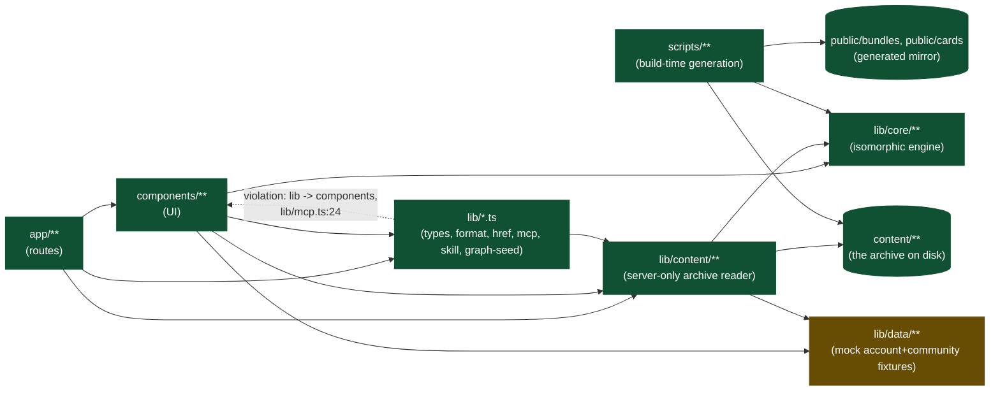

# DarkPrint — architecture

## 0 · Header

**Purpose.** This is the canonical description of DarkPrint (darkprint.io) as it exists in
this repository today: a frontend-only Next.js application whose UI is itself the
specification of a backend that has not been built. It exists so that whoever implements
that backend can read the UI's own promises — every disabled control, every seeded number,
every `◐ seeded` marker — as a contract, rather than reverse-engineering one from the
components.

**Who updates it and when.** Whoever changes a route, an entity shape, or a UI element that
implies a server interaction updates the corresponding section (and, for [8 · Backend
contract seams](architecture/seams.md), the matching `TODO(SEAM-xx)` comment in the code) in
the same change. This document does not get updated speculatively or on a schedule — see
[12 · Maintenance protocol](#12-maintenance-protocol-and-revision-log).

**Last verified against commit `90bdb0b` (docs-drift: let the checker see packages/, and report what that surfaces) on 2026-09-02.**

**The previous line named `752e25a` on 2026-09-01, when the registry-migration wave was still uncommitted; it has since landed as `ed3ae85`, which is why §11.1's "the migration tooling is untracked" entry is corrected below rather than carried forward.**

**Stack summary.** Next.js 16.2.11 (App Router, Turbopack, no Pages Router code), React
19.2.4, TypeScript 5 (`tsc --noEmit` as the type gate), Tailwind CSS v4 (CSS-first
`@theme` config in `app/globals.css`, no `tailwind.config.*` file), Vitest 4 for tests,
ESLint 9 (`eslint-config-next`). `@xyflow/react` renders the interactive graph canvas,
`animejs` 4.5 drives the hero and luminous-flow animation, `yaml` parses card/manifest
files, `opentype.js` generates the wordmark's SVG paths at build time, `@vercel/analytics`
is the only telemetry. Node >=22.18.0. No backend, no database, no auth provider — every
data source is either the `content/` archive (read at build time) or a seeded fixture in
`lib/data/**`.

**Two sentences above are false and are corrected here rather than rewritten, 2026-09-01.**
The Purpose paragraph calls this "a frontend-only Next.js application whose UI is itself the
specification of a backend that has not been built", and the Stack summary ends "No backend,
no database, no auth provider, every data source is either the `content/` archive (read at
build time) or a seeded fixture in `lib/data/**`". Both described the tree accurately when
they were written and neither describes it now. `lib/server/**` holds twenty-eight modules over
Postgres, `lib/db/schema.ts` declares twenty-four `pgTable` definitions (§6.2 says twenty-three
and is one behind), sessions and Google/GitHub sign-in
are real, and §6.2's own rows have said so task by task since T000. **`www.darkprint.io` is
live, database-backed and public**, measured on 2026-09-01 (D-117). The original wording is
left standing because §6.2, §7 and §11 are where this document actually describes the system,
and a header rewritten to agree with them would erase the evidence that they diverged.

**How to run locally.**

```
npm run dev          # dev server
npm run build         # prebuild regenerates public/bundles + public/cards from content/, then next build
npm run typecheck      # tsc --noEmit
npm run lint            # eslint
npm test                 # vitest run
```

`npm run build`'s `prebuild` step (`scripts/generate-bundles.ts`) rewrites `public/bundles/**`
and `public/cards/**`. Expect that diff and commit it, or run `rm -rf .next public/bundles`
first for a clean rebuild.

---

## Index

This document is split where a section's carried-over source material made it too long to
inline. Sections 2, 3, 4, 5 and 8 live in `docs/architecture/`; everything else is below.

0. [Header](#0-header) — this section
1. [The product in one page](#1-the-product-in-one-page)
2. [Domain glossary](architecture/glossary.md)
3. [Concept model](architecture/concept-model.md)
4. [Sitemap and routing](architecture/routes.md)
5. [User journeys](architecture/journeys.md)
6. [Frontend architecture](#6-frontend-architecture)
7. [State and data flow](#7-state-and-data-flow)
8. [Backend contract seams](architecture/seams.md)
9. [Design system](#9-design-system)
10. [Cross-cutting](#10-cross-cutting)
11. [Known gaps and decisions](#11-known-gaps-and-decisions)
12. [Maintenance protocol and revision log](#12-maintenance-protocol-and-revision-log)

---

## 1 · The product in one page

DarkPrint's own claim, verbatim and load-bearing (`components/hero/Wordmark.tsx:105`,
mirrored in the default page title, `app/layout.tsx:39`):

> **Reusable blueprints for agent workflows.**

**What it offers.** A public registry of *blueprints* — graphs of automations described as
a DOT topology plus versioned *node cards* — that a reader can browse, inspect down to the
YAML and DOT bytes, statically score (autonomy, static risk exposure, phase coverage), and
download. A companion vocabulary (*ontology*) gives every card's type, tools and risk
markers a shared, versioned meaning. Nothing on the site runs a blueprint: DarkPrint
distributes files and reads them back; composing and running both happen on the reader's
own machine, with their own harness (D-03, `OWNER-STATED`, `CONFIRMED` — no runner exists
anywhere in `lib/`).

**To whom.** The landing's "two ways in" band and the six client configs on `/mcp` and
`/skill` (Claude Code, Codex, Claude Desktop, Cursor, VS Code, Gemini CLI,
`components/mcp/clients.ts:16`) name the audience directly: people who already run a coding
agent or harness and want a reproducible, inspectable unit of work to hand it, rather than
a one-off prompt.

**The core value loop**, read off the landing's own five beats (`app/page.tsx:113-131`,
docblock at `:1-111`) and the lifecycle panel that closes the page
(`components/home/SectionLifecycle.tsx`):

1. **Claim** (Hero) — reusable blueprints, not prompts, are the artefact.
2. **Reproducibility argument** (`SectionSameRun`) — a blueprint pins the steps a harness
   takes, so a rerun is the same run and a change is attributable; a prompt lets the harness
   invent its own route, so nothing about it can be held constant
   (`docs/DECISIONS.md` D-04, `OWNER-STATED`, `CONFIRMED`).
3. **The blueprint itself** (`SectionBlueprint`) — a DOT graph of nodes, each a pointer at a
   card, drawn off a real archived bundle.
4. **The node card** (`SectionNodeIsCard`) — one reusable, versioned unit of work, drawn off
   a real archived card.
5. **What a reader does with it** (`SectionLifecycle`) — download it, compose it into
   something bigger, or upload it for the analyzer to read; the panel links each action to
   its page (`/blueprints`, `/build`, `/upload`).

The page ends there — on the lifecycle panel's own links — rather than on a separate
"find one / build one" doors section, which the author had cut as a redundant second
statement of the same two-way choice (`app/page.tsx:56-68`).

**Where the landing and the rest of the site agree, and where they used to disagree.** They
agree today. D-01 (`OWNER-STATED`, `CONFIRMED`, `docs/superpowers/specs/2026-08-04-ia-redesign.md:12-15`)
settles that blueprints, not "the dark factory," are the headline, and D-02 (same
provenance) settles "dark factory" as a *computed property* of one graph shape — every node
unattended and all five phases covered — never the site's category or its goal. The current
build matches both: `/towards-a-dark-factory` is one explainer page reached from the Learn
menu, not a nav-level category, and `isDarkFactory` never appears as a headline number
anywhere (`lib/core/analysis/autonomy.ts:317`). This *was* a real, recorded disagreement:
D-09 records the site's headline once being "Autonomy you can read as a graph"
(`commit feaa9bc`), later retired from every on-site surface in favour of the current claim
(D-09 is marked `CONTRADICTED` — i.e., superseded — in the decision ledger, and the phrase
survives only in the repository's root `README.md:4`, which is project documentation, not
UI copy a visitor reads). No other landing-vs-site claim conflict was found: the six landing
beats, the Learn sequence, and every route's own `generateMetadata` describe the same three
primitives (blueprint, node card, ontology) throughout.

---

## 6 · Frontend architecture

### 6.1 · Layer model

Eight layers, lowest to highest. Import directions were verified by grep, not assumed from
naming.

| Layer | What it is | May import from |
|---|---|---|
| `lib/core/**` | The isomorphic domain engine: DOT parsing, card/ontology validation, autonomy and security analysis, hashing, version-bump checking. Verified clean — zero occurrences of `node:*`, `Buffer`, `Date.now()` or `Math.random()` outside test files, confirming `CLAUDE.md`'s isomorphism rule against the actual code rather than trusting the doc | nothing else in the app |
| `lib/data/**` | Seeded/mock fixtures — authors, accounts, community signals, owned bundles. Each file's own header states it exists because there is no backend yet (`lib/data/community.ts:1-9`: "this module *is* the database... until there is a real one") | sibling `lib/data/*` files, `lib/types.ts` only |
| `content/**` | The archive on disk: `blueprints/<slug>/topology.dot` + `blueprint.yaml`, `cards/<id>@<version>.yaml`, `ontology/extensions.yaml`. Not code; read by `lib/content/read.ts` via `readFileSync`/`readdirSync` | — |
| `lib/content/**` | The server-only archive reader/aggregator. `read.ts` is the one file in the repo touching the filesystem and self-guards with a runtime throw if `typeof window !== "undefined"` (`lib/content/read.ts:49-52`). Two sibling files, `ontology-file.ts` and `bundle-export.ts`, are isomorphic (no `node:fs`) and are the only parts of `lib/content` imported by client components | `lib/core`, `lib/data`, top-level `lib/*.ts` |
| `lib/*.ts` (top-level) | Mixed utility layer: `types.ts`, `format.ts`, `href.ts`, `mcp.ts`, `skill.ts`, `criteria-state.ts`, `graph-seed.ts`. Not strictly isomorphic as a group — `graph-seed.ts` imports `layeredLayout` from `lib/content/layout` | `lib/core`, `lib/content` (the isomorphic parts) |
| `components/**` | UI, organised as one `ui/` primitives folder plus 22 feature folders (below) | `lib/core`, `lib/content` (server components only), `lib/data`, top-level `lib/*` |
| `app/**` | Routes. All spot-checked pages are server components (no `"use client"`) | `components/**`, `lib/**` |
| `public/bundles/**`, `public/cards/**` | Generated static mirror of `content/`, written by `scripts/generate-bundles.ts` at the `prebuild` step | — |

**One documented layering violation.** `lib/mcp.ts:24` imports `MCP_CLIENTS` from
`@/components/mcp/clients` — a top-level `lib/*.ts` file importing from `components/`,
inverting the `lib → components` direction the rest of the layer table holds. The file's
own comment (`lib/mcp.ts:12-21`) states this is deliberate: deriving the landing's one-line
command from the same array `/mcp`'s tab strip renders keeps "exactly one place to change
it," and `mcp.test.ts` pins `MCP_CLIENTS[0]` being Claude Code so a silent reorder is
caught. No cycle results (`components/mcp/clients.ts` does not import back), so it is a
one-way, tested inversion rather than a defect — flagged here because a clean-layering rule
should note its one exception rather than imply there are none.

No other violations were found: no `components/` → `app/` import in shipped code (only in
test files that mount a page component for integration testing, e.g.
`components/site/honesty.test.ts:38-41`), no `lib/core` import of anything outside
`lib/core`, and no `lib/data` import of `lib/core` or `lib/content`.

Legend: green = `LIVE` (real data/behaviour), amber = `MOCK` (fixture-backed), grey/dashed =
`PLANNED` (shape declared, nothing behind it) — the same three tags used throughout this
document (see [4 · Sitemap and routing](architecture/routes.md#status-tags)). The dashed
edge is the layering violation noted above, not a status.



### 6.2 · Directory tree

**`app/`** — routes (App Router; every spot-checked page is a server component):

| Path | Purpose |
|---|---|
| `page.tsx`, `layout.tsx`, `globals.css`, `icon.svg` | Home page, root layout (fonts, header/footer chrome, skip link, `Analytics`), design tokens, favicon |
| `blueprints/`, `blueprints/[slug]/` | Blueprint gallery and detail page |
| `build/` | The `/build` interactive workspace (starter template + three controls) |
| `mcp/` | MCP client install/registry design-proposal page |
| `nodes/`, `nodes/[...id]/` | Node/card browser and detail |
| `ontology/`, `ontology/[...term]/` | Ontology term browser and detail |
| `reading-the-radar/` | Scorecard explainer |
| `settings/` | Account settings page (mostly disabled controls) |
| `skill/` | Claude Code skill install page |
| `spec/topology/`, `spec/card/`, `spec/ontology/` | The three format layer pages |
| `towards-a-dark-factory/` | Long-form explainer / the 1-5 maturity ladder |
| `u/[username]/`, `.../blueprints/`, `.../cards/`, `.../saved/`, `.../terms/` | Public profile and its four tabs |
| `upload/` | Bundle upload/validation wizard |
| `what-a-blueprint-is/` | Learn stop 00, the door to the three layer pages |

**`components/`** — UI, one primitives folder plus 22 feature folders:

| Folder | Purpose |
|---|---|
| `ui/` | Generic design-system primitives — 34 files (buttons, badges, meters, pills, cards, rails, diagnostics list, etc.); the largest and most reused folder |
| `blueprint/` | Blueprint detail-page UI: canvas, requirements, evidence layers, comments, fork/clone/download actions |
| `bundle/` | Bundle file tree, header, version history, the `load.ts` view-model builder |
| `build/` | The `/build` workspace: state machine, score panel, choice graph pane, vocabulary pane, download step |
| `explain/` | Concept-explainer figures and run-layer diagrams used on explainer pages |
| `gallery/` | The blueprint gallery browser (single file) |
| `graph/` | DOT/flow graph rendering primitives shared by every canvas |
| `hero/` | The landing hero: wordmark animation, setup chips, grid spotlight |
| `home/` | Landing-page sections (lifecycle, blueprint, node-card beats) and their supporting geometry/data |
| `learn/` | The Learn-shell rail and figures shared across the Learn sequence |
| `mcp/` | MCP client config data and install-tabs UI |
| `nodes/` | Node/card browser, summary, interfaces, version history |
| `ontology/` | Ontology term table/tree/catalog/vocabulary browser |
| `panes/` | The multi-pane layout system (graph pane, source pane, DOT breakdown, synchronized panes) used by `/build` and blueprint detail |
| `profile/` | Profile shell, tabs, owned bundles/cards, pinned/saved lists, `load.ts` |
| `settings/` | Settings form fields and controls |
| `site/` | Global chrome: header, footer, logo |
| `skill/` | Skill-install setup UI |
| `spec/` | Spec-page tables, rows, scoring-model figure |
| `upload/` | Upload flow, dropzone, validation report |
| `viz/` | The shared SVG "luminous flow" drawing system: scenes, tokens, easing, reveal/scroll hooks |
| `mcp/`, `skill/` | (listed above) |

**`lib/`**:

| Folder / file | Purpose |
|---|---|
| `core/` | The isomorphic engine — `analysis/` (autonomy, security, phase-coverage), `archive/` (registry, store), `attractor/` (`emit`, `lint`, `reserved`, and **`import`** — the inverse of the emitter, added 2026-08-30, deriving its shape table from the emitter's rather than transcribing it), `bundle/` (resolve, types), `card/` (parse, schema, validate), `dot/` (lexer, parser, graph), `hash/`, `ontology/`, `version/`, plus `config.ts`, `diagnostics.ts`, **`gate.ts`** (storable versus approved: the named twelve-code blocking set, added 2026-08-30) and `index.ts` (the barrel — an explicit inventory of the engine's public surface). `ontology/resolve.ts` is where the two membership questions are answered once and never re-implemented: `requiresHuman`/`humanCitation` (does a person act here) and `controlCitation`/`isControlPoint` (does this node decide whether others run) |
| `content/` | Server-only archive reader/aggregator — `read.ts` (fs reader, guarded), `index.ts` (build-time cache), `view.ts` (blueprint view model), plus the two isomorphic files `bundle-export.ts` and `ontology-file.ts` |
| `data/` | Mock/seed fixtures — `account.ts`, `bundles.ts`, `community.ts`, `node-community.ts`, `profiles.ts`, `users.ts` |
| `starter/` | The `/build` variant engine — `variants.ts` (pure, deterministic: three choices in, one `Bundle` out) and `cards.ts` |
| `types.ts`, `format.ts`, `href.ts`, `mcp.ts`, `skill.ts`, `criteria-state.ts`, `graph-seed.ts` | Shared domain types and small utilities |
| `db/` | **Backend, LIVE.** Postgres via Drizzle. **Two of the 23 tables and one column are declared, unread and unwritten since 2026-08-30** — `ontology_version`, `ontology_term` and `release.scored_ontology_version_id` — and the declarations stay, commented as such, because dropping them is a migration decision with its own blast radius rather than a side effect of deleting their writer. The table count does not change. `schema.ts` (**23 tables** — T000's ten: `account`, `handle_reservation`, `ontology_version`, `ontology_term`, `bundle`, `release`, `card_version`, `target`, `target_actor`, `audit`; T005's six: `save`, `ballot`, `note`, `note_vote`, `run_report`, `api_key`; **T131's three: `follow`, `profile_pin`, `account_support`**; **T190's two: `notification_queue`, `unsubscribe_token`**; **T200's two: `release_embedding`, `card_version_embedding`** — `vector(384) NOT NULL`, keyed one-to-one on their subject with `ON DELETE CASCADE`, indexed `hnsw`/`vector_cosine_ops`, added by the orchestrator at `0003_search` because `schema.ts` is Forbidden to T200. **They are TABLES rather than columns on `release` and `card_version` because both of those are T005 base tables and `tests/server/t005/existing.test.ts` holds the delta over the ten to one licensed cell — it redded on the first attempt.** The separate table is better regardless: `NOT NULL` makes a row exist **iff** that subject is embedded, so *never embedded* is an absent row rather than a null carrying that meaning by convention, nothing eight merged tasks already `select` from gains a field, and `ON DELETE CASCADE` keeps a vector from outliving a DELETED subject. **That last clause used to read "a stale vector is unrepresentable rather than something a sweep must remember" and was false**: it says nothing about a subject that is UPDATED, and `ed3ae85` updated 58 `card_version` and 16 `release` rows in place under unchanged keys while every vector survived. `0008` is the answer, below), `migrations/` with paired up/down SQL, `migrate.ts` + `cli.ts` (the runner behind `npm run db:migrate` / `db:rollback`), `client.ts`, and `storage.ts` (the S3-compatible object client, keyed by digest). Merged at `ec516fa`, tagged `t000-verified`; extended by T005 at `011a851`, tagged `t005-verified`. **`0007_drafts` (T280) stays at 23 tables** — additive-only, five nullable columns (`title`, `summary`, `description`, `category`, `tags`) on the existing `bundle` table rather than a new one, so a bundle may now first exist at draft creation as well as at its first `publish()` (B-06 relaxed, not replaced). **This is exactly the alteration `tests/server/t005/existing.test.ts`'s base-table freeze exists to catch, and it does**: `bundle` is one of T005's ten `BASE_TABLES`, so the guard's own licensed-delta list grew from AC7a's one cell to six, naming all five added columns individually rather than widening the count — the migration's own up-script names the guard and the fix in place rather than silently avoiding it. **`0008_embedding_input` (2026-09-02) stays at 23 tables too** and carries no base-table delta at all: one nullable `text` column, `embedded_input_sha256`, on each of `release_embedding` and `card_version_embedding`, neither of which is among T005's ten `BASE_TABLES` because both arrived at `0003_search`. It records the identity of the exact string the encoder was handed, so a vector can say what it is a function of; see §7 item 6 and D-119 |
| `server/auth/` | **Backend, LIVE.** GitHub OAuth — `github.ts` (the provider exchange), `oauth-state.ts`, `cookie.ts` (HMAC-signed), `session.ts` (`SessionToken` is signed and carries `exp`; `SessionPayload` is what a handler receives and carries `{ accountId, handle }` only), `guard.ts` (`withSession`). Expiry, **not** revocation: a stolen cookie stays valid until `exp` |
| `server/http/` | **Backend, LIVE.** The response envelope of B-03 — `ok.ts` for payloads at 200, `problem.ts` for RFC 9457 `application/problem+json` |
| `server/archive/` | **Backend, LIVE.** Bundle records and their append-only releases — `bundle.ts`, `release.ts`, `well-formed.ts` (an iterative, path-scoped walk that refuses content Postgres would silently rewrite), `constraints.ts` (index names derived from the schema at runtime, never restated), `errors.ts`. Merged at `3fd050f`, tagged `t010-verified`. **`bundle.ts` gains two writers at `0007_drafts` (T280): `setBundleVisibility`** (owner-only, works identically on a draft and a published bundle since both write the same `bundle.visibility` column, backing `PATCH /api/bundles/{owner}/{slug}/visibility`) **and `updateBundleDetails`** (the later-edit surface for the five new columns — `Object.hasOwn`-gated so an absent key leaves a column alone and a present `null` clears it, `lib/server/accounts/write.ts`'s own convention — published but **called by no route yet**, since `0007_drafts` ships only the visibility PATCH). Neither mints a new error class: both answer `undefined` for absent-or-not-yours, the same B-03 value `getBundle` already returns unconditionally, and a genuine store fault still throws through the same `sanitizedWriteError` `createBundle` uses. `error-hygiene` unmoved |
| `server/cards/` | **Backend, LIVE.** One immutable row per `(cardId, version)` with its digest, owner and visibility. Reads take an `Actor` and filter through `server/policy`, so a private card is unreadable by anyone but its owner and an operator at the storage boundary rather than by caller convention. `addCard` requires a strict semver — narrower than `REF_VERSION`, because `compareSemver` cannot order `1.0` and "latest" must always be defined. Merged at `aee6e07`, tagged `t020-verified` |
| `server/versioning/` | **Backend, LIVE.** Server-authoritative bump inference for blueprints and ontologies (`lib/core` already carried the card path) — `blueprint-bump.ts`, `ontology-bump.ts`, `declared-bump.ts`. An ambiguous pairing infers the **most expensive residue-free explanation**, never the cheapest, so an under-declared bump is refused rather than shipped. Merged at `87dffd8`, tagged `t025-verified` |
| `server/policy/` | **Backend, LIVE.** The authorization decision — `can.ts`, `visible-to.ts`, `is-owner.ts`. Pure, zero runtime imports, never throws, no default-allow. Two subjects only: a resource's owner and a break-glass operator (B-13). Merged at `eef7cce`, tagged `t060-verified` |
| `server/ontology/` | **Backend, LIVE, and reduced from 12 modules to 2 on 2026-08-30** — `index.ts` and `view.ts`, nothing else. Its whole published surface is `openView(extensions?: readonly OntologyTerm[]): OntologyView`: **synchronous, no `Db` parameter, no version argument**, over `CORE_ONTOLOGY`. Deleted with the version registry: `store.ts`, `bump.ts`, `errors.ts`, `digest.ts`, `input.ts`, `validate.ts`, `well-formed.ts`, `vocabulary.ts` and the whole of `tests/server/t030/**`, whose subject was the store. Six error classes went with them (`OntologyStoreError`, `MalformedContentError`, `InvalidVocabularyError`, `DuplicateOntologyVersionError`, `VersionBumpTooSmallError`, `UnknownOntologyVersionError`) plus `server/export`'s `unpublishedOntologyVersion`, taking `tests/error-hygiene.test.ts`'s published-class equality **53 → 47, the first time it has ever gone down**. The AC5 comparability property survives and is restated: `isA` memoizes per view instance, so a batch has to share one view. Originally merged at `1f9a9d0`, tagged `t030-verified` |
| `server/registry/` | **Backend, LIVE.** The cross-store read model the `/api` routes are served from — one query layer over `server/cards`, `server/archive` and `server/ontology`, taking an `Actor` and filtering every row through `server/policy` so visibility is decided once at the storage boundary rather than per route. **The first module any route actually calls**, which is the condition §12's revision log named for re-reading the seams. Merged at `8656c32`, tagged `t080-verified` **Extended by T081 with `errors.ts`, `store.ts` and `http.ts`**: `withRegistryStore` converts **every** rejection because this read model has **no decisions** — measured, `grep -rn "throw "` over every non-test file returns zero, and every empty answer is a **value** because B-03 answers 404 over 403 — so a classified subset would fail **open** on the clause the wrapper exists for. `withRegistryErrors` answers `problem+json` **500** `store-failed` on all eleven routes with `detail` the instance's own `message` byte for byte (D-81-01/02). Merged at `8656c32` tagged `t080-verified`, extended at `752721d` tagged `t081-verified`. **Reader seventeen at T260's merge: `usersOfMany` (D-260-31)** — the batch reverse index, one snapshot for the whole `/nodes` shelf where the disclosed per-row `usersOf` cost was 53. **Readers eighteen and nineteen at `0007_drafts` (T280): `draftBundle` and `ownedBundles` (`owned.ts`)** — the only two readers here that query `bundle` DIRECTLY rather than through the shared `loadSnapshot`, deliberately: `loadSnapshot`'s release-skip ("a bundle with no release is not yet a blueprint", B-06) is the PUBLIC archive shelf's rule and stays untouched, while the profile shelf and the bundle detail page's draft branch want exactly the zero-release rows that rule omits — the GitHub empty-repo state is a thing to render, not a reason to hide the row. `ownedBundles` is a LIST keyed by owner handle (every visibility for the owner, public rows only for anyone else, `readable` — the same predicate `loadSnapshot` filters with, applied to the same `(ownerId, visibility)` pair so the two readers cannot disagree about what "visible" means over one table); `draftBundle` is a single record keyed by `(owner, slug)`, `blueprint()`'s own key shape, answered on the same B-03 terms (absent and unreadable collapse to one `undefined`) |
| `server/export/` | **Backend, LIVE.** Distribution — turning a stored release back into the files an agent runs. `export-release.ts` (the folder as bytes), `serve-file.ts` / `serve-card.ts` (one file at a time), `build.ts`, `lookup.ts`, `vocabulary.ts`, `content-type.ts`, `downloads.ts`, `errors.ts`. Every input comes from Postgres — `release.dot`, `release.manifest`, `card_version.source`, `release.local_vocabulary` — so this module touches object storage nowhere (D-90-07). `ExportReadError` is a **sibling** of `ExportError`, not a subclass, so a read failure and a caller error cannot be told apart by a single `instanceof` that catches both. Merged at `6d746ff`, tagged `t090-verified`. **`serve-card-source.ts` joins at T280: `serveCardSource` is `serveCard`'s bytes minus B-14's download event** — `release-files.ts`'s own rule, "a listing is not a download," applied to a card rendered inline on its own page. Duplicated rather than composed from `serveCard` and unwinding its side effect, on purpose: `serveCard` itself is UNCHANGED, so the download panel's own fetch of a card still counts and this reader existing beside it cannot drift that count. The blueprint detail page and `/nodes/[...id]` both moved their page-render reads from `serveCard` to this function at T280 — **before that, every page view of either page called `recordDownload` through `serveCard`, so the download counters both pages now show include download-count inflation from every historical page render, not only real file transfers; the historical figures are not correctable, only the going-forward behaviour is fixed** |
| `server/engine/` | **Backend, LIVE.** The authoritative parse-resolve-analyze pass over submitted bytes, consuming `@/lib/core` and nothing else from the application. Publishes `LimitExceededError`, `CircularReferenceError` and `UnserializableValueError`. **Its byte guard is an ITERATIVE walk with an explicit frame stack, `MAX_NESTING_DEPTH = 10 000` refusing as a typed error, and a size that matches `Buffer.byteLength(JSON.stringify(input))` — measured against a 486-cell corpus generated over `SerializeJSONProperty`'s own branches rather than a list.** `limits.ts` carries the audit that ends five rounds of one defect class: **seven spec operations delegated, eleven transcribed**, delegated being safe by construction. Merged at `ad44537`, tagged `t040-verified` |
| `server/naming/` | **Backend, LIVE.** Every user-chosen identifier — handles, bundle slugs, card ids, term namespaces — and the permanence of their reservations. `handles.ts`, `slugs.ts`, `grammar.ts` (one grammar derived from the engine's `CARD_ID`, round-tripped rather than parsed, since `parseCardRef` trims and would reserve a different primary key than the one asked for), `suggest.ts`, `reserved.ts`, `constraint.ts`, `errors.ts`. A handle is **permanently reserved once used**: a released handle can never be claimed by a second account, and **can** be reclaimed by its original holder — one atomic `ON CONFLICT DO UPDATE … WHERE handle_reservation.account_id = excluded.account_id`, which never raises, so the module reads `rowCount` and refuses. Merged at `38eb820`, tagged `t070-verified` |
| `server/accounts/` | **Backend, LIVE.** The account record, its four editable surfaces and the GitHub session. `read.ts`, `write.ts`, `validate.ts`, `store.ts`, `http.ts`, `errors.ts`, `guards.ts`. **`withStore` lets *decisions* through unwrapped and sanitizes everything else** (D-13), and `withAccountErrors` maps every class `isDecision` recognises to `problem+json` — status per class (409 `HandleTakenError`, 400 `InvalidNameError`, 500 `NamingStoreError`/`AccountStoreError`) with **`detail` the instance's own `message` byte for byte**, so a foreign fault keeps the operation name of the call that actually failed. Merged at `194dd86`, tagged `t050-verified` |
| `server/saves/` | **Backend, LIVE.** Private bookmarks over B-10's polymorphic `(kind, id)` target — blueprint, card and term. `read.ts`, `write.ts`, `visible.ts`, `store.ts`, `http.ts`, `guards.ts`, `errors.ts`, `types.ts`. **A save is private and so is its COUNT**: `countSaves` returns `0` for a denied caller, so *not yours*, *no such account* and *yours and empty* are indistinguishable (D-140-01), and the count is derived from the same filtered query as the list so the two agree by construction. **`visibleTo` asks a different question per kind** and the asymmetry is deliberate — blueprints and cards ask *visible*, terms ask *exists*, because `ontology_term` has no owner column and B-07 makes terms public (D-140-03). **Consumes `NotAccountOwnerError` from `server/accounts` rather than minting a second class** and publishes `SaveStoreError` for D-13 (D-140-02). **`listSaves` is ordered and every term is computable from the published record**: `date_trunc('milliseconds', saved_at) DESC, target_kind::text ASC, ref_id ASC` — the truncation because `savedAt` crosses as a millisecond `Date` while the column is microsecond `timestamptz` (D-140-11), and the cast because Postgres orders an enum by declaration order (D-140-09/10). Merged at `174cb0e`, tagged `t140-verified` |
| `server/publish/` | **Backend, LIVE.** Turns validated bytes into a bundle and its first release, or appends a release to one that exists. `publish.ts`, `errors.ts`, `index.ts`. **It COMPOSES and owns no storage** — engine, archive, versioning, naming, policy, cards, ontology and accounts — so its dominant risk is re-implementing a decision a merged module already owns, and twelve contract items were ruled before any code existed. **`publish` honours `can` rather than comparing ids** (D-100-04): the obvious `ownerHandle === actor.handle` shortcut makes `can` trivially true AND refuses a rightful owner immediately after a rename, since `changeHandle` updates the row while the cookie keeps the old handle. ~~**It calls `openView(db, manifest.ontologyVersion, terms)`** so the stored scorecard and the export agree — scoring against the shipped core while the export resolves the manifest's named version means publish accepts and the first export 404s.~~ **Corrected 2026-08-30**: it calls `openView(vocabulary?.terms)`. With one living vocabulary there is no named version to resolve, so the agreement it preserves is about the **overlay** only. It no longer writes `release.scored_ontology_version_id` either; the version a scorecard was computed under is read off `AutonomyResult.ontologyVersion` inside `release.autonomy`, which `publish.ts` has always written and `export/build.ts` has always preferred. **The card-bytes conflict compares SOURCE, not digests and not `body`**: `source` is `text` and round-trips byte-identical while `body` is `jsonb` and round-trips value-identical only, so a `body` comparison reintroduces the blindness a digest comparison has (D-100-02). **Three foreign rejections reach a caller unaltered, each keeping one author**: `MalformedVocabularyError` 400, `CardStoreError` 422, `ExportError` 422. It was four until 2026-08-30; `UnknownOntologyVersionError` 422 went with the version store, and the state it named is unreachable. **`persistArtefacts` freezes the folder at publish** — the first write to object storage in this run, and B-01's split implemented rather than deferred — encoded by a codec this module publishes, because `keyForDigest` addresses one object per digest so a folder cannot be stored file-per-key. Publishes `PublishRefusedError` with five kinds and **six message forms** — `conflict` carries two — taking `error-hygiene`'s equality 29 → 30 |
| `server/limits/` | **Backend, LIVE.** Rate ceilings and API keys. `check.ts`, `config.ts`, `counter.ts`, `keys.ts`, `secret.ts`, `store.ts`, `http.ts`, `errors.ts`, `types.ts`, `index.ts`. **`checkLimit` CANNOT reach `db` — it is not a parameter** (T231, D-231-01), which is stronger than the discipline the previous sentence described and is held by an equality on `check.ts`'s import list plus a transitive check that nothing it imports reaches `@/lib/db` at any depth. **The precondition D-230-05 held by caller discipline is now a type**: `resolveKey` returns a branded `ResolvedKey` only it can mint, `LimitSubject` is a three-arm union carrying its own tier, and an unresolved key, a **revoked record listed by `listKeys`**, or a bare `keyId` string is a compile error. The brand proves **provenance, not non-revocation** — deleting `isNull(revokedAt)` from `resolveKey`'s WHERE still mints one, which is why it was left unnarrowed and why that mutation now reds **3** cells on two axes where F-230-J measured **0 across 164**. `tierOf` is withdrawn: the subject carries the tier. Previously — D-230-05's clause counts a keyed *request*'s one indexed read, which is `resolveKey`'s at the route, so a statement here would make a keyed request cost two where the clause licenses one. The counter is in-process, so **N warm instances multiply the effective ceiling by N** and that weakening is published rather than inferred. **`limitFor` refuses every bucket outside its table** and uses `Object.hasOwn` on both levels, so `limitFor(config, "constructor", "key")` cannot reach `Object.prototype` and answer a function where the signature says `BucketLimit`. **`issueKey` returns the secret exactly once and `ApiKeyRecord` does not carry it** — stored hashed, unrecoverable, structural rather than remembered. **Revoked rows are LISTED rather than filtered**, because that is AC4's observation rather than a convenience. Owner's ceilings, per hour: `read` 600/600/6000 anonymous/account/key, `write` REFUSED/120/120, `upload` REFUSED/30/30. **An unconfigured bucket refuses with a year-long backoff, not the Unix epoch** (F-230-M): every configured window is an hour, so reusing it would make an unnamed bucket byte-indistinguishable from a deliberately closed cell, and an epoch `resetAt` invited a client honouring the published machine-readable field to retry immediately, forever. Publishes five classes, taking `error-hygiene`'s equality 24 → 28 |
| `server/lineage/` | **Backend, LIVE.** Fork, lineage and drift. `fork.ts`, `drift.ts`, `forks.ts`, `store.ts`, `types.ts`, `errors.ts`, `http.ts`, `index.ts`. **Owned no route surface at merge** — Q6 removed `app/api/lineage/**` from that wave, and `http.ts` (the `kind` → status map) stayed here published with no caller (D-110-12), because a route task re-deriving a status map from a union it did not author is the duplication that run charged hardest. **T280 gives it its first three callers**: `POST /api/bundles/{owner}/{slug}/fork` (session; `[owner]/[slug]` names the upstream, the body carries `version` plus optional `slug`/`visibility` overrides — an omitted `visibility` passes through as `undefined` so `forkBundle`'s own D-110-09 default applies, never a route-level constant), `GET .../forks` and `GET .../drift` (both public, resolving `owner/slug` to a bundle id the same two-step way the star route does — `resolveOwner` then `getBundle`, since this module publishes no `ownerHandle+slug → id` reader of its own — and answering the module's own B-03 value, `[]` or `{ tone: "ok", repins: [] }`, for an unresolved owner/slug exactly as for a real-but-empty or up-to-date upstream). `http.ts`'s status map finally has a caller. Lineage is **one optional field on the ordinary bundle record**, `{ ownerId, slug, version }` — not an entity, no `Fork` type, no second list; the frontend's `forkedFrom` names the same fact with `owner` as a HANDLE while the record carries `ownerId` as a uuid, and that asymmetry nearly redded every AC1 cell in both halves. **`forksOf` returns PUBLIC rows only** (Q1): `actor` gates whether a caller may ASK, never what the answer IS, because a per-viewer filter on the content makes the count a property of the viewer — so AC2's "unchanged while private" would hold for a stranger and fail for the author AC3 protects (D-110-17). **`Repin.at` is the EARLIEST upstream release carrying the new version** (D-110-14): the panel prints "repinned … **on** `<date>`", so dating from the current release is right only when the upstream has published exactly once since the fork. That ruling came from a genuine second axis — implementer and blind author derived opposite readings from the same rendered copy, and it was settled by a source neither wrote. **An omitted `to.visibility` takes the forker's own `default_visibility`**, never a module constant (D-110-09). Four refusal sentences, all bare and leaking nothing: `no such bundle.` (404-not-403, character-identical for an unreadable upstream and an unknown handle), `` `<slug>` is already yours. ``, `no such release.` (a fallback to latest would satisfy AC1 by writing a true statement about the WRONG release), and `not signed in.` — the last unreachable through HTTP, since `withSession` answers 401 first. `blocked` is decided before the upstream is read and wins over `moved`. Publishes `ForkRefusedError` and `LineageStoreError`, taking `error-hygiene`'s equality **30 → 32** |
| `server/observability/` | **Backend, LIVE.** The audit sink. `types.ts`, `write.ts`, `read.ts`, `store.ts`, `errors.ts`, `index.ts`. Publishes `writeAudit`, `listAudit`, `AUDIT_ACTIONS`, `AuditStoreError`, `NotPermittedError`. **Owns no route surface.** `AUDIT_ACTIONS` is a CLOSED set of twelve published as a VALUE, not only a type, because the promised assertion — *no action refers to a run* — cannot be quantified over a set nothing can enumerate. **Amended only by the orchestrator at a task's dispatch** (D-240-09): T170, T160 and T250 each need a member and each is Forbidden from this folder. `save.add`/`save.remove` are deliberately ABSENT — operator-only reads plus a private bookmark is a break-glass-readable reading history, so B-14's *every state change* is narrowed here on purpose. `counter.write_failed` names the counter fault, never the download. **`listAudit`'s permission check sits INSIDE `withStore`'s callback**: outside it, `listAudit(db, undefined, {})` rejected with a raw `TypeError` from `Object.hasOwn` through the one door `store.ts` claims is closed, **and `store.ts`'s decision arm was unreachable from the published surface entirely** (D-240-14). `detail` excludes a nested object and **does NOT exclude a flat credential** — half of AC3 is held by discipline (D-240-07). `isOperator` is a charged COPY of `lib/server/policy`'s; **one line on the policy barrel deletes it** (D-240-10). Takes `error-hygiene`'s equality **32 → 34** |
| `server/notes/` | **Backend, LIVE.** Notes and note votes (T170). `types.ts`, `errors.ts`, `guards.ts`, `body.ts`, `cursor.ts`, `parent.ts`, `store.ts`, `read.ts`, `write.ts`, `index.ts`. **Owned no route surface at merge (D-WAVE-02); that is now false.** T280 adds `http.ts` (`withNotesErrors`, published from the barrel, D-01) and six `app/api/**` routes over it — a list+post pair each for blueprint and card parents, plus a `PATCH`/`DELETE` pair and a `/vote` route mirrored the same way. Neither the edit/delete pair nor the vote route gets a `withSession` HTTP pre-check: `postNote`'s own `denied()` (consuming `NotAccountOwnerError` from `server/accounts`, D-WAVE-04) already answers 404 for an anonymous caller exactly as it does for a wrong author, so a route-level 401 would be a second, disagreeing answer to the same question. **Votes live in the `note_vote` TABLE, keyed `(note_id, account_id)` — NOT `target_actor.kind = "note_vote"`, which is a DEAD enum member**: keyed there a vote is per BLUEPRINT, refusing an account's vote on a second note under the same blueprint and never noticing two votes on one note (D-05-02, D-WAVE-01 as corrected). **T170 writes `note`, `note_vote` and `target.note_count`, and NO `target_actor` row** — T150 is that table's sole writer. **`note_count` is MAINTAINED, not derived**: deriving it would leave `getSignals().noteCount` permanently 0 with nothing redding, since T150 may not count `note` rows and is the only half publishing the field. **Pages ASCENDING** (D-WAVE-06) — and the offset-vs-keyset argument for AC2 is false in that direction, because a new note appends to the end and B-18's tombstone means no row ever leaves; the real content is the **microsecond-to-millisecond precision gap**, measured at **50 rows where 25 exist**, a loop rather than a boundary duplicate. **A tombstone occupies a page slot** with `deleted: true` and `body` emptied AT DELETE, so it is unreadable in storage and not merely to the reader. **A malformed OR empty cursor REFUSES** with `InvalidCursorError`, passed through `withStore` as a DECISION rather than a fault — sealing it would turn *your token is not ours*, which tells a client to restart the walk, into *the store failed*, which tells it to retry the same token forever (D-WAVE-13/14). `MAX_NOTE_BODY = 2000`, UTF-16 code units, whitespace-only counts as empty, **PENDING-OWNER-REVIEW**. Authorization is `can`'s with **the parent-read check on the SHARED step**, not only `postNote`: `canOnNote`'s `delete` arm is as parent-blind as its `write` arm, so an author would otherwise go on editing notes under a blueprint that went private. Publishes three classes, taking `error-hygiene`'s equality **34 → 37** |
| `server/counters/` | **Backend, LIVE.** Stars and downloads (T150). `types.ts`, `errors.ts`, `guards.ts`, `store.ts`, `read.ts`, `write.ts`, `index.ts`. **Still owns no route surface of its own** (D-WAVE-02 stands: no `http.ts`) — but two `app/api/**` routes now consume `toggleStar` directly at T280 (`POST /api/blueprints/{owner}/{slug}/star`, `POST /api/cards/{id}/star`), each mapping the module's two classes locally rather than through a wrapper this module publishes, since `toggleStar` performs no visibility check by design and B-03 has to be enforced by the caller anyway. **`read.ts` gains `getSignalsMany` at T280**: `getSignals`, answered for many targets in one round trip, in the caller's own order (a repeated target answers twice), a target nothing has happened to still answering three zeros and creating no row — feeds `ProfileHeader`'s summed downloads/stars line over every target one handle's own bundles and cards name, one query rather than one `getSignals` per owned row (`components/profile/load.ts`). **T150 is the SOLE writer of `target_actor`** and writes only `kind = "star"`; it also writes `target.star_count` and `target.download_count`, **READS `target.note_count` without ever computing it** (T170 maintains that column, and a second party counting `note` rows would reintroduce B-18's tombstone question in a module that has never heard of notes), **and writes an `audit` row via `counter.write_failed` on a failed counter write** — the correction to D-WAVE-01's *"Nothing else"*, which was false. **AC1 is an INVARIANT PAIR, not a count** (D-WAVE-05): *starring twice yields 1* is false of a toggle sequentially and non-deterministic concurrently, because a toggle must read its own prior state to choose a direction — so what holds under every interleaving is **one row per `(target_id, account_id, 'star')`** and **`star_count` EQUALS the star rows it counts**. The second is what a read-modify-write increment breaks and **exactly one cell in the suite catches it**. The toggle is decided by `RETURNING` rather than a prior read, each ±1 is paired with a row that demonstrably appeared or disappeared, and the pair is in a transaction, so the count agrees with the rows **by construction rather than by a floor**. **`recordDownload` never rejects** (T090's ruling inherited) and takes no `Actor`; **`getSignals` does not create the `target` row**; **`toggleStar` performs no visibility check** (T140's precedent). `lib/server/export/downloads.ts` now DELEGATES here, discharging SEAM-19 — **the `export -> counters` edge is the only one in the graph that reverses a previous direction.** Publishes two classes, taking `error-hygiene`'s equality **37 → 39** |
| `server/search/` | **Backend, LIVE.** Search and ranking (T200). `types.ts`, `text.ts`, `embed.ts`, `params.ts`, `visibility.ts`, `rank.ts`, `errors.ts`, `store.ts`, `http.ts`, `blueprints.ts`, `cards.ts`, `terms.ts`, `reembed.ts`, `index.ts`, plus the three `app/api/search/**` routes. Publishes `Hit`, `Results`, `SearchStoreError`, `withSearchStore`, `withSearchErrors`, `searchParams`, `oneOf` and the four verbs. **ONE error class, taking `error-hygiene`'s equality 39 → 40, derived at the merge commit and falsified by breaking the barrel.** **The embedding derivation was character 3-grams (FNV-1a into 384 buckets) until T300 swapped it for a LOCAL transformer encoder** (D-300-01, owner-stated): all-MiniLM-L6-v2 quantised, **23MB vendored under `models/` (D-300-05 arm (a)), digest-pinned by a falsified cell** (`MODEL_SHA256` in `embed.ts` — a one-byte flip reds only that cell, measured), `allowRemoteModels = false` before the pipeline builds so AC5 (no egress at query or publish time) holds by construction. Absent weights degrade to lexical search, never a throw; a WRONG model throws by name and must never masquerade as absent (D-300-08). **Retrieval is HYBRID: lexical hits keep their rank and evidence untouched; semantic-only finds join a TAIL behind every lexical hit, each carrying the published `similar:purpose` marker; `SIMILAR_MIN = 0.20` and `SEMANTIC_K = 10` are published WITH their calibration table beside them in `embed.ts` — the doc deliberately does not restate the numbers.** `ordered: true` stays honest because the channel is NAMED per hit and the cut is published with its calibration (D-300-06); no vector under an explicit `sort`, a shared link's answer must not grow.** Score IS `evidence.length`; there is no weight table, because a weight table is the unpublished derivation SEAM-88 names. **`ordered === hits.every(h => h.evidence.length > 0)` is literally the returned expression**, so an empty result reports `ordered: true` — `[].every()` is true, an empty list is trivially ordered, and carving out the case would make one law into two a module can satisfy separately (D-200-22). **AC4 is ONE constant: `PUBLIC_ONLY = { kind: "anonymous" }` passed to every T080/T030/T010 read, so `actor` is accepted and DOCUMENTED AS UNUSED** — because `visibleTo` answers `"all"` for a genuine operator and for the owner, and consuming those readers with the caller's own actor is the leak AC4 was written against (D-200-06/07). **The AC4 leak that is easiest to miss arrives through the FACET MAP rather than the hits** — a private tag as a VALUE in `facets.tag`, caught only by a walker reading the whole `Results` including keys. Merged at the commit below, tagged `t200-verified`; semantic channel merged at `t300-verified`, with `publish()` triggering `reembedRelease` since `f30e664`. **`reembed.ts` stopped being insert-only on 2026-09-02** (D-119): it reads `embedded_input_sha256` before consulting the encoder, so unchanged content costs one indexed lookup and no model load, and content that CHANGED is now repairable at all, which `onConflictDoNothing` made impossible. `embeddedInput(text)` is exported for one reason and it is not reuse: the stamp folds `MODEL_BLOB.sha256` in beside the text, and no row in any database can witness that a weights swap invalidates a stamp, so the only observable is that the value is not the hash of the text alone. It is deliberately kept OUT of `index.ts`, which `tests/server/t300/surface.test.ts` pins to the four verbs |
| `server/ballot/` | **Backend, LIVE.** Community ballot and vote weighting (T160). Eight files; publishes `castBallot`, `getAggregate`, `BallotRefusedError`, `BallotStoreError`. One ballot per account per blueprint carried across releases; aggregate recomputed at read from stored votes and CURRENT `validator_weight` (the weight is the lever — the badge is not, D-WAVE-08); below five votes the response says sample. No audit row (`ballot.cast` withdrawn). **Known gap D-160-01: `validator_weight` has no positivity constraint and a negative weight pushes a mean off the 0–100 axis** — fix specified (CHECK + licensed-delta amendment), owed. `error-hygiene` 40 → 42. **Owned no route surface at merge (D-WAVE-02); that is now false.** T280 adds `http.ts` (`withBallotErrors`, published from the barrel this wave) and `GET`/`POST /api/blueprints/{owner}/{slug}/votes`: `GET` never 404s — the route resolves `owner/slug` to a `bundleId` (existence only, never a second visibility opinion beside the module's own `bundleRowFor`+`can`) and hands a fresh `randomUUID()` to `getAggregate` when nothing resolves, so the module's own empty-aggregate VALUE is the one answer either way; `POST` requires a session and reads `{ efficacy?, reliability?, transparency? }` field by field rather than casting the body whole, so an absent key stays absent for `requireScores` to validate. `VoteControl` (`components/bundle/VoteControl.tsx`) is the write, beside the scorecard region on `/blueprints/[owner]/[slug]` |
| `server/runs/` | **Backend, LIVE.** Run-report ingestion and cost aggregation (T180). Eleven files; publishes `submitReport`, `reportedCost`, `RunReport`, `ReportedCostUnits`, `RunReportRefusedError`, `RunReportStoreError`. **`ReportedCostUnits.median` is RAW submitted `costUnits`, never the 0–100 axis** (D-180-01) — `lib/content/view.ts:199` putting a real aggregate on the cost bar is a recorded live defect the day reports exist, and D-180-07's placeholder clause is now superseded on that exact point (see §11.1). Aggregate is over the per-model MODAL group (D-180-02): `n≥11` binds the GROUP, `runs`/`isSample` are the group's, ties resolve lexicographically smallest. Anonymous submission refused before the write. `error-hygiene` 42 → 44. **Wired at T280: `POST /api/blueprints/{owner}/{slug}/runs`**, session-gated, mapping the module's own three refusal messages to status locally (no `http.ts` added here — the route owns the mapping, same shape `server/counters`' star routes take). `releaseDigest` is optional and resolved SERVER-SIDE against the addressed bundle's own release history rather than trusted from the caller: omitted defaults to the current release, a digest naming a real release of a DIFFERENT bundle is refused 404-shaped before `submitReport` is ever called — `submitReport` itself is digest-scoped and its own existence check is global (`release_digest` is not a foreign key, D-05-01, so a fork shares its upstream's digest), so an unchecked caller digest could otherwise attach a report to the wrong bundle's cost aggregate |
| `server/terms/` | **Backend, LIVE.** Term-usage index and promotion (T210). `types.ts`, `errors.ts`, `store.ts`, `sites.ts`, `index-of.ts`, `usage-of.ts`, readers, `http.ts`, barrel; routes `GET /api/ontology-usage` → `{usage: TermUsage[]}` and `GET /api/ontology-usage/candidates` → `{candidates: PromotionCandidate[]}`. **Read-time index, no stored projection** (D-210-01, closing concept-model TBD #8); counts are GLOBAL over public content only, actor accepted-and-unused (D-210-03); blueprints keyed by the TWO-PART key (D-210-08 — the five-keys-over-four-slugs cell is the only witness, measured by M1 redding exactly it); `candidates()` is every counted LOCAL term with both booleans (D-210-02/05), authors count card-document CLAIMS labelled as such (D-210-04). One class, `TermStoreError`; `error-hygiene` 44 → 45. Adversary PASS: 19 mutations / 17 hit / 2 pre-registered zeros, every finding against the suite's own half except one stale ruling parenthetical (F-210-A) |
| `server/lifecycle/` | **Backend, LIVE.** Transfer and account deletion (T120). Verbs `planTransfer`, `transferBundle`, `planDeletion`, `deleteAccount`; routes `POST /api/transfer`, `POST /api/account/delete` and the two D-120-18 GET previews. **The tombstone ruled per field** (D-120-01: `github_id` scrubbed to `deleted:<accountId>` severing re-sign-in; handle stays; profile scrubbed), destruction quantifies over *pinned by no surviving published release* (D-120-11), nine account-reaching tables ruled per table (D-120-13), four other modules' verbs CALLED never reimplemented (`releaseHandle`, `deleteNote`, `forgetReportsAt`, `revokeKeysFor` — the last two written by the orchestrator for one-author reasons). Twelve (verb, body) refusal pairs (D-120-20). Three classes; `error-hygiene` 45 → 48. Adversary PASS: 23 mutations each caught by the cell naming its ruling; M15's pre-check/catch redundancy recorded deliberate via the 2×2 |
| `server/accounts/` + `server/auth/` (federated identity) | **Backend, LIVE.** Multi-provider sign-in (2026-08-25). `auth/google.ts` mirrors `auth/github.ts` — authorize URL, code exchange, userinfo — and `accounts/identities.ts` publishes `resolveFromProvider`, the ONE place the linking policy lives. **`account` could not be widened**: `github_id` is `NOT NULL` unique and the ten base tables' column shape is frozen by `tests/server/t005/existing.test.ts` with one licensed delta, so identity moved to `account_identity` (migration `0006`, unique on `(provider, provider_id)`, existing rows backfilled as `github`) — an extension, the shape T131 and T190 took. `account.github_id` therefore still holds a value for every account and stores `google:<sub>` for a Google-first one; `lib/server/seed/run.ts` set that precedent writing `"0"` for the registry actor. **The policy is LINK BY VERIFIED EMAIL and the `emailVerified` flag is load-bearing, not defensive**: linking on an address a provider has not proved is an account-takeover route, so an unverified address falls through to a new account — a duplicate is recoverable, a stranger inside your account is not. Falsified: dropping the check reds the named takeover cell. Order matters — an existing `(provider, provider_id)` wins over any email match, so an address moving between people cannot re-point an established identity | — |
| `server/notifications/` | **Backend, LIVE.** Notifications and email fan-out (T190). `types.ts`, `defaults.ts`, `errors.ts`, `preferences.ts`, `enqueue.ts`, `deliver.ts`, `unsubscribe.ts`, `store.ts`, `http.ts`, `index.ts`; routes `GET`/`PATCH /api/account/notifications` and the sessionless `GET /api/account/notifications/unsubscribe?token=` (the token IS the authority, D-190-05 C6). **Preferences are four booleans over a published default, shaped in the module rather than as columns** — `account.notification_preferences` existed since T000 and T190 owns its SHAPE. The queue is `notification_queue` with unique `(kind, account_id, subject_digest)`, so enqueue is idempotent by construction; each enqueue passes a per-recipient preference gate and a tombstone gate (`isTombstone` consumed from the lifecycle barrel — the copied-constant divergence D-190-02(2) recorded is CLOSED at this merge). **Sources per kind ruled at D-190-04**: fork emits from one granted call site inside `forkBundle`'s public path; repin fans out via `enqueueRepinEvents` (owners of bundles any of whose releases pin any version of the card, publisher excluded per D-190-09(2)), wired into `publish()` at the merge; deprecation's recipient is UNDERIVABLE (no term-to-account mapping exists) and is narrowed to subject carriage; digest has no producer and a period-keyed subject. **`deliverPending` holds a try-advisory lock** (D-190-09(1)): two concurrent drains send the pending set exactly once, one of them answering 0. **The F2 fix is the LOCK, not the transaction**: preference writes take `SELECT ... FOR UPDATE` on the account row — measured 4/5 updates lost without a transaction and **5/5 lost with a transaction and no lock**, so a bare transaction widens the window and is strictly worse than nothing. Two classes, `error-hygiene` 51 → 53. Merged at `7735db9`, tagged `t190-verified` |
| `server/mcp/` + `packages/mcp/` | **Backend, LIVE.** The MCP surface (T220). Four verbs composing merged readers with `{kind:"anonymous"}` everywhere; four routes under `app/api/mcp/**` (B-17 becomes TRUE here — the first rate-limited routes, 600/h anon vs 6000/h keyed); `packages/mcp` is the zero-dependency stdio JSON-RPC server, package `darkprint`, bin dispatching on `mcp`, AC6 rendered at the transport (a refusal is a tool result with `isError: true` — a JSON-RPC error is opaque to the model, D-220-16). Two classes; `error-hygiene` 48 → 50 at the time. **A FIFTH tool since 2026-08-30, `export_pipeline` (SEAM-117)**, which is not one of the four operations `/mcp` advertises and does not claim to be: it composes `packages/cli`'s compiler over bytes the release and files routes already serve, adds no route, and writes nothing. `packages/mcp/src/registry.ts`'s `request` is no longer GET-only either — a third parameter `init: RequestInit \| undefined = undefined` carries method, body and headers merged over the defaults, arity unmoved at 2 per T250's rule, granting no authority. Adversary PASS: no defect, all first-contact reds the suite's own; route cells and AC6 cells are declared absences (D-220-17), covered by the implementer's suite and repo guards |
| `packages/cli/` | **Backend, LIVE.** The `darkprint` CLI's verbs — T270's `validate`, `clone`, `bump`, plus **`export`, `import` and `report`** added 2026-08-30 — driven through `runCli(argv, io)` — everything not reachable through `runCli` or the published verbs is not surface. **Not a distributable of its own**: `packages/mcp` carries the ONE bin and dispatches `mcp` plus the three CLI verbs into this barrel (D-270-01 C1), bundled by esbuild (`build.mjs`; `esbuild` declared in root devDependencies, D-270-08). Exit codes are 0/1 ONLY — shipped-code conservatism, and the paired rule from the round is that an exit-code cell alone proves nothing (M22: a bump refusing everything keeps every exit-code cell green; read the sentence cell beside it). `bump --target <owner>/<slug>` names the served release; file fetches use the digest addresses `/api/files/blueprints/{owner}/{slug}/d/{digest}/...`. `publish` stays WITHDRAWN — it needs auth the CLI does not carry. **`report` returned on 2026-08-30 and `backend.md` §T270 still records it as withdrawn**, which is a divergence that needs an owner ruling rather than a documentation edit (§11.1): D-270-01 C2-C5 withdrew it on three grounds, and the first — "no route accepts a run report" — is now false, while "no write route accepts a key" and "no key→actor path exists anywhere" are still true. The usage block in `backend.md` was deliberately left alone so `tests/server/t270/instrument.test.ts` stays green and the withdrawal record is intact; `run.ts`'s own USAGE and `packages/mcp/src/cli.ts`'s both carry the line. **Three new modules**: `export.ts` (`EXPORT_FORMATS`, `attractorPipeline`, `exportPipeline`, `pipelineFromFiles` — the shared compiler both the CLI verb and SEAM-117 run), `import.ts` (`importPipeline`) and `report.ts` (`readRunDirectory`, `report`, `RUN_MANIFEST`/`RUN_CHECKPOINT`/`RUN_STATUS`/`RUN_ARTIFACTS`). `registry.ts` gained `resolveSession`/`postRunReport` and imports `SESSION_COOKIE_NAME` from `lib/server/auth/session` rather than spelling the cookie a second time — a second consume-never-edit edge from `packages/cli` into `lib/server`, beside the existing `lib/server/engine` one. `parseFlags` gained an optional `switches` set, because it assumed every `--flag` takes the next token and `darkprint export --attractor ./bundle` would otherwise have swallowed the directory and exported the current one. `error-hygiene` is UNMOVED by this package (no `lib/server` barrel). Merged at `590d65f`, tagged `t270-verified` |
| `server/seed/` | **Backend, LIVE.** The archive import (T250). `plan.ts`, `run.ts`, `index.ts`, plus `scripts/import-seed.ts`. Publishes `planImport`, `runImport`, `ImportPlan`, `ImportResult`, `REGISTRY_HANDLE`, `SEED_RELEASE_VERSION`. **Owns no route surface, and publishes NO error class — `error-hygiene` UNMOVED at 39** — because **the module authors no refusal**: every rejection an import produces belongs to a merged module and leaves unaltered under D-50-08, so a class of its own would be a second author on somebody else's sentence. **It is the first `lib/server` module to import `lib/content`** (D-250-01): `readContent()` is the only filesystem reader and is fixed to `process.cwd()/content`, and it **memoizes at module scope**, so `planImport` takes no root and **the plan carries IDENTITY rather than CONTENT.** Identities are READ off the loader, never recomputed. One `publish()` per bundle at **`"1.0.0"`** under handle **`darkprint`** (`github_id` **`"0"`** — a sentinel, since GitHub ids start at 1), actor `{kind:"account"}` built internally so the audit row records the registry publishing its OWN content. **Re-attribution moves OWNERSHIP ONLY**: nine manifests and 57 cards keep six author handles that hold no accounts, because **rewriting a stored `source` is the exact harm D-90-03 exists to prevent** and it would put the store and `content/` permanently out of agreement. **`created`/`skipped` count BUNDLES**; a second run is `0`/`9`, and only `PublishRefusedError.kind === "conflict"` counts as skipped. **`publish` checks the DIGEST before the VERSION**, so a `version-not-higher` refusal is only reachable on a bundle's first release |
| `app/u/**`, `app/settings/**`, `components/{profile,settings}/**` | **Frontend, LIVE per-request** (T262). The profile and settings routes read the reader's session instead of a fixture. **All six went from prerendered to `ƒ` Dynamic**, measured in the build's own route table with **`● /u/[username]/[slug]` still SSG as the control** — the routes the cutover changed distinguished from the one it did not, in one table. `profileView` takes the session and `owner` is a comparison between the handle in it and the handle in the URL; **a signed-out reader is `{ kind: "anonymous" }` rather than "no actor", so both readers take ONE path and T060 decides what each sees** — a branch on *is there a session* here would be the second copy of `visibleTo` D-130-04 exists to prevent. **AC2 is held by the COMPILER, not a reviewer**: `TextField`, `PrefixedField` and `ChoiceCard` take REQUIRED handlers and `Switch` takes a REQUIRED `reason`, so `tsc` names any call site that regresses. **`lib/data/**` is NOT deleted here** (D-262-01): the closure is **98 files, 60 of them outside all four cutover tasks combined**, and `lib/content/**` — which every route reads through — is in nobody's `Owns`. **One value import survives under D-262-23** (down from four: T280 gave `owned`/`pinned`/`watchers`/`support`/`validated` live reads off the registry and `getProfile`, and T132 gave the card shelf one off `cardsOwnedBy`, so `@/lib/data/profiles`, `@/lib/data/bundles` and `@/lib/data/cards` all left `load.ts`'s imports). What is left is `@/lib/data/node-community`'s `starsFor` — the seeded per-card `support` pill on a `Pinned` mini-card, which has no column and no counter (§11). `components/profile/tabs.test.ts` is a separate matter: it is the FROZEN test named below, still holding the fixtures' seeded rows against the archive on purpose. **`components/profile/tabs.ts` is FROZEN** — `isReservedSlug()` IS that import and nothing else, so merged T070's slug refusal sat behind a rewritable file with its own guards importing the same constant. `/u/Mara` is a **404, not a 301**: the grammar admits `[a-z0-9-]` only, so that handle never existed and a redirect would assert an identity the store never claims |
| `server/export/persisted.ts` | **Backend, LIVE.** The READ half of the frozen artefact (T091). `serveFile` gains `storage: ObjectStorage | undefined = undefined`, and the handle is built **after** the four `undefined` answers so **a 404 never depends on `S3_*`**. Frozen folder wins; a path it lacks throws `serveFile: no such file in this release.` and **must not fall back to generating** (R2); a miss builds, persists, serves. **`storage: undefined` means *build one from `S3_*`*, not *do not persist*** — `serve-file.ts:134` is `storage ?? createObjectStorage()`, which is why every serve is now a writer (D-091-06). **`assertPinnedCardsReadable` is exported from `build.ts` and DELEGATES to `pinnedCards`**, so the frozen path cannot drift from the generated one: without it, freeze-on-miss **skipped** B-07's per-pinned-card check and served a private card's bytes to anyone passing the bundle's own visibility test (D-091-03). Two bundles pinning the same cards share one frozen object, safe only because `bundleDigest` covers the card digests — **the guard authorises against the release ROW while the bytes come from the OBJECT, agreeing by derivation rather than by a check** (D-091-07) |
| `server/profiles/` | **Backend, LIVE.** The public author surface and its write verbs. `read.ts`, `terms.ts`, `pins.ts`, `social.ts`, `store.ts`, `write.ts`, `http.ts`, `errors.ts`, `types.ts`, `index.ts`. **T130 shipped the READ half** — `getProfile` answering `{ author, joinedAt, counts }`, cut to the countable half by D-130-06 — with **no owner/visitor branch anywhere** (AC2 falls out of the `Actor`, T080 decides visibility, no second `readable()`, D-130-04). **T131 added the WRITE half** (D-131): `setPins`, `toggleFollow`, `toggleSupport` with the idempotent `setFollow`/`setSupport` forms, over the `profile_pin`, `follow` and `account_support` tables. **T132 added `counts.cards`**, so `counts` now carries `{ blueprints, cards, terms }`. **`withProfileStore` wraps only this module's own statements** and is deliberately narrower than `withRegistryStore`, because `getPublicAuthor` and `blueprints` seal their own and re-wrapping a sealed fault relabels a working store. Publishes **three** classes: `ProfileStoreError`, `MalformedStoredVocabularyError` (D-130-10, passed through unrelabelled with its arm ordered before the store-fault chain) and `ProfileRefusedError` (D-131). Merged at `1a848d6` tagged `t130-verified`, extended by T131 at `e052c8a` tagged `t131-verified` and by T132 (`counts.cards`) |

**Top level:**

| Path | Purpose |
|---|---|
| `content/` | The archive: `blueprints/` (9 dirs), `cards/` (57 versioned YAML files, 53 distinct ids), `ontology/extensions.yaml` |
| `public/` | Generated static mirror (`bundles/`, `cards/`, plus static assets) — rewritten by `scripts/generate-bundles.ts` at every `prebuild` |
| `scripts/` | Build-time generation: `generate-bundles.ts` (content → public), `generate-skill-refs.ts`, `generate-wordmark-paths.ts`, `measure-prose.ts`, plus **`check-attractor-drift.mjs`** (2026-08-30) — the upstream drift guard. It fetches `attractor-spec.md` and compares it against `ATTRACTOR_SPEC_PIN`, the frozen record sitting beside the hand transcription it certifies in `lib/core/attractor/reserved.ts`, reading the pin out of the source by regex rather than restating it. **Exit codes are three-valued on purpose** — 0 unchanged, 1 drifted, 2 could not check — because an unreachable GitHub answering 1 would send somebody to re-verify a document nobody had touched. On drift it parses Appendix A's three tables and names any attribute upstream tabulates that the transcription lacks; the reverse direction is deliberately not reported, because eight names are carried on purpose that Appendix A never tabulated. Its pure halves are exported and tested offline in `check-attractor-drift.test.ts` (22 cells, no network) |
| `skills/darkprint/` | The vendored Claude Code authoring skill (SKILL.md, references, templates) |
| `docs/` | `ARCHITECTURE.md` (this file) and `architecture/` (its split sections), `DECISIONS.md`, `audit/` |
| `tests/` | Backend test trees that cannot sit beside the code they test, because `docs/ORCHESTRATION.md` has each backend task's tests written **blind**, in a separate worktree branched before the implementation exists — `tests/server/**` per task (`t005`, `t010`, `t020`, `t025`, `t030`, `t040`, `t050`, `t060`, `t070`, `t080`, `t081`, `t090`, `t100`, `t110`, `t130`, `t133`, `t140`, `t230`, `t231` (the full set as of `t110`; this line was stale for eleven tasks and two sessions reported it independently)), `tests/support/**` for database/storage/env fixtures and the control-character constants nobody should retype. Also **`tests/attractor-corpus/`** (2026-08-30): twelve hand-authored `.dot` pipelines plus `corpus.ts` (the manifest and every declared loss) and `round-trip.ts` (the instrument), neither a `.test.ts` and so neither collected, consumed by `tests/attractor-round-trip.test.ts` — the witness for doc 1 §0.1.1's compatibility claim, held in the repository rather than over the network so it does not depend on somebody else's uptime. Also the repo-level guards that are nobody's task and red for everyone: `no-raw-control-bytes.test.ts`, `first-pass-calibration.test.ts`, `task-state-agreement.test.ts`, `wave-dependencies.test.ts`, `error-hygiene.test.ts` (D-13's four-part clause over every published error class, domain built by construction) and `architecture-current.test.ts` (this document against the tree). Collected by `vitest.config.ts`'s non-colocated globs |
| `.github/workflows/` | Two GitHub Actions jobs, neither of which gates a merge: `docs-drift.yml`, and **`attractor-drift.yml`** (2026-08-30) — weekly cron on Mondays 07:00 UTC, `workflow_dispatch`, and `pull_request` narrowed to the three paths that *are* the guard. Both carry `continue-on-error: true` with the reason stated in place: a red here reports that somebody else changed a document, and must not block an unrelated merge. No `npm ci` step — the drift script imports only `node:` builtins and runs against a bare checkout. `docs-drift.yml`'s own comment saying no workflow existed in this repository yet is now stale as a statement about the repository, and true as history |
| `backend.md` | The backend build's state store — task partition, contracts, published signatures, per-task logs. Not documentation: it is the file the parallel implementer/test-author/adversary sessions read and write |

---

## 7 · State and data flow

**No React context providers exist anywhere in the codebase** (zero `createContext` calls).
Every state slice below is module-scope (build time), `useSyncExternalStore` against a
browser API, or a plain component-local `useState` — no `useReducer` usage was found
either.

| State slice | Owner | Lifetime | Persisted? | Replaced by what once the backend exists |
|---|---|---|---|---|
| Registry filters/sort/search (`/nodes`, `/blueprints`, `/ontology`) | `components/ui/useQueryState.ts` (`useSyncExternalStore` over `window.location.search`) | Per browser tab; survives Back/Forward | URL query string, via `history.replaceState` | No change needed — URL-as-state stays; a backend adds server-side filtering behind the same params |
| Search-box draft (typed, not yet committed) | `NodeBrowser.tsx:303`, `GalleryBrowser.tsx:102` | Per render tree, 250ms debounce into the URL | none | N/A, UX debounce artifact |
| Scroll-spy "which type group is visible" | `NodeBrowser.tsx:541` | Per render tree | none | N/A, cosmetic |
| Favorites/bookmarks | `components/ui/FavoriteStar.tsx` (`useSyncExternalStore` over `localStorage`) | Per browser, survives reloads, never syncs across devices | `localStorage["darkprint:favorites"]` | An account-scoped `save` row keyed on `(account, target)` — see the "two disjoint save sets" note below |
| "Saved" list | `listSaves` off `@/lib/server/saves`, via `components/profile/load.ts:15` | **LIVE since T140/T262**: real per-account rows, filtered to what the reader may still see | the `save` table, keyed `(account, kind, refId)` | — (shipped; the `SAVES` fixture at `lib/data/bundles.ts:554` is now unused) |
| `/upload` wizard step, kind, files, manifest form, "submitted" flag | `components/upload/UploadFlow.tsx:544-548`, plain `useState` | Per mount of `UploadFlow` | none — files never leave the tab (`UploadFlow.tsx:1001-1006`) | A server-persisted upload/draft session, if resumability across reloads is ever wanted |
| `/upload` derived validation, autonomy/risk scores, ontology view | `UploadFlow.tsx:552-569`, `useMemo` over the above | Recomputed per render | none | The client-side re-validation stays even with a backend; the server adds its own authoritative pass at publish time |
| `/build` workspace controls (output, approval, iteration cap) | `components/build/BuildWorkspace.tsx:171`, `useState<StarterChoices>` | Per mount | none | Only relevant if "save my starter config" ever becomes a feature — a small per-account preference row |
| `/build` "which tab changed" badge marks, derived bundle/download files | `BuildWorkspace.tsx:172,174` | Per mount, recomputed from choices | none — files generated as `data:` URLs in-tab | A real `bundle_release` write only if "download" becomes "publish a starter" |
| Graph/pane node selection (`/build`, blueprint detail, `/upload` step 3) | `WorkspaceStage.tsx:193,201`, `SynchronisedPanes.tsx:82`, `ValidationReport.tsx:144` | Per mount | none | N/A — view state, no backend equivalent needed |
| Settings page live preview (display name, bio, avatar hue) | `components/settings/ProfileFields.tsx:52-54` | Per mount, resets on reload by design | none by design (`ProfileFields.tsx:18-19`) | Shipped since T050/T262 (`PATCH /api/account/profile`); the preview is now decoration on top of a real write, not a stand-in for one |
| Notification preferences (§03 switches) | `components/settings/AccountForm.tsx` | Per-request read (`getPreferences`), per-write PATCH | the `account.notification_preferences` column, T000/T190 | — (**LIVE since T280**: every switch fans out to `PATCH /api/account/notifications`; what did NOT move is delivery — `NotificationDelivery` is a published interface with no implementation, so a saved preference still sends no mail) |
| "Signed-in account" | `lib/data/account.ts:77` `ACCOUNT`, a single module-scope constant | Build time, identical for every request | none — a fixture, not a session | A real server session/auth cookie. The "owner" view today is a plain string comparison (`components/profile/load.ts:78`), not a stored session |
| Owned bundles (the profile shelf) | `ownedBundles`/`draftBundle`, `lib/server/registry/owned.ts`, via `components/profile/load.ts` | **LIVE since T280**: per-request, actor-scoped read straight off `bundle` (and `release` for the current-version fields) | the `bundle` table itself — no separate drafts/ownership table; a zero-release row IS the draft state | — (shipped; `lib/data/bundles.ts`'s `OWNED_BUNDLES` is now unused by this surface — `tabs.test.ts` still holds its seeded rows against the archive for an unrelated reason, per that file's own comment) |
| Community notes/comments, node/community star counts | `lib/data/community.ts`, `lib/data/node-community.ts` | Build time | none | A comments/votes table with real authorship and POST endpoints |
| Comments "load more" reveal | `Comments.tsx:87` | Per mount | none | N/A, pagination-disclosure UI over static seed data |
| Build-time archive read and derived index (blueprints, cards, digests, registry, shared `OntologyView`) | `lib/content/read.ts:135,137`, `lib/content/index.ts:54` (lazy module-scope caches) | Build time only, one Node process | filesystem, under `content/` | A real database read behind the same `readContent()`-shaped API — the module already documents itself as "SERVER ONLY, BUILD TIME ONLY" and throws if bundled for the browser (`read.ts:8-13,49-53`) |
| Semantic-search vectors, **derived from card and manifest text and persisted** | `lib/server/search/reembed.ts`, whose one call site is `publish()` (`lib/server/publish/publish.ts:370`), reached from `POST /api/bundles` and from the seed importer | Per `(release, card version)` row, rewritten when its source text changes | the `release_embedding` and `card_version_embedding` tables: a 384-wide `vector NOT NULL`, a `created_at`, and since `0008` an `embedded_input_sha256` naming the exact string the encoder was handed | — (shipped; the vectors are an ADDITIONAL recall channel, so a machine with no weights under `models/` writes none and search degrades to lexical rather than refusing) |
| Assorted disclosure/tab/copy-flash UI state (`ForkAction.tsx:52`, `DotBreakdown.tsx:333`, `CopyButton.tsx:51`, `SiteHeader.tsx:192-193`, `InstallTabs.tsx:10`, `BundleDropzone.tsx:424-427`, etc.) | Various, per component | Per mount/render | none | N/A, purely cosmetic — no backend implication |

**Six things worth flagging.**

1. **Two "save" stores still exist for one concept, but the tab is now real.** The profile's
   Saved tab renders **real per-account rows from `listSaves`** (`components/profile/load.ts:15`,
   LIVE since T140/T262), not the old `SAVES` fixture. `FavoriteStar` still writes to
   `localStorage["darkprint:favorites"]`, so the two stores are not unified for a SIGNED-OUT
   reader — but T262 added `POST /api/account/saves/migrate`, which folds a reader's local
   favorites into their account on sign-in, so the residual gap is only a favorite starred
   while signed out and not yet migrated.
2. **`/settings`' `ProfileFields.tsx` states its own state-management rule in its docblock**:
   a control is live `useState` only if its effect is local and immediate (the
   avatar/bio/name preview); anything whose only effect would be persistence is rendered
   `readOnly`/`disabled` instead of wired to fake state. Worth preserving as a principle
   when the backend lands, rather than wiring every field to `useState` reflexively.
3. **Two tables and one column stopped being read or written on 2026-08-30, without a
   migration.** `ontology_version`, `ontology_term` and `release.scored_ontology_version_id`
   are still declared in `lib/db/schema.ts`, commented as dead, and referenced by nothing.
   Two readers that used to go through Postgres for a question the process could answer in
   memory now answer it in memory: `lib/server/saves/visible.ts`'s `presentTermIds` asks
   `CORE_ONTOLOGY` directly (left alone it would have answered *empty* in production, so
   every saved term would silently have read as deleted), and `lib/server/search/{cards,terms}.ts`
   read the core corpus in process rather than whatever had last been seeded. **Nothing about
   what a reader can see changed**; what changed is that the answer no longer depends on the
   seed having run. ~~A live database still needs a **re-import**: card identity moved twice in
   this wave, so every stored `card_version.digest` and `release.digest` is now unrecomputable
   from its own content. Nothing in this tree can fix that.~~ **Half-superseded 2026-09-01.**
   The diagnosis stands and the last sentence was wrong: a re-import is not the repair and
   cannot be, because there is no update path (`publish()` refuses at `version-not-higher`,
   `publishCard` raises `cardConflict` on unchanged `source` bytes, and `runImport` counts that
   kind as `skipped`, so a re-import that refused every card reports "already done"). The repair
   is `scripts/migrate-stored-cards.ts`, an operator script against one named database, and it
   has been applied to the development database. See §11.1 and D-115.
4. **A stored scorecard is written once by the product and may be recomputed only by an
   operator, and the second half is new** (D-116, 2026-09-01). `release.autonomy`,
   `release.security` and `release.phase_coverage` are written at publish time by `addRelease`
   (`lib/server/archive/release.ts`), which is the table's only writer, reached from `publish()`
   and `forkBundle`; **nothing under `lib/` issues an UPDATE against `release` at all**, so from
   inside the product a published score really is a fact recorded once. That is the premise
   D-93 deleted the vocabulary-version registry on, and it is still true. What changed is that
   `scripts/migrate-stored-cards.ts --rescore-analysis` rewrote those three columns on all
   sixteen release rows from the current model, moving six of them from `Conditional` level 3
   to `Supervised` level 2 (D-95's control-point share is what moved them, not a relabelling).
   **So a stored score now means: computed by the model in force at publish time, unless an
   operator has since replayed the whole corpus through a newer one.** The columns sit outside
   `bundleDigest`, which reads `{dot, cardDigests}` only, so a rescore moves no digest and a
   reader has no way to tell the two cases apart from the row. The rule that keeps this from
   widening is written in D-116: whole corpus, model change only, rollback beside it.
5. **One new environment variable, read by the CLI and by nothing on the site.**
   `DARKPRINT_SESSION` is read at call time by `resolveSession` (`packages/cli/src/registry.ts`)
   and sent as the `darkprint_session` cookie by `postRunReport`, joining `DARKPRINT_URL` and
   `DARKPRINT_API_KEY` in both USAGE blocks. The limit belongs with it: **no product surface
   hands a person a session value**, so today the only way to fill it is to read the cookie out
   of a browser's dev tools. That is the honest consequence of D-270-01 C4's "no write route
   accepts a key" still being true.
6. **A stored vector now says what text it was computed from, because the argument that it
   never needed to was falsified by a real event** (D-119, 2026-09-02). The two vector tables hold
   a derivation of content rather than the content, like the three analysis columns item 4
   describes, and unlike those they are unreadable by a person, so nothing recorded or could
   record which text produced them. `lib/server/search/reembed.ts` and
   `lib/db/schema.ts` both argued, in the same words, that a row's presence was the whole of
   the idempotency: a `release` row is content-addressed, its digest is derived from the bytes
   so it cannot change, therefore a row is already a vector for that digest and an
   `embedded_digest` column would be a second source for one quantity. **That is an
   immutability claim about the row, and `ed3ae85` rewrote 58 `card_version` and 16 `release`
   rows in place under unchanged primary keys.** Every digest moved. `ON DELETE CASCADE` never
   fired, because nothing was deleted, and 49 vectors written on 2026-08-25 outlived a rewrite
   of their subjects.
   **Nothing was stale, and that was measured rather than assumed** in both directions:
   `cardText` reads `id, name, type, action, spec, phases, tools, riskMarkers` and
   `manifestText` reads `slug, title, summary, description, category, tags`, while the
   migration moved `cannot`, `will_not`, `notes`, `requires_human` and `ontology_version`, so
   the intersection is empty; re-encoding every subject from its POST-migration body
   reproduced every stored vector exactly, byte for byte (the method is at the foot of this item);
   and a counterfactual `cardText` that appends the prohibition fields flips 42 of 42 to changed,
   so the agreement is a reading and not a blind pass. **What was lost is the invariant, not the data.**
   The column that replaces it, `embedded_input_sha256`, holds a `sha256:` value over
   the model pin `MODEL_BLOB.sha256`, a newline, and the exact string handed to `embed()`. It is deliberately not
   a digest, and the old objection is kept and narrowed rather than overruled: a column
   mirroring a CURRENT value can only agree or be a bug, and `release.digest` is the wrong
   value anyway, since `bundleDigest` hashes `{dot, cardDigests}` with no manifest in it while
   the release vector is nothing but manifest fields. A digest-based check would have called
   all 16 releases stale last week while zero embedded characters changed, and would not move
   at all if someone edited `manifest.title`. **The model pin is inside the hash on purpose**,
   so replacing the weights invalidates every row; the limit is that changing the pooling or
   the normalisation inside `embed.ts` moves no stamp, which is stated in the code rather than
   left for a reader to discover.
   **Detection alone would have changed nothing, so the writer changed too.** `reembedRelease`
   was `onConflictDoNothing` with no `DELETE` anywhere, so it could never refresh a vector it
   found wrong. It now compares the stamp first: equal means nothing is written and the encoder
   is never loaded, so AC6's byte-identical `embedding` and `created_at` on a second call is
   preserved by an early return; absent or unequal means encode and upsert, and `created_at`
   moves with the rewrite because a timestamp dating a vector it does not describe is worse
   than none.
   **What moved in the development database, stated without dressing it up.** Sweeping all
   sixteen releases through `reembedRelease` took `card_version_embedding` 42 → 58 rows and
   `release_embedding` 7 → 16. Twenty-five vectors now exist that did not exist at all, and
   **no pre-existing vector's bytes changed**, because there was no staleness to repair. That
   second half is a byte diff and not an inference: a dump taken after `ed3ae85` and before the
   sweep holds 42 card and 7 release vectors, and comparing `embedding::text` row by row against
   the live tables gives 42 of 42 and 7 of 7 identical, 0 changed, 0 removed, 25 added. Every one
   of those 49 rows WAS re-encoded, since all of them carried a null stamp and `created_at` moved
   from 2026-08-25 to 2026-09-02 on all 74 rows; the encoder simply produced the same numbers. That
   coverage hole was wiring date rather than visibility or publish status: all 58 card versions
   are `public` and pinned by some release, and the nine unembedded releases predate the
   `publish()` call site landing at `f30e664`. **The sweep was a data operation and no
   repository entry point performs it**, so any other database is still at whatever coverage
   its own history gave it.

---

## 9 · Design system

### 9.1 · Tokens

Source of truth: `app/globals.css` (Tailwind v4, CSS-first — no `tailwind.config.*` file;
`postcss.config.mjs` only wires `@tailwindcss/postcss`). Tokens live in three `@theme`
blocks: a tree-shaken `@theme { }` (colors/spacing/type, `:45-160`), a `@theme static { }`
that Tailwind must never tree-shake because it's consumed from inline styles and anime.js
rather than utility scanning (durations, `--color-key`, `--color-warn`, `:171-201`), and a
`@theme inline { }` wiring the three `next/font` variables (`:203-207`).

**Color semantics**, stated verbatim in the CSS comments and confirmed independently in
`components/viz/tokens.ts:44-71`: **cyan is interactive, violet is where a person acts,
emerald is a figure read off the engine, signal is a defect.** `amber` is reserved for
exactly two jobs sitewide — `ComingSoonBadge` ("not built yet") and `.route-box`/
`.route-label` ("this box leaves the page") — and nothing else may use it
(`components/ui/ComingSoonBadge.tsx:1`, `app/globals.css:378-411`). A separate, deliberately
duller `--color-warn` exists precisely so a real warning can't be confused with the amber
"not built" signal. Three color "poles": dark/factory (`--color-void`, `--color-surface*`),
blueprint/cyanotype (`--color-blueprint*`), and copper (`--color-copper*`, reserved
exclusively for the node-card figure, never conflated with amber despite both reading as
"orange").

**Spacing** is a documented seven-tier vertical scale (`globals.css:9-24`): `inline` 8px,
`tight` 12px, `element` 16px, `card` 20px, `block` 40px, `section` 64px, `band` 80-112px —
with four banned values stated explicitly (48, 56, 32, 96). Verified against actual usage:
broadly followed, but **not fully enforced** — live counter-examples include
`components/home/SectionLevels.tsx:703,717` (`mt-8`, `gap-14`),
`components/home/SectionLifecycle.tsx:221` (`mt-8`, with its own comment acknowledging
it's "the mock's 32px"), `components/hero/Wordmark.tsx:541`, `components/profile/ProfileShell.tsx:57`,
`components/site/SiteFooter.tsx:99` (both `py-12`).

**Horizontal width has exactly one narrowing token**: `--measure: 36rem` via `.prose-lane`
(`globals.css:139,531-533`), governing **body prose only** — not figures, tables, code
panes, or a `SectionHeading` lead, per two explicit author rulings quoted in
`components/ui/SectionHeading.tsx:84-86`. `.container-page` (1200px, 38 files) caps overall
page width. Plain `max-w-*` utilities still appear at 45+ call sites for narrow one-off
elements outside the prose/heading system (e.g. `Wordmark.tsx:515`'s `max-w-2xl` on the
claim line).

**Radii**: a four-step ladder (`sm` 5px chips/code, `md` 8px buttons/inputs, `lg` 12px
panels/cards, `xl` 18px full-bleed sheets); bare `rounded` is pinned to `sm` rather than
Tailwind's default, and `2xl`+ are disabled outright (`globals.css:116-134`).

**Typography**: three fonts (Geist Sans, JetBrains Mono, Space Grotesk) plus three
code-enforced "mono tiers" — `.eyebrow` (11px), `.label-lead` (14px), `.label` (11px,
`globals.css:446-487`) — with an explicit floor: "11px is the absolute floor and there are
no exceptions."

**Motion tokens** (`@theme static`): `--ease-out` ("THE default curve, everywhere"),
`--ease-in-out`, durations from `--dur-press` 120ms to `--dur-reveal` 520ms, mirrored for
anime.js as `MOTION` in `components/viz/tokens.ts:219-236`.

**Z-index** is a fixed five-rung ladder (header 50 → card hit target 10), documented rather
than tokenized (`globals.css:32-42`): "nothing inside a card may exceed 20."

### 9.2 · Component inventory

**Primitives** — `components/ui/**`, 34 files: buttons/links (`Button.tsx`), badges/pills
(`Badge.tsx`, `TagPill.tsx`, `MetaPill.tsx`, `ComingSoonBadge.tsx`), cards/rows
(`ContentCard.tsx`, `ContentRow.tsx`), the diagnostics/severity system
(`DiagnosticList.tsx`, `severity.ts`), meters/scoring (`AutonomyMeter.tsx`,
`MetricBars.tsx`, `ScoreRadar.tsx`, `PhaseCoverage.tsx`), the shared filter bar
(`RegistryFilterBar.tsx`), textures (`GridBand.tsx`, `GridPaper.tsx`), the copy-to-clipboard
control (`CopyButton.tsx`), the favorite toggle (`FavoriteStar.tsx`), the display-type
scale (`SectionHeading.tsx`), and supporting non-component modules (`useQueryState.ts`,
`visible-text.ts`, `severity.ts`, `menu-group.ts`).

**Composed** — 22 feature folders, each built from the primitives above for one part of the
product: `blueprint/` (**10** files as of 2026-08-30 — `AttractorCompatibility.tsx` joined it), `bundle/` (6), `build/` (12), `gallery/` (1), `graph/` (7),
`hero/` (5), `home/` (20, the largest composed folder), `nodes/` (4), `ontology/` (4),
`panes/` (11), `profile/` (10), `settings/` (2), `site/` (3), `spec/` (6), `upload/` (4),
`viz/` (11 — infrastructure other folders draw scenes with, not primitives in the `ui/`
sense), `explain/` (5), `learn/` (2), `mcp/` (2), `skill/` (1).

**No design token and no animation convention moved in the 2026-08-30 wave, and that is a
decision rather than an omission.** `AttractorCompatibility.tsx`, the one new rendering
surface, imports `SEVERITY_META` from `components/ui/severity.ts` rather than restating a
palette, so the glyph-and-word rule holds it the same way it holds `DiagnosticList`. Two
places where a token *would* have been needed are recorded in §11 as unfinished instead of
being paid for quietly: the three new `orchestration` node types have no `AgentNodeKind`
member and so no glyph and no accent (violet and amber are both already under contract in
`lib/format.ts`), and `NodeCardSummary`'s `TYPE_TONE` leaves them on the neutral fallback
because that tile carries no legend and a sixth colour would be a distinction the reader
cannot decode.

### 9.3 · Animation conventions

`animejs` is imported directly in exactly three files: `components/hero/Wordmark.tsx`,
`components/viz/useLuminousFlow.ts`, `components/viz/easing.ts`. Everything else animated
goes through the two hooks below or plain CSS.

- **`components/viz/easing.ts:35-48`** documents a real gotcha: anime.js 4.5.0 removed its
  string-form `cubicBezier(...)` parser, so handing the CSS token `MOTION.easeOut` directly
  to anime.js silently becomes linear. `easing.ts` re-derives an actual `cubicBezier()`
  function from the same control points, kept separate from `viz/tokens.ts` so that file
  stays import-free of the anime.js engine (a render-safe barrel for server components).
- **The hero wordmark** (`components/hero/Wordmark.tsx`) draws in over four timed beats: each
  letter outlines via `svg.createDrawable` then cross-fades into real DOM text, a `FlowEdge`
  rule draws under the name, the mark "settles" with an anime.js `spring()` overshoot, and a
  single brightness sweep passes across the letters. Gated by `useReveal`'s `static` phase,
  which always renders the finished heading under SSR/no-JS/reduced-motion.
- **`useLuminousFlow`** is the one hook driving every "luminous flow" SVG scene sitewide
  (graphs, node figures) — nodes fade in, edges draw via `svg.createDrawable`, a looping
  travelling pulse runs on a `strokeDashoffset` normalized so duration is length-independent,
  using a seeded PRNG (not `Math.random()`) to avoid SSR/hydration mismatches. A second
  `IntersectionObserver` pauses off-screen loops purely to save main-thread repaint cost.

**The scroll-driven mechanism, concretely.** `components/viz/useReveal.ts` is, in its own
words, "the single place this site decides whether anything moves" — a three-phase state
machine (`static` / `armed` / `shown`) driven by one `matchMedia("(prefers-reduced-motion:
reduce)")` listener and one non-repeating `IntersectionObserver` (default `threshold:
0.25`, `rootMargin: "0px 0px -12% 0px"`). `components/viz/useScrollProgress.ts` is the
second primitive — a 0..1 pin-travel fraction for sticky-scrubbed sections (e.g. the
node-card walk), computed via `requestAnimationFrame`-throttled `getBoundingClientRect()`
reads, deliberately reusing `useReveal`'s single motion-preference check rather than adding
a second `matchMedia`. When motion is gated off it returns `progress: 1` (the finished
state), so a reduced-motion reader sees every annotation attached at once rather than none.
Global CSS respects the same preference: `scroll-behavior: auto` under
`prefers-reduced-motion: reduce`, and two pure-CSS keyframe animations exist only inside a
`prefers-reduced-motion: no-preference` block (`globals.css:578-653`).

### 9.4 · Rules for a new page to look native

1. Spacing lands on one of the seven named tiers (§9.1); the four banned values are 48, 56,
   32, 96.
2. Body prose is the only thing `.prose-lane`/`--measure` narrows; headings, leads, figures,
   tables and code panes run the container's width.
3. The z-index ladder has five fixed rungs — pick one, don't invent a number; nothing inside
   a card exceeds 20.
4. Radii are the four-step ladder; `rounded` is `sm`, not Tailwind's default.
5. Color semantics are fixed and may not be reassigned — cyan/violet/emerald/signal/amber as
   above.
6. Mono type has exactly three tiers and none is a heading level: "a mono uppercase run is a
   LABEL... if it needs to appear in the document outline it is a `PanelHeading`."
7. Motion is gated in exactly one place (`useMotionAllowed`/`useReveal`); a new
   animated component renders its finished, accessible state under SSR/no-JS/reduced-motion
   rather than starting hidden, and should route through `useReveal`/`useLuminousFlow`/
   `useScrollProgress` rather than adding a second `matchMedia`/`IntersectionObserver`.
8. Hover states are gated behind the `hoverable` custom variant
   (`@media (hover: hover) and (pointer: fine)`) — "a touch pointer has no leave."
9. Panels use `.panel`/`.panel-lead` rather than ad hoc `bg-surface`/`border` combinations,
   and at most one `.panel-lead` per page ("two leads is no lead").

**Divergence from a prior working note.** An earlier project memory recorded "text runs
full width — no max-w, no prose-lane" as an absolute rule. The current code does not match
that description: `.prose-lane`/`--measure` is a real, actively used token system (~15
direct consumers) governing body prose specifically, and `.container-page` caps overall
page width at 1200px. Per this repository's own rule that code wins over a stale note, §9.4
above states the rule as the code actually enforces it today; the note is being corrected
in the assistant's memory as part of this session.

---

## 10 · Cross-cutting

### 10.1 · Metadata and SEO, including JSON-LD

`LIVE` (partial). `app/layout.tsx:36-57` sets global defaults — `metadataBase`, a title
template (`"%s · DarkPrint"`), description, keywords, and a partial `openGraph` block
(title/description/type only, no `images`, no `twitter` card, no `viewport`/`themeColor`
export anywhere). 8 dynamic routes export their own minimal `generateMetadata` (`{ title,
description }` with a `"X not found"` fallback, e.g. `app/blueprints/[owner]/[slug]/page.tsx`);
14 static routes export `metadata` directly, same shape. The homepage (`app/page.tsx`) has
no metadata of its own by design, so it inherits the root default and the hero's claim is
the indexable one (`app/layout.tsx:26-35`). `PLANNED`/absent: no `canonical`/`alternates`,
no JSON-LD anywhere in the codebase, and no `app/sitemap.ts` or `app/robots.ts` (no shell
file exists for either — not even a stub).

One description changed on 2026-08-30 because it was false: `/spec/topology`'s
`metadata.description` said Attractor "runs it as it stands" of `topology.dot`. A shipped
topology carries no `prompt` and neither of the two boundary nodes Attractor requires, so a
runner parses it and its own lint rules then refuse the pipeline. The page and its metadata
now say the DOT is a subset Attractor **parses**, and name `darkprint export <dir> --attractor`
as what compiles a pipeline. `/mcp` gained a paragraph disclosing a fifth MCP tool while its
`OPERATIONS` table stays at four (SEAM-117).

### 10.2 · Accessibility

`LIVE`. One skip link (`app/layout.tsx:76-81`, WCAG 2.4.1, justified in-comment by the
header's ~10 links plus every hero graph node being a focus stop). 120 files carry `aria-*`
attributes, 41 use `sr-only`, and real ARIA roles are used purposefully (`role="search"`,
`role="status"` live region, `role="switch"` + `aria-checked`, `role="img"`/`role="region"`
with accessible names). A centrally enforced rule — glyph *and* word both carry meaning,
colour is decoration — lives in `components/ui/severity.ts:1-19` after a real regression
(a diagnostic once shipped `aria-hidden` glyph with no text), enforced by
`components/blueprint/severity-word.test.ts` across all nine archive bundles. Two
accessibility properties CLAUDE.md names are `LIVE`-tested under other file names: contrast
(`components/viz/flow.test.ts:520-650`, full WCAG relative-luminance math against real hex
values pulled from `app/globals.css`, not hardcoded) and label overlap
(`components/panes/archive-labels.test.ts`, measures every archive blueprint's rendered
graph at 7 widths and asserts nothing collides).

### 10.3 · Responsive breakpoints

`LIVE`. No custom breakpoints — Tailwind's stock `sm`/`md`/`lg`/`xl`/`2xl`, mobile-first.
Usage skews toward `sm:` (65 files) and `lg:` (43); `2xl:` is nearly unused (1 file). A
custom `hoverable` variant (`@media (hover: hover) and (pointer: fine)`,
`globals.css:215`) gates hover-only affordances separately from width. `prefers-reduced-motion`
is respected globally (§9.3).

### 10.4 · Error handling

`PLANNED`/absent for framework-level boundaries, `LIVE` for content-level handling. No
`error.tsx`, `not-found.tsx`, `global-error.tsx` or `loading.tsx` exists anywhere under
`app/` — not even a stub — so the app falls back entirely to Next.js's built-in default
404/500 pages (the `/_not-found` and `/_global-error` rows in
[4 · Sitemap and routing](architecture/routes.md) are framework defaults for exactly this
reason). `notFound()` is used consistently across every dynamic route, each paired with
`dynamicParams = false` so an unknown slug/id is a build-time 404, not a runtime lookup.
The engine's own `Diagnostic[]` (error/warning/info) is fully `LIVE`-surfaced:
`components/ui/DiagnosticList.tsx` renders it in two places, and on `/upload`
`components/upload/ValidationReport.tsx:266-279` prints a plain-language verdict sentence
*above* the raw diagnostic list — parse failure, unfinished bundle ("not a defect"), or
resolved-with-errors — a deliberate fix so a reader isn't left to infer the verdict from five
red rows.

One more designed verdict since 2026-08-30, on the blueprint detail page:
`components/blueprint/AttractorCompatibility.tsx` renders `parseDot` + `lintAttractor` over the
page's own DOT in **three** states — reads clean, reads with findings, and does not parse at all
(`dot/parse-error`, where there is no graph left to lint). **A warning is never presented as a
failure, and the assertion for that is structural rather than a banned word list**: the verdict
sentence is the same claim with findings and without, and only what follows it differs. Findings
carry glyph *and* word from `components/ui/severity.ts`, and the limit — parsing is not running —
is asserted with `openText` over all nine shipped blueprints, so moving it into a nested closed
disclosure reds.

### 10.5 · Loading and empty states

`LIVE` for empty states, absent for loading. No `loading.tsx`/Suspense boundary exists
anywhere. A single shared `EmptyState` component (`components/profile/parts.tsx:180-198`)
renders five distinct, real copy strings across the profile tabs ("Nothing published yet",
"Saves are private", "No published blueprints", "No node cards", "No terms under this
handle" — each with its own action link). The validator has its own separate empty state
("No problems found, the validator had nothing to say about this bundle",
`components/ui/DiagnosticList.tsx:79-88`).

### 10.6 · Analytics

`LIVE`, pageviews only. `@vercel/analytics` (`package.json:21`) is mounted once, globally,
as the last child of `<body>` (`app/layout.tsx:3,96`). The adjacent comment
(`:91-95`) states the scope explicitly: page-view counting only, no-ops outside a Vercel
deployment, and distinct from the unbuilt blueprint-run telemetry of SEAM-84/85. No custom
`track()` calls exist anywhere in the codebase.

---

## 11 · Known gaps and decisions

### 11.0 · Open work queue

**Read this before starting work. Update a row the moment its state changes, in the same
change that changes it.**

This is the one place that answers "what is outstanding, and has it been done yet" across
sessions. It exists because that question kept being re-derived from conversation that no
longer exists. It is a QUEUE, not an archive: a row that reaches `DONE` carries the date and
the commit and then moves into the subsections below on the next pass, so this table stays
short enough to read.

The rest of §11 is the detail. A row here without a pointer into it is a row nobody can act
on.

| # | State | Item | Blocked on | Detail |
| --- | --- | --- | --- | --- |
| Q1 | `BLOCKED` | **Migrate the production registry, then deploy.** Production is live, backend-era and database-backed, and healthy only because its code and its data are BOTH pre-migration. Deploying `backend` against unmigrated rows breaks every registry-backed page. | The owner: which Supabase project production uses. `.env.local` names two, and its database and bucket credentials point at different ones. | The runbook is the second header block of `scripts/migrate-stored-cards.ts`. **Before writing, check whether production has `run_report` rows**: `release_digest` is plain text and deliberately not a foreign key, so migrating orphans any report pinned to an old digest and it is not recoverable afterwards. Locally there were zero, so the local run cannot have taught us anything about this. |
| Q2 | `BLOCKED` | **Push.** `backend` is ahead of `origin/backend` by several commits carrying the whole card-schema wave. | Q1. Production appears to deploy from `backend`, so pushing and deploying are probably one event. Confirm in the Vercel dashboard rather than trusting that inference. | — |
| Q3 | `BLOCKED` | **The API-key path for write routes.** `resolveKey` answers a key record and there is no `ResolvedKey` to `Actor` path, so no write route can accept a key. This is what makes `darkprint report` usable by a harness instead of by somebody pasting a session cookie, and it is the only route to `Cost / time` becoming a measured metric. | The owner: every key already minted was minted under Settings §06's written promise that it "carries no identity, so it authorizes no write". Either keys gain a scope and existing ones stay read-only, or they are revoked and reissued. Landing the link without deciding silently grants write to every existing key. | D-106 (the expired premise), D-114 (reads stay keyless, writes require a key), SEAM-115. Revocation must be re-checked at use: the `ResolvedKey` brand proves provenance, not liveness, and says so. |
| Q4 | `OPEN` | **Move the migration rollback out of `/private/tmp`.** `rb-darkprint-real.sql` is the only artefact that can undo the 2026-09-01 card migration, and it sits in a session scratchpad the operating system sweeps. | — | The script's own runbook warns about exactly this. A rollback found missing a week later is indistinguishable from one that was never taken. |
| Q5 | `OPEN` | **Backfill the 16 card versions and 9 releases that have no vector at all.** Not staleness — they were never embedded. The `reembedRelease` call entered `publish()` on 2026-08-24 and those rows were written on 2026-08-23. Nothing has ever backfilled them. | — | Driving `reembedRelease(db, bundle_id, digest)` over `select bundle_id, digest from release` brings coverage to 16/16 and 58/58 and no-ops on rows that already have one. §11.1's embedding entry. |
| Q6 | `OPEN` | **44 seam ids are reported as drifted by `scripts/check-docs-drift.mjs`** — in the document, missing from the code. The checker is honest now (D-111 widened it to see `packages/`) and none of the 44 was silenced. | — | The job is `continue-on-error: true` and blocks nothing, which is why this accumulated. Each id belongs to whoever owns its seam. `docs/architecture/seams.md` names them. |
| Q7 | `OPEN` | **The ontology-version bump rule is SUSPENDED, not repealed, and it resumes on a specific event.** `CORE_ONTOLOGY.version` is held at `0.1.0` although three node types were added, on the ground that no score has ever been published under any vocabulary. | — | **That ground expired the moment production was found to be live.** D-105 records the suspension and its trigger: from the first publish that reaches somebody other than the owner, `ontology-bump.ts`'s rule binds again and an added term is a MINOR bump. Re-read D-105 against Q1 before the next vocabulary change. |

### 11.1 · Deliberate shortcuts

- **D-200-33 is CLOSED (2026-08-24): the vector tables are written by every `publish()` and read by the searchers' semantic channel** (T300). Three limits stand in its place, stated by the round that measured them: **(a)** AC4 over the vector channel — a private release's identity never reaching the answer — is STRUCTURALLY guaranteed by the `byIdentity` intersection and UNTESTED for that leak direction; the day that signature changes, the guarantee evaporates silently and a cell is owed. **The ultracode audit found the adjacent claim that `similarCandidates` "never queries `release_embedding` freely" was FALSE** (fixed 2026-08-25): the top-`SEMANTIC_K` was taken across the WHOLE embedding table and only then intersected, so `SEMANTIC_K` releases the caller may not see, sitting within `SIMILAR_MIN`, could fill the budget and SUPPRESS a public semantic match — a private row degrading public recall rather than leaking. The query now restricts to the visible candidates' digests before the `LIMIT` (`inArray(release.digest, candidateDigests)` in `blueprints.ts`). The **leak direction is now TESTED** (2026-08-25): `tests/audit/vector-visibility.scratch.test.ts` embeds the T300 world through `reembedRelease`, confirms `service`'s vector clears the query's cutoff WHILE PUBLIC, seals the bundle and its card private, and walks the whole `Results` value (hits, item members, facet keys and values) for the sealed identity — with a disagreeing control (restoring visibility finds it again, so the green is not vacuous); falsified by making `similarCandidates` read `release_embedding` freely. The **suppression direction still has no deterministic cell** because arranging ≥`SEMANTIC_K` private rows strictly closer than a public one depends on embedding distances the encoder does not let a fixture pin — disclosed here rather than guarded, the fix a pure narrowing verified non-regressing against the T200/T300 recall and hybrid suites. **(b)** Three predicate criterion cells (AC5's law, D-200-20's contiguity, the evidence-grammar parse) are green with no mutation behind them — their author designed thirteen mutations and honestly reported none reaches them. **(c)** T200's AC2 ("token queries unmoved") rests on its fixtures holding no embeddings, and on nothing else — its minted tokens sit ABOVE the 0.20 cutoff when embedded (measured live by both T300 halves independently), so wiring `publish()` into those fixtures makes the channel live inside the AC2 subject and D-300-07's per-cell remedy applies there too. `release_embedding` and `card_version_embedding` are populated by `reembedRelease`, but the recall channel runs **in process over T080's snapshot** — nothing queries either table today. **So D-200-01's "the vector serves recall" describes the DERIVATION, not the storage**; the rows are that same derivation persisted for the day the corpus stops fitting in one read. Its implementer asked for this to be stated, and the instinct is right: **a schema that exists and is unread is exactly what a later reader mistakes for a working index**, and AC6 is satisfied by the writing regardless.
- **Server-side search is NARROWER than the client-side filter, on three fields** (D-200-21). `GalleryBrowser`'s haystack joins nine fields; **`BundleManifest` carries no `requiredAgents` and no `requiredTools`, and `BlueprintSummary` has no graph**, so node labels are unreachable — those three are fields of the `lib/data/bundles.ts` fixture, not of the stored manifest. Reaching them means parsing `release.dot` inside `lib/server/search/**`, a second content path beside T080's readers, which is the duplicate-decision defect D-250-01 refused.

- **The three T260 shelves opt out of prerendering with `export const dynamic = "force-dynamic"`, and the spelling is version-bound** (repair `5ea0a54`). `connection()` — the idiomatic opt-out — throws when a page function is invoked directly in a node-env test, which would red D-260-09's ruled cells, so the constant is used instead. **When `cacheComponents` turns on, that constant stops being honoured and the three pages must swap to `connection()` in the same change** — each page carries the caveat beside the export (`app/blueprints/page.tsx:93`, `app/nodes/page.tsx:76`, `app/ontology/page.tsx:97`).

- **A readable bundle with no scorecard 404s on its detail page** (D-261-14, 2026-08-25). One cause with the shelf's empty row — the seeded dev store predates D-260-24's stamp; every world built through `publish()`/`runImport` gets scorecards, so production-shaped data cannot reach the state. Re-seeding the dev store through the import is the fix where it bites.
- **`public/bundles/**` is an unconsumed mirror** (D-261-04, 2026-08-25). `prebuild` still writes it and nothing reads it — `DownloadPanel` moved to the digest addresses under `/api/files/**`. Kept while the static export remains a deliverable; delete the generator and this row together if that changes.
- ~~**The CLI advertises three verbs and withdrew two** (T270, 2026-08-24). `publish` and `report` are not in the dispatcher's usage text and have no implementation: a printed verb is a promise, and neither had a served contract to keep (`report` has no route; `publish` needs auth the CLI does not carry).~~ **Half-reversed 2026-08-30, and the half that reversed needs an owner ruling.** The CLI advertises **six** verbs now — `clone`, `validate`, `export`, `import`, `bump`, `report` — plus `mcp` from the shared dispatcher. `publish` stays withdrawn on unchanged grounds. **`report` returned while `backend.md` §T270 still records it as withdrawn**, and that document was deliberately not amended: `tests/server/t270/contract.ts` derives its `VERBS`, `LOCAL_ONLY_VERBS` and arity pins by regex over that section, several readers throw rather than fail when a clause moves, and `tests/server/t270/instrument.test.ts` asserts no withdrawn verb reaches `VERBS`. So the verb is invisible to the whole T270 blind suite, on purpose. D-270-01 C2-C5's three grounds are now **one false and two true**: `POST /api/blueprints/{owner}/{slug}/runs` exists and is session-guarded, while "no write route accepts a key" and "no key→actor path exists anywhere" still hold, and the ruling said the verbs return "the day key-auth on write routes is built product surface". That day has not come. `export` and `import` were left out of §T270's usage block for the same structural reason and carry no such contradiction, since neither was ever withdrawn.
- **`darkprint report` authenticates with a pasted session cookie, and no product surface hands a person one** (2026-08-30). There is no `/account` page that shows or mints a session value, so `DARKPRINT_SESSION` is filled by reading the cookie out of a browser's dev tools. When key-auth on write routes ships, `resolveSession` and `postRunReport` (`packages/cli/src/registry.ts`) are the two functions that change and the verb above them does not.
- **Attractor's §5.6 run layout records five of the nine fields a `RunReport` needs, and `manifest.json`'s own fields are unspecified by that document** (2026-08-30). `costUnits`, `provider`, `hardware`, `harnessVersion` and `inputSize` appear in no file the runner writes. `darkprint report` refuses **offline**, before any socket opens, naming all missing ones together. `--cost` is the one field no manifest key may supply however the runner spelled it, and the refusal says why: the registry takes the **median** of the reports at a release, so a zero for an unmeasured run is not a gap in that median, it is a cheap run that moves the figure everybody else reads. `hardware` is specifically **not** read off the reporting machine, which need not be the one that ran the pipeline. The start instant is read tolerantly over eight spellings and the key that matched is printed to stderr; `checkpoint.json`'s `timestamp` **is** named by §5.3, so exactly one spelling is read there, and a cell pins the asymmetry so the two cannot become indistinguishable to a reader.
- **`publish` and `/upload` still gate on `hasErrors` while the two CLI verbs gate on `isStorable`** (2026-08-30). Two gates in the product answer the storable question two different ways, deliberately and pending an owner ruling. Both of the first two go through `components/upload/progress.ts`'s `bundleProgress`, which is a **FROZEN** file (sha256-pinned by `tests/server/t263/source.ts`) and was not touched: re-pointing them is a behavioural change, not a refactor — a bundle whose ports do not fit, whose types cannot flow, or that names a term nobody has minted would become publishable. The codes whose treatment would move are `bundle/port-mismatch`, `bundle/type-mismatch`, `bundle/missing-dependency`, `card/unknown-term`, `card/wrong-term-kind`, `bundle/missing-card` and `bundle/unpinned-card`. `lib/server/export/build.ts:117` is the third site and is currently unreachable with a divergent answer, because it only runs on releases that already passed the publish gate; it should move in the same edit.
- **`type: "human-in-the-loop"` and `type: "evaluative"` declared directly on a card now both load clean, where the first used to be refused** (2026-08-30). It was refused **by accident**: the consistency rule asked `isA(type, "human-in-the-loop")`, subsumption is reflexive, the abstract category answered its own question, and there was no `requires_human` to satisfy. `evaluative` was never refused because no rule ever looked at it. With the rule gone the accident goes too, and the two abstract categories are treated alike. **No replacement rule was added**: `OntologyTerm` has no way to say a term is abstract, and deriving abstractness from "has children" would refuse a concrete type the day somebody gave it a subtype. The authoring skill still tells authors not to do it. Pinned by `lib/core/card/validate.test.ts`.
- **`lib/graph-seed.ts`'s `KIND_BY_TYPE` has no row for the three `orchestration` node types**, so a card declaring `parallel`, `parallel.fan-in` or `manager-loop` draws as `executor` on every schematic (2026-08-30). A `TBD:` block in that file names it. Every candidate already in `AgentNodeKind` carries a legend label that would be the wrong one — `Router` for a fan-out, `Negotiator` for a join, `Retry` for a supervisor loop — which is the exact defect the `human-input` row was added to fix. The honest repair is three new `AgentNodeKind` members with three glyphs and three accents, and `NODE_KIND_META`'s violet and amber are both already under contract in `lib/format.ts`, so it is a design decision with a colour-token budget rather than an implementation one. **No shipped card declares one of the three, so nothing draws wrong today.** `components/nodes/NodeCardSummary.tsx`'s `TYPE_TONE` leaves them on the neutral fallback deliberately: that tile carries no legend, so a sixth colour is a distinction the reader cannot decode.
- **No UI renders the control reading yet** (2026-08-30). `AutonomyResult.control` and `AutonomyContribution.governsFlow`/`controlTerm` are published, and the numbers reach every metric `detail` and every bundle README through the rationale sentence, but `components/blueprint/Explainability.tsx` still partitions only by `requiresHuman`/`resolved`. `lib/content/bundle-export.ts`'s README lists the human nodes under "Where a person acts" and does not list which nodes the control points are, so a reader sees "2 of 4 control points run unattended" without being told which four. Data-complete, not surface-complete.
- **`origin=deprecated` on `/ontology` and `/api/search/terms` is unsatisfiable for every registry this product can build** (2026-08-30), for two independent reasons. No term in `CORE_ONTOLOGY` is deprecated (v0.1.0 is the first version), and `parseOntologyTerms` (`lib/content/ontology-file.ts`) reads `id`/`kind`/`label`/`description`/`since`/`broader`/`defaultWeight`/`impliesHuman` off a stored local vocabulary and **silently drops `deprecated`**. The second is a pre-existing gap in the overlay parser that this change made visible rather than one it created. Production behaviour has not changed — the seeded registry never held a deprecated term either — but `tests/server/t200/terms.test.ts` could previously drive the filter by writing an `ontology_term` row by hand, a state no writer produced. The same parser drops **`governsFlow`**, so a local term cannot *declare* itself a control point; it can still *inherit* the flag by rooting its `broader` chain at `orchestration`, `evaluative` or `human-gate`, which `controlWithin` walks nearest-first.
- **The ontology version was NOT bumped for the three new node types, and on the letter of the contract it should have been** (2026-08-30). `lib/server/versioning/ontology-bump.ts` states in code that adding a term is a MINOR bump, so `parallel`, `parallel.fan-in` and `manager-loop` are v0.2.0 and their `since` should say so; `/ontology/<term>` renders "Introduced v0.1.0" for terms added today. `CORE_ONTOLOGY.version` was held at `0.1.0` deliberately, with the reasoning written into `lib/core/ontology/core.ts`: after the version store was removed there is exactly one living vocabulary and no published `0.1.0` snapshot for a `0.2.0` to be incompatible with, so bumping would re-stamp every score in the archive against a predecessor that exists nowhere. It also collides with `core.test.ts`'s "every term's `since` equals the ontology version" invariant and with roughly eight version literals across `t040`/`t080`/`t100`/`t250` and `lib/server/seed`. **This is an owner ruling, not a shortcut**, and it is the single most important open item from this wave.
- **DarkPrint's DOT lexer cannot encode a backslash immediately before a quote, a trailing backslash, or a backslash before a line break** (2026-08-30, pre-existing and now measured). `lib/core/dot/lexer.ts` implements **Graphviz's** string rule, where only `\"` is an escape, while `lib/core/attractor/emit.ts` writes **Attractor's**, which interprets `\n`, `\t`, `\\` and `\"`. `unquoteAttractorString` (`lib/core/attractor/import.ts`) bridges the gap in the import direction only, in one left-to-right pass so `\\n` is not read as a newline; the lexer itself is unchanged, because which grammar the DOT parser implements is a decision about `topology.dot` rather than about the importer. The importer refuses to write an edge value with no round-tripping spelling and reports it, instead of writing something else.
- **`app/nodes/page.tsx`'s docblock says "all eight node types" and works an index example off eight.** `CORE_ONTOLOGY` carries **twelve** node-type terms. Same stale count in `lib/core/bundle/resolve.test.ts:9` ("one of the six node types"). Both are code comments and neither changes behaviour; `docs/architecture/seams.md` SEAM-07 was corrected here rather than left to agree with them.
- **The repo-root `architecture/*.md` design documents were not edited and now contradict the code, deliberately.** `docs/BACKEND_SPEC.md`'s three divergences WERE corrected on 2026-08-30 (`:124`, `:214`, `:350`) under the owner's ruling to fix what is factually wrong in the project documentation. The design documents are a different case and are left alone on purpose: they are the record of what was *specified*, and editing a spec to agree with a later ruling destroys the evidence that the ruling changed anything — the same reasoning `docs/audit/CLAIMS_RAW.md` is left alone under. **D-110 makes that a decision rather than an omission.** They are outside this document's tree and outside `tests/architecture-current.test.ts`'s domain, so nothing is red. Named so the next reader does not take their silence for agreement: `architecture/node-card.md:53,57,76,117` (the `requires_human` and `ontology_version` example lines, and the cross-field rule); `architecture/ontology.md:48,120` (the `requires_human` validator note, and "the version is stamped on every card and every bundle" — it is stamped on neither, only on a score); `architecture/blueprint.md:36`; `architecture/engine.md:174`; `files/darkprint-ontology-v0.1.md:61`. `docs/audit/CLAIMS_RAW.md` rows FON-007, SKM-019, SKM-025, SKO-010, SKP-004, SKC-013 and ARO-007 assert the retired cross-field rule and are now false as claims about the code.
- **`docs/architecture/seams.md`'s `TODO(SEAM-24)` anchor cites a line that no longer holds it.** The comment at `lib/content/bundle-export.ts:73` reads "cited at line 57", and line 57 is now the `BUNDLE_AGENTS` paragraph, because `FACTORY_DOT` and its own paragraph were deleted above it. No anchor was moved by this pass, whose only source edit was SEAM-117's own three-line anchor comment in `packages/mcp/src/tools.ts`; SEAM-24's drift is recorded rather than repaired so whoever owns that tree sees it. **`scripts/check-docs-drift.mjs` walked `app`, `components`, `lib` and `scripts` and not `packages`**, so that new anchor was invisible to it and SEAM-117 sat on its "missing from the code" list; `packages` was added to `CODE_DIRS` on 2026-09-02 under D-111 and SEAM-117 came off, leaving **44 ids** on that list. The job is `continue-on-error: true` and blocks nothing, so the 44 surface to nobody today.
- **T190's repin wiring in `publish()` — CLOSED (2026-08-25).** The gap was: the round's cells drive `enqueueRepinEvents` directly; none ran `publish()` and read the queue, so deleting the call site in `lib/server/publish/publish.ts` reddened nothing. `tests/audit/repin-wiring.scratch.test.ts` (ultracode audit) is the owed cell — five real `publish()` calls, asserting a `repin` queue row per newly stored card version, the publisher's own exclusion, the `added=false` no-op, and the unique-key retry; falsified by neutering the call site (the row goes 1 → 0). Related: **nothing SENDS mail, and this is still true after T280 wired the switches themselves.** `deliverPending` is published with no production scheduler and no mailer driver, so §03's `◐ nothing sends` marker on `/settings` stays true for a different reason each time its own copy went stale: first "no column stores this" (T190 made that false), then "the page is not wired to the live preferences API" (T280 made that false too — every switch fans out to `PATCH /api/account/notifications` now). What remains true, and is the marker's whole content now, is delivery itself: a saved preference changes what `deliverPending` would send, and nothing runs `deliverPending` in production.
- **T131's two priced concurrency facts** (D-131-12): a concurrent `setPins` loser ABORTS on the unique index and surfaces as a sealed `ProfileStoreError` — stored state is always exactly one caller's pins, and the caught-conflict shape needs account-row locking that reaches past the function; and a forged actor naming a nonexistent account id reaches the `uuid` column and seals as a store fault rather than `no-such-account` (reachable only by a direct caller; both fixes argued against in `store.ts`'s own header; DISCLOSED-NOT-FOUND by the blind round). `getProfile` now also issues three counts, a pin read and up to two registry snapshots for node pins per request, on top of D-130-04's priced scan — `watchers`/`support`/`pinned` are actor-dependent, so AC2's no-memoising-on-handle clause reaches all of them.

- **T280 (2026-08-25) closes the "nothing in the UI can submit" gap for stars, notes, ballots and forks — the four T150/T170/T160/T110 modules that shipped with no route surface all gain one this wave** (routes and modules both listed in `architecture/routes.md`'s new T280 subsection and §6.2 above). What T280 does NOT close, recorded here rather than left to be inferred from what changed:
  - **Pinned mini-cards' star figures still read the seeded fixture.** `components/profile/load.ts` states this in its own header: `starsFor` (`lib/data/node-community.ts`) is the one `lib/data` import T280 leaves standing, feeding the support pill on a `Pinned` node-card tile — a different figure from the live `getSignalsMany` star count the same file reads for everything else on the page, and swapping one for the other would answer a question nobody asked rather than wire the one that was.
  - **The live owner shelf shows no `forkedFrom` lineage.** `OwnedBundleSummary` (`lib/server/registry/types.ts`) carries `slug`, `title`, `summary`, `visibility`, `updatedAt`, `releaseCount` and — once released — `currentVersion`/`digest`/`nodeCount`, and nothing naming an upstream; `ownedBundles` reads `bundle` and `release` only, never the `lineage*` columns `bundle.ts`'s `toBundleRecord` already exposes on other readers. A reader's own fork of somebody else's blueprint shows on their shelf as an ordinary row, with no indication it is a fork.
  - **`/nodes/[...id]` reads a card's content as `ANONYMOUS`, unconditionally — pre-existing, not introduced or touched by T280, and recorded here for the first time.** `versionsOf(db, ANONYMOUS, id)` resolves the card the page renders, hardcoded, even though the same request function also computes a real `actor` for `getSignals`/`listNotes`/`viewerHandle` two lines later. **The consequence: an owner cannot see their own private card on its own `/nodes/<id>` page** — a stranger and the card's own author get the identical 404, because the one read that decides whether the page exists at all never looks at who is asking.
  - **Historical download counts include pre-T280 page-render inflation, and this is not correctable.** Before this wave, both the blueprint detail page and `/nodes/[...id]` rendered a card's document through `serveCard`, whose `recordDownload` fires on every call — so every page VIEW of either page, not only a real file transfer, incremented `target.download_count`. T280 moves both pages to `serveCardSource` (§6.2, `server/export/`), which does not call `recordDownload`, so the going-forward count is honest; the counter itself has no way to distinguish a page-render increment already recorded from a real download, so every `download_count` seeded or accrued before this wave carries an unknown amount of render inflation baked in.
  - **The `darkprint` npm package is still unpublished.** `/mcp` and `/skill` both now describe real, live capabilities (`/api/mcp/**`, `/new`+`/upload`), and both keep the one disclaimer that survives every rewrite: `npm view darkprint` answers 404, `packages/mcp/package.json` is `private: true`, and `npx -y darkprint mcp` fails today exactly as it did before T280.
  - **Mail delivery and verified run telemetry remain absent.** Notification preferences save for real now (above) and nothing sends; a run report has a route and no UI submits one and nothing on the platform ever observes a run happening (D-03, SEAM-86) — both gaps predate T280 and neither closes with it.
  - **D-180-07's placeholder clause is SUPERSEDED for live pages, per the owner's 2026-08-25 instruction (`backend.md:21057`).** The clause read: the radar's cost slot keeps its seeded placeholder, and a real `reportedCost` median surfaces as a stated number with its unit, never as a bar. The owner's instruction this wave retires seeded figures wherever a real source stands, and the clause's own premise — every blueprint carries a seeded cost value — no longer holds once a page reads live cost. **The surviving half is the load-bearing half**: a real median NEVER lands on the 0–100 axis as a bar or a spoke (D-180-01 is unchanged and still enforced, `components/ui/ScoreRadar.tsx:65`). What changes is the SHAPE: a live page's radar plots **four spokes, not five** — `costMetric` (`lib/content/view.ts`) hands `value: undefined` to the radar and the bars once `live` is present AT ALL, whether or not a report has actually landed for that release, so cost drops off the polygon entirely rather than keeping a placeholder position — and the cost row instead states `{ runs, median, p10–p90 }` in the reporter's own units when a report exists, or "no verified runs" when none has (`components/ui/ScoreRadar.tsx:64-69`, `app/reading-the-radar/page.tsx:376-408`, `components/spec/ScoringModel.tsx:503`). The fixture path (no `live` bag at all) is unchanged and still plots five.

- **The storage bound is no longer exercisable at-bound through any product door** (D-071-02, priced by design): `MAX_HANDLE_LENGTH = 32` is the product bound and `MAX_NAME_LENGTH = 255` the storage bound — coexisting, meaning different things — and after T071 no published door writes a 255-character btree key, so the storage bound keeps its constant and its surface pin while its at-bound write test retired with the reason stated in place. The settings handle field carries a client cap of 32 that is explicitly NOT enforcement; the server refuses 33 regardless.

The registry-migration wave of 2026-09-01 (D-115 to D-118) adds seven, and the first of them
gates a deploy:

- **`www.darkprint.io` is live, database-backed and UNMIGRATED, and deploying `backend` against it breaks it** (2026-09-01, D-117). Measured over HTTPS from a session on that date, read-only: `/settings` 200 and `/blueprints/darkprint/starter-software-factory` 200, so the site is healthy; `GET /api/files/cards/spec-planner@1.0.0` serves `requires_human: false`, `ontology_version: 0.1.0` and two prose sentences under `cannot:`, so its rows are pre-D-91/D-92/D-93; and `/mcp` renders `read a card`, `inspect provenance` and `fetch a release` with no fifth row beside them, where D-112 put five, so its code is behind `18a6b66` as well. **It is healthy only because both halves are old and agree.** Deploy-first is a total outage (`storedCard` declares `willNot` required, no unmigrated body carries one, so `/blueprints` renders empty and every blueprint and node page 404s, which is exactly the state the development database was in). Migrate-first is a silent partial degradation (`will_not` is not in `origin/backend`'s `CARD_KNOWN_KEYS`, so it lands at INFO and all 85 stated-limit sentences disappear from every rendered card and every download, and the two `human-gate` cards raise `card/human-type-inconsistent` at ERROR). The two operations have to be adjacent. **Which Supabase project production uses is NOT established** and was deliberately not guessed: `.env.local` names two, and `--expect-db` cannot separate them because every Supabase project's database is named `postgres`. **A second ordering constraint joined it on 2026-09-02** (D-119): migration `0008_embedding_input` must be applied before this branch's code runs anywhere, because `reembedRelease` now SELECTs `embedded_input_sha256` on every publish and an absent column raises inside `withSearchStore`, which seals it as a `SearchStoreError` and fails the publish rather than degrading to lexical the way absent weights do. `0008` itself is additive and safe to apply early, so it goes with the schema migrations and not with the data one; it is the CODE that must not arrive first. Production's vectors have also never been swept, so whatever coverage its `release_embedding` and `card_version_embedding` hold is whatever its own publish history gave them, and nothing in this repository will bring them up to date on its own.
- **~~The migration tooling is untracked~~ (corrected 2026-09-02: it landed with `ed3ae85`), and the only artefact that can undo a run is still the rollback SQL the script writes** (2026-09-01, D-115). `scripts/migrate-stored-cards.ts`, `scripts/stored-card-migration.ts` and `scripts/stored-card-migration.test.ts` are all tracked now, and this entry's first clause described the tree on 2026-09-01, before the wave was committed. **The half that matters is unchanged and is the reason the entry stays.** The rollback file and the `<path>.manifest.tsv` written beside it are the whole safety net, and the manifest is the load-bearing half: it is the only thing that can show a rollback restored the PRIOR bytes rather than merely applying without error. **A plain database dump taken after the run is not a rollback** and restoring one reinstates the migrated state; this was nearly mistaken for one on the development run.
- **~~The vector tables were computed from pre-migration text, and the invariant that says they cannot drift is now false~~ HALF-CLOSED 2026-09-02 (D-119).** The diagnosis stood and is now acted on, and both halves are recorded because they were separately wrong in the reader's favour. **What was right**: `lib/server/search/reembed.ts:11-12` and `lib/db/schema.ts:629` argued that `release_embedding` needed no `embedded_digest` and no `embedded_at`, because "a `release` row is content-addressed: `digest` is derived from the bytes, so a row's digest CANNOT CHANGE", and the migration rewrote `release.digest` on 16 of 16 rows and `card_version.digest` on 58 of 58, in place, under unchanged primary keys. That premise is dead, both passages are rewritten in place rather than annotated, and `schema.ts:259`'s "One immutable row per `(cardId, version)`" is narrowed to "immutable to every write path in `lib/server/**`", which is what it always meant and not what it said. **What was right and stays right**: nothing was stale, verified in both directions now rather than once. The field sets the encoder reads (`cardText` over id/name/type/action/spec/phases/tools/riskMarkers, `manifestText` over slug/title/summary/description/category/tags) are byte-identical before and after; re-encoding every subject from its POST-migration body reproduced every stored vector exactly, byte for byte, which §7 item 6 states with its method; and a counterfactual `cardText` that appends the prohibition fields flips 42 of 42 to changed, so that reproduction is a measurement rather than a blind pass. **What was wrong, and is the reason a re-embed was not the fix**: this entry said "either a re-embed step joins the migration or this is recorded as a named, accepted cost". A re-embed repairs nothing when nothing is stale, and it could not have repaired anything anyway, because `reembedRelease` was `onConflictDoNothing` with no `DELETE` in the file. The repair is `embedded_input_sha256` (migration `0008`) plus a writer that compares it, which is §7 item 6 and D-119. **What is CLOSED**: the invariant is gone and replaced by a recorded value; a vector whose text moves is now detectable and repairable on the ordinary write path; and the coverage half of this entry is closed IN THE DEVELOPMENT DATABASE ONLY, where a sweep took the card table 42 → 58 rows and the release table 7 → 16, so the semantic channel now covers 58 of 58 pinned cards and 16 of 16 releases instead of 72% and 44%. **No pre-existing vector's bytes changed**, because there was nothing to repair; twenty-five vectors that never existed now do. **What is OPEN** is below, as its own entries: no repository entry point performs that sweep, and production has never had one run against it.
- **No entry point sweeps an archive back into agreement, so `0008`'s repair only reaches what somebody publishes** (2026-09-02, D-119). `reembedRelease`'s single call site is `publish()` (`lib/server/publish/publish.ts:370`), reached from `POST /api/bundles` and from the seed importer. Nothing else calls it: no cron, no admin route, no script under `scripts/`. So a release whose stored text was changed out of band, which is exactly what `ed3ae85` did, is repaired only if someone publishes that bundle again. Bringing the development database to 58/58 and 16/16 meant driving `reembedRelease` over all sixteen releases from a throwaway script that was deliberately not added to the repository, because an operator sweep is a decision with its own shape (which database, whose weights, what it costs) and inventing one as a side effect of a column would have been the second time this area shipped a mechanism nobody ruled on. **Anyone who needs it has to write it again**, and until they do, any database other than the development one sits at whatever coverage its own history gave it.
- **`scripts/migrate-stored-cards.ts` now disagrees with the database it migrated, in two places, and neither was fixed** (2026-09-02). Line 1367-1368 assert `release_embedding rows (control) = 7` and `card_version_embedding rows (control) = 42` under a comment reading "Controls. None of these may move"; the tables hold 16 and 58 after the D-119 sweep, so re-running that script against the development database now fails its own control on a number this run moved deliberately. Lines 402-406, the part an operator reads before a production run, still say the vectors "were computed from the PRE-migration text, so search results drift silently and re-embedding is a separate decision", which is a design-time worst case that the run then falsified, and the sentence most likely to push somebody toward unnecessary remedial action against production. **Both were left alone because that file belongs to neither of the two waves in this tree**, and they are recorded here rather than repaired quietly.
- **Six near-duplicate release vectors joined the shelf with the coverage sweep** (2026-09-02). Six of the nine newly embedded releases share a slug and version `1.0.0` with an already-embedded release under a different `bundle_id`, so the sixteen release rows now carry ten distinct stamps. Nothing leaks: the searchers narrow to visible candidates before ranking, and the plain listing and the lexical channel already returned both twins. What may change is the semantic tail on `/blueprints`, which can now show a pair where it used to show one. **The duplicate release rows themselves were not investigated**, and they predate this wave.
- **`backend.md`'s D-200-03 still states the argument this wave retired, and it was not edited** (2026-09-02, reported rather than repaired). `backend.md:19774` rules that "a `release` row is content-addressed, `digest` is derived from the bytes, so a row's digest **cannot change**", that no `embedded_digest` and no `embedded_at` are wanted because "those columns exist to detect a drift this shape makes impossible", and that `reembedRelease` "**writes nothing when the row is there**". The first clause was falsified by `ed3ae85` and the third is now false of the code, which writes when the stored stamp disagrees with the input. **AC6 itself is intact** and that distinction is the whole of it: AC6 asks that a second call over UNCHANGED content leave `embedding` and `created_at` byte-identical, which an early return preserves; D-200-03's stronger sentence covered a case AC6 never reached, content that changed underneath an unchanged row id, and that is the case the column exists for. `CLAUDE.md` says the code wins and the divergence gets reported, and `backend.md` belongs to neither wave in this tree, so it is named here and left alone. **T300's AC4 (`backend.md:20390`) inherits the same wording** and needs the same reading.
- **`tests/audit/vector-visibility.scratch.test.ts`'s card-paraphrase cell is a flake by construction, pre-existing and not caused by either wave here** (2026-09-02). `tests/server/t200/fixtures.ts:129-131`'s `mark()` builds an id as `${prefix}-${process.pid}-${counter}`, the T300 world uses it for the card id (`tests/server/t300/world.ts:238`), and `cardText` puts `card.id` FIRST in the embedded document, so the encoded text and therefore its cosine to the fixed paraphrase move with every run's pid while the assertion compares against a published `SIMILAR_MIN = 0.20`. A sweep of simulated fixture ids reported by the verification pass put roughly 1% of pids below the floor. **The mechanism is verified here from the code; the failure itself was observed by that pass and not by this one**: `npm test` on this tree passed 521 files, 9495 tests, 1 skipped. Recorded because a suite that is a coin toss in this area cannot be read as a gate for it.
- **`run_report.release_digest` is not a foreign key, and every release digest moved** (2026-09-01). `lib/db/schema.ts` states the reason (D-05-01: `release.digest` carries a non-unique index and a fork legitimately shares one), and migration `0002` supplies a `run_report_release_exists` trigger that raises `foreign_key_violation` **at insert**. Nothing re-checks an existing row, so a run report pinned to a superseded digest is silently orphaned. Locally `run_report` is empty, so this migration orphaned nothing and **the local run is no evidence either way**. Count `run_report` before running this anywhere with traffic.
- **Nine frozen folders in object storage sit at superseded release digests and are addressable by nothing** (2026-09-01, D-118). Measured: 167 objects under the `sha256/` prefix, 9 at a current release digest, 9 at digests this migration replaced, zero overlap. They are unreachable rather than stale-and-served, because nothing enumerates the bucket (`ObjectStorage` is `put`/`get`/`delete` and no list verb appears anywhere under `lib/`, `app/`, `scripts/`, `tests/` or `packages/`) and a caller-supplied digest reaches storage only after `getRelease` matched it to a live release row of that bundle. The migration script says in its own header that it deletes nothing without `--purge-frozen`, so this is a priced outcome. `--purge-frozen` knows only the NEW digests; the old keys have to be read back out of the rollback file, and deleting them is the cheap half of a rollback to give up.
- **`release.local_vocabulary` is outside `bundleDigest`, so a bundle's exported bytes can change while its digest does not** (2026-09-01, latent, unrealised here). `bundleDigest` takes `{dot, cardDigests}`, and the exported `ontology/extensions.yaml` is built from `local_vocabulary`. The migration rewrote that file's bytes on 15 of 16 releases, bringing them back into agreement with `content/ontology/extensions.yaml` (15 of 15 non-null rows differed from the archive before, 15 of 15 match it byte for byte now; the sixteenth, `smoke-checker`, is NULL and its export carries no extensions file). Nobody observed a same-digest content change this time only because every digest had moved anyway, for an unrelated reason. Nothing reports this shape.
- **Not a defect, recorded so it is not filed as one: 15 of 16 `release.card_digests` arrays are stored out of sorted order.** `addRelease` documents that it stores the array as given, unsorted and undeduplicated, and `bundleDigest` sorts a copy of its own input (`lib/core/hash/digest.ts:62`), so the stored order cannot move a digest. Verified rather than assumed: recomputing each release's digest from the stored array, from it reversed, and from it sorted gives the same value on all 16, while a genuinely order-sensitive engine would have differed on 15 of them.
- **Pre-existing and untouched by the migration: 4 of the 20 bundles have no release row**, so any bundle-driven surface shows twenty bundles backed by sixteen releases. Row counts did not move in the run, so this predates it.
- **Pre-existing bookkeeping drift found while verifying this wave: §6.2's `db/` row says twenty-three tables and `lib/db/schema.ts` declares twenty-four `pgTable`s.** `account_identity` (migration `0006_identities`) is the one the count never picked up.

Recorded in the code as intentional, not accidental:

- **`lib/core/**` is fully built and real** — autonomy, static risk exposure, phase
  coverage and every digest are genuinely computed, at build time for the archive and
  in-tab for `/upload` and `/build`. **What was true when this bullet was written — nothing
  in the UI could submit a vote, a run, a publish or a session — is no longer true of three
  of the four.** A session has been real since T050; `/upload` step 4 publishes since T263;
  casting a ballot is real since T280 (`VoteControl`, `POST /api/blueprints/{owner}/{slug}/votes`).
  **A run report is still the one write plane with no UI element**: the route exists
  (`POST /api/blueprints/{owner}/{slug}/runs`), `EvidenceLayers` reads `reportedCost`, and
  nothing in the shipped frontend calls the route — a report is meant to arrive from a
  reader's own harness or the CLI, and `packages/cli`'s `report` verb was itself withdrawn
  from the advertised surface (§6.2). The other write-plane gaps are narrower now:
  `updateBundleDetails` (a draft's own later edit) is published with no route; granting the
  validator badge has no route or UI anywhere.
- **Community and account data is deliberately seeded, not deleted or half-built.** Each
  `lib/data/**` file states outright, in its own header comment, that it stands in for a
  table that doesn't exist yet (e.g. `lib/data/community.ts:1-9`).
- **The read/write split (`docs/architecture/seams.md` §5.2 in Phase 2A's own analysis)
  means the read plane — 22 of 113 seams — could be built first, behind the same URLs the
  pages already consume, without moving a single page component's data shape.**

- **No size bound exists on a caller-supplied vocabulary, and none can be added inside
  `lib/server/engine`.** The engine's byte limit (`maxBytes`) excludes `input.ontology`
  from the measured set, because an `OntologyView` carries the whole of `CORE_ONTOLOGY`
  and charging a caller for the curated vocabulary would refuse a small upload for the
  size of something it did not send. That exclusion is correct **only while `ontology`
  is not caller-reachable**, which is true today: no route sets it. It is a premise, not
  a convenience — an exclusion from a measured set becomes a bypass of the bound the
  moment the excluded field becomes caller-reachable, and nothing fails in between.
  Worse for placement: `ontology` arrives as a *prebuilt* `OntologyView`, so
  `ontologyView()`'s O(terms) merge (`lib/core/ontology/resolve.ts:128`) has already run
  by the time the engine is entered. **A limit bounds only the work that happens after it
  runs**, so the cap has to sit at the route, on the bytes the view is built from, before
  `ontologyView` is called. Binding on whoever writes the first route that accepts a
  caller's vocabulary.

- **One `GET /api/authors/{handle}` reads the whole readable blueprint set to count one
  author's.** `lib/server/profiles/read.ts:68` is
  `(await blueprints(db, actor)).filter((b) => b.ownerHandle === handle)`: every bundle and
  every release T080 considers readable is materialised, then all but one author's rows are
  discarded by a JavaScript predicate. The cheap version is an `owner_id` filter in SQL, and
  that is precisely the second copy of `readable()` D-130-04 forbids — a visibility rule
  re-implemented beside the one that already exists is the copy that goes stale when the
  policy changes, and it goes stale by leaking private rows. **Read from the code, not
  timed.** The cost is recorded as a shape; whether it hurts is a question about registry
  size that nobody has measured. Binding on whoever gives T080 a reader that filters by
  owner inside the ruled filter rather than beside it.

- **AC1's write-time refusal has NO witness in the merged corpus, and this is structural rather
  than an oversight.** T133's implementer deleted its own refusal and **zero** merged cells
  reddened; its adversary re-ran the same mutation against the blind suite and got **27** — 12 AC1,
  12 AC4, 3 hygiene, **all blind cells, none outside the T133 suite.** The refusal closed the only
  path merged cells used to store a bad shape, and the `seedRelease` raw-SQL bypass then re-opened
  it deliberately for the two T090 cells that need one. **The second reason is worse than the
  first**: under a writer that refuses everything, **127 merged cells go SILENT rather than red**,
  because eight merged files seed through `addRelease` in `beforeAll` and a throw in a hook produces
  skips. A full-suite run under a broken writer gets *quieter*, not louder. So AC1 is defended by
  the blind suite alone, and anyone deleting that suite deletes the guarantee with it.

- **AC3's operator query under-reports, now by ONE clause rather than by the whole of `terms`.** It
  decides "not a mapping", "`text` absent or not a string" (via `IS DISTINCT FROM`, because `<>` on
  an absent JSON key yields NULL and silently drops the row), and "`terms` is not a list". It does
  **not** decide whether the entries are term mappings — that is T030's grammar, and transcribing
  it into SQL would be a second copy in a dialect that cannot import the parser, **which is the
  copy nobody runs and the defect this task exists to close.** Measured against 17 planted rows:
  10 of 10 SQL-separable refusals caught, **zero false positives**. Every row it names is genuinely
  refused; only misses are the gap.

- **AC1's write-time refusal has no witness in the merged corpus, and neither does publishing's.**
  T133 established the shape; T100 inherits it. The refusal's witnesses are the blind cells, and a
  suite deleted takes the guarantee with it.

- **The read half of the frozen artefact does not exist, so `serveFile` still generates from
  Postgres.** T100 writes the artefact; **nothing reads it.** `t090/serve.test.ts`'s AC6 cell stays
  red and is now **T091's**, not T100's — the contract's claim that it *"turns green by itself the
  day T100 persists"* was FALSE, and two merge logs had booked that red as clearing here.

- **A vocabulary that fails to parse publishes as "no local terms".** Cards relying on it then
  resolve `card/unknown-term` and the publish is refused *in-error*, **so it does not pass unnoticed
  — but the refusal names the cards when the vocabulary is what is broken.** `readOptionalVocabulary`
  refusing 400 with the parse diagnostics would close it; that is a new refusal surface and a
  follow-up.

- **An unparseable declared `version` on a FIRST release is stored unchecked.** `addRelease` does not
  validate the grammar and AC8 has no `previous` to compare against, so `version: "banana"`
  publishes. On an append it is caught. **No admissible kind fits**, and inventing a sixth would
  break the whitelist five cells assert.

- **`sourcesByRef` mirrors a rule it cannot import.** `ResolvedBlueprint` exposes each node's parsed
  card but not the file it was parsed from, so there is no published route from a ref back to its
  verbatim bytes. **A `file` field on `ResolvedNode` would delete the function**, and `lib/core` is
  not this task's.

- **A lost create race returns 409 rather than retrying as an append**, ruled rather than overlooked:
  converting a lost create into an append makes `PublishResult.created` a claim about *who won a
  race* rather than *what happened to the bundle*, and a retry the caller issues is observable where
  one the server performs is not.

### 11.3 · Ruled and owed
- **`scripts/module-hook.ts` — GRANTED (D-250-23) AND UNCONSUMED.** ~60 lines of `module.registerHooks` resolution plumbing sit duplicated in `scripts/generate-bundles.ts` and `scripts/import-seed.ts` because `scripts/` holds no module either may import. **Its implementer asked rather than inventing a shared file mid-task, and shipped the inline copy** — right, because a file invented mid-task is how two owners appear on one path. **Measured before deciding not to extract it now: the two blocks are NOT identical — 53 differing tokens, all inside the "your Node is too old" message, where each script names its OWN job** (`prebuild` writes `public/bundles/` before `next build` collects it; the other runs the seed import). **So the extraction carries a decision — generic message or message-as-parameter — and flattening those two sentences into one is the loss.** It stays duplicated until a task owns it, with the divergence recorded so nobody extracts it blind.

Rulings that are recorded, agreed and **not implemented**. Each names why it was deferred.

* **D-110-15 — `driftOf` must return `Promise<Drift | undefined>` and does not.** It answers `{ tone: "ok", repins: [] }` to a caller who may not read the bundle. The gate is correct and leaks nothing; the defect is that **`ok` is a positive claim where `forksOf`'s `[]` is a genuine empty** — it renders as the *up to date* badge, so a caller passing the wrong actor sees a panel asserting a bundle is current when it has drifted. Deferred because Q6 removed the route surface, so `driftOf` has no caller and the hazard is unreachable; **not implemented at the merge because the session that ruled it would have been its only reviewer.**
* **D-091-02 — `readPersisted` must return `PersistedRead` and does not.** The verb still returns `Promise<Uint8Array | undefined>` and the ruled type exists in no file. **R2 is satisfied in substance** — `serve-file.ts` splits *folder absent* from *path absent in a present folder* through an internal helper — so every behavioural cell passes and nothing caught it for a day, during which `backend.md` published two live signatures for one verb. **D-110-15 then cited it in the past tense as settled precedent**, making an unimplemented ruling the authority for another ruling.
* **F5 — the shared object bucket is a cross-commit, cross-worktree CACHE.** `bundleDigest` covers neither the export template nor the analysis columns while `bundle-export.ts` quotes the analysis into `README.md`, so one key holds different bytes across two commits. Freeze-on-miss made every serve a writer, and the cache once served a public-era folder for a release whose cards had since been made private, into a fresh scratch database. **The fixture isolates Postgres and the bucket is not Postgres.**

### 11.2 · Open `TBD:` questions

Per this document's grounding rule, a `PENDING-OWNER-REVIEW` row in `docs/DECISIONS.md`
becomes a question here, never a statement. The full sets already live in the split
documents rather than being repeated:

- [3 · Concept model](architecture/concept-model.md#open-tbd-questions-in-this-document) —
  9 questions about entity shape (`DotAttrs` persistence, draft digest typing, comment
  polymorphism, download/support counting grain, release versioning, card/term privacy,
  ownership transfer, term-usage indexing, ontology overlay versioning).
- [8 · Backend contract seams](architecture/seams.md#open-tbd-questions-in-this-document) —
  4 questions about the write plane (object-storage vs. Git as the archive backend,
  "create" vs. "add a release" semantics for publishing, slug uniqueness scope, and
  whether `localStorage` favorites migrate into a real account on launch).
- [4 · Sitemap and routing](architecture/routes.md#orphan-routes) — 1 question: which file
  is the canonical audit deliverable, since `docs/audit/CHANGELOG.md` (named by this
  document's own instructions, see §11.4) exists in no commit.

Three questions this wave could not answer and does not guess at:

- `TBD:` **what coverage production's vector tables actually have.** The development database went
  to 58 of 58 pinned cards and 16 of 16 releases; production has never had a sweep run against it,
  its publish history is not this one, and no session may connect to it, so the number is unknown
  rather than assumed equal.
- `TBD:` **who fixes `scripts/migrate-stored-cards.ts`'s two stale statements**, its `7`/`42`
  embedding controls and the runbook paragraph at `:402-406` telling an operator that search drifts
  silently after the migration. Both are wrong now; that file belongs to neither wave in this tree.
- `TBD:` **whether an operator sweep belongs in the repository at all**, and if so which database
  and whose weights. D-119 deliberately did not invent one as a side effect of adding
  a column.

Two structural gaps outside those documents, worth stating plainly here: **who is allowed to
grant the `validator` badge** (`Account.validatorWeight` exists and is seeded, but nothing
in the code proposes a granting process — `app/settings/page.tsx:47-52`), and **whether the
16 product policies `docs/DECISIONS.md` D-58 lists as deliberately open (publishability,
fork identity, blueprint versioning, privacy, trust signals, run normalisation, ontology
governance, the MCP retrieval contract, licensing, malicious-bundle boundaries, account
roles, event semantics, ranking, moderation, retention, the star service)** are meant to be
resolved before or after Stage 0 of any implementation.

### 11.4 · `PENDING-BACKEND` and `UNREACHABLE-ROUTE`, from the audit

This document's own instructions name `docs/audit/CHANGELOG.md` as the source for this
subsection. That file does not exist in the working tree or in any commit reachable from
`HEAD` (`git log --all -- docs/audit/CHANGELOG.md` returns nothing) — the same absence
`docs/architecture/routes.md` already flags as a `TBD:`. The equivalent findings live in
`docs/audit/REPORT.md`, used here instead with that divergence noted rather than silently
substituted.

**`UNREACHABLE-ROUTE`: zero found** (`docs/audit/REPORT.md:291-300`). `components/site/nav.test.ts`
is a live, passing guard walking every top-level `app/*/page.tsx`, asserting a header/Learn-menu/
account-menu entry exists for each, and asserting every chrome link resolves to a real page.
Matches [4 · Sitemap and routing](architecture/routes.md#orphan-routes) exactly.

**`PENDING-BACKEND`: two module families kept on purpose** (`docs/audit/REPORT.md:205-236`):

1. `lib/core/**` — ~90 flagged unused-export/type lines. The barrel at `lib/core/index.ts`
   states in its own header that it is a declared API surface, not incidental code; the UI
   exercises only the parts a given screen needs today, and the rest (`emitAttractorDot`,
   `lintAttractor`, `buildRegistry`, `computeSecurity`, `checkVersionChain`, and their
   types) sits ready for the API routes and CLI tooling a real backend will add. Fully
   mapped to seam IDs in [8 · Backend contract seams § cross-check](architecture/seams.md#cross-check-against-the-audits-pending-backend-items).
2. `lib/data/{account,bundles,community,profiles}.ts` — 6 flagged unused types
   (`NotificationSetting`, `Drift`, `DraftDetail`, `Draft`, `ReportedCost`, `PinnedRef`),
   each used to type a sibling field in the same file but never imported by name elsewhere
   (normal under TypeScript's structural typing). Same cross-check, same conclusion: keep,
   no action, textbook `PENDING-BACKEND`.

---

## 12 · Maintenance protocol and revision log

**Protocol.** This file (and its `docs/architecture/*.md` companions) follows the context
hygiene rules in `CLAUDE.md`: no new root-level markdown files, durable knowledge goes in
exactly one of `CLAUDE.md` (rules), this document (how the system is), or
`docs/DECISIONS.md` (why it is that way), and a decision here is never asserted with more
authority than `docs/DECISIONS.md` gives it — a `PENDING-OWNER-REVIEW` row stays a `TBD:`
question. When the code and this document disagree in the future, the code wins and the
next revision records the divergence; nobody edits the code to match a stale doc.

**Revision log.**

| Date | Commit | Sections touched |
|---|---|---|
| 2026-08-12 | `f32267c` | Initial publication — all sections (0-12), assembled from Phase 2A's `ROUTES.md`, `ENTITIES.md`, `SEAMS.md` (carried over unchanged into §2-4, §8) and a fresh code-derived pass for §1, §5-7, §9-11 |
| 2026-08-18 | `3c485f8` | §8 seams — SEAM-42..48 and SEAM-50 marked **superseded for T050's account routes**. Seven rows contradicted T050's published route block, and `CLAUDE.md` makes this document binding, so T050's blind author bound to the wrong published surface in good faith. Marked rather than edited away: the rows are the record of what the frontend expected, and the correction is placed **above** them so the next reader hits it first. No route or module changed |
| 2026-08-18 | `fef79f2` | §6.2 — `lib/server/naming/` added, and §4 the two `/api/names/**` routes, as T070 merged (`38eb820`, tagged `t070-verified`). Caught by `tests/architecture-current.test.ts` on the merge itself. §8 seams **unchanged**: no seam covers identifier availability, because no page asks for it today — the handle field on `/settings` is `readOnly`. Recorded rather than invented: this is the second task whose routes have no seam id, and the open `TBD:` in §4 about whether §8 gains entries for routes no page consumes now covers thirteen of seventeen |
| 2026-08-18 | `a4bc5b2` | §11.1 — new shortcut recorded: **no size bound exists on a caller-supplied vocabulary, and none can be added inside `lib/server/engine`**. Found by T040's implementer auditing its own unobservability claims after handing the tree back. `maxBytes` excludes `input.ontology`; that exclusion is a **premise** (`ontology` is not caller-reachable) rather than a convenience, and the field arrives as a prebuilt `OntologyView`, so `ontologyView()`'s O(terms) merge is already spent before the engine is entered. A limit bounds only the work that happens after it runs, so the cap belongs at the route on the bytes, not in the module on the type. No route or module changed |
| 2026-08-18 | `011a851` | §6.2 — `db/` gains T005's six community and account tables (`save`, `ballot`, `note`, `note_vote`, `run_report`, `api_key`), taking `schema.ts` from ten to sixteen, as T005 merged as the tenth task. **§8 seams unchanged**: T005 ships schema only — no route, no module, no page consumes these tables yet, so no seam changes status. The `target_actor_kind` enum keeps its `note_vote` member, which has no writer; removing it would alter an existing type, and that is recorded here rather than fixed silently. §4 unchanged, no route added |
| 2026-08-19 | `194dd86` | §6.2 — `lib/server/accounts/` added; §4 the nine `/api/{account,auth}/**` routes, taking the sitemap to twenty-six. Every account route's status list carries **500**: D-50-18 ruled a sanitized store fault answers `problem+json` rather than escaping raw, and D-50-21 extended it to every class `isDecision` recognises. §10 gains the `store-failed` problem type. **§8 seams: SEAM-42..48 and SEAM-50 were already marked superseded for these routes** at `3c485f8`, so no status flips here — the rows record what the frontend expected and the published block is what shipped. Recorded rather than smoothed: `NamingStoreError`'s arrival is observed by a colocated real-42P01 test only, because a closed port fails at connect and cannot reach it |
| 2026-08-19 | `752721d` | §6.2 — `lib/server/registry/` gains `errors.ts`, `store.ts` and `http.ts` as T081 merged. §4 unchanged: **no route was added** — the eleven `/api/{blueprints,cards,ontology}/**` routes already existed and gained a fault path they had never had, so their sitemap rows gain **500** rather than new entries. §10 records the `store-failed` problem type once, shared with T050's account routes. §8 seams unchanged. **Recorded rather than smoothed:** every fault driven in this task was a closed port — no live-database fault, no parameterised statement — so `params:` was never populated in any measured rejection, and D-13's bound-parameter clause is held by construction rather than by witness |
| 2026-08-20 | `ad44537` | §6.2 — `lib/server/engine/` added; §4 the four `POST /api/validate/**` routes, taking the sitemap to thirty. **§10 gains no new problem type: the engine returns diagnostics at 200 (B-03) and refuses only with typed errors the routes map to 400/413.** §8 seams unchanged — SEAM-30's request shape could not be joined to the module's signatures and the contract won. **Recorded rather than smoothed: merged on a FAIL.** D-40-L is charged, measured and unfixed — `limits.ts:468` reads `Number(length)` where `LengthOfArrayLike` is `ToNumber`, so the walk answers where the ruled formula refuses. Barrel-only, one-line repair measured at 10 of 10 agreeing, carried as a follow-up because every charge from D-40-E on is unreachable through any route and the consumers that would reach them do not exist |
| 2026-08-20 | `<this commit>` | §6.2 — the **two** `server/registry/` rows collapsed into one. A table keyed by path carried a duplicate key: one row from T080's merge describing the cross-store read model, a second from T081's listing its files and fault path. **Both were accurate, which is why neither reader of either merge noticed** — a duplicate key in a keyed table is invisible to anyone reading one row. Found by T130's implementer while drafting its own §6.2 row, i.e. by a party constructing the neighbouring entry rather than by anyone auditing this one. No content lost: the merged row carries T080's description and T081's additions, with both merge shas and both tags |
| 2026-08-15 | `6d746ff` | §6.2 — `lib/server/export/` added, and §4 the three `/api/files/**` routes, as T090 merged (`6d746ff`, tagged `t090-verified`). Caught by `tests/architecture-current.test.ts` on the merge itself rather than noticed later, which is what it was added for one commit earlier. §8 — SEAM-19 marked half-crossed: the per-file download links have a served endpoint now, while `DownloadPanel` still points at the static `public/bundles/` mirror |
| 2026-08-25 | google-signin | **Google sign-in, and the account model gains federated identity.** Migration `0006_identities` adds `account_identity` (unique `(provider, provider_id)`, backfilled) rather than widening `account`, whose column shape T005 freezes. `lib/server/auth/google.ts` + the two `/api/auth/google/**` routes mirror the GitHub pair; `resolveFromProvider` holds the linking policy — **link by verified email, never on an unproven address** — with a falsified takeover cell (dropping `emailVerified` reds it by name). Sign-in surfaces now render from one list (`components/auth/SignInButtons.tsx`) so a third provider is a one-line change; the header's Sign in points at `/welcome`, the one surface offering the choice. **A merged T190 guard was repaired rather than re-pinned**: its rollback cell asserted `migrateDown(pool, 1) === ["0005_notifications"]`, encoding "mine is the newest migration" — true at its merge, false the moment `0006` existed. It now rolls stepwise until its own id comes off and re-applies exactly what came off, so the next migration cannot break it either. [4 · Sitemap](architecture/routes.md) gains both routes. `error-hygiene` unmoved at 53 (`resolveFromProvider` reuses `AccountStoreError` per D-50-17). |
| 2026-08-25 | welcome | **`/welcome` added: first sign-in now asks for the handle and display name.** Closes the gap `app/api/auth/github/callback/route.ts` recorded in its own header — "the redirect stays `/`, recorded as a known gap: AC1 reads as though sign-in should land somewhere that asks for a handle" — found in use by the owner, who signed in and had to hunt for `/settings` to discover the field gating publishing. The callback now sends a null-handle account to `/welcome`; the route bounces a finished account to `/`, so a returning signer-in still lands on `/` exactly as before. [4 · Sitemap](architecture/routes.md) gains the row; [5 · Journeys](architecture/journeys.md) §5.6 REWRITTEN — it claimed "no accounts exist anywhere in the repository" and "there is no registration flow to diagram truthfully", both false since T050, and both diagrams were replaced rather than annotated. `error-hygiene` unmoved at 53 (no class). The form's submit predicate is extracted as `submitBlocked` because the claim "the display name never gates publishing" is unobservable in a static render: requiring it reddened 0 of 4 cells until the predicate existed, and reds by name now. |
| 2026-08-25 | audit-2 | Ultracode audit follow-up: `publish` refuses a tombstoned owner (mirrors `transfer`; `resolveOwner` carries `githubId` so publish applies lifecycle's `isTombstone`), with a scratch cell falsified by removing the check. Two owed §11.1 cells written and each falsified against the code it guards: `tests/audit/repin-wiring.scratch.test.ts` (the publish-path repin wiring) and `tests/audit/vector-visibility.scratch.test.ts` (AC4 over the vector channel, leak direction). Both §11.1 entries flipped to CLOSED. |
| 2026-08-25 | audit-docs | Ultracode audit docs-drift remediation: §6.2 `db/` row 18 → 23 tables (T131's three, T190's two never added); `profiles/` row un-frozen from the T130 merge (T131 write surface, `ProfileRefusedError`, T132's `counts.cards`, 10 files); `runs/` row `RunsStoreError` → `RunReportStoreError`; §10.1 `generateMetadata` count 9 → 8 (T261 made `/u/[username]/[slug]` a redirector); §7 Saved-list row and its note corrected (LIVE off `listSaves`, not the fixture); `seams.md` SEAM-09 crossed (the page reads the registry per request now); `DECISIONS.md` counts table CONTRADICTED/NOT-IMPLEMENTED un-swapped (10/8, matching the prose's own list). No code touched. |
| 2026-08-25 | audit | Ultracode audit remediation (code fixes, each falsified where a deterministic cell exists): `packages/cli` clone refuses a registry-supplied path that escapes the target (CWE-22); `deliverPending`'s advisory-lock statement sealed (D-13); `publish` advisory-locks each card id in sorted order so concurrent writers cannot skip the bump check (D-20-03 race); `search/blueprints.ts` restricts the semantic query to visible candidate digests before the `LIMIT` so private content cannot suppress public results. §11.1 D-200-33 clause (a) corrected — the "never queries freely" claim was false and is the suppression fix. `error-hygiene` unmoved at 53 (no class added). |
| 2026-08-25 | `t261` | **The URL migration lands and the board closes at 42 of 42.** [4 · Sitemap](architecture/routes.md): `/blueprints/[slug]` becomes `[owner]` (308 redirector) + `[owner]/[slug]` (canonical); `/u/[username]/[slug]` becomes an unconditional 308; the cross-check header re-derived — 25 pages, 14 prerendered, ZERO `dynamicRoutes` patterns, the `●` legend gone from the build's own table. §8: SEAM-03/19 LIVE, SEAM-65/66 retired. §11.1: D-261-14 (scoreless 404) and the `public/bundles/**` unconsumed mirror. `components/bundle/load.ts` loses its dead `bundleView` cluster (D-261-16, ceremony visit). `error-hygiene` UNMOVED at 53. **ADVERSARY VERDICT: PASS after one implementation defect (F1)** — the fixture-backed author link 404ing on every card page, D-261-09(2)'s premise falsified by measurement, fixed via `getPublicAuthor` and re-verified from the diff, then watched as a one-variable flip (same card, text without an account row, link with one). Sweep 14 live + 2 void, no live mutation scored zero, both deviations reported against the registration. Round lessons kept in the rulings: buildable is not routable (D-261-17), a control must hold the property whose blocking is in question (D-261-18), and the shared dev store was four migrations behind — attributed correctly and not generalised, one `to_regclass` per declared table finds all five in the breath that finds the first |
| 2026-08-24 | `t270` | §6.2 gains `packages/cli/` (the bin stays `packages/mcp`'s, one distributable, D-270-01 C1). §11.1 records the withdrawn `publish`/`report` verbs as a decision. No route, seam, or glossary movement — the CLI is a consumer of served contracts, not a new surface. `error-hygiene` UNMOVED at 53 (no `lib/server` barrel). **ADVERSARY VERDICT: PASS, zero implementation defects** — 138 blind + 44 implementer cells green, sixteen mutations all proven to bind with one inert control at 0. All five findable defects were the blind half's own fixtures, self-caught: a bare-array stub for a wrapped response, raw URL matching against a percent-encoding client, a one-world overlay split, a hypothetical `next` charging the CLI with losing reasons that were never there, and a manifest key spelling that collapsed two worlds into one test — the last surfaced ONLY by a mutation prediction miss (M8: 26 measured against 1 predicted), which is the argument for predicting reds rather than counting them. M22's pre-registered weakness measured exactly as disclosed: six exit-code cells green under a bump that refuses everything |
| 2026-08-24 | `t190` | §6.2 gains `server/notifications/`; [4 · Sitemap](architecture/routes.md) gains its three route rows; §8 — **SEAM-47 marked HALF-CROSSED** (server LIVE with `{ preferences }` per D-190-05, switch wiring still MOCK) with the unpredicted unsubscribe route noted. §11.1 gains the uncovered repin wiring and the nothing-sends status. **`error-hygiene` 51 → 53** — the carried prediction said 52; the walk at the merge commit said 53 (`NotificationStoreError`, `UnsubscribeInvalidError`; the base class deliberately off the barrel), and the derived number is the recorded one. **ADVERSARY VERDICT: PASS after ONE implementation defect, F2, found by the blind round and fixed** — the D-190-12 lost update, remedied by `SELECT ... FOR UPDATE` on the account row; the blind half's independent reproduction measured a bare transaction STRICTLY WORSE than nothing (4/5 → 5/5 lost) and the amendment records it. Re-verification 216/216. Merge conflict in `lib/db/schema.ts` resolved by the D-131-03 three-insertion shape, verified in advance by the blind half. Ceremony visits: `isTombstone` published from the lifecycle barrel (divergence closed), repin wiring into `publish()`, settings §03 copy updated where T190's merge falsified it |
| 2026-08-24 | `t071` | §2/§3 gain `MAX_HANDLE_LENGTH = 32` and the two-bound distinction (product vs storage, coexisting). §11.1 gains D-071-02's priced consequence. §4/§8 unchanged (no route moved; SEAM-45 already LIVE). **`error-hygiene` UNMOVED at 51** — no class authored, predicted by both halves. **ADVERSARY VERDICT: PASS, zero implementation defects** — eleven mutations all non-zero, the doors proved genuinely two, the ruled suggestion fix measured load-bearing across all six band cells. The round's lesson: first contact's one red matched a pre-filed prediction's wording exactly and was FALSE (React camel-cases `maxLength` in serialised markup) — the most persuasive false charge available, stopped by checking the error that flattered its author. Two suite defects self-caught (a stdout-only FAIL parser beside stderr verdicts; two shared titles), one bounded limit disclosed (M8/M9 separated by message, not set). The smallest task ran the full process and needed all of it: three blocking contract findings, two rulings, one amendment of a ruling by the blind half's sharper measurement |
| 2026-08-24 | `t131` | §4 gains the three T131 route rows (55 pages/routes total). §8 — SEAM-55 and SEAM-57 cross at module AND route; support ships as rows-per-supporter with its own verb (D-131-05). §2/§3 unchanged (`ProfileRecord` regains the four members T130's block always named). §11.1 gains the two priced concurrency facts. **`error-hygiene` 50 -> 51** (`ProfileRefusedError` — the first class added to an already-shipped barrel; the guard gates barrel enumeration, not classes, measured by the implementer against its own earlier claim). **ADVERSARY VERDICT: PASS, zero implementation defects**; four findings all against the blind half, the round's own being a cause chain three levels deep read two deep — a mutation-proven blind reader repaired and re-measured with the reader's depth the only difference. 13 of 13 mutations hit; the held disclosures calibrated the verdict (one independently scoped, one disclosed-not-found). CASCADE revoked mid-round by the implementer against its own ratified argument (D-131-11) |
| 2026-08-24 | `t300` | §6.2 — the search row's "no embedding provider" era ends: **T300 merges the local-encoder semantic channel** (D-300-01, owner-stated; arm (a) weights vendored and digest-pinned, D-300-05/08). §8 — SEAM-88's note gains the named-channel clause. §2 — `similar:purpose` joins the glossary. §11 — D-200-33 closes and three measured limits replace it. **`error-hygiene` UNMOVED at 50** — no new class; `embed` deliberately off the barrel. **ADVERSARY VERDICT: PASS, zero module defects, over TWO sweeps at the adversary's own insistence** — its first sweep covered 23 of 77 cells and it stopped the verdict from closing on that number; the full record is 13 mutations landed/restored/reddened by digest with zero zeros, 30 of 77 mutation-covered, 7 in-file falsified, 3 predicate cells honestly unreached. **FOUR defects found this round, ALL in the adversary's own suite, not one by re-reading** — an inverted predicate hidden by the blind position, a false stated limit settled against its author on the live harness, a cell no mutation could fire, and both D6 cells reading the SLUG (their pairs differed in the named field AND the bundle slug, so the vectors moved for the wrong reason — found by a mutation that reddened ZERO). The implementer found the same F6 shape in its own scratch cell by self-audit and repaired it with a premise that names the constant. T220's five empty-set cells amended in this commit per D-300-07 (lexical-only narrowing + one explicit-sort premise), green on both sides of the merge |
| 2026-08-24 | `d260-24` | §11 — **D-260-24 is CLOSED: `publish()` stamps `release.scored_ontology_version_id`**, resolving `analysis.ontologyVersion` through `getOntologyVersion` (one field on `AddReleaseInput.analysis`, one insert line, one lookup — the ruling's own shape), so `scoresOf`/`scoresFor` answer for every release published from now on and the three dead search parameters have a live source. **The same visit wires `reembedRelease` into the publish transaction (D-300-06 F4.2)** — §11.1's vector-tables row narrows from "written and read by nothing" to "read by nothing". Witnessed through the production writer (`lib/server/publish/stamp.scratch.test.ts`: `runImport` world, `scoresOf` answers, 9 + 57 vectors) and falsified in both directions with marker-verified mutations. The dev database's nine seeded releases predate the writer and keep a NULL stamp until reseeded — recorded, no hand backfill. `error-hygiene` unmoved at 50 |
| 2026-08-24 | `t260` | §4 routes and §8 seams — **the browse cutover: `/blueprints`, `/nodes` and `/ontology` render per request** (`ƒ ƒ ƒ` in the build's own route table, with in-table controls held); SEAM-01/07/14 crossed at the module end, the `/api` endpoints still unconsumed. §6.2 — T080's reader table goes 16 → 17: **`usersOfMany` (D-260-31), published at this merge to close the adversary's red ④** — `/nodes` paid one snapshot (four statements) per card, 53 per load, a cost the page disclosed at build time and the cutover made per-request. Its AC6 cells live in T132's privacy suite (the Map-aware instrument), values-only scanned because the reader echoes the caller's ids as keys. §11.1 gains the `force-dynamic` version caveat. **`error-hygiene` UNMOVED at 50** — no new class. **ADVERSARY VERDICT: PASS** — one implementation defect (all three shelves silently prerendered, `○` in the route table; repaired `5ea0a54` after `connection()` was measured to throw in direct invocation), sweep 25 exact, suite 2 failed/74 passed with both reds the orchestrator's own: the T263-moved honesty pin (re-pinned deliberately, cause named in the blob comment) and red ④ above. Full gates at this merge: **435 files, 8307 tests, 0 failed; build exit 0** |
| 2026-08-24 | `t132` | §2/§3 gain `BlueprintSchematic` and `ProfileRecord.counts.cards` (published card-version rows the actor may see, D-132-07). §8: SEAM-03's `graph` and SEAM-05's agents/tools gain their server source (`graphsOf` — D-260-14's blocker discharged); SEAM-52's `cards` figure and SEAM-113's read exist (`cardsOwnedBy`); T262's `@/lib/data/cards` allowance retirable. §11: D-260-24 sits beside `scoresFor` (empty map until the stamp). T080 reader count 13 → 16. Adversary PASS, 615/0/0; hygiene 50 unchanged |
| 2026-08-24 | `t220` | §6.2 gains `server/mcp/` + `packages/mcp/`; §4 gains the four `/api/mcp/*` routes (sitemap 51 → 55). §8: SEAM-87..91 move MOCK → LIVE at the module/package end (the page copy stays and is recorded owed — Forbidden to both halves). `error-hygiene` 48 → 50 derived here. Triple 422/8092/0 ran on the EXACT merged tree pre-merge (the adversary merged the tip first, so the gate number is the landing tree's); build produced a byte-identical generated tree |
| 2026-08-24 | `t041` | §6.2's engine row unchanged in shape; `lengthOfArrayLike`'s coercion is now `+` (ToNumber exactly), closing D-40-L — the refusal set widens to every ToPrimitive arm yielding a BigInt, refused with the platform's own TypeError in kind AND text. Adversary PASS: 87-cell blind suite, 8/8 predicted mutation counts, F-041-b restating the ruling's instance as its class. `error-hygiene` unmoved at 48 |
| 2026-08-24 | `t120` | §6.2 gains `server/lifecycle/`; §4 gains four routes (sitemap 47 → 51). §8: SEAM-50 superseded by `POST /api/account/delete`; SEAM-51's proposed path was outside the task's Owns and is struck — the shipped path is `POST /api/transfer`. `error-hygiene` 45 → 48 derived here. Adversary PASS, triple 409/7925/0 ×3 identical; every defect in the merged runs was the suite's own, five, each repaired at the line |
| 2026-08-24 | `t210` | §6.2 gains `server/terms/`; §4 gains the two `/api/ontology-usage` routes (sitemap 45 → 47). §8: SEAM-17 MOCK → LIVE at `GET /api/ontology-usage` (the old `Record<termId,{cards}>` shape dropped exactly the terms AC4 is about); SEAM-18 MOCK → LIVE at `/api/ontology-usage/candidates`. concept-model TBD #8 answered read-time by D-210-01. `error-hygiene` 44 → 45 derived here. Adversary PASS — triple 399/7818/0 ×3 identical |
| 2026-08-24 | `t160+t180` | §6.2 gains `server/ballot/` and `server/runs/` as both merged on clean adversary PASSes (no charge against either implementation; eleven findings between the two rounds, all against the suites' own instruments). §11: D-160-01's negative-weight gap recorded with its fix; D-180-05's AC5-unobservable gap; `view.ts:199` cost-bar defect. **`error-hygiene` 40 → 44, derived at this merge and falsified by breaking the ballot barrel (44 → 42 observed).** §8 unchanged: neither task ships a route (D-WAVE-02) |
| 2026-08-24 | `t263` | §5 journeys — the upload wizard PUBLISHES: `/upload` step 4 posts to `POST /api/bundles` and renders the outcome; the "nothing is uploaded" copy family is retired route-wide under AC5, swept by an instrument that enumerates its domain OFF THE FILESYSTEM rather than from a list. §8 — SEAM-69 flips **MOCK → LIVE** at the page end; SEAM-31's two disclosures are rewritten to the preview-versus-publish divergence (D-263-01); `BundleDropzone.tsx:436-439`'s vocabulary note is deliberately KEPT (subject still true). **D-263-12: `BundleDropzone.tsx:580` retired — AC5's own file was the one file its author did not apply it to, fourth instance of holding a rule while missing its instance.** **D-263-13, a priced limit: the suite proves the copy changed and the seam is named, NOT that the fetch executes** — closing it needs a DOM environment, refused on `honesty.test.ts:139-140`'s own reasoning. `error-hygiene` UNMOVED at 40 (no `lib/server` barrel). Adversary PASS: 44/44/0, and 31 earlier reds resolved to 5 causes of which 4 were the suite's own |
| 2026-08-23 | `t200` | §6.2 — `lib/server/search/` added and the three `app/api/search/**` routes land in [4 · Sitemap](architecture/routes.md), taking it to forty-five. §8 — **SEAM-93 is SUPERSEDED rather than served**: it proposes `POST /api/search` with a flat hit and neither `facets` nor `ordered`, and covers only blueprints where this task ships three searchers; **SEAM-88's ranking constraint is met with `ordered: true` and real evidence rather than with the escape hatch.** §11.1 gains two gaps, both volunteered by the implementer: **the vector tables are written and read by nothing**, and **server-side search is narrower than the client-side filter on three fields with no server source.** **`error-hygiene` 39 → 40**, derived HERE and falsified by breaking the barrel. **ADVERSARY VERDICT: PASS — ONE module defect, and the adversary found FIVE in its own suite.** The module defect was `forks`, the only enum-valued key not run through the unrecognised-value rule, whose fallback was the OPPOSITE of its absent behaviour — `{}` returned 4 and `{forks:"banana"}` returned 3, so a trailing space in a pasted link flipped the shelf. **Half the orchestrator's stated remedy was then charged as inert by the implementer and upheld: only the DEFAULT is behaviour-bearing, proved by enumeration over the resolved value's single consumer** |
| 2026-08-23 | `0003_search` | §6.2 — `db/` goes 16 → 18 tables: `release_embedding` and `card_version_embedding`, the vectors B-12 names, added by the orchestrator so T200 can be dispatched against a schema it may not touch. **§8 seams unchanged**: schema only, no route and no module reads them yet. §4 unchanged. **The first version put a nullable `embedding` COLUMN on `release` and `card_version` and redded against T005's AC7 delta guard** — the base-table shape is held to one licensed cell, and widening the licence would have been negotiating with the instrument. Verified against a fresh database: both tables present, `vector(384)` `nullable=NO`, both FKs `ondelete=CASCADE`, both indexes `hnsw`/`cosine`, **0 embedding columns on the base tables**, and 0 tables after one `migrateDown`. The extension comes from `0001_init`, confirmed by removing the `CREATE EXTENSION` the verification script itself had added |
| 2026-08-23 | `t250` | §6.2 — `lib/server/seed/` and `scripts/import-seed.ts` added as T250 merged. §4 sitemap **unchanged**. §11: AC6 withdrawn (D-250-02, both halves proving it independently); the twelve seeded notes and six profiles still open; `lupo/pii-handling` survives re-attribution naming no account. **`error-hygiene` UNMOVED at 39** — the module publishes no error class, verified by breaking the barrel to prove it is inside that guard's hygiene domain and contributes zero. **ADVERSARY VERDICT: PASS — zero implementation defects, with one blocker that fired at the MERGE COMMIT and could not fire before it.** Its blind author ran `store-modules-seal-their-faults`' predicate over the INTEGRATION tree rather than over `backend` and got `unsealed = ['seed']`: **`run.ts:28` is `import type`, and the predicate did not exclude it** — **a type-only import is erased at build and cannot raise anything.** The guard was NARROWED rather than the class added, on the guard's own justification, and falsified over six import shapes. **And D-250-15 was corrected against the orchestrator's own correction**: `read.ts` mentions the seeded figures zero times and `LoadedBundle` carries no counters at any depth, so the ruled path is clean **by construction**; its author flagged that **because it flattered its own half** |
| 2026-08-23 | `t262` | §6.2 — the profile and settings surfaces go per-request. §4 sitemap **unchanged**; §5 journeys: **a signed-out visitor and a signed-in owner are now two journeys at ONE URL**. §7: the session is read server-side for page content and client-side for the chrome. §8: SEAM-42/43/44/45/46/48/52/53/61 flip MOCK → LIVE, SEAM-62 for **cards only**. §11 gains three gaps. **`error-hygiene` UNMOVED — T262 owns no `lib/server/**`**, and its blind author said so before anyone could expect a delta. **ADVERSARY VERDICT: PASS over two rounds — 8 reds then 0, ZERO implementation defects.** Six of the eight were the blind author's own, one was a contract gap, and **one was a conflict between two orchestrator rulings that the LATER one resolved in the implementation's favour**. Its most dangerous own-cell would have **forced a regression to pass** — deleting `localStorage` would have deleted the signed-out reader's bookmark and the input the migration reads. **And a fully green 170-cell suite hid a cell measuring nothing**: `MIGRATE_PATH` contains the saves path, so an `includes()` check was satisfied by the migration constant alone and unwiring the saves route reddened **zero** — caught only by a mutation run immediately after repairing six cells, **which is exactly when a suite is most likely to have been repaired into vacuity** |
| 2026-08-23 | `t150` | §6.2 — `lib/server/counters/` added as T150 merged, with the **`export → counters`** edge, the only one that reverses a previous direction. §4 sitemap **unchanged** (D-WAVE-02). §8 SEAM-19 crossed on the counter half. §11 gains: no HTTP surface this wave. **`error-hygiene` 37 → 39**, derived. **ADVERSARY VERDICT: PASS — 82 of 82, zero defects found in the module.** Its blind author broke the real module three ways and **D-WAVE-05's prediction met the measurement to the cell**: a read-modify-write increment reds **exactly one** cell and no other, which is what that ruling says nothing else in the suite catches. **Two of its own mutations were wrong in OPPOSITE directions** — an intended `SELECT`-then-`INSERT` scored 0 because it left `ON CONFLICT DO NOTHING` in place, and an intended INERT CONTROL scored **9** because `delta: 1 \| -1` branches on `=== 1` and `0` fell to the decrementing arm. **A non-zero can be the mutation too, and that direction is the one nobody checks because a red looks like success** |
| 2026-08-23 | `t170` | §6.2 — `lib/server/notes/` added as T170 merged. §4 sitemap **unchanged** (D-WAVE-02). **`error-hygiene` 34 → 37**, derived by the walk. **ADVERSARY VERDICT: PASS — 99 of 99, zero defects found in the module, and its blind author charged TEN against its own suite.** Four cells that could not fail, three harness faults manufacturing confident zeros, one assertion that would have redded a correct module, one repair that narrowed coverage while looking like a repair, and one premise guard certifying its own readiness on a NaN. **The last was found AFTER 99/99, because a green is a claim about an instrument**: its expected error class was bound from the subject, so republishing it as `Error` left **0 of 99 cells redding while the published surface had lost the class entirely.** Its own summary: *not one was found by reading; every one was found by running something against something else, and the three that mattered most were found only because the thing I ran it against was not written by me* |
| 2026-08-23 | `t240`, `t091` | §6.2 — `lib/server/observability/` and `lib/server/export/persisted.ts` added as both merged. §4 sitemap **unchanged**: neither adds a route. §11.3 opened. **`error-hygiene` 32 → 34**, derived by the walk at every step; T091 added no class, confirming its implementer's report that it reused the eighth message form rather than inventing a ninth. **T240 adversary 53/53**, and its finding is a 2x2: removing `store.ts`'s decision arm reds nothing, moving the permission check reds nothing, **and each reading is wrong only because of the other** — the arm becomes load-bearing exactly at the placement that fixes the bug while nothing about the arm changed. **T091 adversary: F6 verified by DECODING the stored object** and confirming the private cards are physically inside it, so the guard refuses rather than the folder being empty — and **F6 had no witness at all**: deleting `assertPinnedCardsReadable` red ZERO across every suite naming `serveFile`. A cell now exists, falsified in both directions including against an over-broad guard; its first draft was **red-to-red** because `addCard` refuses a republish and `seedRelease` reuses the row, so `cardVisibility: "private"` was silently ignored. **D-091-04's F7 cell repaired here**: every observation in it is of the generate path and each 200 froze the subject for the next outage, so an outage now begins by clearing the frozen folder — falsified by removing the clear and reproducing `openView: expected 200 to be 500` |
| 2026-08-23 | `t110` | §6.2 — `lib/server/lineage/` added as T110 merged. §4 sitemap **unchanged**: Q6 removed `app/api/lineage/**`, so this task adds no route. **D-110-15 recorded as ruled-and-unimplemented** (the insert this row originally claimed silently no-oped and landed nowhere; it is in §11.3 as of the `t240`/`t091` merge, which is also how the no-op was found). **`error-hygiene` 30 → 32** for `ForkRefusedError` and `LineageStoreError`, **derived by the walk against its own domain sha rather than carried** — T110 and T240 each computed 30 → 32 from base 30, independently and correctly, because neither worktree can see the other's module; T240 lands second and faces 32 → 34 (D-110-13). **Adversary verdict PASS**: zero merge conflicts either direction, 39 of 39 blind cells green on first contact. Its adversary charged THREE defects against its own suite, including a cell asking an account whose default already matched the value under test — so the one implementation that cell existed to catch passed it — and a load-dependent red naming a missing export that was present, which would have been filed against the implementer. **D-110-16: a 1-in-3 flaky cell was repaired rather than deleted**, because it was the only assertion in either half guarding D-110-14's axis; it reds MORE on an idle machine, so whoever ran that file alone to check it was the most likely to hit it |
| 2026-08-23 | `t100` | §6.2 — `lib/server/publish/` added as T100 merged. §4 sitemap gains **`POST /api/bundles`**. §11.1 gains six shortcuts. **`error-hygiene` 29 → 30** for `PublishRefusedError`. **Adversary verdict NOT PASS with six findings, all fixed**, and two of them were cells that had NEVER EXECUTED: one seeded the single card its own fixture builds to be un-storable, and rebinding the module last revealed two more — **0ms → 27ms and 0ms → 21ms**, since an early red masks every write below it while being correct about its own subject. **A6's witness does NOT clear here and the contract's claim that it would was false**: T100 persists and `serveFile` still generates from Postgres, so the frozen bytes are written and never read — that cell's message is re-pointed at **T091** rather than left to misdirect the next reader. Two merge logs had booked that red as clearing at T100 |
| 2026-08-23 | `t231` | §6.2 — `server/limits/` amended as T231 merged. **`checkLimit` cannot reach a connection: `db` is not a parameter**, and the key precondition is a brand only `resolveKey` can mint. **`error-hygiene` did NOT move and that is the measurement**: both halves predicted 29 → 30, and T231 publishes types rather than error classes, so 29 stands — the guard passing is the result, not an omission. No route, seam, component or token moved. **Adversary verdict: 13 failed of 6442, 0 skipped, and NOT ONE from either half** — nine were a positional shift in T230's suite after `db` left the signature, one an arity pin reading a stale block, one T090's T091 dependency, one `tierOf`, one a load-induced `D-40-F` flake falsified with three clean isolated runs. **All corrected at this merge, and two of the corrections were instruments stating a property they did not implement**: `publishedArity` counted declared rather than required parameters while its own message said *"a default or rest parameter moves this number legitimately"*, and `keys.ts:299` named the sibling `keys.test.ts` whose `stubDb` discards the WHERE argument it claimed defended the clause |
| 2026-08-22 | `16cbc40` | §2 glossary and §3 concept model gain **`StoredVocabulary`** as T133 merged — `{ text, terms }` or `null`, published from `@/lib/server/archive` and **derived from the two merged readers rather than invented**: every clause already had a reader enforcing it and nobody had written it down. §11.1 gains AC1's missing witness and AC3's remaining under-report. **`error-hygiene` 28 → 29** for `MalformedVocabularyError`. No route, seam, component or token moved, so §4 and §8–§10 are unaffected. **The adversary's verdict was NOT PASS with four findings, three against the implementation** — a re-export the ruling had granted and the author declined, an AC3 query catching 5 of 10 rows it could decide, and a `schema.ts` comment that quoted the very spelling its guard forbids, leaving that cell **red-to-red across a 1017-character rewrite of the thing it watches.** The fourth was a bounded gap in the blind suite: its leak instrument walked `Object.entries`, so a value stashed non-enumerably satisfied D-13's hygiene clause exactly while evading the scan — **two guards in tension, and the shape that satisfies one evades the other** |
| 2026-08-22 | `8aae1da` | §6.2 — `lib/server/limits/` added as T230 merged. §4 sitemap gains the **three** `/api/account/keys/**` routes, taking it to thirty-nine. **`error-hygiene`'s equality moves 24 → 28** — five classes, and the figure was pre-registered by T230's adversary as a PREDICTION (`24 → 28`) before the merge and hit exactly. §11 — the adversary's verdict was **NOT PASS with six findings, five against the BLIND SUITE**, and the one behaviour owed by the implementation (F-230-M, an unconfigured bucket's 429 carrying `resetAt: new Date(0)`) was fixed before merge. **F-230-J is the finding worth recording here**: deleting `isNull(revokedAt)` from `resolveKey`'s WHERE — the one line implementing AC4 — reddened **0 of 164 cells across both halves**, while end-to-end a revoked key held **6000 against 600**. The cell existed and its own comment called it THE DISCRIMINATING CELL; it asserted the **intersection** of two readings of "refused immediately" and the intersection was weaker than the criterion either reading states. Corrected at this merge. **T231 carries the structural repair** — `checkLimit` taking what `resolveKey` returns, so the precondition is a compile error rather than caller discipline |
| 2026-08-22 | `a903b3d` | §11.1 — the T130 shortcut row **written, having been logged as written and not been**. The `1a848d6` entry above says §11.1 gains the full-registry-scan cost D-130-04 buys; the section did not contain it, so for a day the only record of that cost was the log entry claiming the record existed. That is the failure `architecture-current`'s own header names — a check satisfiable by the record of a change rather than by the change — arriving in the document instead of in the guard, because **no guard reads §11.1**: the two mechanised checks cover modules and routes, and a prose section owes its accuracy to whoever writes it. Found by re-reading the section the log pointed at rather than the log |
| 2026-08-21 | `1a848d6` | §6.2 — `lib/server/profiles/` added as T130 merged. §4 sitemap gains `GET /api/authors/{handle}`, taking it to thirty-six. §8 — **SEAM-53 flips to LIVE for the countable half only**: `blueprints`, `cards`, `terms`, `owned`, `saves`, `pinned` and the follow counts are **not** in the published record, and the seam's row says which. §11.1 gains the cost D-130-04 buys: **one `GET /api/authors/{handle}` scans every bundle, every release and then the cards** to count one author's blueprints, because the cheap `owner_id` filter is the second `readable()` the ruling forbids — read from `snapshot.ts`, not timed. **Recorded rather than smoothed:** the module publishes **two** error classes and `error-hygiene` moved 22 → 24, not 22 → 23 — **the ruling that created the second class and the count travelled in different messages**, which is how the wrong figure stayed correct-looking (D-130-20). And **twenty-two blind cells did NOT merge**: ten assert `setPins`/`toggleFollow` and travel to T131, twelve assert `counts.cards` and travel to T132, with `pins.test.ts` and `follow.test.ts` kept whole on `test/t130-profiles` as the archive |
| 2026-08-21 | `174cb0e` | §6.2 — `lib/server/saves/` added as T140 merged. §4 sitemap gains the **four** `/api/account/saves/**` routes, taking it to thirty-five. §8 — **SEAM-61 and SEAM-62 flip to LIVE**, and their key space is the one D-140-07 **withdrew** rather than mapped: the compound `blueprint:<slug>` / `node:<id>@<version>` / `bundle:<owner>/<slug>` could not address a three-member enum, so all four routes take the barrel's own `{ kind, refId }` and translate nothing. §10 gains no new problem type — `SaveStoreError` renders through the shared `store-failed`. **Recorded rather than smoothed:** **there is no 403 in any status line**, structurally — every route passes `session.accountId`, so `NotAccountOwnerError` compares an id against itself (T050's `http.ts` rules it and this task cites rather than re-derives) — and **no 404 on a write**, because a write-time existence check on a polymorphic target is the oracle AC1 closes. **AC1's non-owner denial is therefore unreachable from HTTP in this task and is held by module cells**, with a route cell driving somebody else's `accountId` as the witness that the unreachability is true rather than assumed |
| 2026-08-20 | `3bf0be8` | §8 seams — SEAM-61 and SEAM-62 rewritten and open question 4 struck as ANSWERED, under D-140-07, which publishes `app/api/account/saves/**` as four routes over one request shape. The compound key space (`blueprint:<slug>`, `node:<id>@<version>`, `bundle:<owner>/<slug>`) is **withdrawn**, not mapped: it cannot address a three-member enum, and translating it would invent three things the contract does not state. `components/ui/FavoriteStar.tsx`'s `TODO(SEAM-62)` corrected in the same commit, being where T140's implementer actually found the dead surface. No §4 sitemap row yet: the routes have not merged. |
| 2026-08-15 | `68b6f19` | §6.2 directory tree — `lib/server/{ontology,registry}/` added; both were merged and tagged (`t030-verified`, `t080-verified`) while the tree recorded neither, and the `tests/` row was still naming four task suites out of six. §4 sitemap — a new **API routes** table: fifteen `route.ts` handlers existed and the sitemap recorded zero, because it listed only `page.tsx`. §8 seams — SEAM-01, 07, 09 and 13 marked **half-crossed**: T080 is the first task whose routes call a backend module, which is the exact condition the 2026-08-14 rows named for re-reading them, but the server end is open and no page consumes it, so none becomes `LIVE` end to end. Carries one `TBD:` — eleven of the fifteen routes have no seam id and it is not decidable without ruling on what a seam is for. Found by T080's session on its way out of a task this file is not part of; mechanised as `tests/architecture-current.test.ts`, which reds when a `lib/server` module or an `/api` route exists and is recorded nowhere |
| 2026-08-14 | `49b8d2f` | §6.2 directory tree — `lib/server/{archive,cards,versioning}/` added as T010, T020 and T025 merged (`3fd050f`, `aee6e07`, `87dffd8`); `tests/` gains the two repo-level guards. §8 seams still **unchanged**: five backend modules now exist and no route calls any of them, so every seam stays `PLANNED` until one does |
| 2026-08-14 | `b9851af` | §6.2 directory tree — `lib/db/`, `lib/server/{auth,http,policy}/`, `tests/` and `backend.md` added as the first backend code to merge (T000 at `ec516fa`, T060 at `eef7cce`). §8 seams deliberately **unchanged**: these are modules, and no route calls them yet, so every seam stays `PLANNED` until one does |
| 2026-08-13 | `f8ff1f7` | §4 sitemap (call sites for `ContentRow` / `NodeCardSummary`), §8 seams (SEAM-56 rewritten for stars/validated, SEAM-59 split, SEAM-113 added), §2 glossary and §3 concept model (`stars`, `validated`, card visibility) |
| 2026-08-25 | `T280` | **Five module-only backends gain their first route surface, and a sixth — `0007_drafts` — is new: sixteen routes.** [4 · Sitemap](architecture/routes.md) gains a dedicated T280 subsection (stars over blueprints and cards; notes list/post/edit/delete/vote, mirrored over blueprints and cards; ballot GET/POST votes; a run-cost POST; fork/forks/drift; draft creation and the visibility PATCH), the `/new` page row, and rewrites both `/u/[username]` (now the profile's own bundle shelf — Blueprints took the segmentless slot, Pinned moves above it, the old overview's terms teaser did not follow) and `/u/[username]/blueprints` (an unconditional 308 to the index, the same shape `/u/[username]/[slug]` already uses). The cross-check header re-derives from a clean build against this wave: 27 `page.tsx` files (25→27 catches up both `/welcome`, never folded in at its own merge, and `/new`), 12 prerendered routes (14→12 — `/upload` drops out of the static set once `?owner=&slug=` resolves through a session read inside a `Suspense` boundary, and this build has no `experimental.ppr` to keep a dynamic child from marking the whole route `ƒ`). `/blueprints/[owner]/[slug]`'s row gains a Status column it had quietly lost, and both it and `/nodes/[...id]` go LIVE across star/watch/fork/vote/notes; `/mcp` flips PLANNED → LIVE+PLANNED (the four operations serve for real; the npm package still does not exist); `/settings` gains a seventh section (API keys) and goes LIVE across all but mail delivery and the validator grant; the reserved profile-tab slugs drop from four to three (`blueprints` now names a legal bundle). The navigation graph drops `profileBlueprints` and `ownedBundle` (nothing currently links to either) and gains `/new`, reached from `ProfileHeader`'s button rather than the chrome, the same shape `/upload` and `/welcome` already have in `nav.test.ts`'s own `ELSEWHERE` set. §6.2: `db/` stays at 23 tables (`0007_drafts` is additive columns on `bundle`, licensed against `tests/server/t005/existing.test.ts`'s frozen baseline by naming all five rather than widening the count); `registry/` goes seventeen readers to nineteen (`draftBundle`, `ownedBundles`, reading `bundle` directly rather than through `loadSnapshot`, on purpose — the public shelf's release-skip stays untouched); `archive/` gains `setBundleVisibility` and `updateBundleDetails` (published, unrouted); `export/` gains `serveCardSource` (a page render is not a download); **`notes/` and `ballot/` each gain an `http.ts` and a route surface where the row used to say neither existed — that was true at their own merges and is false now**; `lineage/`'s `http.ts` finally has a caller (D-110-12 closed); `counters/` and `runs/` gain no wrapper of their own, mapping refusals locally in the route file. `error-hygiene` **UNMOVED**: every route maps an existing class, and `0007_drafts`'s one new refusal (`handle-required`) is an inline `problem()`, not a published class. §7 — the profile-shelf row is rewritten off `ownedBundles`/`draftBundle` (real, per-request; `lib/data/bundles.ts`'s `OWNED_BUNDLES` now unused here) and the settings-preview row gains a sibling for notification preferences (LIVE save, still no delivery). §11.1 gains a consolidated T280 entry: what closed (submit surfaces for stars/notes/ballots/forks) and what did not — the pinned mini-card's support pill still reads `starsFor`, the owner shelf carries no `forkedFrom` lineage, `/nodes/[...id]` still resolves a card's content as `ANONYMOUS` unconditionally (pre-existing, recorded here for the first time — an owner cannot see their own private card on its own page), historical download counts carry unremovable pre-T280 page-render inflation now that `serveCardSource` has stopped it going forward, the npm package stays unpublished, mail delivery and verified run telemetry stay absent, and **D-180-07's placeholder clause is SUPERSEDED for live pages** per the owner's 2026-08-25 instruction — a live radar plots four spokes, not five, once `costMetric` sees `live` at all. [5 · Journeys](architecture/journeys.md) gains §5.7, the creation journey (`/new` → draft landing → local build or the skill → `/upload?owner=&slug=` → release), and §5.6's diagram picks up the profile-index change where a fresh account's first blueprint now lands. **Last verified line moved to `ad12f87`, this wave's own base commit and an ancestor of wherever it lands** — the guard checks ancestry, not recency, and T280 itself is uncommitted at the time of this entry |
| 2026-08-25 | `topology-rename` | **The DOT file inside a blueprint folder is renamed `blueprint.dot` → `topology.dot`, per the owner's 2026-08-25 instruction — a blueprint is the folder (a repository), the DOT is its topology, cards describe nodes.** §2 glossary — the DOT topology row and the "graph file" naming-inconsistency row both gain the new filename and record the rename inline. §3 concept model's `card="id@version"` citation now points at `topology.dot:7`. §6.1 the `content/**` layer row. §8 seams — SEAM-91's `{ files: string[] }` example and SEAM-95's "the skill writes" clause. [5 · Journeys](architecture/journeys.md) §5.7's two diagrams (the local-build flowchart and sequence) relabelled. `docs/BACKEND_SPEC.md`'s three mentions updated to match. The legacy `architecture/blueprint.md` and `architecture/website.md` specs updated throughout — every present-tense mention of the file is now `topology.dot`. `docs/audit/**` and `docs/superpowers/specs/**` are dated snapshots of a tree that had not been renamed on the dates they record, and are **deliberately left** naming `blueprint.dot` — the name true on the date each was written; rewriting them would falsify the audit rather than correct it. **Renamed in the doc tree only.** `content/blueprints/<slug>/blueprint.dot` is renamed on disk by a concurrent commit; `lib/content/read.ts`'s `DOT_FILE`, `lib/core/bundle/resolve.ts`'s `DOT_FILE`, `lib/content/bundle-export.ts`'s `TOPOLOGY_DOT`, `packages/cli/src/layout.ts`'s `DOT_FILE`, and `public/bundles/**`'s generated copies land in that same concurrent work, not here — until it merges, `tests/server/t040/parse.test.ts` and the fixture read in `tests/server/t040/fixtures.ts` (among others) measure the pre-rename code and stay red on purpose rather than being loosened to match it. No route or seam status moved |
| 2026-08-25 | `factory-agents-removal` | **`factory.dot` and `AGENTS.md` come out of a published blueprint folder entirely, per the owner's 2026-08-25 instruction — a folder now carries only `topology.dot`, `cards/*.yaml`, `README.md`, plus `ontology/extensions.yaml` where a bundle uses a local term.** This REVERSES `docs/DECISIONS.md` D-52 (`OWNER-STATED`, `CONFIRMED` until this date); the row's history is kept and its Status cell records the reversal with the date and the instruction. `lib/content/bundle-export.ts`'s `exportBundle()` and `bundleFilePaths()` drop both files from what they write/list; `FACTORY_DOT` and `BUNDLE_AGENTS` stay exported as constants, unused by the writer, only because two FROZEN suites (`components/blueprint/download-name.test.ts`, `components/bundle/files.test.ts`) import the names by exact match. `bundleAgents()` (the `AGENTS.md` generator) is DELETED — zero callers once `exportBundle` stopped invoking it. `emitAttractorDot` (the `factory.dot` compiler, `lib/core/attractor/emit.ts`) is UNTOUCHED and stays a general capability with its own suite (`emit.test.ts`) and other callers (`lib/starter/variants.test.ts`); what changed is that nothing writes or serves its output as a file any more. **AC4 moved from a served-file check to a compile-time gate**: `lib/server/export/build.ts`'s `checkFactoryDot` and `scripts/generate-bundles.ts`'s equivalent now call `emitAttractorDot` on the resolved blueprint directly and refuse/fail on the same parse-then-lint condition as before — this is a **correctness fix**, not a decision: the prior code read `FACTORY_DOT` back out of the export's own file list and would have refused every release once the list stopped containing it. §2 glossary — the "graph file" row narrows to one DOT file; `FACTORY_DOT`'s history is kept in the same row. §8 seams — **SEAM-24 and SEAM-26 RETIRED, SEAM-25 NARROWS to `README.md`** (blockquote note above §D's table, `emitAttractorDot`'s audit mapping corrected to "none — internal compile-check only"). [5 · Journeys](architecture/journeys.md) §5.5 and §5.7's four diagrams (both flowcharts, both sequences) redrawn — a reader's own harness now compiles the folder rather than receiving a pre-compiled `factory.dot`. Every rendered file-list surface updated to match: `DownloadPanel`, `components/bundle/load.ts`, `components/home/lifecycle/Folder.tsx` (three papers now name three real files, not four names on three papers), `/what-a-blueprint-is`, `/mcp`, `/skill` and `SkillSetup.tsx`, `components/build/{DownloadStep,AgentHandoff}.tsx`, `lib/data/bundles.ts`'s seeded draft file lists. `skills/darkprint/SKILL.md` and `references/writing-cards.md` stop instructing the skill to write `AGENTS.md`; `factory.dot` was never written there. **Digests are UNCHANGED**: `bundleDigest({ dot, cardDigests })` (`lib/core/hash/digest.ts:61`) never took the file list as an argument, so removing two files from what a release exports changes no existing release's digest — corrects this task's own dispatch, which assumed otherwise. **Known gap surfaced, not created, by this change (ties to F5 in §11.1 below): the shared object-storage bucket freezes a folder by digest and serves it unchanged forever (AC6), so a release already frozen before this change keeps serving `factory.dot` and `AGENTS.md` under its old, unchanged digest until that frozen object is regenerated or invalidated — measured directly: `tests/server/t090/serve.test.ts`'s two byte-comparison cells reproduced the pre-change `README.md` verbatim from a frozen object in this environment's own bucket.** Migrating or invalidating already-frozen releases (S3 objects and the dev database's existing rows alike) is owed to the orchestrator and was not attempted here. `public/bundles/**` and `public/cards/**` regenerated via `npm run prebuild` in the same change |
| 2026-08-25 | `cards-shelf-fix` | **Bug fix (owner-reported): the Cards tab's count and its tile list read two different populations, and the shorter one had already gone live.** `components/profile/load.ts`'s `counts.cards` had just been repointed at `record?.counts.cards` (T132's `cardsOwnedBy`, live), while `ownedCards` — the tiles under it — was still `allNodeCards().filter(card.author === username)` (the `content/`-archive, author byline) plus `privateCardsOwnedBy(username)` (`lib/data/cards.ts`'s seeded `PRIVATE_CARDS`, matching no real account): an account whose card exists only in the registry, with no matching `content/cards/` file, showed a count with no tile to back it. Fixed by sourcing both from one call to `cardsOwnedBy(db, actor, username)` — the same reader `getProfile` already counts with — mapped through a new `nodeSummaryForOwned` (`load.ts`, beside `tileFor`/`nodeSummaryFor`; not a call to `nodeSummaryFor` itself, which takes the archive's `CardVersionRecord` shape and has no field for `CardSummary.usedIn`'s `BlueprintKey[]`). `counts.cards` is now `ownedCardRows.length` directly rather than a fallback chain, so list and count cannot drift apart by construction. `app/u/[username]/cards/page.tsx`'s visitor branch had the same defect one level up — it read `view.cards` (the archive list) and never `ownedCards` at all — and is fixed the same way, unifying both branches on the one live field (mirroring `/u/[username]`'s own "one shelf serves both readers" shape for bundles). `lib/data/cards.ts`'s `PrivateCard`/`privateCardsOwnedBy` are retired from `load.ts` (the file itself is untouched — `tests/server/t262/ac6-lib-data.test.ts`'s D-262-23 allowance was written to tolerate exactly this, "ahead of the ruling, not in breach of it"). `CardSummary` (`lib/server/registry/types.ts`) gains a `visibility: "public" \| "private"` field, additive, so `cardsOwnedBy` — the one reader that returns an owner's own private rows (D-132-04 C-C) — can say which of its rows are which; the six other card readers built on `loadSnapshot` fill it too (always `"public"` in practice, since they answer only what `readable()` already let through). §8 — SEAM-59 and SEAM-113 flip to LIVE (both were still fixture/archive-fed for the list despite T132's `cardsOwnedBy` existing since the prior entry). §11.1's "one value import survives under D-262-23" corrected from four to one (`components/profile/load.ts` had already dropped `@/lib/data/profiles` and `@/lib/data/bundles` at T280 without this document catching up; `@/lib/data/cards` leaves with this fix). `components/profile/OwnedCards.tsx` and `app/u/[username]/cards/page.tsx`'s rendered copy rewritten to match: no more "counted off `content/cards/` at build time" or "seeded, in `lib/data/cards.ts`" — both halves are now "read live off the registry." Verified against the dev database's `alessandro` handle (owns the public, registry-only `alessandro-smoke-checker@1.0.0`): tab strip and shelf both now read 1, for an anonymous visitor and for the signed-in owner alike. Scoped tests only (`tests/server/t080`, `t130`, `t131`, `t132`, `t262`, plus `lib/server/registry/*.test.ts` and the frozen `components/profile/tabs.test.ts`): 775 passed, 0 failed. `typecheck` and `lint` clean. **Uncommitted at the time of this entry**, on top of `ad12f87` |
| 2026-08-30 | `00faceb` (working tree) | **The card schema, the vocabulary registry and the Attractor boundary, in one owner-instructed wave** ("use ultracode mode to implement all the things discussed", 2026-08-30, after the owner reviewed and agreed a decision register). **[2 · Glossary](architecture/glossary.md)**: `Autonomy` rewritten around two readings; five new rows (`Control point`, `Prohibition`, `Storable versus approved`, `Draft bundle`, `The private / runtime-read line`); six naming-inconsistency rows corrected, three of them by *resolution* rather than by re-description — `Ontology version`, `Prohibition` and `Human involvement` each named a two-spellings-for-one-thing defect that this wave removed the second spelling for. **[3 · Concept model](architecture/concept-model.md)**: `NodeCard` loses `requiresHuman` and `ontologyVersion`, gains `willNot`, and `cannot` narrows to `data-type` ids only; `BundleManifest` loses `ontologyVersion`; `ResolvedEdge` gains `condition` and `weight` with the rule that a guarded edge counts exactly as much as an unconditional one; `OntologyTerm` gains `governsFlow`; `AutonomyResult` gains `staffingFraction` and `control`; `HumanReason` narrows to one member; the diagnostics delta (`card/prohibition-misfiled` and `card/retired-field` added, `card/human-type-inconsistent` deleted, 60 codes) and the twelve-code storage-blocking set are recorded; **five `erDiagram` blocks were edited and the diagram was kept correct rather than annotated** — BLUEPRINT, CARD_VERSION, ONTOLOGY_TERM, DOT_EDGE, PRIVATE_CARD and AUTONOMY_RESULT. **[8 · Seams](architecture/seams.md)**: **SEAM-41 gains a UI** (`AttractorCompatibility`, no route — the row's `POST /api/validate/attractor` stays PLANNED); **SEAM-24's emitter gains an opt-in export surface** and the row is updated in place rather than duplicated, since the seam stays retired *as a folder file*; SEAM-84 gains its first client (`darkprint report`); SEAM-07's node-type count corrected 8 → 12; SEAM-14's `openView` signature corrected; **SEAM-117 is new and LIVE** for the MCP `export_pipeline` tool, with the fifth-tool ruling and the four-row `OPERATIONS` table recorded beside it. **§6.2**: `lib/server/ontology/` 12 modules → 2 and `error-hygiene` 53 → 47, the first decrease; `lib/core` gains `gate.ts` and `attractor/import.ts`; `packages/cli` gains `export`, `import` and `report`; `packages/mcp` gains a fifth tool and a non-GET `request`; `scripts/` gains the drift guard; `tests/` gains `attractor-corpus/`; a new `.github/workflows/` row. **§7**: two flags added — two tables and one column went unread and unwritten with no migration, and `DARKPRINT_SESSION` is a new environment variable no product surface can fill. **§10**: `/spec/topology`'s metadata corrected (it claimed Attractor runs the topology as it stands, which is false), and the compatibility panel's three verdicts recorded. **§11**: twelve new gaps, one of which is an owner ruling rather than a shortcut — the ontology version was **not** bumped for three added terms. No route added or removed, so [4 · Sitemap](architecture/routes.md) and [5 · Journeys](architecture/journeys.md) are untouched; `darkprint export`/`import`/`report` are CLI surfaces and not HTTP ones, and `export_pipeline` reaches only routes that already existed. Gates as measured by the implementing sessions: typecheck clean, lint 0 errors / 41 pre-existing warnings, `vitest` green except the pre-existing `SESSION_SECRET`/`DATABASE_URL` environment failures; **`npm run build` was not run by any of them and is owed** |
| 2026-08-30 | `00faceb` (working tree) | **The eleven open items from that wave, ruled on one at a time by the owner, and the three code changes those rulings required.** Recorded as D-105 to D-111 in `docs/DECISIONS.md`; the three rows that had been left `PENDING-OWNER-REVIEW` are now `CONFIRMED` with the alternatives that were put to the owner named in each Status cell. **D-109, the publish gate splits by lifecycle stage** — a fifth `GateClass`, `unresolved-reference`, carries `bundle/missing-card` and `bundle/unpinned-card`, which are storable and not releasable; `blocksRelease`/`releaseBlockers`/`isReleasable` join `gate.ts` as separate exports rather than a defaulted `stage` argument, because a publish path that forgot the argument would silently get the draft answer. `STORAGE_CLASSES` is written out instead of derived as "not approval", so a class added later blocks nothing until somebody lists it. Wired at the two sites D-101 had left: `components/upload/progress.ts` (both halves of the D-263-05 frozen pair re-pinned, cause named in place), `ValidationReport.tsx`'s `usable`, `UploadFlow.tsx`'s `resolved` and `blocked`, and `lib/server/export/build.ts:117`. `bundleProgress`'s hand-kept `AWAITING_CARD` set and its `bundle/missing-dependency` shadow rule are DELETED — `gate.ts` reached the same two codes from the other direction. Falsified in both directions before landing (reverting the reclassification reds 2 cells; moving the new class into `STORAGE_CLASSES` reds 4). **Collateral, found by the full suite and fixed rather than worked around:** T100's AC2 fixture built its `in-error` refusal out of port mismatches, which D-109 stops refusing, so `inErrorVariant` now pins a digest no card hashes to (`bundle/digest-mismatch`, `unaddressable`) and the refusal kind, count and message form are unchanged. **D-108, `will_not` is priced on the way out** — withdrawing an undertaking is MAJOR, stating one is MINOR, because nothing reads the field and the version number is therefore the only witness a reader gets that a promise vanished; `bump.test.ts` asserts all four corners in one cell. **D-105, the ontology version holds at `0.1.0`** and the MINOR-bump rule is suspended, not repealed, with the trigger written into the row: it binds again at the first publish that reaches somebody other than the owner. **D-110, the staffed-node capability is not restored** and the three design documents that state the opposite rule are left unedited on purpose. `README.md`'s "there is no backend", its "Not built" row and its "fully static" claim corrected against the tree (71 route files, 12 `force-dynamic`, GitHub and Google sign-in, publishing and run ingestion live); `docs/BACKEND_SPEC.md:124`, `:214` and `:350` corrected. §11's divergence note updated to say which documents were fixed and which are divergent by decision. Gates re-run by the orchestrator rather than taken on report: typecheck 0, lint 0 errors, **518 files / 9442 tests passed**, build 0 |
| 2026-09-01 | `752e25a` (working tree) | **The stored registry rows are migrated onto the post-D-91/D-92/D-93/D-101 card shape, and production is found to be live, public and unmigrated.** Recorded as D-115 to D-118 in [`DECISIONS.md`](DECISIONS.md); all four are `PENDING-OWNER-REVIEW`, because `CLAUDE.md` forbids stamping a row `CONFIRMED` on a ruling this conversation did not itself hear and two of them were relayed. **§0 header**: the Purpose paragraph's "a frontend-only Next.js application whose UI is itself the specification of a backend that has not been built" and the Stack summary's "No backend, no database, no auth provider" are both false and are corrected in place rather than rewritten, with the counts re-derived (twenty-eight `lib/server/**` modules, twenty-four `pgTable` declarations against §6.2's twenty-three). **Last verified line moves `00faceb` to `752e25a`**, this branch's HEAD and therefore its own ancestor, which is what `tests/architecture-current.test.ts` checks; the wave itself is uncommitted and its three `scripts/` files are untracked. **§7** gains the stored-scorecard rule as item 4, which is where the meaning of a stored score changed: `release` has exactly one writer (`addRelease`, from `publish()` and `forkBundle`) and nothing under `lib/` issues an UPDATE against it, so D-93's premise that a published score is written once and never recomputed is still true of the PRODUCT; what is new is that an operator may replay the whole corpus through a newer model, which `--rescore-analysis` did, moving six of sixteen release rows from `Conditional` level 3 to `Supervised` level 2 under D-95's control-point share and moving no digest, because the three analysis columns sit outside `bundleDigest`. §7's item 3 is **half-superseded** in the same pass: its diagnosis was right and its last sentence ("a live database still needs a re-import ... nothing in this tree can fix that") was wrong in both halves, since there is no update path for a re-import to use and `scripts/migrate-stored-cards.ts` is the repair. **§11.1** gains seven entries, the first of which gates a deploy: production is unmigrated and healthy only because its code is unmigrated too, so `backend` cannot ship until the migration runs and the two operations have to be adjacent; the migration tooling is untracked and its rollback SQL plus the `.manifest.tsv` beside it are the entire safety net (a dump taken after a run is not one); the vector tables were computed from pre-migration text and the invariant that says a release digest cannot change is now false, with nothing stale today only because `cardText`/`manifestText` read no field the migration touched, verified byte-identical on 58/58 and 16/16; `run_report.release_digest` is not a foreign key and its trigger checks only at insert, so a report pinned to a superseded digest orphans silently and the empty local table is no evidence; nine frozen folders sit at superseded release digests and are addressable by nothing; `release.local_vocabulary` is outside `bundleDigest`, so exported bytes can move while a digest does not; and the unsorted `card_digests` arrays are recorded as NOT a defect, verified by rehashing each release from its stored, reversed and sorted array. **§4 sitemap, §8 seams, §2 glossary and §3 concept model unchanged**: no route, seam, entity shape or fixture field moved, and the migration adds no endpoint. No Mermaid diagram is touched or invalidated. **Gates**: `npm run typecheck`, `npm run lint` and `npm test` were run by the wave that wrote the migration header; `npm run build` was NOT run, because a dev server owns `.next` and `prebuild` rewrites the `public/bundles/**` paths the migration's own clean-tree check refuses to run against, and it is owed by whoever commits this |
| 2026-09-02 | `ed3ae85` (working tree) | **D-111 implemented: `scripts/check-docs-drift.mjs` stops being blind to `packages/`.** `CODE_DIRS` gains `packages`, and `dist` joins `node_modules`/`.next` in `walk`'s skip list, because `packages/mcp/dist` is gitignored build output and a declaration file emitted with comments preserved would carry a second copy of every `TODO(SEAM-xx)` — an anchor that satisfies a doc row on a developer machine and vanishes in a bare CI checkout. **The deferral's recorded justification is corrected rather than repeated**: widening does not move the output for the other ids. Measured before and after on a clean tree, the diff is one line — SEAM-117 leaves — with nothing added in either direction, so the drift list goes 45 → 44 and the remaining 44 are reported byte-identically. Falsified in both directions: a probe anchor written under `packages/cli/src` is reported (the walk reaches the tree, not just `tools.ts`), and a probe under `packages/mcp/dist` is reported only when the `dist` skip is removed. **Nothing was silenced to make the output clean**: the 44 stay reported, and the ruling asked for this to land alone precisely so they stay visible. Of them, SEAM-19 and SEAM-62 are a second blind spot — anchored only under `tests/`, while their rows point at product code — and were deliberately not fixed, because adding `tests` to `CODE_DIRS` would let a test comment satisfy a row about a component; the other 42 have no anchor anywhere, about half of them correctly, their rows saying the seam is CROSSED. That is the doc→code rule needing work, which is a larger change and not this one. §8 seams: the SEAM-117 note under section M rewritten, and §11's SEAM-24 entry corrected. `docs/DECISIONS.md` D-111 moves from NOT IMPLEMENTED to IMPLEMENTED. No route, seam, entity, type or fixture field moved and no Mermaid diagram is touched. **Gates**: `npm run typecheck` and `npm run lint` run clean; `npm test` and `npm run build` were not run by this change, which touches one Node script outside the build graph and three documents |
| 2026-09-02 | `90bdb0b` (working tree) | **§11.0, an open work queue, and `CLAUDE.md` pointed at it.** Seven rows: production migration and the deploy it gates, the push, the API-key path, the rollback file sitting in a swept directory, the never-embedded rows, the 44 drifted seam ids, and D-105's suspended bump rule with the event that resumes it. Each row carries what BLOCKS it and where the detail lives, because a queue whose entries are not actionable is a list of regrets. Added because the question it answers kept being re-derived from conversation that no longer exists, and re-derivation gets it wrong: D-105 held the ontology version at `0.1.0` on the ground that nothing had ever been published, and that ground was false by the time anyone read it. **Numbered 11.0 so no existing anchor renumbers.** Also fixed a real defect found while placing it: §11 carried TWO subsections numbered 11.3, which made every inbound `§11.3` ambiguous. The audit subsection becomes **11.4**, and the two references that meant it (`docs/ARCHITECTURE.md`'s own §11.2 cross-reference and `docs/BACKEND_SPEC.md:1761`) were repointed in this change rather than left dangling. §11.2 and §11.3 remain out of file order and are NOT renumbered: their numbers are correctly referenced from six places, and reordering for tidiness would break real pointers to fix an appearance |
| 2026-09-02 | `ed3ae85` (working tree) | **A stored vector learns to say what it was computed from, and the argument that it never needed to is retired rather than annotated.** Recorded as D-119 in [`DECISIONS.md`](DECISIONS.md), `AGENT-PROPOSED` and `PENDING-OWNER-REVIEW`: nobody ruled it, and `CLAUDE.md` forbids stamping a row `CONFIRMED` on a ruling this conversation did not hear. **The prose question is the substance and is recorded honestly.** `lib/server/search/reembed.ts:10-18` and `lib/db/schema.ts:628-631` argued in the same words that AC6's idempotency reads a row's presence and needs no second column, because a `release` row is content-addressed and its digest cannot change. That premise was falsified by `ed3ae85`, which updated 58 `card_version` and 16 `release` rows IN PLACE under unchanged primary keys, moving every digest while `ON DELETE CASCADE` could not fire because nothing was deleted. Both passages are rewritten in place, and `schema.ts:259`'s "One immutable row per `(cardId, version)`" is narrowed to "immutable to every write path in `lib/server/**`", which names the property that is actually true. **The old objection is kept and narrowed rather than overruled**: a column mirroring a CURRENT value can only agree or be a bug, so the new column is not `embedded_digest` but `embedded_input_sha256`, a `sha256:` over the model pin plus the exact string handed to `embed()`. `release.digest` would have been wrong in both directions anyway, since `bundleDigest` hashes `{dot, cardDigests}` with no manifest in it while the release vector is nothing but manifest fields. **Nothing was stale and this row does not pretend otherwise**: `cardText`/`manifestText` read no field `ed3ae85` moved, all 49 stored vectors reproduce from their post-migration bodies byte for byte, measured by diffing a dump taken between the migration and the sweep against the live tables, and a counterfactual `cardText` including the prohibition fields flips 42 of 42, so the agreement is a measurement. What changed in the data is COVERAGE, 25 vectors that did not exist, taking the development database to 58/58 cards and 16/16 releases; **no pre-existing vector's bytes changed.** **§6.2**: the `db/` row's "a stale vector is unrepresentable" clause corrected (it spoke about deletion and was read as speaking about update) and migration `0008` recorded as additive with no base-table delta, since neither vector table is among T005's ten `BASE_TABLES`; the `server/search/` row records that `reembed.ts` stopped being insert-only and why `embeddedInput` is exported but kept out of the barrel `tests/server/t300/surface.test.ts` pins. **§7** gains a table row for the vectors, the only persisted derivation the product cannot show a reader, and a sixth flagged item carrying the falsified argument, the replacement column, the writer change that makes detection actionable, and the priced limit that a change to pooling or normalisation inside `embed.ts` moves no stamp. **§11.1**: the pre-migration-vectors entry is HALF-CLOSED with its own wrong half named (a re-embed was never the fix, and the insert-only writer could not have performed one); the "migration tooling is untracked" entry is corrected, since it landed with `ed3ae85`; the production-deploy gap gains `0008`'s ordering constraint, that the code must not arrive before the column; and four entries are opened: no repository entry point sweeps an archive, `scripts/migrate-stored-cards.ts` disagreeing with the database in two places (its `7`/`42` embedding controls, and a runbook paragraph telling an operator search drifts silently), six near-duplicate release vectors now on the shelf, the pre-existing pid-seeded flake in `tests/audit/vector-visibility.scratch.test.ts` whose mechanism is verified here from the code, and `backend.md`'s D-200-03 still stating the retired argument, reported rather than edited because that file belongs to neither wave. **§11.2** gains three `TBD:` lines for what this wave could not settle: production's actual vector coverage, who corrects `scripts/migrate-stored-cards.ts`, and whether an operator sweep belongs in the repository at all. **No route, seam, entity shape or fixture field moved**, so [4 · Sitemap](architecture/routes.md), [5 · Journeys](architecture/journeys.md), [2 · Glossary](architecture/glossary.md), [3 · Concept model](architecture/concept-model.md) and [8 · Seams](architecture/seams.md) are untouched by this half; `embedded_input_sha256` is a database column and reaches no published type. **No Mermaid diagram is touched or invalidated**: the only one in this file is §6.1's frontend layering flowchart, and the `erDiagram` blocks in `architecture/concept-model.md` model domain entities and name neither vector table. **Gates, run against this tree by the session that wrote this row**: `npm run typecheck` clean, `npm run lint` 0 errors / 43 pre-existing warnings, `npm test` **521 files, 9495 passed, 1 skipped** (the skip is `derivation.test.ts`'s encoder-absent cell, which announces itself), `npm run build` compiled with `public/bundles/**` clean. `node scripts/check-docs-drift.mjs` still exits 1 with 44 ids, unchanged by this half |
