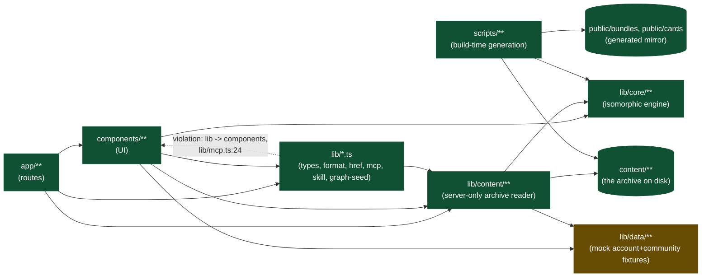

# DarkPrint — architecture

## 0 · Header

**Purpose.** This is the canonical description of DarkPrint (darkprint.io) as it exists in
this repository today: a frontend-only Next.js application whose UI is itself the
specification of a backend that has not been built. It exists so that whoever implements
that backend can read the UI's own promises — every disabled control, every seeded number,
every `◐ seeded` marker — as a contract, rather than reverse-engineering one from the
components.

**Who updates it and when.** Whoever changes a route, an entity shape, or a UI element that
implies a server interaction updates the corresponding section (and, for [8 · Backend
contract seams](architecture/seams.md), the matching `TODO(SEAM-xx)` comment in the code) in
the same change. This document does not get updated speculatively or on a schedule — see
[12 · Maintenance protocol](#12-maintenance-protocol-and-revision-log).

**Last verified against commit `fef79f2` on 2026-08-18.**

**Stack summary.** Next.js 16.2.11 (App Router, Turbopack, no Pages Router code), React
19.2.4, TypeScript 5 (`tsc --noEmit` as the type gate), Tailwind CSS v4 (CSS-first
`@theme` config in `app/globals.css`, no `tailwind.config.*` file), Vitest 4 for tests,
ESLint 9 (`eslint-config-next`). `@xyflow/react` renders the interactive graph canvas,
`animejs` 4.5 drives the hero and luminous-flow animation, `yaml` parses card/manifest
files, `opentype.js` generates the wordmark's SVG paths at build time, `@vercel/analytics`
is the only telemetry. Node >=22.18.0. No backend, no database, no auth provider — every
data source is either the `content/` archive (read at build time) or a seeded fixture in
`lib/data/**`.

**How to run locally.**

```
npm run dev          # dev server
npm run build         # prebuild regenerates public/bundles + public/cards from content/, then next build
npm run typecheck      # tsc --noEmit
npm run lint            # eslint
npm test                 # vitest run
```

`npm run build`'s `prebuild` step (`scripts/generate-bundles.ts`) rewrites `public/bundles/**`
and `public/cards/**`. Expect that diff and commit it, or run `rm -rf .next public/bundles`
first for a clean rebuild.

---

## Index

This document is split where a section's carried-over source material made it too long to
inline. Sections 2, 3, 4, 5 and 8 live in `docs/architecture/`; everything else is below.

0. [Header](#0-header) — this section
1. [The product in one page](#1-the-product-in-one-page)
2. [Domain glossary](architecture/glossary.md)
3. [Concept model](architecture/concept-model.md)
4. [Sitemap and routing](architecture/routes.md)
5. [User journeys](architecture/journeys.md)
6. [Frontend architecture](#6-frontend-architecture)
7. [State and data flow](#7-state-and-data-flow)
8. [Backend contract seams](architecture/seams.md)
9. [Design system](#9-design-system)
10. [Cross-cutting](#10-cross-cutting)
11. [Known gaps and decisions](#11-known-gaps-and-decisions)
12. [Maintenance protocol and revision log](#12-maintenance-protocol-and-revision-log)

---

## 1 · The product in one page

DarkPrint's own claim, verbatim and load-bearing (`components/hero/Wordmark.tsx:105`,
mirrored in the default page title, `app/layout.tsx:39`):

> **Reusable blueprints for agent workflows.**

**What it offers.** A public registry of *blueprints* — graphs of automations described as
a DOT topology plus versioned *node cards* — that a reader can browse, inspect down to the
YAML and DOT bytes, statically score (autonomy, static risk exposure, phase coverage), and
download. A companion vocabulary (*ontology*) gives every card's type, tools and risk
markers a shared, versioned meaning. Nothing on the site runs a blueprint: DarkPrint
distributes files and reads them back; composing and running both happen on the reader's
own machine, with their own harness (D-03, `OWNER-STATED`, `CONFIRMED` — no runner exists
anywhere in `lib/`).

**To whom.** The landing's "two ways in" band and the six client configs on `/mcp` and
`/skill` (Claude Code, Codex, Claude Desktop, Cursor, VS Code, Gemini CLI,
`components/mcp/clients.ts:16`) name the audience directly: people who already run a coding
agent or harness and want a reproducible, inspectable unit of work to hand it, rather than
a one-off prompt.

**The core value loop**, read off the landing's own five beats (`app/page.tsx:113-131`,
docblock at `:1-111`) and the lifecycle panel that closes the page
(`components/home/SectionLifecycle.tsx`):

1. **Claim** (Hero) — reusable blueprints, not prompts, are the artefact.
2. **Reproducibility argument** (`SectionSameRun`) — a blueprint pins the steps a harness
   takes, so a rerun is the same run and a change is attributable; a prompt lets the harness
   invent its own route, so nothing about it can be held constant
   (`docs/DECISIONS.md` D-04, `OWNER-STATED`, `CONFIRMED`).
3. **The blueprint itself** (`SectionBlueprint`) — a DOT graph of nodes, each a pointer at a
   card, drawn off a real archived bundle.
4. **The node card** (`SectionNodeIsCard`) — one reusable, versioned unit of work, drawn off
   a real archived card.
5. **What a reader does with it** (`SectionLifecycle`) — download it, compose it into
   something bigger, or upload it for the analyzer to read; the panel links each action to
   its page (`/blueprints`, `/build`, `/upload`).

The page ends there — on the lifecycle panel's own links — rather than on a separate
"find one / build one" doors section, which the author had cut as a redundant second
statement of the same two-way choice (`app/page.tsx:56-68`).

**Where the landing and the rest of the site agree, and where they used to disagree.** They
agree today. D-01 (`OWNER-STATED`, `CONFIRMED`, `docs/superpowers/specs/2026-08-04-ia-redesign.md:12-15`)
settles that blueprints, not "the dark factory," are the headline, and D-02 (same
provenance) settles "dark factory" as a *computed property* of one graph shape — every node
unattended and all five phases covered — never the site's category or its goal. The current
build matches both: `/towards-a-dark-factory` is one explainer page reached from the Learn
menu, not a nav-level category, and `isDarkFactory` never appears as a headline number
anywhere (`lib/core/analysis/autonomy.ts:317`). This *was* a real, recorded disagreement:
D-09 records the site's headline once being "Autonomy you can read as a graph"
(`commit feaa9bc`), later retired from every on-site surface in favour of the current claim
(D-09 is marked `CONTRADICTED` — i.e., superseded — in the decision ledger, and the phrase
survives only in the repository's root `README.md:4`, which is project documentation, not
UI copy a visitor reads). No other landing-vs-site claim conflict was found: the six landing
beats, the Learn sequence, and every route's own `generateMetadata` describe the same three
primitives (blueprint, node card, ontology) throughout.

---

## 6 · Frontend architecture

### 6.1 · Layer model

Eight layers, lowest to highest. Import directions were verified by grep, not assumed from
naming.

| Layer | What it is | May import from |
|---|---|---|
| `lib/core/**` | The isomorphic domain engine: DOT parsing, card/ontology validation, autonomy and security analysis, hashing, version-bump checking. Verified clean — zero occurrences of `node:*`, `Buffer`, `Date.now()` or `Math.random()` outside test files, confirming `CLAUDE.md`'s isomorphism rule against the actual code rather than trusting the doc | nothing else in the app |
| `lib/data/**` | Seeded/mock fixtures — authors, accounts, community signals, owned bundles. Each file's own header states it exists because there is no backend yet (`lib/data/community.ts:1-9`: "this module *is* the database... until there is a real one") | sibling `lib/data/*` files, `lib/types.ts` only |
| `content/**` | The archive on disk: `blueprints/<slug>/blueprint.dot` + `blueprint.yaml`, `cards/<id>@<version>.yaml`, `ontology/extensions.yaml`. Not code; read by `lib/content/read.ts` via `readFileSync`/`readdirSync` | — |
| `lib/content/**` | The server-only archive reader/aggregator. `read.ts` is the one file in the repo touching the filesystem and self-guards with a runtime throw if `typeof window !== "undefined"` (`lib/content/read.ts:49-52`). Two sibling files, `ontology-file.ts` and `bundle-export.ts`, are isomorphic (no `node:fs`) and are the only parts of `lib/content` imported by client components | `lib/core`, `lib/data`, top-level `lib/*.ts` |
| `lib/*.ts` (top-level) | Mixed utility layer: `types.ts`, `format.ts`, `href.ts`, `mcp.ts`, `skill.ts`, `criteria-state.ts`, `graph-seed.ts`. Not strictly isomorphic as a group — `graph-seed.ts` imports `layeredLayout` from `lib/content/layout` | `lib/core`, `lib/content` (the isomorphic parts) |
| `components/**` | UI, organised as one `ui/` primitives folder plus 22 feature folders (below) | `lib/core`, `lib/content` (server components only), `lib/data`, top-level `lib/*` |
| `app/**` | Routes. All spot-checked pages are server components (no `"use client"`) | `components/**`, `lib/**` |
| `public/bundles/**`, `public/cards/**` | Generated static mirror of `content/`, written by `scripts/generate-bundles.ts` at the `prebuild` step | — |

**One documented layering violation.** `lib/mcp.ts:24` imports `MCP_CLIENTS` from
`@/components/mcp/clients` — a top-level `lib/*.ts` file importing from `components/`,
inverting the `lib → components` direction the rest of the layer table holds. The file's
own comment (`lib/mcp.ts:12-21`) states this is deliberate: deriving the landing's one-line
command from the same array `/mcp`'s tab strip renders keeps "exactly one place to change
it," and `mcp.test.ts` pins `MCP_CLIENTS[0]` being Claude Code so a silent reorder is
caught. No cycle results (`components/mcp/clients.ts` does not import back), so it is a
one-way, tested inversion rather than a defect — flagged here because a clean-layering rule
should note its one exception rather than imply there are none.

No other violations were found: no `components/` → `app/` import in shipped code (only in
test files that mount a page component for integration testing, e.g.
`components/site/honesty.test.ts:38-41`), no `lib/core` import of anything outside
`lib/core`, and no `lib/data` import of `lib/core` or `lib/content`.

Legend: green = `LIVE` (real data/behaviour), amber = `MOCK` (fixture-backed), grey/dashed =
`PLANNED` (shape declared, nothing behind it) — the same three tags used throughout this
document (see [4 · Sitemap and routing](architecture/routes.md#status-tags)). The dashed
edge is the layering violation noted above, not a status.



### 6.2 · Directory tree

**`app/`** — routes (App Router; every spot-checked page is a server component):

| Path | Purpose |
|---|---|
| `page.tsx`, `layout.tsx`, `globals.css`, `icon.svg` | Home page, root layout (fonts, header/footer chrome, skip link, `Analytics`), design tokens, favicon |
| `blueprints/`, `blueprints/[slug]/` | Blueprint gallery and detail page |
| `build/` | The `/build` interactive workspace (starter template + three controls) |
| `mcp/` | MCP client install/registry design-proposal page |
| `nodes/`, `nodes/[...id]/` | Node/card browser and detail |
| `ontology/`, `ontology/[...term]/` | Ontology term browser and detail |
| `reading-the-radar/` | Scorecard explainer |
| `settings/` | Account settings page (mostly disabled controls) |
| `skill/` | Claude Code skill install page |
| `spec/topology/`, `spec/card/`, `spec/ontology/` | The three format layer pages |
| `towards-a-dark-factory/` | Long-form explainer / the 1-5 maturity ladder |
| `u/[username]/`, `.../blueprints/`, `.../cards/`, `.../saved/`, `.../terms/` | Public profile and its four tabs |
| `upload/` | Bundle upload/validation wizard |
| `what-a-blueprint-is/` | Learn stop 00, the door to the three layer pages |

**`components/`** — UI, one primitives folder plus 22 feature folders:

| Folder | Purpose |
|---|---|
| `ui/` | Generic design-system primitives — 34 files (buttons, badges, meters, pills, cards, rails, diagnostics list, etc.); the largest and most reused folder |
| `blueprint/` | Blueprint detail-page UI: canvas, requirements, evidence layers, comments, fork/clone/download actions |
| `bundle/` | Bundle file tree, header, version history, the `load.ts` view-model builder |
| `build/` | The `/build` workspace: state machine, score panel, choice graph pane, vocabulary pane, download step |
| `explain/` | Concept-explainer figures and run-layer diagrams used on explainer pages |
| `gallery/` | The blueprint gallery browser (single file) |
| `graph/` | DOT/flow graph rendering primitives shared by every canvas |
| `hero/` | The landing hero: wordmark animation, setup chips, grid spotlight |
| `home/` | Landing-page sections (lifecycle, blueprint, node-card beats) and their supporting geometry/data |
| `learn/` | The Learn-shell rail and figures shared across the Learn sequence |
| `mcp/` | MCP client config data and install-tabs UI |
| `nodes/` | Node/card browser, summary, interfaces, version history |
| `ontology/` | Ontology term table/tree/catalog/vocabulary browser |
| `panes/` | The multi-pane layout system (graph pane, source pane, DOT breakdown, synchronized panes) used by `/build` and blueprint detail |
| `profile/` | Profile shell, tabs, owned bundles/cards, pinned/saved lists, `load.ts` |
| `settings/` | Settings form fields and controls |
| `site/` | Global chrome: header, footer, logo |
| `skill/` | Skill-install setup UI |
| `spec/` | Spec-page tables, rows, scoring-model figure |
| `upload/` | Upload flow, dropzone, validation report |
| `viz/` | The shared SVG "luminous flow" drawing system: scenes, tokens, easing, reveal/scroll hooks |
| `mcp/`, `skill/` | (listed above) |

**`lib/`**:

| Folder / file | Purpose |
|---|---|
| `core/` | The isomorphic engine — `analysis/` (autonomy, security, phase-coverage), `archive/` (registry, store), `attractor/` (emit, lint), `bundle/` (resolve, types), `card/` (parse, schema, validate), `dot/` (lexer, parser, graph), `hash/`, `ontology/`, `version/`, plus `config.ts`, `diagnostics.ts`, `index.ts` (the barrel — an explicit inventory of the engine's public surface) |
| `content/` | Server-only archive reader/aggregator — `read.ts` (fs reader, guarded), `index.ts` (build-time cache), `view.ts` (blueprint view model), plus the two isomorphic files `bundle-export.ts` and `ontology-file.ts` |
| `data/` | Mock/seed fixtures — `account.ts`, `bundles.ts`, `community.ts`, `node-community.ts`, `profiles.ts`, `users.ts` |
| `starter/` | The `/build` variant engine — `variants.ts` (pure, deterministic: three choices in, one `Bundle` out) and `cards.ts` |
| `types.ts`, `format.ts`, `href.ts`, `mcp.ts`, `skill.ts`, `criteria-state.ts`, `graph-seed.ts` | Shared domain types and small utilities |
| `db/` | **Backend, LIVE.** Postgres via Drizzle — `schema.ts` (10 tables: `account`, `handle_reservation`, `ontology_version`, `ontology_term`, `bundle`, `release`, `card_version`, `target`, `target_actor`, `audit`), `migrations/` with paired up/down SQL, `migrate.ts` + `cli.ts` (the runner behind `npm run db:migrate` / `db:rollback`), `client.ts`, and `storage.ts` (the S3-compatible object client, keyed by digest). Merged at `ec516fa`, tagged `t000-verified` |
| `server/auth/` | **Backend, LIVE.** GitHub OAuth — `github.ts` (the provider exchange), `oauth-state.ts`, `cookie.ts` (HMAC-signed), `session.ts` (`SessionToken` is signed and carries `exp`; `SessionPayload` is what a handler receives and carries `{ accountId, handle }` only), `guard.ts` (`withSession`). Expiry, **not** revocation: a stolen cookie stays valid until `exp` |
| `server/http/` | **Backend, LIVE.** The response envelope of B-03 — `ok.ts` for payloads at 200, `problem.ts` for RFC 9457 `application/problem+json` |
| `server/archive/` | **Backend, LIVE.** Bundle records and their append-only releases — `bundle.ts`, `release.ts`, `well-formed.ts` (an iterative, path-scoped walk that refuses content Postgres would silently rewrite), `constraints.ts` (index names derived from the schema at runtime, never restated), `errors.ts`. Merged at `3fd050f`, tagged `t010-verified` |
| `server/cards/` | **Backend, LIVE.** One immutable row per `(cardId, version)` with its digest, owner and visibility. Reads take an `Actor` and filter through `server/policy`, so a private card is unreadable by anyone but its owner and an operator at the storage boundary rather than by caller convention. `addCard` requires a strict semver — narrower than `REF_VERSION`, because `compareSemver` cannot order `1.0` and "latest" must always be defined. Merged at `aee6e07`, tagged `t020-verified` |
| `server/versioning/` | **Backend, LIVE.** Server-authoritative bump inference for blueprints and ontologies (`lib/core` already carried the card path) — `blueprint-bump.ts`, `ontology-bump.ts`, `declared-bump.ts`. An ambiguous pairing infers the **most expensive residue-free explanation**, never the cheapest, so an under-declared bump is refused rather than shipped. Merged at `87dffd8`, tagged `t025-verified` |
| `server/policy/` | **Backend, LIVE.** The authorization decision — `can.ts`, `visible-to.ts`, `is-owner.ts`. Pure, zero runtime imports, never throws, no default-allow. Two subjects only: a resource's owner and a break-glass operator (B-13). Merged at `eef7cce`, tagged `t060-verified` |
| `server/ontology/` | **Backend, LIVE.** The published vocabulary and its versions — `store.ts` (publish/read a version), `view.ts` (`openView`, the read model a page or route consumes), `bump.ts`, `errors.ts`. Versions are immutable: a republish of an existing semver is refused with `DuplicateOntologyVersionError` rather than overwriting, and a declared bump smaller than the terms require is refused with `VersionBumpTooSmallError`. Merged at `1f9a9d0`, tagged `t030-verified` |
| `server/registry/` | **Backend, LIVE.** The cross-store read model the `/api` routes are served from — one query layer over `server/cards`, `server/archive` and `server/ontology`, taking an `Actor` and filtering every row through `server/policy` so visibility is decided once at the storage boundary rather than per route. **The first module any route actually calls**, which is the condition §12's revision log named for re-reading the seams. Merged at `8656c32`, tagged `t080-verified` |
| `server/export/` | **Backend, LIVE.** Distribution — turning a stored release back into the files an agent runs. `export-release.ts` (the folder as bytes), `serve-file.ts` / `serve-card.ts` (one file at a time), `build.ts`, `lookup.ts`, `vocabulary.ts`, `content-type.ts`, `downloads.ts`, `errors.ts`. Every input comes from Postgres — `release.dot`, `release.manifest`, `card_version.source`, `release.local_vocabulary` — so this module touches object storage nowhere (D-90-07). `ExportReadError` is a **sibling** of `ExportError`, not a subclass, so a read failure and a caller error cannot be told apart by a single `instanceof` that catches both. Merged at `6d746ff`, tagged `t090-verified` |
| `server/naming/` | **Backend, LIVE.** Every user-chosen identifier — handles, bundle slugs, card ids, term namespaces — and the permanence of their reservations. `handles.ts`, `slugs.ts`, `grammar.ts` (one grammar derived from the engine's `CARD_ID`, round-tripped rather than parsed, since `parseCardRef` trims and would reserve a different primary key than the one asked for), `suggest.ts`, `reserved.ts`, `constraint.ts`, `errors.ts`. A handle is **permanently reserved once used**: a released handle can never be claimed by a second account, and **can** be reclaimed by its original holder — one atomic `ON CONFLICT DO UPDATE … WHERE handle_reservation.account_id = excluded.account_id`, which never raises, so the module reads `rowCount` and refuses. Merged at `38eb820`, tagged `t070-verified` |

**Top level:**

| Path | Purpose |
|---|---|
| `content/` | The archive: `blueprints/` (9 dirs), `cards/` (57 versioned YAML files, 53 distinct ids), `ontology/extensions.yaml` |
| `public/` | Generated static mirror (`bundles/`, `cards/`, plus static assets) — rewritten by `scripts/generate-bundles.ts` at every `prebuild` |
| `scripts/` | Build-time generation: `generate-bundles.ts` (content → public), `generate-skill-refs.ts`, `generate-wordmark-paths.ts`, `measure-prose.ts` |
| `skills/darkprint/` | The vendored Claude Code authoring skill (SKILL.md, references, templates) |
| `docs/` | `ARCHITECTURE.md` (this file) and `architecture/` (its split sections), `DECISIONS.md`, `audit/` |
| `tests/` | Backend test trees that cannot sit beside the code they test, because `docs/ORCHESTRATION.md` has each backend task's tests written **blind**, in a separate worktree branched before the implementation exists — `tests/server/**` per task (`t010`, `t020`, `t025`, `t030`, `t060`, `t080` so far), `tests/support/**` for database/storage/env fixtures and the control-character constants nobody should retype. Also the repo-level guards that are nobody's task and red for everyone: `no-raw-control-bytes.test.ts`, `first-pass-calibration.test.ts`, `task-state-agreement.test.ts`, `wave-dependencies.test.ts`, `error-hygiene.test.ts` (D-13's four-part clause over every published error class, domain built by construction) and `architecture-current.test.ts` (this document against the tree). Collected by `vitest.config.ts`'s non-colocated globs |
| `backend.md` | The backend build's state store — task partition, contracts, published signatures, per-task logs. Not documentation: it is the file the parallel implementer/test-author/adversary sessions read and write |

---

## 7 · State and data flow

**No React context providers exist anywhere in the codebase** (zero `createContext` calls).
Every state slice below is module-scope (build time), `useSyncExternalStore` against a
browser API, or a plain component-local `useState` — no `useReducer` usage was found
either.

| State slice | Owner | Lifetime | Persisted? | Replaced by what once the backend exists |
|---|---|---|---|---|
| Registry filters/sort/search (`/nodes`, `/blueprints`, `/ontology`) | `components/ui/useQueryState.ts` (`useSyncExternalStore` over `window.location.search`) | Per browser tab; survives Back/Forward | URL query string, via `history.replaceState` | No change needed — URL-as-state stays; a backend adds server-side filtering behind the same params |
| Search-box draft (typed, not yet committed) | `NodeBrowser.tsx:303`, `GalleryBrowser.tsx:102` | Per render tree, 250ms debounce into the URL | none | N/A, UX debounce artifact |
| Scroll-spy "which type group is visible" | `NodeBrowser.tsx:541` | Per render tree | none | N/A, cosmetic |
| Favorites/bookmarks | `components/ui/FavoriteStar.tsx` (`useSyncExternalStore` over `localStorage`) | Per browser, survives reloads, never syncs across devices | `localStorage["darkprint:favorites"]` | An account-scoped `save` row keyed on `(account, target)` — see the "two disjoint save sets" note below |
| "Saved" list (5-row fixture) | `lib/data/bundles.ts:554` `SAVES`, via `components/profile/load.ts:116,126` | Build time only, identical for every visitor | none — not real per-user data | An account-scoped API read of a real bookmarks table |
| `/upload` wizard step, kind, files, manifest form, "submitted" flag | `components/upload/UploadFlow.tsx:544-548`, plain `useState` | Per mount of `UploadFlow` | none — files never leave the tab (`UploadFlow.tsx:1001-1006`) | A server-persisted upload/draft session, if resumability across reloads is ever wanted |
| `/upload` derived validation, autonomy/risk scores, ontology view | `UploadFlow.tsx:552-569`, `useMemo` over the above | Recomputed per render | none | The client-side re-validation stays even with a backend; the server adds its own authoritative pass at publish time |
| `/build` workspace controls (output, approval, iteration cap) | `components/build/BuildWorkspace.tsx:171`, `useState<StarterChoices>` | Per mount | none | Only relevant if "save my starter config" ever becomes a feature — a small per-account preference row |
| `/build` "which tab changed" badge marks, derived bundle/download files | `BuildWorkspace.tsx:172,174` | Per mount, recomputed from choices | none — files generated as `data:` URLs in-tab | A real `bundle_release` write only if "download" becomes "publish a starter" |
| Graph/pane node selection (`/build`, blueprint detail, `/upload` step 3) | `WorkspaceStage.tsx:193,201`, `SynchronisedPanes.tsx:82`, `ValidationReport.tsx:144` | Per mount | none | N/A — view state, no backend equivalent needed |
| Settings page live preview (display name, bio, avatar hue) | `components/settings/ProfileFields.tsx:52-54` | Per mount, resets on reload by design | none by design (`ProfileFields.tsx:18-19`) | An account profile `PATCH` endpoint; every other `/settings` field stays `disabled` until then |
| "Signed-in account" | `lib/data/account.ts:77` `ACCOUNT`, a single module-scope constant | Build time, identical for every request | none — a fixture, not a session | A real server session/auth cookie. The "owner" view today is a plain string comparison (`components/profile/load.ts:78`), not a stored session |
| Owned bundles/drafts/lineage/drift | `lib/data/bundles.ts:177` `OWNED_BUNDLES` | Build time | none | A real per-account bundles table (drafts, publish history, fork lineage) |
| Community notes/comments, node/community star counts | `lib/data/community.ts`, `lib/data/node-community.ts` | Build time | none | A comments/votes table with real authorship and POST endpoints |
| Comments "load more" reveal | `Comments.tsx:87` | Per mount | none | N/A, pagination-disclosure UI over static seed data |
| Build-time archive read and derived index (blueprints, cards, digests, registry, shared `OntologyView`) | `lib/content/read.ts:135,137`, `lib/content/index.ts:54` (lazy module-scope caches) | Build time only, one Node process | filesystem, under `content/` | A real database read behind the same `readContent()`-shaped API — the module already documents itself as "SERVER ONLY, BUILD TIME ONLY" and throws if bundled for the browser (`read.ts:8-13,49-53`) |
| Assorted disclosure/tab/copy-flash UI state (`ForkAction.tsx:52`, `DotBreakdown.tsx:333`, `CopyButton.tsx:51`, `SiteHeader.tsx:192-193`, `InstallTabs.tsx:10`, `BundleDropzone.tsx:424-427`, etc.) | Various, per component | Per mount/render | none | N/A, purely cosmetic — no backend implication |

**Two things worth flagging.**

1. **Two disjoint "save" stores exist for one concept, and the code says so three times**
   (`lib/data/bundles.ts:551-552`, `components/bundle/BundleHeader.tsx:25`,
   `components/profile/SavedList.tsx:15-20`). `FavoriteStar` writes to
   `localStorage["darkprint:favorites"]`; the profile's Saved tab renders the unrelated
   5-row `SAVES` fixture. A favorite starred on a card page never appears in the same
   reader's own Saved tab. A real backend needs to unify these into one bookmarks table
   before that tab can honestly reflect what a reader starred elsewhere — see also TBD-4 in
   [8 · Backend contract seams](architecture/seams.md).
2. **`/settings`' `ProfileFields.tsx` states its own state-management rule in its docblock**:
   a control is live `useState` only if its effect is local and immediate (the
   avatar/bio/name preview); anything whose only effect would be persistence is rendered
   `readOnly`/`disabled` instead of wired to fake state. Worth preserving as a principle
   when the backend lands, rather than wiring every field to `useState` reflexively.

---

## 9 · Design system

### 9.1 · Tokens

Source of truth: `app/globals.css` (Tailwind v4, CSS-first — no `tailwind.config.*` file;
`postcss.config.mjs` only wires `@tailwindcss/postcss`). Tokens live in three `@theme`
blocks: a tree-shaken `@theme { }` (colors/spacing/type, `:45-160`), a `@theme static { }`
that Tailwind must never tree-shake because it's consumed from inline styles and anime.js
rather than utility scanning (durations, `--color-key`, `--color-warn`, `:171-201`), and a
`@theme inline { }` wiring the three `next/font` variables (`:203-207`).

**Color semantics**, stated verbatim in the CSS comments and confirmed independently in
`components/viz/tokens.ts:44-71`: **cyan is interactive, violet is where a person acts,
emerald is a figure read off the engine, signal is a defect.** `amber` is reserved for
exactly two jobs sitewide — `ComingSoonBadge` ("not built yet") and `.route-box`/
`.route-label` ("this box leaves the page") — and nothing else may use it
(`components/ui/ComingSoonBadge.tsx:1`, `app/globals.css:378-411`). A separate, deliberately
duller `--color-warn` exists precisely so a real warning can't be confused with the amber
"not built" signal. Three color "poles": dark/factory (`--color-void`, `--color-surface*`),
blueprint/cyanotype (`--color-blueprint*`), and copper (`--color-copper*`, reserved
exclusively for the node-card figure, never conflated with amber despite both reading as
"orange").

**Spacing** is a documented seven-tier vertical scale (`globals.css:9-24`): `inline` 8px,
`tight` 12px, `element` 16px, `card` 20px, `block` 40px, `section` 64px, `band` 80-112px —
with four banned values stated explicitly (48, 56, 32, 96). Verified against actual usage:
broadly followed, but **not fully enforced** — live counter-examples include
`components/home/SectionLevels.tsx:703,717` (`mt-8`, `gap-14`),
`components/home/SectionLifecycle.tsx:221` (`mt-8`, with its own comment acknowledging
it's "the mock's 32px"), `components/hero/Wordmark.tsx:541`, `components/profile/ProfileShell.tsx:57`,
`components/site/SiteFooter.tsx:99` (both `py-12`).

**Horizontal width has exactly one narrowing token**: `--measure: 36rem` via `.prose-lane`
(`globals.css:139,531-533`), governing **body prose only** — not figures, tables, code
panes, or a `SectionHeading` lead, per two explicit author rulings quoted in
`components/ui/SectionHeading.tsx:84-86`. `.container-page` (1200px, 38 files) caps overall
page width. Plain `max-w-*` utilities still appear at 45+ call sites for narrow one-off
elements outside the prose/heading system (e.g. `Wordmark.tsx:515`'s `max-w-2xl` on the
claim line).

**Radii**: a four-step ladder (`sm` 5px chips/code, `md` 8px buttons/inputs, `lg` 12px
panels/cards, `xl` 18px full-bleed sheets); bare `rounded` is pinned to `sm` rather than
Tailwind's default, and `2xl`+ are disabled outright (`globals.css:116-134`).

**Typography**: three fonts (Geist Sans, JetBrains Mono, Space Grotesk) plus three
code-enforced "mono tiers" — `.eyebrow` (11px), `.label-lead` (14px), `.label` (11px,
`globals.css:446-487`) — with an explicit floor: "11px is the absolute floor and there are
no exceptions."

**Motion tokens** (`@theme static`): `--ease-out` ("THE default curve, everywhere"),
`--ease-in-out`, durations from `--dur-press` 120ms to `--dur-reveal` 520ms, mirrored for
anime.js as `MOTION` in `components/viz/tokens.ts:219-236`.

**Z-index** is a fixed five-rung ladder (header 50 → card hit target 10), documented rather
than tokenized (`globals.css:32-42`): "nothing inside a card may exceed 20."

### 9.2 · Component inventory

**Primitives** — `components/ui/**`, 34 files: buttons/links (`Button.tsx`), badges/pills
(`Badge.tsx`, `TagPill.tsx`, `MetaPill.tsx`, `ComingSoonBadge.tsx`), cards/rows
(`ContentCard.tsx`, `ContentRow.tsx`), the diagnostics/severity system
(`DiagnosticList.tsx`, `severity.ts`), meters/scoring (`AutonomyMeter.tsx`,
`MetricBars.tsx`, `ScoreRadar.tsx`, `PhaseCoverage.tsx`), the shared filter bar
(`RegistryFilterBar.tsx`), textures (`GridBand.tsx`, `GridPaper.tsx`), the copy-to-clipboard
control (`CopyButton.tsx`), the favorite toggle (`FavoriteStar.tsx`), the display-type
scale (`SectionHeading.tsx`), and supporting non-component modules (`useQueryState.ts`,
`visible-text.ts`, `severity.ts`, `menu-group.ts`).

**Composed** — 22 feature folders, each built from the primitives above for one part of the
product: `blueprint/` (9 files), `bundle/` (6), `build/` (12), `gallery/` (1), `graph/` (7),
`hero/` (5), `home/` (20, the largest composed folder), `nodes/` (4), `ontology/` (4),
`panes/` (11), `profile/` (10), `settings/` (2), `site/` (3), `spec/` (6), `upload/` (4),
`viz/` (11 — infrastructure other folders draw scenes with, not primitives in the `ui/`
sense), `explain/` (5), `learn/` (2), `mcp/` (2), `skill/` (1).

### 9.3 · Animation conventions

`animejs` is imported directly in exactly three files: `components/hero/Wordmark.tsx`,
`components/viz/useLuminousFlow.ts`, `components/viz/easing.ts`. Everything else animated
goes through the two hooks below or plain CSS.

- **`components/viz/easing.ts:35-48`** documents a real gotcha: anime.js 4.5.0 removed its
  string-form `cubicBezier(...)` parser, so handing the CSS token `MOTION.easeOut` directly
  to anime.js silently becomes linear. `easing.ts` re-derives an actual `cubicBezier()`
  function from the same control points, kept separate from `viz/tokens.ts` so that file
  stays import-free of the anime.js engine (a render-safe barrel for server components).
- **The hero wordmark** (`components/hero/Wordmark.tsx`) draws in over four timed beats: each
  letter outlines via `svg.createDrawable` then cross-fades into real DOM text, a `FlowEdge`
  rule draws under the name, the mark "settles" with an anime.js `spring()` overshoot, and a
  single brightness sweep passes across the letters. Gated by `useReveal`'s `static` phase,
  which always renders the finished heading under SSR/no-JS/reduced-motion.
- **`useLuminousFlow`** is the one hook driving every "luminous flow" SVG scene sitewide
  (graphs, node figures) — nodes fade in, edges draw via `svg.createDrawable`, a looping
  travelling pulse runs on a `strokeDashoffset` normalized so duration is length-independent,
  using a seeded PRNG (not `Math.random()`) to avoid SSR/hydration mismatches. A second
  `IntersectionObserver` pauses off-screen loops purely to save main-thread repaint cost.

**The scroll-driven mechanism, concretely.** `components/viz/useReveal.ts` is, in its own
words, "the single place this site decides whether anything moves" — a three-phase state
machine (`static` / `armed` / `shown`) driven by one `matchMedia("(prefers-reduced-motion:
reduce)")` listener and one non-repeating `IntersectionObserver` (default `threshold:
0.25`, `rootMargin: "0px 0px -12% 0px"`). `components/viz/useScrollProgress.ts` is the
second primitive — a 0..1 pin-travel fraction for sticky-scrubbed sections (e.g. the
node-card walk), computed via `requestAnimationFrame`-throttled `getBoundingClientRect()`
reads, deliberately reusing `useReveal`'s single motion-preference check rather than adding
a second `matchMedia`. When motion is gated off it returns `progress: 1` (the finished
state), so a reduced-motion reader sees every annotation attached at once rather than none.
Global CSS respects the same preference: `scroll-behavior: auto` under
`prefers-reduced-motion: reduce`, and two pure-CSS keyframe animations exist only inside a
`prefers-reduced-motion: no-preference` block (`globals.css:578-653`).

### 9.4 · Rules for a new page to look native

1. Spacing lands on one of the seven named tiers (§9.1); the four banned values are 48, 56,
   32, 96.
2. Body prose is the only thing `.prose-lane`/`--measure` narrows; headings, leads, figures,
   tables and code panes run the container's width.
3. The z-index ladder has five fixed rungs — pick one, don't invent a number; nothing inside
   a card exceeds 20.
4. Radii are the four-step ladder; `rounded` is `sm`, not Tailwind's default.
5. Color semantics are fixed and may not be reassigned — cyan/violet/emerald/signal/amber as
   above.
6. Mono type has exactly three tiers and none is a heading level: "a mono uppercase run is a
   LABEL... if it needs to appear in the document outline it is a `PanelHeading`."
7. Motion is gated in exactly one place (`useMotionAllowed`/`useReveal`); a new
   animated component renders its finished, accessible state under SSR/no-JS/reduced-motion
   rather than starting hidden, and should route through `useReveal`/`useLuminousFlow`/
   `useScrollProgress` rather than adding a second `matchMedia`/`IntersectionObserver`.
8. Hover states are gated behind the `hoverable` custom variant
   (`@media (hover: hover) and (pointer: fine)`) — "a touch pointer has no leave."
9. Panels use `.panel`/`.panel-lead` rather than ad hoc `bg-surface`/`border` combinations,
   and at most one `.panel-lead` per page ("two leads is no lead").

**Divergence from a prior working note.** An earlier project memory recorded "text runs
full width — no max-w, no prose-lane" as an absolute rule. The current code does not match
that description: `.prose-lane`/`--measure` is a real, actively used token system (~15
direct consumers) governing body prose specifically, and `.container-page` caps overall
page width at 1200px. Per this repository's own rule that code wins over a stale note, §9.4
above states the rule as the code actually enforces it today; the note is being corrected
in the assistant's memory as part of this session.

---

## 10 · Cross-cutting

### 10.1 · Metadata and SEO, including JSON-LD

`LIVE` (partial). `app/layout.tsx:36-57` sets global defaults — `metadataBase`, a title
template (`"%s · DarkPrint"`), description, keywords, and a partial `openGraph` block
(title/description/type only, no `images`, no `twitter` card, no `viewport`/`themeColor`
export anywhere). 9 dynamic routes export their own minimal `generateMetadata` (`{ title,
description }` with a `"X not found"` fallback, e.g. `app/blueprints/[slug]/page.tsx:60-67`);
14 static routes export `metadata` directly, same shape. The homepage (`app/page.tsx`) has
no metadata of its own by design, so it inherits the root default and the hero's claim is
the indexable one (`app/layout.tsx:26-35`). `PLANNED`/absent: no `canonical`/`alternates`,
no JSON-LD anywhere in the codebase, and no `app/sitemap.ts` or `app/robots.ts` (no shell
file exists for either — not even a stub).

### 10.2 · Accessibility

`LIVE`. One skip link (`app/layout.tsx:76-81`, WCAG 2.4.1, justified in-comment by the
header's ~10 links plus every hero graph node being a focus stop). 120 files carry `aria-*`
attributes, 41 use `sr-only`, and real ARIA roles are used purposefully (`role="search"`,
`role="status"` live region, `role="switch"` + `aria-checked`, `role="img"`/`role="region"`
with accessible names). A centrally enforced rule — glyph *and* word both carry meaning,
colour is decoration — lives in `components/ui/severity.ts:1-19` after a real regression
(a diagnostic once shipped `aria-hidden` glyph with no text), enforced by
`components/blueprint/severity-word.test.ts` across all nine archive bundles. Two
accessibility properties CLAUDE.md names are `LIVE`-tested under other file names: contrast
(`components/viz/flow.test.ts:520-650`, full WCAG relative-luminance math against real hex
values pulled from `app/globals.css`, not hardcoded) and label overlap
(`components/panes/archive-labels.test.ts`, measures every archive blueprint's rendered
graph at 7 widths and asserts nothing collides).

### 10.3 · Responsive breakpoints

`LIVE`. No custom breakpoints — Tailwind's stock `sm`/`md`/`lg`/`xl`/`2xl`, mobile-first.
Usage skews toward `sm:` (65 files) and `lg:` (43); `2xl:` is nearly unused (1 file). A
custom `hoverable` variant (`@media (hover: hover) and (pointer: fine)`,
`globals.css:215`) gates hover-only affordances separately from width. `prefers-reduced-motion`
is respected globally (§9.3).

### 10.4 · Error handling

`PLANNED`/absent for framework-level boundaries, `LIVE` for content-level handling. No
`error.tsx`, `not-found.tsx`, `global-error.tsx` or `loading.tsx` exists anywhere under
`app/` — not even a stub — so the app falls back entirely to Next.js's built-in default
404/500 pages (the `/_not-found` and `/_global-error` rows in
[4 · Sitemap and routing](architecture/routes.md) are framework defaults for exactly this
reason). `notFound()` is used consistently across every dynamic route, each paired with
`dynamicParams = false` so an unknown slug/id is a build-time 404, not a runtime lookup.
The engine's own `Diagnostic[]` (error/warning/info) is fully `LIVE`-surfaced:
`components/ui/DiagnosticList.tsx` renders it in two places, and on `/upload`
`components/upload/ValidationReport.tsx:266-279` prints a plain-language verdict sentence
*above* the raw diagnostic list — parse failure, unfinished bundle ("not a defect"), or
resolved-with-errors — a deliberate fix so a reader isn't left to infer the verdict from five
red rows.

### 10.5 · Loading and empty states

`LIVE` for empty states, absent for loading. No `loading.tsx`/Suspense boundary exists
anywhere. A single shared `EmptyState` component (`components/profile/parts.tsx:180-198`)
renders five distinct, real copy strings across the profile tabs ("Nothing published yet",
"Saves are private", "No published blueprints", "No node cards", "No terms under this
handle" — each with its own action link). The validator has its own separate empty state
("No problems found, the validator had nothing to say about this bundle",
`components/ui/DiagnosticList.tsx:79-88`).

### 10.6 · Analytics

`LIVE`, pageviews only. `@vercel/analytics` (`package.json:21`) is mounted once, globally,
as the last child of `<body>` (`app/layout.tsx:3,96`). The adjacent comment
(`:91-95`) states the scope explicitly: page-view counting only, no-ops outside a Vercel
deployment, and distinct from the unbuilt blueprint-run telemetry of SEAM-84/85. No custom
`track()` calls exist anywhere in the codebase.

---

## 11 · Known gaps and decisions

### 11.1 · Deliberate shortcuts

Recorded in the code as intentional, not accidental:

- **`lib/core/**` is fully built and real** — autonomy, static risk exposure, phase
  coverage and every digest are genuinely computed, at build time for the archive and
  in-tab for `/upload` and `/build`. The gap is entirely in the write plane: nothing in the
  UI can *submit* a vote, a run, a publish, or a session, and every such control says so in
  place rather than pretending.
- **Community and account data is deliberately seeded, not deleted or half-built.** Each
  `lib/data/**` file states outright, in its own header comment, that it stands in for a
  table that doesn't exist yet (e.g. `lib/data/community.ts:1-9`).
- **The read/write split (`docs/architecture/seams.md` §5.2 in Phase 2A's own analysis)
  means the read plane — 22 of 113 seams — could be built first, behind the same URLs the
  pages already consume, without moving a single page component's data shape.**

### 11.2 · Open `TBD:` questions

Per this document's grounding rule, a `PENDING-OWNER-REVIEW` row in `docs/DECISIONS.md`
becomes a question here, never a statement. The full sets already live in the split
documents rather than being repeated:

- [3 · Concept model](architecture/concept-model.md#open-tbd-questions-in-this-document) —
  9 questions about entity shape (`DotAttrs` persistence, draft digest typing, comment
  polymorphism, download/support counting grain, release versioning, card/term privacy,
  ownership transfer, term-usage indexing, ontology overlay versioning).
- [8 · Backend contract seams](architecture/seams.md#open-tbd-questions-in-this-document) —
  4 questions about the write plane (object-storage vs. Git as the archive backend,
  "create" vs. "add a release" semantics for publishing, slug uniqueness scope, and
  whether `localStorage` favorites migrate into a real account on launch).
- [4 · Sitemap and routing](architecture/routes.md#orphan-routes) — 1 question: which file
  is the canonical audit deliverable, since `docs/audit/CHANGELOG.md` (named by this
  document's own instructions, see §11.3) exists in no commit.

Two structural gaps outside those documents, worth stating plainly here: **who is allowed to
grant the `validator` badge** (`Account.validatorWeight` exists and is seeded, but nothing
in the code proposes a granting process — `app/settings/page.tsx:47-52`), and **whether the
16 product policies `docs/DECISIONS.md` D-58 lists as deliberately open (publishability,
fork identity, blueprint versioning, privacy, trust signals, run normalisation, ontology
governance, the MCP retrieval contract, licensing, malicious-bundle boundaries, account
roles, event semantics, ranking, moderation, retention, the star service)** are meant to be
resolved before or after Stage 0 of any implementation.

### 11.3 · `PENDING-BACKEND` and `UNREACHABLE-ROUTE`, from the audit

This document's own instructions name `docs/audit/CHANGELOG.md` as the source for this
subsection. That file does not exist in the working tree or in any commit reachable from
`HEAD` (`git log --all -- docs/audit/CHANGELOG.md` returns nothing) — the same absence
`docs/architecture/routes.md` already flags as a `TBD:`. The equivalent findings live in
`docs/audit/REPORT.md`, used here instead with that divergence noted rather than silently
substituted.

**`UNREACHABLE-ROUTE`: zero found** (`docs/audit/REPORT.md:291-300`). `components/site/nav.test.ts`
is a live, passing guard walking every top-level `app/*/page.tsx`, asserting a header/Learn-menu/
account-menu entry exists for each, and asserting every chrome link resolves to a real page.
Matches [4 · Sitemap and routing](architecture/routes.md#orphan-routes) exactly.

**`PENDING-BACKEND`: two module families kept on purpose** (`docs/audit/REPORT.md:205-236`):

1. `lib/core/**` — ~90 flagged unused-export/type lines. The barrel at `lib/core/index.ts`
   states in its own header that it is a declared API surface, not incidental code; the UI
   exercises only the parts a given screen needs today, and the rest (`emitAttractorDot`,
   `lintAttractor`, `buildRegistry`, `computeSecurity`, `checkVersionChain`, and their
   types) sits ready for the API routes and CLI tooling a real backend will add. Fully
   mapped to seam IDs in [8 · Backend contract seams § cross-check](architecture/seams.md#cross-check-against-the-audits-pending-backend-items).
2. `lib/data/{account,bundles,community,profiles}.ts` — 6 flagged unused types
   (`NotificationSetting`, `Drift`, `DraftDetail`, `Draft`, `ReportedCost`, `PinnedRef`),
   each used to type a sibling field in the same file but never imported by name elsewhere
   (normal under TypeScript's structural typing). Same cross-check, same conclusion: keep,
   no action, textbook `PENDING-BACKEND`.

---

## 12 · Maintenance protocol and revision log

**Protocol.** This file (and its `docs/architecture/*.md` companions) follows the context
hygiene rules in `CLAUDE.md`: no new root-level markdown files, durable knowledge goes in
exactly one of `CLAUDE.md` (rules), this document (how the system is), or
`docs/DECISIONS.md` (why it is that way), and a decision here is never asserted with more
authority than `docs/DECISIONS.md` gives it — a `PENDING-OWNER-REVIEW` row stays a `TBD:`
question. When the code and this document disagree in the future, the code wins and the
next revision records the divergence; nobody edits the code to match a stale doc.

**Revision log.**

| Date | Commit | Sections touched |
|---|---|---|
| 2026-08-12 | `f32267c` | Initial publication — all sections (0-12), assembled from Phase 2A's `ROUTES.md`, `ENTITIES.md`, `SEAMS.md` (carried over unchanged into §2-4, §8) and a fresh code-derived pass for §1, §5-7, §9-11 |
| 2026-08-18 | `fef79f2` | §6.2 — `lib/server/naming/` added, and §4 the two `/api/names/**` routes, as T070 merged (`38eb820`, tagged `t070-verified`). Caught by `tests/architecture-current.test.ts` on the merge itself. §8 seams **unchanged**: no seam covers identifier availability, because no page asks for it today — the handle field on `/settings` is `readOnly`. Recorded rather than invented: this is the second task whose routes have no seam id, and the open `TBD:` in §4 about whether §8 gains entries for routes no page consumes now covers thirteen of seventeen |
| 2026-08-15 | `6d746ff` | §6.2 — `lib/server/export/` added, and §4 the three `/api/files/**` routes, as T090 merged (`6d746ff`, tagged `t090-verified`). Caught by `tests/architecture-current.test.ts` on the merge itself rather than noticed later, which is what it was added for one commit earlier. §8 — SEAM-19 marked half-crossed: the per-file download links have a served endpoint now, while `DownloadPanel` still points at the static `public/bundles/` mirror |
| 2026-08-15 | `68b6f19` | §6.2 directory tree — `lib/server/{ontology,registry}/` added; both were merged and tagged (`t030-verified`, `t080-verified`) while the tree recorded neither, and the `tests/` row was still naming four task suites out of six. §4 sitemap — a new **API routes** table: fifteen `route.ts` handlers existed and the sitemap recorded zero, because it listed only `page.tsx`. §8 seams — SEAM-01, 07, 09 and 13 marked **half-crossed**: T080 is the first task whose routes call a backend module, which is the exact condition the 2026-08-14 rows named for re-reading them, but the server end is open and no page consumes it, so none becomes `LIVE` end to end. Carries one `TBD:` — eleven of the fifteen routes have no seam id and it is not decidable without ruling on what a seam is for. Found by T080's session on its way out of a task this file is not part of; mechanised as `tests/architecture-current.test.ts`, which reds when a `lib/server` module or an `/api` route exists and is recorded nowhere |
| 2026-08-14 | `49b8d2f` | §6.2 directory tree — `lib/server/{archive,cards,versioning}/` added as T010, T020 and T025 merged (`3fd050f`, `aee6e07`, `87dffd8`); `tests/` gains the two repo-level guards. §8 seams still **unchanged**: five backend modules now exist and no route calls any of them, so every seam stays `PLANNED` until one does |
| 2026-08-14 | `b9851af` | §6.2 directory tree — `lib/db/`, `lib/server/{auth,http,policy}/`, `tests/` and `backend.md` added as the first backend code to merge (T000 at `ec516fa`, T060 at `eef7cce`). §8 seams deliberately **unchanged**: these are modules, and no route calls them yet, so every seam stays `PLANNED` until one does |
| 2026-08-13 | `f8ff1f7` | §4 sitemap (call sites for `ContentRow` / `NodeCardSummary`), §8 seams (SEAM-56 rewritten for stars/validated, SEAM-59 split, SEAM-113 added), §2 glossary and §3 concept model (`stars`, `validated`, card visibility) |
