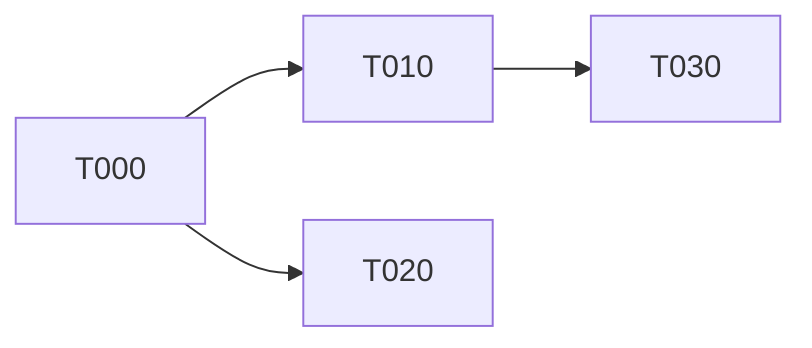

# Backend implementation: parallel worktree orchestration plan

Prompt to hand to Claude Code. Phase 0 runs once, then the loop in Phase 2 runs until `backend.md` shows every task `merged`.

---

## Phase 0. Ingest the spec and produce the partition (do this first, then stop for review)

You are given a backend specification. Do **not** write implementation code yet. Produce a partition of the spec into tasks and a dependency graph, and write it to `backend.md` at the repo root.

### Partition rules

A task is valid only if all of these hold:

1. **Atomic.** One coherent unit of work, deliverable by a single agent in one worktree without touching another task's files.
2. **Contract-first.** It exposes a stated public interface (function signatures, route shape, request/response schema, DB table/columns, error cases). The contract is written before implementation and is the only thing downstream tasks are allowed to rely on.
3. **Independently testable.** Its acceptance criteria can be verified from the outside, through the public interface, with no knowledge of the internals.
4. **Path-owned.** It declares the exact file paths it may create or modify (`Owns`), and paths it must not touch (`Forbidden`). Two tasks that can run in parallel must have disjoint `Owns` sets. Path collision is treated as a dependency even when the logic is unrelated.
5. **Dependency-explicit.** It lists the task IDs it depends on, and the reason for each dependency (contract, data, or path).
6. **Sized for three slots.** Three worktrees run concurrently, so after `T000` the graph should keep at least three mutually independent tasks available at any point. Where a wave offers fewer, prefer splitting a large task along its contract seams over accepting an idle slot. Do not invent filler tasks, and do not merge two genuinely independent tasks into one just to reduce coordination.

### Foundation task

Anything shared by many tasks (type definitions, DB schema and migrations, auth middleware, client factory, error envelope, test harness and fixtures) goes into a single foundation task `T000` that everything else depends on. This exists to prevent the merge collisions that shared scaffolding always produces. Keep `T000` as small as possible: contracts and schema, no feature logic.

### Dependency graph

Emit the graph in `backend.md` in two forms:

- A Mermaid `flowchart LR` block, one node per task ID, edges from dependency to dependent.
- The task index table below, which is the machine-readable form the scheduler reads.

Then compute and record the **parallel waves**: wave 1 is every task with no unmet dependency, wave 2 is every task whose dependencies are all in wave 1, and so on. Waves are advisory. The scheduler in Phase 2 is what actually assigns work.

### `backend.md` format

```markdown
# Backend implementation state

Single source of truth for task partition, dependency graph, worktree assignment and task state.
Every agent updates only its own task row and its own task section. Never edit another task's rows.

## Task index

| ID   | Title | Deps | Owns (paths) | Worktree | Branch | State | Evidence |
|------|-------|------|--------------|----------|--------|-------|----------|
| T000 | ...   | ,    | ...          | ,        | ,      | todo  | ,        |

## Dependency graph



## Waves

- Wave 1: T000
- Wave 2: T010, T020
- ...

## Tasks

### T010, <title>

- **State:** todo
- **Worktree:** (unassigned)
- **Branch:** (unassigned)
- **Depends on:** T000 (contract: uses `Blueprint` type and `db` client)
- **Blocks:** T030
- **Owns:** `app/api/blueprints/**`, `lib/blueprints/**`
- **Forbidden:** `lib/db/schema.ts`, `lib/types/**`, anything owned by another task
- **Goal:** one paragraph, what this task delivers.
- **Contract:** exact public interface. Routes with method, path, request body, response body, status codes, error envelope. Or exported function signatures with types. This is the only section the test author agent is allowed to see.
- **Acceptance criteria:** numbered, externally checkable statements. Each one must be verifiable by hitting the public interface. Include the failure cases, not only the happy path.
- **Out of scope:** what this task must not implement.
- **Log:** append-only. One line per state transition, with date and agent role.
```

### States

`todo` -> `claimed` -> `impl-done` -> `tests-written` -> `adversarial-pass` -> `verified` -> `merged`

Plus `blocked` (with reason and blocking task ID) and `reverted` (adversarial or post-merge failure, back to `claimed`).

State lives in exactly two places, the index table and the task section, and they must agree. Every transition appends a line to the task `Log`.

### Worktree naming

- Implementation worktree: `../<repo>-wt-<taskid>-<slug>`, for example `../darkprint-wt-t010-blueprints-api`, on branch `feat/<taskid>-<slug>`
- Test worktree: the same name with a `-tests` suffix, on branch `test/<taskid>-<slug>`
- Both names are chosen when the task is claimed, written into `backend.md`, and never reused for a different task. A reverted task keeps its worktree names.
- One slot holds one task, which means two directories. Three slots means up to six worktrees on disk, still three tasks in flight.

**Stop after Phase 0.** Print the task index, the graph and the wave list, and wait for approval before creating any worktree.

---

## Phase 1. Claim and set up (per task)

For each task the scheduler selects, create two worktrees, both branched from `main` at claim time:

```bash
# implementation
git worktree add -b feat/<taskid>-<slug> ../<repo>-wt-<taskid>-<slug> main
# tests, branched from the same commit, implementation absent by construction
git worktree add -b test/<taskid>-<slug> ../<repo>-wt-<taskid>-<slug>-tests main
```

Then, on `main`, in a single commit that touches only `backend.md`: set `State: claimed`, fill `Worktree`, `Test worktree` and `Branch`, append to `Log`. Doing this on `main` before work starts is what stops two agents claiming the same task. Every worktree rebases on `main` before starting so it sees current claims.

---

## Phase 2. The three-agent loop (per task, inside its worktree)

Three separate agents with three separate contexts. They must not share a context window, because the whole point is that the tester never sees the implementation.

### Agent A, Implementer

- Reads: the task section of `backend.md`, the contracts of its dependency tasks, `docs/ARCHITECTURE.md`, and only the files under `Owns`.
- Writes: implementation code under `Owns` only. Touching a `Forbidden` path is an immediate stop, report back to the scheduler as a partition error, do not "just fix it".
- May write its own scratch tests, but they do not count as verification.
- On completion: `State: impl-done`, log entry, commit.

### Agent B, Test author (blind)

Spawned with a fresh context, **in the test worktree**. That worktree is branched from `main` at claim time, so the implementation does not exist on disk. Blindness is enforced by the filesystem, not by instruction. The prompt contains only: the task `Goal`, `Contract`, `Acceptance criteria`, `Out of scope`, and the project's test conventions. It never receives Agent A's transcript or diff.

- Writes tests against the public interface, one or more per acceptance criterion, plus edge and failure cases it derives from the contract alone.
- Tests go in the project's test tree, which belongs to the test branch alone. Agent A never writes there, which is what keeps the two branches conflict free at merge time.
- Runs the suite in its own worktree before handing off. Every new test must fail, and must fail for the right reason: a missing route, a missing export, a 404. A test that fails on a syntax error or a bad import path is a broken test, not a red test. This is the only run Agent B does, since there is nothing to pass against.
- On completion: `State: tests-written`, log entry, commit.

Rule: **the implementer may not modify these tests.** If a test is wrong, that means the contract is ambiguous. The contract is amended in `backend.md`, the amendment is logged, every task listed in `Blocks` is notified, and Agent B rewrites the test. A test that changes to match the code is a failed task.

### Agent C, Adversary

Fresh context, working in the implementation worktree. Its first act is `git merge test/<taskid>-<slug>`, which is the first time the code and the tests exist in the same tree. A conflict here means the test worktree touched implementation paths, which is a partition error, stop and report. Its job is to break the task, not to bless it. It must **execute**, not only read.

- Runs the full test suite, lint, typecheck, and the build.
- Runs the code for real: migrations applied to a scratch database, dev server up, actual HTTP calls against every route in the contract, actual invocation of every exported function.
- Attacks: missing auth, wrong ownership (a user reaching another user's private blueprint), malformed and oversized payloads, missing and extra fields, unicode and empty strings, concurrent writes, duplicate submissions, N+1 queries, unhandled promise rejections, error paths that leak internals, and anything the tests did not cover because Agent B could only see the contract.
- Checks each acceptance criterion individually and states pass or fail with the command and the observed output as evidence.
- Verdict is a written report: `PASS` only if every criterion passes and no new defect was found. Otherwise `FAIL` with a reproducible case for each finding.

On `FAIL`: `State: reverted`, findings appended to the task `Log`, back to Agent A. Agent C re-runs from scratch after the fix. On `PASS`: `State: adversarial-pass`.

### Human gate

`adversarial-pass` -> `verified` is the review step. Present the diff, the test list, and the adversary report. Do not self-promote a task to `verified`.

---

## Phase 3. Merge and schedule next

On `verified`:

1. In the worktree: `git fetch origin && git rebase main`, resolve conflicts (there should be none if `Owns` sets were disjoint, a conflict means the partition was wrong and must be recorded as such in `docs/DECISIONS.md`).
2. Re-run the full suite on the rebased branch. A green pre-rebase suite is not evidence.
3. Merge into `main`, update `backend.md`: `State: merged`, evidence link, log entry.
4. Run the full suite on `main` after the merge. If it fails, revert the merge, `State: reverted`, and record why the isolated verification missed it.
5. `git worktree remove ../<repo>-wt-<taskid>-<slug>` and delete the branch. The name stays in `backend.md` as history.

### Scheduler, pick next task

A task is **ready** when all of the following hold:

- Every task in its `Deps` is `merged`.
- Its `Owns` set is disjoint from the `Owns` set of every task currently in a non-terminal state (`claimed` through `verified`).
- Its contract dependencies are unchanged since it was partitioned.

Among ready tasks, prefer the one with the highest number of downstream dependents (unblocks the most work), then the one on the critical path. Then go to Phase 1.

### Concurrency: 3 worktrees, hard cap

- Never claim a fourth task, even when more than three are ready.
- If fewer than three tasks are ready, run fewer. Leave the slot idle rather than claiming a task with an unmet dependency or an overlapping `Owns` set.
- A slot frees when its task reaches `merged` and the worktree is removed, not when it reaches `verified`. A task waiting on the human gate still holds its slot.
- `T000` runs alone. No other task is claimed until it is `merged`, since every contract derives from it. Parallelism starts at wave 2.
- Record the three live assignments at the top of `backend.md` as a `## Live slots` block (slot 1, 2, 3, each with task ID, worktree name and state), so the current occupancy is readable without scanning the table.

If no task is ready but tasks remain, report the blocking set rather than starting work on a non-ready task.

---

## Standing rules

- `backend.md` is the only state store. No task state in commit messages, issues, or agent memory.
- Every commit references its task ID: `T010: add blueprint list route`.
- An agent works in its own worktree only. Never `cd` into another worktree.
- No agent edits `main` except for the `backend.md` state commits described above.
- Keep agent contexts scoped to the task section plus owned paths. Do not load the whole repo into context.
- If the partition turns out to be wrong (hidden dependency, path collision, contract ambiguity), stop, fix `backend.md`, record the reason in `docs/DECISIONS.md`, and re-run the scheduler. Do not work around it inside a worktree.

---

## Appendix: session prompts

Four sessions, four prompts. Only the first one receives this document in full.

### A. Orchestrator, once, at repo root on `main`

```
Read docs/ORCHESTRATION.md in full. It is the protocol for this entire piece of
work, treat it as binding.

The backend specification is at docs/BACKEND_SPEC.md.

Do Phase 0 only:
1. Partition the spec into tasks following the partition rules.
2. Write backend.md at the repo root, in the exact format given.
3. Emit the Mermaid dependency graph, the wave list, and a Live slots block
   with three empty slots.

Write no implementation code. Create no worktrees.

When backend.md is written, print the task index table, the graph and the waves,
then stop and wait for my approval.

If any part of the spec cannot be partitioned without guessing, an ambiguous
contract, an undefined data model, an unstated auth rule, list the questions
instead of inventing an answer.
```

### B. Implementer, in `../<repo>-wt-<taskid>-<slug>`

```
You are the implementer for task <TASKID>, in this worktree.

Read: your task section in backend.md, the Contract sections of the tasks it
depends on, docs/ARCHITECTURE.md, and the sections "Phase 2, Agent A" and
"Standing rules" of docs/ORCHESTRATION.md. Nothing else.

Implement exactly the contract in your task section.

- Create or modify only the paths under Owns. If you need a Forbidden path,
  stop and report a partition error. Do not work around it.
- You are not writing the tests. Another agent writes them blind from your
  contract, in a separate worktree. Never write into the project test tree,
  and never edit those tests once they arrive.
- Scratch tests under your owned paths are fine, they do not count as
  verification.
- If the contract is ambiguous, stop and report it. Do not decide for it.
- Commit as "<TASKID>: <message>".

When done: set State to impl-done in your row and your section of backend.md
only, append a Log line, commit.
```

### C. Test author, in `../<repo>-wt-<taskid>-<slug>-tests`

```
You are the test author for task <TASKID>. Your tests decide whether this task
is done.

The implementation does not exist in this worktree, and that is deliberate. Do
not look for it, do not check out or read the feat/<TASKID> branch, do not read
any transcript from the implementer. If you find implementation code for this
task here, stop and report a setup error.

You have exactly this to work from:

<paste Goal, Contract, Acceptance criteria and Out of scope from backend.md>

plus the project test conventions in <path>.

Write tests against the public interface only:
- at least one per acceptance criterion, each mapped explicitly to its number
- plus the failure and edge cases the contract implies: missing or expired auth,
  wrong owner, malformed payload, missing and extra fields, empty and oversized
  input, wrong types, unicode

Then run the suite. Every new test must fail because the thing under test is
absent, a missing route, a missing export, a 404. A test failing on a syntax
error or a bad import is a broken test, fix it. Report the red output.

Commit on this branch only. Set State to tests-written.
```

### D. Adversary, in `../<repo>-wt-<taskid>-<slug>`

```
You are the adversary for task <TASKID>. Assume the implementation is wrong and
the tests are incomplete. Find what breaks. Confirming that it works is not the
job.

First: git merge test/<TASKID>-<slug>. A conflict means the test branch touched
implementation paths, stop and report a partition error.

Then execute, do not only read:
- full test suite, lint, typecheck, build
- migrations applied to a scratch database
- dev server up, real HTTP calls against every route in the contract, real
  invocation of every exported function
- attacks: missing and expired auth, one user reaching another user's private
  resource, malformed and oversized payloads, missing and extra fields, empty
  strings and unicode, duplicate submissions, concurrent writes, N+1 queries,
  unhandled rejections, error responses that leak internals

Then take the acceptance criteria one at a time. For each, write PASS or FAIL
with the command you ran and the output you observed. No criterion may be marked
from reading the code.

Verdict is PASS only if every criterion passes and you found no new defect.
Otherwise FAIL, with a reproducible case for each finding.

Write the report into the task Log and set State accordingly.
```

### E. Launching each session

Model and effort are per-session flags, so each worktree can run a different configuration. Suggested split:

```bash
# implementer, in ../<repo>-wt-<taskid>-<slug>
claude --model sonnet --settings ../cc-impl.json

# test author, in ../<repo>-wt-<taskid>-<slug>-tests
claude --model opus --settings ../cc-test.json

# adversary, in ../<repo>-wt-<taskid>-<slug>
claude --model opus --effort xhigh --settings ../cc-adv.json
```

Two rules behind the split:

- **The test author should not run the same model as the implementer.** Two instances of one model share blind spots, so the contract clause both misread is the clause neither tests. Different models fail differently, which is the point of writing the tests blind in the first place.
- **The adversary gets the most capable configuration.** Finding a defect nobody wrote a test for is the hardest job in the loop, and it runs once per task rather than continuously, so the cost lands where it buys the most.

Per-worktree settings must come from `--settings <file>` pointing outside the repo. `.claude/settings.json` is tracked, so it is identical in every worktree at the same commit, and `.claude/settings.local.json` resolves through worktrees to the main checkout, so a single file covers all of them. Neither can differentiate a slot.

Keep the **CLI version identical** across all three worktrees. A version difference is a confound: when a test passes in one worktree and fails in another, the cause should be the code, never the tool. Pin it with `autoUpdatesChannel: "stable"` and `minimumVersion` in user settings, once, for the whole machine.
