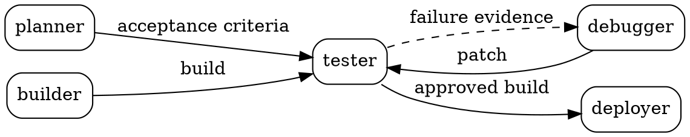

# How a blueprint is defined

A blueprint is a **graph plus the cards its nodes are pinned to**. It is stored as a folder of
text and it is handed back as a folder of text.

**Source of truth:** `lib/core/bundle/types.ts`, `lib/core/bundle/resolve.ts`,
`lib/core/dot/{lexer,parser,graph}.ts`, `lib/content/bundle-export.ts`.
**Examples:** `content/blueprints/<slug>/`, 9 of them.
**Generated:** `public/bundles/<slug>/` by `scripts/generate-bundles.ts` via `prebuild`.
**Published:** a `release` row per version, with the files frozen in object storage by digest.

---

## Source layout

```
content/blueprints/starter-software-factory/
  blueprint.yaml     the manifest: identity, prose, tags, author
  topology.dot       the topology: which nodes exist, what flows between them
```

Cards are **not** copied in. They live once in `content/cards/` and the DOT pins them by
`id@version`, which is what lets one card serve many blueprints.

### `blueprint.yaml`

```yaml
slug: starter-software-factory
title: Starter Software Factory
summary: >-
  The canonical five-node factory, plan, build, test, debug, release, and the one edge it
  deliberately does not have: nothing carries the acceptance criteria to the builder.
description: |-
  ...longer prose, markdown...
category: Software
tags: [starter, tutorial, isolation, software]
author: orin
createdAt: "2026-07-28"
updatedAt: "2026-07-28"
```

There is no ontology version on a manifest, on a card or anywhere else.

### `topology.dot`

A strict DOT subset. Nodes carry `card="id@version"`; edges carry `label` naming what they
carry and, on a fork, a `condition` the runner evaluates.



**Nothing runs `planner -> builder`.** The acceptance criteria reach the node that judges the
work and never the node that produces it. That absence is the point of the blueprint, and it
is enforced twice; see [`engine.md`](./engine.md). The two `condition` guards on the tester's
exits are what make the loop terminate: one key against its own negation, so exactly one arm is
ever eligible.

The parser is hand-written (lexer, then recursive descent) and lives in `lib/core/dot/`. It is
a subset of Graphviz: one directed graph, no subgraph mutation, no HTML labels.

---

## What a reader downloads

`public/bundles/<slug>/` at build time, and the same file set from the registry for a published
release (`/api/files/blueprints/<owner>/<slug>/d/<digest>/<path>`):

```
topology.dot               the topology as authored, with card pins
cards/*.yaml               every card the graph pins, at the pinned version, verbatim
ontology/extensions.yaml   only when the bundle uses local terms
README.md                  digest, download command, scores, and what each file is
```

No compiled `factory.dot` and no `AGENTS.md` travel in the folder: it hands over exactly what
an author wrote. Compilation for a runner is a separate step, `darkprint export --attractor` or
the MCP tool `export_pipeline`, and `emitAttractorDot` in `lib/core/attractor/emit.ts` is the
compiler. It writes the reserved Attractor attributes, graph `goal` and `label`; node `label`,
`shape`, `prompt`, `llm_model`, `max_retries`, `tool_command`, `class`; edge `label`,
`condition`, `weight`; and two names the runner ignores, `card` and `dp_node`. The list is data
(`ATTRACTOR_EMITTED_ATTRIBUTES`, `DARKPRINT_EMITTED_ATTRIBUTES`) and a reader should quote it
rather than this paragraph.

**`shape` is not decoration**: Attractor makes it the handler selector, so the shape written for
a node's card type decides which handler runs it. `class` is comma-separated. `condition` and
`weight` are carried verbatim: a guard's syntax is checked and reported as a warning, and its
value is evaluated by nothing in DarkPrint, so a guarded edge counts exactly as much as an
unguarded one in every risk reading. The header of every emitted file lists the attributes a
blueprint has no way to set, which fall to the runner's defaults.

---

## Resolution

`resolveBundle` (`lib/core/bundle/resolve.ts`) turns a folder into a `ResolvedBlueprint`, or
into diagnostics. In order, it:

1. parses the DOT;
2. loads and validates every card the graph pins;
3. matches each edge to a port on both ends, and checks the data types against the ontology
   lattice;
4. checks declared prohibitions, **`cannot`**, against what each incoming edge carries;
5. checks declared dependencies are present and that present dependencies are declared;
6. checks reachability, entry and exit;
7. checks the version chain when a bundle carries two versions of one card;
8. computes a content-addressed digest.

Any **error**-severity diagnostic means the bundle does not resolve. `lib/content/read.ts`
throws on one, so a broken bundle under `content/` fails the build rather than shipping, and
`publish()` refuses one with a 422.

A resolved bundle is then analysed (autonomy, security, phase coverage), which is
[`engine.md`](./engine.md).

---

## The digest

`sha256` over canonical JSON, computed by a **pure-TypeScript** implementation
(`lib/core/hash/`) because the engine must run in the browser. The bundle digest is taken over
`topology.dot` and the sorted digests of every card version it pins; the manifest is outside
it. The digest is printed in the bundle README so a reader can verify that what they downloaded
is what was scored, and it is the address a release keeps forever.

---

## What breaks if you change this

| change | what goes stale |
|---|---|
| **edit a `topology.dot`** | that bundle's digest, its README, its scores, and any figure drawn from it; `components/home/roles.ts` reparses the starter's DOT and `roles.test.ts` fails on drift |
| **bump a card a blueprint pins** | the pin in `topology.dot`; the version-chain check fails the build until both agree |
| **add a reserved Attractor attribute** | `attractor/reserved.ts`, `emit.ts`, `lint.ts`, the crosswalk on `/spec/attractor`, and the skill's `references/dot-and-attractor.md` |
| **change the export layout** | `bundle-export.ts`, the README generator, the download copy, and the `/upload` validator, which must still accept the folder DarkPrint generates |
| **change canonical JSON or the digest** | every digest in every README, every `/d/<digest>` address and every object-storage key |

That last one has bitten before in spirit: an earlier export omitted a bundle's local ontology
extensions, so DarkPrint's own upload rejected a folder DarkPrint had generated. **The test
that matters is the round trip**: export a bundle, feed it back through `/upload`, and it must
resolve with the same scores.
