# 3 · Concept model

[← Back to the index](../ARCHITECTURE.md)

Carried over unchanged from Phase 2A's `ENTITIES.md` §1-9. The naming inconsistency table
(`ENTITIES.md` §10) lives in [2 · Domain glossary](glossary.md) instead, so every entity
in this document also appears in the glossary. Open `TBD:` questions collected at the end
of this file are carried into [11 · Known gaps and decisions](../ARCHITECTURE.md#11-known-gaps-and-decisions)
of the main document as well, not duplicated in prose there.

Derived from the TypeScript types in `lib/core/**`, `lib/types.ts`, `lib/data/**` and
`components/**`, checked against the actual YAML and DOT in `content/`. Field optionality
is the declared optionality. Nothing is inferred from a narrative document.

Two stores are visible in the code and the split is load-bearing for the schema:

- **The archive** (`content/`, read by `lib/content/read.ts`) is immutable and
  content-addressed. Everything in it is a file, hashed, and never edited in place.
- **The index** (`lib/data/**`) is everything that moves: votes, downloads, comments,
  three of the six metrics, ownership, visibility, saves. `lib/data/community.ts:1-9`
  states in the code that this module *is* the database, "until there is a real one".

`Status` on each entity: `LIVE` (built and working), `MOCK` (fixture or hardcoded),
`PLANNED` (shape declared, nothing produces or consumes it yet).

---

## 1 · Topology and node detail — the split the UI encodes implicitly

This is the most important structural fact in the model and no single type states it. It is
enforced by the loader, the resolver and the exporter working together.

**The DOT file carries nodes and edges only.** A DOT node's attributes carry a *pointer* at
a card, not the card. `lib/content/read.ts:389-412` reads exactly two pointer forms:

| Pointer form | Example | Source |
|---|---|---|
| `card="id@version"` | `planner [card="spec-planner@1.0.0"]` | `content/blueprints/starter-software-factory/blueprint.dot:7` |
| `version="…"` on a node whose DOT id doubles as the card id | `spec-planner [version="1.0.0"]` | `lib/content/read.ts:399-402` |

An unversioned pointer (`solver-a`, `solver-a@latest`) is rejected by
`parseCardRef` (`lib/core/card/schema.ts:187`), which is what makes "always pin the exact
version" checkable at the reference site.

**The card is an external document.** It lives in a shared library
(`content/cards/<id>@<version>.yaml`, 57 files) and the loader pulls in only the refs the
DOT actually pins (`lib/content/read.ts:351-381`). A blueprint's folder therefore has no
cards of its own until it is exported.

**Resolution is the join.** `ResolvedNode` (`lib/core/bundle/types.ts:43`) is one DOT node
joined to one card. Three things follow that the UI relies on:

1. **Topology outlives a missing card.** `computeAutonomy` walks `bp.graph.ids`, not
   `bp.nodes` (`lib/core/analysis/autonomy.ts:349-364`), so a node whose card is absent is
   still in the denominator and is reported as a third category, neither unattended nor
   staffed (`AutonomyContribution.resolved`, `:111`).
2. **`FlowNodeSeed.cardId` is a second fact, not a copy of the ref.** `ResolvedNode.ref` is
   always there; `cardId` is set only when that card is published in this registry and
   therefore has a page at `/nodes/<id>` (`lib/types.ts:127-147`). A bundle dropped into
   `/upload` or generated by `/build` carries ids no page was built for.
3. **The same card can instantiate two nodes.** Phase coverage is keyed on node ids, not
   card ids, for exactly this reason (`lib/core/analysis/phase-coverage.ts:79-81`).

`TBD:` A DOT node's *other* attributes (`DotAttrs`, kept on `ResolvedNode.attrs` and
`ResolvedEdge.attrs`) are stored as an untyped `Record`. Which of them the backend must
persist as first-class columns, and which are free-form passthrough for Attractor?

---

## 2 · Entities

### `Bundle` — the raw upload

`lib/core/bundle/types.ts:34`. Status: `LIVE` (as an in-memory shape; nothing persists one).

| Field | Type | Opt | Notes |
|---|---|---|---|
| `manifest` | `BundleManifest` | req | |
| `dot` | `string` | req | DOT source, verbatim |
| `cardFiles` | `Readonly<Record<string, string>>` | req | keyed by bundle-relative filename, e.g. `cards/solver@1.0.0.yaml` |

**Identified by:** nothing on its own. It becomes identifiable only once resolved, at which
point `ResolvedBlueprint.digest` names it.

### `BundleManifest`

`lib/core/bundle/types.ts:19`. Wire format `blueprint.yaml`, validated by
`lib/content/read.ts:421-445`. Status: `LIVE`.

| Field | Type | Opt | Notes |
|---|---|---|---|
| `slug` | `string` | req | **primary key.** Must equal the directory name (`read.ts:359`) |
| `title` | `string` | req | |
| `summary` | `string` | req | |
| `description` | `string` | opt | rendered as paragraphs split on `\n\n` |
| `category` | `string` | opt | view model defaults it to `"Uncategorised"` (`lib/content/view.ts:81`) |
| `tags` | `string[]` | req | may be `[]`; a missing key coerces to `[]` (`read.ts:469`) |
| `author` | `string` | opt | an `Author.username`, not a foreign key the loader checks |
| `ontologyVersion` | `string` | req | semver of the vocabulary the manifest was written against |
| `createdAt` | `string` | opt | ISO date, supplied by the caller. `lib/core` never reads the clock |
| `updatedAt` | `string` | opt | |

### `ResolvedBlueprint`

`lib/core/bundle/types.ts:65`. Status: `LIVE`.

| Field | Type | Opt | Notes |
|---|---|---|---|
| `manifest` | `BundleManifest` | req | |
| `dot` | `string` | req | |
| `digest` | `string` | req | **content identity.** `bundleDigest` over the DOT source and the sorted card digests (`lib/core/hash/digest.ts:58`). Card digests are sorted but not deduplicated: pinning one card twice is a different bundle |
| `nodes` | `readonly ResolvedNode[]` | req | |
| `edges` | `readonly ResolvedEdge[]` | req | |
| `graph` | `Graph` | req | traversal object, `lib/core/dot/graph.ts:17` |
| `ontology` | `OntologyView` | req | the vocabulary this bundle was resolved against |
| `cards` | `ReadonlyMap<CardRef, NodeCard>` | req | includes orphans, which the registry does not index |
| `phaseCoverage` | `PhaseCoverage` | req | computed at resolution, not by the analyzers (`:77-85`) |

### `ResolvedNode`

`lib/core/bundle/types.ts:43`. Status: `LIVE`.

| Field | Type | Opt | Notes |
|---|---|---|---|
| `nodeId` | `string` | req | the DOT node id, which is the *instance* |
| `ref` | `CardRef` | req | `"id@version"` |
| `card` | `NodeCard` | req | |
| `digest` | `string` | req | the card's digest |
| `attrs` | `DotAttrs` | req | the node's other DOT attributes |

### `ResolvedEdge`

`lib/core/bundle/types.ts:53`. Status: `LIVE`.

| Field | Type | Opt | Notes |
|---|---|---|---|
| `source` | `string` | req | DOT node id |
| `target` | `string` | req | DOT node id |
| `fromPort` | `Port` | opt | resolved output port on `source`, where it could be resolved |
| `toPort` | `Port` | opt | resolved input port on `target` |
| `label` | `string` | opt | |
| `attrs` | `DotAttrs` | req | |

### `NodeCard`

`lib/core/card/schema.ts:26`. Wire format `cards/<id>@<version>.yaml`, snake_case, mapped
onto camelCase by `validate.ts`. Status: `LIVE`.

| Field | Wire key | Type | Opt | Notes |
|---|---|---|---|---|
| `id` | `id` | `string` | req | optionally namespaced (`berti/solver-a`). Half the primary key |
| `name` | `name` | `string` | req | |
| `type` | `type` | `string` | req | a `node-type` term id. Exactly one |
| `phases` | `phase` | `string[]` | req (may be `[]`) | any number of the five. Wire key is singular and accepts a scalar or a sequence. `[]` is a complete answer, never a hole (`:32-51`) |
| `action` | `action` | `string` | req | short, machine-readable |
| `spec` | `spec` | `string` | req | the natural-language instruction handed to the agent. Must be self-sufficient and must respect the graph's isolation rules |
| `model` | `model` | `string` | opt | a **default**, not a binding; a graph `model_stylesheet` can override it. Priced as a minor bump |
| `agent` | `agent` | `string` | opt | |
| `tools` | `tools` | `string[]` | req (may be `[]`) | `tool` term ids |
| `mcp` | `mcp` | `string[]` | req (may be `[]`) | **free text by design.** MCP server names as registered on the machine that runs the graph. Deliberately not ontology terms (`:88-100`) |
| `skill` | `skill` | `string` | opt | a path inside the bundle. Nothing in the engine reads what it points at |
| `params` | `params` | `Record<string, JsonValue>` | req | free-form, JSON-serializable. `card/bad-type` refuses nesting deeper than 100 |
| `inputs` | `inputs` | `Port[]` | req | |
| `outputs` | `outputs` | `Port[]` | req | |
| `dependencies` | `dependencies` | `string[]` | req | ids of other cards this one receives data from. May also name a DOT node (`app/nodes/[...id]/page.tsx:778-783`) |
| `cannot` | `cannot` | `string[]` | req | **half-enforced.** An entry naming a `data-type` term is a declared prohibition the resolver holds the graph to (`bundle/prohibition-violated`, error severity). Anything else is free text checked by nothing (`:119-143`) |
| `requiresHuman` | `requires_human` | `boolean` | req | |
| `riskMarkers` | `risk_markers` | `string[]` | req (may be `[]`) | `risk-marker` term ids |
| `notes` | `notes` | `string` | opt | |
| `version` | `version` | `string` | req | semver of the card. Other half of the primary key. A published version is never edited in place |
| `author` | `author` | `string` | opt | excluded from the digest |
| `provenance` | `provenance` | `string` | opt | excluded from the digest |
| `ontologyVersion` | `ontology_version` | `string` | req | semver of the vocabulary the card is written against |

**Identified by:** `CardRef = "id@version"` (`:161`, built by `cardRef` at `:177`).
**Content-identified by:** `cardDigest` (`lib/core/hash/digest.ts:44`), sha256 over the
canonical JSON of the card minus `author` and `provenance`. Two cards describing the same
node collapse onto one digest however their YAML ordered its keys, which is what makes
`Registry.duplicates()` possible (`lib/core/archive/registry.ts:62`, `:118-141`).

### `Port`

`lib/core/card/schema.ts:12`. Status: `LIVE`.

| Field | Type | Opt | Notes |
|---|---|---|---|
| `name` | `string` | req | unique within its side of one card |
| `type` | `string` | req | a `data-type` term id |
| `description` | `string` | opt | |
| `required` | `boolean` | opt | **inputs only, defaults to `true`** (`app/nodes/[...id]/page.tsx:772`) |

### `OntologyTerm`

`lib/core/ontology/types.ts:27`. Status: `LIVE`.

| Field | Type | Opt | Notes |
|---|---|---|---|
| `id` | `string` | req | **primary key.** Bare for a core term (`agent`), namespaced for a local one (`lupo/pii-handling`) |
| `kind` | `TermKind` | req | `phase` \| `node-type` \| `risk-marker` \| `data-type` \| `tool` |
| `label` | `string` | req | |
| `description` | `string` | req | may be empty; consumers drop the line rather than print a blank (`app/nodes/page.tsx:74-81`) |
| `broader` | `string` | opt | parent term id. Subsumption, queried through `isA`. Functional: at most one parent |
| `deprecated` | `TermDeprecation` | opt | a deprecated term stays valid |
| `since` | `string` | req | ontology version that introduced it |
| `defaultWeight` | `number` | opt | **local risk markers only.** No core term carries one; the seven core weights live in `DARKPRINT_CONFIG.security.weights` |
| `impliesHuman` | `boolean` | opt | set on the two concrete human types. Picks the most specific term to *cite*, never a second membership rule (`lib/core/analysis/autonomy.ts:452-461`) |

### `TermDeprecation`

`lib/core/ontology/types.ts:18`. Status: `LIVE`.

| Field | Type | Opt |
|---|---|---|
| `since` | `string` | req |
| `replacedBy` | `string` | opt |
| `note` | `string` | opt |

### `Ontology`

`lib/core/ontology/types.ts:56`. Status: `LIVE`. Two instances exist: `CORE_ONTOLOGY`
(`lib/core/ontology/core.ts:503`, version `0.1.0`, 49 terms) and the archive's overlay
(`content/ontology/extensions.yaml`, 1 term).

| Field | Type | Opt | Notes |
|---|---|---|---|
| `version` | `string` | req | semver. A local overlay does **not** mint a new version; the merged view keeps the base's (`lib/core/ontology/resolve.ts:125-127`) |
| `title` | `string` | req | |
| `terms` | `readonly OntologyTerm[]` | req | |

### `Author`

`lib/types.ts:167`, fixture at `lib/data/users.ts:3`. Status: `MOCK`.

| Field | Type | Opt | Notes |
|---|---|---|---|
| `username` | `string` | req | **primary key.** The handle in `/u/<username>`, and the value a card's `author` field carries |
| `displayName` | `string` | req | |
| `avatarHue` | `number` | req | 0-360, generates a deterministic gradient avatar |
| `validator` | `boolean` | req | badge. Their votes would carry more weight |
| `bio` | `string` | opt | |

`reputation` stood here once and was dropped on 2026-08-13 rather than folded into
`ProfileHeader`'s preview line: nothing on the site ever explained what it measured or how
it moved. Two figures replaced it, both on the preview line and neither stored on
`Author`: `stars` (`ProfileShell.tsx`, `blueprints.reduce(votes) + cards.reduce(support)`,
computed fresh from data that is already a field elsewhere) and `Profile.validated`
(below, genuinely new and seeded, since nothing else on the account holds that fact).

### `Account` — the signed-in row

`lib/data/account.ts:45`. Status: `MOCK`. Singular, not a table: there is no session, so
"the signed-in account" has exactly one answer (`:69-76`).

| Field | Type | Opt | Notes |
|---|---|---|---|
| `author` | `Author` | req | |
| `email` | `string` | req | never rendered on a public surface |
| `joinedAt` | `string` | req | ISO date, rendered at month resolution |
| `validatorSince` | `string` | opt | absent for a non-validator |
| `validatorWeight` | `number` | req | the multiplier a validator's vote *would* carry. `3` in the fixture |
| `defaultVisibility` | `"public" \| "private"` | req | what a new bundle defaults to. Per-bundle and overridable |
| `notifications` | `readonly NotificationSetting[]` | req | |

### `NotificationSetting`

`lib/data/account.ts:34`. Status: `PLANNED` (nothing sends).

| Field | Type | Opt | Notes |
|---|---|---|---|
| `id` | `string` | req | stable key; also the label's `for` target. Four rows: `repin`, `fork`, `deprecation`, `digest` |
| `title` | `string` | req | the event as a reader describes it |
| `note` | `string` | req | why it is on or off by default |
| `on` | `boolean` | req | |

### `Profile`

`lib/data/profiles.ts:33`. Status: `MOCK`. Keyed by handle. Deliberately holds nothing the
archive can count (`:9-14`).

| Field | Type | Opt | Notes |
|---|---|---|---|
| `joinedAt` | `string` | req | ISO date |
| `watchers` | `number` | req | a shape, not a tally. There is no follow and nothing to notify |
| `support` | `number` | req | community support for the *person*. No ballot exists |
| `validated` | `number` | req | how many OTHER accounts' blueprints this handle downloaded, ran, and reported statistics for (SEAM-84), that made it onto that blueprint's own evidence layer. Never asserted by any blueprint's `EvidenceLayers`, which always reads "no verified runs" — see `lib/data/profiles.ts`'s field comment for the full argument |
| `pinned` | `readonly PinnedRef[]` | req | at most two, which is what the grid holds |

### `PinnedRef`

`lib/data/profiles.ts:29`. Status: `MOCK` (the selection) over `LIVE` content.

Discriminated union: `{ kind: "blueprint"; slug }` \| `{ kind: "node"; ref }`. A pin the
archive cannot resolve renders nothing at all (`components/profile/load.ts:98-106`).

### `OwnedBundle` — ownership and visibility

`lib/data/bundles.ts:155`. Status: `MOCK`. **The file's own header is the modelling
argument** (`:1-28`): an account holds blueprints, each public or private, and some happen
to have an upstream. There is no `Fork` type, no `forks` array and no second list.

| Field | Type | Opt | Notes |
|---|---|---|---|
| `owner` | `string` | req | an `Author.username`. Half the primary key |
| `slug` | `string` | req | other half. Route is `/u/<owner>/<slug>` |
| `visibility` | `"public" \| "private"` | req | |
| `forkedFrom` | `Lineage` | opt | **one optional field, not a type.** Absence means "started here" |
| `drift` | `Drift` | opt | |
| `draft` | `Draft` | opt | present exactly when `slug` is **not** published in `content/`. This is the seam the whole bundle page turns on (`components/bundle/load.ts:210`) |

**Seeding rule stated in code** (`:10-22`): a seeded bundle is always private, because a
public bundle is a claim about the registry that a fixture cannot make true. All five rows
belong to `mara-veil`: two public (real archive bundles), three private.

### `Lineage`

`lib/data/bundles.ts:31`. Status: `MOCK`.

| Field | Type | Opt | Notes |
|---|---|---|---|
| `owner` | `string` | req | upstream handle |
| `slug` | `string` | req | upstream slug |
| `version` | `string` | req | the upstream release this copy was taken at |

### `Drift`

`lib/data/bundles.ts:46`. Status: `MOCK` (nothing computes it).

| Field | Type | Opt | Notes |
|---|---|---|---|
| `tone` | `"ok" \| "moved" \| "blocked"` | req | `moved` means the upstream has repinned; `blocked` is this bundle's own problem, never framed as falling behind |
| `note` | `string` | req | |

### `Draft` and `DraftDetail`

`lib/data/bundles.ts:136` and `:117`. Status: `MOCK`. Everything an unpublished row has to
carry because there is no archive behind it.

`Draft`: `title`, `summary`, `version`, `digest`, `autonomy` (a class **name**, never an
ordinal), `editedAt`, `detail`. All required.

The `digest` field takes a plain sentence when the bundle does not resolve
(`"no digest: the bundle does not resolve"`, `:447`), because the engine cannot hash a card
that is not there. `TBD:` in a real schema, should this be a nullable digest column plus a
separate `resolves: boolean`, rather than a string that is sometimes a hash and sometimes
prose?

`DraftDetail`: `lastChange` `{author, message, digest, at}`, `files: BundleFile[]`,
`history: HistoryEntry[]`, `releases: Release[]`, `facts` `{nodes, pinnedCards,
ontologyDeclared, scoredUnder}`, `upstreamMoved?`, `changes: number`.

### `BundleFile`

`lib/data/bundles.ts:60`. Status: `MOCK` for a draft, `LIVE` (derived) for a published
bundle (`components/bundle/load.ts:101-131`).

| Field | Type | Opt | Notes |
|---|---|---|---|
| `path` | `string` | req | a name `bundle-export.ts` really generates, or one of the two local-only files |
| `kind` | `"dot" \| "dir" \| "yaml" \| "doc"` | req | `dir` is the one entry that is not a file |
| `change` | `string` | req | what changed, in the author's words |
| `state` | `"changed" \| "generated" \| "verbatim" \| "local" \| "source" \| "pinned"` | req | six words so one legend covers both a working copy and a published folder |
| `at` | `string` | req | ISO date |

### `HistoryEntry`

`lib/data/bundles.ts:86`. Status: `MOCK`. **Not a commit.** There is no repository behind a
bundle, so an entry is an identity (a digest over the DOT and every card version it pinned)
rather than a patch against the one below it.

| Field | Type | Opt | Notes |
|---|---|---|---|
| `version` | `string` | req | for a published bundle this **is** a truncated digest (`components/bundle/load.ts:219`) |
| `digest` | `string` | req | short form |
| `tag` | `"latest" \| "fork point" \| "upstream"` | opt | |
| `message` | `string` | req | |
| `author` | `string` | req | handle |
| `at` | `string` | req | |

### `Release`

`lib/data/bundles.ts:98`. Status: `MOCK` for drafts, `LIVE` (one synthetic row) for
published bundles.

| Field | Type | Opt | Notes |
|---|---|---|---|
| `version` | `string` | req | |
| `at` | `string` | req | |
| `files` | `number` | req | |
| `size` | `string` | req | human, e.g. `"41 kB"`. Published rows read `"on disk"` |
| `latest` | `boolean` | opt | |

A published bundle gets exactly **one** release, because the archive holds one folder per
bundle and printing more would invent releases nobody can fetch (`load.ts:220-222`).

### `UpstreamMoved`

`lib/data/bundles.ts:108`. Status: `MOCK`.

| Field | Type | Opt |
|---|---|---|
| `card` | `string` (card id, also the route) | req |
| `from` | `string` (version) | req |
| `to` | `string` (version) | req |
| `at` | `string` | req |

### `Save`

`lib/data/bundles.ts:535`. Status: `MOCK`. **A save is a private bookmark and it is not the
star count beside a blueprint.** The two are kept apart everywhere.

| Field | Type | Opt | Notes |
|---|---|---|---|
| `href` | `string` | req | a real route in every row |
| `path` | `string` | req | display form: `owner / name`, or a card/term id |
| `summary` | `string` | req | |
| `kind` | `"blueprint" \| "node card" \| "vocabulary term"` | req | |

**There are two disjoint save sets in this build**, and the code says so
(`lib/data/bundles.ts:551-552`):

1. `SAVES` — the five fixture rows the profile lists.
2. `localStorage["darkprint:favorites"]` — a `Set<string>` of compound keys written by
   `FavoriteStar` (`components/ui/FavoriteStar.tsx:27`, `:94-96`). Key forms observed:
   `blueprint:<slug>`, `node:<id>@<version>`, `bundle:<owner>/<slug>`.

A backend has to unify these into one `Save` table keyed on `(account, target)`.

### `Comment`

`lib/types.ts:178`. Status: `MOCK`. Rendered as "Community notes".

| Field | Type | Opt | Notes |
|---|---|---|---|
| `id` | `string` | req | **local to its parent row** (`c1`, `c2`, `c3` repeat across slugs in `COMMUNITY`), so the real key is `(slug, id)` |
| `author` | `Author` | req | embedded object, not a foreign key |
| `body` | `string` | req | |
| `createdAt` | `string` | req | ISO-ish date, no time |
| `votes` | `number` | req | nothing casts one |

`TBD:` Comments have no parent-type discriminator. Blueprint notes live in
`COMMUNITY[slug].comments` and card notes in `NODE_COMMENTS[cardId]`, two separate maps
with one row type. Is a comment polymorphic over `(blueprint | card)`, or two tables?

### `CommunitySignals` — the mutable index row for one blueprint

`lib/data/community.ts:42`, keyed by slug. Status: `MOCK`.

| Field | Type | Opt | Notes |
|---|---|---|---|
| `downloads` | `number` | req | |
| `votes` | `number` | req | also rendered as "support" and as "stars" |
| `comments` | `Comment[]` | req | |
| `efficacy` | `number` | req | 0-100, community-voted |
| `reliability` | `number` | req | 0-100, community-voted |
| `transparency` | `number` | req | 0-100, community-voted |
| `cost` | `number` | req | 0-100, **a seeded stand-in so the radar has six axes.** A shape, not a measurement |
| `reported` | `ReportedCost` | opt | the real thing. Absent on every row, and absent from the fallback, because it is absent in fact |
| `featured` | `boolean` | opt | |
| `seed` | `boolean` | opt | one of the two highlighted examples |

Autonomy and security are **deliberately absent** from this row: the engine computes them
from the graph (`:6-9`). `communityFor(slug)` returns a zeroed row for an unlisted slug
(`:292`).

### `ReportedCost`

`lib/data/community.ts:30`. Status: `PLANNED`. Nothing in the repository produces one; the
type exists so the empty state has a shape to be empty of.

| Field | Type | Opt | Notes |
|---|---|---|---|
| `runs` | `number` | req | runs that survived the outlier filter |
| `median` | `number` | req | on the 0-100 axis the rest of the scorecard uses |
| `spread` | `{ p10: number; p90: number }` | req | |
| `model` | `string` | req | e.g. `"claude-sonnet-4-5"`. Without it, comparing two blueprints' cost figures means nothing |

Outlier filtering is a property of how `runs` was arrived at:
`DARKPRINT_CONFIG.telemetry.outlierZScore` (3) and `minRuns` (5)
(`lib/core/config.ts:167-170`).

### Per-card index rows

`lib/data/node-community.ts`. Status: `MOCK`. A card has no row in `COMMUNITY`, so this is
the node-card half of the index.

| Store | Shape | Notes |
|---|---|---|
| `NODE_DOWNLOADS` | `Record<cardId, number>` | `:24`. Keyed by the card's own **id**, not by `ref`, so versions share one counter |
| `NODE_COMMENTS` | `Record<cardId, Comment[]>` | `:110`. Empty for every card, deliberately |
| `starsFor(id)` | derived: `round(downloadsFor(id) * 0.08)` | `:93`. Support is derived from downloads, not stored |

`TBD:` `NODE_DOWNLOADS` counts per card **id** while `Blueprint.downloads` counts per
**slug**, and `starsFor` derives support from downloads for cards while `CommunitySignals.votes`
stores it independently for blueprints. Are downloads and support counted per version or
per id for a card, and are the two entities meant to share one counter table?

### `PrivateCard` — a card's own `OwnedBundle`

`lib/data/cards.ts:32`. Status: `MOCK`. Added 2026-08-13, the card-side counterpart to
`OwnedBundle`'s private rows, following the same rule that file's header states: a
private row is always a fixture claim, never a document in `content/cards/` (a card
there is public by definition, the same way a bundle in `content/blueprints/` is).

| Field | Type | Opt | Notes |
|---|---|---|---|
| `owner` | `string` | req | an `Author.username` |
| `id` | `string` | req | |
| `version` | `string` | req | |
| `name` | `string` | req | |
| `action` | `string` | req | |
| `type` | `string` | req | `node-type` term id, spelled out rather than resolved through the ontology — this card is not archive-indexed |
| `typeLabel` | `string` | req | |
| `phases` | `{ id: string; label: string }[]` | req | |
| `tools` | `string[]` | req | |
| `requiresHuman` | `boolean` | req | |
| `riskMarkers` | `string[]` | req | |

No `usedIn` or `support` field: both are always `0` for a private card (`components/
profile/load.ts`'s `privateNodeSummaryFor`), because nothing published can pin a ref the
archive does not carry and nobody but the owner has ever seen the card to star it —
computed at the read site rather than stored, so there is nowhere for either figure to
drift from `0`.

The two seeded rows are `mara-veil`'s, for the two nodes `incident-commander-draft`
(`lib/data/bundles.ts`) says have no card pinned: writing a card privately and pinning it
into a bundle's `cards/` folder are different acts, which is why the draft still does not
resolve even though both cards exist.

### `CardVersionRecord` and `BlueprintRecord` — the query index

`lib/core/archive/registry.ts:25` and `:36`. Status: `LIVE`. Pure, in-memory, rebuilt per
process by `buildRegistry` (`:163`). This is the read model, not a store.

`CardVersionRecord`: `ref`, `id`, `version`, `digest`, `card`, `usedIn: string[]` (blueprint
slugs pinning this exact version, distinct and sorted).

`BlueprintRecord`: `slug`, `manifest`, `digest`, `cardRefs: CardRef[]`.

The `Registry` interface (`:45-88`) is the API surface a backend has to reproduce:
`blueprints()`, `blueprint(slug)`, `cards()`, `versionsOf(id)`, `latestCards()`,
`card(ref)`, `usersOf(id)`, `duplicates()`, `phases()`, `cardsByPhase(phase)`, `tags()`,
`categories()`, `searchCards(query)`.

Two rules the index enforces that a database must too:
- **The slug is the primary key.** The first blueprint claiming one wins; a later namesake
  is skipped whole (`:169-171`).
- **Only cards a DOT node instantiates are indexed.** An orphan card in a bundle has no
  digest and no user, so it has nothing to index (`:158-161`).

### `ContentStore` — declared, unused

`lib/core/archive/store.ts`, exported at `lib/core/index.ts:184-185` as `StoredObject`,
`ContentStore`, `contentDigest`, `memoryContentStore`. Status: `PLANNED`. This is the
object-storage half of the archive design. No page or component calls it;
`docs/audit/REPORT.md:207-223` classifies the whole `lib/core` barrel as
`PENDING-BACKEND`.

---

## 3 · Content hash versioning of node cards

Three separate mechanisms, and the UI relies on all three:

**1 · The digest is the content identity.** `cardDigest` (`lib/core/hash/digest.ts:44`) is
`sha256:<64 hex>` over `canonicalJson(card)` minus `author` and `provenance`. Both are
provenance metadata: who typed the file says nothing about what the node does, and if they
counted, the same card contributed by two authors would fail to dedup (`:20-23`).
`version` and `ontologyVersion` **are** included.

**2 · A published version is immutable.** `content/cards/` holds one file per
`id@version`, so the library is append-only by construction. `lib/content/index.ts:103-106`
relies on this: a card shared by two blueprints is one file, so the second write is the
same bytes as the first. `buildRegistry` relies on it harder: first sighting of a ref wins
its digest, because two blueprints disagreeing about it is a publishing bug and not a fact
to average (`registry.ts:185-188`).

**3 · The bump between two versions is checked, not trusted.** `inferBump(previous, next)`
(`lib/core/version/bump.ts`) returns `BumpAnalysis { level: "major" | "minor" | "patch" |
"none"; reasons: string[] }`, comparing everything except `version`, `author` and
`provenance` (`:37`). `checkVersionChain` (`lib/core/card/validate.ts:844`) sorts a card's
versions and holds each step to the bump the engine infers. `lib/content/read.ts:241`
sweeps the **whole library** with it and fails the build on a mismatch, because the site
prints the engine's verdict on the node page beside the number and the two must not
contradict each other.

Observed version chains in `content/cards/`: `acceptance-verifier` (1.0.0, 2.0.0),
`bounded-retry` (1.0.0, 2.0.0), `intent-router` (1.0.0, 2.0.0), `schema-gate` (1.0.0,
1.1.0). 57 card files, 53 distinct ids.

**Bundle-level versioning is by digest, not by semver.** `bundleDigest` hashes the DOT plus
the sorted card digests (`digest.ts:58`), and a published bundle's "version" string on the
UI **is** `shortDigest(digest)` (`components/bundle/load.ts:156`, `:219`). Draft bundles
carry hand-written semver strings (`v1.4.0-hardened`) instead.

`TBD:` Two version vocabularies are in play for one concept. A published bundle is
addressed by digest; a draft is addressed by a semver string an author typed. Does a
released bundle get a semver of its own, or is the digest the only identity a release ever
has?

---

## 4 · Blueprint evaluation — the six metrics and who may write each one

`Metric` (`lib/types.ts:41`): `key`, `label`, `value` (0-100, normalized for uniform
display), `source`, `detail`. Assembled by `metricsFor` (`lib/content/view.ts:150-211`).
Order is fixed; the radar and the bar list both read it positionally.

`MetricSource` (`lib/types.ts:31`) is the write-authority discriminator. The word is
`reported`, not `measured`, because execution happens on the user's machine and DarkPrint
never observes a run.

| `key` | UI label | `source` | Where the value comes from | Who may write it | Status |
|---|---|---|---|---|---|
| `autonomy` | Autonomy | `auto` | `round(analysis.autonomy.fraction * 100)` (`view.ts:159`) | **the engine only.** Static graph analysis over the resolved bundle | `LIVE` |
| `efficacy` | Efficacy | `community` | `community.efficacy` | **a weighted ballot**, validator votes weighted by `Account.validatorWeight` | `MOCK` — no ballot exists |
| `reliability` | Reliability | `community` | `community.reliability` | same | `MOCK` |
| `transparency` | Transparency | `community` | `community.transparency` | same | `MOCK` |
| `cost` | Cost / time | `reported` | `community.reported?.median ?? community.cost` (`view.ts:196`) | **whoever ran the blueprint**, submitting a run report. The platform never measures it | `MOCK`/`PLANNED` — the fallback is seeded on every row; `reported` is absent everywhere |
| `security` | Static risk exposure | `auto` | `round(clamp(analysis.security.raw, 0, 4) / 4 * 100)` (`view.ts:206`) | **the engine only** | `LIVE` |

Presentation metadata per source: `METRIC_SOURCE_META` (`lib/format.ts:71-95`) gives each
one a label (`Static analysis`, `Reported by runners`, `Community vote`), a short form
(`auto`, `reported`, `voted`) and a colour.

### The two engine-written readings, in full

**`AutonomyResult`** (`lib/core/analysis/autonomy.ts:117`), computed by `computeAutonomy`
(`:236`):

| Field | Type | Notes |
|---|---|---|
| `autonomyClass` | `"assisted" \| "supervised" \| "conditional" \| "closed-loop"` | **the only value any surface renders** |
| `isDarkFactory` | `boolean` | `autonomousNodes === totalNodes && phaseCoverage.missing.length === 0` (`:317`). Both halves counted, never read off the band |
| `level` | `1 \| 2 \| 3 \| 4` | the band. Filtering and ordering only; **no surface prints it** |
| `label` | `string` | the class in title case |
| `fraction` | `number` | unattended / total, 0-1, 4dp |
| `autonomousNodes` | `number` | nodes with a card **and** nobody in them |
| `totalNodes` | `number` | every node in the graph |
| `contributions` | `AutonomyContribution[]` | one per node, in graph order |
| `rationale` | `string` | the threshold rule that produced the level |
| `ontologyVersion` | `string` | taken from the *view*, not from config |
| `diagnostics` | `Diagnostic[]` | |

`totalNodes − autonomousNodes` is **not** the human-node count. Three categories exist:
unattended, staffed, and undescribed (card missing). Count `contributions` by
`requiresHuman` / `resolved`, never by subtraction (`:160-167`).

`AutonomyContribution` (`:93`): `nodeId`, `ref`, `name`, `requiresHuman`, `reason?`
(`"requires-human-flag"` \| `"human-in-the-loop-type"`), `term?`, `resolved`, `explanation`.

Bands: `level4: 0.9`, `level3: 0.7`, `level2: 0.5` (`lib/core/config.ts:128-132`).

**`SecurityResult`** (`lib/core/analysis/security.ts:175`), computed by `computeSecurity`
(`:438`). Formula: `clamp(round(4 − Σ marker weights), 1, 4)`.

| Field | Type | Notes |
|---|---|---|
| `level` | `1 \| 2 \| 3 \| 4` | clamped and rounded |
| `raw` | `number` | `4 − Σ weights`, unclamped and unrounded |
| `penalties` | `SecurityPenalty[]` | one row per marker present, heaviest first |
| `findings` | `SecurityFinding[]` | one row per (marker, node) |
| `rationale` | `string` | e.g. `"4 − 2.00 (criteria-leak) − 1.50 (unbounded-loop) → 1"` |
| `ontologyVersion` | `string` | |
| `diagnostics` | `Diagnostic[]` | |

`SecurityPenalty` (`:165`): `marker`, `weight`, `nodeIds: string[]`, `explanation`. **A
marker is charged once for the whole blueprint** however many nodes carry it; `nodeIds`
lists every node that established it.

`SecurityFinding` (`:143`): `marker`, `nodeId`, `establishedBy`
(`"declared" | "inferred"`), `explanation`, `hint?`.

Weights, all in `DARKPRINT_CONFIG.security.weights` (`lib/core/config.ts:136-144`):
`arbitrary-code-execution` 2.0, `criteria-leak` 2.0, `unbounded-loop` 1.5,
`irreversible-action` 1.5, `unvalidated-external-access` 1.0, `unchecked-write` 1.0,
`secret-access` 1.0. Lookup order for any marker: config, then the term's own
`defaultWeight` (local markers only), then `unknownMarkerWeight` (0). A negative, `NaN` or
infinite weight is treated as absent, because the formula subtracts and a negative would
pay a marker back (`security.ts:358-361`).

Three markers are **inferred** from the graph even when no card declares them
(`INFERRED_MARKERS`, `security.ts:210`): `unbounded-loop`,
`unvalidated-external-access`, `criteria-leak`. A declared marker and an inferred one are
the same marker and are charged once; the finding records which way it was established.

The `criteria-leak` check has five outcomes and only the first moves the score
(`security.ts:69-88`): leak found (fires the marker), clean, `criteria-leak-unanchored`,
`criteria-relayed-through-judge`, `criteria-out-of-band`. The last three are warnings, so
the check can never report nothing without saying that it did.

`CriteriaLeakConfig` (`lib/core/config.ts:49`): `similarityThreshold` 0.35 over 3-gram
shingles, `similarityFiresMarker` **false** by default, because a fuzzy text match is a
proxy for criteria that only exist at run time.

**`Diagnostic`** (`lib/core/diagnostics.ts:152`): `code` (a closed `DiagnosticCode` union at
`:11`), `severity` (`"error" | "warning" | "info"`), `message`, `hint?`, `location?`.
`DiagnosticLocation` (`:134`): `file?`, `line?`, `column?`, `nodeId?`, `cardRef?`,
`edge?: {source, target}`, `path?`.

**An error-severity diagnostic never reaches a published page.** `lib/content/read.ts:277-287`
throws and fails the build.

---

## 5 · The five phases, and how a blueprint relates to them

The five are fixed and closed: `planning`, `implementation`, `testing`, `debugging`,
`deployment` (`CORE_PHASE_IDS`, `lib/core/ontology/core.ts:88`, in lifecycle order and
never alphabetical). `phase` is the one `TermKind` that may **not** be extended in a local
namespace; `ontology/phase-not-extensible` is an error
(`lib/core/ontology/resolve.ts:374-391`).

**A node relates to phases 0..n, not 1.** `NodeCard.phases` is optional and repeatable
(`lib/core/card/schema.ts:32-51`), on the ruling that the five phases describe the
*factory*, not every node in it. An intake, a retrieval step or a memory store sits in
none, and `phases: []` is its complete and correct answer. `docs/DECISIONS.md` D-25 records
this as `OWNER-STATED` / `CONFIRMED`.

**A blueprint relates to phases through the cards its DOT pins.** `PhaseCoverage`
(`lib/core/analysis/phase-coverage.ts:44`), computed at resolution time by
`computePhaseCoverage` (`:88`):

| Field | Type | Notes |
|---|---|---|
| `covered` | `string[]` | phase ids with at least one node, in lifecycle order |
| `missing` | `string[]` | the rest of the five, same order. **A description of scope, not a to-do list** |
| `byPhase` | `Record<string, string[]>` | node ids per phase. Always carries all five keys, empty arrays included |
| `unphased` | `string[]` | nodes whose card declares no phase. **Never a defect** |

Two structural consequences for the schema:

1. **The groups cover the graph without partitioning it.** A node declaring two phases
   appears under both. `byPhase ∪ unphased` is every resolved node. Anything summing the
   groups to get a node count is counting something else.
2. `covered ∪ missing` is always exactly the five, because the dimension is closed.

The module returns **sets of ids and nothing else**: no percentage, no ratio, no "3 of 5"
sentence, not even a label, because a string is the easiest place for a fraction to leak in
(`:9-17`).

Phase coverage is also indexed as a query, not a per-page scan:
`Registry.phases()` and `Registry.cardsByPhase(phase)` (`registry.ts:71`, `:82`), and it
drives a `/blueprints?phase=` filter and a `/nodes?phase=` filter.

Phase coverage is the **second half** of `isDarkFactory` (`autonomy.ts:317`): all five
covered *and* every node unattended. `docs/DECISIONS.md` D-28, `CONFIRMED`.

---

## 6 · Ownership and visibility

**Ownership of published content** is a string field inside the file itself, not a
relation the loader checks:

| Entity | Owner field | Anchor |
|---|---|---|
| Blueprint | `BundleManifest.author` (opt) | `lib/core/bundle/types.ts:26` |
| Node card | `NodeCard.author` (opt) | `lib/core/card/schema.ts:155` |
| Ontology term | **no field at all.** Ownership is the namespace prefix of the id | `app/u/[username]/terms/page.tsx:10-17`, `components/profile/load.ts:85-87` |

An unknown `author` still renders, plainly unknown rather than silently attributed
(`lib/content/view.ts:258-269`). A published card carries the handle inside its own bytes,
which is why a rename would have to keep the old handle reserved
(`app/settings/page.tsx:246-253`).

**Ownership of a working copy** is `OwnedBundle.owner` + `slug`, and visibility is a
per-bundle enum with an account-level default:

| Level | Field | Values | Anchor |
|---|---|---|---|
| Bundle | `OwnedBundle.visibility` | `"public" \| "private"` | `lib/data/bundles.ts:158` |
| Account default | `Account.defaultVisibility` | `"public" \| "private"` (fixture: `private`) | `lib/data/account.ts:65`, `:85` |

Four visibility rules are stated in the code as product promises a backend has to keep:

1. **A private fork is never announced on its upstream** and its author is not told it
   exists. Every fork surface reads it through `publicForksOf` so the promise is kept in one
   place (`lib/data/bundles.ts:508-526`, `components/bundle/Aside.tsx:213-226`,
   `app/blueprints/[slug]/page.tsx:164-178`).
2. **A save is private, and so is its count.** A visitor sees neither the list nor its
   size; the `saved` tab is `ownerOnly` (`components/profile/tabs.ts:29-37`,
   `app/u/[username]/saved/page.tsx:49-60`).
3. **The owner's blueprint count includes private bundles and the visitor's does not**, and
   the tab strip says so in words (`components/profile/load.ts:108-115`).
4. **A private bundle has no resolved graph and therefore no reading at all**
   (`app/u/[username]/[slug]/page.tsx:307-316`).

`TBD:` Visibility is modelled per bundle. Node cards and ontology terms have no visibility
field anywhere. Can a card or a local term be private, or is publishing a bundle the only
thing that ever makes a card public?

`TBD:` `OwnedBundle` has one `owner` string. Is ownership ever shared (an organisation, a
transfer in flight), given that `/settings` §06 offers a "Transfer a blueprint" control
(`app/settings/page.tsx:430-437`)?

---

### 6.x · `release.local_vocabulary` has one published shape, refused at the write

`StoredVocabulary { text: string; terms?: readonly unknown[] | null }`, or `null`. Published from
`@/lib/server/archive` (T133, D-133-01) and **derived from the two merged readers rather than
invented** — every clause already had a reader enforcing it and nobody had written it down:
`storedVocabulary` throws on an array or a non-string `text`; `parseOntologyTerms` throws on a
non-mapping, treats an absent `terms` as `[]`, and requires an array of mappings.

**`addRelease` refuses anything else at the WRITE**, by calling the readers' own
`parseOntologyTerms` rather than a predicate beside it (D-133-03) — the only construction in which
the writer and the readers cannot disagree. The readers keep refusing too: a row can still reach a
bad shape by direct SQL or from before the amendment, so the writer, the readers and AC3's operator
query are three mechanisms for three routes in, none redundant.

**The column previously had no type anywhere and its only documentation was wrong.**
`lib/db/schema.ts` described it as `OntologyTerm[]` — the bare array both readers refuse — and that
comment was encoded independently **four** times: in the schema itself, by T130's blind author, in
`tests/server/t010/release.test.ts`, and in T100's published signature block, which was corrected
before T100 was ever dispatched. Three authors, one wrong comment, and no disagreement between
them, which is exactly why nothing ever reddened. Measured cost of a release stored in a refused
shape: **every profile for that handle 500s forever**, surfacing as *Store failed* while the store
is working.

## 7 · What the ontology section implies structurally

**A three-layer vocabulary, merged into one view.** `ontologyView(base, extensions)`
(`lib/core/ontology/resolve.ts:128`) merges a curated core with a local overlay. An
extension sharing an id replaces the base term **in place**, keeping the shadowed term's
position, and `validate()` reports the shadowing as `bundle/ontology-mismatch`
(`:445-456`). The merged view keeps the **base** version, which is what lets a card declare
`ontology_version: 0.1.0` while using local terms (`:125-127`).

**Locality is provenance, not spelling.** A term is local because it arrived through the
extension channel, not because its id has a slash in it (`:150-155`). That is a column, not
a computed property.

**Three rules on local terms, enforced by `validate()`:**

| Rule | Diagnostic | Severity |
|---|---|---|
| `phase` is closed and not extensible | `ontology/phase-not-extensible` | error |
| A local term must declare a `broader` chain reaching the core | `ontology/local-term-unrooted` | error |
| A local risk marker with no weight counts 0 and moves no score | `ontology/local-marker-unweighted` | warning |
| A local risk marker with a negative, `NaN` or infinite weight counts 0 instead | `ontology/local-marker-bad-weight` | warning |

Plus two structural checks over the whole vocabulary: `ontology/dangling-pointer` (a
`broader` or `replacedBy` naming no term) and `ontology/cyclic-broader`, both errors.

**Subsumption is a functional graph.** `broader` is at most one parent
(`resolve.ts:340-341`), and every membership test in the engine goes through `isA` rather
than a hard-coded id list, so a locally namespaced validation type or human type changes an
analyzer's answer without the analyzer's code being touched
(`autonomy.ts:215-221`, `security.ts:100-104`). `isA` is reflexive by identity, even for an
id the view has never heard of (`resolve.ts:467-472`).

**Deprecation is a redirect, never a delete.** A deprecated term stays valid and points at
its successor. `resolve(id, kind)` follows at most one redirect chain and is cycle-safe; a
redirect that dangles or crosses kinds is **not** followed, because stopping at the last
real term beats resolving to nothing (`:278-302`).

**Terms are referenced from six places on a card**, each pinned to one kind:

| Card field | Term kind | Cardinality |
|---|---|---|
| `type` | `node-type` | exactly 1 |
| `phases` | `phase` | 0..n |
| `tools` | `tool` | 0..n |
| `riskMarkers` | `risk-marker` | 0..n |
| `inputs[].type`, `outputs[].type` | `data-type` | 1 per port |
| `cannot[]` | `data-type` **only** (anything else is free text) | 0..n |

`mcp[]` is deliberately **not** a term reference (`schema.ts:88-100`).

**Promotion of a local term to the core is designed and unbuilt.** `PromotionConfig`
(`lib/core/config.ts:66`): `distinctAuthors` 3, `distinctBlueprints` 5. Nothing reads it.
`architecture/engine.md:182-183` says so.

`TBD:` Term usage is counted at build time by walking every card
(`termUsageIndex`, `components/ontology/TermTable.tsx`). Promotion needs the same count
excluding private blueprints. Does the backend need a persisted `term_usage` table, or is
this a query over the card library at read time?

`TBD:` A local overlay carries its own `version` in `content/ontology/extensions.yaml`,
which the merged view discards. Is an overlay a versioned, publishable artefact in its own
right, or is it always a file inside a bundle?

---

## 8 · Relations and cardinalities

| From | To | Cardinality | How it is expressed in code |
|---|---|---|---|
| `Blueprint` | `NodeCard` | 1..n → 0..n (many-to-many) | DOT node `card="id@version"`; `BlueprintRecord.cardRefs`, `CardVersionRecord.usedIn` |
| `Blueprint` | DOT node | 1 → 0..n | `ResolvedBlueprint.graph.ids` |
| DOT node | `NodeCard` | 1 → 0..1 | `ResolvedNode.ref`. **0 is legal**: `bundle/missing-card` at warning, and the node stays in the autonomy denominator |
| DOT node | DOT node | n ↔ n, directed, cycles allowed | `ResolvedEdge`; `Graph.cycles()` finds SCCs |
| `ResolvedEdge` | `Port` | 1 → 0..1 per end | `fromPort?`, `toPort?` |
| `NodeCard` | `Port` | 1 → 0..n in, 0..n out | `inputs[]`, `outputs[]` |
| `NodeCard` | `NodeCard` | 0..n | `dependencies[]`, by id (may also name a DOT node) |
| `NodeCard` id | `NodeCard` version | 1 → 1..n | `Registry.versionsOf(id)`, newest first. Observed max 2 |
| `NodeCard` | `OntologyTerm` | see §7 | six typed reference sites |
| `OntologyTerm` | `OntologyTerm` | 0..1 parent (`broader`), 0..n children | functional graph, acyclic, validated |
| `OntologyTerm` | `OntologyTerm` | 0..1 (`deprecated.replacedBy`) | chain, cycle-safe |
| `Ontology` | `OntologyTerm` | 1 → 1..n | `terms[]` |
| `Author` | `Blueprint` | 1 → 0..n | `BundleManifest.author` (string, unchecked) |
| `Author` | `NodeCard` | 1 → 0..n | `NodeCard.author` (string, unchecked) |
| `Author` | `OntologyTerm` | 1 → 0..n | **id prefix only**, no field |
| `Author` | `Profile` | 1 → 1 | keyed by handle |
| `Author` | `Account` | 1 → 0..1 | fixture holds exactly one `Account` |
| `Account` | `NotificationSetting` | 1 → 4 | `notifications[]` |
| `Account`/`Author` | `OwnedBundle` | 1 → 0..n | `OwnedBundle.owner` |
| `OwnedBundle` | `Blueprint` | 1 → 0..1 | published exactly when `draft === undefined` **and** the slug is in the archive |
| `OwnedBundle` | `OwnedBundle` | 0..1 upstream, 0..n forks | `forkedFrom: Lineage`. **No fork entity** |
| `OwnedBundle` | `Release` | 1 → 0..n | published bundles get exactly 1 |
| `OwnedBundle` | `HistoryEntry` | 1 → 1..n | identities, not patches |
| `OwnedBundle` | `BundleFile` | 1 → 1..n | derived for a published bundle, seeded for a draft |
| `Profile` | `PinnedRef` | 1 → 0..2 | union over blueprint or card |
| `Account` | `Save` | 1 → 0..n | polymorphic over 3 kinds |
| `Blueprint` | `CommunitySignals` | 1 → 0..1 | keyed by slug, zeroed fallback |
| `Blueprint` | `Comment` | 1 → 0..n | `CommunitySignals.comments` |
| `NodeCard` id | `Comment` | 1 → 0..n | `NODE_COMMENTS`, empty everywhere |
| `Comment` | `Author` | 1 → 1 | embedded object |
| `CommunitySignals` | `ReportedCost` | 1 → 0..1 | absent everywhere |
| `Blueprint` | `Metric` | 1 → 6 | fixed order, positional |
| `Blueprint` | `AutonomyResult` | 1 → 1 | computed |
| `AutonomyResult` | `AutonomyContribution` | 1 → n (= totalNodes) | one per DOT node |
| `Blueprint` | `SecurityResult` | 1 → 1 | computed |
| `SecurityResult` | `SecurityPenalty` | 1 → 0..n | one per distinct marker |
| `SecurityResult` | `SecurityFinding` | 1 → 0..n | one per (marker, node) |
| `Blueprint` | `PhaseCoverage` | 1 → 1 | computed at resolution |
| `PhaseCoverage` | phase | 1 → 5 covered ∪ missing | closed set |
| `Blueprint` | `Diagnostic` | 1 → 0..n | errors never reach a published page |

---

## 9 · Mermaid `erDiagram`

```mermaid
erDiagram
    AUTHOR ||--o| ACCOUNT : "is (0..1, one seeded)"
    AUTHOR ||--|| PROFILE : "has"
    AUTHOR ||--o{ BLUEPRINT : "authors (manifest.author, string)"
    AUTHOR ||--o{ NODE_CARD : "authors (card.author, string)"
    AUTHOR ||--o{ ONTOLOGY_TERM : "namespaces (id prefix, no field)"
    AUTHOR ||--o{ OWNED_BUNDLE : "owns"
    AUTHOR ||--o{ PRIVATE_CARD : "owns (card's own OWNED_BUNDLE)"
    AUTHOR ||--o{ COMMENT : "writes"

    ACCOUNT ||--o{ NOTIFICATION_SETTING : "has 4"
    ACCOUNT ||--o{ SAVE : "bookmarks"
    PROFILE ||--o{ PINNED_REF : "pins 0..2"

    PINNED_REF }o--o| BLUEPRINT : "may point at"
    PINNED_REF }o--o| CARD_VERSION : "may point at"
    SAVE }o--o| BLUEPRINT : "may point at"
    SAVE }o--o| CARD_VERSION : "may point at"
    SAVE }o--o| ONTOLOGY_TERM : "may point at"

    OWNED_BUNDLE |o--o| BLUEPRINT : "published as (when draft absent)"
    OWNED_BUNDLE |o--o| DRAFT : "unpublished detail"
    OWNED_BUNDLE |o--o| LINEAGE : "forkedFrom 0..1"
    OWNED_BUNDLE |o--o| DRIFT : "vs upstream 0..1"
    LINEAGE }o--|| OWNED_BUNDLE : "upstream"
    OWNED_BUNDLE ||--o{ RELEASE : "has"
    OWNED_BUNDLE ||--|{ HISTORY_ENTRY : "has (identities, not patches)"
    OWNED_BUNDLE ||--|{ BUNDLE_FILE : "listing"
    DRAFT |o--o| UPSTREAM_MOVED : "0..1"

    BLUEPRINT ||--|| BUNDLE_MANIFEST : "described by"
    BLUEPRINT ||--|{ DOT_NODE : "topology: nodes"
    BLUEPRINT ||--o{ DOT_EDGE : "topology: edges"
    BLUEPRINT ||--|| PHASE_COVERAGE : "computed at resolution"
    BLUEPRINT ||--|| AUTONOMY_RESULT : "computed"
    BLUEPRINT ||--|| SECURITY_RESULT : "computed"
    BLUEPRINT ||--o{ DIAGNOSTIC : "reported"
    BLUEPRINT ||--|{ METRIC : "6, fixed order"
    BLUEPRINT |o--o| COMMUNITY_SIGNALS : "index row 0..1"
    BLUEPRINT ||--o{ ONTOLOGY_TERM : "tags and category (free strings)"

    DOT_NODE }o--o| CARD_VERSION : "pins id@version (0..1: missing is legal)"
    DOT_EDGE }o--|| DOT_NODE : "source"
    DOT_EDGE }o--|| DOT_NODE : "target"
    DOT_EDGE }o--o| PORT : "fromPort 0..1"
    DOT_EDGE }o--o| PORT : "toPort 0..1"

    NODE_CARD ||--|{ CARD_VERSION : "1..n published versions"
    CARD_VERSION ||--o{ PORT : "inputs"
    CARD_VERSION ||--o{ PORT : "outputs"
    CARD_VERSION ||--o{ CARD_VERSION : "dependencies (by id)"
    CARD_VERSION }o--|| ONTOLOGY_TERM : "type (node-type, exactly 1)"
    CARD_VERSION }o--o{ ONTOLOGY_TERM : "phases (phase, 0..n)"
    CARD_VERSION }o--o{ ONTOLOGY_TERM : "tools (tool, 0..n)"
    CARD_VERSION }o--o{ ONTOLOGY_TERM : "riskMarkers (risk-marker, 0..n)"
    CARD_VERSION }o--o{ ONTOLOGY_TERM : "cannot (data-type enforced, else free text)"
    CARD_VERSION ||--o{ COMMENT : "notes (empty today)"
    CARD_VERSION ||--o| NODE_DOWNLOAD : "counter, keyed by id not ref"
    PORT }o--|| ONTOLOGY_TERM : "type (data-type)"

    ONTOLOGY ||--|{ ONTOLOGY_TERM : "contains"
    ONTOLOGY_TERM |o--o{ ONTOLOGY_TERM : "broader (functional, acyclic)"
    ONTOLOGY_TERM |o--o| ONTOLOGY_TERM : "deprecated.replacedBy"

    COMMUNITY_SIGNALS ||--o{ COMMENT : "notes"
    COMMUNITY_SIGNALS |o--o| REPORTED_COST : "0..1, absent everywhere"
    METRIC }o--|| METRIC_SOURCE : "auto  /  reported  /  community"

    AUTONOMY_RESULT ||--|{ AUTONOMY_CONTRIBUTION : "one per DOT node"
    AUTONOMY_CONTRIBUTION }o--o| DOT_NODE : "about"
    SECURITY_RESULT ||--o{ SECURITY_PENALTY : "one per marker, charged once"
    SECURITY_RESULT ||--o{ SECURITY_FINDING : "one per marker+node"
    SECURITY_PENALTY }o--|| ONTOLOGY_TERM : "risk-marker"
    SECURITY_FINDING }o--|| DOT_NODE : "on"
    PHASE_COVERAGE }o--|{ ONTOLOGY_TERM : "5 phases, closed set"

    BLUEPRINT {
        string slug PK
        string digest "bundleDigest over DOT + sorted card digests"
        string title
        string summary
        string description "optional"
        string category "optional"
        string_array tags
        string author FK "optional, unchecked"
        string ontologyVersion
        string createdAt "optional, caller-supplied"
        string updatedAt "optional"
        string dot "the topology, verbatim"
    }
    CARD_VERSION {
        string ref PK "id@version"
        string id
        string version "semver, immutable once published"
        string digest "sha256 over canonical JSON minus author+provenance"
        string name
        string type FK "node-type term"
        string_array phases "0..n, wire key singular"
        string action
        string spec
        string model "optional, a default not a binding"
        string agent "optional"
        string_array tools
        string_array mcp "free text, not terms"
        string skill "optional, pointer only"
        json params
        string_array dependencies
        string_array cannot "data-type entries enforced"
        boolean requiresHuman
        string_array riskMarkers
        string notes "optional"
        string author "optional, excluded from digest"
        string provenance "optional, excluded from digest"
        string ontologyVersion
    }
    ONTOLOGY_TERM {
        string id PK "bare = core, namespaced = local"
        string kind "phase / node-type / risk-marker / data-type / tool"
        string label
        string description
        string broader FK "optional"
        string since
        number defaultWeight "optional, local risk markers only"
        boolean impliesHuman "optional"
        boolean local "provenance, not spelling"
    }
    PORT {
        string name
        string type FK "data-type term"
        string description "optional"
        boolean required "inputs only, default true"
    }
    DOT_NODE {
        string nodeId PK "scoped to its blueprint"
        string ref FK "optional: card pointer"
        json attrs "other DOT attributes"
    }
    DOT_EDGE {
        string source FK
        string target FK
        string label "optional"
        json attrs
    }
    AUTHOR {
        string username PK
        string displayName
        number avatarHue
        boolean validator
        string bio "optional"
    }
    ACCOUNT {
        string username PK "also FK to AUTHOR"
        string email "never public"
        string joinedAt
        string validatorSince "optional"
        number validatorWeight "vote multiplier, unapplied"
        string defaultVisibility "public / private"
    }
    PROFILE {
        string username PK "also FK to AUTHOR"
        string joinedAt
        number watchers "seeded, no follow exists"
        number support "seeded, no ballot exists"
        number validated "seeded, does not touch any blueprint's evidence"
    }
    PRIVATE_CARD {
        string owner PK "FK to AUTHOR"
        string id PK
        string version
        string name
        string action
        string type "node-type term id, unresolved"
        string typeLabel
        boolean requiresHuman
    }
    OWNED_BUNDLE {
        string owner PK "also FK to AUTHOR"
        string slug PK
        string visibility "public / private"
    }
    COMMUNITY_SIGNALS {
        string slug PK "also FK to BLUEPRINT"
        number downloads "seeded"
        number votes "seeded, rendered as support and as stars"
        number efficacy "community vote"
        number reliability "community vote"
        number transparency "community vote"
        number cost "seeded stand-in for the reported axis"
        boolean featured "optional"
        boolean seed "optional"
    }
    REPORTED_COST {
        number runs "survivors of the outlier filter"
        number median
        number p10
        number p90
        string model "without it, comparison is meaningless"
    }
    METRIC {
        string key "autonomy / efficacy / reliability / transparency / cost / security"
        string label
        number value "0-100 normalized"
        string source "decides who may write it"
        string detail
    }
    AUTONOMY_RESULT {
        string autonomyClass "the only value rendered"
        boolean isDarkFactory "all 5 phases AND zero human nodes"
        number level "1-4 band, never rendered"
        number fraction
        number autonomousNodes
        number totalNodes
        string rationale
        string ontologyVersion
    }
    SECURITY_RESULT {
        number level "1-4, clamped"
        number raw "4 - sum(weights), unclamped"
        string rationale
        string ontologyVersion
    }
    PHASE_COVERAGE {
        string_array covered "lifecycle order"
        string_array missing "scope, not a to-do list"
        string_array unphased "never a defect"
    }
    DIAGNOSTIC {
        string code
        string severity "error / warning / info"
        string message
        string hint "optional"
        json location "optional: file/line/nodeId/cardRef/edge/path"
    }
    COMMENT {
        string id PK "local to its parent row"
        string parentSlugOrCardId PK "FK to BLUEPRINT or CARD_VERSION"
        string body
        string createdAt
        number votes "seeded"
    }
    SAVE {
        string href
        string path
        string summary
        string kind "blueprint / node card / vocabulary term"
    }
    RELEASE {
        string version "digest for published, semver for draft"
        string at
        number files
        string size
        boolean latest "optional"
    }
    HISTORY_ENTRY {
        string version
        string digest
        string tag "optional: latest / fork point / upstream"
        string message
        string author FK
        string at
    }
    BUNDLE_FILE {
        string path
        string kind "dot / dir / yaml / doc"
        string change
        string state "changed / generated / verbatim / local / source / pinned"
        string at
    }
    LINEAGE {
        string owner FK
        string slug FK
        string version "the upstream release this copy was taken at"
    }
    DRIFT {
        string tone "ok / moved / blocked"
        string note
    }
    UPSTREAM_MOVED {
        string card FK
        string from
        string to
        string at
    }
    NOTIFICATION_SETTING {
        string id PK "repin / fork / deprecation / digest"
        string title
        string note
        boolean on
    }
```

---

## Open `TBD:` questions in this document

1. `TBD:` Which `DotAttrs` keys must the backend persist as columns rather than as passthrough
   JSON? (§1)
2. `TBD:` `Draft.digest` is sometimes a hash and sometimes a sentence. Nullable digest plus a
   `resolves` boolean instead? (§2)
3. `TBD:` Are comments polymorphic over `(blueprint | card)`, or two tables? (§2)
4. `TBD:` Are card downloads and support counted per version or per id, and do blueprints and
   cards share one counter table? (§2)
5. `TBD:` Does a released bundle get a semver of its own, or is the digest the only release
   identity? (§3)
6. `TBD:` Can a node card or a local ontology term be private, or is bundle publication the only
   thing that makes a card public? (§6)
7. `TBD:` Is bundle ownership ever shared or transferable, given the "Transfer a blueprint"
   control? (§6)
8. `TBD:` Does term usage need a persisted table (for promotion counting, excluding private
   blueprints), or is it a read-time query? (§7)
9. `TBD:` Is a local ontology overlay a versioned publishable artefact, or always a file inside a
   bundle? (§7)
