# 5 · User journeys

[← Back to the index](../ARCHITECTURE.md)

Each journey is a `flowchart` of screens and decisions, followed by a `sequenceDiagram`
with actors `User`, `Web UI`, `API (future)` and `User machine`. Every call across the
`Web UI` / `API (future)` boundary cites the `SEAM` id it corresponds to
([8 · Backend contract seams](seams.md)). A **solid** arrow into `API (future)` is a call
this document proposes for the backend; today, every one of those calls is actually a
build-time read or an in-tab computation, never a real network request — the sequence
diagrams draw the boundary where a real request would cross once a backend exists. A
**dashed** arrow marks something that is explicitly unbuilt today (per the seam's own
`PLANNED` status), so the reader can see which parts of the journey are real now and which
are the proposal.

---

## 5.1 · First visit and understanding what a dark factory is

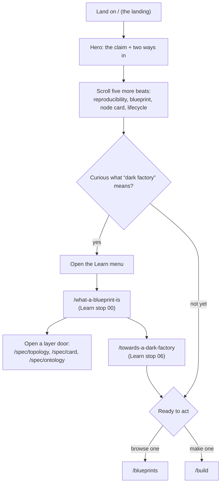

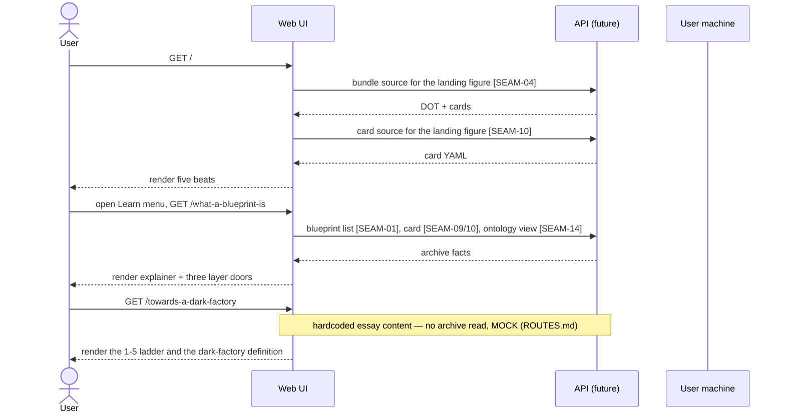

---

## 5.2 · Guided onboarding from node template to downloadable factory

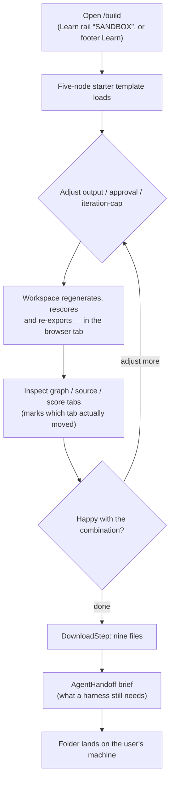

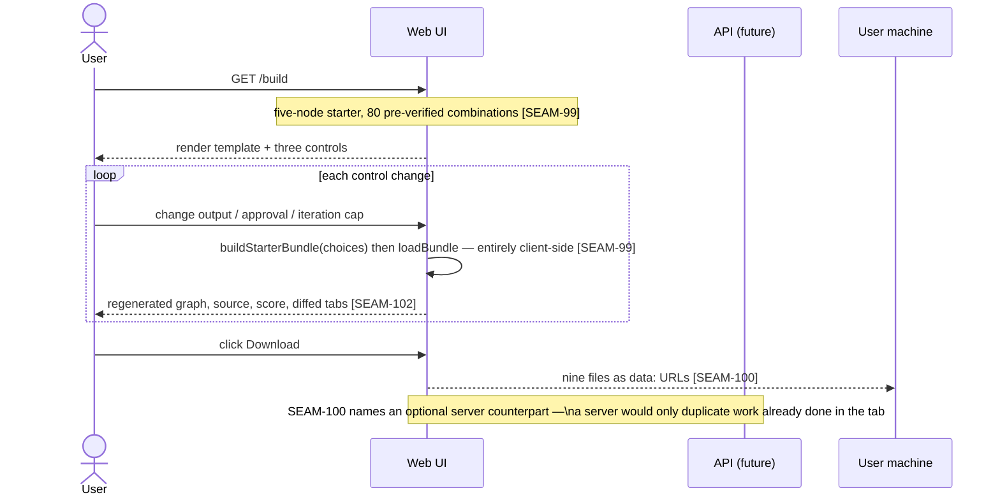

---

## 5.3 · Browsing and opening a blueprint

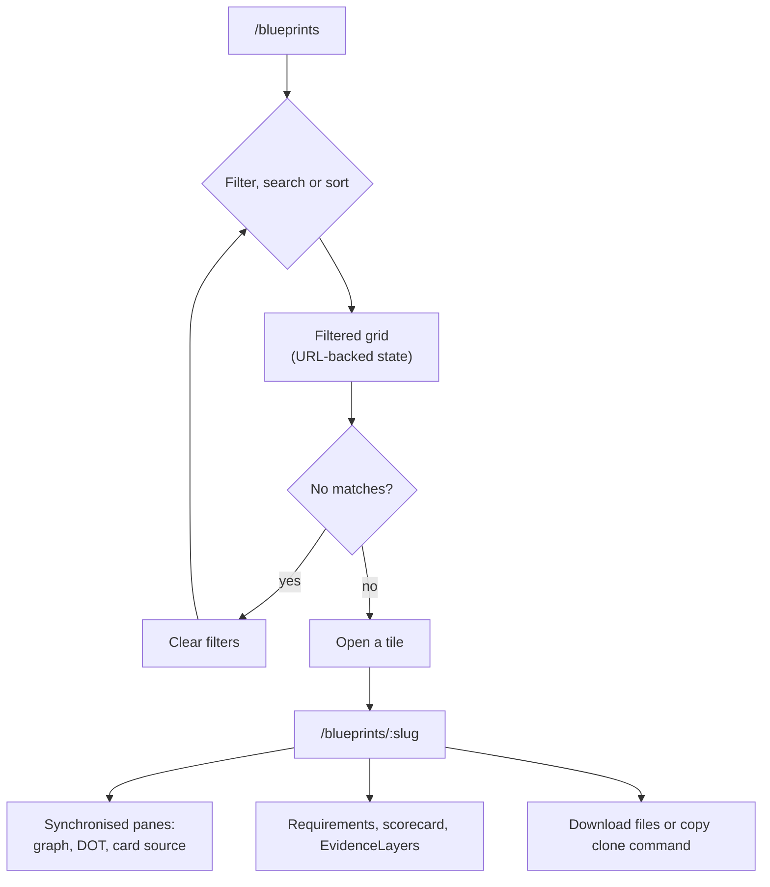

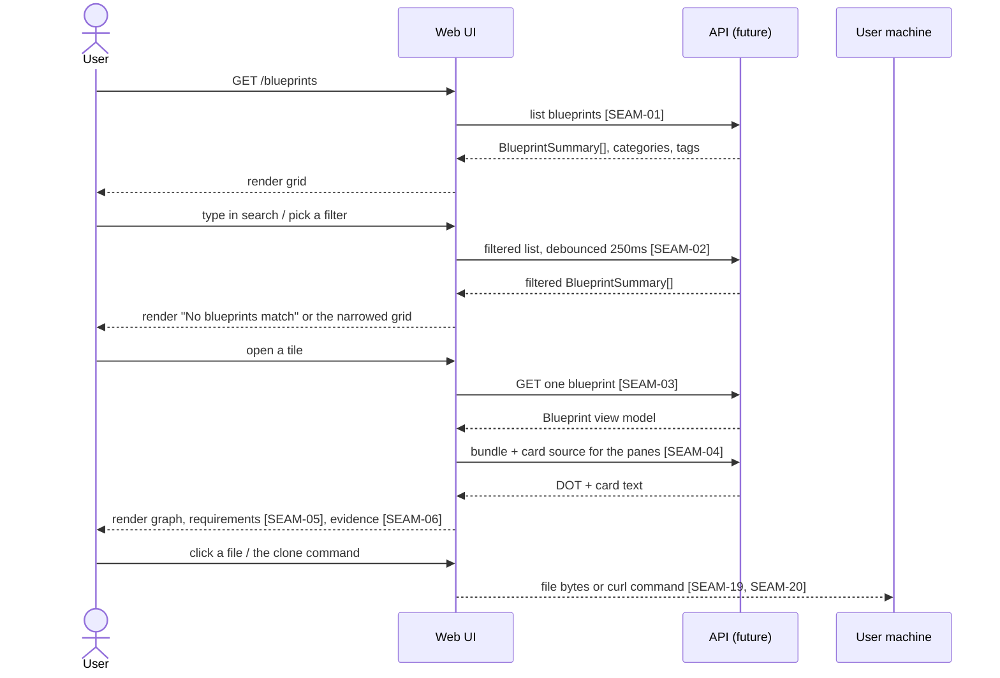

---

## 5.4 · Uploading and evaluating a blueprint

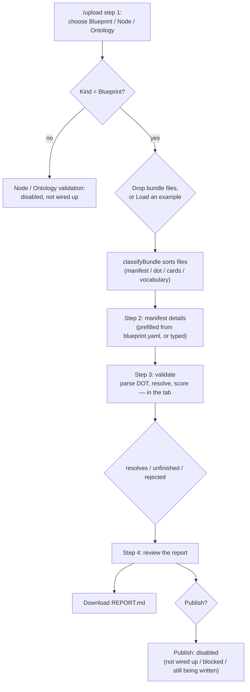

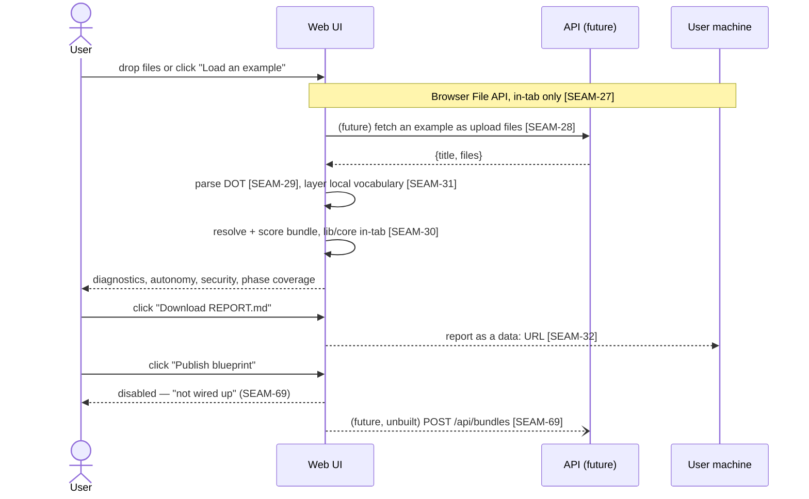

---

## 5.5 · Running a blueprint locally

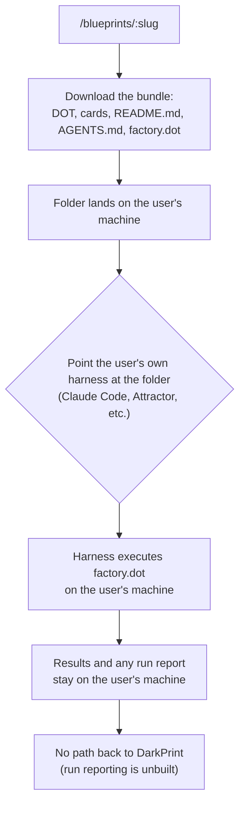

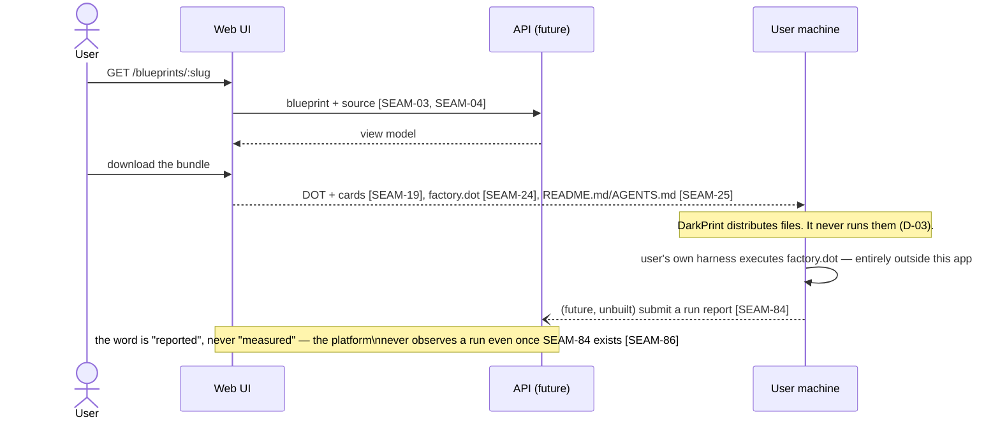

---

## 5.6 · Signing in and finishing an account

Signing in is real and completes end to end: `GET /api/auth/github/login` starts B-02's
OAuth dance, the callback exchanges the code, upserts the account and mints the session
cookie. What the callback CANNOT do is choose a handle — T050 AC1 makes a session with
`handle: null` "signed in and INCOMPLETE", because a handle is allocated once and reserved
permanently (T070) and the registry may not pick one on a reader's behalf.

That unfinished state used to have nowhere to go: the callback redirected to `/` and a
reader arrived signed in with no visible difference from being signed out, having to find
`/settings` unaided to discover the one field gating publishing. `/welcome` closes it — the
callback sends a null-handle account there, and the route bounces a finished account back
to `/`, so it is safe to link at any time.

**Still not reachable from here:** the MCP server and the CLI are `private: true` and
unpublished, so `npx -y darkprint mcp` fails for a reader even though both run locally
against a dev server (`DARKPRINT_URL`). Registration does not unlock them; publishing to
npm would.

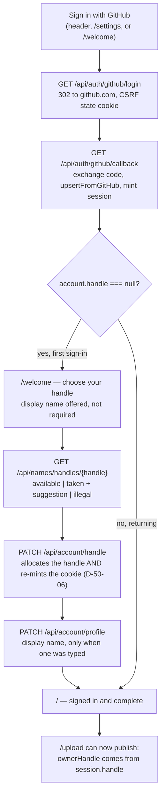

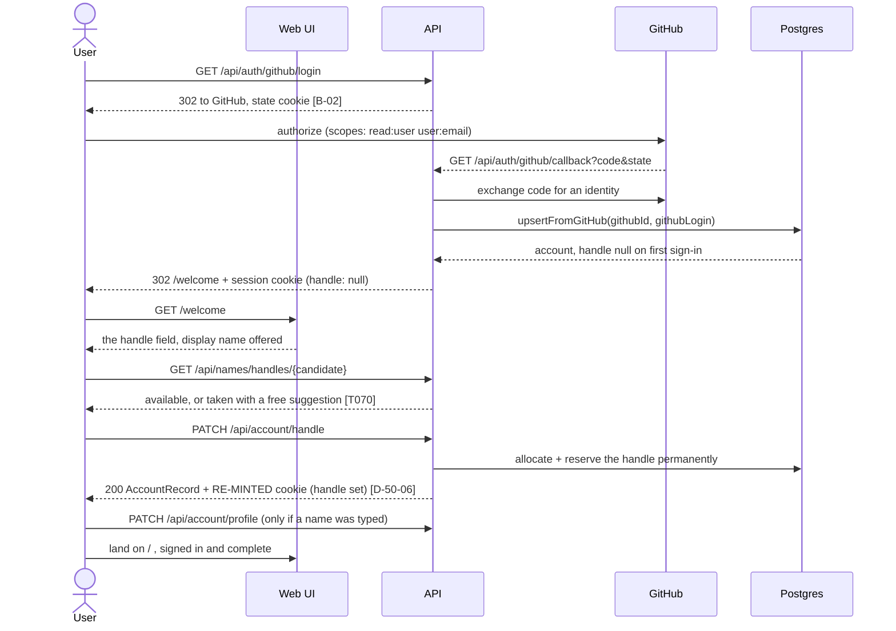
