# 5 · User journeys

[← Back to the index](../ARCHITECTURE.md)

Each journey is a `flowchart` of screens and decisions, followed by a `sequenceDiagram`
with actors `User`, `Web UI`, `API (future)` and `User machine`. Every call across the
`Web UI` / `API (future)` boundary cites the `SEAM` id it corresponds to
([8 · Backend contract seams](seams.md)). A **solid** arrow into `API (future)` is a call
this document proposes for the backend; today, every one of those calls is actually a
build-time read or an in-tab computation, never a real network request — the sequence
diagrams draw the boundary where a real request would cross once a backend exists. A
**dashed** arrow marks something that is explicitly unbuilt today (per the seam's own
`PLANNED` status), so the reader can see which parts of the journey are real now and which
are the proposal.

---

## 5.1 · First visit and understanding what a dark factory is

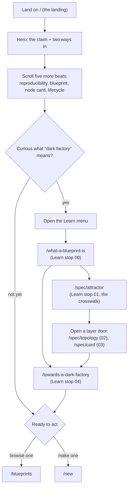

**The order of the two middle boxes reversed on 2026-09-06 and the reason is the reader's,
not the diagram's.** The crosswalk was stop 04, after three DarkPrint documents, and a
reader who already knew Attractor met `card=` and `in=` in a shipped `topology.dot` three
pages before anything told them those attributes are DarkPrint's own. Attractor is now the
first thing the sequence says. The layer doors dropped from three to two in the same change:
`/spec/ontology` folded into `/spec/card`, because every ontology term exists to be a legal
value of a card field ([`DECISIONS.md`](../DECISIONS.md) D-156).

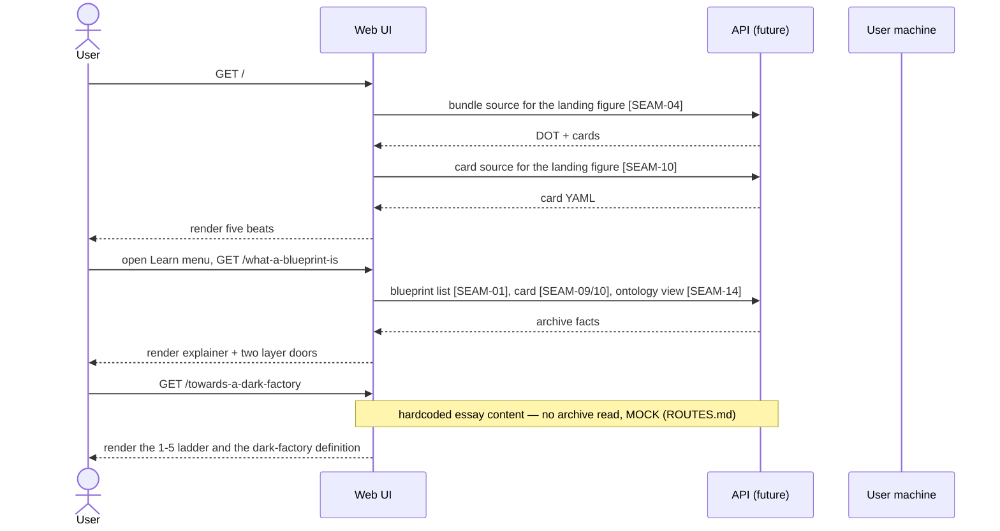

---

## 5.2 · ~~Guided onboarding from node template to downloadable factory~~ RETIRED

> **RETIRED 2026-09-06: every screen in this journey is deleted.** The owner removed
> `/build` and `components/build/**` (*"it is not useful and make confusion"*,
> [`DECISIONS.md`](../DECISIONS.md) D-145), so the entry point, the workspace, the tab
> diffing, `DownloadStep` and `AgentHandoff` are all gone, and SEAM-99 to SEAM-102 are
> retired in place in [8 · Seams](seams.md) §N.
>
> **The section number and the two diagrams stay**, and neither is tidiness. The numbers
> are how every citation of this file addresses a journey, and renumbering 5.3 to 5.7
> would break them all to close one gap. The diagrams are the record of a path this site
> genuinely offered: a reader could change three controls and watch a real bundle be
> regenerated, rescored and re-exported in the tab, and **no journey in this document
> replaces it.** What is left of that shape is `/upload`, which validates a folder the
> reader already has rather than composing one, and §5.7, which reserves a blueprint and
> then sends the reader to their own machine to write it.
>
> **Read the two diagrams below as history, not as a route.** They describe screens that
> no longer exist.

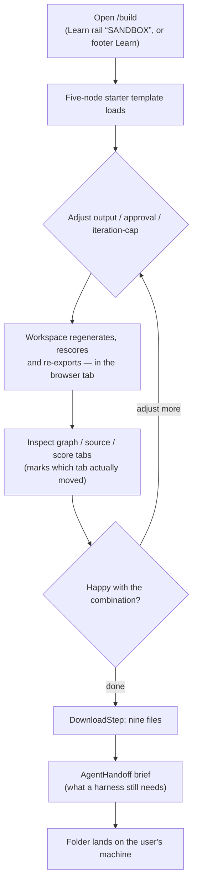

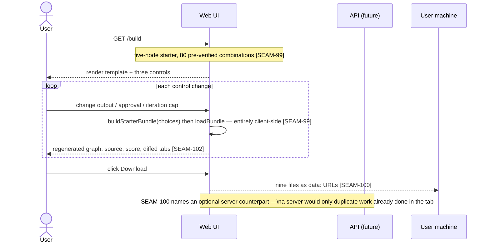

---

## 5.3 · Browsing and opening a blueprint

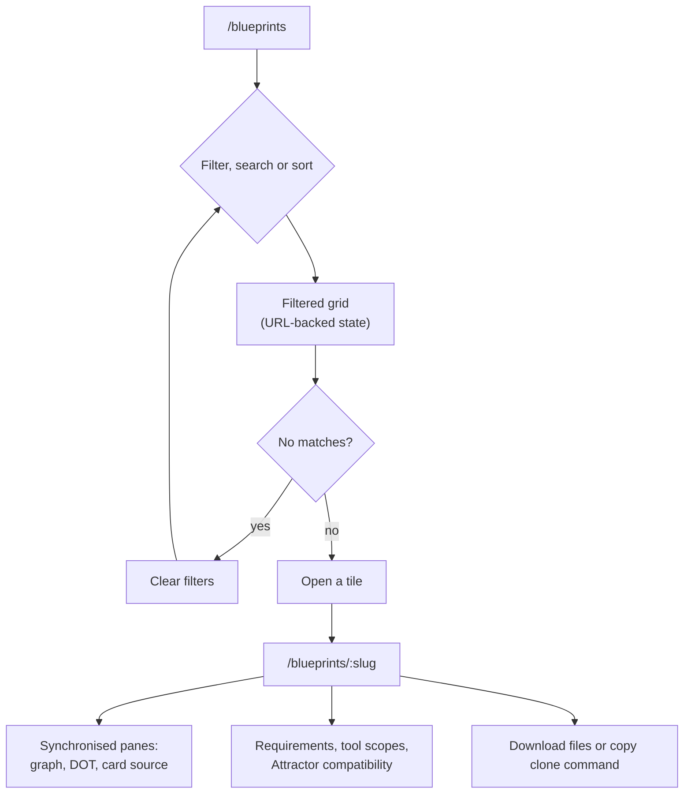

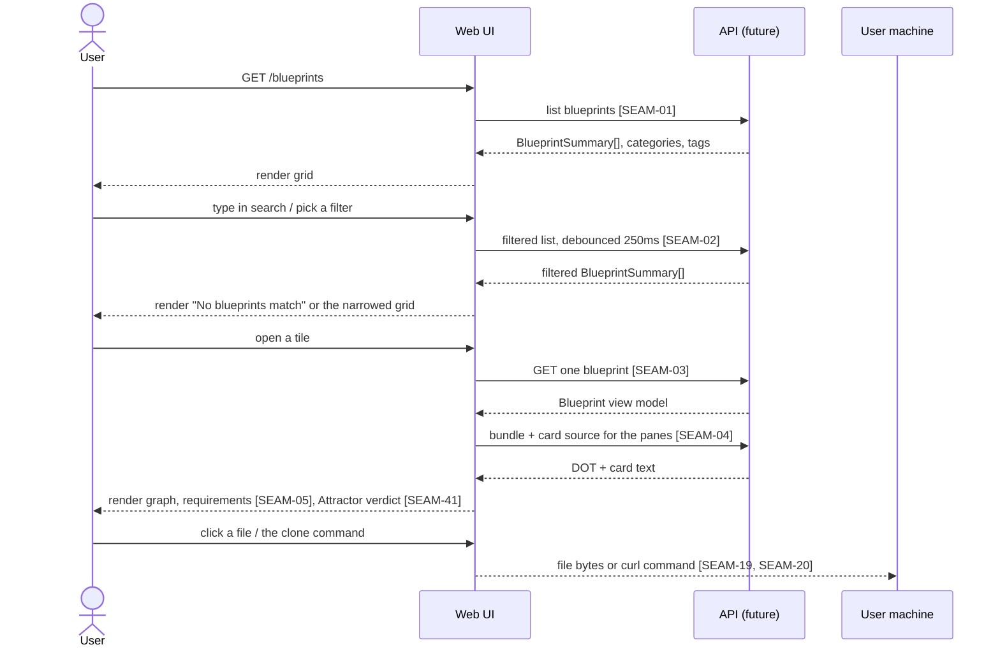

**This journey lost its scoring stop on 2026-09-04.** The `evidence` node named
"Requirements, scorecard, `EvidenceLayers`" and the sequence hopped `SEAM-06`; the owner
asked the whole scoring reading off `/blueprints/{owner}/{slug}`, so the Score panel, the
ballot, the header autonomy meter, the explainability panel and the evidence layers all
came off and `EvidenceLayers` was deleted. **There is no longer a stop anywhere in this
journey that walks a reader from the graph to a score, a ballot or an explainability
panel.** A reader who wants a scored reading now gets it from a graph they are holding:
`/upload`'s validation report, and that is **one surface rather than two since 2026-09-06**, when `/build` was deleted (D-145) — the workspace named here was the other one. ~~`SEAM-41`'s Attractor verdict is
what stayed on the detail page.~~ **It did not stay: `AttractorCompatibility.tsx` was
unmounted with the rest on 2026-09-04 and DELETED on 2026-09-05** (`docs/ARCHITECTURE.md`
§11.0 Q30), so nothing on this page renders an engine reading of any kind now. The ballot
went further the same day — `GET`/`POST /api/blueprints/{owner}/{slug}/votes` and the write
path under it are deleted (§11.0 Q14), so the missing stop is no longer a stop that could be
restored by re-mounting a panel.

---

## 5.4 · Uploading and evaluating a blueprint

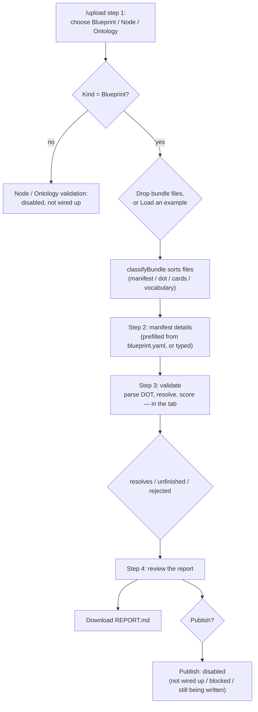

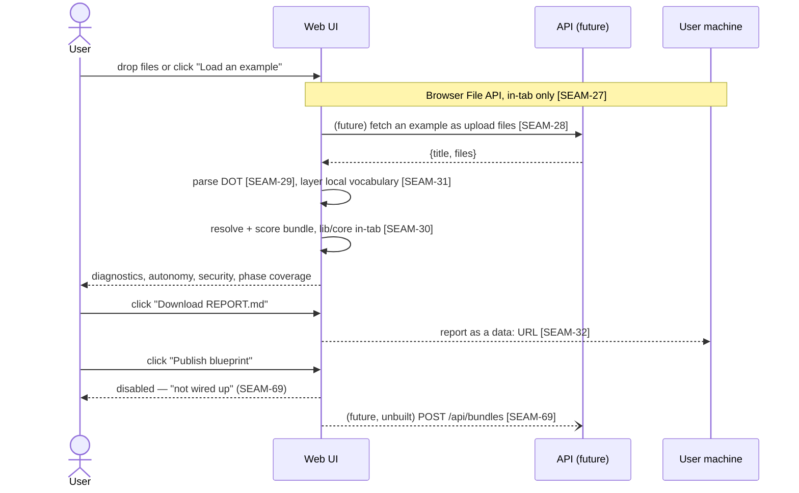

---

## 5.5 · Running a blueprint locally

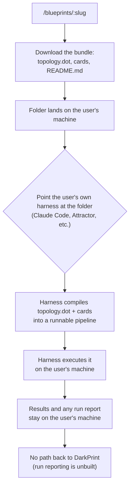

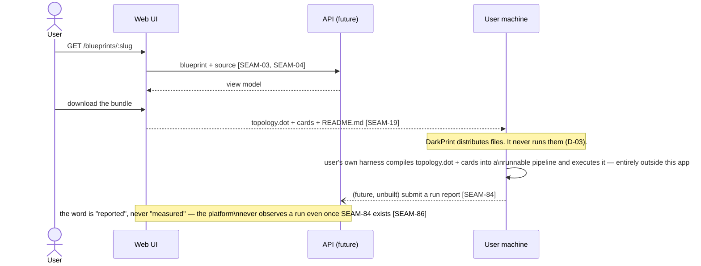

---

## 5.6 · Signing in and finishing an account

Signing in is real and completes end to end, **through either of two providers** since
2026-08-25: `GET /api/auth/github/login` or `GET /api/auth/google/login` starts B-02's
OAuth dance, the callback exchanges the code, upserts the account and mints the session
cookie. What the callback CANNOT do is choose a handle — T050 AC1 makes a session with
`handle: null` "signed in and INCOMPLETE", because a handle is allocated once and reserved
permanently (T070) and the registry may not pick one on a reader's behalf.

That unfinished state used to have nowhere to go: the callback redirected to `/` and a
reader arrived signed in with no visible difference from being signed out, having to find
`/settings` unaided to discover the one field gating publishing. `/welcome` closes it — the
callback sends a null-handle account there, and the route bounces a finished account back
to `/`, so it is safe to link at any time.

**Two providers, one account, when the address is proven.** A Google identity whose
**verified** address already belongs to an account links to it (`resolveFromProvider`,
`lib/server/accounts/identities.ts`) instead of minting a second one — so a reader who used
GitHub in January and Google in March lands in the same place. An **unverified** address
never links: that is the account-takeover path, and the cost of refusing is a duplicate
account, which is recoverable.

**Still not reachable from here:** the MCP server and the CLI are `private: true` and
unpublished, so `npx -y darkprint mcp` fails for a reader even though both run locally
against a dev server (`DARKPRINT_URL`). Registration does not unlock them; publishing to
npm would.

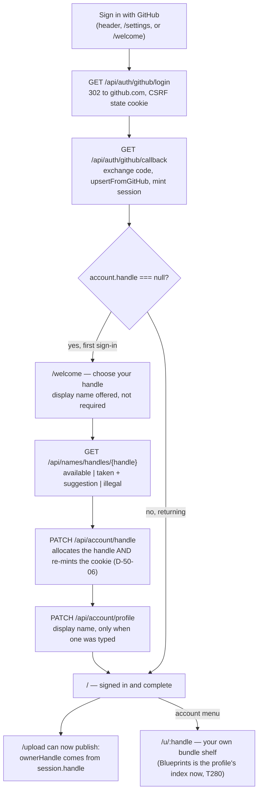

**Where a completed account's own content lives (T280).** Before this wave, `/u/[username]`
was the profile's overview: pinned items and local terms only, with the reader's actual
blueprints a click away on `/u/[username]/blueprints`. Blueprints took the segmentless slot
instead — the account menu's own link now opens straight onto the shelf a signed-in reader
came for, Pinned sitting above it rather than in front of it. §5.7 picks up from `myShelf`'s
own `New bundle` button.

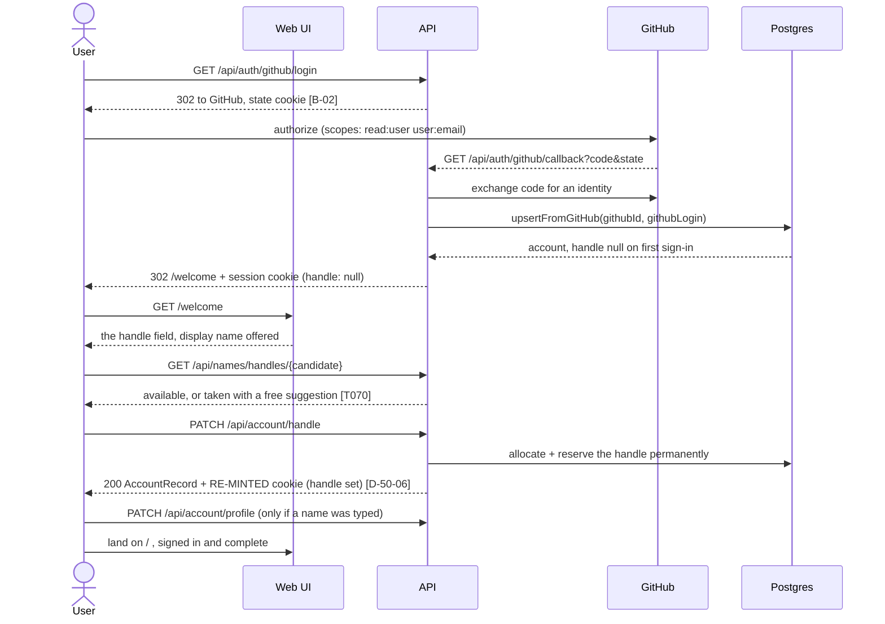

---

## 5.7 · Creating a blueprint from a blank slate

Added 2026-08-25 (T280, `0007_drafts`). Real end to end, over a complete account
(§5.6): a blueprint may now exist as a row before it has a release — GitHub's empty-repo
state — reserved on `/new`, built locally by whichever means the reader chooses, and
published into the same slug from `/upload`. `publish()` on that last step is an APPEND
to the bundle `/new` already created, not a second creation — `PublishResult.created` is
`false` the whole way through this journey, and true only for a bundle `/upload` creates
from a bare graph with no `/new` visit first (§5.4, unchanged).

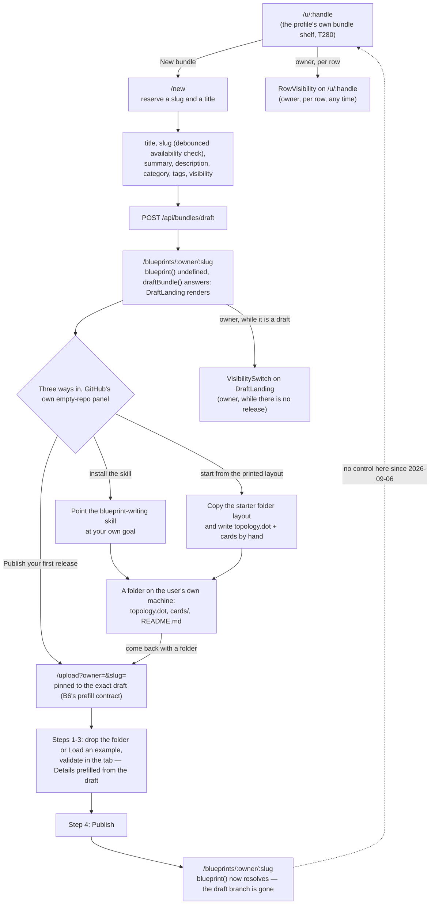

**Visibility moved off the blueprint page on 2026-09-06 and this diagram is the record of
where it went** (owner's instruction, [`DECISIONS.md`](../DECISIONS.md) D-146: *"remove the
panel visibility from the blueprint card; such option should be visible only on the user
account list of the blueprints"*). SEAM-67 stays LIVE and the write is the same `PATCH
/api/bundles/{owner}/{slug}/visibility` it always was; what changed is the surface. There are
two mounts now and they do not overlap: `RowVisibility` on the shelf, one control per row,
for a bundle at any stage — and the `VisibilitySwitch` `DraftLanding` still draws, which is
the only place an owner meets a bundle that has no release yet without going through the
shelf. **The published detail page now renders the same thing for the owner and for a
stranger**, which is why the dotted edge above points a reader back to the shelf rather than
naming a control on the page: `app/blueprints/[owner]/[slug]/page.tsx:324-331` records that
`isOwner` lost its last reader on that branch in the same edit.

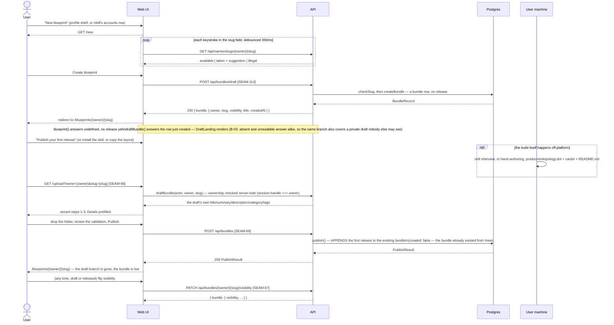
