# 4 · Sitemap and routing

[← Back to the index](../ARCHITECTURE.md)

Carried over unchanged from Phase 2A's `ROUTES.md`. Do not renumber or re-derive; if a row
looks wrong, raise it, don't edit it here.

## Cross-check against the build

| Source | Count |
|---|---:|
| `page.tsx` files under `app/` | 26 |
| Prerendered routes in `.next/prerender-manifest.json` | 14 |
| `dynamicRoutes` patterns in the manifest | 0 |

Re-derived from a clean `npm run build` against the T280 working tree (base commit
`ad12f87`, `/new` and `0007_drafts` uncommitted on top of it). Two changes since the
T261 merge (`97acee5`) that first re-derived this table at 25/14/0, and two since T280:

1. **`/new` adds a 27th `page.tsx`, and the 25→27 gap is not one page** — `/welcome`
   (T050, merged after the T261 re-derivation) was never folded into this count either;
   this pass catches up both additions rather than only the one T280 makes.
2. **`/upload` drops out of the prerendered set, 14→12 net of the one addition.**
   `?owner=&slug=` (T280) resolves through `readSession()` inside a `Suspense` boundary
   (`app/upload/page.tsx`'s own header explains the split), but this build has no
   `experimental.ppr` — without partial prerendering, one dynamic API anywhere in the
   tree still marks the whole route `ƒ`, Suspense boundary or not; the build's own table
   prints `/upload` as `ƒ` where it used to print `○`.
3. **`/capabilities` and `/tutorial` add the 28th and 29th `page.tsx`, and both prerender**
   (2026-09-02), taking the static set 12 → 14. Neither reads a request: `/capabilities`
   renders from imported module tables and `/tutorial` is a shell around a client
   component. `/capabilities` importing `packages/mcp/src/tools` pulls the CLI barrel and
   `lib/server/engine` into the server graph and does not make the route dynamic, because
   nothing on that path touches a request API at module scope.

   The 14 prerendered routes are now exactly: `/`, `/build`, `/capabilities`, `/mcp`,
   `/skill`, the three `/spec/*` pages, `/towards-a-dark-factory`, `/tutorial`,
   `/what-a-blueprint-is` (11 page routes) plus the three framework-owned entries
   `/_global-error`, `/_not-found`, `/icon.svg`.
4. **`/reading-the-radar` was deleted on 2026-09-04, taking the `page.tsx` count 29 → 28
   and moving the prerendered count not at all.** It carried
   `export const dynamic = "force-dynamic"` — a page whose subject was what live numbers
   mean could not promise a build-time reading of them — so it was never in the static set,
   and the list above is unchanged. The 28 was re-derived by counting `page.tsx` under
   `app/` in the working tree rather than off a build, because the deletion is uncommitted
   and `npm run build`'s prebuild rewrites `public/**`; the prerendered figure is carried
   forward from the 2026-09-02 build with the reasoning above, not re-measured.
5. **Re-derived again on 2026-09-05 and it did not move: still 28.** The wave of that date
   removed three PANELS from `/nodes/[...id]` and none of them was a route, deleted no
   `page.tsx` and added none. `find app -name page.tsx | wc -l` answers 28 against the
   working tree. The prerendered figure is carried forward again for the same reason as
   note 4 — the wave is uncommitted and `prebuild` rewrites `public/**` — so **14/0 are
   the 2026-09-02 build's numbers, not measurements of this tree.**

7. **A second 2026-09-06 ruling took the count 28 → 27, and it is the FIRST profile tab
   ever removed.** The owner deleted the profile's Ontology terms section, in these words:
   *"remove the section Ontology terms"* (quoted at `components/profile/tabs.ts:65-79`,
   beside the table the tab strip is built from), together with the profile header's
   `downloads` and `validated` figures. `app/u/[username]/terms/page.tsx` went with it and
   **`find app -name page.tsx | wc -l` answers 27 against the working tree.** The
   prerendered figure is carried forward again for the same reason as notes 4 and 5: the
   wave is uncommitted and `prebuild` rewrites `public/**`, so 14/0 remain the 2026-09-02
   build's numbers. **Two consequences that are not visible from the row's absence.**
   (a) **`terms` is no longer a reserved profile slug**, because
   `RESERVED_PROFILE_SEGMENTS` is derived from the tab table rather than written out, so a
   bundle may now be called `terms`. That is correct rather than incidental — the
   reservation exists so a slug cannot shadow a tab's route, and there is no such route now.
   The `/api/names/slugs/{owner}/{slug}` row below is corrected from three reserved
   segments to two. (b) **SEAM-60 (`GET /api/authors/{handle}/terms`) lost its only anchor
   in the tree** with that file, which is why it now appears in
   `scripts/check-docs-drift.mjs`'s "in the doc, missing from the code" list.
   **The vocabulary itself is untouched**: a local term is still namespaced by the handle
   that minted it, the browser still lists local terms as local, and the extension model is
   still specified. What left is one PROFILE VIEW of that data, not the data. (This
   sentence named `/ontology` and `/spec/ontology` as two routes when it was written, and
   note 7 folded them into one later the same day. It is corrected in place rather than
   annotated, because the claim it makes — the data did not move — is still exactly true.)

6. **The 2026-09-06 wave swapped one route for another and the total held at 28.** The
   owner deleted `/build` and `components/build/**` ("it is not useful and make
   confusion") and `/spec/attractor` shipped in the same wave, so
   `find app -name page.tsx | wc -l` still answers 28 against the working tree.
   **Note 3's list of the fourteen prerendered routes names `/build` and is stale in
   that one entry.** It is left as written rather than edited, because the entry it
   would gain has not been measured: `/spec/attractor` reads `allNodeCards` and
   `getOntologyView` at module scope and touches no request API, which is the same
   shape the three prerendered `/spec/*` pages have, but a shape is a prediction and
   this wave is uncommitted with `prebuild` rewriting `public/**`, so no build was
   run to check it. **Read 14/0 as the 2026-09-02 build's numbers minus a route that
   no longer exists**, and re-derive them off a real build before quoting them.

7. **`/ontology` is deleted on the owner's instruction and the total is 26.** The words
   were *"move the ontology page in the /spec/ontology substituing the \"every term\" box.
   Then, you can delete the /ontology page"*. The vocabulary browser is now a band on
   `/spec/ontology`, in the slot the `Every term →` route box held, and
   `app/ontology/page.tsx` is gone. **`find app -name page.tsx | wc -l` answers 26 against
   the working tree**, walked rather than decremented, which is the seventh consecutive
   pass to re-derive this number rather than carry arithmetic on the one before it.
   **`app/ontology/[...term]/page.tsx` did NOT move and every term URL is unchanged**, which
   is deliberate and is the one thing to read before tidying this later: `/ontology/<term>`
   still resolves while `/ontology` itself 308s to `/spec/ontology`. A redirect `source` is
   an exact path, so the new 308 cannot shadow the catch-all under it, and moving term
   detail under `/spec/ontology/` would change every term URL the site has ever emitted.
   **The prerendered figure is carried forward again and this wave makes it stale in a
   NEW way, which is worth naming rather than leaving in the carry.** `/ontology` was never
   in the static set — it has rendered per request since T260 — but the page it moved onto
   was. `/spec/ontology` is one of the three `/spec/*` pages note 3 enumerates among the
   fourteen, and it now carries `export const dynamic = "force-dynamic"`
   (`app/spec/ontology/page.tsx:169`), because the browser's registry read is per-request
   and a registry read on a prerendered page is a live read the build hides. So the static
   set loses a member it had at every earlier reading, and the honest expectation is 13
   rather than 14. **It is an expectation and not a measurement**: the wave is uncommitted,
   `prebuild` rewrites `public/**`, and no build was run. Re-derive 14/0 off a real build
   before quoting either number, and read note 3's list as naming `/spec/ontology` among
   the prerendered when it is not one any more.

The build's own route table still prints only `○ (Static)` and `ƒ (Dynamic)` — every
registry-reading page renders per request since T261 and appears in neither manifest
map, and the `● (SSG)` legend line stays gone because nothing uses
`generateStaticParams` any more. The old reconciliation (24/27/26/165) died with the
instance-level prerendering it counted.

## Access

There is no authentication anywhere in the repository. Every route is public; since the
T260/T261 cutovers the registry-reading routes render per request and only the static
content pages are prerendered. Four routes render an **owner view** selected by comparing the
requested handle against a fixture (`components/profile/load.ts:78`,
`ACCOUNT.author.username` at `lib/data/account.ts:77`); the owner view is a *page*, not a
session state, and both variants ship in the build. Those are marked `public · owner-view
by fixture`.

## Status tags

- `LIVE` — the page's data comes from `content/` through `lib/content`, resolved and
  scored by `lib/core` at build time. The behaviour on screen is real.
- `MOCK` — the page's data comes from `lib/data/**` fixtures or from constants declared in
  the page.
- `PLANNED` — the UI shell exists and the behaviour behind it does not.

A page reading both sources carries both tags with the split named.

## The API routes

Added 2026-08-15. These are `route.ts` handlers under `app/api/`, not pages, so the page status
tags above do not apply to them: each is **backed by a real module and a real Postgres read**, which
is what "LIVE" means everywhere else in this document. They are listed here because section 4 is the
sitemap and a sitemap that records only `page.tsx` reads as complete while describing half the tree.

Every response is B-03's envelope — `application/json` at 200, RFC 9457 `application/problem+json`
on failure. Every registry read takes an `Actor` derived from the request and filters through
`server/policy`, so "not visible to you" and "does not exist" are one answer by construction (B-03):
a 404 detail that differed between them would reinstate the existence leak the status code closes.

| Path | File | Method | Access | Purpose | Seam |
|---|---|---|---|---|---|
| `/api/auth/github/login` | `app/api/auth/github/login/route.ts` | GET | public | Starts the GitHub OAuth exchange (B-02): mints a CSRF state, stashes it in a short-lived cookie, redirects to GitHub. Touches no database — the identity does not exist yet, only the request for one | — |
| `/api/auth/github/callback` | `app/api/auth/github/callback/route.ts` | GET | public | Finishes the exchange: verifies state, upserts a bare `account` row keyed by GitHub id, sets the session cookie. `handle` stays null until T070/T050 allocate one, which is why `SessionPayload.handle` is nullable. **Not exercisable end to end** — no real GitHub OAuth App credentials exist yet | — |
| `/api/auth/google/login` | `app/api/auth/google/login/route.ts` | GET | public | Starts Google's OAuth dance: mints the same CSRF state cookie the GitHub pair uses and 302s to Google with `openid email profile` — non-sensitive scopes only, so no Google security review is required. `400` when `GOOGLE_CLIENT_ID` is unset, so an unconfigured deployment refuses rather than sending a reader to a broken consent screen | — |
| `/api/auth/google/callback` | `app/api/auth/google/callback/route.ts` | GET | public (state-verified) | Exchanges the code, then resolves through **`resolveFromProvider`**, not `upsertFromGitHub`: a Google identity whose **verified** address already belongs to an account joins it; an unverified address never links (account-takeover path). `handle: null` lands on `/welcome` exactly as the GitHub callback does. `502 problem+json` `google-oauth-failed` when Google refuses | — |
| `/api/auth/logout` | `app/api/auth/logout/route.ts` | POST | public | Clears the session cookie and answers **303 to `/`**. Its caller is an HTML form, and a form submission navigates — a JSON body left the reader on a blank page with the site gone. 303 rather than 302 because 303 is the status that mandates a GET follow-up. No database and no GitHub, so unlike the pair above this one is fully exercisable today | — |
| `/api/auth/session` | `app/api/auth/session/route.ts` | GET | session required | The guarded-handler shape every later task's routes follow: no session reaches the handler, and the refusal is `problem+json` 401 with no body from the handler at all | — |
| `/api/blueprints` | `app/api/blueprints/route.ts` | GET | public, actor-filtered | The gallery's list. Nothing on this route can 404: "no blueprints you may see" is an empty list, not a failure | SEAM-01 |
| `/api/blueprints/[owner]/[slug]` | `app/api/blueprints/[owner]/[slug]/route.ts` | GET | public, actor-filtered | One blueprint under B-09's two-part key, with its scores. One 404 detail string for a key nothing holds and for a bundle the caller may not see — the reader returns one value for both, so no branch here could tell them apart even by accident | SEAM-03 (partial: two-part key, not `{slug}`) |
| `/api/cards` | `app/api/cards/route.ts` | GET | public, actor-filtered | The node library. `cards()` rather than `latestCards()`: the published shape is every indexed version, and which of them to show is the caller's decision | SEAM-07 |
| `/api/cards/[...ref]` | `app/api/cards/[...ref]/route.ts` | GET | public, actor-filtered | One card by ref, plus the namespaced forms of `versions` and `users`. A catch-all because `CARD_ID` admits one `owner/name` pair, so `berti/solver-a` spans two segments and a literal `[id]/versions` folder could not express it — the same reason `/nodes/[...id]` is a catch-all. Dispatch is total, not heuristic | SEAM-09 |
| `/api/cards/[id]/versions` | `app/api/cards/[id]/versions/route.ts` | GET | public, actor-filtered | Every indexed version of one card id, newest first. Empty for an id nothing pins **and** for one whose every version is private to somebody else — the same value, for B-03's reason. Single-segment ids only; the catch-all beside it answers identically for namespaced ones | — |
| `/api/cards/[id]/users` | `app/api/cards/[id]/users/route.ts` | GET | public, actor-filtered | Blueprints using any version of one card id, distinct and sorted | — |
| `/api/cards/duplicates` | `app/api/cards/duplicates/route.ts` | GET | public, actor-filtered | Cards saying the same thing under different refs. A static segment, matched before the catch-all beside it, and it can never shadow a card because a pinned ref always carries `@version` and this path has none | SEAM-13 |
| `/api/search/blueprints` | `app/api/search/blueprints/route.ts` | GET | **public-only, for EVERY caller** | Search over the blueprint shelf: `q, tag, cat, phase, autonomy, df, forks, sort`. **GET rather than SEAM-93's proposed POST, and the contract's own justification decides it — the parameter sets are fixed by the live URLs so a shared link may not break, and a POST body is not a link.** `forks` defaults to **`rolled`**, matching `GalleryBrowser`, because T260's cutover would otherwise change that page's shelf unless it remembered to send the key (D-200-37). An empty result is **200 with populated facets**, never a 404 | SEAM-93 (superseded), SEAM-88 |
| `/api/search/cards` | `app/api/search/cards/route.ts` | GET | **public-only, for EVERY caller** | Search over the node library: `q, type, phase, human, risk, sort`. `sort` takes `used \| name \| type \| phase` and **a recognised value must actually reorder** (D-200-23); an unrecognised one falls back rather than erroring, the same rule an unknown key gets. `q` reaches the card `spec`, diverging from `lib/core`'s pinned corpus **on purpose** (D-200-29): that exclusion is right for an unranked substring filter, and what makes it safe here is the rank and the visible `spec:<token>` evidence item | SEAM-08 (partial) |
| `/api/search/terms` | `app/api/search/terms/route.ts` | GET | **public-only, for EVERY caller** | Search over the ontology: `q, kind, origin`, with `origin` taking **three** values — `core`, `local`, `deprecated`. **Reads BOTH corpora** (D-200-17): `ontology_term` holds the registry's terms while a local term travels on `release.local_vocabulary`, so `origin=local` would filter nothing forever if this read only the table. **A private bundle's local terms are private content that inherits a visibility without being a row that has one** — the least obvious of the three AC4 surfaces | — |
| `/api/transfer` | `app/api/transfer/route.ts` | POST | owner | Move a bundle to another account: `{bundleId, toHandle}`. Statuses off `TransferRefusedKind`; transfer to a tombstone answers `no account holds` (D-120-19) | — |
| `/api/transfer/plan` | `app/api/transfer/plan/route.ts` | GET | owner | Preview: `{plan: TransferPlan}`. A collision previews as `200 collides: true`, never 409 — a preview that refused would be the act | — |
| `/api/account/delete` | `app/api/account/delete/route.ts` | POST | session account | Delete yourself: bare `200 DeletionPlan` (D-120-19) — the one irreversible operation answers with what it destroyed | — |
| `/api/account/delete/plan` | `app/api/account/delete/plan/route.ts` | GET | session account | Preview: `{plan: DeletionPlan}`, four outcome-partitioned figures (D-120-15) | — |
| `/api/mcp/search` | `app/api/mcp/search/route.ts` | GET | public-only, rate-limited `read` | The MCP search operation: merged blueprint+card hits, `{q: task}` raw, evidence carried, `ordered` composed (D-220-13/14/16) | SEAM-88 |
| `/api/mcp/cards/[...ref]` | `app/api/mcp/cards/[...ref]/route.ts` | GET | public-only, rate-limited `read` | Card YAML by `id@version` via `resolveCardRef(...).source` — NOT `serveCard`, whose `recordDownload` would make every agent poll a download event the shelf prints as *most used* (D-220-16) | SEAM-89 |
| `/api/mcp/blueprints/[owner]/[slug]/provenance` | `app/api/mcp/blueprints/[owner]/[slug]/provenance/route.ts` | GET | public-only, rate-limited `read` | `Provenance`: publishedBy handle, releases, `forkedFrom` omitted whole for an unreadable upstream (D-220-05) | SEAM-90 |
| `/api/mcp/releases/[owner]/[slug]/d/[digest]` | `app/api/mcp/releases/[owner]/[slug]/d/[digest]/route.ts` | GET | public-only, rate-limited `read` | The release FILE LIST (names, not bytes — the bytes have a route, and serving them twice differs in download accounting, D-220-16) | SEAM-91 |
| `/api/ontology-usage` | `app/api/ontology-usage/route.ts` | GET | public, actor-inert | Every counted term's usage — `{usage: TermUsage[]}`, the whole list (a map keyed by termId would drop what nothing names, D-210-09). Zero-not-404 is the module's property | SEAM-17 |
| `/api/ontology-usage/candidates` | `app/api/ontology-usage/candidates/route.ts` | GET | public, actor-inert | Every counted LOCAL term with counts and both threshold booleans (D-210-02); the eligible subset is the derived quantity | SEAM-18 |
| `/api/ontology/categories` | `app/api/ontology/categories/route.ts` | GET | public, actor-filtered | The gallery's category facet, over the blueprints the caller may see | — |
| `/api/ontology/tags` | `app/api/ontology/tags/route.ts` | GET | public, actor-filtered | The gallery's tag facet, over the blueprints the caller may see | — |
| `/api/ontology/phases` | `app/api/ontology/phases/route.ts` | GET | public, actor-filtered | The phases the indexed cards declare, in lifecycle order. Descriptive, never a score: the set of phases that are here, not a fraction of five | — |
| `/api/ontology/phases/[phase]/cards` | `app/api/ontology/phases/[phase]/cards/route.ts` | GET | public, actor-filtered | Cards declaring one phase. A phase no card declares answers 200 with an empty list, never 404 — the bucket is a fact about the index, and that is as true of an arbitrary string as of one of the five, so nothing validates `phase` against a known set first | — |
| `/api/files/blueprints/[owner]/[slug]/v/[version]/[...path]` | `app/api/files/blueprints/[owner]/[slug]/v/[version]/[...path]/route.ts` | GET | public, actor-filtered | One file of a release named by its author-declared semver. Half of D-90-04's split: a **version** reference moves when a newer release is cut | SEAM-19 (partial) |
| `/api/files/blueprints/[owner]/[slug]/d/[digest]/[...path]` | `app/api/files/blueprints/[owner]/[slug]/d/[digest]/[...path]/route.ts` | GET | public, actor-filtered | The same file at the address that does not move. The other half of the split, and the reason it is a URL **segment** and not a query parameter: a reference that has to survive being written down cannot depend on a heuristic reading one segment's shape, so a digest can never resolve as a version by accident | SEAM-19 (partial) |
| `/api/files/cards/[...ref]` | `app/api/files/cards/[...ref]/route.ts` | GET | public, actor-filtered | One card version at an address naming no blueprint. A catch-all because `CARD_ID` admits one namespace segment, so `berti/memory-probe@1.0.0.yaml` arrives as two segments and is one ref | SEAM-10 (partial) |
| `/api/names/handles/[handle]` | `app/api/names/handles/[handle]/route.ts` | GET | public | Is this handle available? Answers `{ available, reason?, suggestion? }` at **200 always** — there is no 404, because "not found" **is** the available answer. `reason` is `taken` (an account holds it), `reserved` (released, and permanently unavailable to any other account) or `illegal` (fails the grammar or the single-segment rule). A suggestion accompanies exactly the first two — you can only offer an alternative to a name that is itself legal | — |
| `/api/names/slugs/[owner]/[slug]` | `app/api/names/slugs/[owner]/[slug]/route.ts` | GET | public | The same question for a bundle slug under an owner, where `[owner]` is a **handle**. Uniqueness is per owner (B-09), so a slug another owner holds is `available`. **TWO** profile-tab slugs — `cards` and `saved` — are `reserved` for **every** owner including one nobody is. **It was three until 2026-09-06**: `terms` left the reserved set when the owner deleted the Ontology terms tab, and it left by ARITHMETIC rather than by an edit, because `RESERVED_PROFILE_SEGMENTS` is derived from the tab table. A bundle may now be called `terms`, because the reserved set is a property of the URL space rather than of an account. `blueprints` left the reserved set at T280: the tab it named took the segmentless slot instead (`components/profile/tabs.ts`'s `RESERVED_PROFILE_SEGMENTS`, filtered to non-empty segments), so a bundle may now be named `blueprints` | — |
| `/api/account` | `app/api/account/route.ts` | GET | session | The signed-in account's own `AccountRecord`. `401` without a session; **`500` `problem+json` `store-failed`** when the store cannot answer (D-50-18) | — |
| `/api/validate/bundle` | `app/api/validate/bundle/route.ts` | POST | public | `{ dot, cardFiles, manifest, vocabulary? }` → `LoadBundleResult` at **200 even with diagnostics** (B-03): a bundle that resolves with errors is an answer. `400 413` | SEAM-30 (superseded — its request shape could not be joined to the module's signatures) |
| `/api/validate/dot` | `app/api/validate/dot/route.ts` | POST | public | `{ dot }` → `{ graph?, diagnostics }`. `400 413` | — |
| `/api/validate/card` | `app/api/validate/card/route.ts` | POST | public | One card source → `{ card?, diagnostics }`. `400 413` | — |
| `/api/validate/ontology` | `app/api/validate/ontology/route.ts` | POST | public | One vocabulary → `{ diagnostics }`. **Vocabulary defects are reported separately from bundle defects.** `400 413` | — |
| `/api/account/profile` | `app/api/account/profile/route.ts` | PATCH | session | `{ displayName?, bio?, avatarHue? }` → `AccountRecord`. `400 401 403 500` | — |
| `/api/account/handle` | `app/api/account/handle/route.ts` | PATCH | session | `{ handle }` → `AccountRecord`. **The one write route that accepts a `handle: null` session** (D-50-05), since it is the route that allocates the first handle. `409` when taken. `400 401 409 500` | — |
| `/api/account/email` | `app/api/account/email/route.ts` | PATCH | session | `{ email }` → `AccountRecord`. Never appears on a public surface. `400 401 403 500` | — |
| `/api/account/default-visibility` | `app/api/account/default-visibility/route.ts` | PATCH | session | `{ visibility }` → `AccountRecord`. `400 401 403 500` | — |
| `/api/account/notifications` | `app/api/account/notifications/route.ts` | GET | session | `200 { preferences }` — the session account's four notification booleans over the published defaults (D-190-05). **No 403** (the handler passes `session.accountId`, so `can` compares an id with itself) and **no 404** (`getPreferences` answers defaults rather than refusing). `401 500` | — |
| `/api/account/notifications` | `app/api/account/notifications/route.ts` | PATCH | session | Partial `{ repin?, fork?, deprecation?, digest? }` → `200 { preferences }`. Body read by `@/lib/server/accounts`' own `readJsonObject`, so one malformed-request condition keeps one vocabulary. `400 401 500` | — |
| `/api/account/notifications/unsubscribe` | `app/api/account/notifications/unsubscribe/route.ts` | GET | **token, NO session** | `?token=` → `200 { kind }` — the kind and never an account id (AC6). The token IS the authority (D-190-05 C6): the click comes out of a mail client, possibly signed out, and the token names one `(account, kind)` pair and dies on use. **404 is one answer for used, never-real and account-gone**, so holding a random string tells you nothing; `400` only for no token at all. GET because mail clients fetch links; the prefetch-consumes-token cost is recorded in the file | — |
| `/api/bundles` | `app/api/bundles/route.ts` | POST | session | `PublishInput` members under their own names, with `vocabulary` crossing as a **YAML string** joined at the route exactly as `/api/validate/bundle` does — `StoredVocabulary` is what crosses the barrel, not the wire. Answers `PublishResult { bundleId, releaseId, digest, created }`. **`created` is a claim about idempotency**: publishing the same bytes twice must be observable as such. Statuses: `conflict` **409**, `not-owner` **404** (B-03, so existence does not leak), `unfinished` / `in-error` / `version-not-higher` **422**, unauthenticated **401** (T000's `withSession`, decided before the handler runs). Four foreign rejections pass through with their messages unaltered: 400 / 422 / 422 / 422 | — |
| `/api/account/keys` | `app/api/account/keys/route.ts` | GET | session | `KeyList = { keys: ApiKeyRecord[] }`, and since 2026-09-05 each record carries **`scope`** (`read` or `write`, §11.0 Q3). **Revoked rows are LISTED rather than filtered** — AC4's observation, not a convenience: a caller must be able to see that a key it revoked is revoked. `ApiKeyRecord` carries no secret and no column could hold one. `401 500` | — |
| `/api/account/keys` | `app/api/account/keys/route.ts` | POST | session | `{ label, scope? }` → `{ record: ApiKeyRecord, secret }`. **`scope` is OPTIONAL and absent means `read`** (§11.0 Q3, 2026-09-05), which is the same grandfathering `0010_key_scope` writes into the column default and for the same reason: a caller that has not learned about scopes mints the least privilege rather than failing. An unknown value is a `400` here rather than something the store has to refuse (`isKeyScope` narrows from `unknown`). **The secret is returned exactly once and is unrecoverable** — stored hashed, and absent from `ApiKeyRecord` by design so that is structural rather than a rule someone remembers. `400 401 500` | — |
| `/api/account/keys/{keyId}` | `app/api/account/keys/[keyId]/route.ts` | DELETE | session | `200` with the resulting `KeyList` rather than `204`, so the revoked row is observable in the same request that revokes it (D-230-11). `401 404 500` | — |
| `/api/account/saves` | `app/api/account/saves/route.ts` | GET | session | `SavesView = { saves: SaveRecord[], count }`. **`count` comes from `countSaves`, never `saves.length`** — one payload, both published functions, so AC3's agreement is observable in a single response. `savedAt` crosses as an ISO string. `401 500` | — |
| `/api/account/saves` | `app/api/account/saves/route.ts` | POST | session | `{ kind, refId }` → `SavesView`. The barrel's own `target`, so the route translates nothing. **Idempotent** (AC2), and answering the resulting view makes that drivable in two requests rather than three. **No 404 on a write**: a write-time existence check on a polymorphic target is an existence oracle. `400 401 500` | — |
| `/api/account/saves` | `app/api/account/saves/route.ts` | DELETE | session | `{ kind, refId }` → `SavesView`. **A body rather than a path segment**, because `refId`'s lexical shape per kind is unpublished and a segment would invent one. `400 401 500` | — |
| `/api/account/saves/migrate` | `app/api/account/saves/migrate/route.ts` | POST | session | `{ targets: { kind, refId }[] }` → `SavesView`. AC5's browser-local migration, idempotent across repeated sign-ins. **No handle required** — an account on its first sign-in has `handle: null`, which is exactly the account this route is for. `400 401 500` | — |
| `/api/authors/[handle]` | `app/api/authors/[handle]/route.ts` | GET | none | `ProfileRecord = { author, joinedAt, counts: { blueprints, terms } }`. **The actor is the SESSION's**, so an owner and a visitor get different records from one route and there is no owner/visitor branch in the module. `404` for a handle nobody holds, `detail` `"author: no such handle."` as a named constant (D-130-12). **500 has two shapes**: `store-failed` when the store cannot answer, and `malformed-stored-vocabulary` when a stored vocabulary is one the parser refuses — **distinguishable by `type`, which is D-130-10's whole content**. `404 500` | — |
| `/api/authors/[handle]/pinned` | `app/api/authors/[handle]/pinned/route.ts` | PUT | session (owner; operator per T060) | T131. `{ pinned: PinnedRef[] }` max 2 -> `200 { pinned }`; `400` arity/shape, `401` no session, `404` non-owner (B-03, never 403). No write-time resolution (D-131-04) | SEAM-55 |
| `/api/authors/[handle]/watch` | `app/api/authors/[handle]/watch/route.ts` | POST, DELETE | session | T131. Idempotent over `setFollow` (D-131-10) -> `200 { watching, watchers }`; `401`, `404`. Wire says `watching`, module says `followedByCaller` (D-131-04(c)) | SEAM-57 |
| `/api/authors/[handle]/support` | `app/api/authors/[handle]/support/route.ts` | POST, DELETE | session | T131. Idempotent over `setSupport` (D-131-10) -> `200 { supported, support }`; `401`, `404`. Support is rows-per-supporter, derived, never a column (D-131-05) | — |
| `/api/auth/github/login` | `app/api/auth/github/login/route.ts` | GET | public | Starts the OAuth exchange | — |
| `/api/auth/github/callback` | `app/api/auth/github/callback/route.ts` | GET | public | Upserts a bare `account` row and sets the session cookie. **A store fault must be observable as an absence: no cookie is issued for a sign-in that did not complete**, since `withSession` never reads the database and the holder would be signed in as an account that does not exist | — |
| `/api/auth/logout` | `app/api/auth/logout/route.ts` | POST | session | Clears the session cookie, then **303 to `/`** so the form submission lands back on the site | — |
| `/api/auth/session` | `app/api/auth/session/route.ts` | GET | public | The current session, or its absence | — |

`TBD:` eleven of these fifteen routes carry no seam id. Four cite one in their own source
(SEAM-01, 07, 09, 13) and are mapped above from that citation rather than from resemblance. The
rest are real endpoints that the seam catalogue, written against the frontend's needs before any
backend existed, has no entry for — the auth four because authentication was never a page-level
seam, and the ontology and per-card facets because the pages that will consume them read `content/`
at build time today. **Open question: does section 8 gain new seam ids for them, or is a route with
no page consuming it deliberately outside the seam model?** Not answerable without deciding what a
seam is for, so it is recorded rather than guessed.

### T280 — the six wired-module route surfaces, plus draft creation

Added 2026-08-25. Five module-only backends (stars T150, notes T170, ballot T160, runs
T180, lineage T110) gain their first route surface here, over a live account model; a
sixth, `0007_drafts`, is new this wave rather than a wired-up module. Sixteen routes at the time; **fifteen survive.** `GET`/`POST /api/blueprints/{owner}/{slug}/votes` was deleted on 2026-09-05 (§11.0 Q14), so of the five modules this wave first gave a route surface to, four keep theirs and `lib/server/ballot` lost its own again.

| Path | File | Method | Access | Purpose | Seam |
|---|---|---|---|---|---|
| `/api/blueprints/{owner}/{slug}/star` | `app/api/blueprints/[owner]/[slug]/star/route.ts` | POST | session | Toggle the caller's star on a blueprint (T150's `toggleStar`). `toggleStar` performs no visibility check by design, so this route enforces B-03 itself — an owner nobody holds, a slug that owner never took, and a bundle this actor may not read all 404 before the toggle runs. Answers `{ signals: SignalState }` | SEAM-75 |
| `/api/cards/{id}/star` | `app/api/cards/[id]/star/route.ts` | POST | session | Toggle the caller's star on a card, keyed by the bare id — never `id@version`, since B-10 aggregates a card's counters per id. `getLatestCard` resolving is this route's whole B-03 gate. `{ signals: SignalState }` | SEAM-76 |
| `/api/blueprints/{owner}/{slug}/notes` | `app/api/blueprints/[owner]/[slug]/notes/route.ts` | GET, POST | GET public, actor-filtered; POST session | List notes (keyset `?after=`, tombstones included; an absent or unreadable parent answers an empty page, never a 404, B-03) / post one (`{ body }`, 1..2000 UTF-16 units, AC5) | SEAM-79, SEAM-82 |
| `/api/blueprints/{owner}/{slug}/notes/{noteId}` | `app/api/blueprints/[owner]/[slug]/notes/[noteId]/route.ts` | PATCH, DELETE | actor-scoped (author, or an operator on either verb) — no `withSession` pre-check; an anonymous caller, a wrong author and a note that does not exist all 404 through the one `NotAccountOwnerError` `denied()` raises (B-03) | Edit / tombstone a note. `[owner]/[slug]` is namespacing only — both verbs authorize off the stored note's own author id, never a target the URL names | SEAM-79 |
| `/api/blueprints/{owner}/{slug}/notes/{noteId}/vote` | `app/api/blueprints/[owner]/[slug]/notes/[noteId]/vote/route.ts` | POST | actor-scoped, a signed-in reader of the note's parent — no `withSession` pre-check; an anonymous caller 404s the same way an unreadable parent does | Idempotent upvote, unique `(noteId, accountId)`; no direction body — a note vote is up-only | SEAM-81 |
| `/api/cards/{id}/notes` | `app/api/cards/[id]/notes/route.ts` | GET, POST | GET public, actor-filtered; POST session | Card mirror of the blueprint notes pair — `refId` is the bare card id, since a note's target is the id, not one version | SEAM-80, SEAM-82 |
| `/api/cards/{id}/notes/{noteId}` | `app/api/cards/[id]/notes/[noteId]/route.ts` | PATCH, DELETE | actor-scoped (author, or an operator on either verb) — no session pre-check, same as the blueprint pair | Card mirror | SEAM-80 |
| `/api/cards/{id}/notes/{noteId}/vote` | `app/api/cards/[id]/notes/[noteId]/vote/route.ts` | POST | actor-scoped, signed-in reader of the parent — no session pre-check | Card mirror | SEAM-81 |
| ~~`/api/blueprints/{owner}/{slug}/votes`~~ | ~~`app/api/blueprints/[owner]/[slug]/votes/route.ts`~~ | ~~GET, POST~~ | — | **DELETED 2026-09-05** on the owner's ruling (`docs/ARCHITECTURE.md` §11.0 Q14), together with `lib/server/ballot`'s whole write path. It read a ballot aggregate (never 404ing: an owner/slug resolving to nothing read as a fresh random id, so the module's own empty-aggregate VALUE stood, B-03) and cast `{ efficacy?, reliability?, transparency? }`. **The ROW is kept until the deletion COMMITS, and that is not tidiness.** `tests/architecture-current.test.ts` resolves what has shipped from the `backend` REF rather than from the working tree, and `backend` still carries `app/api/blueprints/[owner]/[slug]/votes/route.ts` at `310caad`; the guard requires every route on that ref to appear here, so deleting the row now reds a currently-green gate. The polarity is the reverse of the one that guard's own header reasons about, which is additions. Delete this row in the same commit as the route | ~~SEAM-74~~, now RETIRED |
| `/api/blueprints/{owner}/{slug}/runs` | `app/api/blueprints/[owner]/[slug]/runs/route.ts` | POST | session | Submit a run cost report (D-180-01: the caller's own units, no normalisation). `releaseDigest` optional, defaults to the bundle's current release; a digest naming a real release of a DIFFERENT bundle is refused 404-shaped, checked before `submitReport` is ever called. Answers `{ reported: ReportedCostUnits }` | SEAM-84 |
| `/api/bundles/{owner}/{slug}/fork` | `app/api/bundles/[owner]/[slug]/fork/route.ts` | POST | session | Fork into the caller's own account (visibility follows the forker's account default unless the body overrides it, D-110-09; `slug` defaults to the source's own). Answers the fork's `BundleRecord`, unwrapped | SEAM-70 |
| `/api/bundles/{owner}/{slug}/forks` | `app/api/bundles/[owner]/[slug]/forks/route.ts` | GET | public, actor-filtered | `{ forks }` via `forksOf` — PUBLIC rows only regardless of who asks (Q1); an owner nobody holds, a slug that owner never took, and a bundle the caller may not read all answer the same empty list, never a 404 (B-03) | SEAM-71 |
| `/api/bundles/{owner}/{slug}/drift` | `app/api/bundles/[owner]/[slug]/drift/route.ts` | GET | public, actor-filtered | `{ drift }` via `driftOf`; its own `{ tone: "ok", repins: [] }` sentinel answers "not there", "not readable" and "nothing to report" alike, never a 404 | — |
| `/api/bundles/draft` | `app/api/bundles/draft/route.ts` | POST | session | Create an empty bundle, GitHub-style (`0007_drafts`): `{ slug, title?, summary?, description?, category?, tags?, visibility? }`; the owner is always the session's own account, never a body field. `slug` through `checkSlug` first (illegal 400, reserved 409), then `createBundle`'s own unique index is the authoritative "taken" answer (409, `ArchiveConflictError`, closing the TOCTOU window a pure pre-check would leave). A handle-less session (T050 AC1) is refused `403 handle-required`. `visibility` defaults to the account's own default, never a route constant. Answers `{ bundle: { owner, slug, visibility, title?, createdAt } }` (the title member is omitted when none was stored) — no release row | SEAM-114 |
| `/api/bundles/{owner}/{slug}` | `app/api/bundles/[owner]/[slug]/route.ts` | DELETE | owner | Delete one bundle and everything only it carried (releases, notes, stars, saves, ballots; orphaned run reports forgotten per digest). Refusals are `deleteBundle`'s own: absent and unreadable are one 404 (B-03), a readable bundle someone else owns is 403, and a PUBLIC bundle with a release is 409 `deletion-bundle-published` — published stays. The type-the-name confirmation is the client's misclick guard, never authorization | SEAM-116 |
| `/api/bundles/{owner}/{slug}/visibility` | `app/api/bundles/[owner]/[slug]/visibility/route.ts` | PATCH | session, owner | `{ visibility }`, working identically on a draft (zero releases) and a published bundle — the same `bundle.visibility` column either way. Not-owner and absent both answer 404, through `setBundleVisibility`'s own `undefined` (B-03) | SEAM-67 |

`lib/server/counters` and `lib/server/runs` gain no `http.ts` of their own — the star and
runs routes map their typed refusals locally in the route file. `lib/server/notes` and
`lib/server/ballot` each gained one (`withNotesErrors`, `withBallotErrors`), published from
their barrels this wave for the reason every prior wrapper gives (D-01: a route outside the
module may not deep-import `./http`). `lib/server/lineage`'s own `http.ts` **predates this
wave** (T110, D-110-12) and was published with no caller until now — these three routes are
its first. **`withBallotErrors` was deleted with the votes route on 2026-09-05**, together with the
two error classes it wrapped, so `withNotesErrors` is the only one of that pair left and
`lib/server/ballot`'s barrel publishes two TYPES and no functions at all.

**The owned-tree API route count is TWENTY as of 2026-09-05**, re-derived by walking
`app/api/{blueprints,cards,ontology}/**` rather than by subtracting one from the number that
stood before. Eleven were T080/T081's; T280 published ten more under those trees and Q14
deleted one of the ten, so nine of that ten survive. `tests/server/t081/routes.test.ts:208`
holds the same number and derives it the same way — its own comment says why a count carried
through arithmetic is a count nobody measured — and it counts PATTERNS, which is why the two
`route.scratch.test.ts` files sitting beside handlers do not appear in it. The three trees are
the contract's own domain; the auth, account, search, files, names, validate, mcp, transfer,
bundles and ontology-usage routes listed above are outside it and are not in the twenty.

## The routes

| Path | File | Access | Purpose | Status | Linked from |
|---|---|---|---|---|---|
| `/` | `app/page.tsx:120` | public | Landing. Five beats; `SectionBlueprint` reads `bundleSource` and `SectionNodeIsCard` reads `cardSource`/`getNodeCard`, so the figures are drawn off the archive | LIVE | header/footer wordmark (`components/site/SiteHeader.tsx:241`, `components/site/SiteFooter.tsx:101`) |
| `/blueprints` | `app/blueprints/page.tsx:57` | public | Blueprint index; per-request from `server/registry` since T260 (`force-dynamic`), `GalleryBrowser` still filters client-side from the query string | LIVE | header Browse (`SiteHeader.tsx:51`), footer Browse (`SiteFooter.tsx:65`), mobile "Find one" (`SiteHeader.tsx:428`), `/mcp:391`, `/upload` success screen (`components/upload/UploadFlow.tsx:1061`), every `TagPill` deep link |
| `/blueprints/[owner]` | `app/blueprints/[owner]/page.tsx` | public | **The legacy-slug redirector** (T261, D-261-02): one segment slot shared with the canonical route because the router refuses two param names in one slot (D-261-17). Exactly one readable owner for the slug → `permanentRedirect` **308** to `/blueprints/{owner}/{slug}` with search params re-appended; zero or several → 404 (never a guessed owner) | — |
| `/blueprints/[owner]/[slug]` | `app/blueprints/[owner]/[slug]/page.tsx` | public | **The canonical blueprint detail** under B-09's two-part key, per-request off the registry: files from `releaseFiles` (digest-addressed download commands), graph, cards, history, notes. **The whole scoring reading came off on 2026-09-04, on the owner's instruction** — the Score panel, the ballot, the header autonomy meter, the explainability panel and the evidence layers all left, deleting `#evidence` from the rail. **The rail is FIVE rows today, not the six this cell claimed** (re-counted 2026-09-05 off `blueprintSections`, `app/blueprints/[owner]/[slug]/page.tsx:131-166`, which builds the list rather than declaring a number): `Files`, `Readme`, `Graph and cards`, `History`, `Community notes`, and FOUR for a bundle with no `README.md`, because that row is filtered rather than conditionally pushed. `#use-this-blueprint` and `#blueprint-source` also left, on the owner's instruction, and each carries its own comment at the position it held; the count here was carried through arithmetic from the row before it rather than re-derived, which is exactly the drift `tests/server/t081/routes.test.ts` refuses to make with its own count. **The aside emptied further on 2026-09-05**: `Bundle` and `Releases` came off on the owner's instruction, so the only child left is the owner-only `VisibilitySwitch` and a visitor sees no aside content at all. The digest `Bundle` carried is still printed by the rendered `README.md`; the validation diagnostics it drew are on no reader-facing surface for a PUBLISHED bundle any more, only on `/upload`. The stored scorecard is still READ: a readable bundle with no scorecard 404s, same as the shelf omits it (D-261-14, seeded-store-only state). **The header action row is GitHub's trio since 2026-09-05 (D-132)**: `Watch`, `Fork`, `Star`, each a split pill through `components/ui/ActionPill.tsx`. Four controls became three — `Get the folder` left the band (the file list's `Code` dropdown is the download) and `Save` folded into `Star`, so a signed-out reader can no longer keep a blueprint and the disabled pill says why. **T280 gives `blueprint() === undefined` a second question rather than an immediate 404**: `draftBundle()` is tried next, and a bundle with an owner and a name but no release yet mounts `DraftLanding` instead — GitHub's empty-repo screen, which now draws **three switched-off pills and no download control at all** (a target with no release is not one `lib/server/counters` keys), plus the owner's own `VisibilitySwitch` and a `Publish your first release` link to `/upload?owner=&slug=`. The released branch wires star (`SEAM-75`), watch (`SEAM-57`), fork (`SEAM-70`), `Comments`' `live` mode (`SEAM-79`) and the owner-only `VisibilitySwitch` (`SEAM-67`) onto controls that used to be seeded or absent; card documents render through `serveCardSource`, not `serveCard`, so the page render itself no longer counts as a download. **`SEAM-74`'s `VoteControl` was in that list until 2026-09-04**; the ballot route stays LIVE and this page no longer opens it | LIVE | `ContentRow` rows on `/blueprints`, `Pinned`, `SavedList`, `components/bundle/Aside.tsx`, `POST /api/bundles/draft`'s own redirect |
| `/capabilities` | `app/capabilities/page.tsx` | public | **One index of every operation across the three surfaces**, rendered from the modules that define them and never from retyped strings: `CLI_VERBS` / `CLI_ENV` (`packages/cli/src/run.ts`, published through the barrel and the source of BOTH `--help` blocks), `TOOLS` (`packages/mcp/src/tools.ts`), `MCP_CLIENTS`, `SKILL_INSTALL_COMMAND`, `QUESTIONS` (`SkillSetup`). The first file under `app/` to import from `packages/**`. Twelve `By intent` rows and a three-tab index; the four status words (`live` / `checkout` / `not built` / `by design`) are the page's own editorial array, each row carrying the decision or source line it rests on. `app/capabilities/honesty.test.ts` asserts both halves: every module string appears in the render, and no command literal appears in the page's source | LIVE (the page and the five MCP tools it lists) + PLANNED (`darkprint` is not on npm, so every CLI verb is `checkout`; the skill's install command is `not built` because `Brotherhood94/darkprint` is not publicly readable) | header Design menu (`SiteHeader.tsx`), footer Design column, `/tutorial` steps 06 and 07 |
| `/tutorial` | `app/tutorial/page.tsx` | public | **Fill-in-the-blanks authoring of one real blueprint**, `site-knowledge-desk`: four nodes, one capped loop, then a rubric. Forty-four blanks in `components/tutorial/blanks.ts`; vocabulary blanks validate strictly against `ontologyView(CORE_ONTOLOGY)` and carry `<datalist>`s. The folder is assembled by `bundleFiles`, archived by `storedZip` and checked by the same `loadBundle` `/upload` runs, all in the tab. Steps are shown and hidden, the step is in the hash and the typed values in `localStorage` behind `useSyncExternalStore`. Six files without the rubric, eight with it | LIVE (nothing here needs a server; `components/tutorial/bundle.test.ts` puts the example values through the engine on every run) | header Design menu (`SiteHeader.tsx`), footer Design column, `/capabilities` intent row and Skill tab |
| `/mcp` | `app/mcp/page.tsx:149` | public | **Was** a design proposal (client config, four proposed operations, four open questions); T280 shipped the server the page used to only describe, and the copy rewrites in place rather than moving to a new route | LIVE (`lib/server/mcp` answers all four operations over `/api/mcp/**`, D-220-10) + PLANNED (`packages/mcp` is `private: true` and `darkprint` is not on npm — `npx -y darkprint mcp` still fails; ranking and excerpt size are still open questions) | header Design menu (`SiteHeader.tsx:66`), footer Design column, `/skill:39` |
| `/new` | `app/new/page.tsx` | session, per-request | **The GitHub-style "Create repository" verb (0007_drafts, T280).** Three states, not one: no session shows the door in (`SignInButtons`) rather than a form that would 401 on submit; a session with `handle: null` (T050 AC1) is sent to finish signing up rather than shown a form that cannot name an owner; only a complete session sees `CreateBundleForm` — title, a slug derived from the title until touched directly (checked debounced against `GET /api/names/slugs/{owner}/{slug}`), summary, description, category, tags, and a visibility choice that starts on the account's own default (D-100-01). Submits `POST /api/bundles/draft` and on success navigates straight to the reserved bundle's own page, which mounts `DraftLanding` since it has no release yet | LIVE | `ProfileHeader`'s `New blueprint` button (owner view, `SEAM-64`), `/u/[username]`'s empty-state `Start a blueprint` action, `/skill`'s `accounts` row |
| `/nodes` | `app/nodes/page.tsx:15` | public | Node-card library index, grouped by node type; per-request from `server/registry` since T260 (`force-dynamic`), `NodeBrowser` still filters client-side from the query string | LIVE | header Browse (`SiteHeader.tsx:52`), footer Browse, `/mcp:398` |
| `/nodes/[...id]` | `app/nodes/[...id]/page.tsx` | public | One node card at its newest version: spec, interfaces, prohibitions, every field, version history. Catch-all so a namespaced id resolves. **Three panels came off on 2026-09-05, on the owner's instruction (D-133)** — `Risk and autonomy` (`#evaluation`), `Identity` (`#identity`) and `Card source` — and the page is a **single full-width column** rather than a `lg:grid-cols-3` with a sidebar, because those two removals emptied the `<aside>`. Five in-page anchors now, not eight: `#specification`, `#interfaces`, `#prohibitions`, `#fields`, `#version-history`; the header's risk chip and a `seeHref` inside the field table both moved from `#evaluation` to `#fields`. The full card digest moved into `VersionHistory` as text rather than going with the panels, because its own comment recorded that it had been taken out of a `title` tooltip for being unreachable by keyboard and touch. The header takes the blueprint page's shape and draws one `Star` pill through `FavoriteStar`; there is no `Watch` and no `Fork`, because a card has no fork route and the site's only watch verb follows a PERSON. **No scoring reading of any kind renders here now** — no autonomy sentence, no risk weights, no priced markers — and the route no longer imports from `components/ontology/TermTable` at all. Per-request off the registry since T261 (`versionsOf`, batched `usersOfMany` history, `latestCards`). **T280 wires the star pill (`getSignals`, `SEAM-76`) and `Comments`' `live` mode (`listNotes`/`postNote`/`voteNote` over the card, `SEAM-80`)**, and card documents render through `serveCardSource` rather than `serveCard` so the page render itself does not count as a download; author links resolve through `getPublicAuthor`, so an accountless handle renders as TEXT with no `/u/` href (D-260-25 end state, the round's F1). **`versionsOf` is still called with a hardcoded `ANONYMOUS` actor** (pre-existing, unchanged by T280) — the card's own content is resolved before `actor` is read at all, so a private card's owner sees the identical 404 a stranger does when reaching this page directly | LIVE | `NodeCardSummary` tiles on `/nodes`, `/u/[username]/cards` (`OwnedCards`, public and private rows), `Pinned`, `SavedList`, `nodeHref` from graph nodes and `components/bundle/Aside.tsx:203` |
| `/ontology/[...term]` | `app/ontology/[...term]/page.tsx` | public | One term: kind, definition, broader/narrower, weight, which cards name it. Catch-all so `lupo/pii-handling` resolves. **The `since v0.1.0` chip beside the kind badge and the sidebar's `Introduced v0.1.0` row both came off on 2026-09-05 (D-131)**; each printed the same string on every term in the vocabulary. The lead lost its `max-w-3xl` in the same pass (D-135). Per-request off the registry since T261; local terms arrive as extensions via `searchTerms(origin: "local")`, so a LOCAL weight's provenance renders from the served vocabulary (the cell that earned D-261-13's retirement) | LIVE | `termHref` from the vocabulary browser, which is a band on `/spec/ontology` since 2026-09-06 and was `/ontology` before it, and node-card chips (`/u/[username]/terms` was a third and was deleted 2026-09-06). **This route survived the deletion of its own index and its URLs did not move**, so `/ontology/<term>` resolves while `/ontology` 308s to `/spec/ontology`; a redirect `source` is an exact path and cannot shadow the catch-all beneath it |
| `/settings` | `app/settings/page.tsx` | session, per-request | **Seven account sections**, one more than before T280: API keys joins as §06 and Danger zone moves to §07. Every section writes a real route now except mail delivery and the validator badge — Public profile, Account & handle, Email & notifications (the three switches PATCH real preferences, D-190-05), Default visibility, API keys (mint/list/revoke) and Danger zone (transfer, delete) are all LIVE; Validator status stays read-only, because nothing in the code proposes a granting process — and since 2026-09-05 it is read-only ABOUT LESS. Q14 deleted the ballot, so §05's `· weight ×N on community metrics` line came off with the number it multiplied and the section now says outright that the weight multiplies nothing and is not shown. **The badge and its grant date stay**: a weight asserts an effect on a number and there is none left, while a badge asserts the registry granted this account a status, which stayed true when the ballot left. §06's mint form gained a scope picker in the same wave (Q3) | LIVE + PLANNED (nothing sends mail even though preferences save for real, `NotificationDelivery` has no implementation; the validator badge has no granting route, and since Q14 no ballot for it to weight either) | account menu (`SiteHeader.tsx:136`), mobile "You" group |
| `/welcome` | `app/welcome/page.tsx` | session, per-request | **Where sign-in lands when sign-up is unfinished.** T050 AC1's `handle: null` state had no destination until this route existed: the callback sent it to `/` and the reader had to find `/settings` unaided. Three answers, not one page — no session renders the sign-in panel, a session that already holds a handle **307s to `/`** (so the URL is safe to link at any time and the callback can point at it unconditionally), and only the incomplete state renders the form. The handle is required and blocking; the display name is offered. Availability comes from `GET /api/names/handles/{handle}`, never re-derived in the browser | LIVE | `app/api/auth/github/callback/route.ts` on a null-handle account |
| `/skill` | `app/skill/page.tsx:107` | public | The authoring skill: one install command, **and it does not run for anybody but its owner** (§11.0 Q8, corrected 2026-09-05). `Brotherhood94/darkprint` is PRIVATE and `api.github.com` answers 404 unauthenticated, so `npx skills@latest add Brotherhood94/darkprint` fails for every reader; step 01 of `SkillSetup` says so in words, beside the command. The page's own *"The DarkPrint skill installs today"* was removed rather than qualified, and a new inverted assertion forbids any surface saying it. `metadata.description` was extended for the same reason: it is the sentence a reader acts on from a search result without opening the tab. Of the three things around it that used to be entirely unbuilt, T280 answers one and narrows a second: **accounts** now names real destinations (`/welcome`, `/new`, `/upload`) instead of describing an absence; **the interview reaching into MCP** narrows from "MCP is not built either" to "MCP is live now, and this skill does not call it yet"; **publishing straight from the editor** is still unbuilt, unchanged | **PLANNED (command: written, not installable — the repository is private)** + LIVE (accounts) + PLANNED (`UNBUILT`: publish from the editor; the interview's own MCP call) | header Design menu (`SiteHeader.tsx:67`), footer Design column, `/upload:140`, `/mcp:405`, `/install` 308 |
| `/spec/topology` | `app/spec/topology/page.tsx` | public | Layer 01: the DOT file and the validator checks over it | LIVE (reads `bundleSource`) | Learn menu stop 01, footer Learn column, `/what-a-blueprint-is` doors |
| `/spec/card` | `app/spec/card/page.tsx` | public | Layer 02: the node card in YAML, annotated, with the field reference | LIVE (reads `getNodeCard`) | Learn menu stop 02, footer Learn column, `/what-a-blueprint-is` doors |
| `/spec/ontology` | `app/spec/ontology/page.tsx` | public | Layer 03: the vocabulary format and, since 2026-09-06, the words as well as the format. **The local overlay and the validator checks came off the same day, LATER in it, and the description is shorter than it was this morning**: the owner removed the overlay band (*"Anyone can add a term, in a namespace of their own"*) and the checks band (*"What the engine holds the vocabulary to"*), D-154. What is left is two bands, which is what the page's own header docblock now calls itself: what the vocabulary is and how big it is, the five kinds and their counts inside that one, then every term in it. The owner folded the term browser back into this page (*"move the ontology page in the /spec/ontology substituing the \"every term\" box"*), so `VocabularyBrowser` and `OntologyCatalog` mount here in the slot the `Every term →` route box held, with search, a kind filter, a core-or-local filter and a usage count per term. One route now answers both questions this page and `/ontology` used to split between them | LIVE (reads `getOntologyView` and the browser's own per-request read of `server/ontology` with usage from the registry. **`bundleVocabulary` went with the overlay band on 2026-09-06**: its only consumer on this page was that band's `SourcePanel`, which drew `content/ontology/extensions.yaml` verbatim, so the page stopped reading the archive's own vocabulary file when it stopped printing it) | Learn menu stop 03, footer Specification column, `/what-a-blueprint-is` doors, and the `/ontology`, `/ontologies` and `/ontologies/:slug` 308s. **The chrome's Browse row was DELETED rather than repointed here**, which is the opposite of what this fold's dispatch predicted and is the more careful answer: a row called `Ontology` in the bar and a row called `Ontology file (YAML)` one group down, both opening this URL on the same screen, is the *one route, two names* defect `nav.test.ts` exists for. The Learn row could not be renamed either — it is stop 03 of `SPEC_SEQUENCE` between `Topology file (DOT)` and `Node card (YAML)`, and `spec-routes.test.ts` pins the pair — so one route keeps one name and Browse is two rows now rather than three |
| `/spec/attractor` | `app/spec/attractor/page.tsx` | public | **Stop 04 of the specification run, added 2026-09-06** on the owner's §11.0 Q20 (b) ruling: which card field becomes which Attractor node attribute, and what a runner reads that a blueprint cannot say. Five sections (`crosswalk`, `shapes`, `classes`, `unexpressed`, `not-a-pipeline`), every table rendered from the constants the exporter itself reads (`ATTRACTOR_TYPE_SHAPES`, `attractorClassesFor`, `ATTRACTOR_UNEXPRESSED_ATTRIBUTES` and the rest), so the page cannot drift from what `darkprint export --attractor` writes. `ATTRACTOR_SPEC_PIN` is PRINTED and never branched on, because a compatibility claim with no revision on it has no shelf life and no other surface names the document these tables were checked against. **It is not a fourth layer**: a blueprint is still three files, the three layer pages still say `Layer 0n of 03`, and the eyebrow reads `Compatibility` for exactly that reason. Taking 04 moved the practice run down a rung, the same treatment the essay took when the graded page was deleted | LIVE (reads `allNodeCards`, `getOntologyView` and the exporter's own constants) | Learn menu stop 04 and Learn rail via `SPEC_CROSSWALK` (`components/spec/sequence.ts:402`), footer Learn column (`components/site/SiteFooter.tsx:42`) |
| `/towards-a-dark-factory` | `app/towards-a-dark-factory/page.tsx` | public | The 1-to-5 organisational ladder and the argument about which work belongs to an agent | MOCK (hardcoded essay content, no archive read) | Learn menu stop **05** (`sequence.ts:413-414`), footer Learn column — renumbered 06 → 05 when `/reading-the-radar` was deleted (D-121), so `SPEC_SEQUENCE` is six stops, `00` to `05` |
| `/u/[username]` | `app/u/[username]/page.tsx:58` | session, per-request | **The profile's own index (T280): Blueprints took the segmentless slot.** Pinned above a live shelf of every bundle `username` holds, public and private together for the owner, public only for anyone else — `ownedBundles(db, actor, username)`, actor-scoped by construction, replacing the split owner/visitor row-building the old `/u/[username]/blueprints` route did by hand. A zero-release draft renders as its own row (`OwnedBundles`' `SummaryRow`, "no release yet") rather than being hidden, the GitHub empty-repo state. `Pinned` is unchanged in shape and reads `getProfile`'s real pin list. The old overview's terms teaser did not move down with it — Ontology terms stays its own tab. Owner-only: a `Start a blueprint` / `New blueprint` action opening `/new` | LIVE (`ownedBundles`, `getProfile`'s pins, T131/T280) + MOCK (the pinned mini-cards' own support pill still reads `starsFor`, `lib/data/node-community.ts` — `components/profile/load.ts`'s header names it the one `lib/data` import T280 leaves standing) | account menu (`SiteHeader.tsx:132`), `AuthorChip` on every card and blueprint, `/settings:173`, `ProfileHeader`'s `New blueprint` button (`SEAM-64`) |
| `/u/[username]/[slug]` | `app/u/[username]/[slug]/page.tsx` | public | **An unconditional 308 redirector** to `/blueprints/{username}/{slug}` (T261): the owned-bundle repository view retired with the URL migration, and its `bundleView` cluster was deleted under D-261-16 | — |
| `/u/[username]/blueprints` | `app/u/[username]/blueprints/page.tsx` | public | **An unconditional 308 redirector** to `/u/[username]` (T280), the same shape `/u/[username]/[slug]` already uses for a bundle's own retired address. Blueprints moved onto the profile index and this route is only its old one; no lookup and no actor, since `username` is the whole of what the destination needs and a redirector that resolved it first would answer differently for a handle that exists and one that does not (B-03) | — | (nothing links here any more — `profileTabHref` returns `/u/<username>` for the Blueprints tab; kept live only for a bookmarked or shared old URL) |
| `/u/[username]/cards` | `app/u/[username]/cards/page.tsx:48` | public · owner-view by fixture | Owner: every card authored under this handle, public and (as of 2026-08-13) private together, with a live `Visibility` filter. Visitor: published cards only, no filter. 6 pages | LIVE (public rows) + MOCK (owner private rows, `lib/data/cards.ts`) | profile tab strip, account menu (`SiteHeader.tsx:134`) |
| `/u/[username]/saved` | `app/u/[username]/saved/page.tsx` | session, per-request · owner-view | Owner: the bookmark list. Visitor: the rule that a save is private and nothing else. **LIVE since T140/T262 and this row was stale until 2026-09-05**: `components/profile/load.ts:478` reads `listSaves(db, actorFrom(viewer), viewer.accountId)` and the `SAVES` fixture is unused. Since the Save/Star fold (D-132) the list is also the shelf's index of what the reader has STARRED, for cards: `lib/server/counters` has no per-account reader, so `FavoriteStar` writes the save row beside the counter. Two consequences the footer copy states rather than hides — `Remove` here deletes the save and leaves the star standing, and a blueprint star reaches no shelf at all | LIVE (card saves) + MOCK (a blueprint save is still browser-local, D-262-04) | profile tab strip (owner only, `tabs.ts:43`), account menu (`SiteHeader.tsx:135`) |
| `/upload` | `app/upload/page.tsx:205` | public | Four-step validate-and-publish wizard. Steps 1-3 read the files and run `loadBundle` in the tab and send nothing. **Step 4 sends, and this row said it did not until 2026-09-05** (§11.0 Q10): `doPublish` (`components/upload/UploadFlow.tsx:1264-1280`) posts the manifest, the DOT, the card files, an optional vocabulary and the chosen `visibility` to `POST /api/bundles` through `components/upload/publish-client.ts`, and the screen after it reads one of four outcomes off the answer rather than one flag. The seam is SEAM-69 and it has been LIVE since T263; `UploadFlow.tsx:59` has said so in the file's own seam list the whole time, which is why this is a stale document rather than a disagreement | LIVE | header Publish button (`SiteHeader.tsx:352`), mobile Design group (`:469`), footer Design column |
| `/what-a-blueprint-is` | `app/what-a-blueprint-is/page.tsx` | public | Learn stop 00 and the door to the three layer pages | LIVE (reads `allBlueprints`, `getNodeCard`, `getOntologyView`) | header Learn menu stop 00 (`sequence.ts:219`), footer Learn column, `/blueprints:105`, `/spec` and `/concepts` 308s |
| `/_not-found` | framework | public | 404 | LIVE | none (framework fallback) |
| `/_global-error` | framework | public | Uncaught render error boundary. In the prerender manifest, absent from the printed route table | LIVE | none (framework fallback) |
| `/icon.svg` | `app/icon.svg` | public | Favicon, App Router file convention | LIVE | `<head>`, emitted by the framework |

## Orphan routes

**None.** Every one of the 26 `page.tsx` routes is reachable from the chrome, from an
index page, or from a button that hands a reader the URL directly:

- 14 top-level routes have a header entry, a Learn-menu entry, a Design-menu entry or an
  account-menu entry:
  `/`, `/blueprints`, `/capabilities`, `/mcp`, `/nodes`,
  `/settings`, `/skill`, the four `/spec/*` pages, `/towards-a-dark-factory`, `/tutorial`,
  `/what-a-blueprint-is`. **`/ontology` left this list on 2026-09-06** when the owner
  folded the browser into `/spec/ontology` and deleted the index. **The chrome's Browse
  row went with it rather than being repointed**, so Browse is two rows and not three;
  `/spec/ontology` keeps its place in this list through the Learn menu, which named it all
  along. The reachability count therefore drops by exactly one and the reason is the route,
  not the chrome. **`/build` left this list on 2026-09-06 and `/spec/attractor`
  joined it the same day**, which is why the count did not move: the owner deleted the
  sandbox ("it is not useful and make confusion") and the crosswalk took the Learn slot
  after the third layer, so `/spec/*` is four pages now rather than three.
  **`/reading-the-radar` stood in this list until 2026-09-04**,
  when the owner asked it off the site; `/capabilities` and `/tutorial` joined it on
  2026-09-02 and the count had not been re-derived for them, so 14 was already one short
  before this wave took it back. `components/site/nav.test.ts` walks `app/*/page.tsx` and fails
  if one does not (`"lists every top-level route in the header"`), and fails again if a
  header or footer link resolves to no `page.tsx`.
- 9 dynamic detail/tab routes are reached from their own index pages by construction,
  which is why `nav.test.ts` does not cover them: `/blueprints/[owner]`,
  `/blueprints/[owner]/[slug]`, `/nodes/[...id]`, `/ontology/[...term]`, `/u/[username]`,
  `/u/[username]/[slug]`, and the three `/u/[username]/*` tabs (`blueprints`, `cards`,
  `saved`). **It was 10 and four tabs until 2026-09-06**, when the owner deleted the
  Ontology terms tab and `app/u/[username]/terms/page.tsx` with it. **One of the nine no
  longer sits under its index and the justification has to be read differently for it.**
  `/ontology/[...term]` is reached from `termHref` in the vocabulary browser, and that
  browser is a band on `/spec/ontology` since 2026-09-06, so the index a reader arrives
  from is not the path segment above the route. That is why the count did not move when
  `/ontology` was deleted: the door did not close, it moved to another page.
- 3 routes are reached from a button or an inbound link rather than the chrome — the same
  shape, all three named in `nav.test.ts`'s own `ELSEWHERE` set: `/upload` (header/footer
  Publish button), `/welcome` (the OAuth callback's redirect for an unfinished sign-up)
  and, joining at T280, `/new` (`ProfileHeader`'s `New blueprint` button and `/u/[username]`'s
  empty-state action — a creation form is a destination a button hands you, not a place a
  reader browses).

14 + 9 + 3 = 26.

This matches `docs/audit/REPORT.md:291`: *"`UNREACHABLE-ROUTE`: zero found."*

`TBD:` The audit deliverable the task names is `docs/audit/CHANGELOG.md`. No file by that
name exists in the working tree or in any commit reachable from `HEAD`
(`git log --all -- docs/audit/CHANGELOG.md` returns nothing). The audit's findings live in
`docs/audit/REPORT.md`, which is untracked. Is `REPORT.md` the intended file, or is a
`CHANGELOG.md` still to be written?

## Redirects

Fifteen permanent (308) redirects in `next.config.ts`. They are configuration rather
than routes, so they are outside the count above. `nav.test.ts` holds each one to a
destination that exists and asserts the old page is gone.

| Source | Destination | Reason recorded in code |
|---|---|---|
| `/gallery` | `/blueprints` | section rename; query string survives the redirect |
| `/parts` | `/nodes` | a part was never a node card |
| `/parts/:slug` | `/nodes` | no per-id counterpart exists |
| `/ontology` | `/spec/ontology` | **NEW, 2026-09-06.** The owner folded the browser into the spec page and deleted the index. This 308 existed once before, was removed by the accounts pass when `/ontology` became a page again, and is back for a third and opposite reason: there is one route for the vocabulary rather than two. It is an EXACT path and so does not shadow `/ontology/[...term]`, which is why every term URL survives |
| `/ontologies` | `/spec/ontology` | one vocabulary, not a gallery of them. **REPOINTED 2026-09-06** from `/ontology`, rather than chained onto the new 308: a redirect to a redirect costs every link written before the §1 rename two hops, which is the precedent `/spec/scoring` and `/how-to-build-a-dark-factory` set twice |
| `/ontologies/:slug` | `/spec/ontology` | same, and repointed the same day for the same reason |
| `/how-to-build-a-dark-factory` | `/towards-a-dark-factory` | §4.2 rename |
| `/towards-a-dark-factory/the-climb` | `/towards-a-dark-factory` | child page deleted |
| `/which-tasks` | `/towards-a-dark-factory` | folded into the parent |
| `/towards-a-dark-factory/which-tasks` | `/towards-a-dark-factory` | merged into its own parent |
| `/spec` | `/what-a-blueprint-is` | overview deleted, children kept; the three old fragments live on the destination |
| `/spec/scoring` | `/what-a-blueprint-is` | merged into `/reading-the-radar` in the IA pass, REPOINTED on 2026-09-04 when that page was deleted, and REPOINTED AGAIN on 2026-09-06 when the owner deleted `/build` ("it is not useful and make confusion"). Repointed both times rather than chained: a 308 to a 308 costs every link written before §4.2 two hops, which `next.config.ts` records twice and which set the precedent at `/how-to-build-a-dark-factory` |
| `/reading-the-radar` | `/what-a-blueprint-is` | the owner asked the grading explainer off the site, 2026-09-04, and chose a redirect over an unlisting. It landed on `/build` until 2026-09-06 because that was the one surface where a reader still watched a metric answer to a change they made; with that route deleted, **no destination answers what this URL was asking**, and `next.config.ts` says so in place rather than implying otherwise. What survives of the grading is the vocabulary the scores were computed over, and `/what-a-blueprint-is` is where the Learn sequence starts and where that vocabulary is introduced |
| `/concepts` | `/what-a-blueprint-is` | folded into `#the-words` |
| `/install` | `/skill` | split in two; the old page's working command is on `/skill` |

Two clusters, and the second of them is new. Four of the fifteen share one destination:
`/spec`, `/concepts`, `/spec/scoring` and `/reading-the-radar` all land on
`/what-a-blueprint-is` since 2026-09-06. Three more share another: `/ontology`,
`/ontologies` and `/ontologies/:slug` all land on `/spec/ontology` since later the same
day. **Every one of those three is ONE hop.** None is chained onto another 308, which is
checkable rather than asserted — no `destination` in `next.config.ts` appears as a
`source` anywhere in the same list. The rest are distinct.

**`#weights` no longer has a declaring surface, and since 2026-09-05 it has no declaring
FILE either.** The fragment survived every earlier move because `ScoringModel` owned the id
and travelled whole. This paragraph said the component was "still in the tree and no route
mounts it"; it was DELETED on the owner's instruction (§11.0 Q13, D-140), so nothing in the
repository declares `id="weights"` now. `/spec/scoring#weights` and `/reading-the-radar#weights`
both land on `/what-a-blueprint-is` at the top of the page since the 2026-09-06 repoint, which
is what they already did against `/build` — the reader's outcome did not change under either
move, which is exactly why the deletion was easy to miss here.

## Navigation graph

Nodes carry the dominant status tag from the table above (`mixed` = the page itself carries
two tags, split-named in the table). "Site chrome" stands for the header, footer, Learn
menu and account menu together, since almost every top-level route is linked from more than
one of those simultaneously — see the "Linked from" column for the exact chrome location.
Not every cross-page link in the table is drawn (some are single deep-links from a tile or
chip); this graph is the *reachability* backbone, and per the section above there are no
orphans to mark.

```mermaid
flowchart TD
  classDef live fill:#0f5132,stroke:#0f5132,color:#fff
  classDef mock fill:#664d03,stroke:#664d03,color:#fff
  classDef planned fill:#41464b,stroke:#41464b,color:#fff,stroke-dasharray: 4 3
  classDef mixed fill:#0f5132,stroke:#664d03,stroke-width:3px,color:#fff
  classDef chrome fill:#1d3557,stroke:#1d3557,color:#fff

  chrome["Site chrome (header, footer, Learn menu, account menu)"]:::chrome

  home["/ (Landing)"]
  blueprints["/blueprints"]
  blueprintSlug["/blueprints/:owner/:slug"]
  capabilities["/capabilities"]
  tutorial["/tutorial"]
  mcp["/mcp"]
  newBundle["/new"]
  nodes["/nodes"]
  nodeId["/nodes/...id"]
  ontologyTerm["/ontology/...term"]
  settings["/settings"]
  skill["/skill"]
  specTopology["/spec/topology"]
  specCard["/spec/card"]
  specOntology["/spec/ontology"]
  specAttractor["/spec/attractor"]
  darkFactory["/towards-a-dark-factory"]
  profile["/u/:username"]
  profileCards["/u/:username/cards"]
  profileSaved["/u/:username/saved"]
  upload["/upload"]
  whatIsBlueprint["/what-a-blueprint-is"]

  chrome --> home
  chrome --> blueprints
  chrome --> capabilities
  chrome --> tutorial
  chrome --> mcp
  chrome --> nodes
  chrome --> settings
  chrome --> skill
  chrome --> specTopology
  chrome --> specCard
  chrome --> specOntology
  chrome --> specAttractor
  chrome --> darkFactory
  chrome --> profile
  chrome --> upload
  chrome --> whatIsBlueprint

  blueprints --> blueprintSlug
  nodes --> nodeId

  upload -->|"success screen"| blueprints
  skill -->|"install then validate"| upload
  skill --> mcp
  mcp --> blueprints
  mcp --> nodes
  whatIsBlueprint --> blueprints
  whatIsBlueprint --> specTopology
  whatIsBlueprint --> specCard
  whatIsBlueprint --> specOntology
  %% 2026-09-06: the owner folded the browser into /spec/ontology and deleted /ontology,
  %% so the node and its three edges are gone and the door to a term hangs here instead.
  %% /ontology is a redirect now and redirects are not drawn in this graph.
  specOntology -->|"termHref, in the browser band"| ontologyTerm
  blueprintSlug -->|"pinned node tiles"| nodeId
  capabilities --> tutorial
  tutorial --> capabilities

  %% T280: Blueprints took the segmentless slot — profile's own shelf rows link straight
  %% to blueprintSlug (blueprintHref), and /u/:username/blueprints (the tab's old address)
  %% is a redirect nothing currently links to, so it is not drawn — the same treatment the
  %% fifteen next.config.ts redirects already get in this graph.
  profile --> blueprintSlug
  profile -->|"New blueprint"| newBundle
  profile --> profileCards
  profile -->|"owner only"| profileSaved
  newBundle -.->|"draft created"| blueprintSlug
  settings --> profile

  class home,blueprints,tutorial,nodes,nodeId,ontologyTerm,whatIsBlueprint,specTopology,specCard,specOntology,specAttractor,profileCards,newBundle live
  class capabilities mixed
  class darkFactory,profileSaved mock
  class blueprintSlug,settings,skill,mcp,profile,upload mixed
```

