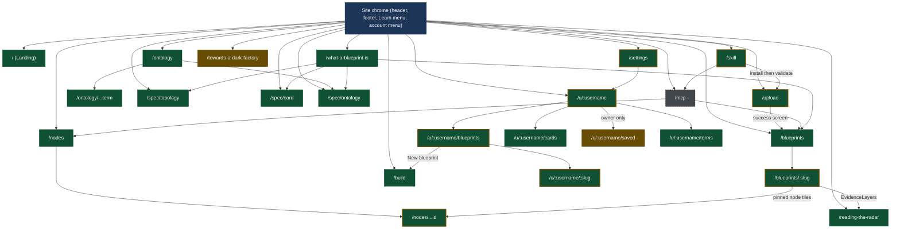

# 4 · Sitemap and routing

[← Back to the index](../ARCHITECTURE.md)

Carried over unchanged from Phase 2A's `ROUTES.md`. Do not renumber or re-derive; if a row
looks wrong, raise it, don't edit it here.

## Cross-check against the build

| Source | Count |
|---|---:|
| `page.tsx` files under `app/` | 24 |
| Route patterns in `.next/prerender-manifest.json` | 27 |
| Route entries printed by `npm run build` (`docs/audit/baseline.txt:48-110`) | 26 |
| Prerendered pages | 165 |

The three counts reconcile exactly. The 27 manifest patterns are the 24 `page.tsx` routes
plus three the framework owns and no file in `app/` declares: `/_not-found`,
`/_global-error`, `/icon.svg`. The printed table omits `/_global-error`, which is why it
shows 26 where the manifest shows 27. Per-pattern page counts sum to 165.

## Access

There is no authentication anywhere in the repository. Every route is public and
statically prerendered. Four routes render an **owner view** selected by comparing the
requested handle against a fixture (`components/profile/load.ts:78`,
`ACCOUNT.author.username` at `lib/data/account.ts:77`); the owner view is a *page*, not a
session state, and both variants ship in the build. Those are marked `public · owner-view
by fixture`.

## Status tags

- `LIVE` — the page's data comes from `content/` through `lib/content`, resolved and
  scored by `lib/core` at build time. The behaviour on screen is real.
- `MOCK` — the page's data comes from `lib/data/**` fixtures or from constants declared in
  the page.
- `PLANNED` — the UI shell exists and the behaviour behind it does not.

A page reading both sources carries both tags with the split named.

## The API routes

Added 2026-08-15. These are `route.ts` handlers under `app/api/`, not pages, so the page status
tags above do not apply to them: each is **backed by a real module and a real Postgres read**, which
is what "LIVE" means everywhere else in this document. They are listed here because section 4 is the
sitemap and a sitemap that records only `page.tsx` reads as complete while describing half the tree.

Every response is B-03's envelope — `application/json` at 200, RFC 9457 `application/problem+json`
on failure. Every registry read takes an `Actor` derived from the request and filters through
`server/policy`, so "not visible to you" and "does not exist" are one answer by construction (B-03):
a 404 detail that differed between them would reinstate the existence leak the status code closes.

| Path | File | Method | Access | Purpose | Seam |
|---|---|---|---|---|---|
| `/api/auth/github/login` | `app/api/auth/github/login/route.ts` | GET | public | Starts the GitHub OAuth exchange (B-02): mints a CSRF state, stashes it in a short-lived cookie, redirects to GitHub. Touches no database — the identity does not exist yet, only the request for one | — |
| `/api/auth/github/callback` | `app/api/auth/github/callback/route.ts` | GET | public | Finishes the exchange: verifies state, upserts a bare `account` row keyed by GitHub id, sets the session cookie. `handle` stays null until T070/T050 allocate one, which is why `SessionPayload.handle` is nullable. **Not exercisable end to end** — no real GitHub OAuth App credentials exist yet | — |
| `/api/auth/logout` | `app/api/auth/logout/route.ts` | POST | public | Clears the session cookie. No database and no GitHub, so unlike the pair above this one is fully exercisable today | — |
| `/api/auth/session` | `app/api/auth/session/route.ts` | GET | session required | The guarded-handler shape every later task's routes follow: no session reaches the handler, and the refusal is `problem+json` 401 with no body from the handler at all | — |
| `/api/blueprints` | `app/api/blueprints/route.ts` | GET | public, actor-filtered | The gallery's list. Nothing on this route can 404: "no blueprints you may see" is an empty list, not a failure | SEAM-01 |
| `/api/blueprints/[owner]/[slug]` | `app/api/blueprints/[owner]/[slug]/route.ts` | GET | public, actor-filtered | One blueprint under B-09's two-part key, with its scores. One 404 detail string for a key nothing holds and for a bundle the caller may not see — the reader returns one value for both, so no branch here could tell them apart even by accident | SEAM-03 (partial: two-part key, not `{slug}`) |
| `/api/cards` | `app/api/cards/route.ts` | GET | public, actor-filtered | The node library. `cards()` rather than `latestCards()`: the published shape is every indexed version, and which of them to show is the caller's decision | SEAM-07 |
| `/api/cards/[...ref]` | `app/api/cards/[...ref]/route.ts` | GET | public, actor-filtered | One card by ref, plus the namespaced forms of `versions` and `users`. A catch-all because `CARD_ID` admits one `owner/name` pair, so `berti/solver-a` spans two segments and a literal `[id]/versions` folder could not express it — the same reason `/nodes/[...id]` is a catch-all. Dispatch is total, not heuristic | SEAM-09 |
| `/api/cards/[id]/versions` | `app/api/cards/[id]/versions/route.ts` | GET | public, actor-filtered | Every indexed version of one card id, newest first. Empty for an id nothing pins **and** for one whose every version is private to somebody else — the same value, for B-03's reason. Single-segment ids only; the catch-all beside it answers identically for namespaced ones | — |
| `/api/cards/[id]/users` | `app/api/cards/[id]/users/route.ts` | GET | public, actor-filtered | Blueprints using any version of one card id, distinct and sorted | — |
| `/api/cards/duplicates` | `app/api/cards/duplicates/route.ts` | GET | public, actor-filtered | Cards saying the same thing under different refs. A static segment, matched before the catch-all beside it, and it can never shadow a card because a pinned ref always carries `@version` and this path has none | SEAM-13 |
| `/api/search/blueprints` | `app/api/search/blueprints/route.ts` | GET | **public-only, for EVERY caller** | Search over the blueprint shelf: `q, tag, cat, phase, autonomy, df, forks, sort`. **GET rather than SEAM-93's proposed POST, and the contract's own justification decides it — the parameter sets are fixed by the live URLs so a shared link may not break, and a POST body is not a link.** `forks` defaults to **`rolled`**, matching `GalleryBrowser`, because T260's cutover would otherwise change that page's shelf unless it remembered to send the key (D-200-37). An empty result is **200 with populated facets**, never a 404 | SEAM-93 (superseded), SEAM-88 |
| `/api/search/cards` | `app/api/search/cards/route.ts` | GET | **public-only, for EVERY caller** | Search over the node library: `q, type, phase, human, risk, sort`. `sort` takes `used \| name \| type \| phase` and **a recognised value must actually reorder** (D-200-23); an unrecognised one falls back rather than erroring, the same rule an unknown key gets. `q` reaches the card `spec`, diverging from `lib/core`'s pinned corpus **on purpose** (D-200-29): that exclusion is right for an unranked substring filter, and what makes it safe here is the rank and the visible `spec:<token>` evidence item | SEAM-08 (partial) |
| `/api/search/terms` | `app/api/search/terms/route.ts` | GET | **public-only, for EVERY caller** | Search over the ontology: `q, kind, origin`, with `origin` taking **three** values — `core`, `local`, `deprecated`. **Reads BOTH corpora** (D-200-17): `ontology_term` holds the registry's terms while a local term travels on `release.local_vocabulary`, so `origin=local` would filter nothing forever if this read only the table. **A private bundle's local terms are private content that inherits a visibility without being a row that has one** — the least obvious of the three AC4 surfaces | — |
| `/api/transfer` | `app/api/transfer/route.ts` | POST | owner | Move a bundle to another account: `{bundleId, toHandle}`. Statuses off `TransferRefusedKind`; transfer to a tombstone answers `no account holds` (D-120-19) | — |
| `/api/transfer/plan` | `app/api/transfer/plan/route.ts` | GET | owner | Preview: `{plan: TransferPlan}`. A collision previews as `200 collides: true`, never 409 — a preview that refused would be the act | — |
| `/api/account/delete` | `app/api/account/delete/route.ts` | POST | session account | Delete yourself: bare `200 DeletionPlan` (D-120-19) — the one irreversible operation answers with what it destroyed | — |
| `/api/account/delete/plan` | `app/api/account/delete/plan/route.ts` | GET | session account | Preview: `{plan: DeletionPlan}`, four outcome-partitioned figures (D-120-15) | — |
| `/api/mcp/search` | `app/api/mcp/search/route.ts` | GET | public-only, rate-limited `read` | The MCP search operation: merged blueprint+card hits, `{q: task}` raw, evidence carried, `ordered` composed (D-220-13/14/16) | SEAM-88 |
| `/api/mcp/cards/[...ref]` | `app/api/mcp/cards/[...ref]/route.ts` | GET | public-only, rate-limited `read` | Card YAML by `id@version` via `resolveCardRef(...).source` — NOT `serveCard`, whose `recordDownload` would make every agent poll a download event the shelf prints as *most used* (D-220-16) | SEAM-89 |
| `/api/mcp/blueprints/[owner]/[slug]/provenance` | `app/api/mcp/blueprints/[owner]/[slug]/provenance/route.ts` | GET | public-only, rate-limited `read` | `Provenance`: publishedBy handle, releases, `forkedFrom` omitted whole for an unreadable upstream (D-220-05) | SEAM-90 |
| `/api/mcp/releases/[owner]/[slug]/d/[digest]` | `app/api/mcp/releases/[owner]/[slug]/d/[digest]/route.ts` | GET | public-only, rate-limited `read` | The release FILE LIST (names, not bytes — the bytes have a route, and serving them twice differs in download accounting, D-220-16) | SEAM-91 |
| `/api/ontology-usage` | `app/api/ontology-usage/route.ts` | GET | public, actor-inert | Every counted term's usage — `{usage: TermUsage[]}`, the whole list (a map keyed by termId would drop what nothing names, D-210-09). Zero-not-404 is the module's property | SEAM-17 |
| `/api/ontology-usage/candidates` | `app/api/ontology-usage/candidates/route.ts` | GET | public, actor-inert | Every counted LOCAL term with counts and both threshold booleans (D-210-02); the eligible subset is the derived quantity | SEAM-18 |
| `/api/ontology/categories` | `app/api/ontology/categories/route.ts` | GET | public, actor-filtered | The gallery's category facet, over the blueprints the caller may see | — |
| `/api/ontology/tags` | `app/api/ontology/tags/route.ts` | GET | public, actor-filtered | The gallery's tag facet, over the blueprints the caller may see | — |
| `/api/ontology/phases` | `app/api/ontology/phases/route.ts` | GET | public, actor-filtered | The phases the indexed cards declare, in lifecycle order. Descriptive, never a score: the set of phases that are here, not a fraction of five | — |
| `/api/ontology/phases/[phase]/cards` | `app/api/ontology/phases/[phase]/cards/route.ts` | GET | public, actor-filtered | Cards declaring one phase. A phase no card declares answers 200 with an empty list, never 404 — the bucket is a fact about the index, and that is as true of an arbitrary string as of one of the five, so nothing validates `phase` against a known set first | — |
| `/api/files/blueprints/[owner]/[slug]/v/[version]/[...path]` | `app/api/files/blueprints/[owner]/[slug]/v/[version]/[...path]/route.ts` | GET | public, actor-filtered | One file of a release named by its author-declared semver. Half of D-90-04's split: a **version** reference moves when a newer release is cut | SEAM-19 (partial) |
| `/api/files/blueprints/[owner]/[slug]/d/[digest]/[...path]` | `app/api/files/blueprints/[owner]/[slug]/d/[digest]/[...path]/route.ts` | GET | public, actor-filtered | The same file at the address that does not move. The other half of the split, and the reason it is a URL **segment** and not a query parameter: a reference that has to survive being written down cannot depend on a heuristic reading one segment's shape, so a digest can never resolve as a version by accident | SEAM-19 (partial) |
| `/api/files/cards/[...ref]` | `app/api/files/cards/[...ref]/route.ts` | GET | public, actor-filtered | One card version at an address naming no blueprint. A catch-all because `CARD_ID` admits one namespace segment, so `berti/memory-probe@1.0.0.yaml` arrives as two segments and is one ref | SEAM-10 (partial) |
| `/api/names/handles/[handle]` | `app/api/names/handles/[handle]/route.ts` | GET | public | Is this handle available? Answers `{ available, reason?, suggestion? }` at **200 always** — there is no 404, because "not found" **is** the available answer. `reason` is `taken` (an account holds it), `reserved` (released, and permanently unavailable to any other account) or `illegal` (fails the grammar or the single-segment rule). A suggestion accompanies exactly the first two — you can only offer an alternative to a name that is itself legal | — |
| `/api/names/slugs/[owner]/[slug]` | `app/api/names/slugs/[owner]/[slug]/route.ts` | GET | public | The same question for a bundle slug under an owner, where `[owner]` is a **handle**. Uniqueness is per owner (B-09), so a slug another owner holds is `available`. The four profile-tab slugs — `blueprints`, `cards`, `saved`, `terms` — are `reserved` for **every** owner including one nobody is, because the reserved set is a property of the URL space rather than of an account | — |
| `/api/account` | `app/api/account/route.ts` | GET | session | The signed-in account's own `AccountRecord`. `401` without a session; **`500` `problem+json` `store-failed`** when the store cannot answer (D-50-18) | — |
| `/api/validate/bundle` | `app/api/validate/bundle/route.ts` | POST | public | `{ dot, cardFiles, manifest, vocabulary? }` → `LoadBundleResult` at **200 even with diagnostics** (B-03): a bundle that resolves with errors is an answer. `400 413` | SEAM-30 (superseded — its request shape could not be joined to the module's signatures) |
| `/api/validate/dot` | `app/api/validate/dot/route.ts` | POST | public | `{ dot }` → `{ graph?, diagnostics }`. `400 413` | — |
| `/api/validate/card` | `app/api/validate/card/route.ts` | POST | public | One card source → `{ card?, diagnostics }`. `400 413` | — |
| `/api/validate/ontology` | `app/api/validate/ontology/route.ts` | POST | public | One vocabulary → `{ diagnostics }`. **Vocabulary defects are reported separately from bundle defects.** `400 413` | — |
| `/api/account/profile` | `app/api/account/profile/route.ts` | PATCH | session | `{ displayName?, bio?, avatarHue? }` → `AccountRecord`. `400 401 403 500` | — |
| `/api/account/handle` | `app/api/account/handle/route.ts` | PATCH | session | `{ handle }` → `AccountRecord`. **The one write route that accepts a `handle: null` session** (D-50-05), since it is the route that allocates the first handle. `409` when taken. `400 401 409 500` | — |
| `/api/account/email` | `app/api/account/email/route.ts` | PATCH | session | `{ email }` → `AccountRecord`. Never appears on a public surface. `400 401 403 500` | — |
| `/api/account/default-visibility` | `app/api/account/default-visibility/route.ts` | PATCH | session | `{ visibility }` → `AccountRecord`. `400 401 403 500` | — |
| `/api/bundles` | `app/api/bundles/route.ts` | POST | session | `PublishInput` members under their own names, with `vocabulary` crossing as a **YAML string** joined at the route exactly as `/api/validate/bundle` does — `StoredVocabulary` is what crosses the barrel, not the wire. Answers `PublishResult { bundleId, releaseId, digest, created }`. **`created` is a claim about idempotency**: publishing the same bytes twice must be observable as such. Statuses: `conflict` **409**, `not-owner` **404** (B-03, so existence does not leak), `unfinished` / `in-error` / `version-not-higher` **422**, unauthenticated **401** (T000's `withSession`, decided before the handler runs). Four foreign rejections pass through with their messages unaltered: 400 / 422 / 422 / 422 | — |
| `/api/account/keys` | `app/api/account/keys/route.ts` | GET | session | `KeyList = { keys: ApiKeyRecord[] }`. **Revoked rows are LISTED rather than filtered** — AC4's observation, not a convenience: a caller must be able to see that a key it revoked is revoked. `ApiKeyRecord` carries no secret and no column could hold one. `401 500` | — |
| `/api/account/keys` | `app/api/account/keys/route.ts` | POST | session | `{ label }` → `{ record: ApiKeyRecord, secret }`. **The secret is returned exactly once and is unrecoverable** — stored hashed, and absent from `ApiKeyRecord` by design so that is structural rather than a rule someone remembers. `400 401 500` | — |
| `/api/account/keys/{keyId}` | `app/api/account/keys/[keyId]/route.ts` | DELETE | session | `200` with the resulting `KeyList` rather than `204`, so the revoked row is observable in the same request that revokes it (D-230-11). `401 404 500` | — |
| `/api/account/saves` | `app/api/account/saves/route.ts` | GET | session | `SavesView = { saves: SaveRecord[], count }`. **`count` comes from `countSaves`, never `saves.length`** — one payload, both published functions, so AC3's agreement is observable in a single response. `savedAt` crosses as an ISO string. `401 500` | — |
| `/api/account/saves` | `app/api/account/saves/route.ts` | POST | session | `{ kind, refId }` → `SavesView`. The barrel's own `target`, so the route translates nothing. **Idempotent** (AC2), and answering the resulting view makes that drivable in two requests rather than three. **No 404 on a write**: a write-time existence check on a polymorphic target is an existence oracle. `400 401 500` | — |
| `/api/account/saves` | `app/api/account/saves/route.ts` | DELETE | session | `{ kind, refId }` → `SavesView`. **A body rather than a path segment**, because `refId`'s lexical shape per kind is unpublished and a segment would invent one. `400 401 500` | — |
| `/api/account/saves/migrate` | `app/api/account/saves/migrate/route.ts` | POST | session | `{ targets: { kind, refId }[] }` → `SavesView`. AC5's browser-local migration, idempotent across repeated sign-ins. **No handle required** — an account on its first sign-in has `handle: null`, which is exactly the account this route is for. `400 401 500` | — |
| `/api/authors/[handle]` | `app/api/authors/[handle]/route.ts` | GET | none | `ProfileRecord = { author, joinedAt, counts: { blueprints, terms } }`. **The actor is the SESSION's**, so an owner and a visitor get different records from one route and there is no owner/visitor branch in the module. `404` for a handle nobody holds, `detail` `"author: no such handle."` as a named constant (D-130-12). **500 has two shapes**: `store-failed` when the store cannot answer, and `malformed-stored-vocabulary` when a stored vocabulary is one the parser refuses — **distinguishable by `type`, which is D-130-10's whole content**. `404 500` | — |
| `/api/auth/github/login` | `app/api/auth/github/login/route.ts` | GET | public | Starts the OAuth exchange | — |
| `/api/auth/github/callback` | `app/api/auth/github/callback/route.ts` | GET | public | Upserts a bare `account` row and sets the session cookie. **A store fault must be observable as an absence: no cookie is issued for a sign-in that did not complete**, since `withSession` never reads the database and the holder would be signed in as an account that does not exist | — |
| `/api/auth/logout` | `app/api/auth/logout/route.ts` | POST | session | Clears the session cookie | — |
| `/api/auth/session` | `app/api/auth/session/route.ts` | GET | public | The current session, or its absence | — |

`TBD:` eleven of these fifteen routes carry no seam id. Four cite one in their own source
(SEAM-01, 07, 09, 13) and are mapped above from that citation rather than from resemblance. The
rest are real endpoints that the seam catalogue, written against the frontend's needs before any
backend existed, has no entry for — the auth four because authentication was never a page-level
seam, and the ontology and per-card facets because the pages that will consume them read `content/`
at build time today. **Open question: does section 8 gain new seam ids for them, or is a route with
no page consuming it deliberately outside the seam model?** Not answerable without deciding what a
seam is for, so it is recorded rather than guessed.

## The routes

| Path | File | Access | Purpose | Status | Linked from |
|---|---|---|---|---|---|
| `/` | `app/page.tsx:120` | public | Landing. Five beats; `SectionBlueprint` reads `bundleSource` and `SectionNodeIsCard` reads `cardSource`/`getNodeCard`, so the figures are drawn off the archive | LIVE | header/footer wordmark (`components/site/SiteHeader.tsx:241`, `components/site/SiteFooter.tsx:101`) |
| `/blueprints` | `app/blueprints/page.tsx:57` | public | Blueprint index; `GalleryBrowser` filters the prerendered set from the query string | LIVE | header Browse (`SiteHeader.tsx:51`), footer Browse (`SiteFooter.tsx:65`), mobile "Find one" (`SiteHeader.tsx:428`), `/mcp:391`, `/upload` success screen (`components/upload/UploadFlow.tsx:1061`), every `TagPill` deep link |
| `/blueprints/[slug]` | `app/blueprints/[slug]/page.tsx:120` | public | One published blueprint: files, graph, cards, scorecard, evidence, history, download, DOT, notes. 9 pages | LIVE + MOCK (metrics `efficacy`/`reliability`/`transparency`/`cost`, `downloads`, `votes`, `comments` from `lib/data/community.ts`; forks/watchers from `lib/data/bundles.ts:172`, `lib/data/profiles.ts:179`) | `ContentRow` rows on `/blueprints`, `/u/[username]/blueprints` (`OwnedBundles`, published rows only), `Pinned`, `SavedList`, `/u/[username]/[slug]:300`, `components/bundle/Aside.tsx:190` |
| `/build` | `app/build/page.tsx:117` | public | Worked sandbox over the five-node starter; three controls, 80 combinations verified through the engine at build time (`:78`) | LIVE (engine runs in the browser, `lib/starter/variants.ts:264`) | Learn menu and Learn rail via `SANDBOX` (`components/spec/sequence.ts:368`), footer Learn column, `/u/[username]/blueprints:94` ("New blueprint") |
| `/mcp` | `app/mcp/page.tsx:149` | public | Design proposal for the MCP server: client config, four proposed operations, four open questions | PLANNED (every row prints `not built`, `:307`) | header Design menu (`SiteHeader.tsx:66`), footer Design column, `/skill:39` |
| `/nodes` | `app/nodes/page.tsx:15` | public | Node-card library index, grouped by node type; `NodeBrowser` filters from the query string | LIVE | header Browse (`SiteHeader.tsx:52`), footer Browse, `/mcp:398` |
| `/nodes/[...id]` | `app/nodes/[...id]/page.tsx:727` | public | One node card at its newest version: spec, interfaces, prohibitions, every field, version history, source. Catch-all so a namespaced id resolves (`:47`). 53 pages | LIVE + MOCK (`downloadsFor`/`starsFor`/`commentsFor`, `lib/data/node-community.ts`) | `NodeCardSummary` tiles on `/nodes`, `/u/[username]/cards` (`OwnedCards`, public and private rows), `Pinned`, `SavedList`, `nodeHref` from graph nodes and `components/bundle/Aside.tsx:203` |
| `/ontology` | `app/ontology/page.tsx:77` | public | The vocabulary, browsable: five kinds, the core/local split, per-term usage counted off `content/` | LIVE | header Browse (`SiteHeader.tsx:56`), footer Browse, `/spec/ontology`, `/u/[username]/terms:46` |
| `/ontology/[...term]` | `app/ontology/[...term]/page.tsx:137` | public | One term: kind, definition, broader/narrower, weight, which cards name it. Catch-all so `lupo/pii-handling` resolves (`:21`). 50 pages | LIVE | `termHref` from `/ontology`, node-card chips, `/u/[username]/terms:62` |
| `/reading-the-radar` | `app/reading-the-radar/page.tsx` | public | How a blueprint is graded: the scorecard, the three metric sources, the shipped weights | LIVE (reads `allBlueprints`) | Learn menu stop 05 (`sequence.ts:400`), footer Learn column, `components/blueprint/EvidenceLayers.tsx:93` |
| `/settings` | `app/settings/page.tsx:142` | public · owner-view by fixture | Six account sections. Every control is `readOnly` or `disabled` except the three Public-profile fields, whose only effect is the preview beside them | MOCK (`lib/data/account.ts`) + LIVE (the three authored-under counts, `:156-161`) | account menu (`SiteHeader.tsx:136`), mobile "You" group |
| `/skill` | `app/skill/page.tsx:107` | public | The authoring skill: one install command that runs, then three things around it that do not | LIVE (command) + PLANNED (`UNBUILT`, `:22`) | header Design menu (`SiteHeader.tsx:67`), footer Design column, `/upload:140`, `/mcp:405`, `/install` 308 |
| `/spec/topology` | `app/spec/topology/page.tsx` | public | Layer 01: the DOT file and the validator checks over it | LIVE (reads `bundleSource`) | Learn menu stop 01, footer Learn column, `/what-a-blueprint-is` doors |
| `/spec/card` | `app/spec/card/page.tsx` | public | Layer 02: the node card in YAML, annotated, with the field reference | LIVE (reads `getNodeCard`) | Learn menu stop 02, footer Learn column, `/what-a-blueprint-is` doors |
| `/spec/ontology` | `app/spec/ontology/page.tsx` | public | Layer 03: the vocabulary format, the local overlay, the validator checks | LIVE (reads `getOntologyView`, `bundleVocabulary`) | Learn menu stop 03, footer Learn column, `/what-a-blueprint-is` doors, `/ontology:132` |
| `/towards-a-dark-factory` | `app/towards-a-dark-factory/page.tsx` | public | The 1-to-5 organisational ladder and the argument about which work belongs to an agent | MOCK (hardcoded essay content, no archive read) | Learn menu stop 06 (`sequence.ts:415`), footer Learn column |
| `/u/[username]` | `app/u/[username]/page.tsx:56` | public · owner-view by fixture | Profile overview: pinned and local vocabulary terms only, as of 2026-08-13 — the Blueprints and Node cards sections that used to draw a slice of each list here were removed, on the argument that `ProfileHeader`'s summary line and the tab strip's own counts already state those facts once. 6 pages | LIVE (blueprints, cards, terms counted off `content/`; pinned and terms are what actually renders) + MOCK (`profileFor`, `downloads`, `stars`, `validated` — read by `ProfileHeader` via `ProfileShell`, not this page directly) | account menu (`SiteHeader.tsx:132`), `AuthorChip` on every card and blueprint, `/settings:173` |
| `/u/[username]/[slug]` | `app/u/[username]/[slug]/page.tsx:66` | public · owner-view by fixture | One owned bundle, handled like a repository: identity, lineage, files, history, releases, visibility. 5 pages | MOCK (`OWNED_BUNDLES`) with a LIVE branch for the two rows also published in `content/` (`components/bundle/load.ts:210`) | `OwnedBundles` rows on `/u/[username]/blueprints`, `components/bundle/Aside.tsx:244` |
| `/u/[username]/blueprints` | `app/u/[username]/blueprints/page.tsx:65` | public · owner-view by fixture | Owner: the management list, public and private together, with a live `Visibility` filter. Visitor: the published shelf, no filter. 6 pages | MOCK (owner private rows) + LIVE (visitor rows and owner public rows, `:78`) | profile tab strip (`components/profile/tabs.ts:41`, mounted via `ProfileShell` on every profile page), account menu (`SiteHeader.tsx:133`), the overview's empty-state action when something is published but nothing is pinned (`app/u/[username]/page.tsx`) |
| `/u/[username]/cards` | `app/u/[username]/cards/page.tsx:48` | public · owner-view by fixture | Owner: every card authored under this handle, public and (as of 2026-08-13) private together, with a live `Visibility` filter. Visitor: published cards only, no filter. 6 pages | LIVE (public rows) + MOCK (owner private rows, `lib/data/cards.ts`) | profile tab strip, account menu (`SiteHeader.tsx:134`) |
| `/u/[username]/saved` | `app/u/[username]/saved/page.tsx:32` | public · owner-view by fixture | Owner: the bookmark list. Visitor: the rule that a save is private and nothing else. 6 pages | MOCK (`SAVES`, `lib/data/bundles.ts:554`) | profile tab strip (owner only, `tabs.ts:43`), account menu (`SiteHeader.tsx:135`) |
| `/u/[username]/terms` | `app/u/[username]/terms/page.tsx:35` | public · owner-view by fixture | Local vocabulary terms namespaced under this handle. Ownership read off the id prefix. 6 pages | LIVE | profile tab strip, `/u/[username]:191` |
| `/upload` | `app/upload/page.tsx:88` | public | Four-step validate-and-publish wizard. Files are read in the tab, `loadBundle` runs in the tab, nothing is sent | LIVE (steps 1-3) + PLANNED (step 4 Publish, `components/upload/UploadFlow.tsx:1146`) | header Publish button (`SiteHeader.tsx:352`), mobile Design group (`:469`), footer Design column |
| `/what-a-blueprint-is` | `app/what-a-blueprint-is/page.tsx` | public | Learn stop 00 and the door to the three layer pages | LIVE (reads `allBlueprints`, `getNodeCard`, `getOntologyView`) | header Learn menu stop 00 (`sequence.ts:219`), footer Learn column, `/blueprints:105`, `/spec` and `/concepts` 308s |
| `/_not-found` | framework | public | 404 | LIVE | none (framework fallback) |
| `/_global-error` | framework | public | Uncaught render error boundary. In the prerender manifest, absent from the printed route table | LIVE | none (framework fallback) |
| `/icon.svg` | `app/icon.svg` | public | Favicon, App Router file convention | LIVE | `<head>`, emitted by the framework |

## Orphan routes

**None.** Every one of the 24 `page.tsx` routes is reachable from the chrome or from an
index page:

- 15 top-level routes have a header entry, a Learn-menu entry or an account-menu entry.
  `components/site/nav.test.ts` walks `app/*/page.tsx` and fails if one does not
  (`"lists every top-level route in the header"`), and fails again if a header or footer
  link resolves to no `page.tsx`.
- The 6 dynamic detail routes (`/blueprints/[slug]`, `/nodes/[...id]`,
  `/ontology/[...term]`, `/u/[username]`, `/u/[username]/[slug]`, and the four
  `/u/[username]/*` tabs) are reached from their own index pages by construction, which is
  why `nav.test.ts` does not cover them.

This matches `docs/audit/REPORT.md:291`: *"`UNREACHABLE-ROUTE`: zero found."*

`TBD:` The audit deliverable the task names is `docs/audit/CHANGELOG.md`. No file by that
name exists in the working tree or in any commit reachable from `HEAD`
(`git log --all -- docs/audit/CHANGELOG.md` returns nothing). The audit's findings live in
`docs/audit/REPORT.md`, which is untracked. Is `REPORT.md` the intended file, or is a
`CHANGELOG.md` still to be written?

## Redirects

Thirteen permanent (308) redirects in `next.config.ts:67-125`. They are configuration rather
than routes, so they are outside the count above. `nav.test.ts` holds each one to a
destination that exists and asserts the old page is gone.

| Source | Destination | Reason recorded in code |
|---|---|---|
| `/gallery` | `/blueprints` | section rename; query string survives the redirect |
| `/parts` | `/nodes` | a part was never a node card |
| `/parts/:slug` | `/nodes` | no per-id counterpart exists |
| `/ontologies` | `/ontology` | one vocabulary, not a gallery of them |
| `/ontologies/:slug` | `/ontology` | same |
| `/how-to-build-a-dark-factory` | `/towards-a-dark-factory` | §4.2 rename |
| `/towards-a-dark-factory/the-climb` | `/towards-a-dark-factory` | child page deleted |
| `/which-tasks` | `/towards-a-dark-factory` | folded into the parent |
| `/towards-a-dark-factory/which-tasks` | `/towards-a-dark-factory` | merged into its own parent |
| `/spec` | `/what-a-blueprint-is` | overview deleted, children kept; the three old fragments live on the destination |
| `/spec/scoring` | `/reading-the-radar` | merged, `#weights` moved with it |
| `/concepts` | `/what-a-blueprint-is` | folded into `#the-words` |
| `/install` | `/skill` | split in two; the old page's working command is on `/skill` |

Two of the thirteen (`/spec`, `/concepts`) share a destination; the rest are distinct.

## Navigation graph

Nodes carry the dominant status tag from the table above (`mixed` = the page itself carries
two tags, split-named in the table). "Site chrome" stands for the header, footer, Learn
menu and account menu together, since almost every top-level route is linked from more than
one of those simultaneously — see the "Linked from" column for the exact chrome location.
Not every cross-page link in the table is drawn (some are single deep-links from a tile or
chip); this graph is the *reachability* backbone, and per the section above there are no
orphans to mark.

