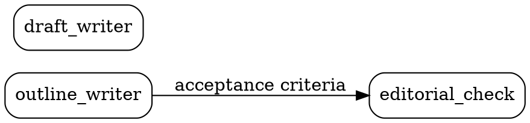

# The DOT, and what a card becomes when it is compiled

Two things live here: how to write `blueprint.dot` so it loads clean, and what happens to a
card when DarkPrint compiles the bundle into a runnable pipeline. The second half is
background — **this skill does not emit `factory.dot`** — but an author is entitled to know
what their `spec` turns into.

---

## Part 1 — writing `blueprint.dot`

### The shape



### Node ids

`[A-Za-z_][A-Za-z0-9_]*`. No hyphens, no leading digit, never quoted.

- A hyphen or a quoted id is `attractor/bad-node-id` or `attractor/quoted-node-id` (warnings,
  visible on `/upload`, and they make the bundle look broken).
- `digraph`, `edge`, `graph`, `node`, `strict`, `subgraph` are statement keywords and cannot
  open a node statement.
- `start`, `Start`, `exit`, `end` are legal here but Attractor resolves them as pipeline
  boundaries by name, and they collide with the entry and exit nodes DarkPrint synthesises
  when it compiles. Avoid them.

The card id grammar is the other one: `^(?:namespace/)?[a-z0-9]+(-[a-z0-9]+)*$`. Lowercase,
hyphens, no underscores. **The two grammars are incompatible for every multi-word name**, so
always write the pin explicitly:

```dot
editorial_check [card="editorial-check@1.0.0"];
```

`card="id@version"` is canonical and always wins. The bare `version="1.0.0"` fallback makes the
node id double as the card id, which only works for a single lowercase word — do not use it.
An unpinned pointer (`card="solver"`, `card="solver@latest"`, `version="1.x"`) is
`bundle/unpinned-card`, an **error**.

### Attribute syntax

Attributes are **comma**-separated. `[a=1; b=2]` and `[a=1 b=2]` are both
`attractor/attr-separator`.

Comments are `//` or `/* … */`. A `#` comment is `attractor/hash-comment`.

No string concatenation (`"a" + "b"`), no `<html-like>` literals, and a duration is an integer
followed by one of `ms s m h d` — anything else is `attractor/unsupported-value`.

### Never write `type=` on a node

`type` is a **reserved Attractor node attribute** and means *handler override*. DarkPrint's
node type is an ontology term inside the YAML card and never a DOT attribute. Writing it is
`attractor/reserved-attribute`, and the value would be read as something entirely different
from what you meant.

The same goes for the rest of Attractor's reserved node names — `prompt`, `max_retries`,
`llm_model`, `label`, `shape`, `class`, `timeout`, `goal_gate`, `fidelity`, `thread_id`,
`retry_target`, `fallback_retry_target`, `llm_provider`, `reasoning_effort`, `auto_status`,
`allow_partial`. The bundle's own attributes are `card`, and optionally `digest` (a prefix of
the card digest, checked as `bundle/digest-mismatch`).

On an **edge**, `label`, `condition`, `weight`, `fidelity`, `thread_id` and `loop_restart` are
reserved. `out=` and `in=` are not, which is what lets the port pins ride along safely.

### One graph, one file

Only the first graph in the file is read (`attractor/multiple-graphs`, `dot/unsupported`). It
must be a `digraph`, and every edge `->`; a `graph` or a `--` edge is `dot/not-directed`, an
**error** that stops the pipeline dead. Do not write `strict digraph`.

Only **one** `.dot` file goes in the bundle. `/upload` classifies files by name: the first
`.dot` or `.gv` is the topology and a second one is demoted with a note.

### Filenames are load-bearing

`/upload` reads roles off filenames, so:

- exactly one `blueprint.dot`;
- cards under `cards/`, named `<card-id>@<version>.yaml`;
- **never name a card `blueprint.yaml` or `extensions.yaml`.** Those two names are claimed by
  the manifest and the local vocabulary. A card named either is classified as something else,
  vanishes from the card set, and every node pinning it reports `bundle/missing-card`.

Nothing in the engine requires a card's filename to match its `id` and `version`; the card's
own fields are its identity. Matching them is a courtesy to whoever opens the folder, and this
skill always does it.

---

## Part 2 — what a card becomes

DarkPrint's own exporter compiles a resolved bundle into a `factory.dot` that
[Attractor](https://github.com/strongdm/attractor) runs as it stands. **This skill does not
write that file** — duplicating the emit rules here would let the two drift, and the exporter
is the one that gets tested against Attractor's parser on every build.

It is documented because an author writing a `spec` should know it is the thing that will be
handed to the agent verbatim.

| the card says | the compiled node says |
|---|---|
| `spec` | `prompt` — the payload the agent actually receives |
| `name` | `label` |
| `model` | `llm_model`, Attractor's reserved model identifier |
| `params.max_iterations` (or `maxIterations`, or `max_retries`) | `max_retries` |
| `type: agent` | `shape=box` → the `codergen` handler |
| `type: validation` | `shape=box` → the `codergen` handler |
| `type: tool` | `shape=parallelogram` → the `tool` handler |
| `type: human-gate` | `shape=hexagon` → the `wait.human` handler |
| `type: human-input` | `shape=hexagon` → the `wait.human` handler |
| `type: decision` | `shape=diamond` → the `conditional` handler |
| edge `label` | edge `label` |

A `__start` and a `__exit` node are **synthesised** rather than borrowed from your graph: your
entry node is an ordinary card node with a prompt to run, and re-shaping it into a boundary
would mean that prompt never runs. `card="id@version"` rides along in the compiled file
untouched, because Attractor ignores attributes it does not reserve.

Three consequences for how you write a card:

1. **`spec` is the prompt.** It is delivered to an agent that does not see the rest of the
   graph, so it has to be self-sufficient — and it must respect the isolation the topology
   declares. An absent edge with the criteria paraphrased into the prose is a false isolation.
2. **`model` is a default, not a binding.** The compiled graph carries a model stylesheet whose
   rules can override it, and an explicit node attribute outranks the sheet. Absence is an
   answer: the node takes whatever the runner supplies.
3. **The iteration cap has one home.** Write it as a top-level key of `params`. The security
   analyzer and the exporter read it through the same function, so a cap that scores as
   uncapped would also compile as unbounded.
