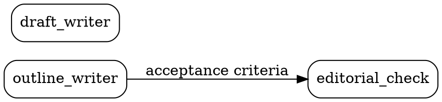

# The DOT, and what a card becomes when it is compiled

Two things live here: how to write `topology.dot` so it loads clean, and what happens to a
card when DarkPrint compiles the bundle into a pipeline a runner takes. **This skill
compiles nothing**, and no published bundle folder carries a compiled graph. The second half
is background, and an author is entitled to know what their `spec` turns into and which
parts of their card never leave DarkPrint.

---

## Part 1 — writing `topology.dot`

### The shape



### Node ids

`[A-Za-z_][A-Za-z0-9_]*`. No hyphens, no leading digit, never quoted.

- A hyphen or a quoted id is `attractor/bad-node-id` or `attractor/quoted-node-id` (warnings,
  visible on `/upload`, and they make the bundle look broken).
- `digraph`, `edge`, `graph`, `node`, `strict`, `subgraph` are statement keywords and cannot
  open a node statement.
- `start`, `Start`, `exit`, `end` are legal here but Attractor resolves them as pipeline
  boundaries by name, and they collide with the entry and exit nodes DarkPrint synthesises
  when it compiles. Avoid them.

The card id grammar is the other one: `^(?:namespace/)?[a-z0-9]+(-[a-z0-9]+)*$`. Lowercase,
hyphens, no underscores. **The two grammars are incompatible for every multi-word name**, so
always write the pin explicitly:

```dot
editorial_check [card="editorial-check@1.0.0"];
```

`card="id@version"` is canonical and always wins. The bare `version="1.0.0"` fallback makes the
node id double as the card id, which only works for a single lowercase word — do not use it.
An unpinned pointer (`card="solver"`, `card="solver@latest"`, `version="1.x"`) is
`bundle/unpinned-card`, an **error**.

### Attribute syntax

Attributes are **comma**-separated. `[a=1; b=2]` and `[a=1 b=2]` are both
`attractor/attr-separator`.

Comments are `//` or `/* … */`. A `#` comment is `attractor/hash-comment`.

No string concatenation (`"a" + "b"`), no `<html-like>` literals, and a duration is an integer
followed by one of `ms s m h d` — anything else is `attractor/unsupported-value`.

### Never write `type=` on a node

`type` is a **reserved Attractor node attribute** and means *handler override*. DarkPrint's
node type is an ontology term inside the YAML card and never a DOT attribute. Writing it is
`attractor/reserved-attribute`, and the value would be read as something entirely different
from what you meant.

The same goes for the rest of Attractor's reserved node names — `prompt`, `max_retries`,
`llm_model`, `label`, `shape`, `class`, `timeout`, `goal_gate`, `fidelity`, `thread_id`,
`retry_target`, `fallback_retry_target`, `llm_provider`, `reasoning_effort`, `auto_status`,
`allow_partial`. The bundle's own attributes are `card`, and optionally `digest` (a prefix of
the card digest, checked as `bundle/digest-mismatch`).

On an **edge**, `label`, `condition`, `weight`, `fidelity`, `thread_id` and `loop_restart` are
reserved. `out=` and `in=` are not, which is what lets the port pins ride along safely.

### One graph, one file

Only the first graph in the file is read (`attractor/multiple-graphs`, `dot/unsupported`). It
must be a `digraph`, and every edge `->`; a `graph` or a `--` edge is `dot/not-directed`, an
**error** that stops the pipeline dead. Do not write `strict digraph`.

Only **one** `.dot` file goes in the bundle. `/upload` classifies files by name: the first
`.dot` or `.gv` is the topology and a second one is demoted with a note.

### Filenames are load-bearing

`/upload` reads roles off filenames, so:

- exactly one `topology.dot`;
- cards under `cards/`, named `<card-id>@<version>.yaml`;
- **never name a card `blueprint.yaml` or `extensions.yaml`.** Those two names are claimed by
  the manifest and the local vocabulary. A card named either is classified as something else,
  vanishes from the card set, and every node pinning it reports `bundle/missing-card`.

Nothing in the engine requires a card's filename to match its `id` and `version`; the card's
own fields are its identity. Matching them is a courtesy to whoever opens the folder, and this
skill always does it.

---

## Part 2 — what a card becomes

`darkprint export <dir> --attractor` compiles a resolved bundle into an Attractor DOT and
writes it to stdout. **This skill does not write that file** and neither does a published
bundle folder carry one (owner instruction, 2026-08-25): duplicating the emit rules here
would let the two drift, and the exporter is the one that gets tested against Attractor's
parser on every build.

It is documented because an author writing a `spec` should know it is the thing that will be
handed to the agent verbatim.

| the card says | the compiled node says |
|---|---|
| `spec` | `prompt` — the payload the agent actually receives |
| `name` | `label` |
| `model` | `llm_model`, Attractor's reserved model identifier |
| `params.max_retries` (or `max_iterations`, or `maxIterations`) | `max_retries` |
| `type` and `phases` | `class`, every name prefixed `dp-` |
| `type: agent` | `shape=box` → the `codergen` handler |
| `type: validation` | `shape=box` → the `codergen` handler |
| `type: tool` | `shape=box` → the `codergen` handler |
| `type: human-gate` | `shape=hexagon` → the `wait.human` handler |
| `type: human-input` | `shape=hexagon` → the `wait.human` handler |
| `type: decision` | `shape=diamond` → the `conditional` handler |
| `type: shell-tool` | `shape=parallelogram` → the `tool` handler |
| `type: parallel` | `shape=component` → the `parallel` handler |
| `type: parallel.fan-in` | `shape=tripleoctagon` → the `parallel.fan_in` handler |
| `type: manager-loop` | `shape=house` → the `stack.manager_loop` handler |
| edge `label`, `condition`, `weight` | the same three edge attributes, carried verbatim |
| the manifest's `summary` and `title` | graph `goal` and `label` |

A `__start` and a `__exit` node are **synthesised** rather than borrowed from your graph: your
entry node is an ordinary card node with a prompt to run, and re-shaping it into a boundary
would mean that prompt never runs. `card="id@version"` rides along in the compiled file
untouched, because Attractor ignores attributes it does not reserve.

### What the compiled file cannot say

The compiled DOT opens with a comment listing every attribute Attractor reads that a
DarkPrint blueprint has no way to set. That list is derived from the engine rather than
written by hand, so it is the current answer and not a sentence somebody forgot to update.
Today it covers goal gates, timeouts, the whole retry policy above `max_retries`, fidelity,
thread ids, the parallel join policy, the manager-loop controls and the graph-level
defaults, hooks and model stylesheet. Each one falls back to whatever the runner's own
default is, and nothing warns anybody: a gate nobody wrote is a gate that never fires. An
author who needs one adds it to the compiled file by hand, and a later export replaces the
whole file.

The other half is what stops at the DarkPrint boundary. A node's `prompt` is everything the
runner receives from its card, so ports, dependencies, `cannot` and `risk_markers` are not
enforced by anything in the compiled file. They are enforced by the engine, at the moment
the bundle is validated, which is a different moment from the moment the pipeline runs.

Three consequences for how you write a card:

1. **`spec` is the prompt.** It is delivered to an agent that does not see the rest of the
   graph, so it has to be self-sufficient — and it must respect the isolation the topology
   declares. An absent edge with the criteria paraphrased into the prose is a false isolation.
2. **`model` is what the node runs on unless somebody edits the file.** DarkPrint writes
   `llm_model` and writes no `model_stylesheet`, so there is no sheet in the compiled graph
   to override it. Absence is still an answer: a card that names no model emits no
   `llm_model` at all, and the node takes whatever the runner supplies.
3. **The iteration cap has one home.** Write it as a top-level key of `params`. The security
   analyzer and the exporter read it through the same function, so a cap that reads as
   uncapped would also compile as unbounded.

---

## Part 3 — reading a pipeline back

`darkprint import <pipeline.dot> --as <handle> --out <dir>` is the other direction. It reads
an Attractor pipeline and writes a **draft** bundle: a `topology.dot` and one card per node,
in the layout `/upload` and `darkprint validate` both accept. The mapping table above is run
backwards, from the same table, so the two directions cannot drift apart.

| the pipeline says | the card says |
|---|---|
| `prompt` | `spec` |
| `label` | `name` |
| `llm_model` | `model` |
| `max_retries` | `params.max_retries` |
| `tool_command` | `params.tool_command`, on a `shell-tool` card |
| `shape` | `type`, through the table above |
| `class` | which of a shared shape's two types, and the `phase` list |
| `card="id@version"` | the card's own `id` and `version` |

### Both flags are required, and neither has a default

`--out` because a bundle is a folder and a folder cannot go down a pipe. `--as` because a
`prompt` is somebody's writing: every synthesised card carries `author` set to the handle you
give and `provenance` set to `derived:attractor <the pipeline>`, so a compiled card can be
told from a written one by reading it or by grepping for the marker. Every card comes out at
version `0.1.0`. It is a draft and it is meant to be edited before anybody publishes it.

### What a round trip keeps, and what it does not

`tests/attractor-round-trip.test.ts` runs a corpus of pipelines out and back and asserts that
every attribute an Attractor runner reads survives unchanged. What it does not keep is
recorded there too, exactly, rather than left to be discovered:

- **Ports, dependencies, `cannot`, `will_not` and `risk_markers` come back empty.** No
  Attractor file has ever carried them, so an import cannot invent them. You write them.
- **A node with no `prompt` becomes a card with no `spec`.** Attractor allows it; a DarkPrint
  card does not. The import says which node, and the bundle does not resolve until you write
  the missing half.
- **`shape=box` comes back as `agent` and `shape=hexagon` as `human-gate`** unless the file
  carries the `class` DarkPrint writes. Attractor selects one handler for `agent` and
  `validation` alike, and stores nothing that separates them.
- **Subgraphs are gone**, and with them the classes §2.10 derives from a subgraph's label.
- **Every attribute in the compiled file's own disclosure header is dropped** — goal gates,
  timeouts, the retry policy above `max_retries`, the parallel and manager-loop controls, the
  graph defaults, hooks and the model stylesheet.
- **An attribute on an edge to the start or the exit is dropped**, because DarkPrint
  synthesises both boundary nodes and derives their wiring rather than storing it.

A DarkPrint bundle that goes out through `export` and back through `import` comes home byte
for byte, the blueprint digest line aside. The losses above are what a *foreign* pipeline
pays, and they are the price of the two formats not being the same size.
